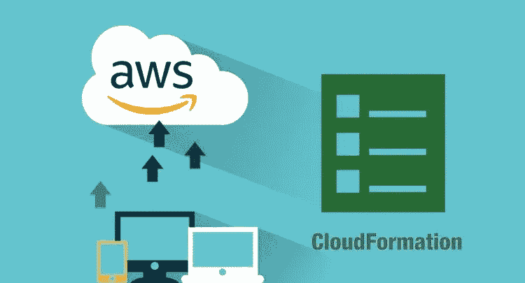

# 2023 年新手学习的 6 门最佳 AWS 云形成在线课程

> 原文：<https://medium.com/javarevisited/6-best-aws-cloudformation-online-courses-for-beginners-28156ceacf8c?source=collection_archive---------1----------------------->

## 我最喜欢的从 Udemy、Pluralsight 和 Coursera 学习 AWS CloudFormation 的在线课程 203

image_credit — udemy

如果你在 2023 年学习 AWS，并希望深入学习 AWS CloudFormation 服务，并寻找最好的在线培训课程，那么你来对地方了。之前，我已经分享了适合初学者的最佳 AWS 课程</javarevisited/5-best-aws-courses-for-beginners-and-experienced-developers-to-learn-in-2021-563212409fbd?source=rss-bb36d8439904------2&utm_source=dlvr.it&utm_medium=linkedin>**，今天我将分享深入学习 AWS CloudFormation 的最佳在线课程。**

**如果你不知道，亚马逊 *AWS CloudFormation 是 AWS 提供的一项服务，用于在一个地方管理你所有的应用程序资源。*如果您的应用程序使用许多服务，如 [Amazon EC2](https://javarevisited.blogspot.com/2020/08/top-5-courses-to-learn-amazon-aws-ec-2.html) 和 Amazon RDS 等等，因为分别管理它们会耗费您的时间，而且这将非常困难，尤其是对于复杂的应用程序基础架构。**

**您还知道吗，您可以使用一个 [JSON 文件](https://www.java67.com/2016/10/3-ways-to-convert-string-to-json-object-in-java.html)在 Amazon AWS CloudFormation 中创建一个模板，这是一个 JavaScript 对象符号，遵循 Amazon AWS CloudFormation 在一个地方管理您的所有资源的特定结构，没有任何额外的费用或成本，因为您只需为您使用的功能付费，而不是为使用 CloudFormation 付费。**

**你现在知道了什么是 Amazon AWS CloudFormation，如果你是一名 web 开发人员，有一个项目要部署在他们的服务器上，你可能想学习它，这篇文章将为你提供一些在线课程，让你轻松做到这一点。**

**这些 AWS CloudFormation 课程是从 [Udemy](/javarevisited/my-favorite-udemy-online-courses-for-programmers-and-software-engineers-f9d941dd0035) 、 [Pluralsight](https://javarevisited.blogspot.com/2020/08/top-10-pluralsight-courses-to-learn-React.js.html) 和 [Coursera](/javarevisited/18-coursera-courses-you-can-join-in-2020-to-learn-from-the-worlds-top-tech-companies-google-74af46967d1e?source=collection_home---4------0-----------------------) 等在线学习平台上挑选出来的课程。这些是由专家创建的，受到成千上万开发人员的信任，以深入学习 AWS 云的形成。你可以参加这个列表中的一到两个课程来更好地学习这个有用的 AWS 服务。**

# **2023 年初学者学习 AWS CloudFormation 的 6 大在线课程**

**在不浪费你更多时间的情况下，这里列出了 2023 年学习 AWS CloudFormation 服务的最佳在线培训课程。这些是*最佳 AWS CloudFormation 在线课程*，由专家创建，受到成千上万学习这一有用的 AWS 服务的人的信任。**

**它们也很实惠，尤其是 Udemy 的 [AWS 课程，你只需花 10 美元就能在不时举行的几次 Udemy 大减价中买到。](/javarevisited/top-10-courses-to-learn-amazon-web-services-aws-cloud-in-2020-best-and-free-317f10d7c21d)**

## **1. [AWS 云形成大师班](https://click.linksynergy.com/deeplink?id=JVFxdTr9V80&mid=39197&murl=https%3A%2F%2Fwww.udemy.com%2Fcourse%2Faws-cloudformation-master-class%2F)**

**对于任何初学者和从未使用过 amazon AWS CloudFormation 的人，以及想要学习和配置它、管理资源、使用参数等等的人，都可以参加这个 udemy 课程。

以下是您将在本课程中学到的重要知识:**

*   **自动气象站和云形成简介。**
*   **创建 YAML 配置文件。**
*   **如何利用云形成中的资源？**

**首先介绍什么是 AWS 和 CloudFormation，以及更多关于它们的概念。接下来是如何创建 YAML 文件配置、如何使用云形成参数以及资源映射输出条件等，您需要至少对 AWS 服务有一些基本的了解才能参加本课程。**

****以下是加入本课程** — [AWS 云信息大师班](https://click.linksynergy.com/deeplink?id=JVFxdTr9V80&mid=39197&murl=https%3A%2F%2Fwww.udemy.com%2Fcourse%2Faws-cloudformation-master-class%2F)的链接**

****

## **2.[使用 JSON 掌握 AWS CloudFormation 模板](https://click.linksynergy.com/deeplink?id=JVFxdTr9V80&mid=39197&murl=https%3A%2F%2Fwww.udemy.com%2Fcourse%2Fmastering-aws-cloudformation-templates-using-json%2F)**

**对于任何想要学习和实现其 amazon 中的模板 CloudFormation 来提供和管理基础设施的人来说，如何使用 JSON 文件的 AWS 服务可以注册这个 udemy 课程。

在本课程中，您将学到:**

*   **如何使用不同的亚马逊 AWS 服务？**
*   **添加和创建一个 JSON 文件。**
*   **部署 Lambda 函数。**

**您将学习如何使用许多亚马逊 AWS 服务，如 EC2、 [DynamoDB](https://www.java67.com/2020/08/top-5-courses-to-learn-aws-s3-and-dynamoDB-in-depth.html) 和 VPC，以及如何添加参数来配置它们，并创建一个 JSON 文件来处理所有事情，总之，这是您希望从这个简短的课程中学到的东西。**

****这里是加入本课程的链接**——[掌握 AWS 云信息模板](https://click.linksynergy.com/deeplink?id=JVFxdTr9V80&mid=39197&murl=https%3A%2F%2Fwww.udemy.com%2Fcourse%2Fmastering-aws-cloudformation-templates-using-json%2F)**

****

## **3.[自动气象站与云形成](https://pluralsight.pxf.io/c/1193463/424552/7490?u=https%3A%2F%2Fwww.pluralsight.com%2Fcourses%2Faws-automating-cloudformation)**

**管理亚马逊基础设施可能既困难又耗时，因此您需要一种方法来自动化您的服务，同时提高基础设施的质量并节省成本，而 Pluralsight 课程将教会您所有这些。**

**您首先要探索什么是 amazon CloudFormation，以及手动运行它和自动运行它之间的区别，然后编写一些代码来处理您的 Amazon AWS CloudFormation 配置，处理参数和许多其他主题，等等。

在本课程中，您将学到:**

*   **手动和自动化的区别。**
*   **更改基础设施内部的参数。**
*   **创建一些代码来自动化基础设施。**

****以下是参加本课程的链接** — [利用云信息实现自动气象站自动化](https://pluralsight.pxf.io/c/1193463/424552/7490?u=https%3A%2F%2Fwww.pluralsight.com%2Fcourses%2Faws-automating-cloudformation)**

****

**顺便说一下，你需要一个 Pluralsight 会员才能参加这个课程，费用大约是每月 29 美元或每年 299 美元(14%的折扣)。我向所有程序员强烈推荐这个订阅，因为它提供了超过 7000 个在线课程的即时访问，以学习任何技术技能。或者，你也可以使用他们的 [**10 天免费通行证**](https://pluralsight.pxf.io/c/1193463/424552/7490?u=https%3A%2F%2Fwww.pluralsight.com%2Flearn) 免费观看本课程。**

**<https://pluralsight.pxf.io/c/1193463/424552/7490?u=https%3A%2F%2Fwww.pluralsight.com%2Flearn> ** 

## **4.[自动气象站云形成—简化| YAML 实践](https://click.linksynergy.com/deeplink?id=JVFxdTr9V80&mid=39197&murl=https%3A%2F%2Fwww.udemy.com%2Fcourse%2Faws-cloudformation-simplified-hands-on-learning%2F)**

**这个课程可能是你在网上找到的最全面的课程，涵盖了从初级到高级的亚马逊 AWS Cloudformation 入门所需的所有内容。

在本课程中，您将学到:**

*   **CloudForamation 简介。**
*   **如何使用 YAML 文件？**
*   **管理 AWS 服务中的资源。**

**您将了解什么是 AWS CloudFormation 及其相关概念，然后了解什么是 YAML 以及如何管理 EC2 等 AWS 服务中的资源，并了解 [AWS 服务](/javarevisited/10-best-aws-certified-cloud-practitioner-clf-c01-online-courses-and-practice-test-to-crack-ecc0f913091e)的参数和映射条件输出元数据 EC2 用户数据，以及您将在本课程中看到的更多主题。**

****这里是加入这个在线课程的链接**——[AWS cloud formation——简体](https://click.linksynergy.com/deeplink?id=JVFxdTr9V80&mid=39197&murl=https%3A%2F%2Fwww.udemy.com%2Fcourse%2Faws-cloudformation-simplified-hands-on-learning%2F)**

****

## **5.[用 AWS CloudFormation 构建架构](https://click.linksynergy.com/deeplink?id=JVFxdTr9V80&mid=39197&murl=https%3A%2F%2Fwww.udemy.com%2Fcourse%2Fbuilding-architectures-with-aws-cloudformation%2F)【Udemy】**

**最后一个建议课程是为那些想用 amazon CloudFormation 构建一个架构并自动化部署过程的人准备的。

在本课程中，您将学到:**

*   **了解什么是云的形成。**
*   **自动化部署。**
*   **如何使用 CloudFormation 设计器？**

**您将看到如何创建计费警报，探索什么是 CloudFormation 以及模板和该基础设施的设计，您将在 CloudFormation designer 中设计一个 [web 服务](https://javarevisited.blogspot.com/2018/02/top-5-restful-web-services-with-spring-courses-for-experienced-java-programmers.html)等等。**

****这是加入本课程的链接** — [使用 AWS CloudFormation 构建架构](https://click.linksynergy.com/deeplink?id=JVFxdTr9V80&mid=39197&murl=https%3A%2F%2Fwww.udemy.com%2Fcourse%2Fbuilding-architectures-with-aws-cloudformation%2F)**

****

## **6.[AWS 的好的部分:穿过混乱](https://www.educative.io/courses/good-parts-of-aws?affiliate_id=5073518643380224)【教育性】**

**这不是一门普通的 AWS 课程，这是一门不同的课程，这也是我把它列入这个列表的原因。你不会在 AWS 文档中找到这里分享的大部分知识。**

**这里的目标是帮助你认识到不使用 AWS 的哪些功能是愚蠢的——这些功能已经通过了时间的考验，是互联网上大多数东西的支柱。**

**本课程由前亚马逊工程师 Daniel Vassallo 创建，他在 AWS 方面有超过 15 年的实践经验。他先写了一本书，[**AWS**](https://gumroad.com/a/703100019/MsVlG)的好的部分，然后为了更互动的体验而创作了这个课程。**

**在本课程中，你将学习一种技术，这种技术可以帮助你做出可靠的技术选择，而不会在面对如此多的选择时手足无措。你将从浏览 AWS 提供的最基本的服务开始，比如 DynamoDB、S3、EC2。每一部分都详细说明了它的用法、优缺点、为什么应该(或不应该)使用它，等等。**

**它还有一章是关于 AWS 云形成的，将教你如何部署云形成堆栈。**

****这里是加入本课程的链接**—[AWS 的精彩部分](https://www.educative.io/courses/good-parts-of-aws?affiliate_id=5073518643380224)**

****

**而且，如果你觉得教育平台和他们的互动课程很有用，那么你还可以获得 [**教育订阅**](https://www.educative.io/subscription?affiliate_id=5073518643380224) ，每月只需 14.9 美元，不仅可以访问本课程，还可以访问他们的 100 多门课程。它非常划算，非常适合获得一些实践学习经验。**

**<https://www.educative.io/subscription?affiliate_id=5073518643380224>  

以上是为初学者和有经验的开发人员提供的学习 AWS CloudFormation 的最佳在线课程。如果你想深入学习 AWS CloudFormation，你可以选择几门课程组成这个列表，你会处于一个更好的位置。

你可能喜欢的其他 AWS 在线课程

*   [破解 AWS DevOps 工程师考试的前 5 门课程](https://javarevisited.blogspot.com/2020/04/top-5-course-to-crack-aws-certified-devops-engineer-professional-exam-certification.html)
*   [5 免费 AWS 解决方案架构师助理实践测试，转储](https://javarevisited.blogspot.com/2019/08/top-5-free-aws-solution-architect-Associate-certification-dumps-practice-questions.html)
*   [成为 AWS DevOps 工程师专家的 5 门课程](https://javarevisited.blogspot.com/2020/04/top-5-course-to-crack-aws-certified-devops-engineer-professional-exam-certification.html)
*   [破解 AWS 解决方案架构师专业考试前 5 门课程](https://javarevisited.blogspot.com/2020/04/top-5-course-to-crack-aws-solution-architect-professional-sap-c01-certification-exam.html)
*   [如何通过 AWS 解决方案架构师助理考试](https://www.java67.com/2020/04/how-to-paas-aws-certified-solution-architect-exam-in-2020.html)
*   [面向 Java 开发人员的五大 AWS 和云课程](https://javarevisited.blogspot.com/2020/05/top-5-cloud-courses-for-java-and-spring-boot-developers.html)
*   [通过 AWS 认证开发人员助理考试的前 5 门课程](https://javarevisited.blogspot.com/2020/05/top-5-courses-to-crack-aws-certified-developer-associate-certification-exam.html)
*   [学习亚马逊网络服务的 5 门免费课程](https://www.java67.com/2018/05/top-5-amazon-web-services-or-aws-courses-to-learn-online.html)
*   [破解 AWS 解决方案架构师助理认证的前 5 门课程](/javarevisited/top-5-aws-training-courses-to-crack-amazon-web-service-solutions-architect-associate-certification-3f4affa8f660?source=collection_home---4------0-----------------------)
*   [成为 AWS 开发人员助理的前 5 名实践测试](https://javarevisited.blogspot.com/2020/07/top-5-aws-certified-developer-associate-practice-tests-mock-exams.html)
*   [学习 GCP 云认证的前 5 门课程](https://javarevisited.blogspot.com/2019/07/top-5-google-cloud-platform-gcp-courses-certifications-online.html)
*   [成为 AWS 解决方案架构师专家的前 5 门课程](https://javarevisited.blogspot.com/2020/04/top-5-course-to-crack-aws-solution-architect-professional-sap-c01-certification-exam.html)
*   [AWS 云从业者的五大模拟测试和考试转储(CLF-C01](https://javarevisited.blogspot.com/2020/03/top-5-aws-certified-cloud-practitioner-mock-test-practice-questions.html) )
*   [如何通过 Azure 基础知识考试(AZ-900)](https://javarevisited.blogspot.com/2020/04/how-to-crack-microsoft-azure-fundamentals-certification-az-900-exam.html)
*   [初学者和有经验的开发人员学习 AWS 的 5 大课程](https://javarevisited.blogspot.com/2020/05/top-5-amazon-web-services-aws-courses-for-beginners-and-experienced-programmers.html)
*   [我最喜欢的深入学习 AWS 的课程](/javarevisited/top-10-courses-to-learn-amazon-web-services-aws-cloud-in-2020-best-and-free-317f10d7c21d)
*   [通过 AWS 云从业者考试的 5 门最佳课程](https://javarevisited.blogspot.com/2020/02/top-5-courses-to-crack-aws-certified-cloud-practitioner-exam-certification-clf-c01.html)
*   [如何准备 AWS 解决方案架构师认证](/javarevisited/top-10-courses-to-learn-amazon-web-services-aws-cloud-in-2020-best-and-free-317f10d7c21d)
*   [初学者学习 AWS Quicksight 的 5 大课程](https://javarevisited.blogspot.com/2020/08/top-5-courses-to-learn-amazon-aws-quicksight.html)

**P. S.** —如果你热衷于学习 AWS 并寻找免费的在线培训课程，那么你也可以在 Udemy 上查看 Linux Academy 的这个 [**AWS 基础知识**](https://click.linksynergy.com/deeplink?id=JVFxdTr9V80&mid=39197&murl=https%3A%2F%2Fwww.udemy.com%2Fcourse%2Flinux-academy-aws-essentials-2019%2F) 课程。这个课程是完全免费的，你只需要一个 Udemy 帐户就可以加入这个课程。

<https://click.linksynergy.com/deeplink?id=JVFxdTr9V80&mid=39197&murl=https%3A%2F%2Fwww.udemy.com%2Fcourse%2Flinux-academy-aws-essentials-2019%2F> **