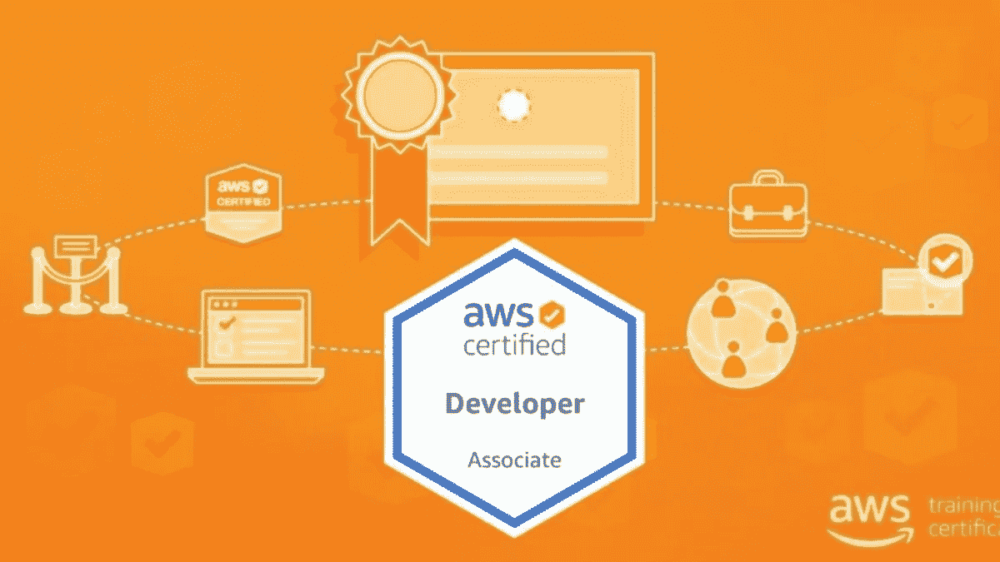
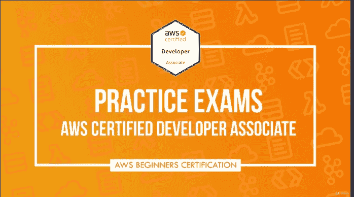
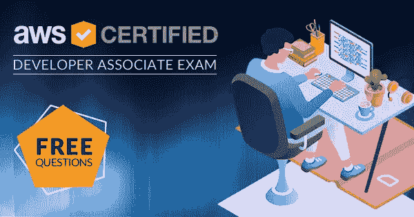
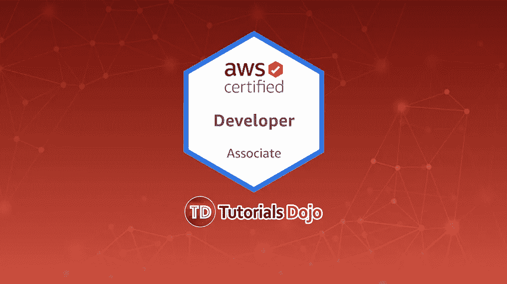
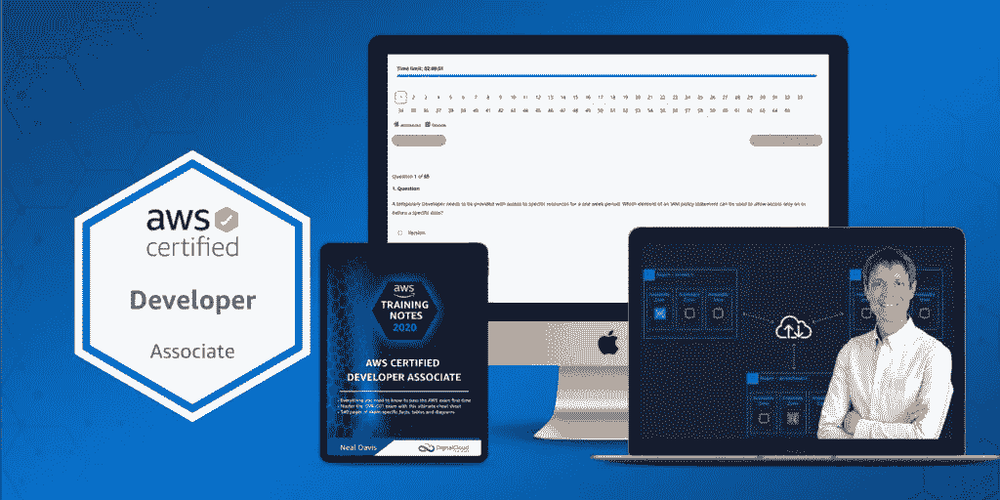
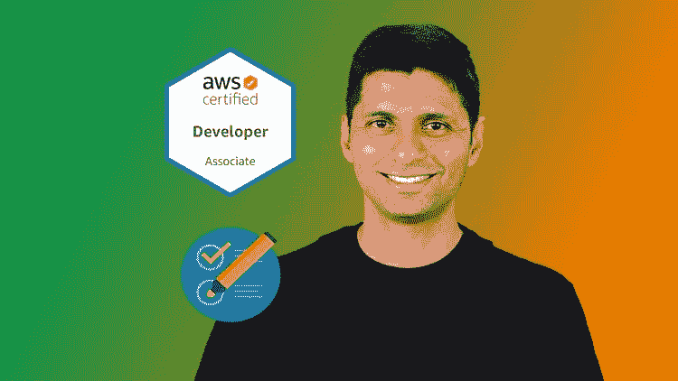

# 6 2023 年最佳 AWS 开发人员助理(DVA-C002)认证实践测试、模拟考试和转储

> 原文：<https://medium.com/javarevisited/6-best-aws-developer-associate-dva-c001-certification-practice-test-mock-exams-and-dumps-9e24573f509a?source=collection_archive---------0----------------------->

## 1600 多个练习题和转储，为 2023 年的 AWS 开发人员助理认证做准备。

image_credit — udemy

你好，伙计们，如果你的目标是在 2023 年破解 AWS 开发者助理认证，并寻找最好的资源，那么你来对地方了。早些时候，我已经分享了 [**最佳 AWS 开发人员助理认证课程**](/javarevisited/top-5-online-courses-to-become-aws-certified-developer-associate-in-2020-best-of-lot-9b22baf84ca8) ，在这篇文章中，我将分享最佳实践问题、模拟考试和转储，以建立您第一次尝试通过考试所需的速度和准确性。

我已经多次说过，练习题和模拟测试是通过 AWS 认证不可或缺的一部分，无论是 [AWS 解决方案架构师](https://javarevisited.blogspot.com/2019/08/how-to-crack-aws-certified-solution-architect-exam.html)还是本次 [AWS 开发人员助理](https://javarevisited.blogspot.com/2020/05/top-5-courses-to-crack-aws-certified-developer-associate-certification-exam.html)考试。

它们不仅可以帮助你在有时间限制的考试环境中做好准备，还可以强化和巩固你从在线课程、书籍、教程和白皮书中学到的知识。

不管你是否参加了像 Udemy 上的**夏羽·马瑞克的** [**AWS 开发者课程**](https://click.linksynergy.com/deeplink?id=JVFxdTr9V80&mid=39197&murl=https%3A%2F%2Fwww.udemy.com%2Fcourse%2Faws-certified-solutions-architect-associate-saa-c02%2F) **这样的 AWS 开发者课程，除非你练习了足够多的问题，否则你并没有真正为考试做好准备。**

我的读者，经常问我*哪个 AWS 开发者实践测试最好？*我是不是应该去一个考场转储？在参加 AWS 开发人员助理考试等之前，我应该解决多少模拟测试？

面对互联网上满天飞的这么多模拟测试和练习题，选择一个正确的变得非常困难，而这正是本文将帮助你的地方。如果你坚持低质量的模拟测试，那么你就不会像模拟测试显示的那样为考试做好准备，这种脱节可能会让你失去第一次通过考试的机会。

记住，**你需要取得 76%的分数才能通过这个 AWS 认证**我见过很多人因为一两个错误而没有通过考试的案例。通过选择高质量的练习测试，你可以避免这种错误。

重要的是要记住，仅仅知道特定 AWS 服务的用途是不够的*，如果你想通过考试，你必须知道如何根据给定的场景选择最合适的 AWS 服务。这些模拟测试提出了这种类型的问题来训练你的思维以应对真正的考试。

在本文中，我们将分享一些 [*AWS 认证开发人员助理模拟考试*](https://javarevisited.blogspot.com/2020/09/how-to-crack-aws-certified-developer-associate-certification-exam.html) 的最佳模拟考试和练习题。这些练习题经过了许多成功通过 AWS 开发人员助理考试的云专业人员的反复测试。*

# *AWS 开发人员助理认证的 6 个最佳模拟测试和练习题*

*为了不浪费您的时间，这里有一个最佳实践测试和模拟考试的列表，您可以在线参加，为 AWS Certified Developer Associate 考试做准备。*

*我强烈建议你进行尽可能多的模拟测试，以提高高分通过考试所需的速度和准确性。一旦你开始连续在这些考试中达到 80%的分数，你就可以参加真正的考试了。*

## *1.[实践考试| AWS 认证开发人员助理 2023](https://click.linksynergy.com/deeplink?id=JVFxdTr9V80&mid=39197&murl=https%3A%2F%2Fwww.udemy.com%2Fcourse%2Faws-certified-developer-associate-practice-tests-dva-c01%2F)【325 道题】*

*这是您准备 AWS 开发人员助理考试时可以参加的最新、最有用的模拟测试之一。这个模拟测试是由夏羽·马瑞克创建的，他是我最喜欢的 Udemy 导师之一，也是一名 AWS 专家，他自己已经以优异的成绩通过了大部分 AWS 认证。* 

***以下是参加本次考试的链接** — [模拟考试| AWS 认证开发人员助理 2023](https://click.linksynergy.com/deeplink?id=JVFxdTr9V80&mid=39197&murl=https%3A%2F%2Fwww.udemy.com%2Fcourse%2Faws-certified-developer-associate-practice-tests-dva-c01%2F)*

**

*谈到社会证明，这项实践测试已经得到了 24，000 多名 AWS 认证申请人的信任，并且在近 1000 名参与者中平均获得了 4.7 分，这简直令人惊叹。*

*如果你不知道，夏羽已经完成了所有的 AWS 认证，我记得他在 AWS SysOps 考试中取得了大约 980/1000 的成绩，这简直太棒了。*

*为了更好地准备，您还可以将本模拟测试与[**2023 年 AWS 认证开发者助理终极版结合使用—新！**](https://click.linksynergy.com/deeplink?id=JVFxdTr9V80&mid=39197&murl=https%3A%2F%2Fwww.udemy.com%2Fcourse%2Faws-certified-developer-associate-dva-c01%2F) 课程由同一讲师授课。这将有助于您在第一次尝试时就通过这项有价值的 AWS 认证。*

* [## 终极 AWS 认证开发人员助理 2023 -新！

### S3 部分已完全重新录制，以适应 AWS 用户界面的变化…

udemy.com](https://click.linksynergy.com/deeplink?id=JVFxdTr9V80&mid=39197&murl=https%3A%2F%2Fwww.udemy.com%2Fcourse%2Faws-certified-developer-associate-dva-c01%2F)* 

## *2. [Whizlab 的 AWS 认证开发人员实践测试](https://shrsl.com/25qjc)【745 道题】*

*说到实践考试和模拟考试模拟器，我去 Whizlabs 和 AWS 认证没有什么不同。在过去的 10 年里，我一直在使用 Whizlabs 测试，它帮助我通过了几个在线认证，尤其是 Java 和 AWS。

他们的问题质量上乘，与实际考试的难度水平相匹配(大多超过)。这意味着如果你在他们的模拟测试中获得 80%的分数，那么你更有可能在真实的考试工具中获得 80+的分数。

这也是最全面的 AWS 认证开发者实践测试之一，包含 **745 个独特问题**，分为 12 个全程模拟考试。问题根据最新的教学大纲重新更新，它还包含一个基于客观的实践测试。他们的模拟测试最好的部分是它有一个适当的解释，这样你就知道为什么正确的答案是正确的，为什么错误的答案是不正确的。他们还提供有用的报告，以便你可以评估自己的强项和弱项，并在真正考试前加以改进。*

***以下是参加本次模拟测试** — [Whizlab 的 AWS 认证开发人员模拟测试](https://shrsl.com/25qjc)的链接*

**

*如果你想在第一次尝试中通过 AWS 开发人员助理认证，并想获得更好的分数，那么 O 强烈建议你通过 Whizlabs AWS 开发人员助理实践测试。*

*费用不高，不到 20 美元就能拿到，这比实际认证的费用要低得多。他们还有一个 [**免费的 AWS 开发人员助理实践测试**](https://shrsl.com/25qj9) ，你可以在购买全长测试之前尝试一下。*

## *3. [David Mayer 的 AWS 开发人员助理认证考试转储](https://www.certification-questions.com/practice-exam/amazon/aws-certified-developer-associate?affiliateCode=fcff36fd-557a-4713-abf6-973e9924770f&utm_source=Javin&utm_medium=affiliate&utm_campaign=affiliate)【302 个问题】*

*考试转储在 AWS 认证准备中也有独特的作用。虽然许多人滥用考试转储，只是匆匆过目这些问题，希望它们会在实际考试中重复，但你可以从它们身上学到很多东西，因为它们是上一次考试的实际问题。

你可以使用考试转储来查找问题的类型、难度以及棘手和混乱的问题。你也可以找到它们来发现从考试的角度来看更重要的模式和主题。我不建议你死记硬背这些问题，但要小心使用它们来充分证明你的准备。

说到考试垃圾，大卫·梅尔的《certification-questions.com》是最好的收集。在他们的 AWS 开发人员助理考试转储中，您会发现过去考试中的 302 个问题。*

***这里是参加这个模拟测试的链接**——[大卫·梅尔的 AWS 开发者助理认证转储](https://www.certification-questions.com/practice-exam/amazon/aws-certified-developer-associate?affiliateCode=fcff36fd-557a-4713-abf6-973e9924770f&utm_source=Javin&utm_medium=affiliate&utm_campaign=affiliate)*

**

*你可以将这个例子与[夏羽·马瑞克的 AWS 在线课程](https://click.linksynergy.com/deeplink?id=JVFxdTr9V80&mid=39197&murl=https%3A%2F%2Fwww.udemy.com%2Fcourse%2Faws-certified-solutions-architect-associate-saa-c02%2F)和 [Whizlabs 的考试模拟器](https://shrsl.com/25qjc)一起使用，以更好地准备你的 AWS 开发人员助理认证(DVA-C01)考试。*

## *4. [AWS 认证开发人员助理实践考试](https://click.linksynergy.com/deeplink?id=JVFxdTr9V80&mid=39197&murl=https%3A%2F%2Fwww.udemy.com%2Fcourse%2Faws-certified-developer-associate-practice-exams-amazon%2F)【260 道题】*

*除了夏羽·马雷克的课程和实践考试，Udemy 还有许多其他亚马逊 AWS 开发人员助理考试的实践考试，其中之一是 Jon Bonso 和 Tutorial 的 Dojo 实践考试。*

*他们还为 AWS 认证提供高质量的实践测试，如 [AWS 解决方案架构](https://javarevisited.blogspot.com/2019/08/top-5-free-aws-solution-architect-Associate-certification-dumps-practice-questions.html) t、[系统运营管理员](https://javarevisited.blogspot.com/2020/06/top-5-aws-certified-sysops-admin-associate-certification-exam.html)、[云从业者](https://javarevisited.blogspot.com/2020/03/top-5-aws-certified-cloud-practitioner-mock-test-practice-questions.html)，当然还有 AWS 开发者协会考试。

在本课程中，您将看到 260 道 AWS 认证开发人员助理实践测试题，分为 4 组，每组 65 道题。您可以将它们用作全长测试，以评估您的速度和准确性水平，或者提高您的学习水平，因为它们附有详细的解释和进一步学习的链接。

每个 AWS 模拟测试都有 65 个独特的问题和 130 分钟的时间限制，这与实际考试非常相似，如果您在合适的环境下进行这些模拟测试，如安静的房间和严格的时间限制，您将能够看到您是否为实际考试做好准备。*

***以下是参加本练习考试** — [AWS 认证开发人员助理练习考试](https://click.linksynergy.com/deeplink?id=JVFxdTr9V80&mid=39197&murl=https%3A%2F%2Fwww.udemy.com%2Fcourse%2Faws-certified-developer-associate-practice-exams-amazon%2F)的链接*

**

*TutorialsDojo AWS 开发人员助理实践测试的另一个好处是，他们不断更新他们的问题，以与 AWS 不断变化的考试主题保持同步。*

*他们有一个专门的团队来定期更新他们的题库，主要是基于学生对实际考试中出现的内容的反馈，以及通过外部基准测试。

如果你的目标是在 A [WS 开发人员助理考试中获得 1000/1000 分](https://www.java67.com/2020/08/top-5-free-courses-to-pass-aws-developer-associate-certification.html)，那么我强烈建议你在 Jon Bonso 的 AWS 开发人员助理实践考试中解决问题。*

## *5. [AWS 认证开发者助理实践考试试题](https://click.linksynergy.com/deeplink?id=JVFxdTr9V80&mid=39197&murl=https%3A%2F%2Fwww.udemy.com%2Fcourse%2Faws-developer-associate-practice-exams%2F)【390 题】*

*虽然 Udemy 有许多 AWS 实践测试，但并不是所有的都是高质量的，许多只是测试你对特定 AWS 服务的了解，而不是训练你为给定的需求选择最合适的 AWS 服务。坚持这些练习测试很容易浪费你宝贵的时间和金钱，这就是为什么我们建议选择像尼尔·戴维斯的 AWS 开发人员助理练习测试这样久经考验的练习测试。

与夏羽·马瑞克的[终极 AWS 认证开发者助理 2023](https://click.linksynergy.com/deeplink?id=JVFxdTr9V80&mid=39197&murl=https%3A%2F%2Fwww.udemy.com%2Fcourse%2Faws-certified-developer-associate-dva-c01%2F) 和 TutorialsDojo 一起，这是我在 Udemy 上发现有用的另一个 AWS 开发者实践测试。它包含 6 个练习测试中超过 390 个独特的 AWS 问题，并附有详细的呼气和进一步学习的链接。

他们的题比较难，模仿真题。如果你在寻找简单的练习题，那么这个测试不适合你。本模拟考试包含高质量的问题，这些问题只有在彻底理解关键 AWS 概念的情况下才能解决。*

***以下是参加 AWS 开发人员实践考试** — [AWS 认证开发人员助理实践考试问题](https://click.linksynergy.com/deeplink?id=JVFxdTr9V80&mid=39197&murl=https%3A%2F%2Fwww.udemy.com%2Fcourse%2Faws-developer-associate-practice-exams%2F)的链接*

**

*您可以使用本模拟测试来最大化您第一次通过 AWS 开发人员助理认证的机会，并节省重试的时间和金钱。*

*如果你喜欢书，尼尔也把这些练习题放到了亚马逊上，你可以在那里买到。您还可以访问在线考试模拟器。*

*这里是访问书籍和模拟器的链接——一个 [WS 练习测试和模拟器](https://www.amazon.com/Certified-Developer-Associate-Practice-Tests/dp/B08B3B3CGK?tag=javamysqlanta-20)*

## *6. [AWS 认证开发人员助理考试—模拟测试 2023](https://click.linksynergy.com/deeplink?id=JVFxdTr9V80&mid=39197&murl=https%3A%2F%2Fwww.udemy.com%2Fcourse%2Faws-certified-developer-associate-practice-tests-5%2F)*

*对于准备 2023 年 AWS 认证开发者考试的人来说，这是另一个很好的实践测试。由最畅销的 Udemy 讲师之一 Ranga Karnam 创建的这个模拟测试涵盖了 AWS 开发人员认证考试(AWS 认证开发人员助理)的 5 个模拟测试和 300 个考试问题。*

*这些模拟测试有助于评估您对 AWS 认证开发人员助理的准备情况。找出你的弱项，并更加专注于它们。*

*这些模拟测试基于我们的 AWS 认证开发人员助理—步骤和步骤以及考试复习— AWS 认证开发人员助理课程的内容。然而，这些课程并不是本课程的先决条件。*

***这里是参加本次 AWS 模拟考试**——[AWS 认证开发者助理考试——模拟考试 2023](https://click.linksynergy.com/deeplink?id=JVFxdTr9V80&mid=39197&murl=https%3A%2F%2Fwww.udemy.com%2Fcourse%2Faws-certified-developer-associate-practice-tests-5%2F) 的链接*

**

*这个模拟测试最大的好处是它有非常详细的解释。每个问题都包括对所有正确和错误答案的详细解释*

*Ranga 还提供 AWS 考试复习课程，如 [**考试复习— AWS 认证解决方案架构师助理、**](https://click.linksynergy.com/deeplink?id=JVFxdTr9V80&mid=39197&murl=https%3A%2F%2Fwww.udemy.com%2Fcourse%2Fexam-aws-certified-solution-architect-associate%2F) ，这是一门 6 小时的短期课程，专门针对考试准备和复习。*

*这就像 AWS 开发人员助理认证考试的速成课程，您将在 6 个小时内复习考试所需的所有知识。对于想要快速复习 AWS 认证解决方案架构师助理考试的有经验的 AWS 开发人员来说，这是非常好的。*

* [## 考试复习- AWS 认证解决方案架构师助理

### Ranga 是 AWS 认证解决方案架构师助理、AWS 认证开发人员助理和 AWS 认证云…

udemy.com](https://click.linksynergy.com/deeplink?id=JVFxdTr9V80&mid=39197&murl=https%3A%2F%2Fwww.udemy.com%2Fcourse%2Fexam-aws-certified-solution-architect-associate%2F) 

以上是为代码为 DVA-C01 的 AWS 认证开发人员助理考试做准备的一些**最佳模拟测试和实践考试。这些练习题不仅会在一个有时间限制的环境中测试你的技能，还会帮助你发现自己的强项和弱项。

你还可以用它们来强化和巩固你的知识，并接触一些鲜为人知的考试题目，这些题目是许多云开发人员通常不会准备的。不要参加真正的考试，直到你在这些模拟测试中的分数持续超过 80%。这将提高你第一次通过考试的机会，节省时间和金钱。我还想告诉你，亚马逊网络服务也提供[模拟考试](https://www.aws.training/certification?src=cert-prep)以便你可以在一个有时间限制的环境中在线测试你的知识，但是它们比这些考试更贵。如果你负担得起，无论如何，你也应该去参加那些模拟考试。

您可能想了解的其他 **AWS 认证资源****

*   [如何破解 AWS 解决方案架构师助理考试](https://javarevisited.blogspot.com/2019/08/how-to-crack-aws-certified-solution-architect-exam.html)
*   [破解 AWS 解决方案架构师助理认证的前 5 门课程](https://javarevisited.blogspot.com/2019/05/top-5-courses-to-crack-aws-solutions-architect-associate-certification-exam-SAA-C01.html#axzz5rHwAwycj)
*   [面向 Java 开发人员的五大 AWS 和云课程](https://javarevisited.blogspot.com/2020/05/top-5-cloud-courses-for-java-and-spring-boot-developers.html)
*   [我最喜欢的深入学习 AWS 的课程](/javarevisited/top-10-courses-to-learn-amazon-web-services-aws-cloud-in-2020-best-and-free-317f10d7c21d)
*   [破解 AWS 认证开发人员助理考试的 5 大课程](https://javarevisited.blogspot.com/2020/05/top-5-courses-to-crack-aws-certified-developer-associate-certification-exam.html)
*   [学习亚马逊网络服务的 5 门免费课程](https://www.java67.com/2018/05/top-5-amazon-web-services-or-aws-courses-to-learn-online.html)
*   [破解 AWS DevOps 工程师考试的前 5 门课程](https://javarevisited.blogspot.com/2020/04/top-5-course-to-crack-aws-certified-devops-engineer-professional-exam-certification.html)
*   [破解 AWS 解决方案架构师专业考试的前 5 门课程](https://javarevisited.blogspot.com/2020/04/top-5-course-to-crack-aws-solution-architect-professional-sap-c01-certification-exam.html)
*   [学习 GCP 云认证的前 5 门课程](https://javarevisited.blogspot.com/2019/07/top-5-google-cloud-platform-gcp-courses-certifications-online.html)
*   [如何通过 Azure 基础知识考试(AZ-900)](https://javarevisited.blogspot.com/2020/04/how-to-crack-microsoft-azure-fundamentals-certification-az-900-exam.html)
*   [初学者和有经验的开发人员学习 AWS 的 5 大课程](https://javarevisited.blogspot.com/2020/05/top-5-amazon-web-services-aws-courses-for-beginners-and-experienced-programmers.html)
*   [5 次免费的 AWS 解决方案架构师助理实践测试、转储和模拟考试](https://javarevisited.blogspot.com/2019/08/top-5-free-aws-solution-architect-Associate-certification-dumps-practice-questions.html)
*   [成为 AWS DevOps 工程师专家的 5 门课程](https://javarevisited.blogspot.com/2020/04/top-5-course-to-crack-aws-certified-devops-engineer-professional-exam-certification.html)
*   [成为 AWS 解决方案架构师专家的前 5 门课程](https://javarevisited.blogspot.com/2020/04/top-5-course-to-crack-aws-solution-architect-professional-sap-c01-certification-exam.html)
*   [AWS 云从业者(CLF-C01)前 5 名模拟测试和考试转储](https://javarevisited.blogspot.com/2020/03/top-5-aws-certified-cloud-practitioner-mock-test-practice-questions.html)
*   [通过 AWS 云从业者考试的 5 门最佳课程](https://javarevisited.blogspot.com/2020/02/top-5-courses-to-crack-aws-certified-cloud-practitioner-exam-certification-clf-c01.html)
*   [如何准备 AWS 解决方案架构师认证](/javarevisited/top-10-courses-to-learn-amazon-web-services-aws-cloud-in-2020-best-and-free-317f10d7c21d)

感谢您阅读本文。如果你喜欢这些 *WS Cloud Developer Associate 模拟测试和练习题*并发现它对通过考试很有用，那么请与你的朋友和同事分享。如果您有任何问题或反馈，请留言。

**【p . s .】**—如果您渴望通过 AWS 认证开发人员助理认证，但负担不起这些资源，而不是寻找免费资源来准备这一享有盛誉的认证，那么您也可以在 Udemy 上查看此免费 AWS 开发人员助理培训**。**

** [## 免费亚马逊 AWS 教程- AWS 开发人员助理培训

### 当今的组织正在拥抱云。根据赛门铁克发布的报告，2016 年，大约 26%的…

udemy.com](https://click.linksynergy.com/deeplink?id=JVFxdTr9V80&mid=39197&murl=https%3A%2F%2Fwww.udemy.com%2Fcourse%2Faws-developer-associate-training%2F) 

这是完全免费的，你只需要一个 Udemy 帐户就可以参加这个 AWS 培训课程。***