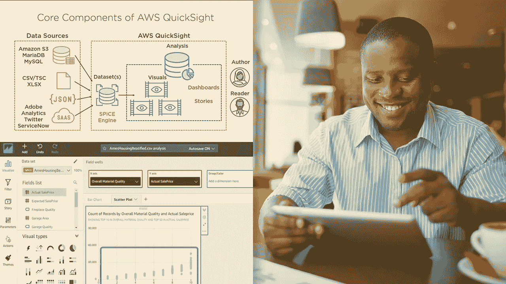
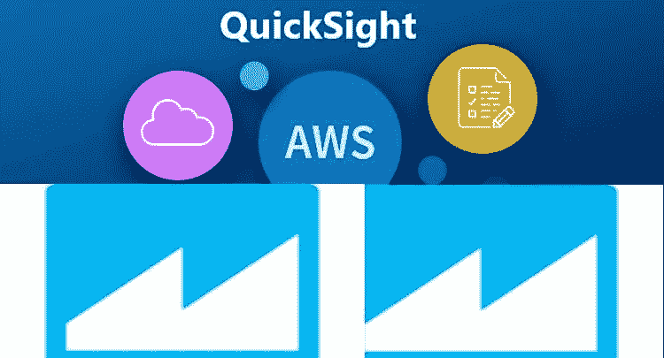

# 2023 年适合初学者参加的 6 门最佳 AWS QuickSight 在线课程

> 原文：<https://medium.com/javarevisited/6-best-aws-quicksight-courses-for-beginners-f34d53d7a262?source=collection_archive---------0----------------------->

## 我最喜欢的在线课程，学习 AWS Quicksight 的认证和日常使用。它包含来自 Udemy 和 Pluralsight 等网站的最佳 AWS Quicksight 课程。

如果你想学习 AWS Quicksight 并寻找最好的在线课程，那么你来对地方了。早些时候，我已经分享了[最佳 AWS 课程](/javarevisited/5-best-aws-courses-for-beginners-and-experienced-developers-to-learn-in-2021-563212409fbd?source=rss-bb36d8439904------2&utm_source=dlvr.it&utm_medium=linkedin)和学习基本 AWS 服务的深入课程，如 [EC2](/javarevisited/7-best-aws-ec2-amazon-elastic-compute-cloud-online-courses-for-beginners-in-2021-f7a1a55ea719?source=rss-bb36d8439904------2) 和 [DynamoDB](/javarevisited/7-best-aws-s3-and-dynamodb-courses-for-beginners-in-2021-a8a44b6066da) ，在本文中，我将分享 2023 年学习 AWS Quicksight 的最佳在线培训课程和课程。

*披露—顺便说一句，其中一些链接是附属链接，如果你使用我的链接加入这些课程，我可能会得到报酬。*

如果您正在使用 AWS，那么您可能听说过 AWS Quicksight 工具。Amazon AWS Quicksight 是一款基于云的快速商业智能工具，可以对您的数据以及您的应用程序使用的 AWS 资源进行分析并制作仪表盘和图表，因此它将它们合并到一个仪表盘中，以获得对您数据的更多洞察。

这些在线课程是从像<https://click.linksynergy.com/fs-bin/click?id=JVFxdTr9V80&offerid=323058.9410&type=3&subid=0>**[**plural sight**](https://pluralsight.pxf.io/c/1193463/424552/7490?u=https%3A%2F%2Fwww.pluralsight.com%2Flearn)和 [**Coursera**](https://coursera.pxf.io/c/3294490/1164545/14726?u=https%3A%2F%2Fwww.coursera.org%2F) 这样的网站中挑选出来的，是由专家创建的，受到成千上万开发者的信任。您可以在办公室或家里使用它们来学习 AWS Quicksight，并且可以按照自己的时间表来学习。

这项基于云的服务有一些有用的功能，肯定会让你受益，比如从文件或数据库(如 [MySQL 服务器](/javarevisited/top-5-courses-to-learn-mysql-in-2020-4ffada70656f))以及你使用过的 AWS 资源导入数据的能力。

如果您已经在 Amazon [AWS](https://aws.amazon.com/) 上部署了您的应用程序，并且您想要可视化您所使用的资源的数据或您自己的数据，您可以继续阅读在线课程的文章，这些课程将教您如何使用这项基于云的服务。**

**如果您需要涵盖所有基本 AWS 服务并帮助您成为解决方案架构师的综合课程，那么我强烈推荐夏羽·马瑞克在 Udemy 上的 [**终极 AWS 认证解决方案架构师助理 2023**](https://click.linksynergy.com/deeplink?id=JVFxdTr9V80&mid=39197&murl=https%3A%2F%2Fwww.udemy.com%2Fcourse%2Faws-certified-solutions-architect-associate-saa-c02%2F) 课程。夏羽·马瑞克刚刚被公认为 AWS 的英雄，他的课程是深入学习 AWS 的最佳材料。**

**<https://click.linksynergy.com/deeplink?id=JVFxdTr9V80&mid=39197&murl=https%3A%2F%2Fwww.udemy.com%2Fcourse%2Famazon-aws-quicksight-getting-started%2F>  

# 2023 年初学者学习 AWS QuickSight、Glue 和 Athena 的 6 门最佳课程

为了不浪费您的时间，这里列出了一些最好的在线培训课程，您可以参加这些课程来详细了解 AWS QuickSight 服务。这些培训课程由专家创建，受到全球成千上万开发人员的信任。

这些课程也很实惠，尤其是 Udemy 的课程，你只需花 10 美元就能在不时举行的几次 Udemy 大减价中买到。

## 1.[亚马逊(AWS)快速入门](https://click.linksynergy.com/deeplink?id=JVFxdTr9V80&mid=39197&murl=https%3A%2F%2Fwww.udemy.com%2Fcourse%2Famazon-aws-quicksight-getting-started%2F)

适用于数据分析师或 web 开发人员，他们正在寻找一种商业智能工具来可视化他们的数据，并获得更好的业务决策或节省更多资金的洞察力(如果您正在分析您的 AWS 资源)。

你将首先了解什么是 Quicksight，创建你的第一个账户和项目，然后了解工作流程是如何工作的。在这之后，你将看到如何准备你的数据和定价模型，并介绍一些亚马逊 AWS 服务，如亚马逊 S3。

您将在本课程中学到以下内容:

*   亚马逊 Qiucksight 介绍。
*   在处理数据之前准备好数据。
*   可视化并共享您的仪表板。

**这里是加入这个令人敬畏的课程的链接** — [亚马逊(AWS) QuickSight](https://click.linksynergy.com/deeplink?id=JVFxdTr9V80&mid=39197&murl=https%3A%2F%2Fwww.udemy.com%2Fcourse%2Famazon-aws-quicksight-getting-started%2F)

**

## **2.[掌握 AWS 胶水，QuickSight，Athena &红移光谱](https://click.linksynergy.com/deeplink?id=JVFxdTr9V80&mid=39197&murl=https%3A%2F%2Fwww.udemy.com%2Fcourse%2Faws-serverless-glue-redshift-spectrum-athena-quicksight-training%2F)**

**使用 amazon 数据库存储数据，并希望使用 AWS Athena 对这些数据进行查询，并使用 Quicksight 和您将探索的更多服务对您的数据进行可视化分析的用户，可以报名参加本 udemy 课程。

你将从学习[什么是 AWS 无服务器计算](https://javarevisited.blogspot.com/2020/07/top-6-courses-to-learn-aws-lambda-and-serverless.html)和存储你的数据的亚马逊 S3 开始。然后，您将了解一些用于分析数据的服务，如 Amazon Glue it 的成本和架构以及如何使用它。

在本课程中，您将学到:**

*   **了解一些亚马逊分析服务。**
*   **了解如何使用 Amazon Quicksight。**
*   **展开你的第一次分析。**

**最后，您将学习如何使用 Amazon Quicksight 设置和架构，以及开发具有一些高级功能的首次分析。**

****这里是加入本课程的链接**——[掌握 AWS 胶水、QuickSight、Athena &红移光谱](https://click.linksynergy.com/deeplink?id=JVFxdTr9V80&mid=39197&murl=https%3A%2F%2Fwww.udemy.com%2Fcourse%2Faws-serverless-glue-redshift-spectrum-athena-quicksight-training%2F)**

****

## **3.[使用 Amazon QuickSight 可视化数据](https://pluralsight.pxf.io/c/1193463/424552/7490?u=https%3A%2F%2Fwww.pluralsight.com%2Fcourses%2Famazon-quicksight-visualizing-data)【plural sight 课程】**

**如果你想在一个程序中学习亚马逊 AWS Quicksight，并了解如何连接、准备和可视化推动组织决策的数据，那么请确保在 [Pluralsight](/javarevisited/top-10-pluralsight-courses-to-learn-programming-and-software-development-during-covid-19-stay-at-30b7d8a4f88f) 上查看该课程。

从在 Qiucksight 上创建账户和定价功能等等开始。接下来，您将看到如何连接您的数据并将其导入此服务。然后，您将使用过滤器和计算字段准备数据，等等。最后，您将使用这个基于云的服务通过可视化来分析数据。

以下是您将在本课程中学到的内容:**

*   **在 Qiucksight 中创建一个帐户。**
*   **连接并准备您的数据。**
*   **可视化您的数据。**

****这是加入本课程的链接** — [使用 Amazon QuickSight 可视化数据](https://pluralsight.pxf.io/c/1193463/424552/7490?u=https%3A%2F%2Fwww.pluralsight.com%2Fcourses%2Famazon-quicksight-visualizing-data)**

****

**顺便说一句，你需要一个 [**Pluralsight 会员**](https://pluralsight.pxf.io/c/1193463/424552/7490?u=https%3A%2F%2Fwww.pluralsight.com%2Flearn) 才能加入这个课程，费用大约是每月 29 美元或每年 299 美元。如果你还没有，我强烈推荐你订阅，它就像开发者的网飞，提供超过 7000 门在线课程来学习最新的技术。或者，你也可以使用他们的 [**10 天免费通行证**](https://pluralsight.pxf.io/c/1193463/424552/7490?u=https%3A%2F%2Fwww.pluralsight.com%2Flearn) **免费观看本课程。****

**<https://pluralsight.pxf.io/c/1193463/424552/7490?u=https%3A%2F%2Fwww.pluralsight.com%2Flearn> ** 

## **4.[亚马逊(AWS) QuickSight、Glue、雅典娜& S3 基本面](https://click.linksynergy.com/deeplink?id=JVFxdTr9V80&mid=39197&murl=https%3A%2F%2Fwww.udemy.com%2Fcourse%2Faws-quicksight-datalake%2F)**

**另一门课程不仅教你 Amazon AWS Quicksight，还教你几种 Amazon 服务，帮助你准备对数据库中的数据进行查询，并将其可视化。

你将在本课程中学习到:**

*   **使用 Quicksight 创建可视化。**
*   **如何使用其他服务。**
*   **共享您的仪表板。**

****这是加入本课程的链接** — [亚马逊(Amazon)quick sight，Glue，Athena & S3 基础](https://click.linksynergy.com/deeplink?id=JVFxdTr9V80&mid=39197&murl=https%3A%2F%2Fwww.udemy.com%2Fcourse%2Faws-quicksight-datalake%2F)**

****

## **5.[通过实践环节学习 Amazon quick sight](https://click.linksynergy.com/deeplink?id=JVFxdTr9V80&mid=39197&murl=https%3A%2F%2Fwww.udemy.com%2Fcourse%2Flearn-amazon-quicksight-with-hands-on-sessions%2F)【Udemy】**

**最后一个简短的课程将教您如何使用 Amazon AWS Quicksight 以及如何使用数据源创建分析可视化您的数据共享内容等。

您将从如何使用 Quicksight 以及配置和管理用户开始，然后连接您的数据，创建您的第一个可视化，并学习一些功能和操作以及更多主题。

在本课程中，您将学到:**

*   **亚马逊 Quicksight 简介**
*   **使用不同的数据源。**
*   **连接准备和可视化您的数据。**

****这是参加本课程的链接** — [通过实践环节学习 Amazon quick sight](https://click.linksynergy.com/deeplink?id=JVFxdTr9V80&mid=39197&murl=https%3A%2F%2Fwww.udemy.com%2Fcourse%2Flearn-amazon-quicksight-with-hands-on-sessions%2F)**

****

## **6.[学习亚马逊网络服务(AWS)快速浏览](http://linkedin-learning.pxf.io/c/1193463/449670/8005?u=https%3A%2F%2Fwww.linkedin.com%2Flearning%2Flearning-amazon-web-services-aws-quicksight)【LinkedIn 学习】**

**在这个 LinkedIn Learning AWS Quicksight 课程中，Helen Wall 将教你如何使用 Quicksight 的所有功能。**

**您将学习如何连接到数据源，包括 Excel 文件、S3 存储桶和 SQL Server。转换数据并添加计算；将数据加载到 QuickSight 可视化界面，并创建和格式化引人入胜的可视化和仪表盘。**

**Helen 还解释了如何通过仪表板共享您的工作，其他人可以在他们的计算机或移动设备上访问仪表板，并通过电子邮件、导出和嵌入式应用程序在平台外共享工作。**

**总的来说，这是从头开始学习 AWS QuickSight 的一个很好的课程。**

****这是参加本课程的链接**——[学习亚马逊网络服务(AWS)快速浏览](http://linkedin-learning.pxf.io/c/1193463/449670/8005?u=https%3A%2F%2Fwww.linkedin.com%2Flearning%2Flearning-amazon-web-services-aws-quicksight)**

****

**顺便说一下，你需要一个 [LinkedIn Learning 会员](http://linkedin-learning.pxf.io/c/1193463/449670/8005?u=https%3A%2F%2Fwww.linkedin.com%2Flearning%2Fsubscription%2Fproducts)来观看这个课程，这个课程每月花费大约 29.99 美元，但是你也可以通过参加他们的 [**1 个月免费试用**](http://linkedin-learning.pxf.io/c/1193463/449670/8005?u=https%3A%2F%2Fwww.linkedin.com%2Flearning%2Fsubscription%2Fproducts) 来免费观看这个课程，这是一个探索他们 16000+最新技术在线课程的好方法。**

 **** 

**以上就是 2023 年**学习 AWS Quicksight 的最佳在线课程**。正如我之前说过的，数据是我们这个时代的燃料，每个企业都应该使用它，并利用它来做出正确的决策，通过将数据转化为有助于理解数据的图表来推动其组织的成功，因此您需要一个商业智能工具来实现这一点，这就是 AWS Quicksight 的真正力量。**

**总而言之，Amazon Web Services(AWS)quick sight 是一款强大的数据分析和可视化工具，用于监控数据、分析趋势和做出决策。**

**您可以利用 ETL 过程来获取数据，将其塑造成可行的形式以进行计算和分析，然后将数据加载到可视化界面中。您还可以创建视觉效果和图表，以分享数据趋势和分析，并将其传达给更广泛的受众和主要利益相关方。

其他 **IT 和云认证文章**您可能喜欢:**

*   **[破解 AWS DevOps 工程师考试的前 5 门课程](https://javarevisited.blogspot.com/2020/04/top-5-course-to-crack-aws-certified-devops-engineer-professional-exam-certification.html)**
*   **[破解 AWS 解决方案架构师专业考试的前 5 门课程](https://javarevisited.blogspot.com/2020/04/top-5-course-to-crack-aws-solution-architect-professional-sap-c01-certification-exam.html)**
*   **[10 门数据科学和机器学习认证课程](https://dev.to/javinpaul/10-data-science-and-machine-learning-courses-for-programmers-looking-to-switch-career-57kd)**
*   **[5 门免费课程破解 AWS 云从业者考试](https://www.java67.com/2020/08/top-5-free-courses-to-pass-aws-cloud.html)**
*   **[通过谷歌助理云工程师认证的前 5 门课程](https://javarevisited.blogspot.com/2019/07/top-5-google-cloud-platform-gcp-courses-certifications-online.html)**
*   **[面向 Java 开发人员的五大 AWS 和云课程](https://javarevisited.blogspot.com/2020/05/top-5-cloud-courses-for-java-and-spring-boot-developers.html)**
*   **[破解 AWS 解决方案架构师专业考试的前 5 门课程](https://javarevisited.blogspot.com/2020/04/top-5-course-to-crack-aws-solution-architect-professional-sap-c01-certification-exam.html)**
*   **[破解 AWS 解决方案架构师助理认证的前 5 门课程](/javarevisited/top-5-aws-training-courses-to-crack-amazon-web-service-solutions-architect-associate-certification-3f4affa8f660?source=collection_home---4------0-----------------------)**
*   **[成为 AWS 开发人员助理的前 5 名实践测试](https://javarevisited.blogspot.com/2020/07/top-5-aws-certified-developer-associate-practice-tests-mock-exams.html)**
*   **[学习 GCP 云认证的前 5 门课程](https://javarevisited.blogspot.com/2019/07/top-5-google-cloud-platform-gcp-courses-certifications-online.html)**
*   **[如何破解 Azure Fundamentals (AZ-900)认证](https://javarevisited.blogspot.com/2020/04/how-to-crack-microsoft-azure-fundamentals-certification-az-900-exam.html)**
*   **[学习 Docker 和 Kubernetes 的十大课程](https://dev.to/javinpaul/top-10-courses-to-learn-docker-and-kubernetes-for-programmers-4lg0)**
*   **[程序员前 5 名 AZ-900 模拟测试](https://javarevisited.blogspot.com/2020/02/top-5-AZ-900-exam-Azure-Fundamentals-certification-practice-tests-and-mock-exams-to.html)**
*   **[如何破解 Azure 管理员助理认证(AZ-103)](https://javarevisited.blogspot.com/2020/04/how-to-crack-microsoft-az-103-azure-administrator-associate-exam-certification.html)**
*   **[破解 Azure 云架构师(AZ-300)考试的前 5 门课程](https://javarevisited.blogspot.com/2019/07/top-5-courses-to-crack-azure-architecture-technologies-certification-az-300-exam.html#axzz6E6VuRMsx)**
*   **[破解 AWS 解决方案架构师职业认证的 5 大课程](https://javarevisited.blogspot.com/2020/04/top-5-course-to-crack-aws-solution-architect-professional-sap-c01-certification-exam.html)**
*   **[5 门免费的 Google Cloud DevOps 工程师课程](https://www.java67.com/2020/10/5-free-courses-to-pass-google-cloud-professional-cloud-devops-engineer-certificaiton.html)**
*   **[通过谷歌云数据工程师考试的 5 门免费课程](https://www.java67.com/2020/10/5-free-courses-to-pass-google-cloud-professional-data-engineer-certification-exam.html)**
*   **[面向初学者的 5 门免费谷歌云开发者课程](https://www.java67.com/2020/09/5-free-courses-to-pass-google-cloud-developer-certification.html)**
*   **[2023 年成为谷歌云架构师的 5 门免费课程](https://www.java67.com/2020/09/5-free-courses-to-pass-google-cloud-professional-architect-certification.html)**

**感谢您阅读本文。如果您觉得这些 *AWS Quicksight 在线课程*有用，请与您的朋友和同事分享。如果您有任何问题或反馈，请留言。

**P. S.** —如果你热衷于学习像 Quicksight 这样的 AWS 分析工具，但正在寻找免费的在线培训课程，那么你也可以在 Udemy 上查看 [**AWS 分析——Athena Kinesis，Redshift，Quicksight Glue**](https://click.linksynergy.com/deeplink?id=JVFxdTr9V80&mid=39197&murl=https%3A%2F%2Fwww.udemy.com%2Fcourse%2Faws-data-analyticsscience-elastic-search-kinesis%2F) 课程。这是完全免费的，你只需要一个 Udemy 帐户就可以加入这个课程。**

**<https://click.linksynergy.com/deeplink?id=JVFxdTr9V80&mid=39197&murl=https%3A%2F%2Fwww.udemy.com%2Fcourse%2Faws-data-analyticsscience-elastic-search-kinesis%2F> **