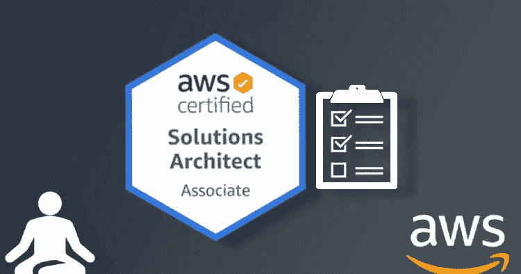
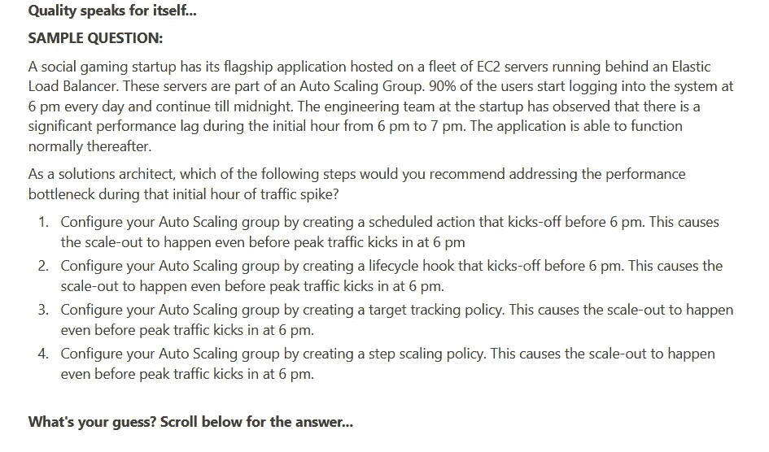
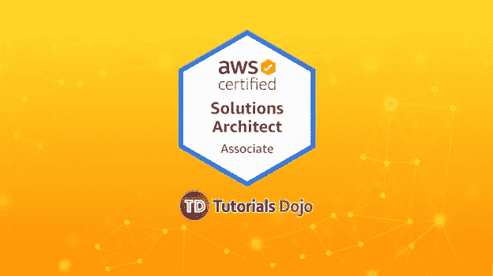
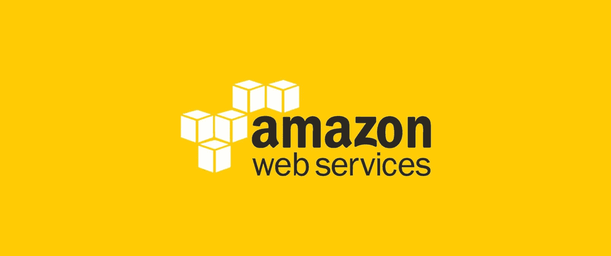

# 6 最佳 AWS 解决方案架构师助理认证实践测试、模拟考试和转储

> 原文：<https://medium.com/javarevisited/6-best-aws-solution-architect-associate-certification-practice-test-mock-exams-and-dumps-240c269dab4f?source=collection_archive---------0----------------------->

## 2000 多个练习问题和转储，为 2023 年的 AWS 解决方案架构师助理认证做准备

大家好，如果您正在准备 AWS 认证解决方案架构师助理(SAA-C01 和 SAA-C02)认证考试，并寻找具有挑战性的模拟测试来评估您的准备情况，那么您来对地方了。

早些时候，我已经分享了 [**最佳 AWS 解决方案架构师课程**](/javarevisited/top-5-aws-training-courses-to-crack-amazon-web-service-solutions-architect-associate-certification-3f4affa8f660?source=collection_home---4------0-----------------------) ，在本文中，我将分享来自 Udemy、Whizlabs 和其他门户网站的 [AWS 解决方案架构师助理](https://javarevisited.blogspot.com/2019/05/top-5-courses-to-crack-aws-solutions-architect-associate-certification-exam-SAA-C01.html#axzz5rHwAwycj) (SAA-C01 和 SAA-C02)考试的最佳实践测试和问题，总计超过 **2000+实践问题**。

这些模拟测试由 AWS 专家、认证开发人员和解决方案架构师创建，如夏羽·马瑞克和云专家瑞娜·克鲁尼伯格。模拟模拟器在任何认证中都扮演着重要的角色，AWS 解决方案架构师助理级考试也不例外。

无论你学了多少，除非你做了大量的练习测试，否则你无法习惯真正考试的形式、压力和时间限制。这就是这些练习测试和考试模拟器帮助很大的地方。

他们不仅在真实的考试环境中为你提供急需的练习，还能帮助你找出自己的强项和弱项。你可以在考试前提高的领域，以获得你想要的最高分。尽管如此，说到模拟考试，我们并没有太多的选择，幸好我们有足够的准备。我过去一直在分享许多 AWS 认证资源，如这些 [AWS 解决方案架构师课程](https://javarevisited.blogspot.com/2019/05/top-5-courses-to-crack-aws-solutions-architect-associate-certification-exam-SAA-C01.html#axzz5rHwAwycj)和这些 [AWS 认证指南](https://javarevisited.blogspot.com/2019/08/how-to-crack-aws-certified-solution-architect-exam.html)。

为了更上一层楼，今天，我将分享一些有用的 AWS 认证实践测试和助理级 AWS 解决方案架构师考试的模拟模拟器。

模拟考试由专家设计，模拟真实的考试场景。这些问题基于官方文件概述的考试大纲。每个模拟考试中出现的问题都是唯一的，不会在其他模拟考试中重复出现。

这些模拟测试是为考生提供的，目的是让他们对考试准备更有信心，并根据考试内容进行自我评估。

# 6 大 AWS 解决方案架构师认证练习题、考试转储和模拟测试

不要再浪费你的时间了，这里有一个最好的 AWS 解决方案架构师实践测试的列表，你可以用来准备你的考试。本模拟考试包含独特的问题，涵盖了考试指南中的所有基本主题，将帮助您在真正考试之前评估自己的速度和准确性。

## 1.[【实践考试】AWS 认证解决方案架构师助理](https://click.linksynergy.com/deeplink?id=JVFxdTr9V80&mid=39197&murl=https%3A%2F%2Fwww.udemy.com%2Fcourse%2Fpractice-exams-aws-certified-solutions-architect-associate%2F) (325 道题)

如果不包括夏羽·马瑞克的实践测试和课程，任何 AWS 认证问题列表都是不完整的。夏羽在他的课程和实践测试中付出了很多努力，这使它们成为 AWS 认证有志者的宝贵资源。

他自己作为 [AWS 认证开发人员](/javarevisited/top-5-online-courses-to-become-aws-certified-developer-associate-in-2020-best-of-lot-9b22baf84ca8)和[解决方案架构师](/javarevisited/6-best-courses-for-aws-certified-solution-architect-professional-exam-in-2020-df5850a9279a)的经历也很有帮助，但他的实践测试与列表中其他人的区别在于问题和解释的质量。只要检查一下这个模拟测试的样题，你就会意识到它们有多有用。所以我一直留着他的练习题，为最后的准备。

本测试包含 **325 道高质量问题**从头开始编写，并附有详细解释，对您的 SAA-C02 和 SAA-C01 测试极其有用。当你完全准备好考试并消除任何弱点时，给他们。他的考试比真正的考试质量略高，但这是你真正准备所需要的。

**以下是参加 AWS 实践考试** — [【实践考试】AWS 认证解决方案架构师助理](https://click.linksynergy.com/deeplink?id=JVFxdTr9V80&mid=39197&murl=https%3A%2F%2Fwww.udemy.com%2Fcourse%2Fpractice-exams-aws-certified-solutions-architect-associate%2F)的链接

为了更好地准备，我还建议您将本模拟测试与夏羽在 Udemy 上的 [**终极 AWS 认证解决方案架构师助理 2023**](https://click.linksynergy.com/deeplink?id=JVFxdTr9V80&mid=39197&murl=https%3A%2F%2Fwww.udemy.com%2Fcourse%2Faws-certified-solutions-architect-associate-saa-c02%2F) 课程结合起来。它还包括一个最终准备的模拟测试。在 Udemy sales 上，你只需花 20 美元就可以买到这两门课程和练习题。

<https://click.linksynergy.com/deeplink?id=JVFxdTr9V80&mid=39197&murl=https%3A%2F%2Fwww.udemy.com%2Fcourse%2Faws-certified-solutions-architect-associate-saa-c02%2F>  

## 2. [WhizLabs AWS 解决方案架构师助理实践测试](http://shrsl.com/1pid8) (600 多道题)

当涉及到任何认证的模拟测试时，我首先去的地方是 Whizlabs。我用过 Whizlab 的考试模拟器，通过了很多像 Java，AWS 这样的在线认证。他们的问题不仅模拟了真实的考试，而且通常难度更高，这就是为什么他们比其他考试准备得更好。

这次 AWS 解决方案架构师助理实践考试也是如此，它包含 **455 道题**，分为 **7 个全程模拟考试。你可以用它们来衡量你的准备情况。**

每个问题都有详细的解释，解释涵盖了所有选项，教你为什么某个选项是正确的，为什么其他选项是错误的。

它还包含涵盖特定主题的部分测试。它为 CSAA 2023 的最新考试版本提供了这样一个 11 个目标/主题的测验，并有 **165 个独特的问题**，对每个问题都有详尽的解释。它还带有智能报告来评估您的强项和弱项。

**以下是参加本次测试的链接** — [WhizLabs AWS 解决方案架构师助理实践测试](http://shrsl.com/1pid8)

如果你真的想在第一次尝试中通过这一享有盛誉的 AWS 认证，那么我强烈建议你解决来自 Whizlabs 考试模拟器的练习题，如果你仍然不确定，我建议你查看来自 Whizlabs 的这些 [**免费 AWS 练习题**](https://shareasale.com/m-pr.cfm?merchantid=43514&userid=880419&productid=792775328&afftrack=) 以检查练习题的质量。

## 3. [AWS 认证解决方案架构师助理实践考试 Jon Bonso](https://click.linksynergy.com/deeplink?id=JVFxdTr9V80&mid=39197&murl=https%3A%2F%2Fwww.udemy.com%2Fcourse%2Faws-certified-solutions-architect-associate-amazon-practice-exams-saa-c02%2F) (390 多个问题)

这是 Udemy 上另一个受欢迎的 AWS 解决方案架构师助理认证实践测试。本模拟考试包含 390 个独特的问题，分为 6 套完整的考试，每套考试有 65 个问题。

这种做法是由 Tutorials Dojo 的 Jon Bonso 创造的，在 Udemy 上受到了 69000 多名学生的信任。每个问题都有详细的解释，并提供了进一步学习的链接。

它也是 Udemy 上评分最高的 AWS 解决方案架构师模拟测试之一，近 13，000 名参与者的平均评分为 4.6。

**以下是参加本课程的链接** — [AWS 认证解决方案架构师助理实践考试](https://click.linksynergy.com/deeplink?id=JVFxdTr9V80&mid=39197&murl=https%3A%2F%2Fwww.udemy.com%2Fcourse%2Faws-certified-solutions-architect-associate-amazon-practice-exams-saa-c02%2F)

## 3.[总计:AWS 解决方案架构师 SAA-C02 模拟测试【195 道题】](https://click.linksynergy.com/deeplink?id=CuIbQrBnhiw&mid=39197&murl=https%3A%2F%2Fwww.udemy.com%2Fcourse%2Faws-certified-solutions-architect-associate-practice-tests-h%2F)

如果你一直在准备 AWS 认证，那么你肯定遇到过 TOTAL 研讨会，很可能你已经参加了他的 AWS 解决方案架构师助理课程进行准备，或者加入了他的邮件列表，以使自己了解云世界发生的最新情况，包括 [AWS](https://javarevisited.blogspot.com/2020/02/top-5-courses-to-crack-aws-certified-cloud-practitioner-exam-certification-clf-c01.html) 、 [Azure](https://javarevisited.blogspot.com/2020/02/top-5-AZ-900-exam-Azure-Fundamentals-certification-practice-tests-and-mock-exams-to.html) 和 [GCP](https://javarevisited.blogspot.com/2019/07/top-5-google-cloud-platform-gcp-courses-certifications-online.html) 。

Total 研讨会也有一些练习题和测验来测试你的准备情况，你可以在 Udemy 上购买这个练习题。本次模拟测试包含 195 个问题，分为 3 次考试，每次 65 个问题。

这些问题基于考试题目，测试你的准备程度。如果您已经参加了他的 AWS 认证解决方案架构师助理课程并阅读了常见问题解答/白皮书，那么您应该能够回答这些问题。

**以下是获取本练习题** — [总计:AWS 解决方案架构师 SAA-C02 练习测试【195 题】](https://click.linksynergy.com/deeplink?id=CuIbQrBnhiw&mid=39197&murl=https%3A%2F%2Fwww.udemy.com%2Fcourse%2Faws-certified-solutions-architect-associate-practice-tests-h%2F)

## 5.Neal Davis 举办的 AWS 认证解决方案架构师助理实践考试(390 道题)

除了瑞安·克鲁尼伯格、夏羽·马雷克和乔恩·邦索，尼尔·戴维斯是我在 Udemy 上钦佩的另一位 AWS 专家。这些 AWS 课程和实践测试质量上乘，对于通过 SAA-C01 和 SAA-C02 AWS 认证解决方案架构师助理至关重要。

本网上练习测试课程包含以下内容:

1 .六门全程限时练习考试(每门 65 题)

2。每个问题的解释
3。小抄

4。免费获得为期 12 个月的数字云培训考试模拟器，包含 500 多个练习题

**此处是参加尼尔·戴维斯** — [AWS 认证解决方案架构师助理实践考试的链接](https://click.linksynergy.com/deeplink?id=JVFxdTr9V80&mid=39197&murl=https%3A%2F%2Fwww.udemy.com%2Fcourse%2Faws-certified-solutions-architect-associate-practice-tests-k%2F)

这 390 个问题都是具有挑战性的问题，只有你做了一些认真的准备，你才能解决它们。我建议你在参加真正的考试之前，在这些考试中保持 80%的分数。这将确保您一次性通过 [AWS 解决方案架构师助理认证](https://dev.to/javinpaul/top-5-courses-to-pass-amazon-aws-certified-solutions-architect-associate-exam-saa-c01-in-2020-56g7)，节省您的时间和金钱。

## 6. [AWS 认证解决方案架构师助理考试转储](https://www.certification-questions.com/buy-dumps-exams/aws-certified-solutions-architect-associate-dumps?affiliateCode=fcff36fd-557a-4713-abf6-973e9924770f&utm_source=Javin&utm_medium=affiliate&utm_campaign=affiliate) (349 个问题)

这是为 AWS 解决方案架构师助理考试准备的另一个有用的问题列表，我强烈建议您在参加真正的考试之前通读一遍。这与列表中的其他模拟测试的区别在于，它不是真正的模拟测试，而是 AWS 考试转储。

这些是 [AWS 解决方案架构师助理考试](https://www.java67.com/2020/04/how-to-paas-aws-certified-solution-architect-exam-in-2020.html)中的实际问题，由通过或尝试过这些考试的考生提供。这给了你一个独特的机会，让你在实际考试前看到真题。你可以用它们来找到你在真实考试中可能遇到的问题的模式和类型。很多时候，它们包含一些你从未解决过的令人惊讶的问题，这就是为什么我建议你在真正考试前看一看。

**这里是检查这些 AWS 考试转储的链接**——[349 AWS 转储](https://www.certification-questions.com/buy-dumps-exams/aws-certified-solutions-architect-associate-dumps?affiliateCode=fcff36fd-557a-4713-abf6-973e9924770f&utm_source=Javin&utm_medium=affiliate&utm_campaign=affiliate)

如果你问 AWS 专家和其他导师，许多人会建议不要考试垃圾，因为许多人倾向于抱着希望重复这些问题，这是不正确的，只会导致失败。你应该利用考卷来熟悉考试的题型和题型，而不是死记硬背。这可能是*你能找到的最大的 AWS 解决方案架构师考试转储*只有它包含超过 **349 个问题**分成 20 个考试测试。

它还会不时更新，以包含 AWS 解决方案架构师助理考试的最新问题，这使它成为您准备工作中的宝贵资源。

<https://www.certification-questions.com/buy-dumps-exams/aws-certified-solutions-architect-associate-dumps?affiliateCode=fcff36fd-557a-4713-abf6-973e9924770f&utm_source=Javin&utm_medium=affiliate&utm_campaign=affiliate>  

# 做好 AWS 解决方案架构师助理认证的 7 个技巧

现在，我们已经看到了您可以用来准备 AWS 解决方案架构师助理认证考试的[最佳实践测试](https://javarevisited.blogspot.com/2020/07/top-5-aws-solution-architect-associate-practice-tests-dumps-mock-exams.html)和[模拟考试模拟器](https://javarevisited.blogspot.com/2019/08/top-5-free-aws-solution-architect-Associate-certification-dumps-practice-questions.html)，是时候看看一些实用的技巧来做好考试了。

这里有一些建议，你可以遵循，以更好地准备考试，并在考试中获得 1000/1000 分。

1。通读常见问题和白皮书。它们包含许多有用的信息，反复阅读它们将帮助您在给定的场景和给定的约束条件下选择最佳的 AWS 服务。
2
。如果你不能解决你的模拟测试中的任何问题，或者做错了，那么你应该回到 AWS 文档并再次阅读概念。

3。我测试中的大多数问题都与 [EC2](https://javarevisited.blogspot.com/2020/08/top-5-courses-to-learn-amazon-aws-ec-2.html) 、EBS、布局组、VPC、Route53、IAM、NAT 实例、RDS、自动扩展、安全组/ACL、ELB、S3、共享责任模型有关。

4。考试中大约 30–40%的问题与根据场景从 4 个选项中选择服务有关。因此，请阅读用例，并确保您理解所有的用例。

5。基于场景的问题没有一些模拟考试中给出的那么长。

6。关于 SQS、SWF 和其他应用服务的问题不多。

7。问题的格式很可能与下面的模拟练习测试相同(在开始测试之前，请确保您在下面的模拟测试中获得 100 分):

以上是关于一些**最佳 AWS 解决方案架构师模拟测试和练习问题的全部内容。我强烈建议你做所有这些练习题，完善你需要的题目。**

此外，要不断练习，以发展你在真实考试中需要的速度和准确性，在 80 分钟内解决 130 个问题。根据我的经验，我有一种预感，一旦你在一段时间内开始在这些考试中获得超过 80%的分数，那么你就为真正的考试做好了准备。

其他 **AWS 认证资源**您可能喜欢探索

*   [如何通过 AWS 解决方案架构师助理考试](https://www.java67.com/2020/04/how-to-paas-aws-certified-solution-architect-exam-in-2020.html)
*   [破解 AWS 解决方案架构师助理认证的前 5 门课程](/javarevisited/top-5-aws-training-courses-to-crack-amazon-web-service-solutions-architect-associate-certification-3f4affa8f660?source=collection_home---4------0-----------------------)
*   [成为 AWS 开发人员助理的前 5 名模拟测试](https://javarevisited.blogspot.com/2020/07/top-5-aws-certified-developer-associate-practice-tests-mock-exams.html)
*   [面向 Java 开发人员的五大 AWS 和云课程](https://javarevisited.blogspot.com/2020/05/top-5-cloud-courses-for-java-and-spring-boot-developers.html)
*   [我最喜欢的深入学习 AWS 的课程](/javarevisited/top-10-courses-to-learn-amazon-web-services-aws-cloud-in-2020-best-and-free-317f10d7c21d)
*   [破解 AWS 解决方案架构师专业考试前 5 门课程](https://javarevisited.blogspot.com/2020/04/top-5-course-to-crack-aws-solution-architect-professional-sap-c01-certification-exam.html)
*   [学习 GCP 云认证的 5 大课程](https://javarevisited.blogspot.com/2019/07/top-5-google-cloud-platform-gcp-courses-certifications-online.html)
*   [如何通过 Azure 基础知识考试(AZ-900)](https://javarevisited.blogspot.com/2020/04/how-to-crack-microsoft-azure-fundamentals-certification-az-900-exam.html)
*   [通过 AWS 认证开发人员助理考试的前 5 门课程](https://javarevisited.blogspot.com/2020/05/top-5-courses-to-crack-aws-certified-developer-associate-certification-exam.html)
*   [学习亚马逊网络服务的 5 门免费课程](https://www.java67.com/2018/05/top-5-amazon-web-services-or-aws-courses-to-learn-online.html)
*   [破解 AWS DevOps 工程师考试的前 5 门课程](https://javarevisited.blogspot.com/2020/04/top-5-course-to-crack-aws-certified-devops-engineer-professional-exam-certification.html)
*   [初学者和有经验的开发人员学习 AWS 的 5 大课程](https://javarevisited.blogspot.com/2020/05/top-5-amazon-web-services-aws-courses-for-beginners-and-experienced-programmers.html)
*   [5 次免费的 AWS 解决方案架构师助理实践测试、转储和模拟考试](https://javarevisited.blogspot.com/2019/08/top-5-free-aws-solution-architect-Associate-certification-dumps-practice-questions.html)
*   [成为 AWS DevOps 工程师专家的 5 门课程](https://javarevisited.blogspot.com/2020/04/top-5-course-to-crack-aws-certified-devops-engineer-professional-exam-certification.html)
*   [成为 AWS 解决方案架构师专家的前 5 门课程](https://javarevisited.blogspot.com/2020/04/top-5-course-to-crack-aws-solution-architect-professional-sap-c01-certification-exam.html)
*   [AWS 云从业者(CLF-C01)前 5 名模拟测试和考试转储](https://javarevisited.blogspot.com/2020/03/top-5-aws-certified-cloud-practitioner-mock-test-practice-questions.html)
*   [通过 AWS 云从业者考试的 5 门最佳课程](https://javarevisited.blogspot.com/2020/02/top-5-courses-to-crack-aws-certified-cloud-practitioner-exam-certification-clf-c01.html)
*   [如何准备 AWS 解决方案架构师认证](/javarevisited/top-10-courses-to-learn-amazon-web-services-aws-cloud-in-2020-best-and-free-317f10d7c21d)

非常感谢您阅读这篇文章。如果你喜欢这些 AWS 模拟考试，请与你的朋友和同事分享。如果您有任何问题或反馈，请留言。

**附言** —如果您渴望通过 AWS 解决方案架构师助理认证，但正在寻找免费的在线培训和实践测试，那么我建议您看看 Udemy 上的 [**AWS 认证解决方案架构师助理介绍**](https://click.linksynergy.com/deeplink?id=JVFxdTr9V80&mid=39197&murl=https%3A%2F%2Fwww.udemy.com%2Fcourse%2Faws-certified-solutions-architect-associate-in-30-days%2F) 课程。这是一门免费课程，将向您展示如何在 30 天内成为 AWS 解决方案架构师助理。

<https://click.linksynergy.com/deeplink?id=JVFxdTr9V80&mid=39197&murl=https%3A%2F%2Fwww.udemy.com%2Fcourse%2Faws-certified-solutions-architect-associate-in-30-days%2F> 