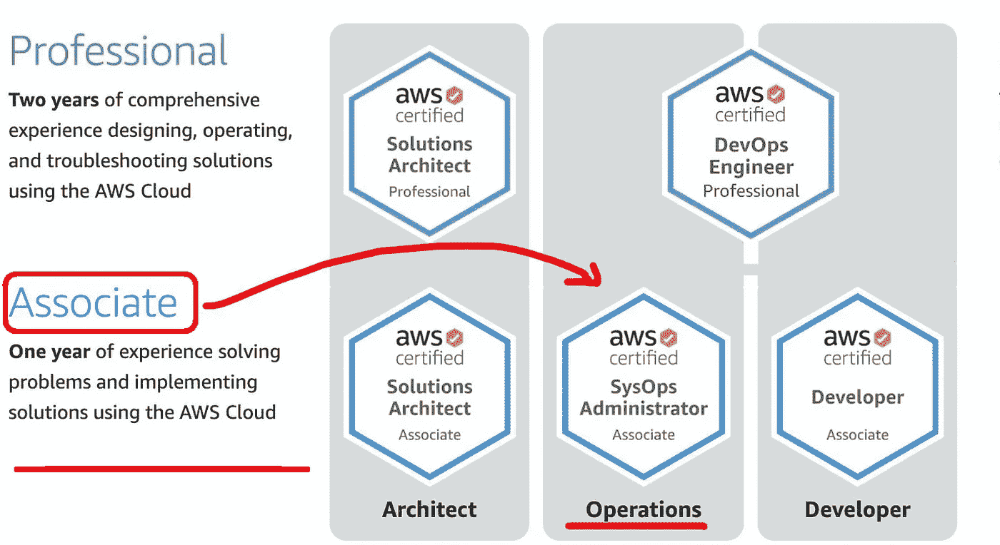
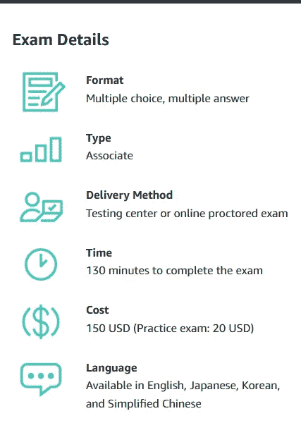
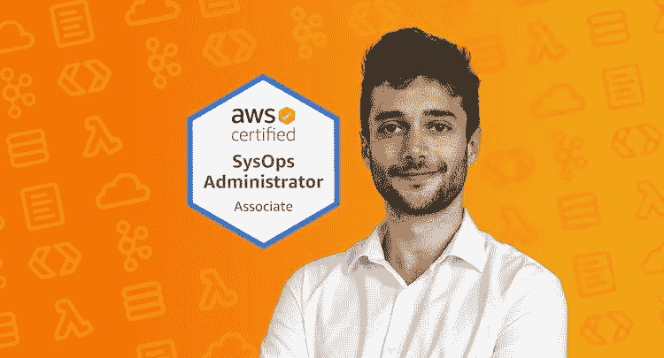
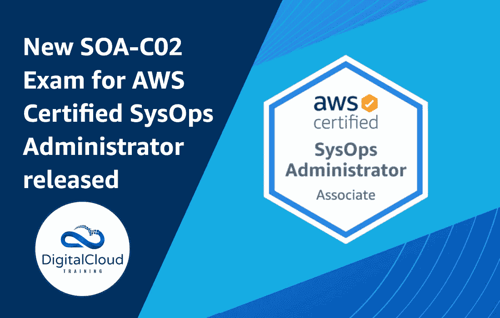
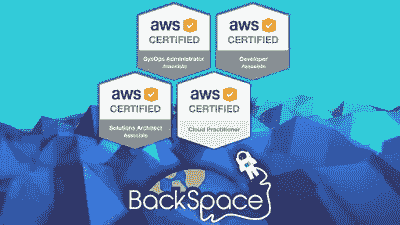
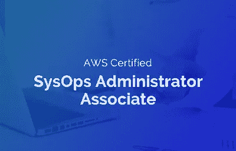
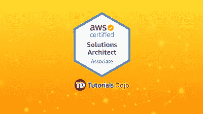

# 2023 年 6 门最佳 AWS SysOps 管理员认证课程和实践测试

> 原文：<https://medium.com/javarevisited/6-best-aws-sysops-online-courses-for-devops-engineers-to-become-a-certified-aws-sysops-5c2ae9dad31d?source=collection_archive---------1----------------------->

## 这些是准备 AWS SysOps 管理认证考试的最佳在线课程和练习测试

大家好，我谈论 AWS 认证已经有一段时间了，过去我曾分享过如何准备 [AWS 云从业者](https://javarevisited.blogspot.com/2020/02/top-5-courses-to-crack-aws-certified-cloud-practitioner-exam-certification-clf-c01.html)、 [AWS 开发助理](https://javarevisited.blogspot.com/2020/05/top-5-courses-to-crack-aws-certified-developer-associate-certification-exam.html)和 [AWS 解决方案架构师](https://javarevisited.blogspot.com/2019/08/how-to-crack-aws-certified-solution-architect-exam.html)考试，今天我要谈论的是 AWS 认证 SysOps 管理员助理考试。

这可能是最难的助理级 AWS 认证，我强烈建议您在获得 AWS 开发人员和 AWS 解决方案架构师考试后参加这个考试。

虽然这不是先决条件，如果你是一名 [DevOps 工程师](/javarevisited/13-best-courses-to-learn-devops-for-senior-developers-in-2020-a2997ff7c33c)，你可以直接申请该认证以进一步提升你的证书，但这样做会增加你第一次通过该认证的机会，并节省你的时间和金钱。这也有助于你获得高分，从而进一步提升你的简历。

[AWS 认证系统管理员助理认证](https://aws.amazon.com/certification/certified-sysops-admin-associate/)是最具挑战性的考试之一。该认证考试评估您的 AWS 操作技能，我的意思是您不仅了解核心 AWS 服务，还了解如何管理它和解决问题，这使得该认证对候选人和公司都非常有价值。

这是完整的考试细节-

对经认证的 AWS 专业人员有巨大的需求，尽管你会发现许多 AWS 解决方案架构师，但像云工程师、站点可靠性工程师、云支持和数据中心工程师这样的工作所需的 [**AWS SysOps 管理员助理**](/javarevisited/10-free-courses-to-crack-aws-sysops-administrator-associate-certification-exam-so1-c01-20fc02c9471e) 并不多。

AWS 在线培训课程在准备 AWS 认证中起着重要的作用，AWS 认证系统运行管理员也不例外，您需要一个高质量的在线培训课程，涵盖 AWS 认证系统运行管理员认证考试所需的所有主题，以便您能够做好充分的准备。

有许多在线课程可以让您通过 AWS 认证系统运行管理员助理考试，如 [Udemy](/javarevisited/my-favorite-udemy-online-courses-for-programmers-and-software-engineers-f9d941dd0035) 、 [Pluralsight](/javarevisited/top-10-pluralsight-courses-to-learn-programming-and-software-development-during-covid-19-stay-at-30b7d8a4f88f) 、Whizlabs 和其他在线门户网站，但关键是要选择正确的课程，因为 AWS 在不断发展，其平台也在不断变化。

在这种情况下，你需要一门能够跟上 AWS 领域新变化的课程，而这正是这些课程的优势所在。它们是由[云空间](/javarevisited/18-coursera-courses-you-can-join-in-2020-to-learn-from-the-worlds-top-tech-companies-google-74af46967d1e)上一些最聪明、最有激情的讲师创建的，他们有一个专门的团队，通过添加新的讲座和更新现有内容来保持课程的更新。

# 2023 年 6 门 AWS 认证系统运行管理员助理 SOA C02 考试课程

为了不浪费你更多的时间，这里是我列出的通过 AWS SysOps 认证考试的一些最好的课程。正如我所说的，这些课程不仅很好地涵盖了考试主题，而且也是最先进的课程。

## 1.[2023 年终极 AWS 认证 SysOps 管理员助理](https://click.linksynergy.com/deeplink?id=JVFxdTr9V80&mid=39197&murl=https%3A%2F%2Fwww.udemy.com%2Fcourse%2Fultimate-aws-certified-sysops-administrator-associate%2F)

夏羽马瑞克 AWS 课程不需要任何介绍，它们是准备 AWS 认证的最佳课程，这一门也不例外。

在这本 AWS 认证系统管理员助理的终极指南中，夏羽分享了他所有的知识，这些知识帮助我以令人难以置信的分数 **980/1000** 通过了这场艰难的考试，是的，只有一个错误的问题。

本课程涵盖了 AWS 认证系统运营管理员 SOA-C02 考试的所有新主题，并包含了如何作为系统运营人员从内到外使用 AWS 的实用知识。你不仅要学习如何准备 AWS 考试，还要学习如何为现实世界做准备。

**以下是参加本课程的链接**—[2023 年 AWS 认证 SysOps 管理员助理终极课程](https://click.linksynergy.com/deeplink?id=JVFxdTr9V80&mid=39197&murl=https%3A%2F%2Fwww.udemy.com%2Fcourse%2Fultimate-aws-certified-sysops-administrator-associate%2F)

本课程还包含 400 多张幻灯片，可以下载 pdf 格式。每一部分都有许多实践讲座，在最后还有测验。

课程结束时还有一个 [AWS 认证系统运行管理员助理实践考试](https://javarevisited.blogspot.com/2020/06/top-5-aws-certified-sysops-admin-associate-certification-exam.html#axzz6nMuhl2QC)，您可以在完成课程后参加该考试，以评估您的准备情况。

该课程最近也进行了更新，涵盖了 AWS GUI 的最新变化。总的来说，这是一门准备 AWS SysOps 认证的绝佳课程。你也可以从夏羽那里获得灵感，尝试打破他的 980/1000 的记录，使之成为完美的 1000/1000。

## 2. [AWS 认证系统运行管理员助理 2023【SOA-C03】](https://click.linksynergy.com/deeplink?id=JVFxdTr9V80&mid=39197&murl=https%3A%2F%2Fwww.udemy.com%2Fcourse%2Faws-certified-sysops-administrator-associate-training%2F)

除了夏羽·马雷克，尼尔·戴维斯是 Udemy 上另一位我信任的 AWS 认证和云计算课程的讲师。

参加了他的 [**A**](https://click.linksynergy.com/deeplink?id=JVFxdTr9V80&mid=39197&murl=https%3A%2F%2Fwww.udemy.com%2Fcourse%2Faws-certified-solutions-architect-associate-hands-on%2F) **WS 认证解决方案架构师助理 SAA-C03【2023】课程**我可以说你会立刻与 Neal 产生共鸣。他在 IT 和云计算方面有着丰富的经验，他本人也是 AWS 认证解决方案架构师、开发人员和系统管理员。

如果您正在准备 AWS 认证 SysOps 管理员考试，那么您应该知道，从工作和认证的角度来看，监控、高可扩展性、Ops 工作、安全性、联网和数据管理等主题都非常重要，本课程将使用 CloudWatch 等相关 AWS 服务及其不同指标来涵盖所有这些主题。

本课程清晰而深入地涵盖了 sysops 管理的几乎所有方面。唯一可以做得更好的是，在课程结束时加入一些练习考试，并在每个部分之后增加更多测验，这已经包含在开发人员和 SA 助理课程中了。

**以下是参加本课程的链接** — [AWS 认证系统运行管理员助理 2023【SOA-C03】](https://click.linksynergy.com/deeplink?id=JVFxdTr9V80&mid=39197&murl=https%3A%2F%2Fwww.udemy.com%2Fcourse%2Faws-certified-sysops-administrator-associate-training%2F)

该课程由尼尔·戴维斯创建，受到超过 95，754 名学生的信任。它还获得了近 53，000 名参与者的平均 4.7 分的评分，这使它成为最受认证系统管理员考试欢迎的 AWS 课程之一。非常感谢尼尔和他的团队创造了这个可怕的课程。

## 3.[亚马逊网络服务(AWS)认证 2023–4 项认证！](https://click.linksynergy.com/deeplink?id=JVFxdTr9V80&mid=39197&murl=https%3A%2F%2Fwww.udemy.com%2Fcourse%2Faws-certified-associate-architect-developer-sysops-admin%2F)

这是 Udemy 上最全面的 AWS 认证课程之一，顾名思义，培训材料涵盖了所有四种 AWS 认证，即

— [AWS 认证云从业者考试](/javarevisited/7-free-aws-cloud-practitioner-certification-courses-to-crack-exam-in-2021-f13d6a996019?source=---------22-----------------------)
— [AWS 认证开发人员助理考试](/javarevisited/7-free-resources-to-crack-aws-developer-associate-certification-for-beginners-b365aea4cd3c)
— [AWS 认证解决方案架构师助理考试](/javarevisited/how-to-prepare-for-aws-solution-architect-associate-certification-saa-c01-saa-c02-exam-in-2021-a6e7e7e771fc)
— AWS 认证系统运维管理员考试

如果您打算在未来某个时候提供所有四种认证，您应该参加本课程以节省成本和精力。本课程针对最新的 AWS 考试进行了全面更新，并且至少每个月都会定期更新，以跟上最新的变化。
。它还包含面向 Lambda、Cognito、X-Ray、SQS、SNS 等开发者实验室的 NodeJS 和 JavaScript 代码。

**以下是参加本课程的链接** — [亚马逊网络服务(AWS)认证 2023–4 认证！](https://click.linksynergy.com/deeplink?id=JVFxdTr9V80&mid=39197&murl=https%3A%2F%2Fwww.udemy.com%2Fcourse%2Faws-certified-associate-architect-developer-sysops-admin%2F)

课程还包括每个主要部分的练习测试/测验和 600 多个 pdf 格式的问题！这意味着您不需要购买额外的模拟测试。

它还包含 4 个完整长度的认证实践考试(240 个问题)，足以检查您的速度和准确性。尽管我仍然建议通过 Whizlabs 测试来做更好的准备。

本课程受到 90，000 多名学生的信任，近 14，843 名参与者平均给本课程打了 4.5 分，这充分说明了本课程的质量。不管怎样，你为这个课程准备的 AWS 认证将会帮助你

## 4. [Whizlabs 的 AWS SysOps 认证实践测试](https://shrsl.com/25qji)

这不是一门在线课程，而是为 AWS SysOps 认证考试做准备的模拟测试。由于模拟测试是 AWS 认证准备的一个组成部分，所以我把它包含在这里。这种模拟测试有助于在正式考试前检查您的速度和准确性。既然你需要取得 76%的分数才能通过考试，我只建议你如果在这些模拟考试中一直取得 80%的分数，就去参加一次真正的考试。而且，当谈到实践测试或考试模拟器，Whizlab 拥有最好的。过去，我使用 Whizlabs 实践测试通过了许多认证，这次 AWS SysOps 认证实践测试也不例外。

本课程包含 12 次全程模拟考试，700 多个高质量的独特问题，用于检查您的知识和考试准备情况。每个测试包含 60-65 个模拟真实考试的练习。

最棒的是，他们为每个问题提供详尽的解释，这样你就知道为什么一个选项是正确的，而其他选项是不正确的。

**这是参加本课程的链接** — [Whizlabs 的 AWS SysOps 认证实践测试](https://shrsl.com/25qji)

他们还提供智能报告来评估您的优势和劣势。你可以在真正考试之前找到你的强项和弱项，这样你就可以在这些方面下功夫了。

也可以查看官方考试指南，查看不同题目的分题情况。Whizlabs 测试也可以通过移动设备访问，他们还可以随时更新他们的问题测试，以匹配更新的考试大纲。如果你想在第一次尝试中通过这一艰难的 AWS 认证，我强烈建议你解决尽可能多的练习题。

## 5. [AWS 认证系统管理员助理实践考试](https://click.linksynergy.com/deeplink?id=JVFxdTr9V80&mid=39197&murl=https%3A%2F%2Fwww.udemy.com%2Fcourse%2Faws-certified-sysops-administrator-associate-practice-exams-soa-c01%2F)

这是另一个在线 AWS SysOps Admin 练习测试，你可以在 Udemy 上购买。虽然 Whizlab 的练习测试非常棒，几乎涵盖了考试指南中的每个主题，但您也可以使用此在线练习测试进行更多练习。

如果你决心第一次就通过这个困难的考试，你会需要这个。由 Jon Bonso 和 Tutorials Dojo 创建的

本练习测试包含 5 个练习测试中的 325 个新 AWS SysOps 问题，包括解释、参考链接和分数跟踪。该模拟测试得到了 3000 多名认证申请人的信任，近 400 名参与者的平均评分为 4.4。

你也可以将这个测试与 Whizlab 的 AWS 实践测试结合起来，以便更好地准备，但如果你不能同时做这两者，至少解决这 325 个问题，以掌握你将在考试中得到什么样的问题。解决这些练习题会训练你在有限的时间内解决真题的思维。

**这里是获取本实践课程** — [AWS 认证系统管理员助理实践考试](https://click.linksynergy.com/deeplink?id=JVFxdTr9V80&mid=39197&murl=https%3A%2F%2Fwww.udemy.com%2Fcourse%2Faws-certified-sysops-administrator-associate-practice-exams-soa-c01%2F)的链接

## 6.AWS 系统操作管理员助理 2023(免费课程)

这是一门免费课程，由 ExamPro 的安德鲁·布朗(Andrew Brown)创建，托管在 FreeCodecamp 的 Youtube 频道上。这是一门 14 小时的综合课程，为 AWS SysOps 考试做准备。

本课程涵盖与配置、自动化、修补和监控云服务和虚拟服务器相关的 [DevOps 主题](/javarevisited/13-best-courses-to-learn-devops-for-senior-developers-in-2020-a2997ff7c33c)。在由专家培训师讲授的全部课程结束时，您将准备好参加 AWS SysOps 管理员助理考试，并通过考试！

AWS SysOps 管理员助理(SO1-C02)是为在 DevOps 领域寻求职业生涯的个人设计的，这个课程一定会帮助你。最棒的是，这门课完全免费。

以上是为 AWS 认证系统管理员助理考试准备的**最佳在线培训课程。**正如我说过的，这是最难的助理级 AWS 认证之一，我强烈建议您在参加这项考试之前通过 AWS 开发助理和 AWS 解决方案架构师考试。

这项考试需要深入了解大量 AWS 服务，如 IAM、EC2、 [DynamoDB](/javarevisited/7-best-aws-s3-and-dynamodb-courses-for-beginners-in-2021-a8a44b6066da) 、S3、 [Lambda](/javarevisited/7-best-serverless-and-aws-lambda-courses-to-learn-in-2021-de1820111c85) 等，以便在考试中取得好成绩。

您可能想了解的其他 **AWS 认证资源**

*   [如何破解 AWS 解决方案架构师助理考试](https://javarevisited.blogspot.com/2019/08/how-to-crack-aws-certified-solution-architect-exam.html)
*   [破解 AWS 解决方案架构师助理认证的 5 大课程](https://javarevisited.blogspot.com/2019/05/top-5-courses-to-crack-aws-solutions-architect-associate-certification-exam-SAA-C01.html#axzz5rHwAwycj)
*   [成为 AWS 解决方案架构师专家的前 5 门课程](https://javarevisited.blogspot.com/2020/04/top-5-course-to-crack-aws-solution-architect-professional-sap-c01-certification-exam.html)
*   [AWS 云实践者的 5 大模拟测试和考试转储(CLF-C02)](https://javarevisited.blogspot.com/2020/03/top-5-aws-certified-cloud-practitioner-mock-test-practice-questions.html)
*   [初学者和有经验的开发人员学习 AWS 的 5 大课程](https://javarevisited.blogspot.com/2020/05/top-5-amazon-web-services-aws-courses-for-beginners-and-experienced-programmers.html)
*   [面向 Java 开发人员的五大 AWS 和云课程](https://javarevisited.blogspot.com/2020/05/top-5-cloud-courses-for-java-and-spring-boot-developers.html)
*   [我最喜欢的深入学习 AWS 的课程](/javarevisited/top-10-courses-to-learn-amazon-web-services-aws-cloud-in-2020-best-and-free-317f10d7c21d)
*   [破解 AWS DevOps 工程师考试的前 5 门课程](https://javarevisited.blogspot.com/2020/04/top-5-course-to-crack-aws-certified-devops-engineer-professional-exam-certification.html)
*   [破解 AWS 解决方案架构师专业考试的前 5 门课程](https://javarevisited.blogspot.com/2020/04/top-5-course-to-crack-aws-solution-architect-professional-sap-c01-certification-exam.html)
*   [通过 AWS 认证开发人员助理考试的前 5 门课程](https://javarevisited.blogspot.com/2020/05/top-5-courses-to-crack-aws-certified-developer-associate-certification-exam.html)
*   学习亚马逊网络服务的 5 门免费课程
*   [5 次免费的 AWS 解决方案架构师助理实践测试、转储和模拟考试](https://javarevisited.blogspot.com/2019/08/top-5-free-aws-solution-architect-Associate-certification-dumps-practice-questions.html)
*   [成为 AWS DevOps 工程师专家的 5 门课程](https://javarevisited.blogspot.com/2020/04/top-5-course-to-crack-aws-certified-devops-engineer-professional-exam-certification.html)
*   [通过 AWS 云从业者考试的 5 门最佳课程](https://javarevisited.blogspot.com/2020/02/top-5-courses-to-crack-aws-certified-cloud-practitioner-exam-certification-clf-c01.html)
*   [如何准备 AWS 解决方案架构师认证](/javarevisited/top-10-courses-to-learn-amazon-web-services-aws-cloud-in-2020-best-and-free-317f10d7c21d)

感谢您阅读本文。如果您喜欢这些 AWS 认证系统管理员助理在线培训课程，请与您的朋友和同事分享。如果您有任何问题、反馈或疑问，请留言。

**P. S.** —如果你是 AWS 和云计算的新手，正在寻找一些学习 AWS 的免费课程，那么你也可以在 Udemy 上查看这个 [**亚马逊网络服务(AWS)——零到英雄**](https://click.linksynergy.com/deeplink?id=JVFxdTr9V80&mid=39197&murl=https%3A%2F%2Fwww.udemy.com%2Fcourse%2Famazon-web-services-aws-v%2F) (免费)课程。这是一门很好的入门课程，你可以免费学习。你只需要一个 Udemy 帐户就可以进入本课程。

<https://click.linksynergy.com/deeplink?id=JVFxdTr9V80&mid=39197&murl=https%3A%2F%2Fwww.udemy.com%2Fcourse%2Famazon-web-services-aws-v%2F> 