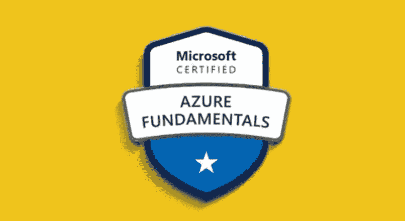
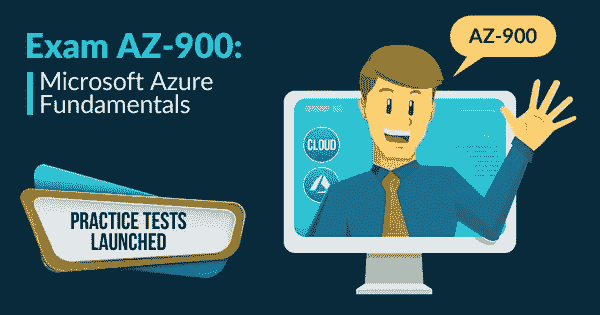
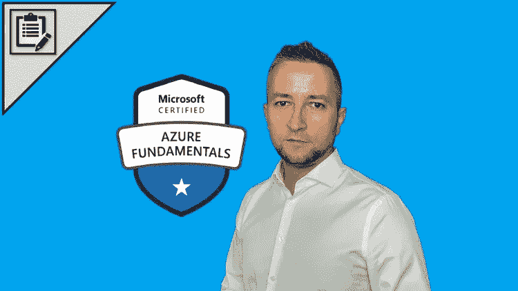
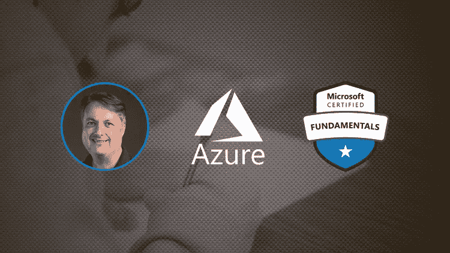
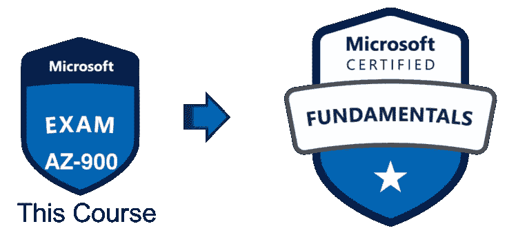

# 6 个最佳 AZ-900 练习测试、转储和模拟考试，以破解 Azure 基础知识考试

> 原文：<https://medium.com/javarevisited/6-best-az-900-practice-tests-dumps-and-mock-exams-to-crack-azure-fundamentals-exam-990041818584?source=collection_archive---------0----------------------->

## 我最喜欢的在线练习测试、考试模拟器、考试转储、准备 Microsoft Azure 基础知识的模拟考试或 AZ-900 认证考试。

大家好，如果你正在准备 2023 年的 Microsoft Azure Fundamentals 或 AZ-900 认证考试，并希望在第一次尝试中通过这一按需认证，那么你应该通过模拟考试和练习测试来练习，这些都是评估你的准备情况并提高你在第一次尝试中通过考试所需的速度和准确性的好工具。

早些时候，我已经分享了最好的 AZ-900 在线课程 ，在这篇文章中，我将列出一些你可以通过**微软 Azure 基础(AZ-900)考试**的最佳实践测试。

该考试侧重于基本的云概念，如 IaaS、PaaS、SaaS，以及 Azure 核心服务，如地理可用性、存储、网络、计算服务、安全性、定价和计费。

这实际上是最简单的微软 Azure 云认证之一，很像亚马逊的 [**AWS 云从业者认证**](https://javarevisited.blogspot.com/2020/02/top-5-courses-to-crack-aws-certified-cloud-practitioner-exam-certification-clf-c01.html) ，即使你从未在任何云平台如 [AWS](https://www.java67.com/2018/05/top-5-amazon-web-services-or-aws-courses-to-learn-online.html) 、 [Azure](https://javarevisited.blogspot.com/2019/07/top-5-courses-to-crack-azure-architecture-technologies-certification-az-300-exam.html) 或 [GCP](https://javarevisited.blogspot.com/2019/07/top-5-google-cloud-platform-gcp-courses-certifications-online.html) 工作过，你也可以轻松通过这个考试。对于希望了解云的确切工作方式以及如何使用不同的 Azure 服务在云中运行应用程序的技术人员，以及像 BA 这样的非技术人员、项目经理以及参与购买基于云的解决方案和服务的销售人员来说，该考试是一个很好的敲门砖。

以前的 it 经验不是强制性的，但如果您有一些 IT 经验并了解常见的技术术语，如服务器、存储、计算、内存、网络、安全、VPN、可扩展性、弹性等，肯定会有所帮助。现在回到微软 Azure Fundamentals 认证，我经常收到的一个问题是**如何在一周内通关 AZ-900 认证？**或者说*一周足够通过 Azure Fundamentals 认证吗？这个问题的答案是肯定的，只要你每天花 5 到 6 个小时，一周就足够了。准备这次考试的最佳方式是参加 Azure Fundamentals AZ-900 课程，如
[**AZ-900:微软 Azure Fundamentals 考试准备-2023 版**](https://click.linksynergy.com/deeplink?id=JVFxdTr9V80&mid=39197&murl=https%3A%2F%2Fwww.udemy.com%2Fcourse%2Faz900-azure%2F) ，它专注于考试，很像考试指南，在 Azure 门户网站上做一些动手实验，然后进行一些练习测试和模拟考试。模拟考试和实践测试在您的认证之旅中扮演着重要的角色。它们往往是成功和失败的区别，也是满意和优秀结果的区别。你可以不参加模拟考试而通过考试，但是如果你在准备策略中包括模拟考试，你会做得更好。他们将帮助你找到你的强项和弱项，也帮助你掌握时间和速度，这对于在真正的考试中完成所有的问题非常重要。

当我参加认证考试时，比如 [**AWS 解决方案架构师**](https://javarevisited.blogspot.com/2019/05/top-5-courses-to-crack-aws-solutions-architect-associate-certification-exam-SAA-C01.html#axzz5rHwAwycj) 和 [**AWS 云从业者**](/javarevisited/7-free-aws-cloud-practitioner-certification-courses-to-crack-exam-in-2021-f13d6a996019) ，我花了几个小时在真实的考试场景中进行练习测试，然后回顾我做得好的地方和需要改进的地方，这个策略帮助我在认证考试中取得了优异的成绩。*

# 6 最佳实践测试，破解 2023 年微软 Azure 基础(AZ-900)认证考试

如果你正在准备[微软 Azure 基础](/javarevisited/7-free-microsoft-azure-fundamentals-az-900-online-courses-for-beginners-in-2021-efd01d8be403)或 [AZ-900 认证](https://javarevisited.blogspot.com/2020/02/top-5-courses-to-crack-az-900-microsoft-azure-fundamentals-certification-exam.html)并寻找一些优秀的实践测试来让你的准备和信心更上一层楼，那么你来对地方了。这里有一些来自 Certification-Questions.com whiz labs、Udemy、Exam Pass 的最好的 AZ-990 练习和模拟考试，你可以在第一次尝试时通过 Azure Fundamentals 考试。

## 1. [AZ-900:微软 Azure 基础考试准备-2023 版](https://click.linksynergy.com/deeplink?id=JVFxdTr9V80&mid=39197&murl=https%3A%2F%2Fwww.udemy.com%2Fcourse%2Faz900-azure%2F)

这是一个完美的在线课程+实践测试，为一周内的 Microsoft Azure 基础考试做准备。云计算专家斯科特·达菲(Scott Duffy)在这门课程中做了出色的工作，他教你通过 AZ-900 考试所需的一切。

该课程还附带大量奖金和补充资源，比如你将获得 24 页的微软基础知识学习指南，为离线学习做准备。也有测验来巩固你每章的学习。

如我所说，课程还包含一个 50 题的模拟测试，以找到你的强项和弱项。如果你非常着急，并且想在几天内通过 AZ 900 考试，就通过这个课程和练习测试。你可能得不到高分，但你一定会有足够的知识通过考试。

**这里是加入这个测试的链接—** [AZ-900:微软 Azure 基础知识考试预备-2023](https://click.linksynergy.com/deeplink?id=JVFxdTr9V80&mid=39197&murl=https%3A%2F%2Fwww.udemy.com%2Fcourse%2Faz900-azure%2F)

您也可以将此模拟测试与我的主题式 AZ-900 Udemy 课程 结合起来，以便更好地准备和练习，我在这里分享了 300 多个涵盖 Azure 基础认证每个主题的问题。

 [## 2023 微软 Azure 基础 AZ-900 考试模拟测试

### 我们是一个拥有扎实技术技能的团队，对在线教学充满热情。我一直在把我对 Java 的想法写在…

www.udemy.com](https://www.udemy.com/course/az-900-practice-test-azure-fundamentls-certification-exam/?referralCode=C335B28D838A48DEDFA1) 

## 2.[微软 Azure 考试 AZ-900 认证模拟测试(Whizlabs)](https://www.shareasale.com/r.cfm?b=1325595&u=880419&m=43514&urllink=&afftrack=)

这个模拟模拟器最适合通过微软 Azure 认证或 AZ-900 考试，你可以通过 web 和移动访问它们。来自 Whizlabs 的这个模拟测试包含 275 个独特的问题，分为 5 个完整长度的考试，这些考试检查您对云服务的基础知识，以及 Microsoft Azure 如何提供云服务，而不考虑任何特定的角色。

还有 7 个部分测试，35 个独特的问题，每个问题都有详尽的解释，不仅帮助你了解为什么一个正确的选项是正确的，也帮助你了解为什么其他选项是不正确的。

说到像微软 Azure Fundamentals 这样的云认证实践测试，我相信 Whizlabs。我过去曾使用 Whizlabs 通过几个 Java 和 AWS 认证，如 [OCAJP](https://javarevisited.blogspot.com/2019/10/top-5-books-courses-to-crack-oracles-java-se-11-certification-OCAJP11.html) 、 [OCPJP、](http://javarevisited.blogspot.sg/2015/11/5-free-ocajp8-ocpjp8-mock-exams-and-practice-questions.html#axzz5BnsEM0ee) [**AWS 解决方案 Architec** t](https://javarevisited.blogspot.com/2019/08/top-5-free-aws-solution-architect-Associate-certification-dumps-practice-questions.html) 、 [**AWS 云从业者**](/javarevisited/5-best-aws-cloud-practitioner-certification-clf-c01-practice-questions-mock-tests-and-exam-55330b140e58) ，它在 AZ-900 上也没有让我失望。

他们的报道也是一流的，真的能帮你在真正考试前评估自己的优缺点。经过几次测试，你会对哪些题目需要准备得更好有足够的想法。

总的来说，Azure AZ-900 认证考试最好的考试模拟器之一，如果你想得分超过 80%，我强烈推荐它。

**这里是加入 whiz labs**——[微软 Azure 考试 AZ-900 认证模拟考试](https://www.shareasale.com/r.cfm?b=1325595&u=880419&m=43514&urllink=&afftrack=)的链接

顺便说一句，如果你正在准备认证，可以考虑参加 [Whizlabs 订阅](https://shareasale.com/r.cfm?b=1551042&u=880419&m=43514&urllink=&afftrack=)，它提供对他们所有在线培训课程和不同认证(如 AWS 和 Google Cloud)的练习测试的完全访问，每年仅需 99 美元(现在有 50%的折扣)。

我强烈推荐这个订阅计划，因为 Whizlabs 有最好的材料来准备 IT 认证。

## 3.[我在 Udemy 上的 AZ-900 模拟测试课程](https://www.udemy.com/course/az-900-practice-test-azure-fundamentls-certification-exam/?referralCode=C335B28D838A48DEDFA1)【Azure 基础】

没有多少人知道，但是我也有我自己的 Azure 基础练习测试课程，我在 Udemy 上分享了我自己准备的所有问题。你可以用它们来破解微软 Azure Fundamentals 认证 AZ 900 的 6 个主题明智的实践测试和 300 多个问题。

以下是你在我的课程中将会学到的:

1.  5 主题式长度测试
2.  300 多个带详细解释的问题
3.  练习错题的能力
4.  终身访问。

关于我的测试最好的事情是它的主题明智，这样你可以准备每个主题的深度。我还包括了基于教学大纲和编号的问题，如:

1.  **描述云概念(20–25%)**
2.  **描述核心 Azure 服务(15–20%)**
3.  **描述 Azure 上的核心解决方案和管理工具(10-15%)**
4.  **描述一般安全和网络安全特性(10–15%)**
5.  **描述身份、治理、隐私和合规性特征(20-25%)**
6.  **描述 Azure 成本管理和服务水平协议(10–15%)**

这里是加入我在 Udemy 上的 AZ-900 测试的链接— [我在 Udemy 上的 AZ-900 实践测试课程](https://www.udemy.com/course/az-900-practice-test-azure-fundamentls-certification-exam/?referralCode=C335B28D838A48DEDFA1)

## 4.[微软 Azure 基础(AZ-900)——模拟测试](https://click.linksynergy.com/deeplink?id=JVFxdTr9V80&mid=39197&murl=https%3A%2F%2Fwww.udemy.com%2Fcourse%2Fmicrosoft-azure-fundamentals-az-900-practice-tests%2F)【Udemy】

这是另一门在线课程，提供了 Microsoft Azure 基础知识考试的最新练习题，并附有详细解释。它包含 6 份练习试卷，每份试卷有 55 个问题，这意味着总共有 332 个练习问题。Udemy 上的这些模拟测试最棒的一点是，它们与考试大纲密切相关，这意味着你有 15-20%的问题来自[云概念](https://javarevisited.blogspot.com/2019/07/top-5-online-courses-to-learn-cloud-computing-aws.html)，30-35%的问题来自核心 Azure 服务，20-25%的问题关于定价和支持，其余的问题关于安全、隐私、合规性和信任。像 Whizlabs 一样，它们也为每个问题提供了很好的解释，并在需要的地方链接到微软官方文档。简而言之，这些练习测试，第一次尝试就足以通过 [**微软 Azure AZ-900 考试**](https://www.java67.com/2020/09/5-free-courses-to-crack-azure-fundamentals-AZ-900-certification-exam.html) 。

它的性价比也很高，我只花了 10 美元就买到了它，你也可以根据 Udemy 的销售情况以类似或稍高的价格买到它。

**这里是加入这个测试的链接—** [微软 Azure 基础知识(AZ-900) —模拟测试](https://click.linksynergy.com/deeplink?id=JVFxdTr9V80&mid=39197&murl=https%3A%2F%2Fwww.udemy.com%2Fcourse%2Fmicrosoft-azure-fundamentals-az-900-practice-tests%2F)

## 5. [AZ-900:微软 Azure 基础原始练习测试](https://click.linksynergy.com/deeplink?id=JVFxdTr9V80&mid=39197&murl=https%3A%2F%2Fwww.udemy.com%2Fcourse%2Faz900-azure-tests%2F)

这是一个可选的模拟测试，如果您已经通过了 Whizlab 或之前的测试，您可能不需要它。如果你需要更多的练习，并且你还不够自信，或者你真的想以满分 100 分的成绩来结束考试，那么你可以在 Udemy 上购买这门课程。

这也是出自本榜单第一门课程的作者斯科特·达菲。您也可以将这些模拟测试与该课程一起使用，但这不是先决条件。

它包含三个完整的， [**AZ-900 Azure 基础知识考试**](/javarevisited/5-best-azure-fundamentals-courses-to-pass-az-900-certification-exam-in-2020-9e602aea035d) 的限时模拟测试，150 道题，它们都是 100%原创的。这个有时间限制的测试对于发展你在真实考试中解决所有问题所需的速度和准确性是很重要的。如果你在这些测试中持续获得 80%以上的分数，并且能够完成所有问题，那么你就为真正的考试做好了准备。从我的经验来看，我建议你在真正考试前几天参加这些考试，这样你就有足够的时间来纠正薄弱环节。

**这里是加入本课程的链接** — [AZ-900:微软 Azure 基础原始练习测试](https://click.linksynergy.com/deeplink?id=JVFxdTr9V80&mid=39197&murl=https%3A%2F%2Fwww.udemy.com%2Fcourse%2Faz900-azure-tests%2F)

## 6.[David Mayer 的 AZ-900 考试转储](https://www.certification-questions.com/practice-exam/microsoft/az-900?affiliateCode=fcff36fd-557a-4713-abf6-973e9924770f&utm_source=Javin&utm_medium=affiliate&utm_campaign=affiliate)

这与模拟考试略有不同。这些实际上是通过 AZ-900 认证的考生匿名分享的考试垃圾。

*AZ-900 考试转储*最好的一点就是它们是考试的真题，也就是说你可以查看难度等级和格式。不能保证你会再看到那些问题，但是它们仍然非常有用，可以让你达到那个水平或者更高。

下面是关于这次微软 AZ-900 模拟考试的一个简要细节:微软 Azure 基础:
—问题数量:149
—考试测试:3
—最后更新:2023–03–15

所以，它是相当最新的，我看到许多评论，其中考生提到他们在考试中得到的问题与这些测试有 80%以上相同。:-)

下面是检查这些转储的链接— [AZ-900 考试转储，作者大卫·梅尔](https://www.certification-questions.com/practice-exam/microsoft/az-900?affiliateCode=fcff36fd-557a-4713-abf6-973e9924770f&utm_source=Javin&utm_medium=affiliate&utm_campaign=affiliate)

如果你运气好，让我们知道，但我不推荐这种方法。我更喜欢过度准备并在考试中获得高分，而不是从考试垃圾中提取问题。

不要误会；就难度和格式而言，它们仍然很有用，这就是为什么我把它们列在这个列表中，但是我不建议你在准备时完全依赖它们。

## 7.A [Z-900 模拟测试|微软 Azure 基础](https://click.linksynergy.com/deeplink?id=CuIbQrBnhiw&mid=39197&murl=https%3A%2F%2Fwww.udemy.com%2Fcourse%2Faz-900-dumps%2F) [Udemy]

这是为 Microsoft Azure 基础知识或 AZ-900 考试设计的最新模拟测试。它包含 AZ-900 练习题和详细的解释，这将帮助您充满信心地通过 Microsoft Azure 基础考试。

该测试包含 260 个问题，分为 6 个模拟测试，其中 4 个测试包含 50 个问题，2 个测试包含 30 个问题。这个模拟测试是由 Sunil Kumar 设计的，他最近通过了 Azure Fundamentals 认证考试。

每个模拟测试都包括-

*   测试报告，以便更好地理解。
*   六大类 50 个问题，一小时
*   带参考文献的问题解释。
*   考试问的另一个版本的问题。

如果你正在准备 2023 年的 AZ-900 微软 Azure 基础考试，那么你应该参加这个模拟测试，并解决给定的问题，以更好地准备考试。

**这里是加入本课程的链接** — [AZ-900 模拟测试|微软 Azure 基础](https://click.linksynergy.com/deeplink?id=CuIbQrBnhiw&mid=39197&murl=https%3A%2F%2Fwww.udemy.com%2Fcourse%2Faz-900-dumps%2F)

# 关于 Microsoft Azure 基础知识或 AZ-900 考试的要点

下面是一些你在准备 AZ-900 或者微软 Azure 基础知识考试时应该知道的重要事情:

1。考试费用为 99 美元，但根据你所在国家的不同可能会有所不同。价格实际上是根据考试监考的国家而定的。
②
。Azure 基础认证的好处是主题定义明确，它们的权重也是如此。以下是 AZ-900 考试的一些重要话题:

*   理解云概念(15–20%)
*   了解核心 Azure 服务(30–35%)
*   了解安全性、隐私、合规性和信任度(25–30%)
*   了解 Azure 定价和支持(20–25%)

3.AZ-900: Microsoft Azure 基础考试检查您对基本云概念的了解；核心 Azure 服务；安全性、隐私性、合规性和信任；以及 Azure 定价和支持。

4。这一认证对于希望了解云以及微软如何提供基本云服务的技术人员(如开发人员、技术负责人和架构师)以及非技术人员(如 BA、项目经理、参与购买和销售基于云的解决方案和服务的销售人员

5)都很有好处。你可以在[微软 Azure 考试门户](https://docs.microsoft.com/en-us/learn/certifications/exams/az-900)上阅读 AZ-900 或 Azure 基础考试的考试指南。它有一些对考试有用的信息。

 [## 考试 AZ-900:微软 Azure 基础知识-学习

### 本次考试内容更新于 2020 年 11 月 9 日。请下载下面的技能测试文档以查看…

docs.microsoft.com](https://docs.microsoft.com/en-us/learn/certifications/exams/az-900) 

以上是为 AZ-900 或微软 Azure 基础认证做准备的一些**最佳模拟考试和实践测试。我强烈建议你至少完成这里列出的一个模拟测试，如果你需要选择一个，那么选择 Udemy 的第一个或者 Whizlabs 的第二个，两个都很好，是最新的，并且与真正的考试非常相关。

同样，AZ-900 考试是证明你了解[云](/javarevisited/10-best-aws-google-cloud-and-azure-courses-and-certification-from-coursera-to-join-in-2021-5c5e2029a8e7)和 [Azure](/javarevisited/10-best-microsoft-azure-courses-for-beginners-and-experienced-developers-d41a454834c0) 的绝佳方式。你也可以把 AZ-900 徽章放在你的简历和 LinkedIn 上，以引起招聘人员的注意，他们总是在寻找云认证的专业人士。

其他**认证资源**面向 **IT 专业人士**和 Java 程序员**

*   [破解 AWS 解决方案架构师认证的 5 大课程](https://javarevisited.blogspot.com/2019/05/top-5-courses-to-crack-aws-solutions-architect-associate-certification-exam-SAA-C01.html#axzz5rHwAwycj)
*   [学习 Docker 和 Kubernetes 的十大课程](https://dev.to/javinpaul/top-10-courses-to-learn-docker-and-kubernetes-for-programmers-4lg0)
*   [如何破解 2023 年 AZ-103 Azure 行政考试](https://javarevisited.blogspot.com/2020/04/how-to-crack-microsoft-az-103-azure-administrator-associate-exam-certification.html)
*   [破解 Azure 云架构师(AZ-300)考试的前 5 门课程](https://javarevisited.blogspot.com/2019/07/top-5-courses-to-crack-azure-architecture-technologies-certification-az-300-exam.html#axzz6E6VuRMsx)
*   [如何准备 Azure 解决方案架构师(AZ-300)认证](https://javarevisited.blogspot.com/2020/04/how-to-crack-microsoft-azure-solution-architect-exam-az-300.html)
*   [破解 Azure 基础知识(AZ-900)考试的 5 大课程](https://javarevisited.blogspot.com/2020/02/top-5-courses-to-crack-az-900-microsoft-azure-fundamentals-certification-exam.html)
*   [破解 Azure 管理员认证的 5 门最佳课程(AZ-103/104)](https://javarevisited.blogspot.com/2020/06/top-5-course-to-become-microsoft-azure-administrator-certification-exam.html)
*   [通过 Azure 开发人员助理认证(AZ-203)的 5 门在线课程](https://javarevisited.blogspot.com/2020/06/top-5-course-to-crack-Microsoft-Azure-Developer-Certification-Exam-AZ-203.html)
*   [通过谷歌助理云工程师认证的前 5 门课程](https://javarevisited.blogspot.com/2019/07/top-5-google-cloud-platform-gcp-courses-certifications-online.html)
*   [如何通过 Spring Core Professional 5.0 认证](https://javarevisited.blogspot.com/2018/08/how-to-crack-spring-core-professional-certification-exam-java-latest.html)
*   [破解 Azure 云架构师(AZ-300)考试的前 5 门课程](https://javarevisited.blogspot.com/2019/07/top-5-courses-to-crack-azure-architecture-technologies-certification-az-300-exam.html#axzz6E6VuRMsx)

感谢您阅读本文。如果你喜欢这些*最好的 AZ-900 认证问题和练习测试*，那么请分享给你的朋友和同事。如果您有任何问题或反馈，请留言。

**P. S.** —如果你是云世界的新手，正在寻找一些学习云计算的免费课程，那么你也可以看看亚马逊网络服务的云计算课程列表 Medium 上针对初学者的免费 AWS 课程 。它包含一些最好的免费在线培训课程，用于学习亚马逊网络服务和 Clod 工程师和架构师的热门技能。

 [## 2023 年初学者学习云计算的 10 门免费课程

### 你好，如果你想在 2023 年学习云计算(这真的很棒！！)和寻找最好的免费…

medium.com](/javarevisited/10-free-courses-to-learn-cloud-computing-for-beginners-4f3cd984ddb1)