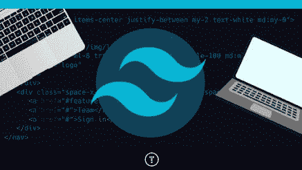
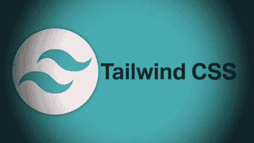
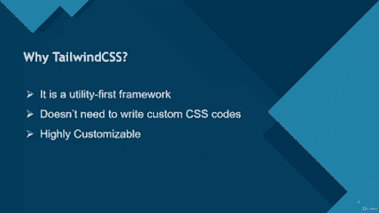
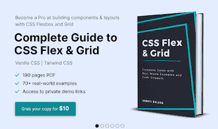

# 2023 年学习顺风 CSS 的 6 本最佳书籍和课程

> 原文：<https://medium.com/javarevisited/6-best-books-and-courses-to-learn-tailwind-css-5889c254ad2b?source=collection_archive---------1----------------------->

## 2023 年想学顺风 CSS？以下是 2023 年你可以阅读的最好的书籍和你可以参加的学习顺风 CSS 的最好的在线课程

大家好，如果你想在 2023 年学习顺风 CSS 和他们的实用程序课，并寻找学习顺风 CSS 的最佳在线课程，那么你来对地方了。

过去，我曾分享过学习 HTML 和 CSS 的最佳课程和另一个流行的 CSS 框架 [Bootstrap](https://javarevisited.blogspot.com/2020/07/top-5-courses-to-learn-bootstrap-in.html) ，在这篇文章中，我将分享 Tailwind CSS 的最佳在线课程。如果你不知道什么是 Tailwind CSS，我先给你简单概述一下。

Tailwind CSS 是另一个实用框架，它允许你将你的风格分解成小的可重用组件。通过为网站上的每个功能或部分创建 CSS 类，而不是用一个全球通用的大样式表占据所有页面空间，这可以防止重复并改善组织

这就是基本的想法，现在让我们来看看**到底什么是顺风 CSS**。顺风 CSS 可以用来以最快和最直接的方式创建网页。Tailwind CSS 是一个实用优先的 CSS 框架，允许你快速创建定制的用户界面。

这是一个高度可配置的底层 CSS 框架,它为你提供了创建个性化设计所需的所有构件，而不必努力去覆盖恼人的固执己见的风格。

关于 Tailwind CSS 最好的事情是，它不强制设计规范或你的网站应该如何出现；相反，您只需将小组件组合起来，就能创造出独特的用户体验。Tailwind 只是获取一个“原始”CSS 文件，通过配置文件对其进行处理，然后输出。因此，让我们来看看几个最好的在线课程。

# 2023 年 6 本适合初学者学习的最佳顺风 CSS 课程和书籍

以下是 2023 年学习 Tailwind CSS 的 5 个最好的在线课程。让我们详细检查每一个。这些是我通过像 Udemy 这样的最好的在线学习网站找到的最好的在线课程，Udemy 也很便宜，因为你只需花 10 美元就可以买到他们的大部分课程。

## 1.[从零开始学习 CSS 通过构建项目学习，作者 Brad Traversy](https://click.linksynergy.com/deeplink?id=CuIbQrBnhiw&mid=39197&murl=https%3A%2F%2Fwww.udemy.com%2Fcourse%2Ftailwind-from-scratch%2F)

这是我最喜欢的，也是 2023 年学习 Tailwind CSS 最吸引人和最新的课程。我是这门课程的讲师 Brad Traversy 的超级粉丝，在 50 天内完成了像 [50 个项目这样令人惊叹的课程——HTML、CSS & JavaScript](https://click.linksynergy.com/deeplink?id=JVFxdTr9V80&mid=39197&murl=https%3A%2F%2Fwww.udemy.com%2Fcourse%2F50-projects-50-days%2F) ，当我在 Twitter 上了解到这门课程时，我非常兴奋。

在 Udemy 上的这个顺风 CSS 课程中，你将使用顺风 CSS 实用程序类快速有效地构建漂亮的布局，而不像 Bootstrap 那样使用基于组件的类。通过建立有趣的项目，你将深入学习顺风 CSS。

[Brad Traversy](https://click.linksynergy.com/deeplink?id=JVFxdTr9V80&mid=39197&murl=https%3A%2F%2Fwww.udemy.com%2Fuser%2Fbrad-traversy%2F) 是一位优秀的讲师，他有一种天赋技能，能够用更简单、更干净、更简洁的方式解释事情，这让事情变得非常不同。最重要的是，他通过构建项目来教你东西，这是学习任何新技术(如 Tailwind CSS)的最佳方式，本课程也不例外。

您还将构建 5 个迷你项目和 6 个网站项目，并学习如何使用 Tailwind CLI 设置开发环境。总的来说，这是一个很好的课程，适合任何想学习并在项目中使用 Tailwind 的人。

**这里是加入本课程的链接** — [顺风 CSS 从零开始|通过构建项目学习](https://click.linksynergy.com/deeplink?id=CuIbQrBnhiw&mid=39197&murl=https%3A%2F%2Fwww.udemy.com%2Fcourse%2Ftailwind-from-scratch%2F)

## 2.[顺风 CSS:使用 CSS 构建网站的现代方式](https://click.linksynergy.com/deeplink?id=CuIbQrBnhiw&mid=39197&murl=https%3A%2F%2Fwww.udemy.com%2Fcourse%2Ftailwind-css-course%2F)

这是在 Udemy 上学习 Tailwind CSS 的另一个很棒的课程。本课程分为多个部分，每个部分都向您传授特定的概念。

第一部分解释了什么是 Tailwind，它与 [Bootstrap](/javarevisited/6-best-bootstrap-online-courses-for-web-designers-and-developers-a688e192b2e2) 有何不同，以及利用 Tailwind 优于其他框架或普通 CSS 的优缺点。在我们的 web 项目中，我们还学习了如何设置顺风。

第 2 节是关于构建项目的，但是在此之前，您将重温一下顺风的基础知识。我们将学习如何使用容器、伸缩框和网格布局在网页上放置项目。

使用 **Tailwind 实用程序类**，我们可以在这些项目之间添加边距、填充和间距。我们还将学习如何提供按钮、边框、阴影和边框半径等对象。

第 3 节是关于用 Tailwind 开发一个房地产门户。您将创建一个响应性的导航栏，以及一个带有按钮的站点横幅，这些按钮会变成断点。您还将学习如何使用卡片组件以更现代的方式呈现酒店照片和细节。

在第 4 部分中，您将学习如何创建一个具有现代外观的站点管理员仪表板，其中包含呈现统计数据的动态图表。Tailwind CSS 实用程序类将用于构建完整的仪表板。总的来说，Udemy 上学习 Tailwind CSS 最全面的课程之一

**这是加入本课程的链接**——[顺风 CSS:一种使用 CSS 构建网站的现代方式](https://click.linksynergy.com/deeplink?id=CuIbQrBnhiw&mid=39197&murl=https%3A%2F%2Fwww.udemy.com%2Fcourse%2Ftailwind-css-course%2F)

## 3.[顺风 CSS——一种新的>思考方式< CSS](https://click.linksynergy.com/deeplink?id=CuIbQrBnhiw&mid=39197&murl=https%3A%2F%2Fwww.udemy.com%2Fcourse%2Ftailwindcss-with-examples%2F)

本课程将教你如何在各种场景中安装、设置和使用 Tailwind CSS。他还将向您简要介绍 alpine.js，这是一个改变游戏规则的工具，可以在您的 web 设计中快速激活动画等行为。

他将为您提供本课程每个阶段的完整源代码，以及一些方便的备忘单，以帮助您记住以后学到的内容。

因为这个课程不是很长，我强烈建议你花一个周末或几个晚上来完成它，学习一些既有趣又无疑会在 2023 年的 web 开发中扮演重要角色的东西。

Tailwind CSS 是一种快速、高效、独特且有用的 web 内容样式化方法。通过成为最伟大的人来充分利用 CSS。忘记旧的 CSS 吧，在旧的 CSS 中，您必须为每个设备大小应用不同的样式表。

## 4.[学习顺风 CSS 建立自己的投资组合+酷项目](https://click.linksynergy.com/deeplink?id=CuIbQrBnhiw&mid=39197&murl=https%3A%2F%2Fwww.udemy.com%2Fcourse%2Flearn-tailwind-css-tesla-apple-cool-portfolio-tailwind-ui%2F)

本课程将教你如何在短时间内成为一名顺风 UI 设计师。这一课是为初学顺风 CSS 的人设计的，因为我们从基本的概念和样式组件开始。

为了教你基础知识，我们将首先回顾重要的主题和原则，并浏览所需的 Tailwind CSS 文档。接下来，我们将继续创建更复杂、更吸引人的在线用户界面。

你将从头开始创建一个精致的苹果用户界面，教你如何快速有效地创建华丽的专业网站。我们还将向您展示如何构建您自己的作品集网站，您可以对其进行个性化设置并加以利用。

本课程将从回顾基础开始，包括字体设计和排版，可适应的样式(特定屏幕尺寸的样式)，状态的变化(当悬停和聚焦在元素上时)， [UI/UX 设计](/javarevisited/6-best-figma-ui-ux-design-courses-for-beginners-94711d31ce61)，尺寸方面，具有相似背景的人群和外围的阶级划分

**这里是加入本课程的链接**——[学习顺风 CSS](https://click.linksynergy.com/deeplink?id=CuIbQrBnhiw&mid=39197&murl=https%3A%2F%2Fwww.udemy.com%2Fcourse%2Flearn-tailwind-css-tesla-apple-cool-portfolio-tailwind-ui%2F)

## 5.[顺风 CSS:完整指南(包含项目)](https://click.linksynergy.com/deeplink?id=CuIbQrBnhiw&mid=39197&murl=https%3A%2F%2Fwww.udemy.com%2Fcourse%2Fcomplete-guide-of-tailwind-css-%2F)

这是 2023 年又一个学习顺风 CSS 的牛逼 Udemy 课程。本课程将指导你为你的应用、公司、作品集或博客创建一个完美的响应网页。

稍微了解一下 HTML 和 CSS 有助于更快地开始使用 tailwind，但这不是必需的。

你不仅要设计一个干净、现代、专业的顺风登陆页面，还要包含动画和谷歌网页字体，让你的网站脱颖而出。我们将从学习顺风实用程序的基础开始，包括它们如何工作以及如何实现。

**以下是你将在本课程中学到的重要知识:**

*   你应该如何在你的项目中使用顺风？
*   如何定制 Tailwind 的内置工具
*   向我们的项目添加额外工具的最佳方式是什么？
*   顺风布局
*   响应式网页设计是一种适应大小的网页设计
*   如何在你的 CSS 页面上添加悬停和聚焦效果？

完成 Udemy 上的这个 Tailwind 课程后，你将有必要的理解和工具来为你的项目使用 Tailwind。

以下是加入本课程的链接— [顺风 CSS:完整指南(包括项目)](https://click.linksynergy.com/deeplink?id=CuIbQrBnhiw&mid=39197&murl=https%3A%2F%2Fwww.udemy.com%2Fcourse%2Fcomplete-guide-of-tailwind-css-%2F)

## 6.[Shruti Balasa 的 Flex and Grid with Tailwind CSS 电子书](https://gumroad.com/a/524440691/GHwFS)

你们中的许多人要求我在我的课程列表中也包括书籍，如果你是其中之一，那么你应该很高兴现在我将在我的课程列表中至少包括一本书，对于顺风，我已经包括了 Shruti Balasa 的 Flex 和 Grid with Tailwind CSS 书籍。

我在 Twitter 上看到了这本书，从那以后，Shruti 在这本顺风 CSS 书中分享的例子的清晰度和质量让我印象深刻。我正在与网格做斗争，这本书不仅帮助我更好地学习网格，还帮助我学习 CSS。

这本书主要教你网格和 Flex，但也是一个很好的介绍顺风 CSS。内容经过了充分的研究，例子也经过了精心的思考，这使得这本书成为想从 Tailwind CSS 开始的初学者的理想之选。它也很实惠，因为你可以在 Gumroad 上只花 17 美元买到这本书。

**这里是获得这本书的链接**—[Flex and Grid with Tailwind CSS 电子书](https://gumroad.com/a/524440691/GHwFS)

## 顺风 CSS 常见问题解答

这里有几个关于 Tailwind CSS 初学者经常问的问题，特别是当他们是新手，学习 Tailwind CSS 或来自 Bootstrap 背景时。

*1。为什么顺风 CSS 好？*
—它允许自由创建复杂的响应式布局:默认情况下，Tailwind CSS 框架有一个移动优先的方法。

*2。顺风比 bootstrap 好吗？*
—如果你想原型化/构建一些东西而不用担心设计，并且不介意事情看起来有点模板化，因为你在利用开箱即用的引导组件，你可以使用[引导](/javarevisited/7-free-courses-to-learn-bootstrap-for-web-designers-and-developers-5135215648f1)。一周中的任何一天，我都会选择顺风而不是 Bootstrap。

以上就是 2023 年**学习 Tailwind CSS 的最佳在线课程**。这些也是来自 Udemy 和其他流行的在线门户网站的最好的顺风 CSS 课程。所以现在男人不需要等待或思考太多。只要抓住任何适合你的最好的顺风 CSS 课程，开始你的旅程，从旧的 CSS 迁移到顺风 CSS。你们一定会喜欢的！

你可能喜欢的其他**网页设计和开发文章**

*   [2023 年前端开发者路线图](https://javarevisited.blogspot.com/2019/02/the-2019-web-developer-roadmap.html)
*   [深入学习 CSS 的 5 大课程](https://javarevisited.blogspot.com/2020/09/top-5-css-cascading-style-sheet-courses-for-beginners.html)
*   【Java 和 Web 开发者应该学习的 10 个框架
*   [成为全栈式 Web 开发人员的 10 大在线课程](/@javinpaul/top-10-online-courses-to-become-a-fullstack-web-developer-in-2020-d608a6b63232)
*   [在线学习 React.js 的 5 大课程](https://javarevisited.blogspot.com/2018/08/top-5-react-js-and-redux-courses-to-learn-online.html)
*   [Web 开发人员学习 Angular 的 10 门免费课程](https://javarevisited.blogspot.com/2019/04/10-free-angular-and-react-courses-for.html)
*   [2023 年学习盖茨比的五大课程](https://javarevisited.blogspot.com/2020/09/top-5-online-courses-to-learn-gatsby-in.html)
*   [学习 Node.js 和 Express.js 框架的前 5 门课程](http://javarevisited.blogspot.sg/2018/01/top-5-nodejs-and-express-js-online-courses-for-web-developers.html)
*   [2023 年学习 JavaScript 的 12 门免费课程](/javarevisited/12-free-courses-to-learn-javascript-and-es6-for-beginners-and-experienced-developers-aa35874c9a32)
*   [面向初学者的五大 WordPress 课程](https://javarevisited.blogspot.com/2020/08/top-5-courses-to-learn-wordpress-in.html)
*   [2023 年学习 Web 开发的十大课程](https://dev.to/javinpaul/top-6-courses-to-learn-web-development-best-of-lot-2fae)
*   [10 JavaScript 教程 Web 开发者应该查看](https://javarevisited.blogspot.com/2018/06/top-10-courses-to-learn-javascript-in.html)
*   每个 Fullstack 开发者都应该知道的 10 个框架
*   [10 门免费学习网页开发打字稿的课程](/javarevisited/top-10-free-typescript-courses-to-learn-online-best-of-lot-44bce9da41d1)
*   [2023 react . js 开发者路线图](https://javarevisited.blogspot.com/2018/10/the-2018-react-developer-roadmap.html)
*   [2023 年 Java 开发者应该学会的 10 件事](https://javarevisited.blogspot.com/2017/12/10-things-java-programmers-should-learn.html#axzz5atl0BngO)
*   [2023 年学习网页开发的 5 大课程](https://javarevisited.blogspot.com/2018/02/top-5-online-courses-to-learn-web-development.html)
*   [Web 开发的五大 Python 框架](https://javarevisited.blogspot.com/2019/04/top-5-python-web-development-frameworks.html)

感谢您阅读本文。如果你喜欢这些*最好的顺风 CSS 在线培训课程*，那么请分享给你的朋友和同事。如果您有任何问题或反馈，请留言。

**P. S.** —如果你是网页设计和开发的初学者，热衷于学习 CSS，如果你需要在线培训课程或课程来开始你的旅程，那么你也可以在 Udemy 上查看这个[**CSS—2023 年完整指南(包括 Flexbox，Grid & Sass)**](https://click.linksynergy.com/deeplink?id=JVFxdTr9V80&mid=39197&murl=https%3A%2F%2Fwww.udemy.com%2Fcourse%2Fcss-the-complete-guide-incl-flexbox-grid-sass%2F) 课程。从零开始学习 CSS 是最好的课程之一。

<https://javarevisited.blogspot.com/2019/05/top-5-html-5-and-css-3-courses-for-web-developers.html#axzz7DhisOz1u> 