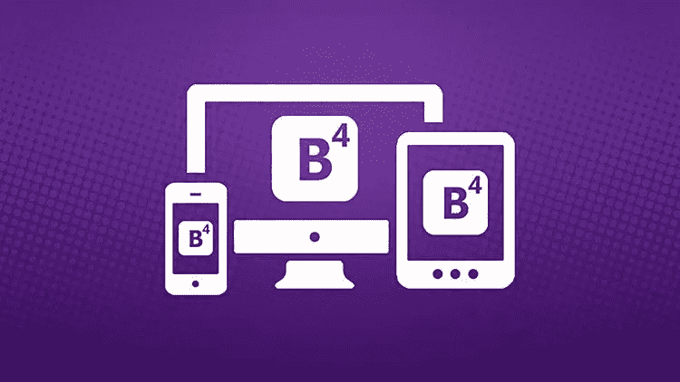
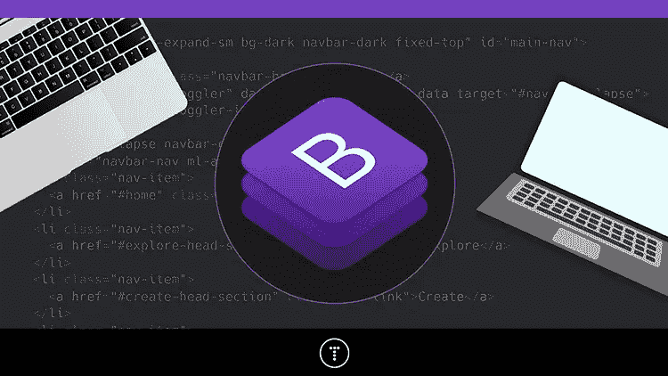
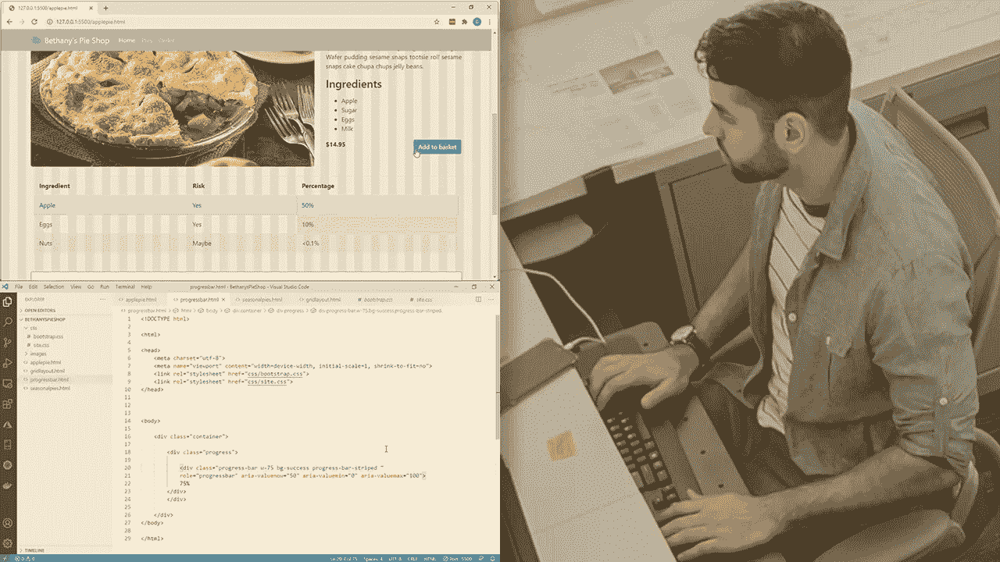
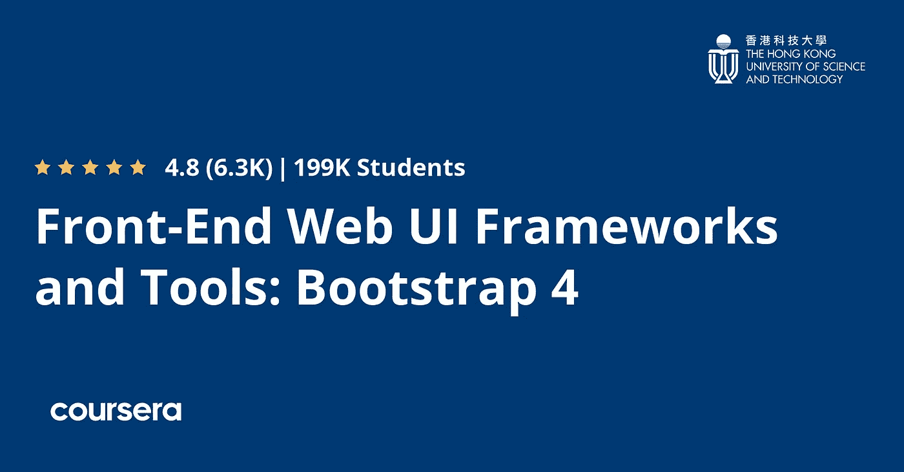
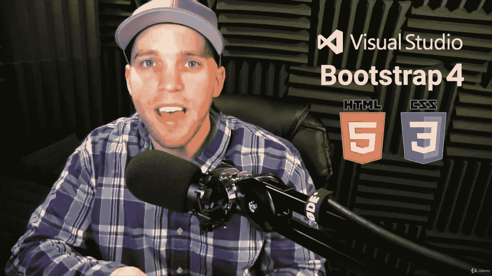
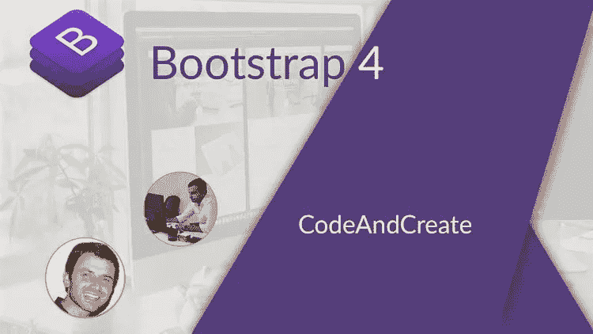

# 2023 年新手在线学习的 6 门最佳引导课程

> 原文：<https://medium.com/javarevisited/6-best-bootstrap-online-courses-for-web-designers-and-developers-a688e192b2e2?source=collection_archive---------0----------------------->

## 来自 Udemy、Pluralsight 和 Coursera 的最佳资源和在线课程的集合，用于深入学习 web 设计和开发的 Bootstrap。

如果你正在做网页设计和开发，并且想学习 Bootstrap 成为一个更好的网页设计师和网页开发者，那么你来对地方了。以前分享过学习[**HTML**](/javarevisited/10-best-html-and-css-courses-for-beginners-in-2021-6757eec00032) **，** [**CSS**](/javarevisited/top-5-advanced-css-courses-to-learn-flexbox-grid-and-sass-da8e37b09b1d) **，**[**JavaScript**](https://javarevisited.blogspot.com/2018/06/top-10-courses-to-learn-javascript-in.html)**，** [**Web 开发**](https://javarevisited.blogspot.com/2018/02/top-5-online-courses-to-learn-web-development.html) ，今天分享 2023 年学习 Bootstrap 的最佳在线课程。

Bootstrap 是世界上最流行的 CSS 框架之一，它旨在开发响应迅速、移动优先的网站。这就是为什么在过去的几年里它变得越来越受欢迎，并且是前端开发人员的基本工具之一。

其实[全栈开发者](/javarevisited/top-10-online-courses-to-become-a-fullstack-web-developer-in-2020-d608a6b63232)也可以通过学习 Bootstrap 来获得对设计的感觉，成为真正的全栈开发者。虽然在您的项目中学习和使用 Bootstrap 有很多原因，但 Bootstrap 的一个主要优点是可以节省大量编程时间。

这很好，因为程序员可以花更多的时间专注于网页的设计，以拥有一个视觉上有吸引力的网站。这也是一个非常好的选择，因为它背后有大量的信息、论坛和巨大的社区。这个 [CSS 框架](http://www.java67.com/2019/01/5-free-bootstrap-course-to-learn-online.html)包括了非常有用的特性，比如响应网格，自动标注图像尺寸，以及很酷的组件，比如导航条、进度条、缩略图和大尺寸等等。

如果你想学习[引导库](https://getbootstrap.com/)并寻找最好的在线课程和教程来开始你的旅程，那么你来对地方了。在这篇文章中，我将分享从三个最受欢迎的在线学习网站 [Udemy](https://javarevisited.blogspot.com/2019/08/top-10-udemy-courses-and-certifications-for-programmers.html) 、 [Coursera](https://javarevisited.blogspot.com/2019/10/top-5-coursera-professional-certificates-for-programmers-IT-professionals.html) 和 [Pluralsight](/javarevisited/top-10-pluralsight-courses-to-learn-programming-and-software-development-during-covid-19-stay-at-30b7d8a4f88f) 学习 Bootstrap 的最佳在线课程。正如我所说的，互联网上有很多自助课程，但是找到好的课程同样困难。你可能会在错误的路线上浪费大量的时间和金钱。这就是为什么我们列出了你可以在 2023 年参加的 **6 个最佳在线课程的原因。

这些也是网上学习 Bootstrap 最推荐的课程。无论您是初学者，还是使用 Bootstrap 但没有深入知识的人，这些课程都将帮助您入门并填补您学习中的空白。**

# 2023 年学习 Bootstrap 的 6 门最佳在线课程

这些是从 [Udemy](/javarevisited/15-best-udemy-courses-programmers-can-buy-on-black-friday-and-cyber-monday-2020-a803874f41d9) 、 [Coursera](/javarevisited/10-best-coursera-courses-for-web-development-and-web-design-9ec54ed92dd9) 和 [Pluralsight](/javarevisited/codecademy-or-pluralsight-which-is-a-better-platform-to-learn-coding-skills-59251a080642) 学习 Bootstrap 的最佳在线课程。这些课程由专家创建，受到成千上万的开发人员的信任，可以在线学习 Bootstrap。

它们也很实惠，尤其是 Udemy 课程，你只需花 10 美元就能在 Udemy 上买到，现在几乎每周都有。

## 1. [Bootstrap 4 教程 10 项目课程](https://click.linksynergy.com/deeplink?id=JVFxdTr9V80&mid=39197&murl=https%3A%2F%2Fwww.udemy.com%2Fcourse%2Fbootstrap-4-beta-ultimate-projects-course%2F)【Udemy】

如果你真的想在调整预算的情况下学习很多 Bootstrap，这是 Udemy 最完整的课程之一。它有大量的文档和长达 40 小时的视频教程，具有良好的视觉美感和高质量的内容。

教师约翰·斯米尔加在过去的几年里一直在开设课程，因为学生们的素质很高，所以受到了他们的好评。你可以看看他的[网站](https://www.johnsmilga.com/)来多了解他一点。本课程以创建 10 个示例项目为基础，这些示例项目将帮助学习者积累知识，并每次做一个稍微复杂一点的项目。到最后，你会看到很多不同的例子，你将能够创建自己的项目非常坚实和专业。

**这里是加入本自举 4 课程** — [自举 4 教程和 10 个项目课程](https://click.linksynergy.com/deeplink?id=JVFxdTr9V80&mid=39197&murl=https%3A%2F%2Fwww.udemy.com%2Fcourse%2Fbootstrap-4-beta-ultimate-projects-course%2F)的链接

## 2.[用 5 个项目从头开始启动 4 个](https://click.linksynergy.com/deeplink?id=JVFxdTr9V80&mid=39197&murl=https%3A%2F%2Fwww.udemy.com%2Fcourse%2Fbootstrap-4-from-scratch-with-5-projects%2F)【Udemy】

这是我在 Udemy 中最喜欢的引导课程之一，原因有两个，首先，它是由我最喜欢的导师之一 Brad Traversy 创建的，另一个原因是它是一门手把手的课程，专注于你真正需要的东西，没有无用的文档。本课程包括 11 个多小时的视频和 9 个文档档案。正如我所说，这个 Bootstrap 在线课程是由最好的 web 开发导师之一 [Brad Traversy](https://click.linksynergy.com/deeplink?id=JVFxdTr9V80&mid=39197&murl=https%3A%2F%2Fwww.udemy.com%2Fuser%2Fbrad-traversy%2F) 创建的，这是一个通过做真实项目来学习 Bootstrap 的理想课程。唯一的缺点是价格，这个课程会让你投入相当多的钱，但是如果这对你来说不是问题的话，我推荐这个选项。我会一直说，投资自己的教育永远不会浪费金钱。

**这里是加入这个令人敬畏的课程**——[从零开始的 Bootstrap 4 与 5 个项目](https://click.linksynergy.com/deeplink?id=JVFxdTr9V80&mid=39197&murl=https%3A%2F%2Fwww.udemy.com%2Fcourse%2Fbootstrap-4-from-scratch-with-5-projects%2F)

如果你能等的话，你也可以花 10 美元在“我的销售”网站上学习这门课程，这种事情时有发生

## 3. [Bootstrap:入门](https://pluralsight.pxf.io/c/1193463/424552/7490?u=https%3A%2F%2Fwww.pluralsight.com%2Fcourses%2Fbootstrap-getting-started)【plural sight】

正如我所说，Bootstrap 是几乎每个 web 开发人员和 web 设计人员工具箱中的基本工具。这是创建响应迅速、移动优先的网站的关键，本课程将教你如何用 Bootstrap 设计你的第一页。

在本课程中，您将学会以实际动手的方式使用 Bootstrap 框架。首先，您将探索 Bootstrap 框架的关键部分，以便了解 Bootstrap 可以帮助您实现什么。

之后，您将发现如何基于网格和其他[引导类](https://javarevisited.blogspot.com/2020/07/top-5-courses-to-learn-bootstrap-in.html)创建一个响应式布局。最后，您将学习如何添加组件来增强用户在您的站点上的体验。

学完本课程后，你将掌握构建现代移动网站所需的 Bootstrap 技能和知识。

**以下是加入本课程的链接**——[引导:入门](https://pluralsight.pxf.io/c/1193463/424552/7490?u=https%3A%2F%2Fwww.pluralsight.com%2Fcourses%2Fbootstrap-getting-started)

顺便说一下，你需要一个 [Pluralsight 会员](https://pluralsight.pxf.io/c/1193463/424552/7490?u=https%3A%2F%2Fwww.pluralsight.com%2Flearn)才能加入这个课程，费用大约是每月 29 美元或每年 299 美元(14%的折扣)。我向所有程序员强烈推荐这个订阅，因为它提供了超过 7000 个在线课程的即时访问，以学习任何技术技能。或者，你也可以使用他们的 [**10 天免费通行证**](https://pluralsight.pxf.io/c/1193463/424552/7490?u=https%3A%2F%2Fwww.pluralsight.com%2Flearn) 免费观看这个课程。

 [## 个人技术技能|多视角

### 借助 Pluralsight，在开发运维、机器学习、云、安全基础设施等领域构建所需技能…

pluralsight.pxf.io](https://pluralsight.pxf.io/c/1193463/424552/7490?u=https%3A%2F%2Fwww.pluralsight.com%2Flearn) 

## 4.[前端 Web UI 框架和工具:Bootstrap 4](https://coursera.pxf.io/c/3294490/1164545/14726?u=https%3A%2F%2Fwww.coursera.org%2Flearn%2Fbootstrap-4)

这是在 Coursera 上学习 Bootstrap 的最佳课程。这门课程背后有一个非常重要的制度，通常是这门课程不会无用的保证。37%上过这门课的人肯定这门课为他们提供了很多职业机会。另外 34%的学生保证这有助于他们职业生涯和技能的发展。

课程的创建者保证课程将非常有用，特别是对于[全栈 Web](/javarevisited/top-10-online-courses-to-become-a-fullstack-web-developer-in-2020-d608a6b63232) 和[移动应用开发者](/javarevisited/10-frameworks-and-libraries-mobile-application-developers-can-learn-in-2020-e0b91391cade)。这门课程是由香港科技大学提供的

**这里是加入本课程的链接**——[前端 Web UI 框架和工具:Bootstrap 4](https://coursera.pxf.io/c/3294490/1164545/14726?u=https%3A%2F%2Fwww.coursera.org%2Flearn%2Fbootstrap-4)

顺便说一下，如果你喜欢 Coursera 课程和专业，主要是因为它们是由世界各地的知名公司和大学创建的，我建议你加入 [**Coursera Plus**](https://coursera.pxf.io/c/3294490/1164545/14726?u=https%3A%2F%2Fwww.coursera.org%2Fcourseraplus) ，这是一个课程订阅计划，可以访问他们最受欢迎的课程、专业、专业证书和指导项目。

虽然它的费用约为 399 美元/年，这看起来有点贵，但它完全值得你的钱，因为你可以获得无限的证书。

 [## Coursera Plus |无限制访问 7，000 多门在线课程

### 用 Coursera Plus 投资你的职业目标。无限制访问 90%以上的课程、项目…

coursera.pxf.io](https://coursera.pxf.io/c/3294490/1164545/14726?u=https%3A%2F%2Fwww.coursera.org%2Fcourseraplus) 

## 5.[通过创建高级引导主题](https://click.linksynergy.com/deeplink?id=JVFxdTr9V80&mid=39197&murl=https%3A%2F%2Fwww.udemy.com%2Fcourse%2Flearn-bootstrap-4-by-creating-an-advanced-bootstrap-theme%2F)学习引导 4

这是 Udemy 在 2023 年推出的另一个非常棒的在线课程。由 Drew Ryan 创建本课程将通过从头开始创建一个高级 Bootstrap 4 响应网站模板来教你 Bootstrap 4，没有跳过任何步骤！

本课程将向您展示如何从空白的 [HTML](https://pluralsight.pxf.io/c/1193463/424552/7490?u=https%3A%2F%2Fwww.pluralsight.com%2Fcourses%2Fbootstrap-getting-started) 、 [CSS](https://www.java67.com/2019/01/5-free-bootstrap-course-to-learn-online.html) 和 [JavaScript](/javarevisited/10-best-online-courses-to-learn-javascript-in-2020-af5ed0801645) 文件开始，从头开始制作一个完整的 Bootstrap 4 模板！这是一个快节奏的课程，给你最快，但最彻底的引导网站建设的经验。

一旦你完成了课程，你将能够设计和开发你自己的 Bootstrap 4 模板和主题。我们开发的完整主题的源代码包括在内

**这是加入本课程的链接** — [通过创建高级引导主题](https://click.linksynergy.com/deeplink?id=JVFxdTr9V80&mid=39197&murl=https%3A%2F%2Fwww.udemy.com%2Fcourse%2Flearn-bootstrap-4-by-creating-an-advanced-bootstrap-theme%2F)学习引导 4

## 5. [Bootstrap —创建 4 个真实项目](https://click.linksynergy.com/deeplink?id=JVFxdTr9V80&mid=39197&murl=https%3A%2F%2Fwww.udemy.com%2Fcourse%2Fbootstrap-4-create-4-real-world-projects-latest-411%2F)【Udemy】

这是另一个来自 Udemy 的最佳引导课程。如果你需要一个快速的课程来开始做准备，这就是你的课程。Laurence 使它成为一种快速访问主引导实用程序的方法，因此您可以快速开始创建您想要的项目。

完成本课程后，您将准备好开始创建伟大的项目，并在良好的基础上开始变得更好，同时您已经在生成自己的内容。

这个在线引导课程包括两个小时的视频教程，向你展示基本的东西，然后包括 21 篇文章，帮助你建立开始你需要的第一个项目所需的水平。

**这是加入本课程的链接** — [引导—创建 4 个真实项目](https://click.linksynergy.com/deeplink?id=JVFxdTr9V80&mid=39197&murl=https%3A%2F%2Fwww.udemy.com%2Fcourse%2Fbootstrap-4-create-4-real-world-projects-latest-411%2F)

以上是关于**深入学习 Bootstrap 4 的最佳在线课程**。这些是来自 Udemy、Coursera 和 Pluralsight 的真正最好和最值得推荐的引导课程，如果你真的想成为一名前端开发人员，你必须学习这个基本的 CSS 框架。在过去的几年里，电话变得越来越重要。这就是为什么对于开发人员来说，发展和学习关于便携设备的工具和技术是非常重要的。

正如你在这篇文章中所看到的，Bootstrap 是如今已经根深蒂固的工具之一，对于一个前端开发人员来说，很好地了解它是非常重要的。这就是为什么我希望这篇文章能帮助你选择更适合你的情况和职业生涯继续发展的必要性的课程。

其他**网页设计与开发文章**你可能喜欢

*   [2023 年前端开发者路线图](https://javarevisited.blogspot.com/2019/02/the-2019-web-developer-roadmap.html)
*   [2023 年学习 JavaScript 的 12 门免费课程](/javarevisited/12-free-courses-to-learn-javascript-and-es6-for-beginners-and-experienced-developers-aa35874c9a32)
*   [深入学习 HTML 5 的前 5 门课程](https://www.java67.com/2020/08/5-best-online-courses-to-learn-html-5.html)
*   [2023 年学习 Web 开发的十大课程](https://dev.to/javinpaul/top-6-courses-to-learn-web-development-best-of-lot-2fae)
*   [10 门免费学习网页开发打字稿的课程](/javarevisited/top-10-free-typescript-courses-to-learn-online-best-of-lot-44bce9da41d1)
*   [每个 Fullstack 开发者都应该知道的 10 个框架](https://javarevisited.blogspot.com/2019/01/10-web-development-frameworks-fullstack-developer-should-learn.html)
*   [成为全栈式 Web 开发人员的 10 大在线课程](/@javinpaul/top-10-online-courses-to-become-a-fullstack-web-developer-in-2020-d608a6b63232)
*   【Java 和 Web 开发者应该学习的 10 个框架
*   [Web 开发人员学习 Angular 的 10 门免费课程](https://javarevisited.blogspot.com/2019/04/10-free-angular-and-react-courses-for.html)
*   [在线学习 React.js 的 5 大课程](https://javarevisited.blogspot.com/2018/08/top-5-react-js-and-redux-courses-to-learn-online.html)
*   [学习 Node.js 和 Express.js 框架的前 5 门课程](http://javarevisited.blogspot.sg/2018/01/top-5-nodejs-and-express-js-online-courses-for-web-developers.html)
*   [10 JavaScript 教程 Web 开发人员应该查看](https://javarevisited.blogspot.com/2018/06/top-10-courses-to-learn-javascript-in.html)
*   [2023 react . js 开发者路线图](https://javarevisited.blogspot.com/2018/10/the-2018-react-developer-roadmap.html)
*   [2023 年学习 Web 开发的五大课程](https://javarevisited.blogspot.com/2018/02/top-5-online-courses-to-learn-web-development.html)
*   [2023 年 Java 开发人员应该学会的 10 件事](https://javarevisited.blogspot.com/2017/12/10-things-java-programmers-should-learn.html#axzz5atl0BngO)
*   [Web 开发的五大 Python 框架](https://javarevisited.blogspot.com/2019/04/top-5-python-web-development-frameworks.html)

感谢您阅读本文。如果你喜欢这些*最好的 Bootstrap 在线培训课程*，那么请分享给你的朋友和同事。如果您有任何问题或反馈，请留言。

**P. S. —** 如果你热衷于学习 Bootstrap，但正在寻找一个免费的在线培训课程来开始你的学习之旅，那么你也可以在 Udemy 上看看这个由 brad Hussey 教授的 [**Bootstrap 4 快速入门:编写现代响应网站**](https://click.linksynergy.com/deeplink?id=JVFxdTr9V80&mid=39197&murl=https%3A%2F%2Fwww.udemy.com%2Fcourse%2Fbootstrap-4%2F) 课程。这是完全免费的，你只需要一个 Udemy 帐户就可以注册这门课程。

 [## 免费自举教程-自举 4 快速入门:编码现代响应网站

### 作为一名技术高超的专业人士，Brad Hussey 是一名充满激情、经验丰富的自由职业网页设计师、开发人员、博客作者…

udemy.com](https://click.linksynergy.com/deeplink?id=JVFxdTr9V80&mid=39197&murl=https%3A%2F%2Fwww.udemy.com%2Fcourse%2Fbootstrap-4%2F)