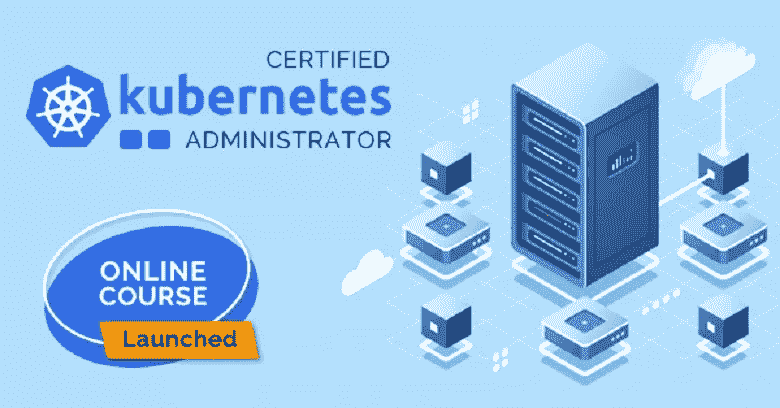
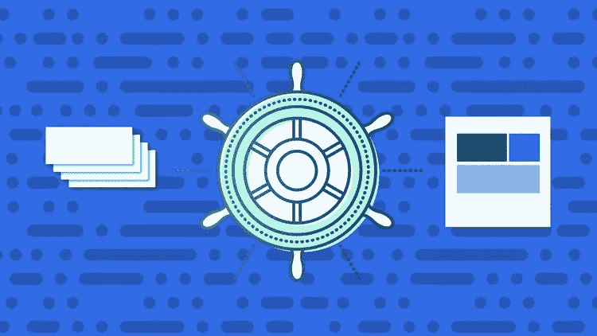
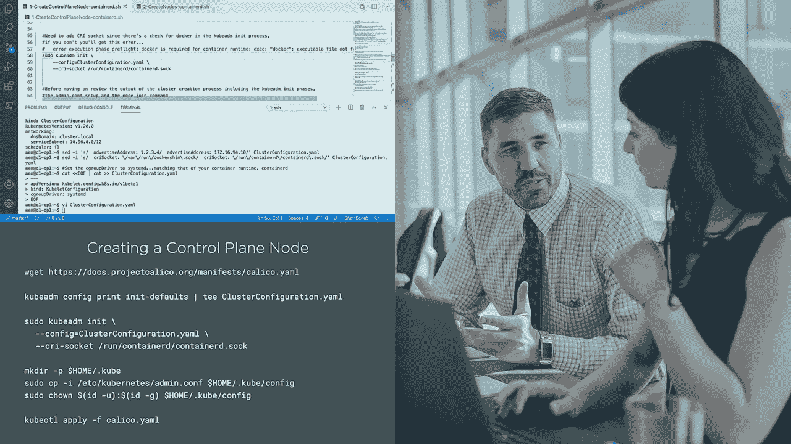
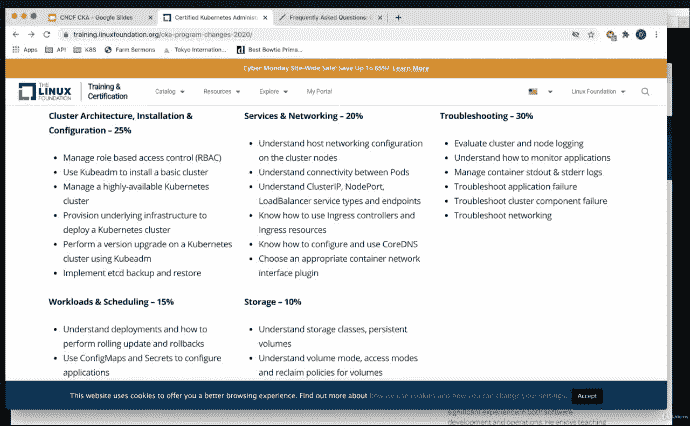

# 2023 年 Kubernetes 管理员认证考试(CKA)的 6 门最佳课程和实践测试

> 原文：<https://medium.com/javarevisited/6-best-certified-kubernetes-administrator-courses-and-practice-tests-to-crack-cka-exam-46a14549720f?source=collection_archive---------0----------------------->

## 我最喜欢的准备 2023 年 Kubernetes 管理员(CKA)认证考试的资源来自 Udemy、Pluralsight 和 Whizlabs。

大家好，如果你正在准备 Kubernetes 管理员认证，也被称为 CKA，并寻找最好的在线课程和练习测试开始，那么你来对地方了。

在过去，我已经分享了 [**最佳 Kubernetes 课程**](/javarevisited/10-best-kubernetes-courses-for-developers-and-devops-engineers-94c35cd3a2fd) 和 [**最佳 Docker 认证课程**](/javarevisited/10-best-courses-and-practice-tests-to-crack-docker-certified-associate-dca-certification-exam-b0b21648df4e) ，在本文中，我将分享最佳在线课程，为久负盛名的**认证 Kubernetes 管理员(CKA)** 考试做准备。

对于管理云环境和 Kubernetes 集群的熟练 Kubernetes 管理员*有很多需求，但是市场上没有足够的有经验的 Kubernetes 专家，这次考试旨在培养熟练的 Kubernetes 开发人员和管理员。

认证 Kubernetes 管理员(Certified Kubernetes Administrator)，也称为 CKA，是由云原生计算基金会和 Linux 基金会开发的一项认证，旨在帮助开发 Kubernetes 生态系统。Kubernetes 是新的，但它正在逐年扩大。云原生计算基金会试图扩展这项技术，以便更多的人能够加入。通过 CKA 和 CKAD 项目，基金会正在帮助世界各地的组织雇佣高质量的 Kubernetes 管理员和 Kubernetes 应用程序开发人员。

**认证 Kubernetes 管理员(CKA)** 认证是一个有价值的认证。在就业市场上认可度很高。这个认证一定会帮助你找到一份体面的工作，成为一名 Kubernetes 管理员。

但这是一个高水平的考试，需要适当的指导和理解各种 [Kubernetes 管理概念](/javarevisited/top-15-online-courses-to-learn-docker-kubernetes-and-aws-for-fullstack-developers-and-devops-d8cc4f16e773)。在认证 Kubernetes 管理员考试中，您将有 3 个小时(180 分钟)的时间来完成 24 项基于绩效的任务。*

考试将测试你作为一名管理员的 Kubernetes 知识，如果没有充分的准备，很难通过。在本文中，我们将列出 6 大认证 Kubernetes 管理员(CKA)在线课程，帮助您通过认证。

# 6 2023 年 Kubernetes 管理员认证(CKA)考试的最佳资源

以下是为 2023 年 Kubernetes 管理员认证做准备的最佳在线培训课程列表。该列表包括来自 [Udemy](https://click.linksynergy.com/deeplink?id=CuIbQrBnhiw&mid=39197&murl=https%3A%2F%2Fwww.udemy.com%2F) 、 [Coursera](https://coursera.pxf.io/c/3294490/1164545/14726?u=https%3A%2F%2Fwww.coursera.org%2F) 、 [Whizlabs](https://shareasale.com/r.cfm?b=1551042&u=880419&m=43514&urllink=&afftrack=) 和 [Pluralsight](https://pluralsight.pxf.io/c/1193463/424552/7490?u=https%3A%2F%2Fwww.pluralsight.com) 的最佳课程，以针对不同的考试主题对您进行培训，并为您提供通过这一困难的 Kubernetes 考试所需的所有必要知识。

对于不熟悉 Kubernetes 世界的人，我在本文末尾还提到了一个学习 Kubernetes 基础知识的免费课程。

## 1.【Kubernetes 认证管理员(CKA)带模拟测试

这是为 Udemy 的认证 Kubernetes 管理员课程做准备的最佳在线课程之一。该课程包括通过 CKA 考试的所有必要概念。

您将了解 Kubernetes 的核心概念、调度、日志记录、监控、应用程序生命周期管理、集群维护、安全性、存储和网络。此外，它也有宝贵的模拟测试，将帮助您了解实际考试。
要求
1。对 docker
2 的基本了解。YAML 语

这是一个很长的课程，视频内容超过十五个小时。导师 [Mumshad Mannambeth](https://click.linksynergy.com/deeplink?id=CuIbQrBnhiw&mid=39197&murl=https%3A%2F%2Fwww.udemy.com%2Fuser%2Fmumshad-mannambeth%2F) 是一位经验丰富的 Kubernetes 专家，他会深入讲解每一个必要的概念，详细解释每一件事。

如果你必须选择一门课程来为 Kubernetes 管理员认证做好准备，那么就选这门吧。这是最好的入门课程。

**以下是参加本课程的链接**——[Kubernetes 认证管理员(CKA)带模拟测试](https://click.linksynergy.com/deeplink?id=JVFxdTr9V80&mid=39197&murl=https%3A%2F%2Fwww.udemy.com%2Fcourse%2Fcertified-kubernetes-administrator-with-practice-tests%2F)

## 2.[认证 Kubernetes 管理员(CKA)](http://shrsl.com/2h592)

这是另一个在 whizlabs 为认证的 Kubernetes 管理员准备的极好的资源。课程分为几个章节，每个章节都有视频授课。Kubernetes 的核心概念被详细地涵盖，没有任何匆忙。

本课程还讲述了其他重要概念，如网络、计划、存储、应用生命周期管理、日志记录、集群维护和安全性。

本课程的视频内容总计超过八个小时。你会发现总共有 59 堂课，涵盖了所有的考试目标。此外，本课程有百分之百的退款保证。

**以下是参加本课程的链接**—[Kubernetes 认证管理员(CKA)](http://shrsl.com/2h592)

顺便说一句，如果您正在准备认证，请考虑参加 [**Whizlabs 订阅**](https://shareasale.com/r.cfm?b=1551042&u=880419&m=43514&urllink=&afftrack=) ，它提供对他们所有在线培训课程、动手实验室以及不同云和 DevOps 认证的模拟测试的全面访问，每年仅需 99 美元(现在有 50%的折扣)。我强烈推荐这个订阅计划，因为 Whizlabs 有最好的材料来准备 IT 认证。

 [## 最实惠的订阅计划- Whizlabs

### 为了您的方便，我们提供最实惠的订购计划。立即注册，向前迈出一步，提升您的…

www.whizlabs.com](https://www.whizlabs.com/subscription/?sscid=51k5_zuly0) 

## 3.[认证 Kubernetes 管理员 2023](https://click.linksynergy.com/deeplink?id=CuIbQrBnhiw&mid=39197&murl=https%3A%2F%2Fwww.udemy.com%2Fcourse%2Fcertified-kubernetes-administrator%2F)【Udemy 最佳课程】

这是为 2023 年的认证 Kubernetes 管理员考试做准备的又一门顶级 Udemy 课程。本课程由 Zeal Vora 创建，他是云计算和安全相关领域最好的 Udemy 讲师之一，本课程将指导您深入准备认证 Kubernetes 管理员认证。

该课程完全是从零开始设计的，这使得它成为任何刚接触 Kubernetes 领域的人的必备课程。

以下是你将在这个 6 小时的课程中学到的东西:

1.  Kubernetes 的强大基础
2.  从头开始设计 Kubernetes 集群
3.  Kubernetes 的安全方面
4.  Kubernetes 的网络方面
5.  故障排除和集群维护。

本课程是专门为那些希望获得“认证 Kubernetes 管理员”认证的人以及那些希望在 Kubernetes 上打下坚实基础的人设计的

**这是参加 CKA 课程**——[认证 Kubernetes 管理员 2023](https://click.linksynergy.com/deeplink?id=CuIbQrBnhiw&mid=39197&murl=https%3A%2F%2Fwww.udemy.com%2Fcourse%2Fcertified-kubernetes-administrator%2F) 的链接

## 4.【Kubernetes 认证管理员(CKA)硕士课程

这是另一个惊人的 Udemy 课程，为认证 Kubernetes 管理员准备。与之前的课程相比，这不是一门很长的课程，但是讲师涵盖了所有必要的概念，例如网络、时间安排、存储、应用程序生命周期管理、日志记录、集群维护和安全性。
要求
1。容器的基本知识
2。任何云服务的注册表，如 [AWS](https://javarevisited.blogspot.com/2020/08/top-10-coursera-certifications-to-learn-cloud-computing-aws.html) 或[微软 Azure](https://www.java67.com/2020/07/5-free-courses-to-learn-microsoft-azure-cloud.html) 。

这是一个速成班，针对准备参加 Kubernetes 管理员认证考试的人。如果你没有时间去深入，但你仍然想了解 Kubernetes 的概念，那么你应该去这个课程。

**以下是参加本课程**—[Kubernetes 认证管理员(CKA)硕士课程](https://click.linksynergy.com/deeplink?id=JVFxdTr9V80&mid=39197&murl=https%3A%2F%2Fwww.udemy.com%2Fcourse%2Fcertified-kubernetes-administrator-cka-master-course%2F)的链接

## 5. [Kubernetes 安装和配置基础知识](https://pluralsight.pxf.io/c/1193463/424552/7490?u=https%3A%2F%2Fwww.pluralsight.com%2Fcourses%2Fkubernetes-installation-configuration-fundamentals)

对于 Kubernetes 管理员来说，安装和配置基础非常重要。个人应该对这些基本知识有适当的了解。

在本 Pluralsight CKA 课程中，讲师将从架构开始，然后解释如何创建集群。当集群启动并运行时，讲师会解释如何使用集群并将集群部署到 Kubernetes。

以下是您将在本课程中学到的重要内容

*   [Kubernetes](/javarevisited/7-free-online-courses-to-learn-kubernetes-in-2020-3b8a68ec7abc) 简介
*   如何构建自己的 Kubernetes 集群
*   如何与 Kubernetes 集群交互

这是一门中级课程，视频内容不到三个小时。本课程的重点是安装和配置基础知识，这是 CKA 考试所必需的。

**以下是参加本课程的链接** — [Kubernetes 安装和配置基础](https://pluralsight.pxf.io/c/1193463/424552/7490?u=https%3A%2F%2Fwww.pluralsight.com%2Fcourses%2Fkubernetes-installation-configuration-fundamentals)

顺便说一下，你需要一个 [Pluralsight 会员](https://pluralsight.pxf.io/c/1193463/424552/7490?u=https%3A%2F%2Fwww.pluralsight.com%2Fpricing%2Ffree-trial)才能加入这个课程，费用大约是每月 29 美元或每年 299 美元(14%的折扣)。我向所有程序员强烈推荐这个订阅，因为它提供了超过 7000 个在线课程的即时访问，以学习任何技术技能。或者，你也可以使用他们的 [**10 天免费通行证**](https://pluralsight.pxf.io/c/1193463/424552/7490?u=https%3A%2F%2Fwww.pluralsight.com%2Flearn) 免费观看本课程。

 [## 对个人来说

### Pluralsight 的使命一直是公平的技术竞争环境。不管你想学什么，或者…

pluralsight.pxf.io](https://pluralsight.pxf.io/c/1193463/424552/7490?u=https%3A%2F%2Fwww.pluralsight.com%2Flearn) 

## 6. [Kubernetes 大师课程|认证 Kubernetes 管理员](https://click.linksynergy.com/deeplink?id=CuIbQrBnhiw&mid=39197&murl=https%3A%2F%2Fwww.udemy.com%2Fcourse%2Fkubernetes-master-course-certified-kubernetes-administrator%2F)

这是 Udemy 为认证 Kubernetes 准备的另一个详细的课程。讲师 [Dean Houari](https://click.linksynergy.com/deeplink?id=CuIbQrBnhiw&mid=39197&murl=https%3A%2F%2Fwww.udemy.com%2Fuser%2Fdean-houari-2%2F) 不慌不忙地详细讲解安装和配置基础知识。

讲师还会深入讲解所有其他重要概念，例如 pod、复制控制器、副本集、部署、服务、配置图和机密以及永久存储。

要求
1。码头工人基础知识
2。YAML 语法
3。了解基本的 Linux 命令

**认证的 Kubernetes 管理员**认证已经成为云原生认证的圣杯，它的全手考试类似于网络工程师的 CCIE。

本课程将通过讲座和逐步演示实验帮助您学习并通过这一令人垂涎的认证。它将为您提供真实的用例场景。

**以下是加入本课程的链接** — [Kubernetes 大师课程|认证 Kubernetes 管理员](https://click.linksynergy.com/deeplink?id=CuIbQrBnhiw&mid=39197&murl=https%3A%2F%2Fwww.udemy.com%2Fcourse%2Fkubernetes-master-course-certified-kubernetes-administrator%2F)

以上就是 2023 年通过认证 Kubernetes 管理员认证的**最佳在线课程**。库伯内特认证管理员( [CKA](https://www.cncf.io/certification/cka/) )是一个具有挑战性的考试，但是通过适当的指导和准备是可以通过的。在这篇文章中，我们列出了前五门课程，这将有助于你准备这次考试。这些课程选自 [Udemy](https://click.linksynergy.com/deeplink?id=CuIbQrBnhiw&mid=39197&murl=https%3A%2F%2Fwww.udemy.com%2F) 、 [Whizlabs](https://shareasale.com/r.cfm?b=1551042&u=880419&m=43514&urllink=&afftrack=) 、 [Pluralsight](https://pluralsight.pxf.io/c/1193463/424552/7490?u=https%3A%2F%2Fwww.pluralsight.com) 等顶级教育网站。因此，仔细阅读每门课程，然后做出选择。

其他 **DevOps 和云计算资源**你可能喜欢

*   [2023 年开发运维开发者路线图](/hackernoon/the-2018-devops-roadmap-31588d8670cb)
*   [学习亚马逊网络服务我最喜欢的课程](https://javarevisited.blogspot.com/2020/05/top-5-amazon-web-services-aws-courses-for-beginners-and-experienced-programmers.html)
*   [面向程序员的 10 门 Docker 和 Kubernetes 课程](https://dev.to/javinpaul/top-10-courses-to-learn-docker-and-kubernetes-for-programmers-4lg0)
*   [如何成为 Azure 认证管理员助理？](https://javarevisited.blogspot.com/2020/04/how-to-crack-microsoft-az-103-azure-administrator-associate-exam-certification.html)
*   [破解 AWS 解决方案架构师考试的 5 门最佳课程](/javarevisited/top-5-aws-training-courses-to-crack-amazon-web-service-solutions-architect-associate-certification-3f4affa8f660?source=collection_home---4------0-----------------------)
*   [如何破解 AZ-300 Azure 解决方案架构师考试？](/javarevisited/how-to-prepare-for-aws-solution-architect-associate-certification-saa-c01-saa-c02-exam-in-2021-a6e7e7e771fc)
*   [通过谷歌助理云工程师认证的前 5 门课程](/javarevisited/5-best-gcp-associate-cloud-engineer-certification-courses-in-2021-c93d7e35228a)
*   [破解 Azure 云架构师(AZ-300)考试的前 5 门课程](https://javarevisited.blogspot.com/2019/07/top-5-courses-to-crack-azure-architecture-technologies-certification-az-300-exam.html#axzz6E6VuRMsx)
*   [通过 AWS 云从业者认证的前 5 门课程](https://javarevisited.blogspot.com/2020/02/top-5-courses-to-crack-aws-certified-cloud-practitioner-exam-certification-clf-c01.html)
*   [程序员学习 AWS 和云的 10 门免费课程](/javarevisited/top-10-courses-to-learn-amazon-web-services-aws-cloud-in-2020-best-and-free-317f10d7c21d)

感谢阅读到目前为止。如果你喜欢这些*最佳 Kubernetes 管理员认证(CKA)课程*，请与你的朋友和同事分享。如果您有任何问题或反馈，请留言。

**附言——**如果你是 Kubernetes 新手，正在寻找免费课程，那么你也可以在 Udemy 上查看这个 [**Kubernetes:入门**](https://click.linksynergy.com/deeplink?id=JVFxdTr9V80&mid=39197&murl=https%3A%2F%2Fwww.udemy.com%2Fcourse%2Fkubernetes-getting-started%2F) 免费课程。这是完全免费的，你需要的只是一个免费的 Udemy 帐户来注册这个在线培训课程。

 [## 免费 Kubernetes 教程- Kubernetes:入门(2019)

### 请考虑“在您评价和回顾”本课程之前:这只是一个入门课程，还有更多…

udemy.com](https://click.linksynergy.com/deeplink?id=JVFxdTr9V80&mid=39197&murl=https%3A%2F%2Fwww.udemy.com%2Fcourse%2Fkubernetes-getting-started%2F)