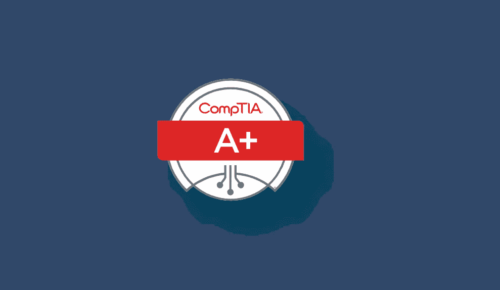
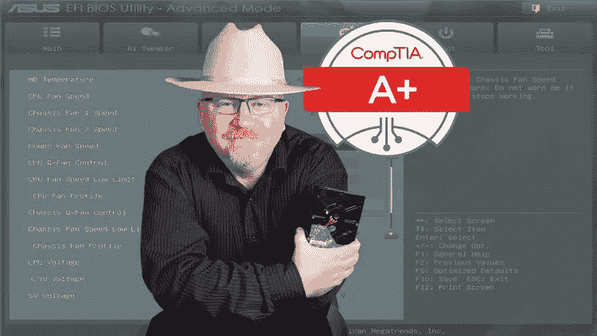
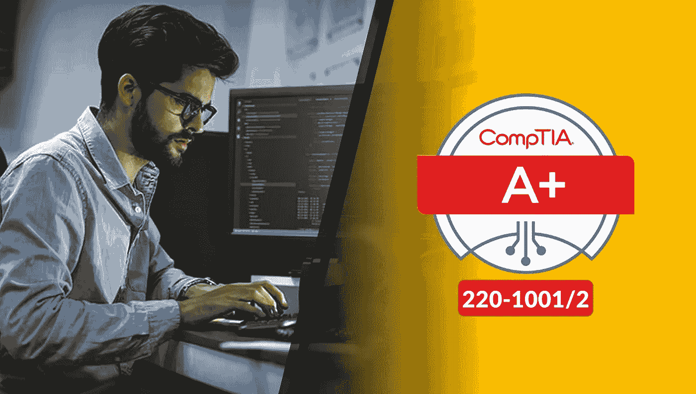
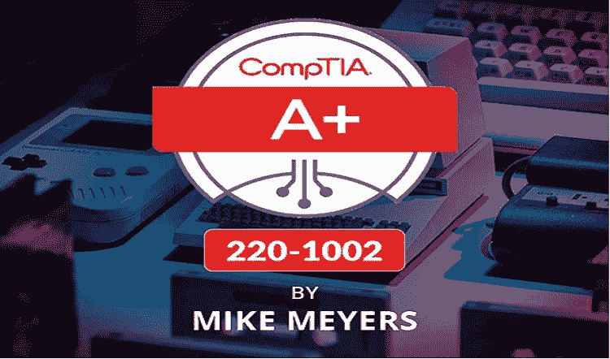
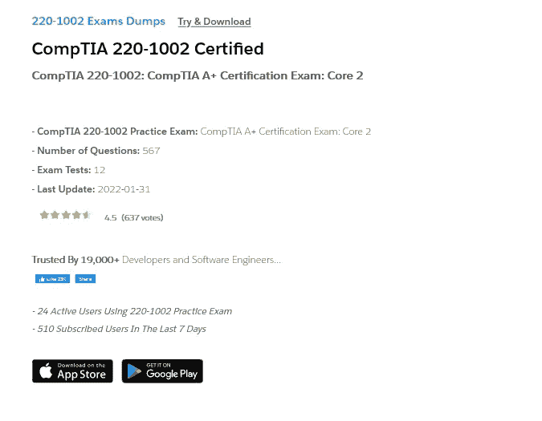
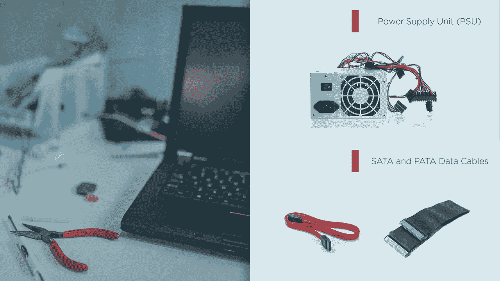

# 6 最佳 CompTIA A+(220–1001 和 220–1002)认证课程、实践测试和 2023 年转储

> 原文：<https://medium.com/javarevisited/6-best-comptia-a-220-1001-and-220-1002-online-training-courses-practice-tests-and-dumps-cfc25759b808?source=collection_archive---------0----------------------->

## 这些是为 Udemy 和 Pluralsight 的 CompTIA A+认证核心 1 和核心 2(220–1001 和 220–1002)做准备的最佳在线课程和练习测试。

大家好，如果你的目标是 CompTIA A+认证(220–1001 和 220–1002)并寻找最好的资源，那么你来对地方了。之前我已经分享了最好的 [CompTIA Linux+认证](https://javarevisited.blogspot.com/2020/07/top-5-courses-to-crack-comptia-linux-plus-certification-LX.html)，和 [CompTIA Cloud+](https://javarevisited.blogspot.com/2020/07/top-5-courses-to-crack-comptia-cloud-certification-exam.html) 认证的资源，在这篇文章中，我将分享破解 CompTIA A+认证的最好的在线课程和实践测试。

CompTIA A+是初学者中的一个著名认证，他们希望以 IT 专业人员的身份开始职业生涯，并学习一般的信息技术。这种 [IT 认证](https://javarevisited.blogspot.com/2019/12/top-10-it-certifications-for-java-programmers.html)没有任何考试要求，在全球所有公司都得到认可，包括一些主题，如信息安全、网络管理员、计算机维修、操作系统以及许多其他计算机基础主题。

如果你不知道什么是 CompTIA，让我给你一个简单的概述。CompTIA 代表计算机技术行业协会。他们是供应商中立和非盈利的贸易协会，拥有成千上万的企业会员。例如，像英特尔、微软、思科这样的大公司，都是 CompTIA 成员。

他们还提供了很多业界公认的认证，如[**CompTIA IT Fundamentals**](https://javarevisited.blogspot.com/2020/08/top-5-courses-to-crack-comptia-it-fundamentals-certification-exam.html)[Cloud+](https://javarevisited.blogspot.com/2020/07/top-5-courses-to-crack-comptia-cloud-certification-exam.html)[Security+](https://javarevisited.blogspot.com/2020/06/top-5-courses-to-crack-comptia-security-certification-exam-sy0-501.html)[Network+](https://javarevisited.blogspot.com/2020/07/top-5-courses-to-pass-comptia-network-plus-certification-exam.html)[Linux+](https://javarevisited.blogspot.com/2020/07/top-5-courses-to-crack-comptia-linux-plus-certification-LX.html)[PenTest+](https://javarevisited.blogspot.com/2020/07/top-5-courses-to-crack-comptia-pentest-certification-exam.html#axzz6hL5FIXGv)[Cyber Security](/javarevisited/7-best-cyber-security-courses-for-programmers-and-developers-50afafae050b)等认证。

****CompTIA A+****可能是最受欢迎的 IT 认证，通过在线测试来测试 IT 技术技能。CompTIA A+持有者的平均年薪约为 63000 美元，通常比非认证者高出 15%。**

*为了成为 *CompTIA A+认证*，你需要通过两次考试，代码为**220–1001**的 **CompTIA Core 1** 和代码为**220–1002**的 **CompTIA Core 2** 。一旦你通过了这两项测试，你就成为了**认证 CompTIA A+ IT 专家**。

虽然 IT 认证没有先决条件，但你可以现在就去参加考试，但如果你真的想成功，你应该读一些书，并参加一些在线课程，特别是我在本文中分享的 [Mike Meyers](https://click.linksynergy.com/deeplink?id=JVFxdTr9V80&mid=39197&murl=https%3A%2F%2Fwww.udemy.com%2Fcourse%2Fnew-comptia-a-2019-certification-1001-the-total-course%2F) 。*

* [## 总计:CompTIA A+认证(220-1001)。

### 嘿，我是迈克·迈耶斯。道达尔研讨会的团队和我很高兴为您带来这个视频系列，以帮助您通过…

udemy.com](https://click.linksynergy.com/deeplink?id=JVFxdTr9V80&mid=39197&murl=https%3A%2F%2Fwww.udemy.com%2Fcourse%2Fnew-comptia-a-2019-certification-1001-the-total-course%2F) 

# 破解 2023 年 CompTIA A+认证 IT 专业认证考试的 8 大在线课程

如果你想了解它是如何运行的，那么继续阅读这篇博文，因为你会在下面看到一些完全在线的最有帮助的资源，它们将帮助你掌握信息技术，为正式考试做准备。虽然你需要 6 到 9 个月的 IT 经验才能在这次考试中取得好成绩，但这些课程将为你提供通过这次考试所需的一切。它们不仅信息量大，而且结构合理，可以在短时间内为这一享有盛誉的 IT 认证做好准备。

## 1.[总计:CompTIA A+认证(220–1001)](https://click.linksynergy.com/deeplink?id=JVFxdTr9V80&mid=39197&murl=https%3A%2F%2Fwww.udemy.com%2Fcourse%2Fnew-comptia-a-2019-certification-1001-the-total-course%2F)

如果您对网络和计算机有一些基本的了解，但不推荐您参加关于 CompTIA A+的课程，该课程将涵盖您为准备认证考试而需要详细了解的所有主题。

你将在这门课中学到:

*   电脑和电话的硬件。
*   与网络相关的一切。
*   如何排除计算机和网络故障？

你将学习计算机的硬件架构，并与苹果 [iOS](https://javarevisited.blogspot.com/2019/01/top-5-ios-developer-course-to-learn-ios.html) 和 [Android](https://javarevisited.blogspot.com/2017/12/top-5-android-online-training-courses-for-Java-developers.html) 等手机设备打交道，网络，交换机，路由器，防火墙，如何使用 Linux Ubuntu，以及更多有趣的话题，如果你打算学习更多的 IT 基础知识，这些话题肯定会对你的职业生涯产生影响。

**这里是加入本课程的链接** — [总计:CompTIA A+认证(220–1001)](https://click.linksynergy.com/deeplink?id=JVFxdTr9V80&mid=39197&murl=https%3A%2F%2Fwww.udemy.com%2Fcourse%2Fnew-comptia-a-2019-certification-1001-the-total-course%2F)

*

## *2.[CompTIA A+(220–1001/220–1002)I college 指南](https://www.icollege.co/course/comptia-220-1001-220-1002-itp/?fpr=javin20)*

*这是准备 CompTIA A+认证的另一个极好的资源。这个高度互动和娱乐性的课程是由 CompTIA 专家创建和呈现的，为您提供指导。*

*这门课程与实际的 CompTIA A+考试大纲紧密结合，并且是最新的。它也是最全面的资源之一，培训时间超过 103 小时。*

*除了培训之外，您还可以获得免费的课程笔记、考试目标、免费测验、抽认卡，并访问新推出的 iCollege 学习社区。*

*相信我，一起准备总是更好，这不仅会让你感兴趣，还会增加你第一次通过这个热门认证的机会。*

***以下是加入本课程的链接**:[CompTIA A+(220–1001/220–1002)由 iCollege 指导](https://www.icollege.co/course/comptia-220-1001-220-1002-itp/?fpr=javin20)*

**

## *3.[总计:CompTIA A+认证(220–1002)](https://click.linksynergy.com/deeplink?id=JVFxdTr9V80&mid=39197&murl=https%3A%2F%2Fwww.udemy.com%2Fcourse%2Fnew-comptia-a-2019-certification-1001-the-total-course%2F)*

*这是 Mike Meyers 的另一门很棒的课程，也是上一门课程的第二部分，因为它涵盖了 A+认证核心 2(220–1002)考试的考试主题。*

*本在线培训课程旨在为**e CompTIA A+Core 2(220–1002)考试**做准备。*

*以下是您将在本课程中学到的主要内容:*

*   *操作系统如 Windows，Mac， [Linux](https://dev.to/javinpaul/top-10-linux-courses-for-programmers-and-developers-5-are-free-43al) ， [iOS](/javarevisited/top-5-online-courses-to-learn-ios-12-swift-in-2019-a35ae1be7b2b) ， [Android](/javarevisited/top-5-courses-to-learn-android-for-java-programmers-667e03d995b4)*
*   *脚本基础知识( [Javascript](/javarevisited/10-best-online-courses-to-learn-javascript-in-2020-af5ed0801645) 、 [Python](https://javarevisited.blogspot.com/2019/07/top-5-books-to-learn-python-in-2019.html) 、Visual Basic 等等)*
*   *如何保护您的计算机、移动设备和网络*
*   *恶意软件、防病毒软件和网络安全协议等基本安全概念*
*   *如何解决软件和移动问题*
*   *如何在 Windows、Mac 和 Linux 中使用命令行工具*

*如果您有兴趣了解 IT 和计算机的基础知识，您可以参加本课程，了解路由器、交换机、防火墙和其他设备的一般工作原理。*

***以下是加入 CompTIA A+课程的链接** — [总计:CompTIA A+认证(220–1002)](https://click.linksynergy.com/deeplink?id=JVFxdTr9V80&mid=39197&murl=https%3A%2F%2Fwww.udemy.com%2Fcourse%2Fnew-comptia-a-2019-certification-1001-the-total-course%2F)*

**

*简而言之，通过 *CompTIA A+认证 Core 2 (220 0- 1002)考试*的绝佳课程。 [CompTIA A+认证](https://www.comptia.org/certifications/a)是国际公认的基础 IT 培训认证，也是学习 IT 基础知识的绝佳途径。*

## *4.[CompTIA 220–1001 和 220–1002 转储](https://www.certification-questions.com/practice-exam/comptia/220-1001?affiliateCode=fcff36fd-557a-4713-abf6-973e9924770f&utm_source=Javin&utm_medium=affiliate&utm_campaign=affiliate)*

*这是为 CompTIA Core 1 和 Core 2 考试做好准备的另一个极好的资源。这些不是练习题，而是由过去参加过该考试的考生提供的考试转储。*

*虽然不能保证这些问题会重复，但它们实际上是理解难度水平、考试形式、问题类型以及哪些主题更重要的最佳资源。*

*对于[**220–1001**](https://www.certification-questions.com/practice-exam/comptia/220-1001?affiliateCode=fcff36fd-557a-4713-abf6-973e9924770f&utm_source=Javin&utm_medium=affiliate&utm_campaign=affiliate)和[**220–1002**](https://www.certification-questions.com/practice-exam/comptia/220-1002?affiliateCode=fcff36fd-557a-4713-abf6-973e9924770f&utm_source=Javin&utm_medium=affiliate&utm_campaign=affiliate)有两个单独的课程，以下是您将获得的内容:*

*CompTIA 220–1001 模拟考试:CompTIA A+认证考试:核心 1*

*-问题数量:490*

*-考试测试:10*

*-最后更新时间:2023 年 1 月 31 日*

*由于这些垃圾问题在真正的考试中一字不差，你也可以把它们当作真正的考试，在一个安静的地方做，以找出你真正的准备水平。*

*你可以用它们来找到你的薄弱环节，并在实际考试前加以改进。Dumps 考试对我获得 220–1001 认证非常有帮助。*

***以下是参加本课程的链接**—[CompTIA 220–1001 和 220–1002 转储](https://www.certification-questions.com/practice-exam/comptia/220-1001?affiliateCode=fcff36fd-557a-4713-abf6-973e9924770f&utm_source=Javin&utm_medium=affiliate&utm_campaign=affiliate)*

**

## *5.[CompTIA A+(220–1001)备考、考试和模拟](https://click.linksynergy.com/deeplink?id=JVFxdTr9V80&mid=39197&murl=https%3A%2F%2Fwww.udemy.com%2Fcourse%2Fcomptia-220-1001-exam%2F)*

*你可能上过一些教授 CompTIA A+认证基础知识的课程，或者你在 IT 领域有一些经验，并且你想在参加正式考试之前通过快速视频来测试你的知识，那么你可能想参加这个课程。

在本课程中，您将学到:*

*   *一些 CompTIA A+基础知识。*
*   *关于认证的提示和技巧。*
*   *证书上的一些预备考试。*

*本课程旨在教你在正式 CompTIA A+考试中可能找到的提示和技巧，并帮助你在通过认证考试之前应用你所知道的知识，但你将获得一些关于 CompTIA A+基础知识的经验和教训。*

***以下是参加 CompTIA 考试**—[CompTIA A+(220–1001)考试准备、考试和模拟](https://click.linksynergy.com/deeplink?id=JVFxdTr9V80&mid=39197&murl=https%3A%2F%2Fwww.udemy.com%2Fcourse%2Fcomptia-220-1001-exam%2F)的链接*

**

## *6.[计算机基础:硬件](https://pluralsight.pxf.io/c/1193463/424552/7490?u=https%3A%2F%2Fwww.pluralsight.com%2Fcourses%2Fcomputer-fundamentals-hardware)*

*继续学习这些关于`CompTIA A+` 认证的专业小课程，在学习网络基础知识后，你将继续学习计算机和设备的硬件架构。

你将学习保持电脑正常工作所必需的电脑硬件基础知识，然后你将看到不同类型的连接器和电缆以及如何配置打印设备。

在本课程中，您将学到:*

*   *计算机硬件基础。*
*   *不同类型的电缆和连接器。*
*   *配置打印设备。*

*以下是加入 CS 基础课程的链接— [计算机基础:硬件](https://pluralsight.pxf.io/c/1193463/424552/7490?u=https%3A%2F%2Fwww.pluralsight.com%2Fcourses%2Fcomputer-fundamentals-hardware)*

**

## *7.[CompTIA A+(220–1002)备考、考试和模拟](https://click.linksynergy.com/deeplink?id=JVFxdTr9V80&mid=39197&murl=https%3A%2F%2Fwww.udemy.com%2Fcourse%2Fcomptia-220-1002-exam%2F)*

*对于想要从基础开始掌握信息技术的初学者来说，这个 CompTIA A+认证练习测试可能是一个很好的资源。本课程旨在为代码为 220–1002

的核心 2 考试进行练习，以下是您将在本课程中找到的内容:*

*   *第一次通过 CompTIA A+考试的技巧*
*   *代码为 220–1002 的核心 2 考试的 2 个模拟测试，每个测试有 90 个问题*
*   *回答基于绩效的问题(BBQ)的技巧*

*我强烈建议每位考生在正式考试前尽可能多地完成模拟测试。这不仅能帮助你提高速度和准确性，还能帮助你找到自己的强项和弱项，在这些方面你可以做得更多。*

***这里是加入核心 2 课程**—[CompTIA A+(220–1002)备考](https://click.linksynergy.com/deeplink?id=JVFxdTr9V80&mid=39197&murl=https%3A%2F%2Fwww.udemy.com%2Fcourse%2Fcomptia-220-1002-exam%2F)的链接*

**

## *8.[计算机基础:网络](https://pluralsight.pxf.io/c/1193463/424552/7490?u=https%3A%2F%2Fwww.pluralsight.com%2Fcourses%2Fcomputer-fundamentals-networking)*

*如果你有兴趣参加 CompTIA A+认证，并且想好好学习和准备考试，那么这门计算机基础网络课程非常适合你。

您将在本课程中学习到:*

*   *不同的网络类型。*
*   *网络硬件。*
*   *如何配置小型网络？*

*本课程是大规模专业化的一部分，它将教授您作为掌握 IT 基础知识的独立课程应该了解的每个主题，您将在本课程中学习高级网络，并获得配置您自己的家庭或小型办公室网络的技能。*

***这是加入本课程的链接**——[计算机基础:网络](https://pluralsight.pxf.io/c/1193463/424552/7490?u=https%3A%2F%2Fwww.pluralsight.com%2Fcourses%2Fcomputer-fundamentals-networking)*

**

*顺便说一下，你需要一个 [Pluralsight 会员](https://pluralsight.pxf.io/c/1193463/424552/7490?u=https%3A%2F%2Fwww.pluralsight.com%2Flearn)才能加入这个课程，费用大约是每月 29 美元或每年 299 美元(14%的折扣)。我向所有程序员强烈推荐这个订阅，因为它提供了超过 7000 个在线课程的即时访问，以学习任何技术技能。或者，你也可以使用他们的 [**10 天免费通行证**](https://pluralsight.pxf.io/c/1193463/424552/7490?u=https%3A%2F%2Fwww.pluralsight.com%2Flearn) 免费观看这个课程。*

* [## 个人技术技能|多视角

### 借助 Pluralsight，在开发运维、机器学习、云、安全基础设施等领域构建所需的技能…

pluralsight.pxf.io](https://pluralsight.pxf.io/c/1193463/424552/7490?u=https%3A%2F%2Fwww.pluralsight.com%2Flearn)* 

*以上是关于 2023 年通过 CompTIA A+认证的**最佳在线课程和实践测试的全部内容**。如果你渴望成为一名认证 CompTIA 开发人员，那么这些课程和练习测试可以用来做更好的准备，并在第一次尝试时通过考试。*

*信息技术或者说它已经主宰了我们生活的几乎每一个部分，从小孩子的游戏到互联网、电话和物联网，比如智能相机等等*

*因此，如果您有兴趣了解这项技术是如何工作的，您可能应该将 CompTIA A+作为您 IT 职业生涯的起点。

其他 **IT 认证文章**您可能喜欢:*

*   *[破解 AWS 解决方案架构师专业考试的前 5 门课程](https://javarevisited.blogspot.com/2020/04/top-5-course-to-crack-aws-solution-architect-professional-sap-c01-certification-exam.html)*
*   *[如何成为 Azure 认证管理员助理？](https://javarevisited.blogspot.com/2020/04/how-to-crack-microsoft-az-103-azure-administrator-associate-exam-certification.html)*
*   *[5 免费 AWS 解决方案架构师实践测试](https://javarevisited.blogspot.com/2019/08/top-5-free-aws-solution-architect-Associate-certification-dumps-practice-questions.html)*
*   *[学习 Docker 和 Kubernetes 的十大课程](https://dev.to/javinpaul/top-10-courses-to-learn-docker-and-kubernetes-for-programmers-4lg0)*
*   *[排名前五的课程将成为 GCP 云工程师助理](https://javarevisited.blogspot.com/2020/05/top-5-course-to-crack-google-cloud-associate-cloud-engineer-certification-exam.html) r*
*   *[通过谷歌助理云工程师认证的前 5 门课程](https://javarevisited.blogspot.com/2019/07/top-5-google-cloud-platform-gcp-courses-certifications-online.html)*
*   *[程序员前 5 名 AZ-900 模拟测试](https://javarevisited.blogspot.com/2020/02/top-5-AZ-900-exam-Azure-Fundamentals-certification-practice-tests-and-mock-exams-to.html)*
*   *[破解 Salesforce App Builder 认证的 5 门课程](https://javarevisited.blogspot.com/2020/06/top-5-courses-to-crack-salesforce-platform-app-builder-certification-exam.html)*
*   *[通过 Salesforce 管理员认证的前 5 门课程](https://javarevisited.blogspot.com/2020/06/top-5-courses-to-crack-salesforce-administrator-certification.html)*
*   *[准备 AWS 系统运营管理员认证的前 5 门课程](https://javarevisited.blogspot.com/2020/06/top-5-aws-certified-sysops-admin-associate-certification-exam.html)*
*   *[破解 AWS 解决方案架构师认证的 5 大课程](https://javarevisited.blogspot.com/2019/05/top-5-courses-to-crack-aws-solutions-architect-associate-certification-exam-SAA-C01.html#axzz5rHwAwycj)*
*   *[如何通过 Spring Core Professional 5.0 认证](https://javarevisited.blogspot.com/2018/08/how-to-crack-spring-core-professional-certification-exam-java-latest.html)*
*   *[通过 AWS 云从业者认证的前 5 门课程](https://javarevisited.blogspot.com/2020/02/top-5-courses-to-crack-aws-certified-cloud-practitioner-exam-certification-clf-c01.html)*

*感谢您阅读本文。如果您喜欢这些免费和付费的*CompTIA A+(220–1001 和 220–1002)在线培训课程，*请与您的朋友和同事分享。这确实有所不同，然后你提前分享。我真的很感激。

**P. S.** —如果你渴望通过 CompTIA A+认证，并想了解更多关于 CompTIA A+认证的知识，那么你也可以从 Udemy 查看这个关于 [**什么是 CompTIA A+认证**](https://click.linksynergy.com/deeplink?id=JVFxdTr9V80&mid=39197&murl=https%3A%2F%2Fwww.udemy.com%2Ftutorial%2Fnew-comptia-a-2019-certification-1002-the-total-course%2Fwhat-is-the-comptia-a%2F) 的免费教程。这是完全免费的，你甚至不需要一个 Udemy 帐户来访问这个课程。*

* [## 什么是 CompTIA A+ |免费视频教程| Udemy

### 课程 2:通过 A+认证核心 2 (220-1002)考试所需的一切，来自 Mike Meyers 和总研讨会…

udemy.com](https://click.linksynergy.com/deeplink?id=JVFxdTr9V80&mid=39197&murl=https%3A%2F%2Fwww.udemy.com%2Ftutorial%2Fnew-comptia-a-2019-certification-1002-the-total-course%2Fwhat-is-the-comptia-a%2F)*