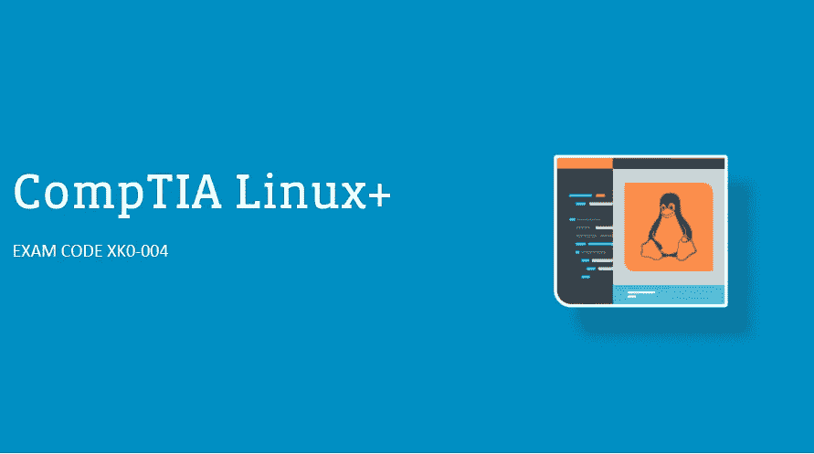
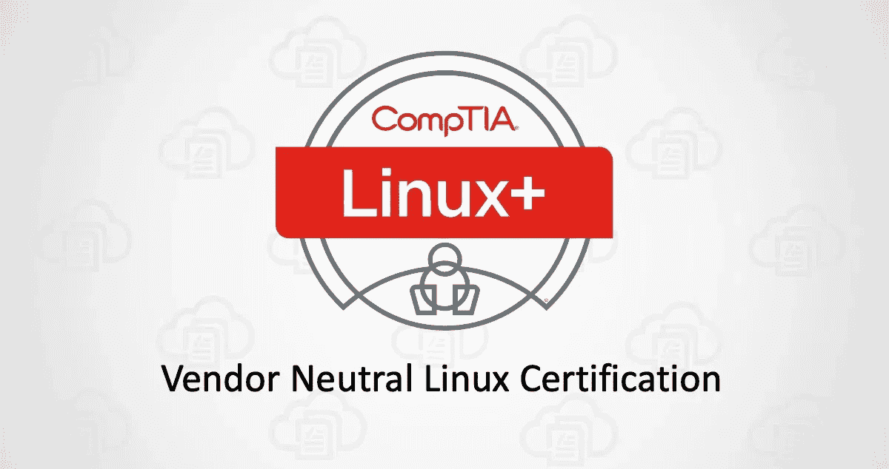
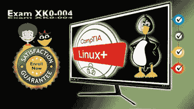
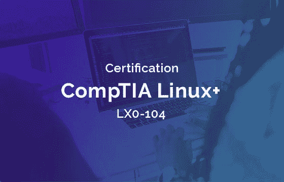
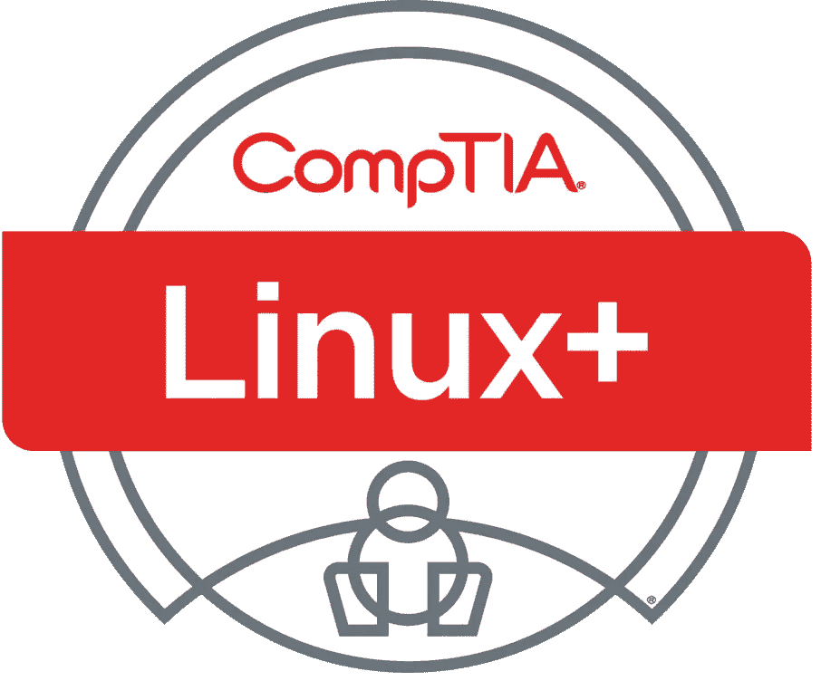

# 2023 年 6 门最佳 CompTIA Linux+(Plus)认证考试(XK0–004)课程和模拟测试

> 原文：<https://medium.com/javarevisited/6-best-comptia-linux-plus-certification-exam-xk0-004-courses-and-practice-tests-in-2021-a244c98eda4d?source=collection_archive---------1----------------------->

## 为 2023 年 CompTIA Linux+认证做准备的最佳资源集合包括来自 Udemy 和 Whizlabs 的最佳在线课程和实践测试

如果您正在准备 2023 年的 CompTIA Linux+认证，并且正在寻找最好的在线课程和练习测试，以便在第一次尝试时通过认证考试，那么您来对地方了。

以前我分享过像 [CompTIA A+](/javarevisited/6-best-comptia-a-220-1001-and-220-1002-online-training-courses-practice-tests-and-dumps-cfc25759b808) 、 [Cloud+](https://javarevisited.blogspot.com/2020/07/top-5-courses-to-crack-comptia-cloud-certification-exam.html) 、 [Security+](https://javarevisited.blogspot.com/2020/06/top-5-courses-to-crack-comptia-security-certification-exam-sy0-501.html) 等学习 Linux 和通过认证的[最佳课程，今天我要分享的是最佳的 CompTIA Linux+课程和实践测试。](/javarevisited/top-10-courses-to-learn-linux-command-line-in-2020-best-and-free-f3ee4a78d0c0?source=collection_home---4------0-----------------------)

这些是由专家创建的，受到成千上万开发者的信任，它们是从像 Udemy、Whizlabs 和其他著名的在线门户网站中挑选出来的。你可以使用它们来更好地准备这个认证，并在第一次尝试中进行破解。

CompTIA Linux+认证是为在 IT 行业工作并使用 Linux 操作系统的人准备的，例如服务器管理员，网络安全和 android 设备工作的人，以及几乎所有运行在 [Linux](/javarevisited/7-best-linux-courses-for-developers-cloud-engineers-and-devops-in-2021-7415314087e1) 上的人。

CompTIA Linux+涵盖了 Linux 主要发行版中的常见任务，包括 Linux 命令行、基本维护、安装和配置工作站以及联网。它还涵盖了 [Linux](https://javarevisited.blogspot.com/2018/02/5-courses-to-learn-shell-scripting-in-linux.html) 的许多高级方面，如安全问题和内核深度，以及虚拟化存储网络防火墙和许多其他主题。

CompTIA Linux+ certification 持有者的工资取决于他从事的工作类型，例如 Linux 工程师 Linux 系统管理员，大多数时候年薪可达 12 万美元或更多。

如果你打算成为一名 **Linux 系统管理员**或 **Linux 工程师**或任何需要 Linux 专业人员的工作，那么请继续阅读这篇文章，因为我会推荐一些课程来帮助你获得 CompTIA Linux+认证。

在新的 CompTIA Linux+中，与之前的两次考试不同，考生只需通过一次考试即可获得认证。

# 6 门最佳在线课程和练习测试，帮助您在 2023 年通过 CompTIA Linux+认证考试

这里有一个最好的在线课程列表，你可以参加来准备 CompTIA Linux+认证，这是展示你的 Linux 技能的最负盛名的认证之一。

专家讲师和教师已经创建了这些课程来为你准备真正的 Linux+考试，它们是从像 [Udemy](https://click.linksynergy.com/fs-bin/click?id=JVFxdTr9V80&offerid=323058.9410&type=3&subid=0) 和 [Whizlabs](https://shareasale.com/r.cfm?b=1551042&u=880419&m=43514&urllink=&afftrack=) 这样的网站上选择的。成千上万的开发人员和 Linux+认证的渴望者已经加入了这些课程，你也可以这样做来开始你的 Linux 认证准备。

## 1.[CompTIA Linux+(LX0–103 和 LX0–104)(第 1 部分，共 2 部分)](https://click.linksynergy.com/deeplink?id=JVFxdTr9V80&mid=39197&murl=https%3A%2F%2Fwww.udemy.com%2Fcourse%2Fcomptia-linux-2009-part-1-of-part-2%2F)

Udemy 上的这个课程可能是最大的课程，它用 17 个小时的时间向您教授 CompTIA Linux+,视频内容分为两个部分，包含一些基本的 Linux 技能要求和一些 bash 脚本编程知识。

在本课程中，您将学到以下内容:

*   使用 Linux 系统安装配置。
*   文件系统和共享。
*   网络和安全问题。

涵盖了如何安装 Linux 及其应用程序如何使用界面不同的 Linux 环境如 GNOM 和 KDE 如何使用命令行系统配置网络和几乎每一个方面的 Linux 操作系统。

**这是加入本课程的链接**—[CompTIA Linux+(LX0–103 和 LX0–104)](https://click.linksynergy.com/deeplink?id=JVFxdTr9V80&mid=39197&murl=https%3A%2F%2Fwww.udemy.com%2Fcourse%2Fcomptia-linux-2009-part-1-of-part-2%2F)

## 2.[CompTIA Linux+(LX0–103 和 LX0–104)(第 2 部分，共 2 部分)](https://click.linksynergy.com/deeplink?id=JVFxdTr9V80&mid=39197&murl=https%3A%2F%2Fwww.udemy.com%2Fcourse%2Fcomptia-linux-2009-part-2-of-part2%2F)

完成第一堂课建议的第二部分，有几个小时和一半的视频内容，虽然很小，但它将完成你在上一堂课开始的内容。

以下是您将在本课程中学到的内容:

*   Linux 系统的故障排除和维护。
*   使用不同的协议，如 FTP 和 SSH。
*   用 C 语言[进行一些编程](/javarevisited/10-best-c-programming-courses-for-beginners-2c2c1f6bcb12)。

您将了解如何使用 FTP，例如安装和配置 FTP，以及 FTP 协议的安全性、传输文件、邮件服务、SSH 和许多其他主题。

最后，对您的 Linux 机器进行故障排除和维护，例如密码恢复、网络故障排除、文件验证、C 脚本等等。

**以下是参加本课程的链接**—[CompTIA Linux+(LX0–103 和 LX0–104)](https://click.linksynergy.com/deeplink?id=JVFxdTr9V80&mid=39197&murl=https%3A%2F%2Fwww.udemy.com%2Fcourse%2Fcomptia-linux-2009-part-2-of-part2%2F)

## 3. [CompTIA Linux+认证考试 XK0–004:模拟测试](https://click.linksynergy.com/deeplink?id=JVFxdTr9V80&mid=39197&murl=https%3A%2F%2Fwww.udemy.com%2Fcourse%2Fcomptia-linux-certification-exam-xk0-004-practice-tests%2F)

比方说，你已经学习了许多关于 CompTIA Linux+认证的课程，你想在参加正式考试之前测试一下你的知识，如果你失败了，浪费你的金钱和时间，通过参加这个课程，你可以避免这些麻烦。

以下是您将在本考试课程中学到的内容:

*   很多题和正式考试差不多。
*   在 [CompTIA Linux+认证](https://javarevisited.blogspot.com/2020/07/top-5-courses-to-crack-comptia-linux-plus-certification-LX.html)中测试你的技能。
*   通过增加知识获得真实世界的体验。

本考试课程涵盖 CompTIA Linux+的基本部分，并有 251 个相关问题，如硬件和系统配置安全、Linux 系统故障排除脚本和更多主题。

以下是参加该测试的链接— [CompTIA Linux+认证实践测试](https://click.linksynergy.com/deeplink?id=JVFxdTr9V80&mid=39197&murl=https%3A%2F%2Fwww.udemy.com%2Fcourse%2Fcomptia-linux-certification-exam-xk0-004-practice-tests%2F)

## 4. [CompTIA Linux+认证(LPI LX0–104)](https://shareasale.com/m-pr.cfm?merchantid=43514&userid=880419&productid=793663325&afftrack=)

说到 it 准备，Whizlabs 是最有名的模拟考试地点之一，我很高兴在 Whizlabs 上找到了 CompTIA Linux+考试的模拟考试。这个模拟测试有大约 180 个问题，几乎涵盖了你需要测试的所有知识。

以下是您将在本考试课程中获得的内容:

*   大约 180 个问题。
*   考考你的知识。
*   在考试中获得真实世界的经验。

[Linux](/javarevisited/6-best-websites-to-learn-linux-4861ac21bfdf) 专家设计了这门课程来模拟真正的考试，所有的问题都不会重复，给你一些经验，让你在跳到真正的考试之前做好准备。

**以下是参加本模拟考试** — [CompTIA Linux+认证(LPI LX0–104)](https://shareasale.com/m-pr.cfm?merchantid=43514&userid=880419&productid=793663325&afftrack=)的链接

如果您正在准备 IT 认证，请考虑参加 [**Whizlabs 订阅**](https://shareasale.com/r.cfm?b=1551042&u=880419&m=43514&urllink=&afftrack=) ，它提供了对他们所有在线培训课程的完整访问权限，以及针对 AWS、Java、Cloud、Docker 和 Kubernetes 等不同认证的实践测试，每年仅需 99 美元(现在有 50%的折扣)。

我强烈推荐这个订阅计划，因为 Whizlabs 有最好的材料来准备 IT 认证。

## 5.[CompTIA Linux+LX0–101&LX0–102](https://click.linksynergy.com/deeplink?id=JVFxdTr9V80&mid=39197&murl=https%3A%2F%2Fwww.udemy.com%2Fcourse%2Fcomptia-linux-lx0-101-lx0-102%2F)

是为 CompTIA Linux+认证做准备的另一门很棒的 Udemy 课程。这是一个 17 小时的课程，将带你从初级到高级水平学习 [Linux 操作系统](/javarevisited/6-best-operating-system-courses-for-beginners-to-learn-7d727882d267)，并深入了解一些高级技术。

您将在本课程中学到以下内容:

*   安装和配置系统。
*   使用命令行。
*   编程和安全性。

从介绍 [Linux 操作系统](/javarevisited/7-best-linux-courses-for-developers-cloud-engineers-and-devops-in-2021-7415314087e1)开始，然后转到实际课程，如管理软件配置硬件，如创建分区文件系统和使用 Fdisk 工具，以及管理文件，如所有权和网络等。

以下是参加本课程的链接—[CompTIA Linux+LX0–101&LX0–102](https://click.linksynergy.com/deeplink?id=JVFxdTr9V80&mid=39197&murl=https%3A%2F%2Fwww.udemy.com%2Fcourse%2Fcomptia-linux-lx0-101-lx0-102%2F)

## 6.[CompTIA Linux+:CompTIA Linux 证书模拟考试](https://click.linksynergy.com/deeplink?id=JVFxdTr9V80&mid=39197&murl=https%3A%2F%2Fwww.udemy.com%2Fcourse%2Fcomptia-linux-practice-tests-for-comptia-linux-certificate%2F)

这是 Udemy 上 CompTIA Linux+认证的另一组很棒的模拟测试。本课程包含 240 个问题，分为 4 个不同的全程模拟测试。

这也是 CompTIA Linux+认证评分最高的 Udemy 课程之一，您可以通过这些模拟测试来提高您的速度和准确性，以便在第一次尝试时就通过这一久负盛名的 CompTIA 认证。

**以下是参加本练习测试** — [CompTIA Linux+:练习测试](https://click.linksynergy.com/deeplink?id=JVFxdTr9V80&mid=39197&murl=https%3A%2F%2Fwww.udemy.com%2Fcourse%2Fcomptia-linux-practice-tests-for-comptia-linux-certificate%2F)的链接

以上就是为 2023 年的 Crack CompTIA Linux+认证做准备的**最佳在线课程**。这些是真正最好的 Linux+课程和练习测试，你应该使用它们来更好地准备这个久负盛名的 Linux 考试，并在你的第一次尝试中通过它。

如果你更喜欢书籍，那么你也可以将这些在线课程与类似于[**CompTIA Linux+Powered by Linux Professional Institute 学习指南**](https://www.amazon.com/CompTIA-Linux-Powered-Professional-Institute/dp/1119021219?tag=javamysqlanta-20)Christine Bresnahan(作者)、Richard Blum(作者)的书籍结合起来，进行更好的准备。这是极力推荐的 CompTIA Linux+认证书籍

 [## CompTIA Linux+由 Linux Professional Institute 提供支持学习指南:考试 LX0-103 和考试 LX0-104…

### CompTIA Linux+由 Linux Professional Institute 提供支持学习指南:考试 LX0-103 和考试 LX0-104 (Comptia Linux +…

www.amazon.com](https://www.amazon.com/CompTIA-Linux-Powered-Professional-Institute/dp/1119021219?tag=javamysqlanta-20) 

许多人现在在他们的笔记本电脑或台式电脑上使用 Linux 作为他们的默认操作系统，运行数十亿部手机和平板电脑设备的 android 实际上是内置在 Linux 内核上的，如果你想学习这些技能，你应该检查一下 CompTIA Linux+认证。

其他 **IT 认证资源**你可能喜欢

*   [准备 CompTIA Security+考试的前 5 门课程](https://javarevisited.blogspot.com/2020/06/top-5-courses-to-crack-comptia-security-certification-exam-sy0-501.html)
*   [排名前五的 CompTIA A+认证课程](https://javarevisited.blogspot.com/2020/07/top-5-comptia-a-plus-certification-courses-and-practice-tests.html)
*   [通过 CompTIA Cloud+认证的前 5 门课程](https://javarevisited.blogspot.com/2020/07/top-5-courses-to-crack-comptia-cloud-certification-exam.html)
*   [通过 CompTIA 网络+认证的前 5 门课程](https://javarevisited.blogspot.com/2020/07/top-5-courses-to-pass-comptia-network-plus-certification-exam.html)
*   [破解 AWS 解决方案架构师专业考试前 5 门课程](https://javarevisited.blogspot.com/2020/04/top-5-course-to-crack-aws-solution-architect-professional-sap-c01-certification-exam.html)
*   [如何成为 Azure 认证管理员助理？](https://javarevisited.blogspot.com/2020/04/how-to-crack-microsoft-az-103-azure-administrator-associate-exam-certification.html)
*   [如何破解 Azure Fundamentals (AZ-900)认证](https://javarevisited.blogspot.com/2020/04/how-to-crack-microsoft-azure-fundamentals-certification-az-900-exam.html)
*   [通过 Salesforce 管理员认证的前 5 门课程](https://javarevisited.blogspot.com/2020/06/top-5-courses-to-crack-salesforce-administrator-certification.html)
*   [程序员前 5 名 AZ-900 模拟测试](https://javarevisited.blogspot.com/2020/02/top-5-AZ-900-exam-Azure-Fundamentals-certification-practice-tests-and-mock-exams-to.html)
*   [破解 Salesforce App Builder 认证的 5 门课程](https://javarevisited.blogspot.com/2020/06/top-5-courses-to-crack-salesforce-platform-app-builder-certification-exam.html)
*   [学习 Docker 和 Kubernetes 的 10 大课程](https://dev.to/javinpaul/top-10-courses-to-learn-docker-and-kubernetes-for-programmers-4lg0)
*   [破解 AWS DevOps 工程师考试的前 5 门课程](https://javarevisited.blogspot.com/2020/04/top-5-course-to-crack-aws-certified-devops-engineer-professional-exam-certification.html)
*   [破解 Azure 云架构师(AZ-300)考试的前 5 门课程](https://javarevisited.blogspot.com/2019/07/top-5-courses-to-crack-azure-architecture-technologies-certification-az-300-exam.html#axzz6E6VuRMsx)
*   [如何通过 AZ-300 Azure 解决方案架构师考试？](https://javarevisited.blogspot.com/2020/04/how-to-crack-microsoft-azure-solution-architect-exam-az-300.html)
*   [5 次免费的 AWS 解决方案架构师实践测试](https://javarevisited.blogspot.com/2019/08/top-5-free-aws-solution-architect-Associate-certification-dumps-practice-questions.html)
*   [通过谷歌助理云工程师认证的前 5 门课程](https://javarevisited.blogspot.com/2019/07/top-5-google-cloud-platform-gcp-courses-certifications-online.html)
*   [准备 AWS 系统管理员认证的前 5 门课程](https://javarevisited.blogspot.com/2020/06/top-5-aws-certified-sysops-admin-associate-certification-exam.html)

感谢您阅读本文。如果您发现这些在线课程和练习测试对您的 *CompTIA Linux 认证考试*有所帮助，请与您的朋友和同事分享。

**【p . s .】**—如果您是 Linux 新手，并且正在寻找免费的在线培训课程来学习 Linux，那么我也推荐您在 Udemy 上查看这个 [**Red Hat Enterprise Linux 技术概述(免费)**](https://click.linksynergy.com/deeplink?id=JVFxdTr9V80&mid=39197&murl=https%3A%2F%2Fwww.udemy.com%2Fcourse%2Fred-hat-enterprise-linux-technical-overview%2F) 。它是由 Red Hat Inc .创建的，完全免费，超过 5 万名学生已经加入了这个课程。

 [## 免费红帽企业 Linux (RHEL)教程-红帽企业 Linux 技术概述

### 红帽培训和认证缩小了你所需要的和你所知道的之间的差距。您是否需要优化…

udemy.com](https://click.linksynergy.com/deeplink?id=JVFxdTr9V80&mid=39197&murl=https%3A%2F%2Fwww.udemy.com%2Fcourse%2Fred-hat-enterprise-linux-technical-overview%2F)