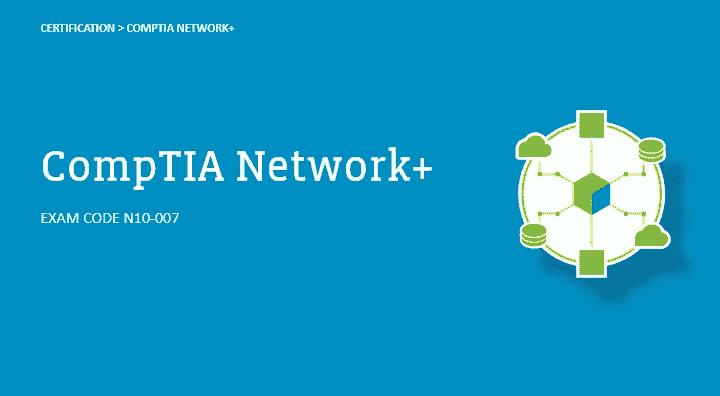
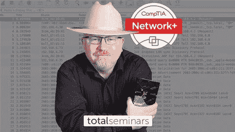
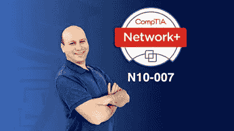
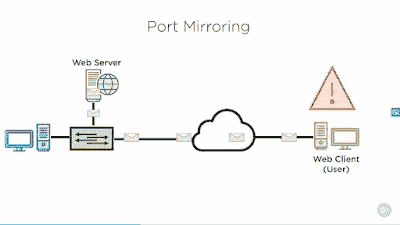
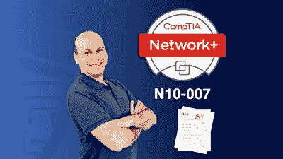
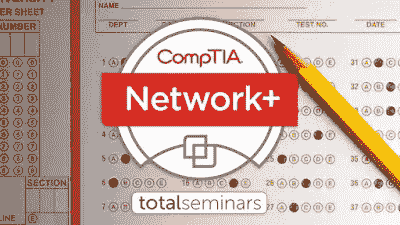
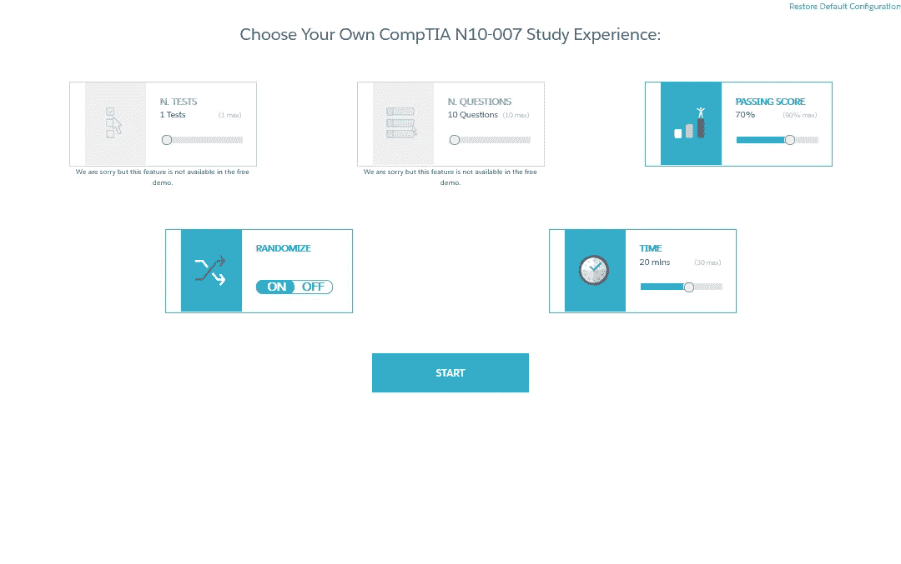

# 6 最佳 CompTIA 网络+2023 年认证课程和实践测试

> 原文：<https://medium.com/javarevisited/6-best-comptia-network-certification-resources-course-practice-tests-2d848f020543?source=collection_archive---------0----------------------->

## 我最喜欢的 2023 年备考 CompTIA Network+认证的资源。这包括来自 Udemy、Pluralsight 和其他地方的在线课程和模拟测试。

大家好，**CompTIA Network+certification**是一个很好的认证，如果你打算从事任何需要网络的工作，比如计算机网络分析师、计算机支持等等。

该认证是针对任何初学者或高级网络知识水平，这也是很好的，如果你正在考虑在网络行业的职业生涯。

如果您已经在准备 CompTIA Network+认证，并且正在寻找**最佳在线培训课程**和**模拟测试**为考试做准备，那么您来对地方了。

过去，我曾分享过通过 CompTIA 认证的最佳在线课程，如 [**CompTIA A+**](/javarevisited/6-best-comptia-a-220-1001-and-220-1002-online-training-courses-practice-tests-and-dumps-cfc25759b808) ，[**CompTIA Linux+**](/javarevisited/6-best-comptia-linux-plus-certification-exam-xk0-004-courses-and-practice-tests-in-2021-a244c98eda4d)，[**CompTIA Pentest+**](/javarevisited/7-best-comptia-pentest-certification-courses-and-practice-tests-46d827689cdc)， [Cloud+](https://javarevisited.blogspot.com/2020/07/top-5-courses-to-crack-comptia-cloud-certification-exam.html) 和 [Security+](https://javarevisited.blogspot.com/2020/06/top-5-courses-to-crack-comptia-security-certification-exam-sy0-501.html) ，在本文中，我将分享最佳课程、练习测试和考试模拟器，为这一著名的考试做准备。在这篇文章中，我将分享最好的在线课程和模拟问题，为 CompTIA Network+认证做准备。

这些在线课程由专家创建，受到成千上万通过 CompTIA Network+认证的开发人员的信任。它们由知名的在线平台主办，如**和 [**Pluralsight**](https://pluralsight.pxf.io/c/1193463/424552/7490?u=https%3A%2F%2Fwww.pluralsight.com%2Flearn) 等，而且价格也非常实惠。**

**CompTIA Network Plus 几乎涵盖了网络中的所有内容，如交换机、接入点、IP 地址、局域网、配置和管理网络路由器、协议、网络安全等等。这些需要网络证书的工作的薪水取决于职位，比如网络管理员的平均年薪约为 6 万美元，或者网络工程师的年薪约为 7.3 万美元。** 

# **2023 年 CompTIA Network+认证的 6 门最佳在线课程和实践测试**

**为了不浪费你更多的时间，这里列出了为 CompTIA Network +认证做好准备的最佳在线课程和实践测试。至少，你应该参加一门课程，做一次模拟测试，但是如果你想得高分，参加几门课程，从不同的角度深入学习。你还应该解决尽可能多的模拟测试。**

## **1.[总计:CompTIA 网络+认证(N10–007)](https://click.linksynergy.com/deeplink?id=JVFxdTr9V80&mid=39197&murl=https%3A%2F%2Fwww.udemy.com%2Fcourse%2Fcomptia-network-cert-n10-007-the-total-course%2F)**

**udemy 上的这个 23 小时的课程是最大的课程，它将教你 CompTIA Network+的基础知识和你需要知道的一切，但它的目标是为有一些 it 背景和一些网络基础知识的人。

在本课程中，您将学到:**

*   **虚拟化和云计算。**
*   **安装物理网络。**
*   **建立一个真实的网络。**

**您将学习网络模型电缆和拓扑的基础知识，如双绞线和光纤布线以太网基础知识，如以太网帧现代以太网保护 TCP IPv6 无线网络电影网络管理风险等。**

****以下是参加本课程的链接** — [总计:CompTIA 网络+认证(N10–007)](https://click.linksynergy.com/deeplink?id=JVFxdTr9V80&mid=39197&murl=https%3A%2F%2Fwww.udemy.com%2Fcourse%2Fcomptia-network-cert-n10-007-the-total-course%2F)**

****

## **2.[CompTIA Network+(N10–007)全程&实践考试](https://click.linksynergy.com/deeplink?id=JVFxdTr9V80&mid=39197&murl=https%3A%2F%2Fwww.udemy.com%2Fcourse%2Fnetworkplus%2F)**

**假设你想学习 CompTIA Network+,同时在参加正式的 CompTIA 考试之前测试你的知识，那么你可以参加这个 14 小时的课程来达到这个目的。

本课程从网络及其基本组件开始，如有线和无线网络拓扑以及物联网 OSI 模型 TCP/IP，如通过网络虚拟化传输数据、网络安全故障排除以及更多概念和实践课程。

你将在本课程中学习到:**

*   **网络管理。**
*   **网络工具。**
*   **网络安全。**

**最后，以 75 道题的考试结束课程，测试你之前所学的全部知识。**

**这是加入本课程的链接。 [CompTIA 网络+(N10–007)全程](https://click.linksynergy.com/deeplink?id=JVFxdTr9V80&mid=39197&murl=https%3A%2F%2Fwww.udemy.com%2Fcourse%2Fnetworkplus%2F)**

****

## **3.[网络概念和协议](https://pluralsight.pxf.io/c/1193463/424552/7490?u=https%3A%2F%2Fwww.pluralsight.com%2Fcourses%2Fcomptia-network-plus-networking-concepts)**

**完成关于如何通过 CompTIA Network+的视频课程，本课程将教授您必须了解的网络和协议部分的基础知识，以便您可以通过正式考试。

从数据网络的基础知识开始，例如 IP 地址端口和协议 OSI 模型 TCP/UDP 二进制和十六进制 IPv6 IP 和 Mac 地址的关系路由器和交换机之间的区别等等。

在本课程中，您将学到:**

*   **最基本的协议。**
*   **网络服务。**
*   **以太网和交换。**

****这是参加本课程的链接** — [网络概念和协议](https://pluralsight.pxf.io/c/1193463/424552/7490?u=https%3A%2F%2Fwww.pluralsight.com%2Fcourses%2Fcomptia-network-plus-networking-concepts)**

****

**顺便说一句，你需要一个 Pluralsight 会员才能参加这个课程，费用大约是每月 29 美元或每年 299 美元(14%的折扣)。我向任何想投资学习和保持自己与时俱进的人强烈推荐这本书。或者，你也可以利用他们的 [**10 天免费试用**](https://pluralsight.pxf.io/c/1193463/424552/7490?u=https%3A%2F%2Fwww.pluralsight.com%2Flearn) 免费观看这门课程。**

** [## 对个人来说

### Pluralsight 的使命一直是公平的技术竞争环境。不管你想学什么，或者…

pluralsight.pxf.io](https://pluralsight.pxf.io/c/1193463/424552/7490?u=https%3A%2F%2Fwww.pluralsight.com%2Flearn)** 

## **4.[CompTIA Network+(N10–007)6 模拟考试和模拟](https://click.linksynergy.com/deeplink?id=JVFxdTr9V80&mid=39197&murl=https%3A%2F%2Fwww.udemy.com%2Fcourse%2Fnetwork_plus_exam%2F)**

**让我们假设您已经观看了许多教您如何通过 CompTIA Network+认证考试的课程，并且您现在想要在开始真正的考试之前测试您的技能，如果这是您的情况，您可以参加 udemy 上的考试课程。

考试课程将用 450 道题来测试您的知识，涵盖五个主题，即网络概念、基础设施、网络运行、网络安全以及网络工具和故障排除，并有多项选择题。

您将在本次考试中学习课程:**

*   **从专家那里获得问题测试。**
*   **测试你在 CompTIA 网络+认证方面的知识。**
*   **准备正式考试。**

**这是参加本课程的链接。 [CompTIA 网络+(N10–007)模拟考试](https://click.linksynergy.com/deeplink?id=JVFxdTr9V80&mid=39197&murl=https%3A%2F%2Fwww.udemy.com%2Fcourse%2Fnetwork_plus_exam%2F)**

****

## **5.[总计:CompTIA 网络+证书。(N10–007)模拟测试。](https://click.linksynergy.com/deeplink?id=JVFxdTr9V80&mid=39197&murl=https%3A%2F%2Fwww.udemy.com%2Fcourse%2Fnew-comptia-network-cert-n10-007-practice-tests%2F)**

**完成考试课程，这将提高您的技能，并测试您在 CompTIA Network+认证方面的知识。

您将在本考试课程中学习:**

*   **超过 270 个问题。**
*   **模拟正式考试的问题。**
*   **用模拟考试测试你的知识。**

**本课程将涵盖您将在 CompTIA Network+正式考试中遇到的基本主题，如网络概念、基础设施、操作、安全工具和故障排除，这些问题是为了模拟真实考试而编写的。**

****以下是加入本次考试的链接** — [合计:CompTIA Network+ Cert。(N10–007)模拟测试。](https://click.linksynergy.com/deeplink?id=JVFxdTr9V80&mid=39197&murl=https%3A%2F%2Fwww.udemy.com%2Fcourse%2Fnew-comptia-network-cert-n10-007-practice-tests%2F)**

****

## **6.[大卫·梅尔的 CompTIA N10–007 转储](https://www.certification-questions.com/practice-exam/comptia/n10-007?affiliateCode=fcff36fd-557a-4713-abf6-973e9924770f&utm_source=Javin&utm_medium=affiliate&utm_campaign=affiliate)**

**这是准备 CompTIA N10–007 认证的另一个有用资源。这些是以前参加过这次考试的考生贡献的以往考试的真题。**

**以下是您将在本次测试中获得的内容:**

**-问题数量:748**

**-考试测试:15**

**-最后更新时间:2023 年 5 月 3 日**

**这些问题对于找到你在真实考试中会遇到的题型以及难度非常有用。你可以用这些测试来评估你的准备程度。你可以找到自己的强项和弱项，并加以改进。**

****这里是这个考试转储的下载**——[大卫·梅尔的 CompTIA N10–007 转储](https://www.certification-questions.com/practice-exam/comptia/n10-007?affiliateCode=fcff36fd-557a-4713-abf6-973e9924770f&utm_source=Javin&utm_medium=affiliate&utm_campaign=affiliate)**

****

**还可以优化学习体验。他们还提供 [10 个免费的 CompTIA 网络+ dumps](https://www.certification-questions.com/comptia-dumps/n10-007.html?affiliateCode=fcff36fd-557a-4713-abf6-973e9924770f&utm_source=Javin&utm_medium=affiliate&utm_campaign=affiliate) ，你可以查看问题的质量。**

**以上是关于 CompTIA Network+认证的**最佳在线课程。**您可以参加这些课程，以便更好地准备这一热门认证。我还包括了练习测试，以提高通过考试所需的速度和准确性。**

**网络让我们的现代世界系统保持活力，让我们连接到在社交媒体上分享帖子、在 YouTube 上上传视频的网站，运营我们的业务和我们生活的几乎每个方面，管理这些网络需要一些专业人士来做，因此出现了*CompTIA Network+certification*。**

**祝你的网络+认证考试一切顺利，如果这些课程帮助你通过考试，那么不要忘记与你的朋友和同事分享。

其他 **IT 认证文章**您可能喜欢:**

*   **[学习 Docker 和 Kubernetes 的十大课程](https://dev.to/javinpaul/top-10-courses-to-learn-docker-and-kubernetes-for-programmers-4lg0)**
*   **[如何破解甲骨文 2023 年 Java 认证？](https://medium.freecodecamp.org/how-to-pass-oracles-java-certifications-a-practical-guide-for-developers-e9b607ba6173)**
*   **[通过 Salesforce 管理员认证的前 5 门课程](https://javarevisited.blogspot.com/2020/06/top-5-courses-to-crack-salesforce-administrator-certification.html)**
*   **[准备 AWS 系统管理员认证的前 5 门课程](https://javarevisited.blogspot.com/2020/06/top-5-aws-certified-sysops-admin-associate-certification-exam.html)**
*   **[破解 Salesforce App Builder 认证的 5 门课程](https://javarevisited.blogspot.com/2020/06/top-5-courses-to-crack-salesforce-platform-app-builder-certification-exam.html)**
*   **[学习 Docker 和 Kubernetes 的十大课程](https://dev.to/javinpaul/top-10-courses-to-learn-docker-and-kubernetes-for-programmers-4lg0)**
*   **[破解 Azure 云架构师(AZ-300)考试的前 5 门课程](https://javarevisited.blogspot.com/2019/07/top-5-courses-to-crack-azure-architecture-technologies-certification-az-300-exam.html#axzz6E6VuRMsx)**
*   **[通过谷歌助理云工程师认证的前 5 门课程](https://javarevisited.blogspot.com/2019/07/top-5-google-cloud-platform-gcp-courses-certifications-online.html)**
*   **[破解 AWS DevOps 工程师考试的前 5 门课程](https://javarevisited.blogspot.com/2020/04/top-5-course-to-crack-aws-certified-devops-engineer-professional-exam-certification.html)**
*   **[通过谷歌助理云工程师认证的前 5 门课程](https://javarevisited.blogspot.com/2019/07/top-5-google-cloud-platform-gcp-courses-certifications-online.html)**
*   **[通过 AWS 云从业者认证的前 5 门课程](https://javarevisited.blogspot.com/2020/02/top-5-courses-to-crack-aws-certified-cloud-practitioner-exam-certification-clf-c01.html)**

**感谢您阅读本文。如果您喜欢这些 *best CompTIA networks +认证在线培训课程*，无论是免费的还是付费的，请与您的朋友和同事分享。这确实有所不同，然后你提前分享。我真的很感激。

**附言——**如果你是网络世界的新手，正在寻找免费的在线课程来学习网络基础知识，那么我也推荐你去看看 Udemy 上的 [**完全初学者网络入门**](https://click.linksynergy.com/deeplink?id=JVFxdTr9V80&mid=39197&murl=https%3A%2F%2Fwww.udemy.com%2Fcourse%2Fintroduction-to-networking-for-complete-beginners%2F) 免费课程。这是一个完全免费的好课程，为 CompTIA Network+认证建立网络基础。**

** [## 总计:CompTIA 网络+证书。(N10-007)模拟测试。

### 道达尔研讨会提供认证培训服务和培训材料给数以千计的学校，企业…

udemy.com](https://click.linksynergy.com/deeplink?id=JVFxdTr9V80&mid=39197&murl=https%3A%2F%2Fwww.udemy.com%2Fcourse%2Fnew-comptia-network-cert-n10-007-practice-tests%2F)**