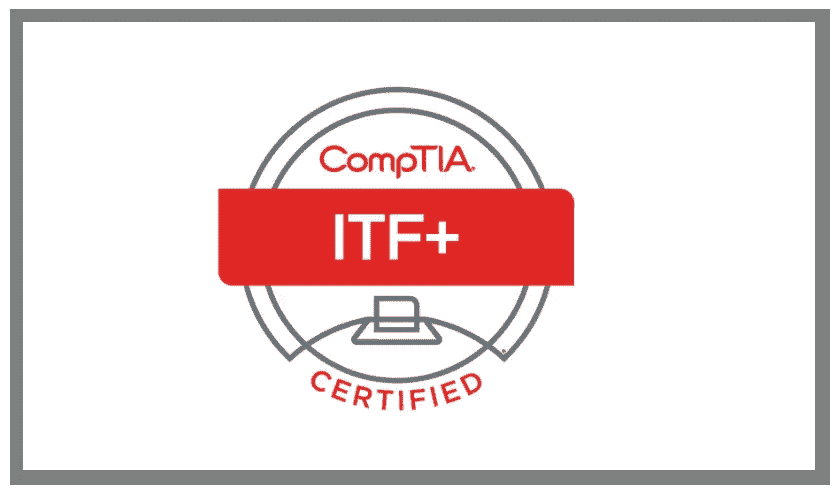
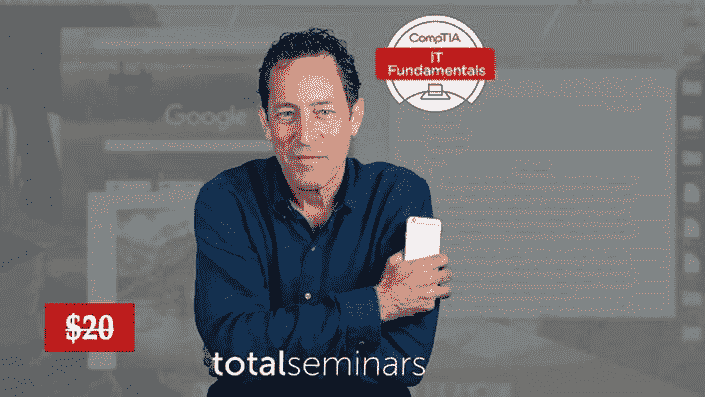
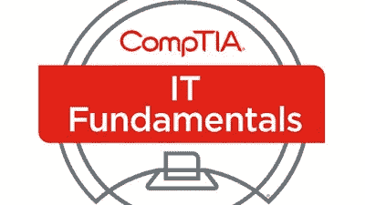
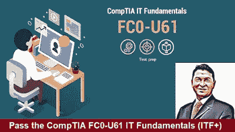
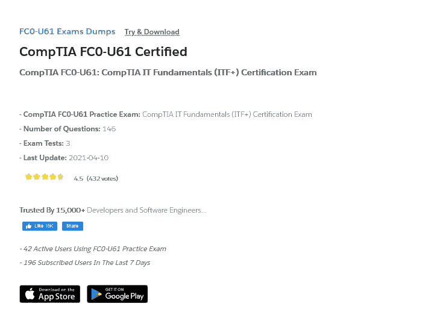
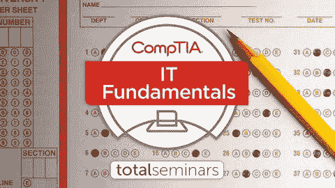

# 2023 年通过 CompTIA IT 基础(FC0-U61: ITF+)认证考试的 6 门最佳课程和实践测试

> 原文：<https://medium.com/javarevisited/6-best-courses-and-practice-tests-to-crack-comptia-fc0-u61-comptia-it-fundamentals-itf-67f81162be37?source=collection_archive---------1----------------------->

## 我最喜欢的在线课程和练习测试，为 2023 年的 CompTIA IT Fundamentals(FC0-U61:ITF+)认证考试做准备

大家好，如果你正在准备 2023 年的 CompTIA FC0-U61:CompTIA IT Fundamentals(ITF+)认证考试，并在寻找最好的在线资源，如在线课程，以准备考试，那么你来对地方了。

过去，我曾分享过通过 CompTIA 认证的最佳在线课程，如[**【CompTIA A+】**](/javarevisited/6-best-comptia-a-220-1001-and-220-1002-online-training-courses-practice-tests-and-dumps-cfc25759b808)[**【CompTIA Linux+**](/javarevisited/6-best-comptia-linux-plus-certification-exam-xk0-004-courses-and-practice-tests-in-2021-a244c98eda4d)[**CompTIA Pentest+**](/javarevisited/7-best-comptia-pentest-certification-courses-and-practice-tests-46d827689cdc)[Cloud+](https://javarevisited.blogspot.com/2020/07/top-5-courses-to-crack-comptia-cloud-certification-exam.html)和 [Security+](https://javarevisited.blogspot.com/2020/06/top-5-courses-to-crack-comptia-security-certification-exam-sy0-501.html) 考试，在本文中，我将分享通过 CompTIA IT 基础认证的最佳课程和实践测试。

对于想开始职业生涯的人来说，这是最好的认证之一。你不仅能学到关键的 IT 技能和计算机科学概念，还能获得证书来展示你的技能。

在过去的几个月里，我一直在写关于 CompTIA 认证的文章，今天我将谈谈最受欢迎的 CompTIA 认证之一，CompTIA IT 基础认证考试。

CompTIA IT Fundamentals 是由 CompTIA 公司提供的一项认证，针对的是那些完全是新人并考虑开始或转行到信息技术(IT)行业的人，它会教你许多 IT 概念或领域的基础知识，如[安全](https://javarevisited.blogspot.com/2020/03/top-5-courses-to-learn-cyber-security.html)、[软件开发、](https://javarevisited.blogspot.com/2019/03/5-courses-programmers-can-join-to-learn.html#axzz6U9Y03ecl)、[数据库基础](https://javarevisited.blogspot.com/2018/05/top-5-sql-and-database-courses-to-learn-online.html)等等。

CompTIA IT Fundamentals 正式考试涵盖了您在编程安全等非常基础的计算方面的技能和知识，共有 75 道选择题，无需任何预先知识即可通过考试，每次考试的费用约为 123 美元。

对于任何想改变他的职业的人来说，如果你想获得认证，你可以继续阅读这篇文章以获得更多信息和在线课程，这些肯定会帮助你学习这些技能并通过官方考试。

# 2023 年面向初学者的 6 门最佳 CompTIA IT 基础课程和实践测试

为了不浪费你更多的时间，这里有一个最好的在线课程和实践测试的列表，你可以参加这些课程和实践测试来准备流行的 *CompTIA 基础认证考试*。

对于初级开发人员、希望开始 IT 职业生涯的非技术人员以及计算机工程师来说，这是一个非常好的认证考试，因为它可以帮助您建立技术技能，这对您的编程和技术职业生涯有很大帮助。

## 1.[总计:CompTIA IT Fundamentals ITF+(FCO-U61)](https://click.linksynergy.com/deeplink?id=JVFxdTr9V80&mid=39197&murl=https%3A%2F%2Fwww.udemy.com%2Fcourse%2Fit-fundamentals-fc0-u61-the-total-course%2F)

正在考虑从事 IT 行业或希望通过正式 CompTIA IT 基础考试的人可以报名参加本课程，并从讲师与您分享的 IT 许多不同方面的知识中受益。

将向您介绍系统硬件，如 CPU、RAM、主板端口/连接器等，然后介绍存储技术的工作原理以及二进制和操作系统的基础知识配置计算机和移动设备管理文件配置网络以及故障排除等。

你将在本课程中学习到:

*   电脑硬件和手机。
*   配置很多东西。
*   IT 故障排除。

以下是参加本课程的链接— [总计:CompTIA IT 基础 ITF+](https://click.linksynergy.com/deeplink?id=JVFxdTr9V80&mid=39197&murl=https%3A%2F%2Fwww.udemy.com%2Fcourse%2Fit-fundamentals-fc0-u61-the-total-course%2F)

## 2.[信息技术初学者绝对指南](https://click.linksynergy.com/deeplink?id=JVFxdTr9V80&mid=39197&murl=https%3A%2F%2Fwww.udemy.com%2Fcourse%2Fthe-absolute-beginners-guide-to-information-technology-2020%2F)

虽然本课程并不专门讲述 CompTIA IT 基础知识，但它会向您传授许多 IT 基础知识，例如计算的网络基础知识，您也可以在开始真正的考试之前参加本课程，以增强您的技能和知识。你将从学习计算机硬件开始，比如存储器、内存、基本输入输出系统等等。然后转向网络，如端口协议 VPN 带宽 MAC 地址等等。
在本课程中，您将学到:

*   计算机硬件。
*   网络概念。
*   一些安全概念。

你还将获得一些编程语言的经验，如 [PHP](/javarevisited/top-10-free-courses-to-learn-php-and-mysql-for-web-development-e96e69982675) 、 [HTML](https://www.java67.com/2020/08/5-best-online-courses-to-learn-html-5.html) 、 [CSS](/javarevisited/top-10-free-courses-to-learn-html-5-css-3-and-web-development-872d62d97a97) 、 [JavaScript](/javarevisited/10-best-online-courses-to-learn-javascript-in-2020-af5ed0801645) 它们是什么以及在哪里使用它们。最后，一些关于安全的概念，如恶意软件和网络钓鱼。

**这里是加入本课程的链接**——[信息技术绝对初学者指南](https://click.linksynergy.com/deeplink?id=JVFxdTr9V80&mid=39197&murl=https%3A%2F%2Fwww.udemy.com%2Fcourse%2Fthe-absolute-beginners-guide-to-information-technology-2020%2F)

## 3. [CompTIA IT 基础知识(考试 FC0-U61)](https://click.linksynergy.com/deeplink?id=JVFxdTr9V80&mid=39197&murl=https%3A%2F%2Fwww.udemy.com%2Fcourse%2Fcomptia-it-fundamentals-exam-fc0-u61-practice-tests%2F)【236 道题】

现在让我们转到一些考试课程，这些课程将通过一些问题来测试您在 IT 行业的技能和知识，这些问题涵盖了安全性、软件开发和数据库以及许多其他主题。

在本课程中，您将学到:

*   测试你的技能和知识。
*   这些问题涉及许多话题。
*   准备正式考试。

以下是参加该测试的链接— [CompTIA IT 基础知识(考试 FC0-U61)](https://click.linksynergy.com/deeplink?id=JVFxdTr9V80&mid=39197&murl=https%3A%2F%2Fwww.udemy.com%2Fcourse%2Fcomptia-it-fundamentals-exam-fc0-u61-practice-tests%2F)

## 4.[准备通过 CompTIA FC0-U61 IT 基础(ITF+)](https://click.linksynergy.com/deeplink?id=JVFxdTr9V80&mid=39197&murl=https%3A%2F%2Fwww.udemy.com%2Fcourse%2Fprepare-to-pass-the-comptia-fc0-u61-it-fundamentals-itf%2F)

另一个测试你在 IT 行业知识的很好的考试课程，不需要任何先决条件，因为 CompTIA IT Fundamentals 正在教你一些 IT 的一般概念。

在本课程中，您将学到:

*   获取关于它的问题。
*   IT 考试的准备。
*   测试你的技能。
*   通过 IT 基础(ITF+)测试的 3 个最佳真实模拟考试。基本 IT 知识和技能介绍。

本课程还涵盖了 IT 基础知识，如您将在正式 CompTIA IT 基础知识考试中获得的知识，如[安全性](/javarevisited/top-10-courses-to-learn-spring-security-and-oauth2-with-spring-boot-for-java-developers-8f0222d6066d?source=---------5-----------------------)、[软件开发](/javarevisited/6-coding-books-every-programmers-and-software-developers-should-read-620124886c8f)和基础设施，共有 285 道问题来测试您的知识并提高您的技能。

以下是参加本课程的链接— [准备通过 CompTIA FC0-U61 IT 基础知识(ITF+)](https://click.linksynergy.com/deeplink?id=JVFxdTr9V80&mid=39197&murl=https%3A%2F%2Fwww.udemy.com%2Fcourse%2Fprepare-to-pass-the-comptia-fc0-u61-it-fundamentals-itf%2F)

## 5. [CompTIA FC0-U61: CompTIA IT 基础(ITF+)认证考试](https://www.certification-questions.com/practice-exam/comptia/fc0-u61?affiliateCode=fcff36fd-557a-4713-abf6-973e9924770f&utm_source=Javin&utm_medium=affiliate&utm_campaign=affiliate)

这是准备 CompTIA FC0-U61: CompTIA IT 基础(ITF+)认证考试的另一个极好的资源。这包含由社区贡献的考试转储，是以前考试的真题。

以下是您将在本课程中获得的内容:

-问题数量:146

-考试测试:3

-最后更新时间:2023 年 4 月 10 日

超过 15，000 名程序员和软件工程师已经信任了他们准备的认证问题，这是一个伟大的社会证明，它是一个伟大的资源。

**这里是参加本次模拟考试** — [CompTIA IT 基础(ITF+)认证考试](https://www.certification-questions.com/practice-exam/comptia/fc0-u61?affiliateCode=fcff36fd-557a-4713-abf6-973e9924770f&utm_source=Javin&utm_medium=affiliate&utm_campaign=affiliate)的链接

如果你对考试质量感兴趣的话，他们还有一个免费的[测试](https://www.certification-questions.com/comptia-dumps/fc0-u61.html?affiliateCode=fcff36fd-557a-4713-abf6-973e9924770f&utm_source=Javin&utm_medium=affiliate&utm_campaign=affiliate)，里面有 10 个问题供你尝试。我强烈建议你检查这些问题。

## 6. [CompTIA IT 基础 ITF+(FCO-U61)](https://click.linksynergy.com/deeplink?id=JVFxdTr9V80&mid=39197&murl=https%3A%2F%2Fwww.udemy.com%2Fcourse%2Fcomptia-it-fundamentals-fc0-u61-practice-tests%2F)【150 个问题】

一门课程包含三个考试部分，模拟官方 CompTIA IT 基础知识，面向希望通过官方考试并获得认证的任何人。

你会得到 150 个问题，分为三个部分，所以这就像一门课程中的三次考试，在进入真正的考试之前为你节省一些钱，它几乎涵盖了你在正式考试中会得到的一切，如安全性和[数据库](/hackernoon/top-5-sql-and-database-courses-to-learn-online-48424533ac61)等等。

在本课程中，您将学到:

*   准备正式考试。
*   测试你的技能。
*   拿一百多个问题。

**以下是参加本模拟测试的链接—** [CompTIA IT 基础 ITF+ (FCO-U61](https://click.linksynergy.com/deeplink?id=JVFxdTr9V80&mid=39197&murl=https%3A%2F%2Fwww.udemy.com%2Fcourse%2Fcomptia-it-fundamentals-fc0-u61-practice-tests%2F)

以上是关于 2023 年通过 CompTIA IT Fundamentals 认证的**最佳在线课程和实践测试。与几年前相比，信息技术(it)已经改变了我们沟通和生活的方式，以及商业运作的方式，这些公司需要一些专业人员在他们的网站和计算机上工作来实现这一点，现在 CompTIA IT 基础知识开始为考虑在 IT 领域开始职业生涯的人发挥作用。

其他 **IT 认证文章**你可能喜欢:**

*   [准备 CompTIA Security+考试的前 5 门课程](https://javarevisited.blogspot.com/2020/06/top-5-courses-to-crack-comptia-security-certification-exam-sy0-501.html)
*   [CompTIA Linux+认证的前 5 门课程](https://javarevisited.blogspot.com/2020/07/top-5-courses-to-crack-comptia-linux-plus-certification-LX.html) n
*   [通过 CompTIA Cloud+认证的前 5 门课程](https://javarevisited.blogspot.com/2020/07/top-5-courses-to-crack-comptia-cloud-certification-exam.html)
*   [通过 CompTIA 网络+认证的前 5 门课程](https://javarevisited.blogspot.com/2020/07/top-5-courses-to-pass-comptia-network-plus-certification-exam.html)
*   [如何成为 Azure 认证管理员助理？](https://javarevisited.blogspot.com/2020/04/how-to-crack-microsoft-az-103-azure-administrator-associate-exam-certification.html)
*   [5 次免费 AWS 解决方案架构师实践测试](https://javarevisited.blogspot.com/2019/08/top-5-free-aws-solution-architect-Associate-certification-dumps-practice-questions.html)
*   [学习 Docker 和 Kubernetes 的十大课程](https://dev.to/javinpaul/top-10-courses-to-learn-docker-and-kubernetes-for-programmers-4lg0)
*   [程序员前 5 名 AZ-900 模拟测试](https://javarevisited.blogspot.com/2020/02/top-5-AZ-900-exam-Azure-Fundamentals-certification-practice-tests-and-mock-exams-to.html)
*   [破解 Salesforce App Builder 认证的 5 门课程](https://javarevisited.blogspot.com/2020/06/top-5-courses-to-crack-salesforce-platform-app-builder-certification-exam.html)
*   [学习 Docker 和 Kubernetes 的十大课程](https://dev.to/javinpaul/top-10-courses-to-learn-docker-and-kubernetes-for-programmers-4lg0)
*   [如何破解甲骨文 2023 年 Java 认证？](https://medium.freecodecamp.org/how-to-pass-oracles-java-certifications-a-practical-guide-for-developers-e9b607ba6173)
*   [通过 Salesforce 管理员认证的前 5 门课程](https://javarevisited.blogspot.com/2020/06/top-5-courses-to-crack-salesforce-administrator-certification.html)
*   [准备 AWS 系统运营管理员认证的前 5 门课程](https://javarevisited.blogspot.com/2020/06/top-5-aws-certified-sysops-admin-associate-certification-exam.html)
*   [破解 AWS 解决方案架构师认证的 5 大课程](https://javarevisited.blogspot.com/2019/05/top-5-courses-to-crack-aws-solutions-architect-associate-certification-exam-SAA-C01.html#axzz5rHwAwycj)
*   [如何通过 Spring Core Professional 5.0 认证](https://javarevisited.blogspot.com/2018/08/how-to-crack-spring-core-professional-certification-exam-java-latest.html)
*   [成为 GCP 准云工程师的前 5 名课程](https://javarevisited.blogspot.com/2020/05/top-5-course-to-crack-google-cloud-associate-cloud-engineer-certification-exam.html) r
*   [通过谷歌助理云工程师认证的前 5 门课程](https://javarevisited.blogspot.com/2019/07/top-5-google-cloud-platform-gcp-courses-certifications-online.html)
*   [通过 AWS 云从业者认证的前 5 门课程](https://javarevisited.blogspot.com/2020/02/top-5-courses-to-crack-aws-certified-cloud-practitioner-exam-certification-clf-c01.html)
*   [通过 CompTIA A+认证的前 5 门课程](https://javarevisited.blogspot.com/2020/07/top-5-comptia-a-plus-certification-courses-and-practice-tests.html)
*   [破解 AWS 解决方案架构师专业考试的前 5 门课程](https://javarevisited.blogspot.com/2020/04/top-5-course-to-crack-aws-solution-architect-professional-sap-c01-certification-exam.html)

感谢您阅读本文。如果您喜欢这些*免费和付费的最佳 CompTIA IT 基础在线培训课程和实践测试*，请与您的朋友和同事分享。这确实有所不同，然后你提前分享。我真的很感激。

**附言** —如果你渴望通过代码为 **(ITF+ FC0-U61** )的 CompTIA IT Fundamentals 认证，但正在寻找一门*免费在线培训课程*，那么你也可以在 Udemy 上查看这门 16 小时的免费在线课程——[**【CompTIA IT Fundamentals(ITF+FC0-U61)**](https://click.linksynergy.com/deeplink?id=JVFxdTr9V80&mid=39197&murl=https%3A%2F%2Fwww.udemy.com%2Fcourse%2Fitprotv-comptia-it-fundamentals-fc0-u61%2F)。它是完全免费的，超过 20，000 名学生已经加入了这个课程。你只需要一个免费的 Udemy 帐户就可以注册这门课程。

<https://click.linksynergy.com/deeplink?id=JVFxdTr9V80&mid=39197&murl=https%3A%2F%2Fwww.udemy.com%2Fcourse%2Fitprotv-comptia-it-fundamentals-fc0-u61%2F> 