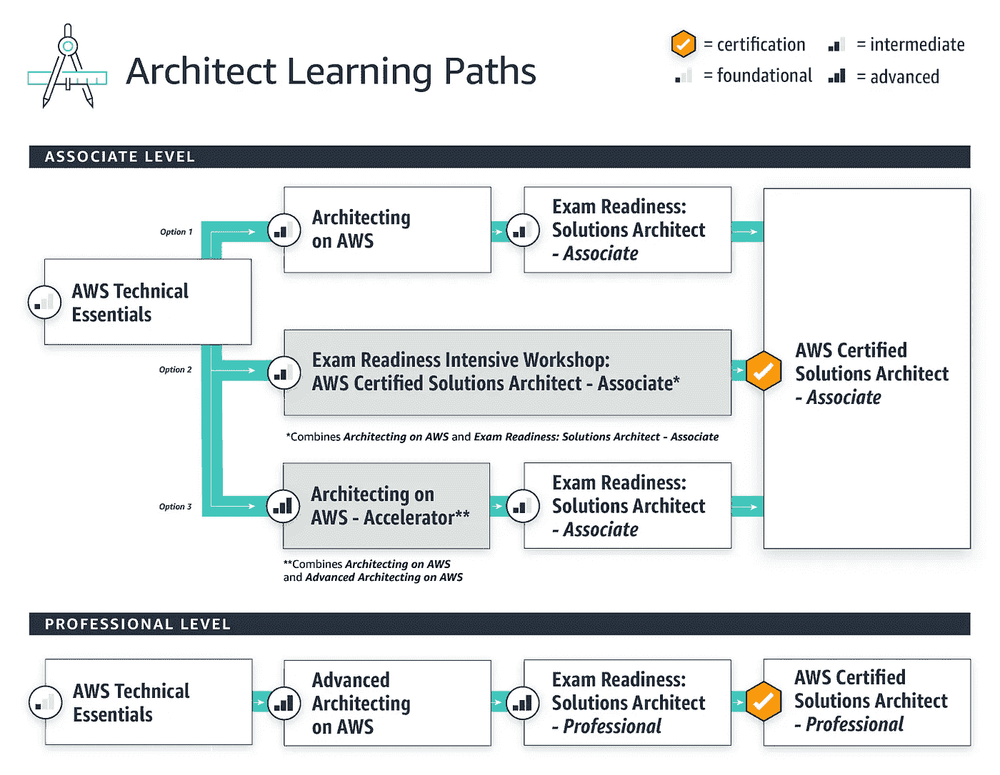
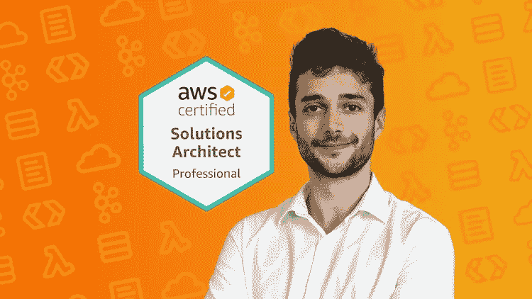
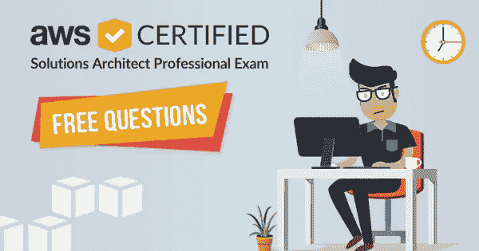
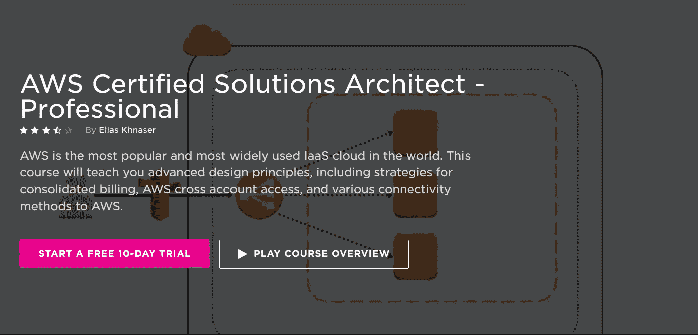
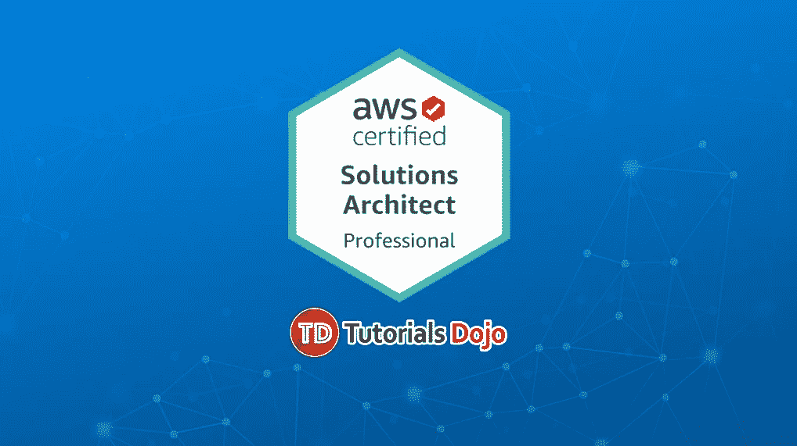
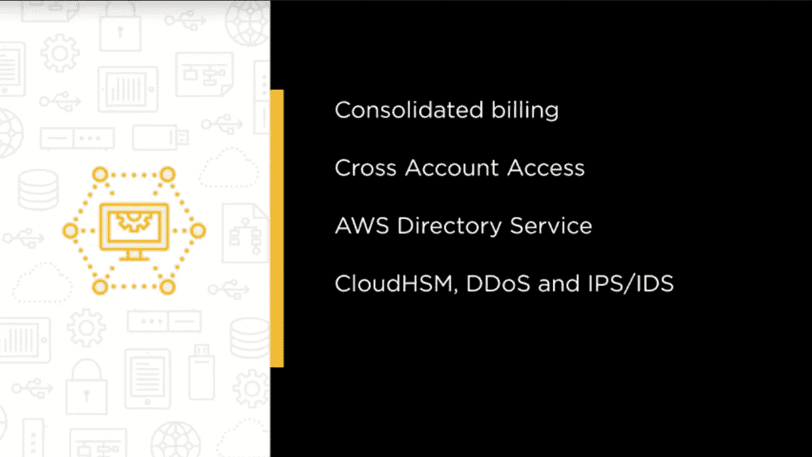
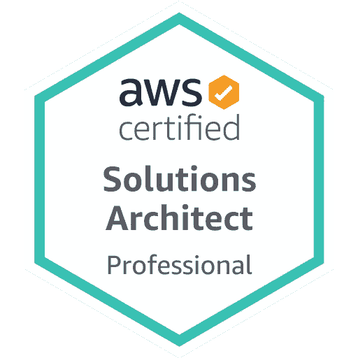

# 2023 年的 6 门最佳 AWS 解决方案架构师专业认证考试课程和实践测试

> 原文：<https://medium.com/javarevisited/6-best-courses-for-aws-certified-solution-architect-professional-exam-in-2020-df5850a9279a?source=collection_archive---------0----------------------->

## 2023 年破解 AWS 解决方案架构师专业认证的最佳在线课程和实践测试

image _ credit—AWS[https://aws.amazon.com/training/path-architecting/](https://aws.amazon.com/training/path-architecting/)

大家好，如果你想成为 AWS 认证的解决方案架构师专业人士，并寻找最好的在线课程开始准备，那么你来对地方了。

过去，我分享过通过 [AWS 云从业者](/javarevisited/10-best-aws-certified-cloud-practitioner-clf-c01-online-courses-and-practice-test-to-crack-ecc0f913091e)、 [AWS 开发人员](/javarevisited/top-5-online-courses-to-become-aws-certified-developer-associate-in-2020-best-of-lot-9b22baf84ca8)、 [AWS 系统操作员](/javarevisited/6-best-aws-sysops-online-courses-for-devops-engineers-to-become-a-certified-aws-sysops-5c2ae9dad31d)和 [AWS 解决方案架构师助理](/javarevisited/top-5-aws-training-courses-to-crack-amazon-web-service-solutions-architect-associate-certification-3f4affa8f660)考试的最佳课程，今天，我将分享通过最难的 AWS 认证的最佳课程，也可能是最难的**云认证之一**，是的，你猜对了。我说的是 AWS 解决方案架构师——专业认证。

这不仅是最难的，也是最受欢迎的云认证，没有多少开发人员和系统管理员能够通过。通过 [AWS 解决方案架构师助理考试](https://javarevisited.blogspot.com/2019/08/how-to-crack-aws-certified-solution-architect-exam.html)稍微容易一些，但这一项完全是另一个难题。

你不仅需要对云计算有深入的了解，还需要对许多基本的 AWS 服务有深入的了解，才能获得这个令人垂涎的认证。好消息是对 AWS 认证解决方案架构师的需求很大，一旦你通过了考试，你将得到你一直想要的工作，甚至可以得到更高的薪水。

如果你不知道，AWS，也被称为[亚马逊网络服务](https://aws.amazon.com/)是一种在线云存储和计算服务，它正迅速成为几家企业资助的最大的在线数据库之一。

[**AWS 认证解决方案架构师**](https://aws.amazon.com/certification/certified-solutions-architect-professional/) 是一项考试(助理级和专业级)，测试个人在 AWS 上管理和操作系统的架构角色技能。

如果你想成为一名认证 AWS 解决方案架构师——专业人士，那么你必须已经是一名 [AWS 解决方案架构师——助理](https://www.java67.com/2020/04/how-to-paas-aws-certified-solution-architect-exam-in-2020.html)或者拥有 AWS 或亚马逊 Web 服务架构的丰富知识。

**AWS 解决方案架构师专业考试**正在成为 IT 领域最高级别的认证之一，在 IT 行业非常受欢迎。也很难通过。该证书检查个人的以下技能:

*   执行成本控制策略的能力
*   在 AWS 上迁移复杂的多层应用程序
*   在 [AWS](/javarevisited/top-5-aws-training-courses-to-crack-amazon-web-service-solutions-architect-associate-certification-3f4affa8f660?source=collection_home---4------0-----------------------) 上设计和部署企业范围的可扩展操作
*   在 AWS 上创建和部署动态可伸缩、高可用性、容错和可靠的应用程序
*   选择合适的 AWS 服务来设计和部署基于给定平台的应用程序

该证书非常受欢迎的原因是，许多公司将数据和应用程序放在云上，或者希望将数据和应用程序迁移到云上，他们需要拥有企业级复杂应用程序解决方案设计的人员来完成这项工作。 [AWS 认证解决方案架构师——专业人士](https://javarevisited.blogspot.com/2020/04/top-5-course-to-crack-aws-solution-architect-professional-sap-c01-certification-exam.html)年收入约为 12 万美元。

以下是一些重要的考试细节

# 破解 AWS 解决方案架构师的 6 门最佳课程—2023 年专业考试

不要再浪费你的时间了，下面是破解 AWS 解决方案架构师专业认证的最佳在线课程列表。此列表包含来自 [Udemy](/javarevisited/my-favorite-udemy-online-courses-for-programmers-and-software-engineers-f9d941dd0035?source=---------14----------------------------) 和 [Pluralsight](/javarevisited/top-10-pluralsight-courses-to-learn-programming-and-software-development-during-covid-19-stay-at-30b7d8a4f88f) 的最佳 AWS 课程，可通过 AWS 解决方案架构师专业考试(SAP-C01)获得认证。

我还加入了几个[模拟测试](https://javarevisited.blogspot.com/2020/07/top-5-aws-solution-architect-associate-practice-tests-dumps-mock-exams.html#axzz6dCbHWcGY)来提高通过这个困难的云认证所需的速度和准确性。

## 1.【2023 年终极 AWS 认证解决方案架构师专家

本课程费用为 11.99 美元，提供完整的 AWS 认证解决方案架构师专业人员 SAP-C01，帮助您成为 AWS 认证解决方案架构师专业人员。它的评分为 4.6 分(满分为 5.0 分)，注册人数超过 7000 人。它是由夏羽·马雷克创建的，用英语授课。

在您考虑学习本课程之前，您必须已经拥有 AWS 的实际操作经验和 AWS Certified Solutions Architect Associate 证书。这门课程不是典型的速成课程，也不需要动手操作。本课程假设您已经掌握了关于 AWS 认证解决方案架构的良好背景知识，并且只为您提供获得证书所需的知识。

本课程没有演示考试，您可以注册参加，并在参加本课程时或结束后参加考试。

当您购买本课程时，您也购买了在 Q & A 部分随时访问所有未来更新的权利。所有的 Udemy 课程都有 30 天的保修期。

**以下是加入本 AWS 课程的链接** — [终极 AWS 认证解决方案架构师专家](https://click.linksynergy.com/deeplink?id=JVFxdTr9V80&mid=39197&murl=https%3A%2F%2Fwww.udemy.com%2Fcourse%2Faws-solutions-architect-professional%2F)

## 2.[尼尔·戴维斯的 AWS 认证解决方案架构师专家](https://click.linksynergy.com/deeplink?id=JVFxdTr9V80&mid=39197&murl=https%3A%2F%2Fwww.udemy.com%2Fcourse%2Faws-certified-solutions-architect-professional-training%2F)

与之前的课程不同，本课程不仅教授如何通过 AWS 认证解决方案架构师专业考试，还提供了独特的一体化备考指南。

由 Udemy 上最优秀的 AWS 讲师之一 Neal Davis 创建，这也是 Udemy 上评分最高的 AWS 认证解决方案架构师专业课程，评分为 4.7 分(满分 5 分)，有 43，517 名学生注册。它是用英语教的。

在开始本课程之前，您需要有动力，并准备好用关于 [AWS 认证解决方案架构师](https://javarevisited.blogspot.com/2019/08/top-5-free-aws-solution-architect-Associate-certification-dumps-practice-questions.html)的健康背景信息更新您的 AWS 架构师档案。你还必须准备投入时间，一遍又一遍地做，直到你得到它。

它不仅能让你通过迄今为止所有亚马逊网络服务证书中最难的*，还能和你一起通过 **AWS 技术面试**。它还将提高您在 AWS 解决方案架构师专业领域的能力水平。

**以下是参加本课程的链接** — [由 Neal Davis 教授的 AWS 认证解决方案架构师专业课程](https://click.linksynergy.com/deeplink?id=JVFxdTr9V80&mid=39197&murl=https%3A%2F%2Fwww.udemy.com%2Fcourse%2Faws-certified-solutions-architect-professional-training%2F)*

**

*该课程也有令人惊讶的评论，因为 90%参加该课程的人以不低于 75%的成绩通过了考试。课程中包含的演示或模拟考试也很有启发性，它有一个动手实验室，让您获得关于 [AWS 基础架构和服务的第一手经验](https://javarevisited.blogspot.com/2020/05/top-5-amazon-web-services-aws-courses-for-beginners-and-experienced-programmers.html)。*

## *3. [AWS 认证解决方案架构师专家登录 Whizlabs](https://shareasale.com/r.cfm?b=413930&u=880419&m=43514&urllink=https%3A%2F%2Fwww%2Ewhizlabs%2Ecom%2Faws%2Dsolutions%2Darchitect%2Dprofessional%2F&afftrack=)*

*说到 it 认证，Whizlabs 是我最喜欢的地方。过去，我使用过 Whizlabs 来清除 Java 和云认证，我很高兴地说这是值得的。*

*现在 [**Whizlabs**](https://shareasale.com/r.cfm?b=413930&u=880419&m=43514&urllink=https%3A%2F%2Fwww%2Ewhizlabs%2Ecom%2Fpricing%2F&afftrack=) 已经扩展了他们的在线课程库，并为 2023 年的 AWS 解决方案架构师专业考试提供高质量的 AWS 课程、实践测试和动手实验室。*

*在这个包中，您将获得在线课程和实践课程，如 15 个带有详尽解释的免费实践问题和 5 个全长模拟考试(400 多个独特的问题)，每个考试有 80 个问题。*

*它还有部分或主题测试，准确地说是 CSAP 最新考试版本的 4 个客观/主题测试(4 个 **0 个独特的问题**)。您还可以观看 9 个多小时的所有考试目标的培训视频，涵盖 100%的教学大纲。*

*您还可以免费使用实验室，AWS 认证解决方案架构师专业人员有 72 个实验室，我强烈推荐给任何准备参加 AWS 解决方案架构师考试的人。*

*顺便说一下，您可以单独参加本课程，也可以订阅[**whiz labs**](https://shareasale.com/r.cfm?b=413930&u=880419&m=43514&urllink=https%3A%2F%2Fwww%2Ewhizlabs%2Ecom%2Fpricing%2F&afftrack=)，这样您就可以完全访问他们所有的在线培训课程和不同认证的实践考试，每年仅需 99 美元(现在享受 50%的折扣)。我强烈推荐这个订阅计划，因为 Whizlabs 有最好的材料来准备 IT 认证。您还可以使用我们的 JAVAREVISTED 优惠券享受八折优惠。*

**

## *4. [AWS 认证解决方案架构师—职业道路](https://pluralsight.pxf.io/c/1193463/424552/7490?u=https%3A%2F%2Fwww.pluralsight.com%2Fcourses%2Faws-certified-solutions-architect-professional)*

*本课程由著名作家 Craig Golightly、Ned Bellavance 和 Andru Estes 讲授。本课程提供与 AWS 内架构最佳实践相关的几个主题的技术知识。

他们不仅为您提供通过 AWS 专业解决方案架构师考试所需的工具。考试，还深入分析了 AWS 认证解决方案架构师的概念以及如何在现实世界中应用它们。

在开始学习本课程之前，您需要对 AWS 解决方案架构师至少有一个助理级别的工作理解。它教授更复杂的应用 [AWS 解决方案架构师助理级](https://www.java67.com/2020/04/how-to-paas-aws-certified-solution-architect-exam-in-2020.html)与更密集的设计。Craig Golightly 负责主题“AWS 上的复杂性设计和 AWS 中的高级安全性设计”。主题“AWS 上的高级网络”由 Ned Bellavance 主持。*

*Andru Estes 教授在 AWS 中设计可扩展和容错系统，在 AWS 中实施分析和实时数据，以及在 AWS 中获得卓越运营*

***以下是参加本课程的链接** - [AWS 认证解决方案架构师-职业道路](https://pluralsight.pxf.io/c/1193463/424552/7490?u=https%3A%2F%2Fwww.pluralsight.com%2Fcourses%2Faws-certified-solutions-architect-professional)*

**

*顺便说一下，你需要一个 [*Pluralsight 会员*](https://pluralsight.pxf.io/c/1193463/424552/7490?u=https%3A%2F%2Fwww.pluralsight.com%2Flearn) 才能加入这个课程，费用大约是每月 29 美元或每年 299 美元(14%的折扣)。我向所有程序员强烈推荐这个订阅，因为它提供了超过 7000 个在线课程的即时访问，以学习任何技术技能。或者，你也可以使用他们的 [**10 天免费通行证**](https://pluralsight.pxf.io/c/1193463/424552/7490?u=https%3A%2F%2Fwww.pluralsight.com%2Flearn) 免费观看本课程。*

* [## 个人技术技能|多视角

### 借助 Pluralsight，在开发运维、机器学习、云、安全基础设施等领域构建所需技能…

pluralsight.pxf.io](https://pluralsight.pxf.io/c/1193463/424552/7490?u=https%3A%2F%2Fwww.pluralsight.com%2Flearn)* 

## *5. [AWS 认证解决方案架构师专业实务考试](https://click.linksynergy.com/deeplink?id=JVFxdTr9V80&mid=39197&murl=https%3A%2F%2Fwww.udemy.com%2Fcourse%2Faws-solutions-architect-professional-practice-exams-amazon%2F)*

*只需 16.99 美元，本课程提供了成为 AWS 解决方案架构师的途径！它的评分为 4.5 分(满分为 5 分)，有超过 12000 名学生注册。它是用英语教授的，在你参加之前，你需要一个有良好互联网连接的 AWS 帐户。

本课程还提供 300 道题作为练习题。它有 AWS 解决方案架构师专业实践测试，分为四个部分，每个部分提供 75 个问题。

如果你想参加**解决方案架构师认证专家**考试，那么你应该为时间和准确性做好充分准备。考试平均需要 180 分钟。

**这里是参加本次 AWS 实践考试** — [解决方案架构师专业实践考试](https://click.linksynergy.com/deeplink?id=JVFxdTr9V80&mid=39197&murl=https%3A%2F%2Fwww.udemy.com%2Fcourse%2Faws-solutions-architect-professional-practice-exams-amazon%2F)的链接*

**

*您可以通过像这样的练习测试来提高您的准确性和速度，如果您需要更多的练习，您还可以查看 Whizlab 的 AWS 解决方案架构师专业练习测试，其中包含 [**400 多个问题**](https://click.linksynergy.com/deeplink?id=JVFxdTr9V80&mid=39197&murl=https%3A%2F%2Fwww.udemy.com%2Fcourse%2Faws-certified-solutions-architect-professional-whizlabs%2F) **。***

## *6. [AWS 认证解决方案架构师—专业人士](https://click.linksynergy.com/deeplink?id=JVFxdTr9V80&mid=39197&murl=https%3A%2F%2Fwww.udemy.com%2Fcourse%2Faws-certified-solutions-architect-professional%2F)【Udemy】*

*这是另一门关于 AWS 解决方案架构师的专业课程，由 Udemy 上的 Zeal Vora 教授。它涵盖了 AWS 的几种连接方法、高级设计原则，以及如何将 AWS 交叉帐户访问用于合并计费。

本课程的大纲是设计 AWS 网络服务，用户将学习如何设计弹性负载平衡器、VPC、直接连接、域名系统、NAT 实例和 NAT 网关。

用户还将学习管理 AWS 安全策略，如高性能计算、Cloud Trail 和 Cloud Watch、CloudHSM、DDoS、IDS/IPS、STS、交叉帐户访问、高性能计算和目录服务。*

***以下是加入这条道路的链接** — [AWS 认证解决方案架构师—专业人士](https://click.linksynergy.com/deeplink?id=JVFxdTr9V80&mid=39197&murl=https%3A%2F%2Fwww.udemy.com%2Fcourse%2Faws-certified-solutions-architect-professional%2F)*

**

## *7.[AWS 认证解决方案架构师职业模拟考试](https://click.linksynergy.com/deeplink?id=JVFxdTr9V80&mid=39197&murl=https%3A%2F%2Fwww.udemy.com%2Fcourse%2Fpractice-exam-aws-certified-solutions-architect-professional%2F)*

*夏羽·马瑞克是 AWS 大师，拥有大部分 AWS 证书，也是 UDemy 上最好的 AWS 课程的讲师，他刚刚为 AWS 解决方案架构师专业考试推出了一个新的实践测试，我认为值得包括在这个列表中。*

*这不是一个非常全面的列表，只包含 85 个问题，但它们具有挑战性，并深入测试您的 AWS 技能。已经有超过 954 人参加了 hits 测试，我强烈建议你在准备好考试后再去做一遍。*

*以下是参加 AWS 模拟考试的链接— [模拟考试 AWS 认证解决方案架构师专家](https://click.linksynergy.com/deeplink?id=JVFxdTr9V80&mid=39197&murl=https%3A%2F%2Fwww.udemy.com%2Fcourse%2Fpractice-exam-aws-certified-solutions-architect-professional%2F)*

**

*以上是 2023 年成为专业解决方案架构师的**最佳课程**。完成这些课程后，您将为通过最难、最令人垂涎的云认证做好充分准备。*

> *一旦你通过认证，它将在几年内有效，然后你将需要重新认证你的技能。*

*好消息是对[认证的 AWS 解决方案架构师](https://www.java67.com/2020/10/5-free-courses-for-aws-solution-architect-professional-exam.html)有巨大的需求，一旦你把这个认证放在你的简历和 LinkedIn 个人资料上，你会马上得到招聘人员的电话。你会得到公司的选择权和你想要的薪水。

其他 **IT 认证文章**您可能喜欢:*

*   *[AWS 认证解决方案架构师专业考试转储](https://www.certification-questions.com/practice-exam/amazon/aws-certified-solutions-architect-professional?affiliateCode=fcff36fd-557a-4713-abf6-973e9924770f&utm_source=Javin&utm_medium=affiliate&utm_campaign=affiliate)*
*   *[破解 AWS 解决方案架构师认证的 5 大课程](https://javarevisited.blogspot.com/2019/05/top-5-courses-to-crack-aws-solutions-architect-associate-certification-exam-SAA-C01.html#axzz5rHwAwycj)*
*   *[学习 Docker 和 Kubernetes 的十大课程](https://dev.to/javinpaul/top-10-courses-to-learn-docker-and-kubernetes-for-programmers-4lg0)*
*   *[通过谷歌助理云工程师认证的前 5 门课程](https://javarevisited.blogspot.com/2019/07/top-5-google-cloud-platform-gcp-courses-certifications-online.html)*
*   *[如何成为 DevOps 工程师？](https://javarevisited.blogspot.com/2018/09/the-2018-devops-roadmap-your-guide-to-become-DevOps-Engineer.html)*
*   *[如何破解 Azure 管理员助理认证(AZ-103)](https://javarevisited.blogspot.com/2020/04/how-to-crack-microsoft-az-103-azure-administrator-associate-exam-certification.html)*
*   *[如何破解甲骨文 2023 年 Java 认证？](https://medium.freecodecamp.org/how-to-pass-oracles-java-certifications-a-practical-guide-for-developers-e9b607ba6173)*
*   *[Pivotal 的 Spring 认证对工作和职业生涯有帮助吗？](https://javarevisited.blogspot.com/2017/07/does-spring-certification-help-in-job-and-career.html)*
*   *[如何通过 Spring Core Professional 5.0 认证](https://javarevisited.blogspot.com/2018/08/how-to-crack-spring-core-professional-certification-exam-java-latest.html)*
*   *[10 门免费学习数据结构和算法的课程](http://www.java67.com/2019/02/top-10-free-algorithms-and-data.html)*
*   *[如何破解 Azure Fundamentals (AZ-900)认证](https://javarevisited.blogspot.com/2020/04/how-to-crack-microsoft-azure-fundamentals-certification-az-900-exam.html)*
*   *[AWS 解决方案架构师专业考试官方指南](https://aws.amazon.com/certification/certified-solutions-architect-professional/)*
*   *[程序员前 5 名 AZ-900 模拟测试](https://javarevisited.blogspot.com/2020/02/top-5-AZ-900-exam-Azure-Fundamentals-certification-practice-tests-and-mock-exams-to.html)*
*   *[10 门数据科学和机器学习认证课程](https://dev.to/javinpaul/10-data-science-and-machine-learning-courses-for-programmers-looking-to-switch-career-57kd)*
*   *[每个软件开发人员都应该学习的 10 件事](https://dev.to/javinpaul/10-things-every-software-developer-should-know-39pe)*
*   *[破解 Azure 云架构师(AZ-300)考试的前 5 门课程](https://javarevisited.blogspot.com/2019/07/top-5-courses-to-crack-azure-architecture-technologies-certification-az-300-exam.html#axzz6E6VuRMsx)*
*   *[OCAJP 和 OCPJP 考试 10 道免费样题](http://www.java67.com/2017/05/10-free-java-8-certification-sample-questions-OCAJP8-OCPJP8-Mock-Exams.html)*

*感谢您阅读本文。如果您发现这些课程对您的 AWS 解决方案架构师-专业认证准备有用，请与您的朋友和同事分享。如果您有任何问题或反馈，请留言。

**P. S.** —如果你刚刚接触云计算和 AWS 的世界，并且正在寻找一些免费的课程来学习亚马逊 Web 服务，那么你也可以查看这个为初学者提供的免费 AWS 课程列表****。*****

***** [## 免费亚马逊 AWS 教程- AWS 概念

### Linux 学院是建立在这样一个信念上的，即提供高质量的，深入的培训应该在一个…

udemy.com](https://click.linksynergy.com/deeplink?id=JVFxdTr9V80&mid=39197&murl=https%3A%2F%2Fwww.udemy.com%2Fcourse%2Faws-concepts%2F)*****