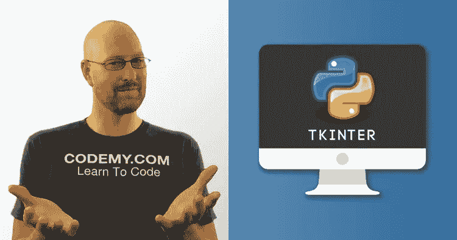
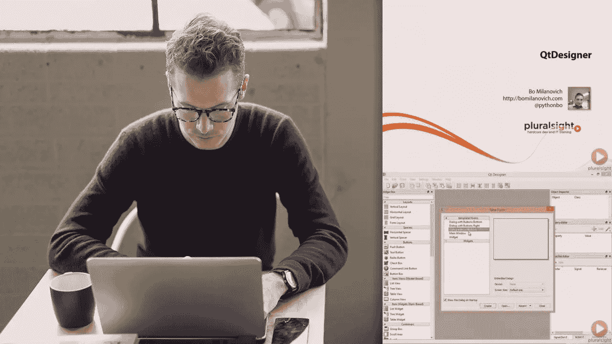
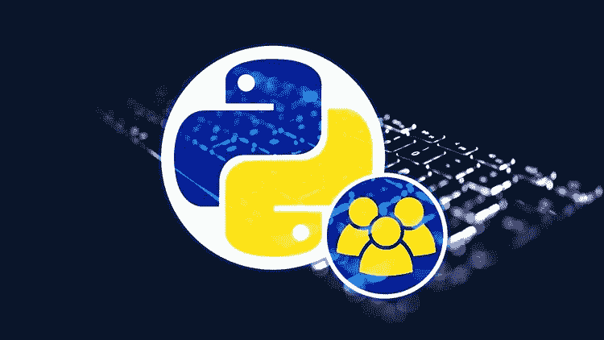
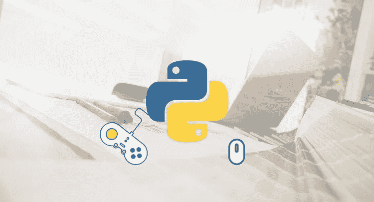

# 2023 年学习使用 Python 进行 GUI 开发的 Tkinter 和 PyQT 的 6 门最佳在线课程

> 原文：<https://medium.com/javarevisited/6-best-courses-to-learn-tkinter-and-pyqt-for-gui-development-in-python-664976674114?source=collection_archive---------1----------------------->

## 我最喜欢的在线课程 2023 年学习 Python GUI 开发的 Tkinter 和 PyQT

image_source — Udemy

大家好，如果你想在 2023 年学习 Python 进行 GUI 开发，并且正在寻找学习 Tkinter 和 QT 这两个最流行的 Python GUI 开发框架的最佳在线课程，那么你来对地方了。

前面我已经分享了[**最佳 Python 课程**](/javarevisited/top-10-courses-to-learn-python-for-web-development-in-2020-best-of-lot-efe11fb6d212) ，[网站](/javarevisited/10-free-python-tutorials-and-courses-from-google-microsoft-and-coursera-for-beginners-96b9ad20b4e6)，[书籍](/javarevisited/my-favorite-books-to-learn-python-in-depth-77465633b46e)，[免费 Python 课程](https://www.java67.com/2018/02/5-free-python-online-courses-for-beginners.html)而今天我要讲的是使用 Python 进行 GUI 开发的最佳 Tkinter 和 PyQT 课程。

两人都同意 python 几乎已经成为大公司中使用最多的编程语言，最常用的领域之一是创建桌面应用程序。

虽然你们很多人都知道 Python 在 [Web 开发](https://javarevisited.blogspot.com/2020/01/top-5-courses-to-learn-flask-for-web-development-with-python.html)、[数据科学](https://javarevisited.blogspot.com/2018/03/top-5-data-science-and-machine-learning-online-courses-to-learn-online.html)、[机器学习](https://javarevisited.blogspot.com/2019/08/top-5-python-books-for-data-science-and-machine-learning.html)和[数据分析](https://javarevisited.blogspot.com/2019/10/top-5-courses-to-learn-pandas-for-data-analysis-python.html)领域被大量使用，但是你们可能知道 Python 也有一些很棒的库和框架，比如用于创建桌面应用程序和 GUI 应用程序的[**【Tkinter】**](https://docs.python.org/3/library/tkinter.html)和 [**PyQT5**](https://www.qt.io/) 。

桌面应用程序是安装在计算机上的程序，无论是 Linux、macOS 还是 windows，它都可以处理数据，让你的生活更加轻松，所有这些都可以通过使用 python 上的一些库来完成。

学习如何使用 [Python](/javarevisited/8-advanced-python-programming-courses-for-intermediate-programmer-cc3bd47a4d19) 创建桌面应用程序是一项很好的技能，因为它很容易，并且允许你开发自己的应用程序，比如如果该应用程序不是免费的，比如 IDM，你可以为自己创建一个并用于个人目的，或者自动化你的日常工作，或者设计一个应用程序并将其用于商业目的，比如设计游戏。

在这篇文章中，你会看到几个类向你展示如何利用各种 [python 框架](https://javarevisited.blogspot.com/2019/04/top-5-python-web-development-frameworks.html)开发你自己的桌面应用程序，比如 **PyQT5** 和 **Tkinter** 等等。

# Python 程序员学习 Tkinter 和 PyQT5 的 6 个最佳在线课程

为了不浪费您的时间，这里列出了学习 PyQt5 和 Tkinter 的最佳在线课程，这是两个最受欢迎的 Python 库和框架，用于创建基于图形用户界面的应用程序。

你可以加入这些课程，学习 [Python GUI 开发](https://javarevisited.blogspot.com/2020/07/top-5-courses-to-learn-tkinter-and-pyqt.html#axzz6sZlXGk9y)所需的这些框架和相关工具。它们完全是在线的，而且非常便宜，因为大多数课程你只需花 10 美元就能在 Udemy 上买到，这种情况时有发生。

## 1.[Python GUI 应用 Tkinter 简介](https://click.linksynergy.com/deeplink?id=JVFxdTr9V80&mid=39197&murl=https%3A%2F%2Fwww.udemy.com%2Fcourse%2Fintro-to-tkinter-for-python-gui-apps%2F)

本课程将向您展示如何创建复杂的桌面应用程序，只要在您的机器上安装 python，就可以在 Windows、macOS 或 Linux 上运行。他使用最流行的框架之一 Tkinter 来设计这些应用程序。

你将在这门课中学到:

*   如何使用 Tkinter GUI 框架
*   如何使用 Tkinter 和 Python 创建基本应用程序
*   将您的应用程序转换为 EXE 文件。

你将从这个库的结构和它如何工作开始，然后你将继续如何创建按钮，小部件，应用程序的布局，标签，样式。最终，您将完成一个好看的应用程序，您可以出售或自己使用它。

**这里是加入这一最佳课程的链接**——[Python GUI 应用 Tkinter 简介](https://click.linksynergy.com/deeplink?id=JVFxdTr9V80&mid=39197&murl=https%3A%2F%2Fwww.udemy.com%2Fcourse%2Fintro-to-tkinter-for-python-gui-apps%2F)

顺便说一句，如果你是 Python 编程的新手，我建议你先从基本的 Python 课程开始，比如何塞·波尔蒂利亚在 Udemy 上的 [**完整的 Python 大师班**](https://click.linksynergy.com/deeplink?id=JVFxdTr9V80&mid=39197&murl=https%3A%2F%2Fwww.udemy.com%2Fcourse%2Fcomplete-python-bootcamp%2F) 课程，这是学习 Python 的最好课程。

 [## Python 训练营:学习 Python 编程和代码培训

### 这是 Udemy 上最全面、最直接的 Python 编程语言课程！你是否…

udemy.com](https://click.linksynergy.com/deeplink?id=JVFxdTr9V80&mid=39197&murl=https%3A%2F%2Fwww.udemy.com%2Fcourse%2Fcomplete-python-bootcamp%2F) 

## 2.[使用 Python 和 Tkinter-Udemy 进行 GUI 开发](https://click.linksynergy.com/deeplink?id=JVFxdTr9V80&mid=39197&murl=https%3A%2F%2Fwww.udemy.com%2Fcourse%2Fdesktop-gui-python-tkinter%2F)

本课程是最大的课程之一，教你如何使用 python 编程语言和免费的 Tkinter 框架创建 GUI 应用程序，并掌握这种桌面应用程序的开发。

在本课程中，您将学到:

*   python 快速入门。
*   如何使用 Tkinter 框架？
*   创建一些有用的应用程序。

您将从学习 python 语言开始，然后通过学习小部件、样式、面向对象编程( [OOP](/swlh/5-free-object-oriented-programming-online-courses-for-programmers-156afd0a3a73) )和更多技术来创建您的第一个 Tkinter 应用程序。之后，你将开始创建一些现实世界中有用的应用程序，如聊天应用程序等。

**这里是加入这个最佳课程的链接** — [用 Python 和 Tkinter 开发 GUI](https://click.linksynergy.com/deeplink?id=JVFxdTr9V80&mid=39197&murl=https%3A%2F%2Fwww.udemy.com%2Fcourse%2Fdesktop-gui-python-tkinter%2F)

## 3. [Python 桌面应用开发— Pluralsight](https://pluralsight.pxf.io/c/1193463/424552/7490?u=https%3A%2F%2Fwww.pluralsight.com%2Fcourses%2Fpython-desktop-application-development)

通过使用 PyQT5 框架和 python 编程语言，开发桌面应用程序变得前所未有的简单，这也是您将在本应用程序开发入门课程中学到的内容。

您将从学习一些 UI 设计的基础知识开始，然后继续实际开发，如小部件、事件、 **pydownloader** 库、功能、复选框等等，直到您使用 python 开发一个完整的桌面应用程序。

在本课程中，您将学到以下内容:

*   一些用户界面(UI)基础知识。
*   使用 PyQT5 框架。
*   创建一个完整的交互式应用程序。

**这里是加入本课程** — [Python 桌面应用开发](https://pluralsight.pxf.io/c/1193463/424552/7490?u=https%3A%2F%2Fwww.pluralsight.com%2Fcourses%2Fpython-desktop-application-development)的链接

顺便说一句，你需要一个 Pluralsight 会员才能参加这个课程，费用大约是每月 29 美元或每年 299 美元。有时候他们也会打 33%的折扣，我上次是 199 美元买的。或者，你也可以使用他们的 [**10 天免费通行证**](https://pluralsight.pxf.io/c/1193463/424552/7490?u=https%3A%2F%2Fwww.pluralsight.com%2Flearn) 免费观看这门课程。

 [## 对个人来说

### 无论你想进入一个新的领域，改善你的角色，还是把你的伟大想法变成现实，Pluralsight…

pluralsight.pxf.io](https://pluralsight.pxf.io/c/1193463/424552/7490?u=https%3A%2F%2Fwww.pluralsight.com%2Flearn) 

## 4.[使用 PyQt5 进行 Python GUI 编程](https://click.linksynergy.com/deeplink?id=JVFxdTr9V80&mid=39197&murl=https%3A%2F%2Fwww.udemy.com%2Fcourse%2Fpython-gui-programming-using-pyqt5%2F)【UDEMY 课程】

完成上述关于如何使用 PyQT5 创建完整的桌面应用程序的课程本课程将向您介绍如何通过设计您的自定义按钮和增强用户界面等来使您的应用程序更加美观。

在本课程中，您将学到:

*   如何配合 PyQT5 使用 QTDesigner？
*   创建更高级的用户界面。
*   定制您的桌面应用程序。

您将使用 PyQT5 框架和 QTDesigner 为您的桌面应用程序提供一个漂亮的界面，比如自定义按钮图标和更高级的用户界面元素，创建通知等等。

**这里是加入本课程的链接** — [使用 PyQt5 进行 Python GUI 编程](https://click.linksynergy.com/deeplink?id=JVFxdTr9V80&mid=39197&murl=https%3A%2F%2Fwww.udemy.com%2Fcourse%2Fpython-gui-programming-using-pyqt5%2F)

## 5. [Python 游戏开发](https://click.linksynergy.com/deeplink?id=JVFxdTr9V80&mid=39197&murl=https%3A%2F%2Fwww.udemy.com%2Fcourse%2Fpython-game-development-build-11-total-games%2F)【UDEMY 课程】

本课程将通过使用 Pygame 库和其他库构建 11 个游戏项目来帮助您掌握 python 桌面应用程序，这些库也包含超过 33 小时的内容视频。如果您想学习使用 python 进行游戏开发，这被认为是最佳资源。

在本课程中，您将学到以下内容:

*   python 简介。
*   如何使用 Pygame 等库？
*   使用 Pygame 创建许多游戏。

您将从 python 语法等基础知识开始，您将学习 Pygame 库，并通过创建一些游戏开始您的旅程，如愤怒的小鸟、Flappy bird、种族游戏、马里奥等。

**这里是加入本课程** — [Python 游戏开发](https://click.linksynergy.com/deeplink?id=JVFxdTr9V80&mid=39197&murl=https%3A%2F%2Fwww.udemy.com%2Fcourse%2Fpython-game-development-build-11-total-games%2F)的链接

## 6.[使用 Qt 框架学习 Python GUI 编程](https://click.linksynergy.com/deeplink?id=JVFxdTr9V80&mid=39197&murl=https%3A%2F%2Fwww.udemy.com%2Fcourse%2Fpython-gui-programming%2F)

这是另一个很棒的 Udemy 课程，学习 Python GUI 编程，并使用一个很棒的跨平台框架 Qt 设计强大的 GUI 应用程序。

这个 12 小时的课程是由 Bo Milanovich 创建的，它将教你如何只用 Python 和它的一个 Qt 绑定来构建强大的桌面应用程序。

以下是您将在本课程中学到的内容:

1.  什么是 Qt 框架
2.  如何编写复杂的 GUI 应用程序
3.  如何使用 QtDesigner
4.  如何分发 Python GUI 应用程序

总体来说，这是一个学习使用 Qt 框架用 Python 开发 GUI 的综合课程。超过 1.6 万名学生已经加入了该课程。

**这里是加入本课程的链接** — [使用 Qt 框架学习 Python GUI 编程](https://click.linksynergy.com/deeplink?id=JVFxdTr9V80&mid=39197&murl=https%3A%2F%2Fwww.udemy.com%2Fcourse%2Fpython-gui-programming%2F)

image_source — Udemy

以上是关于学习 Tkinter 和 PyQT5 框架的**最佳在线课程，用于使用 Python 创建 GUI 应用程序。如果你想创建桌面应用程序、游戏和桌面工具，那么你可以使用这些课程来学习所有的技巧。**

他们还将让你掌握使用 python 及其框架的桌面和游戏开发，以及如何定制它，以便你可以将它用于商业用途。

其他有用的 **Python 编程**你可能喜欢探讨的文章

*   [2023 年学习 Python 的 5 大课程](http://javarevisited.blogspot.sg/2018/03/top-5-courses-to-learn-python-in-2018.html)
*   [从零开始学习 Python 的前 5 本书](https://javarevisited.blogspot.com/2019/07/top-5-books-to-learn-python-in-2019.html)
*   [学习熊猫数据分析的 5 门最佳课程](https://becominghuman.ai/5-best-courses-to-learn-pythons-pandas-libary-for-data-analysis-and-data-science-34b62abb0e96)
*   [在线学习 PyTorch 和 Keras 的前 5 门课程](https://www.java67.com/2020/06/top-5-courses-to-learn-pytorch-and-keras.html)
*   [学习使用 Python 进行自然语言处理的 5 门最佳课程](https://www.java67.com/2020/07/top-5-courses-to-learn-natural-language-processing-NLP.html)
*   [前 5 名张量流和机器学习课程](https://hackernoon.com/top-5-tensorflow-and-ml-courses-for-programmers-8b30111cad2c)
*   [8 大 Python 机器学习库](https://javarevisited.blogspot.com/2018/10/top-8-python-libraries-for-data-science-machine-learning.html)
*   [为了更好地学习，你可以做的 8 个 Python 项目](/@javinpaul/8-projects-you-can-buil-to-learn-python-in-2020-251dd5350d56)
*   [哈佛和 IBM 的 9 门数据科学课程](https://becominghuman.ai/9-data-science-and-machine-learning-courses-by-harvard-ibm-udemy-and-others-12a0c7c23ec1)
*   [排名前五的数据科学和机器学习课程](https://hackernoon.com/top-5-data-science-and-machine-learning-course-for-programmers-e724cfb9940a)
*   [学习计算机视觉和 OpenCV 的 5 门最佳课程](https://www.java67.com/2020/07/top-5-courses-to-learn-computer-vision-opencv-python.html)
*   [9 门学习 PyTorch、Keras、Sci-kit 和 MatPlotLib 的课程](https://becominghuman.ai/10-free-courses-to-learn-python-machine-learning-libraries-scikit-learn-numpy-pandas-keras-3c77ba1a6907)
*   [2023 年程序员可以学习的 10 项技术](http://www.java67.com/2018/01/top-10-web-mobile-and-big-data-framework-libraries-technologies-programmers-should-learn-in-2018.html)
*   [2023 年学习 Python 的 5 门免费课程](http://www.java67.com/2018/02/5-free-python-online-courses-for-beginners.html)
*   [免费学习 Python 编码的五大网站](https://javarevisited.blogspot.com/2019/09/5-websites-to-learn-python-for-free.html)

感谢您阅读本文。如果你觉得这些*最好的 Python Tkinter 和 PyQT5 在线课程*有用，那么请分享给你的朋友和同事。如果您有任何问题或反馈，请留言。

**P. S.** —如果你热衷于学习使用 Tkinter 和 PyQT 框架的 Python GUI 编程，但正在寻找一个免费的在线培训课程，那么你也可以看看这个[**Python Tkinter for making GUI apps**](https://click.linksynergy.com/deeplink?id=JVFxdTr9V80&mid=39197&murl=https%3A%2F%2Fwww.udemy.com%2Fcourse%2Fpython-tkinter-for-making-graphical-user-interface%2F)—Udemy 上的一个免费课程。

 [## 免费的 Python GUI 教程- Python Tkinter 制作图形用户界面

### 我在九年级的时候开始学习 python，并涉足了它的所有子领域，比如 Django(用于 web 开发)，kivy(用于…

udemy.com](https://click.linksynergy.com/deeplink?id=JVFxdTr9V80&mid=39197&murl=https%3A%2F%2Fwww.udemy.com%2Fcourse%2Fpython-tkinter-for-making-graphical-user-interface%2F)