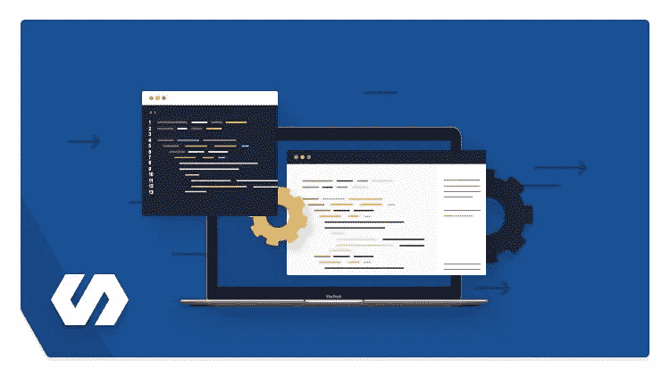

# 2023 年初学者学习的 7 门最佳免费 Dart 编程课程

> 原文：<https://medium.com/javarevisited/6-best-dart-programming-courses-for-beginners-to-learn-in-2021-2-are-free-24dc56f5ac14?source=collection_archive---------0----------------------->

## 这些是 2023 年学习 Dart 编程语言以使用 Flutter 进行 Android 和 iOS 应用程序开发的最佳付费和免费在线课程。

[飞镖和颤振:完整的开发者指南](https://click.linksynergy.com/deeplink?id=JVFxdTr9V80&mid=39197&murl=https%3A%2F%2Fwww.udemy.com%2Fcourse%2Fdart-and-flutter-the-complete-developers-guide%2F)

大家好，如果你想在 2023 年学习 Dart 并寻找最好的 Dart 编程在线课程，那么你来对地方了。之前，我已经分享了适合初学者的 [**最佳 Flutter 课程**](/javarevisited/my-favorite-flutter-and-dart-programming-courses-for-beginners-9e8355710d78) ，在这篇文章中，我将从 [Udemy](https://javarevisited.blogspot.com/2019/08/top-10-udemy-courses-and-certifications-for-programmers.html) 、 [Pluralsight](https://javarevisited.blogspot.com/2017/12/top-10-pluralsight-courses-java-and-web-developers.html#axzz69E1peGVz) 、 [Coursera](https://javarevisited.blogspot.com/2020/02/10-best-coursera-courses--for-python.html) 、 [Eduactive](https://javarevisited.blogspot.com/2020/01/top-10-free-interactive-online-courses.html) 和其他在线平台分享一些 2023 年学习 Dart 编程语言的最佳在线课程。

如果你一直关注技术发展，那么你可能知道 Dart 是 Google 创造的另一种编程语言。随着 [Golang](https://www.java67.com/2019/12/top-5-courses-to-learn-go-or-golang.html) 、 [Angular](https://javarevisited.blogspot.com/2018/06/5-best-courses-to-learn-angular.html) 和 [Flutter](https://javarevisited.blogspot.com/2019/07/top-5-online-training-courses-to-learn-flutter.html) 、 [Dart](https://dart.dev/) 也结合了现有平台的最佳实践，并试图将摩擦降至最低。

> Dart 最初于 2011 年推出，但最近才真正兴起。

在过去的几年里，Dart 编程语言出现了惊人的增长，主要是因为 [Flutter](https://flutter.dev/) ，这是一个来自谷歌的流行框架，用于为 [Android](/javarevisited/top-5-courses-to-learn-android-for-java-programmers-667e03d995b4) 和 [iOS 平台](/javarevisited/top-5-online-courses-to-learn-ios-12-swift-in-2019-a35ae1be7b2b?source=---------56------------------)开发跨平台的原生移动应用。

Dart 也是 StackOverFlow 调查中**最受欢迎的编程语言**之一，是为开发人员的生产力而设计的。它介于 [Java](https://javarevisited.blogspot.com/2018/05/top-5-java-courses-for-beginners-to-learn-online.html) 和 [JavaScript](https://javarevisited.blogspot.com/2018/06/top-10-courses-to-learn-javascript-in.html) 之间。

如果你不知道的话，Dart 是一种简单、干净、[面向对象的语言](/javarevisited/7-best-online-courses-to-learn-object-oriented-design-pattern-in-java-749b6399af59)，它比 JavaScript 这种编程语言有更多的结构。它支持强类型，可以被编译成 JavaScript，并且可以在 JavaScript 可以运行的地方运行，这意味着几乎可以在任何地方运行，比如 web、 [mobile](/@javinpaul/10-frameworks-and-libraries-mobile-application-developers-can-learn-in-2020-e0b91391cade) 和 server。

Dart 由丹麦软件工程师 Lars Bak 开发，他也是谷歌 Chrome 的 V8 JavaScript 引擎的负责人， **Dart 是一种优秀的编程语言，适合对代码结构感兴趣的开发人员**，这样他们就可以轻松地进行重构和构建大型 web 应用程序。

# 2023 年学习 Dart 编程的 7 门最佳+免费课程

为了不浪费你更多的时间，这里是我列出的学习数据编程语言的 7 大在线课程。大多数课程都会教你 [Flutter](https://javarevisited.blogspot.com/2019/07/top-5-online-training-courses-to-learn-flutter.html) 和 [Dart](https://javarevisited.blogspot.com/2020/01/top-5-courses-to-learn-dart-programming.html) ，因为你需要学习 Dart 来使用 Flutter 框架创建跨平台的原生应用。虽然我特别注意选择更侧重于 Dart 而不是 Flutter 的课程，但 Bryan Cairns 的第一堂和最后一堂课在这方面非常重要。该列表包括收费最高和免费的在线课程，以学习 Dart 编程和应用程序开发。

## 1.[飞镖和颤振:完整的开发者指南](https://click.linksynergy.com/deeplink?id=JVFxdTr9V80&mid=39197&murl=https%3A%2F%2Fwww.udemy.com%2Fcourse%2Fdart-and-flutter-the-complete-developers-guide%2F)

这是在 Udemy 上学习 Dart 和 Flutter 的另一个很棒的课程。本课程由我最喜欢的 Udemy 讲师之一 Stephen Grider 创建，它将教你关于 Dart 和 Flutter 的所有知识，Dart 和 Flutter 是为 Android 和 iOS 平台创建跨平台原生移动应用的强大框架。

课程重点在于如何使用 Flutter 构建高质量的应用程序，但前提是要打好 Dart 的基础。你不仅会学到 Dart 基础知识，还会学到大多数的 [Flutter 框架](https://hackernoon.com/top-7-flutter-courses-and-tutorials-for-beginners-ejhf3yo4)特性，比如导航、离线数据存储、RxDart、小部件呈现等等。

这是一个很棒的课程，因为它讲述了如何构建一个 Flutter 应用程序的内部工作原理，如果你想同时学习 Dart 和 Flutter，这是一个完美的课程。

**这里是加入这个最好的飞镖课程**的链接——[飞镖与飘动:完全开发者指南](https://click.linksynergy.com/deeplink?id=JVFxdTr9V80&mid=39197&murl=https%3A%2F%2Fwww.udemy.com%2Fcourse%2Fdart-and-flutter-the-complete-developers-guide%2F)

## 2.[飘动&飞镖—完全指南【2023 版】](https://click.linksynergy.com/deeplink?id=JVFxdTr9V80&mid=39197&murl=https%3A%2F%2Fwww.udemy.com%2Fcourse%2Flearn-flutter-dart-to-build-ios-android-apps%2F)

这是 2023 年学飞镖和扑的另一门最好的课程。由 Udemy 最好的讲师之一，[Maximilian Schwarzüller](https://click.linksynergy.com/deeplink?id=CuIbQrBnhiw&mid=39197&murl=https%3A%2F%2Fwww.udemy.com%2Fuser%2Fmaximilian-schwarzmuller%2F)创建，这个课程不仅教你 Dart，还提供了一个完整的关于构建原生 iOS 和 Android 应用的 Flutter SDK 和 Flutter 框架的指南。

本课程将从零开始教你旋舞和飞镖，不需要任何先验知识！你当然不需要 Android 或 iOS 开发经验，因为 Flutter 背后的整个想法是只学习一种语言，并为两种语言构建。

有了 Flutter，你只需编写一次代码，就能把你的应用程序同时上传到苹果应用商店和谷歌游戏。

在本课程中，您将不仅在理论上学习 Flutter，而且我们将在整个课程中构建一个完整的、现实的应用程序。这个应用程序将具有所有的核心基本功能以及高级功能，如使用谷歌地图，设备摄像头，添加动画，等等！

总体来说，2023 年学习飞镖和扑镖最好的课程之一。

**这里是加入本次飞镖&飘舞课程** — [飘舞&飞镖—完全指南【2023 版】](https://click.linksynergy.com/deeplink?id=JVFxdTr9V80&mid=39197&murl=https%3A%2F%2Fwww.udemy.com%2Fcourse%2Flearn-flutter-dart-to-build-ios-android-apps%2F)

## 3.[学镖:扑的第一步](https://www.educative.io/courses/learn-dart-first-step-to-flutter?affiliate_id=5073518643380224)

如果你不知道，Educative 是一个相对较新的学习平台，它使用文本、图像和交互式教程进行教学。他们基于这样的想法:文本是比视频更快的学习方式，互动学习比观看视频教程更好。他们确实说得有道理，因为我学到了最多的东西，还有什么比在学习了一个新概念后不用担心设置问题就写代码更好的呢？教育平台允许你在浏览器中编写代码并立即执行。

本课程将帮助你学习 Dart 的基础知识，让你开始学习颤振的旅程。今天就开始学习吧，最棒的是这是一门免费的课程，这意味着你不需要花一分钱来学习 Dart。

**这里是加入 Dart 在线课程** — [学习 Dart:舞动的第一步](https://www.educative.io/courses/learn-dart-first-step-to-flutter?affiliate_id=5073518643380224)的链接

而且，如果你发现教育平台和他们的互动课程很有用(特别是他们的 [Grokking Interview](https://www.educative.io/collection/5668639101419520/5649050225344512?affiliate_id=5073518643380224) 课程)，那么你还可以获得 [**教育订阅**](https://www.educative.io/subscription?affiliate_id=5073518643380224) ，它不仅提供这门课程，还提供他们的 130 多门课程，每月只需 19 美元(50%折扣)。它非常划算，非常适合获得一些实践学习经验。

<https://www.educative.io/subscription?affiliate_id=5073518643380224>  

## 4. [Dart:完全开发者指南](https://academy.zerotomastery.io/p/learn-dart?affcode=441520_zytgk2dn)【ZTM 学院】

这是 2023 年在线从零开始学习 Dart 的又一门综合课程。这个课程是由 Andrei Negaoie 和他的团队创建的，这个课程为学习 Dart 提供了一个循序渐进的指导。

本课程包括以下内容:

*   Dart 基础知识，如 Dart 类型系统、控制流程
*   收集
*   零安全
*   功能:基础和高级
*   课程:基础和高级
*   混合和扩展
*   错误处理和异常
*   异步编程

除此之外，你将做多个项目，像建立一个命令行应用程序，简单的电子商务，以及建立一个 Dart 天气应用程序。如果您是 Dart 和编程的新手，这是一个很好的起点。

**这里是加入本课程的链接** — [Dart:完整的开发者指南](https://academy.zerotomastery.io/p/learn-dart?affcode=441520_zytgk2dn)

顺便说一句，你需要一个 [ZTM 会员](https://academy.zerotomastery.io/p/academy?affcode=441520_zytgk2dn)才能观看这个课程，这个课程每月花费大约 29 美元，但也提供了许多超级吸引人和有用的课程，如他的 Python 课程和 JavaScript Web 项目:构建你的作品集课程的 20 个项目。您还可以使用我的代码朋友 10 获得您选择的任何订阅的 10%的折扣。

<https://academy.zerotomastery.io/p/academy?affcode=441520_zytgk2dn>  

## 5..[飞镖—初学者课程](https://click.linksynergy.com/deeplink?id=JVFxdTr9V80&mid=39197&murl=https%3A%2F%2Fwww.udemy.com%2Fcourse%2Fdart-beginners-course%2F)【我的课程】

这是为数不多的关于 Dart 编程语言的课程，完全专注于 Dart 而非 Flutter。这门课程是针对没有编程经验的绝对初学者的。正如我说过的，Dart 是一种表达能力强、功能强大的面向对象编程语言，具有非常友好的学习曲线。如果你曾在 [Java](/javarevisited/10-free-courses-to-learn-java-in-2019-22d1f33a3915) 或 [JavaScript](https://hackernoon.com/10-of-the-most-popular-javascript-libraries-for-frontend-and-backend-development-ph1h0326n) 工作过，你可以很容易地挑选 Dart，但由于它的简单性，它也是一种很棒的入门语言。Dart 通过客户端优化的语言、丰富而健壮的框架、灵活的工具和 Google 的支持，帮助您在所有屏幕上打造美丽、高质量的体验。它包含 2 个小时的内容，教你安装 IDE、数组、函数、变量、控制结构和错误处理等基本知识。

说到社交证明，这门课程受到了超过 1.3 万名开发者的信任，平均有 755 名参与者给它打了 4.4 分。如果你想*从头开始学习 Dart，*那么这是一个加入 Udemy 的绝佳课程。

**这里是加入这个 Dart 课程的链接** — [Dart —初学者课程](https://click.linksynergy.com/deeplink?id=JVFxdTr9V80&mid=39197&murl=https%3A%2F%2Fwww.udemy.com%2Fcourse%2Fdart-beginners-course%2F)

## 6.2 小时学会 Dart 免费代码营[免费]

学习 Dart 编程语言在这个完整的初学者教程。Dart 是一种严格类型的编程语言，在 [Flutter 框架](https://dev.to/javinpaul/top-5-courses-to-learn-flutter-and-dart-in-2020-3bkm)中用于开发跨平台的移动应用。

由于 Dart 支持 AOT(提前)和 JIT(及时)编译，它提供了极快的开发周期和快速的执行和启动时间。它是一种编译的编程语言，也可以将代码转换成 JavaScript。

这里是完整的 Dart 课程，您现在就可以观看，在接下来的 2 个小时内学习 Dart。

## 7.[飞镖——中级](https://click.linksynergy.com/deeplink?id=JVFxdTr9V80&mid=39197&murl=https%3A%2F%2Fwww.udemy.com%2Fcourse%2Fdart-intermediate-course%2F)

这是 Bryan Cairns Dart 编程语言课程的第二部分。在第一部分中，您学习了 Dart 基础知识，而在这一部分中，您将学习中间概念，如 Dart 上的类、包、范围和文件系统。这门课程从初学者课程中断的地方开始。在本课程中，您将学习类、范围、包以及如何使用文件系统。我们还将探索泛型编程。这个类中的所有代码都可以在 GitHub 上免费获得。

我强烈推荐 Dart —初学者课程和本课程，作为 2023 年学习 Dart 的最佳资源。Cairns 是一名优秀的教师，精通 Dart 编程语言以及工具和生态系统，这对于向任何人教授 Dart 都是必不可少的。

**以下是加入本在线课程** — [Dart —中级课程](https://click.linksynergy.com/deeplink?id=JVFxdTr9V80&mid=39197&murl=https%3A%2F%2Fwww.udemy.com%2Fcourse%2Fdart-intermediate-course%2F)的链接

以上就是 2023 年**学习 Dart 编程语言的最佳课程**。正如我所说的，Flutter 是一种趋势，对拥有 Flutter 知识的开发者有着巨大的需求。

正因为如此，Dart 的受欢迎程度也仅在去年增长了 5 倍，2023 年可能是学习 Dart 的最佳时间。如果你对 Dart 和 Flutter 感兴趣，可以选择这些课程中的任意一门，在 2023 年开始学习 Dart 编程语言。

然而，关于 Dart 的讨论，没有一个字是不完整的 [**Flutter**](/javarevisited/my-favorite-flutter-and-dart-programming-courses-for-beginners-9e8355710d78) ，这对 Dart 编程语言的兴起有着不小的作用，大概也是 2023 年很多开发者学习 Dart 的最大原因。

Flutter 是谷歌的移动 UI 框架，用于在 [iOS](/javarevisited/top-5-online-courses-to-learn-ios-12-swift-in-2019-a35ae1be7b2b) 和 [Android](https://javarevisited.blogspot.com/2017/12/top-5-android-online-training-courses-for-Java-developers.html) 上制作高质量的原生界面。Flutter 应用程序是使用 Dart 编程语言编写的，这使得 Dart 成为开发人员社区喜爱的语言。

这就是为什么在你开始使用 Flutter 开发跨平台原生移动应用之前，你需要学习 Dart。这也是我列出的每个移动开发者都应该学习的 10 件事情中的顶级技能之一，其中还包括 Flutter 和其他一些对应用开发者来说很重要的技术。

如果你想学习 Android 应用程序开发，但又想找一些免费的东西，那么我也建议你看看 2023 年为程序员和移动开发者提供的这些免费 Android 课程<https://www.java67.com/2019/01/top-5-free-android-app-development-courses-for-programmers.html>**。

其他**您可能喜欢探索的有用编程资源****

*   **[10 2023 年移动技术学习](https://javarevisited.blogspot.com/2020/01/10-things-mobile-app-developers-can-learn.html)**
*   **[学习 iOS 应用开发的 5 大课程](https://javarevisited.blogspot.com/2019/01/top-5-ios-developer-course-to-learn-ios.html)**
*   **[2023 年学习微服务开发的 5 门课程](https://javarevisited.blogspot.sg/2018/02/top-5-spring-microservices-courses-with-spring-boot-and-spring-cloud.html)**
*   **[程序员 10 门 DevOps 课程](https://javarevisited.blogspot.com/2018/09/10-devops-courses-for-experienced-java-developers.html)**
*   **[2023 年网络开发者路线图](https://hackernoon.com/the-2019-web-developer-roadmap-ab89ac3c380e)**
*   **[2023 年学习 Flutter 的前 7 门课程](https://hackernoon.com/top-7-flutter-courses-and-tutorials-for-beginners-ejhf3yo4)**
*   **[2023 年学习 Python 的 5 大课程](http://javarevisited.blogspot.sg/2018/03/top-5-courses-to-learn-python-in-2018.html)**
*   **[2023 年 5 门机器学习和数据科学课程](http://javarevisited.blogspot.sg/2018/03/top-5-data-science-and-machine-learning-online-courses-to-learn-online.html)**
*   **[学习大数据、Hadoop 和 Spark 的 5 门免费课程](http://www.java67.com/2018/05/top-5-free-big-data-courses-to-learn-Hadoop-Apache-Spark.html)**
*   **[面向开发者的 10 门免费 Docker 课程](https://hackernoon.com/10-free-courses-to-learn-docker-for-programmers-and-devops-engineers-7ff2781fd6e0)**
*   **[面向 Java 开发人员的 5 大 Android 在线培训课程](https://javarevisited.blogspot.com/2017/12/top-5-android-online-training-courses-for-Java-developers.html)**

**感谢您阅读本文。如果你喜欢这些*最好的和 2023 年免费的 Dart 编程语言和 Flutter 框架*和这些课程，那么请在你喜欢的平台(脸书，Linked In，或者 Twitter)上分享。如果您有任何问题或反馈，请留言。

**p . s . s .**——除了 Dart，如果你也想学习 Flutter，我也建议你去看看由 Angela Yu 教授的 [**带 Dart 的完整的 Flutter 开发训练营**](https://click.linksynergy.com/deeplink?id=JVFxdTr9V80&mid=39197&murl=https%3A%2F%2Fwww.udemy.com%2Fflutter-bootcamp-with-dart%2F) 课程，她是著名的训练营导师之一，现在在 Udemy 上在线授课。**

**<https://click.linksynergy.com/deeplink?id=JVFxdTr9V80&mid=39197&murl=https%3A%2F%2Fwww.udemy.com%2Fflutter-bootcamp-with-dart%2F> **