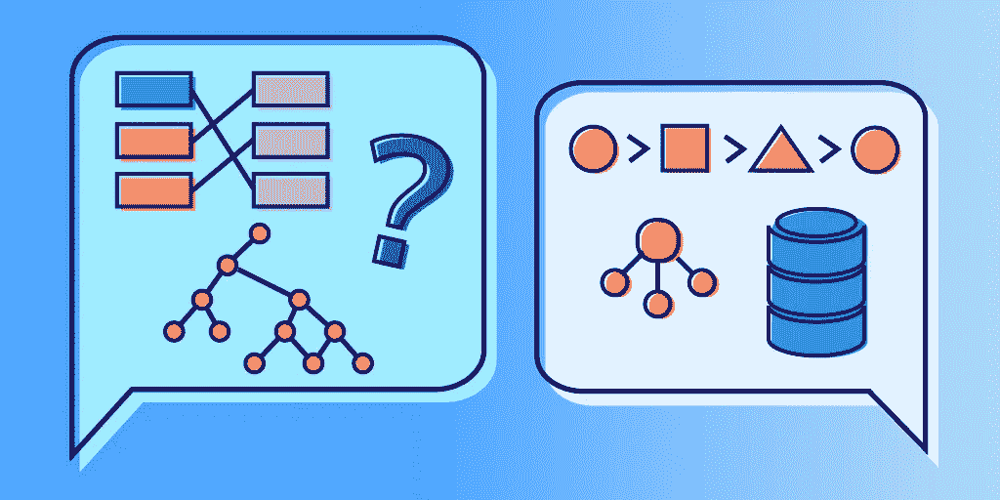
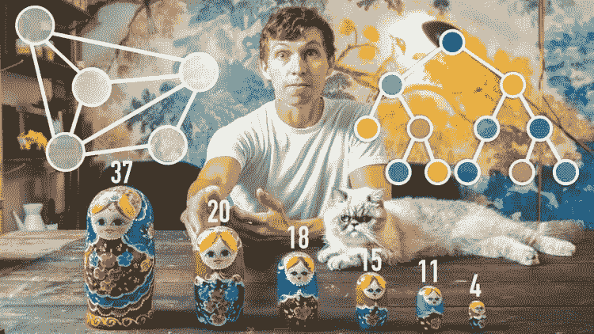
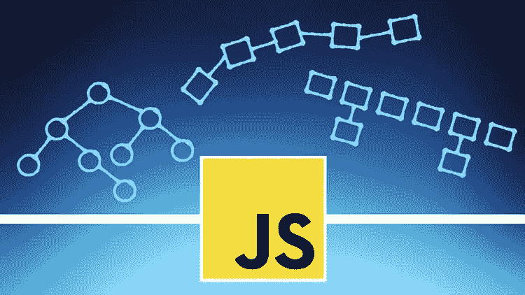

# 6 2023 年最佳 JavaScript 数据结构和算法初学者在线课程

> 原文：<https://medium.com/javarevisited/6-best-data-structure-and-algorithms-courses-for-javascript-developers-c35e23236165?source=collection_archive---------0----------------------->

## 我最喜欢的用 JavaScript 学习数据结构和算法的在线课程。

image_Credit — educative.io

伙计们，如果你是一名学习数据结构和算法的 JavaScript 开发人员，并且正在寻找学习 JavaScript 中的算法和数据结构的最佳在线课程，那么你来对地方了。以前我分享过[**免费课学习 JavaScript**](https://www.java67.com/2018/04/top-5-free-javascript-courses-to-learn.html) 和 [**数据结构算法**，](https://www.java67.com/2019/02/top-10-free-algorithms-and-data.html)今天我就分享一下学习数据结构和算法最好的课程。

这些课程是由像柯尔特·斯蒂尔、安德烈·尼戈伊和斯蒂芬·格里德这样的专家导师创建的，受到了成千上万开发人员的信任。它们也很实惠，尤其是你只需花 10 美元就能在 Udemy 上买到的 Udemy 课程，这种活动时有发生。

数据结构是[编程](/javarevisited/6-best-online-courses-to-learn-functional-programming-in-java-for-beginners-1dab627b63ca)最重要的部分之一。每一种主要的编程语言都有数据结构。但是什么是数据结构，为什么它们是必不可少的？

简单来说，[数据结构](/hackernoon/10-data-structure-algorithms-and-programming-courses-to-crack-any-coding-interview-e1c50b30b927)是一种存储和高效组织数据的方式。它们有助于保存和管理数据，这就是它们重要的原因。

数据要小心处理。数据结构在处理数据方面非常出色。编程中有各种各样的数据结构。[链表](https://javarevisited.blogspot.com/2017/07/top-10-linked-list-coding-questions-and.html)、[二叉树](/javarevisited/20-binary-tree-algorithms-problems-from-coding-interviews-c5e5a384df30)、[栈](https://javarevisited.blogspot.com/2017/03/difference-between-stack-and-queue-data-structure-in-java.html#axzz5dxZIUUxy)和[队列](https://www.java67.com/2013/08/ata-structures-in-java-programming-array-linked-list-map-set-stack-queue.html)是最常用的数据结构。

所有编程语言中所有数据结构的概念都是一样的。数据结构总是被认为是一个挑战，因为它们需要适当的关注和指导。程序员应该通过实践正确理解每个数据结构的工作原理。

而且， [**数据结构**](https://www.java67.com/2013/08/ata-structures-in-java-programming-array-linked-list-map-set-stack-queue.html) 是求职面试中被问得最多的话题之一。因此，在本文中，我们将列出来自 Udemy、Pluralsight、 [Educative](https://www.educative.io/subscription?affiliate_id=5073518643380224) 、 [ZTM 学院](https://academy.zerotomastery.io/a/aff_fvgz1fnn/external?affcode=441520_zytgk2dn)以及其他热门网站的*六大最佳在线课程*，帮助您学习和理解 JavaScript 中的数据结构。

# 2023 年学习 JavaScript 中数据结构和算法的 6 门最佳课程

以下是学习 JavaScript 中数据结构和算法的最佳课程列表。该列表包括学习数据结构和算法的综合课程和速成课程。它们是由像柯尔特·斯蒂尔、安德烈·尼戈伊、斯蒂芬·格里德这样的专家创作的，并从像 Udemy、T2、ZTM 学院和 Eduonix 这样的网站上挑选出来的。

成千上万的开发人员已经加入了这些课程，从零开始学习数据结构和算法，提高自己的知识，你也可以这样做。

## 1.柯尔特·斯蒂尔的 JavaScript 算法和数据结构大师课

这是为那些想学习 JavaScript 中的数据结构、排序算法、搜索算法以及其他与数据结构相关的概念的人开设的课程。

此外，这门课程也是为那些想学习如何在工作面试中处理数据结构问题的人开设的。总的来说，这门课什么都有，从数据结构实现到工作面试问题。

此外，我必须说，科尔特钢铁是一个伟大的导师，他使学习充满乐趣和吸引力。参加了他著名的[**web 开发人员训练营**](https://click.linksynergy.com/deeplink?id=JVFxdTr9V80&mid=39197&murl=https%3A%2F%2Fwww.udemy.com%2Fcourse%2Fthe-web-developer-bootcamp%2F) 课程后，我很快就加入了这个课程，我一点也不失望。

要求

*   JavaScript 的基础知识

这是一个庞大的课程，总视频内容将近二十二个小时。因此，如果你准备深入研究这些概念，这个课程非常适合你。

如果你也想在 javascript 中以有趣的方式学习数据结构，那么我强烈推荐这门课程。

**这是加入本课程的链接** — [JavaScript 算法和数据结构大师班](https://click.linksynergy.com/deeplink?id=JVFxdTr9V80&mid=39197&murl=https%3A%2F%2Fwww.udemy.com%2Fcourse%2Fjs-algorithms-and-data-structures-masterclass%2F)

## 2.[JavaScript 中编码采访的数据结构](https://www.educative.io/courses/data-structures-coding-interviews-javascript?affiliate_id=5073518643380224)【教育性】

这是学习编码面试用 JavaScript 的数据结构最好的课程之一。这与列表中提到的其他课程不同，因为它是 Educative 的一门基于文本的交互式课程，Educative 是一个新的在线平台，允许您直接在浏览器中运行代码。

这意味着你不需要下载任何软件或建立自己的环境；你可以在你的浏览器中运行代码。这样就带走了最初的主要，加速了学习。

本课程涉及的数据结构有[数组](/javarevisited/20-array-coding-problems-and-questions-from-programming-interviews-869b475b9121)，列表，堆栈，队列，[链表](/javarevisited/top-20-linked-list-coding-problems-from-technical-interviews-90b64d2df093)，字典，集合，哈希映射，[二叉树](/javarevisited/20-binary-tree-algorithms-problems-from-coding-interviews-c5e5a384df30)，以及图形。此外，还有单独的部分用于排序和搜索算法。

要求

JavaScript 基础知识

本课程包含所有常见数据结构的详细回顾。它在 JavaScript 中提供了实现级的细节，让初学者能够很好地掌握所有不同的数据结构，以便编写更好的代码！

**这里是加入本课程的链接** — [用 JavaScript 编写面试的数据结构](https://www.educative.io/courses/data-structures-coding-interviews-javascript?affiliate_id=5073518643380224)

而且，如果你喜欢教育平台和他们的互动课程，比如探索系统设计面试，探索面向对象编程面试，那么考虑购买 [**教育订阅**](https://www.educative.io/subscription?affiliate_id=5073518643380224) ，每月只需 14.99 美元就可以访问他们的 250 多门课程。非常划算，非常适合准备编码面试。

<https://www.educative.io/subscription?affiliate_id=5073518643380224>  

## 3.Andrei Negaoie[精通编码访谈:数据结构+算法](https://academy.zerotomastery.io/p/master-the-coding-interview-data-structures-algorithms?affcode=441520_zytgk2dn)

这是从编码面试角度学习数据结构和算法最好的课程之一。本课程涵盖的数据结构是数组、链表、栈、队列、树、散列图和图。讲师 Andrei Negaoie 很好地解释了每一种数据结构，并举例说明了如何执行各种操作。这是一门很长的课程，总共有十四个小时的内容。所以如果你想详细学习数据结构，去上这门课。

需求
JavaScript 基础知识

如果你想深入学习数据结构和编码面试的算法，学习 JavaScript 中所有主要的数据结构，那么 ZTM 学院的《掌握编码面试:数据结构+算法》是一个完美的选择。

**这里是加入本课程的链接** — [掌握编码面试:数据结构+算法](https://academy.zerotomastery.io/p/master-the-coding-interview-data-structures-algorithms?affcode=441520_zytgk2dn)

顺便说一下，你需要一个 [**ZTM 会员**](https://academy.zerotomastery.io/p/academy?affcode=441520_zytgk2dn) 才能观看这门课程，每月费用约 29 美元，并提供许多超级迷人和实用的课程，如他的 Python 和 JavaScript 面试课程。

<https://academy.zerotomastery.io/a/aff_c0gnlvf7/external?affcode=441520_zytgk2dn>  

如果你像我一样是一个不断学习的人，我建议你去申请会员资格，而不是购买一门课程，你会节省金钱并使学习变得容易，因为你不需要每次想学习新东西时都购买课程。

## 4.Stephen Grider 的《编码面试训练营:算法+数据结构》

这是另一门评价很高的 Udemy 课程，学习 JavaScript 中的数据结构和算法。

如前所述，数据结构是求职面试中被问得最多的话题之一。数据结构很难学，在工作面试中被问到时就更难了。

此外，我必须说斯蒂芬是最好的 Udemy 导师之一；参加了他的 [**Modern React 和 Redux**](https://click.linksynergy.com/fs-bin/click?id=JVFxdTr9V80&subid=0&offerid=323058.1&type=10&tmpid=14538&RD_PARM1=https%3A%2F%2Fwww.udemy.com%2Freact-redux%2F) 课程后，我毫不犹豫地检查了这个，我很高兴我这样做了。

通过 Udemy 的“[编码面试训练营:算法+数据结构”](https://click.linksynergy.com/deeplink?id=JVFxdTr9V80&mid=39197&murl=https%3A%2F%2Fwww.udemy.com%2Fcourse%2Fcoding-interview-bootcamp-algorithms-and-data-structure%2F)课程，你将为任何关于 JavaScript 中数据结构的问题做好充分准备。讲师通过示例和编码挑战关注访谈中提出的问题。

要求

*   JavaScript 的基础知识

超过 62，000 名学生注册了这门课程，使它成为最受欢迎的 JavaScript 数据结构课程之一。这是一门综合课程，共有十三个小时的视频内容。

**这是加入本课程** — [编码面试训练营:算法+数据结构](https://click.linksynergy.com/deeplink?id=JVFxdTr9V80&mid=39197&murl=https%3A%2F%2Fwww.udemy.com%2Fcourse%2Fcoding-interview-bootcamp-algorithms-and-data-structure%2F)的链接

## 5.[从零开始学习 JavaScript 中的数据结构](https://click.linksynergy.com/deeplink?id=JVFxdTr9V80&mid=39197&murl=https%3A%2F%2Fwww.udemy.com%2Fcourse%2Flearning-data-structures-in-javascript-from-scratch%2F)

这是 Udemy 学习 JavaScript 数据结构最好的课程之一。在本课程中，讲师将重点介绍三种基本的数据结构—链表、二叉查找树和哈希表。

链表和二叉查找树是最流行的数据结构。

讲师用合适的例子深入讲解这两种数据结构。[哈希表](https://javarevisited.blogspot.com/2018/11/top-5-data-structures-and-algorithm-online-courses.html)是一种高级数据结构。它很好地解释了如何在 JavaScript 中创建和使用哈希表。

要求
JavaScript 基础知识

这是一门初级课程，总视频内容将近四个小时。如果你因为某种原因无法与柯尔特·斯蒂尔或斯蒂芬·格里德取得联系，你可以试试这门课。这是 Udemy 上另一门评价最高的算法课程。

**这是参加 DSA 课程的链接**——[从零开始学习 JavaScript 中的数据结构](https://click.linksynergy.com/deeplink?id=JVFxdTr9V80&mid=39197&murl=https%3A%2F%2Fwww.udemy.com%2Fcourse%2Flearning-data-structures-in-javascript-from-scratch%2F)

## 更多选项

这里还有两门课程值得一试，以深入学习数据结构和算法

1.  [**coures ra 上的数据结构和算法特殊化**](https://coursera.pxf.io/c/3294490/1164545/14726?u=https%3A%2F%2Fwww.coursera.org%2Fspecializations%2Fdata-structures-algorithms)
2.  TBD(欢迎提建议)

以上就是针对 JavaScript 程序员的**最佳数据结构和算法课程**。如果你想成为一名 JavaScript 高手，你必须学习并正确理解数据结构。它们对求职面试也至关重要。

在本文中，我们列出了帮助您理解 JavaScript 中的数据结构的前五门课程。此外，这些课程中的一些也将为你的工作面试做准备。这些课程选自著名的教育网站。所以，仔细阅读每一条，然后做出相应的选择。

其他**你可能喜欢的编程资源**

*   [10 门免费学习数据结构和算法的课程](/javarevisited/top-10-free-data-structure-and-algorithms-courses-for-beginners-best-of-lot-ad807cc55f7a)
*   [编程/编码工作面试 10 门课程](http://javarevisited.blogspot.sg/2018/02/10-courses-to-prepare-for-programming-job-interviews.html)
*   [程序员 75+编码面试问题](http://www.java67.com/2018/05/top-75-programming-interview-questions-answers.html)
*   [来自访谈的 30 多个基于阵列的问题](https://javarevisited.blogspot.com/2015/06/top-20-array-interview-questions-and-answers.html)
*   [30+基于链接列表的 Java 面试问题](https://javarevisited.blogspot.com/2017/07/top-10-linked-list-coding-questions-and.html)
*   [搜索算法——书评](https://javarevisited.blogspot.com/2017/10/grokking-algorithms-by-aditya-bhargava-best-beginner-book.html)
*   [来自面试的 21 个字符串编程问题](http://www.java67.com/2018/04/21-string-programming-and-coding-interview-questions-answers.html)
*   [10 门数据结构与算法课程面试](https://hackernoon.com/10-data-structure-algorithms-and-programming-courses-to-crack-any-coding-interview-e1c50b30b927)
*   [面试中常见的 50 个编码问题](/hackernoon/50-data-structure-and-algorithms-interview-questions-for-programmers-b4b1ac61f5b0)
*   [如何解决基于场景的算法面试问题](https://javarevisited.blogspot.com/2017/03/2-practical-data-structure-algorithm-interview-questions-java.html)
*   [面向程序员的五大数据结构和算法书籍](https://javarevisited.blogspot.com/2015/07/5-data-structure-and-algorithm-books-best-must-read.html)
*   [100+编码问题和几个编码面试小技巧](https://codeburst.io/100-coding-interview-questions-for-programmers-b1cf74885fb7)
*   [7 门深入学习数据结构和算法的最佳课程](/javarevisited/7-best-courses-to-learn-data-structure-and-algorithms-d5379ae2588?source=---------18------------------)
*   [10 门免费数据结构与算法课程](/javarevisited/top-10-free-data-structure-and-algorithms-courses-for-beginners-best-of-lot-ad807cc55f7a?source=collection_home---4------0-----------------------)
*   [程序员 25 个系统设计面试问题](/javarevisited/25-software-design-interview-questions-to-crack-any-programming-and-technical-interviews-4b8237942db0)
*   [学习软件架构的前 5 门课程](https://javarevisited.blogspot.com/2019/03/5-courses-programmers-can-join-to-learn.html)

感谢您阅读本文。如果你喜欢这些*最好的 JavaScript 算法和数据结构在线课程*，请分享给你的朋友和同事。如果您有任何问题或反馈，请留言。

**P. S.** —如果你热衷于学习 JavaScript 中的数据结构和算法，但正在寻找免费的在线课程，那么你也可以在 Udemy 上查看这个 [**真实世界中的数据结构和算法——第 1 部分**](https://click.linksynergy.com/deeplink?id=JVFxdTr9V80&mid=39197&murl=https%3A%2F%2Fwww.udemy.com%2Fcourse%2Fdata-structures-and-algorithms-in-real-world-part-1%2F) 免费课程。它是完全免费的，你只需要一个 Udemy 账号就可以加入这个课程。

</javarevisited/top-10-free-data-structure-and-algorithms-courses-for-beginners-best-of-lot-ad807cc55f7a> 