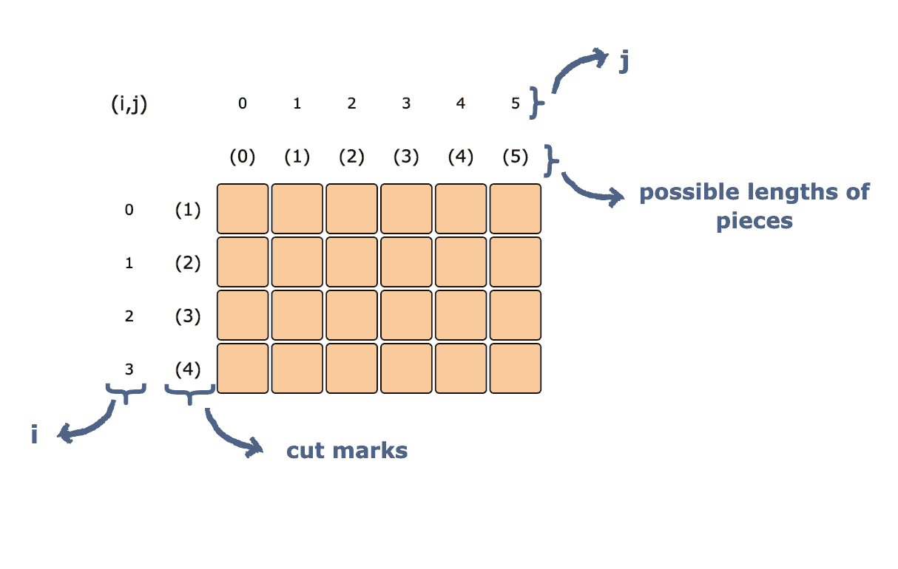
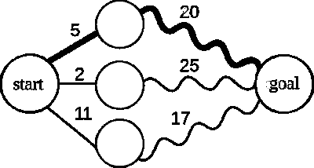
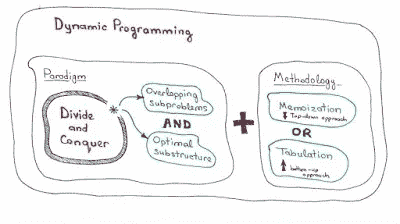

# 2023 年编码面试的 6 门最佳动态编程课程

> 原文：<https://medium.com/javarevisited/6-best-dynamic-programming-courses-for-coding-interviews-14744060923c?source=collection_archive---------0----------------------->

## 这些是 2023 年 Udemy，Educative，Coursera 学习面试动态编程最好的课程。

image_credit —教育性

大家好，如果你想学习**动态编程**，一种解决复杂编码问题的有用技术，并寻找最好的动态编程课程，那么你来对地方了。前面我已经分享过 [**最好的数据结构与算法课程**](/javarevisited/7-best-courses-to-learn-data-structure-and-algorithms-d5379ae2588?source=---------18------------------) 和一些[编码问题](/hackernoon/50-data-structure-and-algorithms-interview-questions-for-programmers-b4b1ac61f5b0)用于面试，今天我要分享的是学习动态编程最好的在线课程。

如果你正在找工作并接受面试，那么你可能已经注意到，得到一份软件开发的工作变得越来越难了。

例如，曾经有一段时间，你只要知道核心的 Java 概念，如[字符串](/javarevisited/top-21-string-programming-interview-questions-for-beginners-and-experienced-developers-56037048de45)、[集合](/javarevisited/50-java-collections-interview-questions-for-beginners-and-experienced-programmers-4d2c224cc5ab)、[多线程](/javarevisited/6-multithreading-and-concurrency-books-every-java-programmer-should-read-b6a08d2aae54)等，就可以获得一个 Java 开发人员的职位，但现在已经不是了。

当时肯定有一些关于[数据结构](https://www.java67.com/2018/06/data-structure-and-algorithm-interview-questions-programmers.html)和[算法](https://www.java67.com/2019/07/top-10-online-courses-to-learn-data-structure-and-algorithms-in-java.html)甚至关于动态编程的问题，但焦点总是在编程语言专业知识上，如 [Java](https://javarevisited.blogspot.com/2018/05/top-5-java-courses-for-beginners-to-learn-online.html) 或 [Python](https://javarevisited.blogspot.com/2018/03/top-5-courses-to-learn-python-in-2018.html) 。但是，现在情况完全变了，重点越来越放在候选人解决编码问题的能力上。每个公司现在都有一个艰难的编码测试，如果没有通过，你将无法进入常规的面试，在那里你在编程语言方面的专业知识将得到测试。

在这些编码测试中，一些最困难的问题来自动态编程，尤其是对于像[微软](https://javarevisited.blogspot.com/2015/12/30-microsoft-interview-questions-for-software-development-engineers.html)、[亚马逊](https://javarevisited.blogspot.com/2016/01/top-20-amazon-and-google-programming-interview-questions.html)、苹果[、谷歌](https://javarevisited.blogspot.com/2012/01/google-interview-questions-answers-top.html)、脸书这样的科技巨头，许多程序员都在努力解决这个问题。

从我自己的经验来看，我可以说理解动态编程算法是艰难的，你需要大量的练习来掌握它的窍门。但是，仅仅练习是不够的；你需要学习一些技巧来解决那些 [*动态编程问题*](https://javarevisited.blogspot.com/2021/03/top-dynamic-programming-problems-for-coding-interviews.html) ，而学习那些技巧和方法的最好方法就是阅读好的[书籍](https://javarevisited.blogspot.com/2015/07/5-data-structure-and-algorithm-books-best-must-read.html)或者加入优秀的[在线课程](/javarevisited/top-10-free-data-structure-and-algorithms-courses-for-beginners-best-of-lot-ad807cc55f7a)。

前几天，我的一个读者问我关于**背包问题**和最长子序列问题，两个最流行的*动态规划问题，*和**如何解决动态编码问题**，由于我已经很久没有接触这个话题了，我不得不做一些研究。

作为我研究的一部分，我偶然发现了一些有用的资源来学习和*掌握动态编程*，我今天将与你们分享这些资源，以及一些解决动态编程问题的有用技巧，但在此之前，让我们了解一下**什么是动态编程？**看看一些可以使用动态编程解决的编码问题。

 [## 探索编码面试的动态编程模式——交互式学习

### 事实是，动态编程(DP)问题可能是编码面试中最令人生畏的问题。即使当…

www.educative.io](https://www.educative.io/collection/5668639101419520/5633779737559040?affiliate_id=5073518643380224) 

## 什么是动态编程(DP)？

动态规划(DP)是一种算法技术，通过将其分解为更简单的子问题，并利用较大问题的最优解取决于其较小子问题的最优解的事实，来解决较大且困难的问题。

动态规划问题的一个最简单的例子是[斐波那契数列](https://www.java67.com/2019/03/nth-fibonacci-number-in-java-coding.html)，因为它可以通过解决两个更小的子问题(即`Fib(n-1) and Fib(n-2)`)来解决问题(即 `Fib(n)`)。

动态规划问题的另一个流行例子是[背包问题](https://en.wikipedia.org/wiki/Knapsack_problem)，它测试你在给定约束条件下找到最优解的能力。

事实是，在实际的[编码面试中，动态编程(DP)问题可能是最令人生畏的。即使很明显一个问题可以用动态编程来解决(这也是困难的)，甚至知道从哪里开始解决也是一个挑战。除非你受过解决动态编程问题的训练。

现在我们知道了什么是动态编程，并且知道了使用动态编程可以解决什么类型的问题，让我们来看看一些](https://javarevisited.blogspot.com/2020/04/5-essential-skills-to-crack-coding-interviews.html)[在线课程](https://javarevisited.blogspot.com/2019/12/top-5-courses-to-learn-dynamic-programming-for-interivews.html)，它们将训练你如何使用动态编程。

 [## 探索编码面试的动态编程模式——交互式学习

### 事实是，动态编程(DP)问题可能是编码面试中最令人生畏的问题。即使当…

www.educative.io](https://www.educative.io/collection/5668639101419520/5633779737559040?affiliate_id=5073518643380224) 

# 2023 年学习动态编程的 6 门课程

以下是 2023 年学习动态编程的最佳在线课程列表。这些在线课程选自 Udemy、Educative、Pluralsight 等网站，由专家创建，受到成千上万开发者的信任。

这些在线课程简单易懂地解释了一些著名的基于动态编程的编码问题，这将有助于您学习如何处理和解决这些问题。

他们还分享了一些提示，以确定是否可以使用动态编程来解决问题。

## 1.[动态编程— I](https://click.linksynergy.com/deeplink?id=JVFxdTr9V80&mid=39197&murl=https%3A%2F%2Fwww.udemy.com%2Fcourse%2Fdynamic-programming-i%2F)

如果你在努力解决动态规划问题，特别是确定一个问题是否可以用动态规划来解决，然后把它分解成子问题，那么这个课程就是为你准备的。

在本课程中，您将学习什么是动态编程，使用动态编程解决问题时有哪些重要步骤，以及如何解决问题。

课程结构很好，有很多例子，比如最长递增子序列、[斐波那契数列](https://javarevisited.blogspot.com/2015/01/print-fibonacci-series-in-java-using.html)、通往天堂的阶梯、范围之和等。教你动态编程，我敢打赌，你需要所有这些来让这个概念进入你的头脑。这门课程最棒的部分是他们的作业和测验，这给你一个机会去运用你大脑中的思考部分。除非你自己思考，否则你不会理解动态编程，这些测验将帮助你更深层次地理解这个问题。

**这里是加入本课程** — [动态编程— I](https://click.linksynergy.com/deeplink?id=JVFxdTr9V80&mid=39197&murl=https%3A%2F%2Fwww.udemy.com%2Fcourse%2Fdynamic-programming-i%2F) 的链接

谈到社交证明，已经有超过 5500 名学生信任它，它平均得到了近 270 名参与者的 4.5 分，这是令人惊讶的。如果你想从零开始学动态编程，我强烈推荐你这门课。

## 2.[掌握编码面试:数据结构+算法](https://academy.zerotomastery.io/p/master-the-coding-interview-data-structures-algorithms?affcode=441520_zytgk2dn)

这是一门非常好的课程，不仅可以学习动态编程，还可以学习破解编码面试所需的所有主题。在本课程中，您不仅将学习如何当场解决编码挑战，还将学习如何处理面试官提出的关于复杂性和改进的棘手问题。

该课程还包括一个针对计算机科学问题的快速入门营，这些问题涉及数据结构、T2 算法、位操作和并发性。总的来说，准备软件工作面试的一个完整的包。

这是你的终极编码面试训练营。获得更多的工作机会，协商加薪:获得你想要的工作所需要的一切你都将在本课程中学到。不仅仅是技术和编码技能，还有谈判，这可以很容易地使 10K 在你的最终报价 3 万英镑。

**这里是加入本课程的链接** — [**掌握编码面试:数据结构+算法**](https://academy.zerotomastery.io/p/master-the-coding-interview-data-structures-algorithms?affcode=441520_zytgk2dn)

你可以在 Andrei Neagoie 自己的编码学校[零到精通](https://academy.zerotomastery.io/p/academy?affcode=441520_zytgk2dn)上参加这个课程，他的所有课程(Python、JavaScript、算法、Deno)都可以在一个订阅下获得。

当然，如果你喜欢 Andrei 的教学风格和质量，我强烈推荐订阅该课程，它不仅具有 264 美元的年成本效益，还可以免费访问他们添加到平台的所有未来课程。

**这里是参加零起点大师学院**——[编程大师面试](https://academy.zerotomastery.io/p/master-the-coding-interview-data-structures-algorithms?affcode=441520_zytgk2dn)课程的链接

 [## 掌握编码面试:数据结构+算法

### 2023 年更新！我们保证这是你能找到的最好的编码面试准备课程，如果你…

academy.zerotomastery.io](https://academy.zerotomastery.io/p/master-the-coding-interview-data-structures-algorithms?affcode=441520_zytgk2dn) 

## 3.[贪婪算法和动态规划](https://coursera.pxf.io/c/3294490/1164545/14726?u=https%3A%2F%2Fwww.coursera.org%2Flearn%2Falgorithms-greedy)

如果你是 Coursera 的粉丝，正在 Coursera 中寻找学习动态编程的好课程，那么你应该看看这个。在本课程中，您不仅将学习动态编程，还将学习贪婪算法、解决编码问题的其他有用技术以及一些流行的算法，如最小生成树。

本课程是 [**算法专门化**](https://www.coursera.org/specializations/algorithms) **的一部分，它**涵盖了背包、序列比对、最优搜索树等常见的动态规划问题和技术。

**这是加入本课程** — [贪婪算法、最小生成树和动态规划](https://coursera.pxf.io/c/3294490/1164545/14726?u=https%3A%2F%2Fwww.coursera.org%2Flearn%2Falgorithms-greedy)的链接

而且，如果你觉得 Coursera 的专业化和认证有用，特别是来自 Google、AWS 和 IBM 的认证，那么我建议你加入 Coursera Plus 的**，这是 Coursera 的一个很好的订阅计划，让你可以无限制地访问他们最受欢迎的课程、专业化、专业证书和指导项目。它每年花费大约 399 美元，但是它完全值得你的钱，因为你得到了无限的证书。**

** [## Coursera Plus |无限制访问 7，000 多门在线课程

### 用 Coursera Plus 投资你的职业目标。无限制访问 90%以上的课程、项目…

coursera.pxf.io](https://coursera.pxf.io/c/3294490/1164545/14726?u=https%3A%2F%2Fwww.coursera.org%2Fcourseraplus)** 

## **4.[动态编程简介](https://click.linksynergy.com/deeplink?id=JVFxdTr9V80&mid=39197&murl=https%3A%2F%2Fwww.udemy.com%2Fcourse%2Fdynamic-programming%2F)**

**这是从 Udemy 学习动态编程的另一个很棒的课程。我第一次遇到这个课程是在寻找一个问题的解决方案时，这个问题是在一次大银行的采访中问我的一个读者的，这个问题就是***爬楼梯问题****。

如果你是[编码面试](https://dev.to/javinpaul/101-coding-problems-and-few-tips-to-crack-your-next-programming-interviews-402a)的常客，你可能以前见过这个问题。问题定义很简单，你可以一次爬 1 级或者 2 级楼梯，N 级楼梯有多少种不同的爬法，法鲁克·亚瑟给出的解决方案真的让我大吃一惊。这并不是一门有很多动画来教你概念的时髦课程，但这门课程的讲师法鲁克解释说，解决方案会有所不同。

也是为数不多的几门课程，解决了几乎所有著名的动态规划问题，如爬楼梯、切路、入室抢劫、买卖股票的最佳时间、0/1 背包问题、最长公共子序列问题、最长公共子串问题。如果你正在寻找解决这些问题的方法，那么这个课程就是为你准备的。

我也建议你*看几个这门课的预习，*其实爬楼梯问题在预习本身就解决了，如果你觉得法鲁克的授课风格很棒，可以加入这门课。***

*****这里是加入本课程的链接** — [动态编程简介](https://click.linksynergy.com/deeplink?id=JVFxdTr9V80&mid=39197&murl=https%3A%2F%2Fwww.udemy.com%2Fcourse%2Fdynamic-programming%2F)***

******

## ***5.掌握动态编程的艺术***

***如果你像我一样喜欢 Udemy 课程，这是另一个学习动态编程技术的好课程。它涵盖了诸如编辑距离、正则表达式匹配、创建一个[字符串回文](http://www.java67.com/2015/06/how-to-check-is-string-is-palindrome-in.html)的最小删除以及最长递增子序列等问题。这门课程还会教你递归和回溯，这是解决编码问题的两种重要技术。最棒的是他深入讲解了解决方案。本课程还涵盖了 CLRS 书籍 中的示例，您可以参考这些示例来了解更多概念。***

***最重要的是，Ajay 解释如何从识别到公式化处理动态编程问题的方式非常棒。***

***他还将问题分为两类:一维动态规划问题和二维动态规划问题。***

*****这里是加入本课程的链接**——[掌握动态编程的艺术](https://click.linksynergy.com/deeplink?id=JVFxdTr9V80&mid=39197&murl=https%3A%2F%2Fwww.udemy.com%2Fcourse%2Fmaster-the-art-of-dynamic-programming%2F)***

******

## ***6.[探索编码面试的动态编程模式](https://www.educative.io/collection/5668639101419520/5633779737559040?affiliate_id=5073518643380224)***

***这是我最喜欢的学习动态编程的课程，它来自一个叫做 Educative 的新的在线学习平台。***

***你可能还不知道，但是教育性的，一个新的互动在线学习平台有一些最好的编程面试准备课程。我已经讲过他们最好的课程之一——[钻研系统设计面试](https://www.educative.io/collection/5668639101419520/5649050225344512?affiliate_id=5073518643380224)，这是另一个瑰宝。这门课程是从零开始的，心中只有一个目标——如何解决动态编程问题。它将为您提供一套易于理解的技术来处理任何基于 DP 的编码问题。

不仅仅是让你试着记忆解决方案，你还将经历五种潜在的 DP 模式，然后应用它们来解决 *35+动态编程问题*。在每个模式中，你将首先学习一个递归的强力解决方案，这实际上是开始解决一个 DP 问题的最好方法。一旦你理解了递归解，你将学习如何应用记忆和制表(使用网格)的高级动态编程技术。***

*****这里是加入本课程的链接** — [探索编码面试的动态编程模式](https://www.educative.io/collection/5668639101419520/5633779737559040?affiliate_id=5073518643380224)***

******

***和前面的课程一样，本课程也涵盖了你将在编码面试中看到的大多数常见的动态编程问题。练习题也给你机会应用你在课程中学到的模式。如果你喜欢交互式阅读，这是学习动态编程的最佳课程。***

***顺便说一句，如果你正在准备编码面试，我强烈推荐参加 [**教育性订阅**](https://www.educative.io/subscription?affiliate_id=5073518643380224) ，它将不仅为你提供这门课程，还提供许多其他有用的课程来破解你的编码面试，比如[探索编码面试模式](https://www.educative.io/collection/5668639101419520/5671464854355968?affiliate_id=5073518643380224)。每月只需 18 美元，非常值得。***

*** [## 介绍:教育性订阅。获得无限制的访问权限！

### Educative 提供编程和编码面试准备课程，涵盖几乎每一个框架，语言，和…

www.educative.io](https://www.educative.io/subscription?affiliate_id=5073518643380224) 

这就是学习动态编程的一些最好的课程。我说过，DP 是编码面试的题目，大部分棘手的问题都来自动态编程。忽视动态编程是不明智的，尤其是如果你真的想得到你一直想要的工作。

动态编程在[人工智能](https://javarevisited.blogspot.com/2019/10/top-5-courses-to-learn-artificial-intelligence-AI.html)中也有用途，它还能提升你解决问题的能力，这意味着你最好在下一次编程面试之前花些时间学习动态编程。

其他**编程资源**您可能想查看

*   [10 数据结构与编程课程面试](/hackernoon/10-data-structure-algorithms-and-programming-courses-to-crack-any-coding-interview-e1c50b30b927?source=user_profile---------8-----------------------)
*   [2023 年 React 开发者路线图](https://javarevisited.blogspot.com/2018/10/the-2018-react-developer-roadmap.html)
*   [2023 年学习 Python 的十大课程](/better-programming/top-5-courses-to-learn-python-in-2018-best-of-lot-26644a99e7ec)
*   [面向 Java 和 DevOps 工程师的 5 门免费 Docker 课程](http://www.java67.com/2018/02/5-free-docker-courses-for-java-and-DevOps-engineers.html)
*   [101 个编码问题和一些面试技巧](https://dev.to/javinpaul/101-coding-problems-and-few-tips-to-crack-your-next-programming-interviews-402a)
*   [学习 Java 编程的 5 门免费课程](https://javarevisited.blogspot.com/2018/05/top-5-java-courses-for-beginners-to-learn-online.html)
*   [破解编程面试的 10 门课程](https://javarevisited.blogspot.com/2018/02/10-courses-to-prepare-for-programming-job-interviews.html#axzz5oeVu3CYQ)
*   [2023 年学习 Swift 编程的前 5 门课程](https://javarevisited.blogspot.com/2019/01/top-5-ios-developer-course-to-learn-ios.html)
*   [2023 年学习 Spring Boot 的 10 门课程](/javarevisited/top-10-courses-to-learn-spring-boot-in-2020-best-of-lot-6ffce88a1b6e)
*   [50+数据结构与算法面试题](https://hackernoon.com/50-data-structure-and-algorithms-interview-questions-for-programmers-b4b1ac61f5b0)
*   [2023 年学习 C 编程的前 5 门课程](https://javarevisited.blogspot.com/2019/11/top-5-courses-to-learn-c-programming-in.html)
*   [2023 年学习 JavaScript 的 15 门最佳课程](/javarevisited/10-best-online-courses-to-learn-javascript-in-2020-af5ed0801645)
*   [我最喜欢的学习网页开发的课程](/better-programming/my-5-favorite-courses-to-learn-web-development-in-2019-a5e74167f8b2)

感谢到目前为止阅读这篇文章；如果你喜欢这些动态编程课程，那么请分享给你的朋友和同事。如果您有任何问题或反馈，请留言。

**p . s .——**如果你喜欢书，我也建议你看看 Aditya Bhargava 的[**Grokking Algorithms**](https://www.amazon.com/Grokking-Algorithms-illustrated-programmers-curious/dp/1617292230/?tag=javamysqlanta-20)。到目前为止，他对背包问题的解释是我所见过的最好和最详细的。

 [## 搜索算法:程序员和其他好奇者图解指南

### 搜索算法:亚马逊网站上为程序员和其他好奇者提供的图解指南

浅黄色](https://buff.ly/3obss22)***