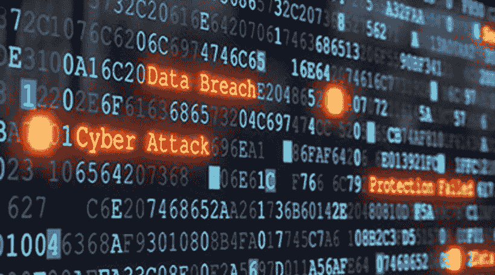
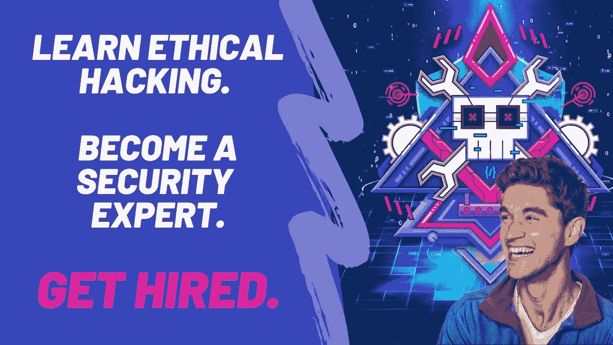

# 2023 年学习道德黑客的 6 门最佳在线课程

> 原文：<https://medium.com/javarevisited/6-best-ethical-hacking-courses-to-learn-online-fe1fe171d05?source=collection_archive---------1----------------------->

## 这些是我最喜欢的在线课程，在 2023 年从 Udemy，Coursera，Pluralsight 和 edX 在线学习道德黑客

image_credit —教育性

你好，伙计们，如果你想在 2023 年学习道德黑客，并寻找在线课程等最佳资源，那么你来对地方了。之前，我已经分享了 [**最佳网络安全课程**](/javarevisited/7-best-cyber-security-courses-for-programmers-and-developers-50afafae050b) **和 P** [**en 测试课程**](/javarevisited/10-free-courses-to-learn-ethical-hacking-and-penetration-testing-for-beginners-84e40104aa6c) **，**在这篇文章中，我为初学者和有经验的 IT 专业人士分享了*最佳道德黑客课程*。

如果你不知道，道德黑客是测试你的系统或网络的基础设施的漏洞，并找出其弱点，以关闭这些漏洞，使你的系统更安全的过程。

这是非常受欢迎的技能，有很多职业道德黑客的工作，因为公司，无论是大公司还是小公司，都在努力应对安全威胁，他们总是希望找到并消除他们可能存在的任何漏洞。

这个过程也被称为[渗透测试](https://javarevisited.blogspot.com/2020/07/top-5-courses-to-crack-comptia-pentest-certification-exam.html)，它不仅可以应用于计算机和网络，还可以应用于网站和云计算以及智能相机和汽车等物联网设备。

也许你有兴趣学习道德黑客，因为你点击了这篇文章，但作为一名白帽黑客的职业生涯可能有点困难，特别是对一些没有任何 it 背景的人来说，因为他们大多数人需要对网络以及硬件和许多其他东西有一点基本的了解。正如我所说，学习道德黑客可能很难，但选择正确的在线课程可能也很难，因为你会看到一些由业余爱好者而非专业人士创建的课程，这可能会误导你，所以我搜索了最佳课程，并在今天的文章中与你分享。

# 2023 年加入的 6 门最佳道德黑客在线课程

在不浪费你更多时间的情况下，这里有 2023 年从头开始学习道德黑客的最佳在线课程。你可以参加其中的一个或几个课程，在 2023 年成为一名道德黑客，开始你的职业生涯。

## 1.[从头开始学习道德黑客](https://click.linksynergy.com/deeplink?id=JVFxdTr9V80&mid=39197&murl=https%3A%2F%2Fwww.udemy.com%2Fcourse%2Flearn-ethical-hacking-from-scratch%2F)

有一点 it 行业的背景，并渴望学习道德黑客理论和实践，以及测试许多系统的安全性，如 windows 和网络和网站等，你是在正确的地方。

你从设置你的黑客环境开始，比如安装 Kali Linux 系统，然后学习 [Linux 基础知识](/javarevisited/7-best-linux-courses-for-developers-cloud-engineers-and-devops-in-2021-7415314087e1)并直接进入黑客网络和破解 WPA/WPA2 安全和黑客系统，比如使用许多不同的攻击，最后利用网站。

在本课程中，您将学到:

*   获得网络访问权。
*   利用 windows 系统。
*   黑客网站。

**这是加入本课程的链接**——[从头开始学习道德黑客](https://click.linksynergy.com/deeplink?id=JVFxdTr9V80&mid=39197&murl=https%3A%2F%2Fwww.udemy.com%2Fcourse%2Flearn-ethical-hacking-from-scratch%2F)

## 2.[完整的道德黑客课程](https://click.linksynergy.com/deeplink?id=JVFxdTr9V80&mid=39197&murl=https%3A%2F%2Fwww.udemy.com%2Fcourse%2Fpenetration-testing%2F)【Udemy】

另一个很棒的课程教你道德黑客，甚至没有任何技术背景的人，并从头开始教你如何安装环境和一些与黑客和信息技术相关的术语。

本课程从了解一些黑客术语和设置环境开始，然后学习如何在互联网上保护您的隐私，使用`Nmap`扫描网络，以及学习如何破坏网络安全，然后使用 SQL 注入攻击网站，最后创建您自己的键盘记录程序。以下是你将在本课程中学到的主要内容:

*   保护您的互联网隐私。
*   剥削 SQL 注入。
*   使用暴力破解密码。

**这里是加入本课程的链接**——[完整的道德黑客课程](https://click.linksynergy.com/deeplink?id=JVFxdTr9V80&mid=39197&murl=https%3A%2F%2Fwww.udemy.com%2Fcourse%2Fpenetration-testing%2F)

## 3.IBM 网络安全分析师

这是另一个很棒的课程，让你在没有道德黑客经验的情况下开始网络安全职业生涯，并成为一名网络安全分析师，学习收集信息，制造恶意软件、数据库漏洞以及 SQL 注入攻击。

这个 [Coursera 课程](https://coursera.pxf.io/c/3294490/1164545/14726?u=https%3A%2F%2Fwww.coursera.org%2Fprofessional-certificates%2Fibm-cybersecurity-analyst)从了解一些与网络安全相关的概念开始，然后学习如何使用许多操作系统的命令行，如 [Linux](/javarevisited/top-10-courses-to-learn-linux-command-line-in-2020-best-and-free-f3ee4a78d0c0) ，之后，你将学习网络和[数据库](/hackernoon/top-5-sql-and-database-courses-to-learn-online-48424533ac61)的漏洞，以及如何保护自己免受这些类型的攻击等等。

在本课程中，您将学到:

*   分析你的系统和网络。
*   剥削 SQL 注入。
*   做一个网络安全分析师。

**以下是参加本课程** — [IBM 网络安全分析师](https://coursera.pxf.io/c/3294490/1164545/14726?u=https%3A%2F%2Fwww.coursera.org%2Fprofessional-certificates%2Fibm-cybersecurity-analyst)的链接

顺便说一句，如果你觉得 Coursera 认证和课程有用，那么我建议你加入 Coursera Plus ，这是 Coursera 的一个订阅计划，让你无限制地访问他们最受欢迎的课程、专业、专业证书和指导项目。

<https://coursera.pxf.io/c/3294490/1164545/14726?u=https%3A%2F%2Fwww.coursera.org%2Fcourseraplus>  

## 4.[渗透测试和道德黑客](https://pluralsight.pxf.io/c/1193463/424552/7490?u=https%3A%2F%2Fwww.pluralsight.com%2Fcourses%2Fkali-linux-penetration-testing-ethical-hacking)【plural sight】

一个全面的课程，教你如何从零开始有效地使用 Kali Linux，直到你精通黑客技术，并一步一步地开始渗透测试，从信息收集到安全评估到利用。

本课程从在虚拟环境中安装 Kali Linux 开始，然后学习网站信息收集，然后利用这些信息，使用 Burpsuit 和许多其他工具攻击某个网站或服务，并学习网络扫描、黑客和社会工程等。

在本课程中，您将学到:

*   信息收集。
*   渗透测试。
*   社会工程。

**这是参加本课程的链接**——[渗透测试和道德黑客](https://pluralsight.pxf.io/c/1193463/424552/7490?u=https%3A%2F%2Fwww.pluralsight.com%2Fcourses%2Fkali-linux-penetration-testing-ethical-hacking)

顺便说一下，你需要一个 Pluralsight 会员才能参加这个课程，费用大约是每月 29 美元或每年 299 美元(14%的折扣)。我向所有程序员强烈推荐这个订阅，因为它提供了超过 7000 个在线课程的即时访问，以学习任何技术技能。或者，你也可以使用他们的 [**10 天免费通行证**](https://pluralsight.pxf.io/c/1193463/424552/7490?u=https%3A%2F%2Fwww.pluralsight.com%2Flearn) 免费观看这个课程。

<https://pluralsight.pxf.io/c/1193463/424552/7490?u=https%3A%2F%2Fwww.pluralsight.com%2Flearn>  

## 5.[网络安全基础](https://www.awin1.com/cread.php?awinmid=6798&awinaffid=631878&clickref=&p=%5B%5Bhttps%3A%2F%2Fwww.edx.org%2Fcourse%2Fnyux-cybersecurity-fundamentals) [ [edX](https://javarevisited.blogspot.com/2021/05/top-10-edx-courses-and-certificates-for.html) ]

该 edx 课程内容全面，为学生从事网络安全职业做准备，教授你在该领域开始工作所需的几乎一切，从信息收集到利用漏洞等等。

以下是您将在本课程中学到的主要内容:

*   安全原则。
*   网络安全。
*   发现漏洞。

首先介绍安全性和一些术语，如加密和身份验证，然后介绍网络以及黑客如何攻击它们，并了解 TLS/SSL 等互联网协议，最后学习枚举和渗透测试等黑客方法。

**以下是加入本课程的链接—** [网络安全基础知识](https://www.awin1.com/cread.php?awinmid=6798&awinaffid=631878&clickref=&p=%5B%5Bhttps%3A%2F%2Fwww.edx.org%2Fcourse%2Fnyux-cybersecurity-fundamentals)

## 6.[完整的道德黑客训练营 2023:零到精通](https://academy.zerotomastery.io/p/complete-ethical-hacking-bootcamp-zero-to-mastery?affcode=441520_zytgk2dn)

这是 2023 年从零开始学习道德黑客和渗透测试的最新课程之一。这个课程由 Andrei Neagoie 和他的团队创建，是开启你职业道德黑客生涯的绝佳选择。

以下是你将在本课程中学到的主要内容—

1.  从零开始的道德黑客&渗透测试的所有 5 个阶段
2.  Python 从零开始，这样你就能够为道德黑客编写你自己的工具
3.  设置您的黑客实验室:Kali Linux 和虚拟机(适用于 Windows/Mac/Linux)
4.  了解高级 Metasploit 框架用法
5.  创建额外的易受攻击的虚拟机器，我们可以在其上练习攻击
6.  网络&不同的网络协议

在这个过程中，您还将学习如何将编程知识和道德黑客知识结合起来，这样您就可以混合各种技术，并使它们适应不同的情况。

总的来说，这是一个完美的课程，从一个完全的初学者到在你的机器上建立自己的黑客实验室(像 Kali Linux ),一直到 2023 年成为安全专家。

**这是参加本课程的链接**——[完全道德黑客训练营 2023:零到精通](https://academy.zerotomastery.io/p/complete-ethical-hacking-bootcamp-zero-to-mastery?affcode=441520_zytgk2dn)

顺便说一句，你需要一个 [ZTM 会员](https://academy.zerotomastery.io/p/academy?affcode=441520_zytgk2dn)才能观看这个课程，这个课程每月花费大约 39 美元，但也提供了许多超级吸引人和有用的课程，比如这个 Python 课程和这个 JavaScript Web 项目:20 个项目来建立你的作品集课程。您还可以使用我的代码**好友 10** 获得您选择的任何套餐的 10%折扣。

<https://academy.zerotomastery.io/p/academy?affcode=441520_zytgk2dn>  

以上就是 2023 年关于道德黑客的**最佳在线课程。**许多组织开始投资聘请道德黑客来保护他们的系统并防止未经授权的访问，这意味着对这些人的需求非常高，现在你需要选择一门提到的课程，并开始实现这个梦想。

我还建议你在参加课程前先看预习课，确保你能和老师联系上，因为这是在线学习中最重要的事情。

如果你可以连接到教师，那么只有你会学习和理解，一个很好的检查是看看你是否可以观看预览，没有前进或暂停。如果你能，那么这是一个很好的迹象，表明你正在连接和喜欢这门课程。

您可能喜欢的其他**安全和渗透测试资源**

*   [2023 年通过 CompTIA Security+考试的 5 门最佳课程](https://javarevisited.blogspot.com/2020/06/top-5-courses-to-crack-comptia-security-certification-exam-sy0-501.html)
*   [7 门最佳 CompTIA PenTest+认证课程](/javarevisited/7-best-comptia-pentest-certification-courses-and-practice-tests-46d827689cdc)
*   [每个软件开发人员都应该学习的 10 件事](https://dev.to/javinpaul/10-things-every-software-developer-should-know-39pe)
*   [学习 Linux 命令行的 5 门免费课程](https://hackernoon.com/top-5-free-linux-courses-for-programmers-4a433b4edade)
*   [如何在 2023 年成为 DevOps 工程师](https://javarevisited.blogspot.com/2018/09/the-2018-devops-roadmap-your-guide-to-become-DevOps-Engineer.html)
*   [现代网络开发人员应该学习的 10 件事](/javarevisited/10-things-aspiring-web-developers-should-learn-in-2021-6747bfbfc12e)
*   [十大移动应用开发框架和库](/@javinpaul/10-frameworks-and-libraries-mobile-application-developers-can-learn-in-2020-e0b91391cade)
*   [完整的前端和后端开发者路线图](https://javarevisited.blogspot.com/2019/02/the-2019-web-developer-roadmap.html)
*   [2023 年 Java 程序员可以学到的 21 项技术技能](https://javarevisited.blogspot.com/2020/03/top-20-skills-java-developers-can-learn.html#axzz6k4XBgTw4)
*   [破解任何编码面试的 5 个关键技巧](https://javarevisited.blogspot.com/2020/04/5-essential-skills-to-crack-coding-interviews.html)
*   [每个开发人员都应该学习的 10 个 Linux 命令选项](https://javarevisited.blogspot.com/2020/08/10-examples-of-essential-linux-commands.html#axzz6nH4euiJX)
*   [5 个免费学习 Python 编码的网站](https://javarevisited.blogspot.com/2019/09/5-websites-to-learn-python-for-free.html)

感谢您阅读本文。如果你喜欢这些*最佳道德黑客在线课程*，那么请与你的朋友和同事分享。如果您有任何问题或反馈，请留言。

**P. S.** —如果你渴望学习道德黑客并成为一名安全工程师，但负担不起这些课程或寻找免费的道德黑客和 Pen 测试课程，那么你也可以查看这个 [**Start Kali Linux，道德黑客和渗透测试！【免费】**](https://click.linksynergy.com/deeplink?id=JVFxdTr9V80&mid=39197&murl=https%3A%2F%2Fwww.udemy.com%2Fcourse%2Fethical-hacker%2F)Udemy 上的课程。它是完全免费的，超过 27 万名学生已经加入了这个课程。

<https://click.linksynergy.com/deeplink?id=JVFxdTr9V80&mid=39197&murl=https%3A%2F%2Fwww.udemy.com%2Fcourse%2Fethical-hacker%2F> 