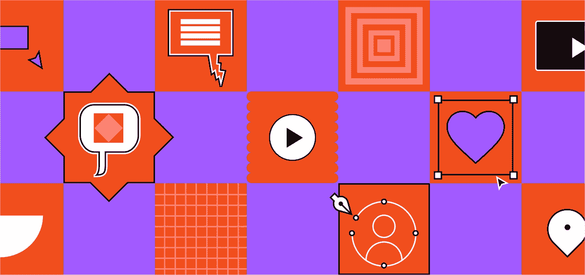

# 2023 年 6 门最佳 Figma UI/UX 初学者设计课程

> 原文：<https://medium.com/javarevisited/6-best-figma-ui-ux-design-courses-for-beginners-94711d31ce61?source=collection_archive---------0----------------------->

## 2023 年我最喜欢的 Figma 网页设计师和网页开发者在线课程。从 Coursera、Udemy 和 Pluralsight 学习 Figma for UI/UX，这些都是非常棒的在线课程

image_Credit — Figma

大家好，如果你想在 2023 年学习 Figma，这是最受欢迎的 UI 和 UX 设计工具之一，并寻找最好的在线课程，那么你来对地方了。之前，我已经分享了 [**最佳网页设计课程**](/javarevisited/10-best-coursera-courses-for-web-development-and-web-design-9ec54ed92dd9) 和 [**最佳网页开发课程**](/better-programming/my-5-favorite-courses-to-learn-web-development-in-2019-a5e74167f8b2) 在这篇文章中，我将分享 2023 年学习 Figma for UI 和 UX 设计的最佳课程。

拥有一个好看的网站不仅是有益的，而且在当今世界是必要的，这就是为什么 UI 和 UX 设计技能的需求很高。无论是大公司还是小公司都有很多专业设计师的工作，知道像 Figma 这样的工具肯定会提高你的 UI 设计技能。

创建一个好的和 [**响应的网页设计**](https://www.java67.com/2020/08/top-5-courses-to-learn-responsive-web-design-best.html) 将会对你的受众产生影响，让他们看到你的品牌与其他竞争对手相比的样子，并让他们继续使用你的服务，而不是寻找另一个并离开你的业务。为了创建一个好看的网站，有很多工具可以实现这一目标，其中之一叫做 Figma。

[Figma](https://www.figma.com/) 是最强大的在线应用程序之一，因此您可以使用浏览器设计您的网站，而无需在您的计算机上下载和安装任何附加软件，它还支持团队协作和快节奏的设计。

对于那些对学习 Figma for [**UI 和 UX**](https://javarevisited.blogspot.com/2020/06/top-5-courses-to-learn-ux-design-in.html) 感兴趣的人，我正在寻找最好的程序来帮助你作为初学者使用这个工具，直到成为高级用户，所以请继续关注并继续阅读关于学习 Figma for web design 的前 5 名在线课程的文章。

# 2023 年学习 UI 和 UX 设计的 6 门最佳 Figma 在线课程

在不浪费你更多时间的情况下，这里有一个学习界面和 UX 设计 Figma 的最佳在线课程列表。这些在线课程由专家创建，受到全球成千上万学习者的信赖。他们也可以从著名的在线学习网站如 Udemy、Pluralsight 和 ZTM 学院中选择。

## 1.[学习 Figma:用户界面设计基础——UI/UX 设计](https://click.linksynergy.com/deeplink?id=CuIbQrBnhiw&mid=39197&murl=https%3A%2F%2Fwww.udemy.com%2Fcourse%2Flearn-figma-user-interface-design-essentials-uiux-design%2F)

另一个学习 Figma 设计用户界面工具的优秀课程，无需任何知识或技能即可开始学习本课程。所有需要的东西是一台与互联网连接的计算机，并开始使用 Figma 设计一个好看的网站。

从排版、颜色对比、字体、间距等设计基础开始。然后，您将开始探索这个工具，以及如何使用它来创建文本、添加图像、UI 元素等等。

在那之后，你将设计你的第一个设计系统，比如一个金融应用程序和一个简单的标志，以及你将在这个精彩的课程中看到的更多的设计和主题。

以下是加入本课程的链接— [**学习 Figma:用户界面设计精要— UI/UX 设计**](https://click.linksynergy.com/deeplink?id=CuIbQrBnhiw&mid=39197&murl=https%3A%2F%2Fwww.udemy.com%2Fcourse%2Flearn-figma-user-interface-design-essentials-uiux-design%2F)

## 2.[在 fig ma](https://coursera.pxf.io/c/3294490/1164545/14726?u=https%3A%2F%2Fwww.coursera.org%2Flearn%2Fhigh-fidelity-designs-prototype)【Coursera 最佳课程】中创建高保真设计和原型

如果你正在寻找一个很好的学习 Figma 的在线课程，那么这个 Coursera 课程就是为你准备的。这是学习界面和 UX 设计 Figma 的最好的 Coursera 课程，它来自谷歌本身。

这是一门来自谷歌的结构良好的课程，在这里你将在 4 周内学习关于 UX 设计的一切，从 UX 设计基础到基本的 UI 技能，如线框、模型和 Figma 等工具。

这门课程也是 [**谷歌的 UX 设计专业证书**](https://coursera.pxf.io/c/3294490/1164545/14726?u=https%3A%2F%2Fwww.coursera.org%2Fprofessional-certificates%2Fgoogle-ux-design) 的一部分，是 Coursera 上最受欢迎的 UI 设计认证课程之一，拥有超过 139K 的学习者。

在本课程中，您将学习如何在流行的设计工具 Figma 中创建高保真设计，称为实体模型。然后，你将把这些设计变成一个像成品一样工作的交互式原型。

你还将进行研究，收集关于你的设计的反馈，并做出改进。最后，您将学习如何与开发团队分享您的设计，并在您的专业 UX 作品集中突出您的作品。

**这是参加本课程的链接**——[在 Figma 中创建高保真设计和原型](https://coursera.pxf.io/c/3294490/1164545/14726?u=https%3A%2F%2Fwww.coursera.org%2Flearn%2Fhigh-fidelity-designs-prototype)

顺便说一下，除了单独加入这些课程和专业，你还可以加入 [**Coursera Plus**](https://coursera.pxf.io/c/3294490/1164545/14726?u=https%3A%2F%2Fwww.coursera.org%2Fcourseraplus) ，这是 Coursera 的一个订阅计划，让你可以无限制地访问他们最受欢迎的课程、专业、专业证书和指导项目。

 [## Coursera Plus |无限制访问 7，000 多门在线课程

### 用 Coursera Plus 投资你的职业目标。无限制访问 90%以上的课程、项目…

coursera.pxf.io](https://coursera.pxf.io/c/3294490/1164545/14726?u=https%3A%2F%2Fwww.coursera.org%2Fcourseraplus) 

## 3.[学习 fig ma【Udemy 最佳课程】](https://click.linksynergy.com/deeplink?id=JVFxdTr9V80&mid=39197&murl=https%3A%2F%2Fwww.udemy.com%2Fcourse%2Flearn-figma%2F)

一个小而方便的课程，供初学者开始学习网页设计 Figma。该课程有 4.5 分的评分和超过 19k 的注册学生，它是想学习网页设计，平面设计，用户界面设计等的人的理想选择。

从学习 Figma 界面设计和如何浏览其仪表板开始，然后你将开始使用 Figma 工具制作你的第一个网页设计项目。

之后，您将学习如何编辑和添加内容，如处理颜色和样式，设计滑出式菜单，等等。

以下是加入本课程的链接— [**学习 Figma**](https://click.linksynergy.com/deeplink?id=JVFxdTr9V80&mid=39197&murl=https%3A%2F%2Fwww.udemy.com%2Fcourse%2Flearn-figma%2F)

## 4. [Figma:入门](https://pluralsight.pxf.io/c/1193463/424552/7490?u=https%3A%2F%2Fwww.pluralsight.com%2Fcourses%2F)【plural sight 最佳课程】

另一个关于使用 Figma 工具的很棒的课程向您展示了如何构建用户界面 UI，并深入探讨了更多选项，如使用其库等，这样您在完成本课程后将拥有开始使用 Figma 所需的技能。

你将从学习基本的形状属性以及定制对象和形状等开始。然后，您将了解图层属性及其行为。

最后，您将看到基本组件，然后学习如何使用库以及导出和共享资产和一些高级 Figma，如高级形状和工具。

**这是加入本课程的链接**——[fig ma:入门](https://pluralsight.pxf.io/c/1193463/424552/7490?u=https%3A%2F%2Fwww.pluralsight.com%2Fcourses%2F)

顺便说一下，你需要一个 Pluralsight 会员才能参加这个课程，费用大约是每月 29 美元或每年 299 美元(14%的折扣)。我向所有程序员强烈推荐这个订阅，因为它提供了超过 7000 个在线课程的即时访问，以学习任何技术技能。或者，你也可以使用他们的 [**10 天免费通行证**](https://pluralsight.pxf.io/c/1193463/424552/7490?u=https%3A%2F%2Fwww.pluralsight.com%2Flearn) 免费观看这个课程。

 [## 对个人来说

### Pluralsight 的使命一直是公平的技术竞争环境。不管你想学什么，或者…

pluralsight.pxf.io](https://pluralsight.pxf.io/c/1193463/424552/7490?u=https%3A%2F%2Fwww.pluralsight.com%2Flearn) 

## 5.[2023 年全网&手机设计师:UI/UX、Figma、+more](https://academy.zerotomastery.io/p/complete-web-and-mobile-designer?affcode=441520_zytgk2dn)

这是最好的和完整的在线课程之一，帮助您学习 Figma 设计移动和 web 应用程序 UX/UI，不需要以前的经验，只需要互联网连接和计算机(无论是 Linux、macOS 还是 windows)以及学习的热情。

该课程由 Andrei Negaoie 和他的团队创建，可在 ZTM 学院学习。本课程将教你从头开始学习 Figma。它从基础开始，比如创建文件，然后探索这个工具的界面，比如工具栏和面板。

了解 Figma 的用户界面后，你将开始创建你的第一个设计，如创建一个移动用户界面，添加一个支付页面，定制字体颜色，按钮，组件等，最后，创建 web 应用程序用户界面。

**以下是加入本课程的链接**——[全网&2023 年手机设计师:UI/UX、Figma、+more](https://academy.zerotomastery.io/p/complete-web-and-mobile-designer?affcode=441520_zytgk2dn)

顺便说一句，你需要一个 [**ZTM 会员**](https://zerotomastery.io/academy?affcode=441520_zytgk2dn) 才能观看这个课程，这个课程每月花费约 39 美元，但也提供了许多超级吸引人和有用的课程，如他的 Python 和 JavaScript 课程。您还可以使用我的代码 **FRIENDS10** 获得您选择的任何套餐的 10%折扣。

 [## 学习编码。被录用。加入零至掌握学院。|零到精通

### 老实说，有很多奇妙的资源，包括免费的...事实上，安德烈概述了他的整个旅程…

zerotomastery.io](https://zerotomastery.io/academy?affcode=441520_zytgk2dn) 

## 6.[完整的网页设计:从 Figma 到 Webflow 再到自由职业者](https://click.linksynergy.com/deeplink?id=CuIbQrBnhiw&mid=39197&murl=https%3A%2F%2Fwww.udemy.com%2Fcourse%2Ffreelance-web-design-from-design-to-development-to-making-money%2F)

本文的最后一门课程是为那些希望使用 Figma 设计工具创建应用程序用户界面的移动开发者开设的。本课程一步一步地引导你如何使用 Figma 设计一个功能齐全的原型。

从介绍工具和如何处理文件开始，然后开始设计移动界面，如登录和注册页面，以及设计购物页面、结账页面、个人资料页面和商业应用程序的其他页面。

此外，如果你在一个设计师团队中，你将会看到如何使用这个工具与他人合作。

这是加入本课程的链接— [完整的网页设计:从 Figma 到 Webflow 再到自由职业](https://click.linksynergy.com/deeplink?id=CuIbQrBnhiw&mid=39197&murl=https%3A%2F%2Fwww.udemy.com%2Fcourse%2Ffreelance-web-design-from-design-to-development-to-making-money%2F)

以上就是 2023 年学习 Figma for UI/UX 设计的**最佳在线课程**。Figma 是一个强大的技能工具，尤其是如果你是一个移动应用程序或网页设计师，甚至是一个企业家，他正在考虑推出自己的业务和吸引客户，以及通过优秀的网站设计展示自己的品牌。

您可能喜欢的其他**网页设计和开发资源**

*   [成为全栈式 Web 开发人员的 10 大在线课程](/@javinpaul/top-10-online-courses-to-become-a-fullstack-web-developer-in-2020-d608a6b63232)
*   [Java 和 Web 开发人员应该学习的 10 个框架](http://javarevisited.blogspot.sg/2018/01/10-frameworks-java-and-web-developers-should-learn.html)
*   [Web 开发人员学习 Angular 的 10 门免费课程](https://javarevisited.blogspot.com/2019/04/10-free-angular-and-react-courses-for.html)
*   [2023 年前端开发者路线图](https://javarevisited.blogspot.com/2019/02/the-2019-web-developer-roadmap.html)
*   [2023 年学习 JavaScript 的 12 门免费课程](/javarevisited/12-free-courses-to-learn-javascript-and-es6-for-beginners-and-experienced-developers-aa35874c9a32)
*   [在线学习 React.js 的五大课程](https://javarevisited.blogspot.com/2018/08/top-5-react-js-and-redux-courses-to-learn-online.html)
*   [Web 开发的五大 Python 框架](https://javarevisited.blogspot.com/2019/04/top-5-python-web-development-frameworks.html)
*   [2023 年学习渐进式网络应用的 5 门课程](https://javarevisited.blogspot.com/2020/08/top-5-courses-to-learn-progressive-web-app-development.html)
*   [10 门免费课程学习 Web 开发的 TypeScript】](/javarevisited/top-10-free-typescript-courses-to-learn-online-best-of-lot-44bce9da41d1)
*   [每个 Fullstack 开发者都应该知道的 10 个框架](https://javarevisited.blogspot.com/2019/01/10-web-development-frameworks-fullstack-developer-should-learn.html)
*   [2023 react . js 开发者路线图](https://javarevisited.blogspot.com/2018/10/the-2018-react-developer-roadmap.html)
*   [2023 年学习 Web 开发的五大课程](https://javarevisited.blogspot.com/2018/02/top-5-online-courses-to-learn-web-development.html)

感谢您阅读本文。如果你觉得这些【Figma 最佳在线课程有帮助，那么请与你的朋友和同事分享。如果您有任何反馈或建议，请留言。

**P.S.** —如果你正在寻找一个免费的在线培训课程来学习 Figma，那么你也可以在 Udemy 上查看这个 [**学习用于 UI UX 设计的 Figma(带一个设计项目)【免费】**](https://click.linksynergy.com/deeplink?id=CuIbQrBnhiw&mid=39197&murl=https%3A%2F%2Fwww.udemy.com%2Fcourse%2Flearn-figma-ui-ux-design-project%2F) 课程。这门课程是完全免费的，你只需要一个 Udemy 账号就可以加入这门课程，用一门完美的设计课程学习 Figma。

 [## 免费 Figma 教程-学习界面 UX 设计的 Figma(有一个设计项目)

### 我是一名高级 UI/UX 设计师和顾问，拥有超过 8 年的财富 500 强、大型企业…

udemy.com](https://click.linksynergy.com/deeplink?id=CuIbQrBnhiw&mid=39197&murl=https%3A%2F%2Fwww.udemy.com%2Fcourse%2Flearn-figma-ui-ux-design-project%2F)