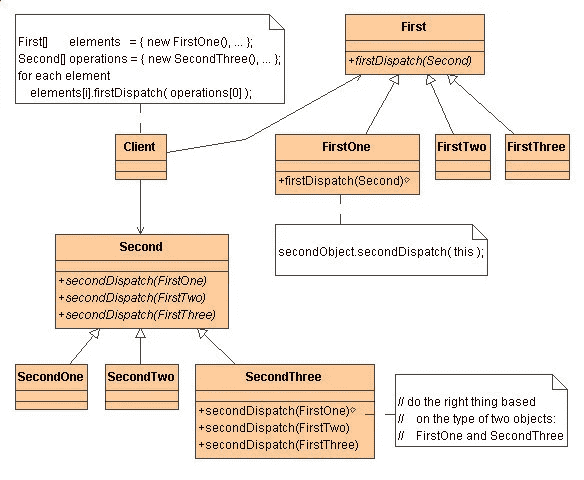
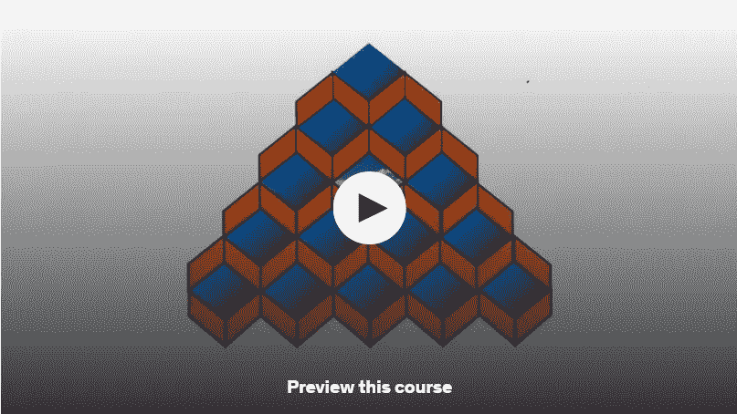
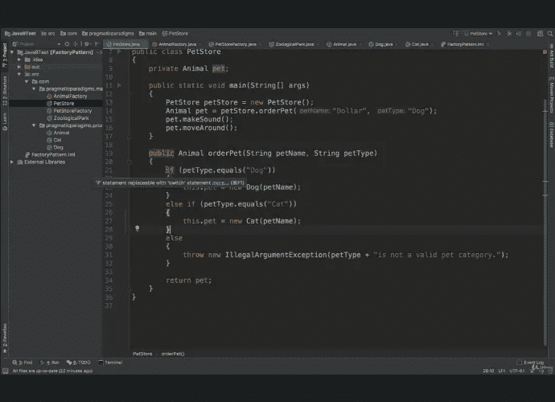
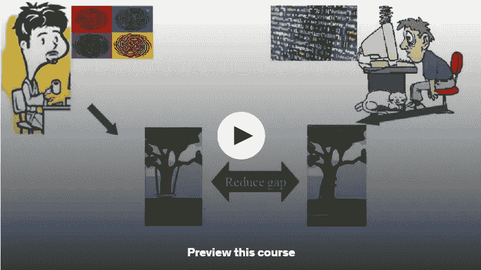
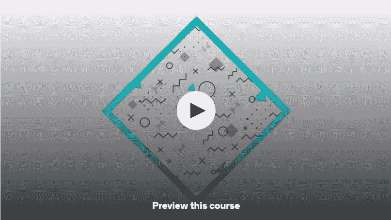
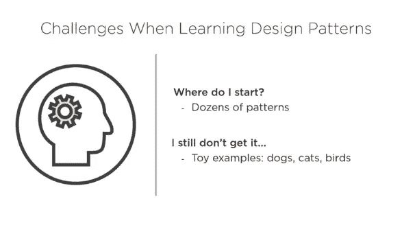

# 面向 Java 和 TypeScript 开发人员的 6 门免费设计模式课程

> 原文：<https://medium.com/javarevisited/6-best-free-design-pattern-courses-for-experienced-developers-f39f6dd5f31c?source=collection_archive---------0----------------------->

## 想学习软件设计模式和面向对象设计模式吗？这里有最好的免费在线课程和教程，你可以加入学习设计模式，并开始写更好的代码。

image_credit —软件设计模式:软件开发人员的最佳实践

大家好，如果你想学习软件设计模式或面向对象设计模式，也称为 GOF 模式，并寻找免费课程和教程等最佳资源，那么你来对地方了。之前，我已经分享了 [**最佳设计模式书籍**](/javarevisited/7-best-books-to-learn-design-patterns-for-java-programmers-5627b93eefdb) 、 [**设计模式课程**](/javarevisited/7-best-online-courses-to-learn-object-oriented-design-pattern-in-java-749b6399af59) 和[设计模式问题](https://www.java67.com/2012/09/top-10-java-design-pattern-interview-question-answer.html)，在这篇文章中，我将分享 2023 年学习设计模式的最佳免费资源。

无论一个程序员有多好或多有经验，他们在编程时都会遇到问题。当代码中出现许多问题时，您可能会看到一些共性，当您试图解决它们时，您可能会发现某些模式。

术语“设计模式”在这里发挥了作用。简而言之，设计模式是常见编程问题的可靠解决方案。例如，创造性设计模式解决了对象创建问题。

它们已经存在很长时间了，但是 Erich Gamma、John Vlissides、Ralph Johnson 和 Richard Helm 在 1994 年出版的经典著作 D[**design Patterns:Elements of Reusable Object-Oriented Software**](http://www.amazon.com/Design-Patterns-Object-Oriented-Professional-Computing/dp/0201634988?tag=javamysqlanta-20)(通常被称为 GOF 设计模式)使它们流行起来。这本书详细介绍了 24 种用于解决常见编程问题的可重用设计模式。

设计模式最初是在 [C++](https://javarevisited.blogspot.com/2020/07/top-10-courses-to-learn-c-in-depth-best.html) 和 Smalltalk 中引入的，但它们随后被几乎所有编程语言采用，包括 Java、C++、 [PHP](/javarevisited/10-best-php-courses-for-beginners-and-experienced-developers-db18057a814f) ，甚至不是严格面向对象的计算机语言，如 [JavaScript](https://www.java67.com/2020/10/best-javascript-courses-for.html) 。

设计模式的优势是不可估量的；它们可以在各种框架、库和编程语言中找到。

顺便说一下，如果你需要一个最新的、全面的课程来学习 Java 设计模式，那么没有比 Udemy 上的 Dmitri Nestruck 的[**Java 设计模式**](https://click.linksynergy.com/fs-bin/click?id=JVFxdTr9V80&subid=0&offerid=323058.1&type=10&tmpid=14538&RD_PARM1=https%3A%2F%2Fwww.udemy.com%2Fdesign-patterns-java%2F) 课程更好的课程了。本课程将教你如何使用 Java 8 Lambdas、Stream 和其他新的 Java 特性实现经典的面向对象设计模式，如状态、策略、工厂、装饰器。这不是免费的，但完全值得。

# 2023 年面向初学者的 6 门 Java 和 TypeScript 最佳免费设计模式课程

这里有一些顶级的在线课程，不用花费更多的时间就可以学习 JavaScript 的设计模式。由于讲师的专业知识，成千上万的开发人员已经注册了这个课程，以学习最佳实践并提高他们的编码技能。

## 1. [Java 设计模式和架构](https://click.linksynergy.com/deeplink?id=JVFxdTr9V80&mid=39197&murl=https%3A%2F%2Fwww.udemy.com%2Fcourse%2Fjava-design-patterns-tutorial%2F)【免费】

这是学习 Java 设计模式的又一门优秀课程。它将向您展示如何通过识别常见挑战和使用设计模式来开发更好的软件，以达到更好的结果。
本课程将教你 20 多种设计模式，这些模式来自“四人帮”著名的《设计模式》一书，该书被广泛认为是这方面的圣经。

对于每个设计，都提供了该模式将解决的问题的具体说明，以及它的优点和缺点。通过提供的大量 Java 课程，您将能够了解该模式在实践中是如何工作的。

完成本课程后，您应该能够识别代码中的典型问题，应用适当的设计模式，并开发一个更易于维护和阅读的面向对象的解决方案。

**这里是加入这个免费课程的链接—** [Java 设计模式和架构](https://click.linksynergy.com/deeplink?id=JVFxdTr9V80&mid=39197&murl=https%3A%2F%2Fwww.udemy.com%2Fcourse%2Fjava-design-patterns-tutorial%2F)

## 2.[学习 Java 中的创造性设计模式](https://click.linksynergy.com/deeplink?id=JVFxdTr9V80&mid=39197&murl=https%3A%2F%2Fwww.udemy.com%2Fcourse%2Flearn-creational-design-patterns-in-java%2F)【免费】

这个免费的课程将教你如何使用 Java 中的坚实的原则和设计模式来开发智能的、可重用的软件。本课程分为两个部分。

在第一部分中，作者讨论了可靠的设计概念，如单一责任、开-关、Liskov 替换等，以及它们如何帮助您创建更好的代码。

在第二部分，他讨论了设计模式以及它们如何解决一个常见的问题。为了使用设计模式，你必须能够识别问题并理解哪种模式对你有帮助，这也是本课程擅长的地方。

简而言之，这是一个学习 Java 软件设计、架构和设计模式基础的极好的课程，这样你就可以写出更好的代码。

**这里是加入这个免费课程的链接—** [学习 Java 中的创造性设计模式](https://click.linksynergy.com/deeplink?id=JVFxdTr9V80&mid=39197&murl=https%3A%2F%2Fwww.udemy.com%2Fcourse%2Flearn-creational-design-patterns-in-java%2F)

## 3.[软件建模中的设计模式](https://click.linksynergy.com/deeplink?id=JVFxdTr9V80&mid=39197&murl=https%3A%2F%2Fwww.udemy.com%2Fcourse%2Fdesign-patterns-in-software-modeling-and-design%2F)【免费课程】

这是 Udemy 上免费提供的不错的 Java 设计模式课程之一。它不仅包括 GOF 模式，如命令、装饰、适配器、策略、代理、责任链和解释器，还包括作为设计模式基础的众所周知的可靠设计概念。

这也是一门实践性很强的课程，作者将演示如何使用 IntelliJ IDEA 来应用某种设计模式。

因为大多数演示都是单个文件，所以你可以下载与课程相关的文件，并使用 IntelliJ IDEA、Eclipse、NetBeans 或任何你选择的 IDE 来运行它。

这个课程唯一的缺点是它混合了印地语和英语，对于母语为英语的人来说可能不太容易理解，但对于既懂印地语又懂英语的印度学习者来说，它是最好的课程。

**这里是加入这个免费课程的链接—** [软件建模中的设计模式](https://click.linksynergy.com/deeplink?id=JVFxdTr9V80&mid=39197&murl=https%3A%2F%2Fwww.udemy.com%2Fcourse%2Fdesign-patterns-in-software-modeling-and-design%2F)

## 4.[打字稿设计模式](https://click.linksynergy.com/deeplink?id=JVFxdTr9V80&mid=39197&murl=https%3A%2F%2Fwww.udemy.com%2Fcourse%2Ftypescript-design-patterns%2F)【免费】

如果您是一名 JavaScript 或 TypeScript 开发人员，正在寻找一门免费的课程来学习面向对象的设计模式，那么这门课程非常适合您。本课程讲述了 GOF 设计模式的主题，他出色地描述了每个模式是如何工作的，以及如何在代码中利用它来创建更好、更灵活的软件。

他的例子是真实的，并且高度相关，这使得理解原理更容易。例如，利用策略模式来开发支付处理引擎是一个很好的主意，因为您需要处理各种格式的支付，比如现金、信用卡、优惠券、比特币或其他完全不同的东西。

简而言之，这对于有经验的 Java 开发人员和任何对学习 GOF 设计模式感兴趣的人来说都是极好的培训，比如 Visitor、 [Adapter](https://javarevisited.blogspot.com/2015/01/adapter-vs-decorator-vs-facade-vs-proxy-pattern-java.html) 和 [Decorator](https://www.java67.com/2013/07/decorator-design-pattern-in-java-real-life-example-tutorial.html) 。本课程的唯一缺点是没有涵盖所有的模式，但无论涵盖什么，它们都涵盖得很好，你会更好地理解它们。

简而言之，学习设计模式最好的课程之一是 TypeScript，除此之外，它是完全免费的。

**这里是加入这个免费课程的链接—** [打字设计模式](https://click.linksynergy.com/deeplink?id=JVFxdTr9V80&mid=39197&murl=https%3A%2F%2Fwww.udemy.com%2Fcourse%2Ftypescript-design-patterns%2F)

## 5. [Java:通过 Pluralsight 重构设计模式](https://pluralsight.pxf.io/c/1193463/424552/7490?u=https%3A%2F%2Fwww.pluralsight.com%2Fcourses%2Fjava-refactoring-design-patterns)【免费试用】

这只是另一个广泛的课程，它将教你从著名的 [GOF 书](/javarevisited/7-best-books-to-learn-design-patterns-for-java-programmers-5627b93eefdb)中获得的 24 种面向对象设计模式。

这些导师非常称职，之前曾在谷歌和投资机构工作过。他们认识到设计模式从本质上看并不简单，他们竭尽全力以一种可以理解的方式来分解它们。

本课程涵盖了 OOP 设计概念以及设计模式，就像其他两个课程一样。简而言之，这是一门学习 Java 设计模式并掌握所有 24 种模式以构建更好代码的优秀课程。

**这里是加入本课程的链接—** [Java:重构设计模式](https://pluralsight.pxf.io/c/1193463/424552/7490?u=https%3A%2F%2Fwww.pluralsight.com%2Fcourses%2Fjava-refactoring-design-patterns)

顺便说一下，你需要一个 Pluralsight 会员才能参加这个课程，费用大约是每月 29 美元或每年 299 美元(14%的折扣)。我向所有程序员强烈推荐这个订阅，因为它提供了超过 7000 个在线课程的即时访问，以学习任何技术技能。或者，你也可以使用他们的 [10 天免费通行证](https://pluralsight.pxf.io/c/1193463/424552/7490?u=https%3A%2F%2Fwww.pluralsight.com%2Fpricing%2Ffree-trial)来免费观看这个课程。

<https://pluralsight.pxf.io/c/1193463/424552/7490?u=https%3A%2F%2Fwww.pluralsight.com%2Fpricing%2Ffree-trial>  

## 6.[设计模式基础及其在 java 中的实现](https://click.linksynergy.com/deeplink?id=JVFxdTr9V80&mid=39197&murl=https%3A%2F%2Fwww.udemy.com%2Fcourse%2Fbasics-of-design-patterns-and-its-implementation-in-java%2F)

这是另一个学习 Java 设计模式的免费课程。这个课程在 Udemy 上是免费的，你需要的只是一个免费的 Udemy 帐户来参加这个课程。

在这个免费的设计模式课程中，您将学到:

1.  如何使用设计模式的概念为项目开发开发逻辑
2.  如何成为一个逻辑思考者
3.  学习如何使用基于真实场景的设计模式。
4.  如何使用设计模式转换或重构现有项目

**这里是免费加入本课程的链接** — [设计模式基础及其在 java 中的实现](https://click.linksynergy.com/deeplink?id=JVFxdTr9V80&mid=39197&murl=https%3A%2F%2Fwww.udemy.com%2Fcourse%2Fbasics-of-design-patterns-and-its-implementation-in-java%2F)

以上是关于学习 Java 设计模式的**最佳免费在线培训课程**。这些课程是提高您对面向对象设计和可靠的 GOF 技术的知识的极好方法。在完成这些课程后，你将理解这些模式代表了什么，以及何时可以应用它们来编写更好的代码。这也会让你更容易与你的队友和同事分享你的想法。

您可能喜欢的其他免费 Java 编程资源

*   [面向 Web 开发人员的十大 JavaScript 教程和课程](https://javarevisited.blogspot.com/2018/06/top-10-courses-to-learn-javascript-in.html)
*   [6 门最佳面试动态编程课程](/javarevisited/6-best-dynamic-programming-courses-for-coding-interviews-14744060923c)
*   [2023 年 Java 开发者路线图](https://javarevisited.blogspot.com/2019/10/the-java-developer-roadmap.html)
*   [2023 年学习 Spring Boot 的 5 大课程](https://javarevisited.blogspot.com/2018/05/top-5-courses-to-learn-spring-boot-in.html)
*   [5 门免费的数据结构与算法课程](https://javarevisited.blogspot.com/2018/01/top-5-free-data-structure-and-algorithm-courses-java--c-programmers.html)
*   [2023 年 Java 开发者可以学到的 10 件事](https://javarevisited.blogspot.com/2017/12/10-things-java-programmers-should-learn.html#axzz5atl0BngO)
*   [面向 Java 开发者的 5 门免费 Spring 框架课程](http://www.java67.com/2017/11/top-5-free-core-spring-mvc-courses-learn-online.html)
*   [面向程序员和开发人员的 5 门免费 Linux 课程](http://www.java67.com/2018/02/5-free-linux-unix-courses-for-programmers-learn-online.html)
*   [学习 React JS 框架的 5 门免费课程](http://www.java67.com/2018/02/5-free-react-courses-for-web-developers.html)
*   [2023 年每个 Java 开发者都应该学习的 10 个工具](https://www.java67.com/2018/04/10-tools-java-developers-should-learn.html)
*   [2023 年学习 Web 开发的五大课程](https://javarevisited.blogspot.com/2018/02/top-5-online-courses-to-learn-web-development.html)
*   [学习大数据和 Apache Spark 的 5 门课程](http://javarevisited.blogspot.com/2017/12/top-5-courses-to-learn-big-data-and.html)
*   [10 门免费 Java 全栈开发课程](https://www.java67.com/2020/07/top10-free-courses-to-learn-full-stack.html)
*   [学习 Java 集合和流的 7 门最佳课程](/javarevisited/7-best-java-collections-and-stream-api-courses-for-beginners-in-2020-3ad18d52c38)
*   [面试的 10 门最佳系统设计课程](/javarevisited/10-best-system-design-courses-for-coding-interviews-949fd029ce65)

感谢您阅读本文。如果你喜欢这些*最好的免费 Java 设计模式课程*，那么请与你的朋友和同事分享。如果您有任何问题或反馈，请留言。

**附言**——如果你不介意花几美元学习像 Java 设计模式这样有价值的技能，那么你可能想看看 Udemy 上的**[**Java 设计模式**](https://click.linksynergy.com/fs-bin/click?id=JVFxdTr9V80&subid=0&offerid=323058.1&type=10&tmpid=14538&RD_PARM1=https%3A%2F%2Fwww.udemy.com%2Fdesign-patterns-java%2F) 课程。本课程将教你如何使用 Java 8 Lambdas、Stream 和其他新的 Java 特性实现经典的面向对象设计模式，如状态、策略、工厂、装饰器。这不是免费的，但完全值得。**

**<https://javarevisited.blogspot.com/2018/02/top-5-java-design-pattern-courses-for-developers.html> **