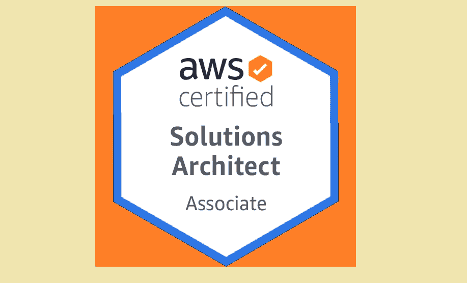
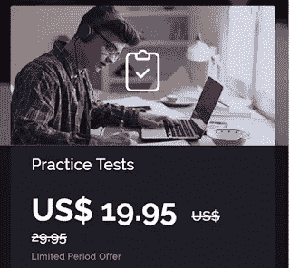
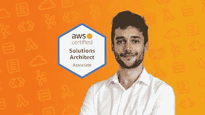
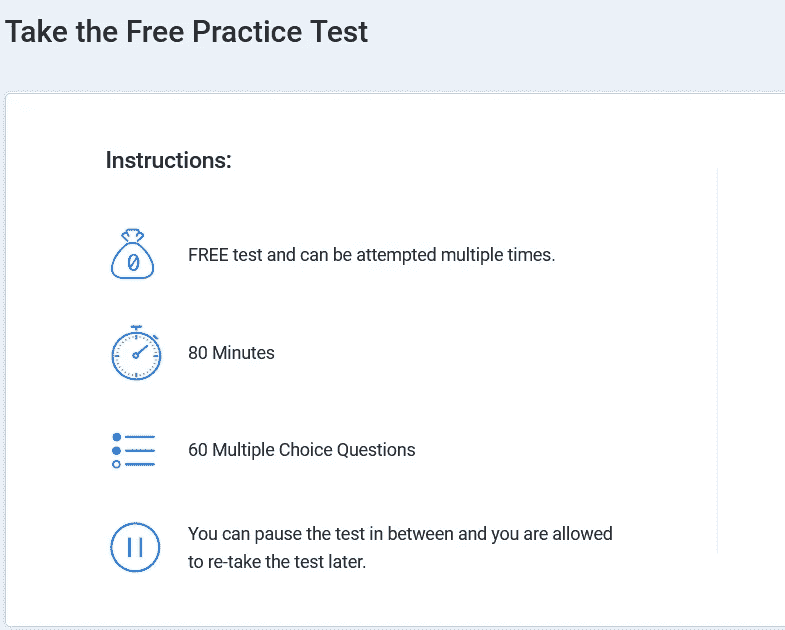
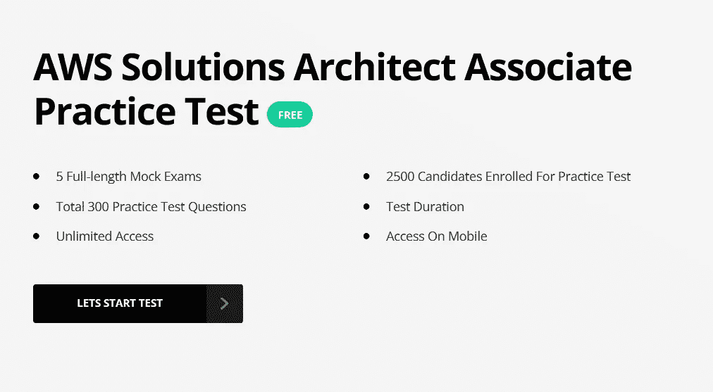

# 2023 年前 6 名 AWS 解决方案架构师助理认证考试实践测试和转储

> 原文：<https://medium.com/javarevisited/6-best-free-resources-for-aws-solution-architect-associate-exam-practice-tests-and-dumps-9a8843c69cad?source=collection_archive---------0----------------------->

## 最佳免费 AWS 解决方案架构师课程、实践测试、在线课程，为 2023 年的 AWS 解决方案架构师考试做准备。

大家好，如果你正在考虑 AWS 解决方案架构师助理认证考试，并在寻找最好的免费资源来准备这一久负盛名、备受欢迎的[云认证](https://www.java67.com/2020/09/top-10-cloud-certification-you-can-aim.html)，那么你来对地方了。

如今似乎每个人都飘飘然。人们谈论云计算和云平台就像 [AWS](https://javarevisited.blogspot.com/2020/09/top-10-aws-certifications-for-cloud-professionals.html) 、 [Azure](https://javarevisited.blogspot.com/2019/07/top-5-courses-to-crack-azure-architecture-technologies-certification-az-300-exam.html) 、 [Google Cloud](https://javarevisited.blogspot.com/2019/07/top-5-google-cloud-platform-gcp-courses-certifications-online.html) 、数字海洋等。此外，没有比准备认证更好的学习云计算的方法了。我

我知道有很多人在为学习 AWS 而准备 AWS 解决方案架构师考试，这就是为什么我开始分享我学习 AWS 和通过 A **WS 解决方案架构师认证考试的技巧。**

你可能已经注意到了我的一些与 AWS 认证相关的帖子。以前分享过破解 AWS 解决方案架构师助理考试的[最佳在线课程。但是，我已经多次说过，如果没有实践测试和模拟考试，无论是解决方案架构师还是云开发人员，您对 AWS 认证的准备都是不完整的。

我通过了很多认证像](https://javarevisited.blogspot.com/2019/05/top-5-courses-to-crack-aws-solutions-architect-associate-certification-exam-SAA-C01.html#axzz5rHwAwycj)[甲骨文的 Java 认证](/javarevisited/5-best-books-courses-and-practice-tests-to-crack-java-se-11-certification-ocajp-11-1z0-815-6c861d6d147f?source=---------4------------------)，微软的 SQL Server，移动，Web 开发，云，数据科学等。从我所有的经验来看，我可以说模拟考试**在获得那些重要的高分中起到了最关键的作用。**

你上过 [best AWS 在线课程](https://hackernoon.com/top-5-amazon-web-services-or-aws-courses-to-learn-online-free-and-best-of-lot-d94e192054b7)还是读过 [best AWS 认证书籍](https://javarevisited.blogspot.com/2021/09/topbooks-to-learn-cloud-computing-aws-for-beginners.html)都不重要，除非你做了实际的练习；所有这些知识都不会帮助你在真正的 AWS 认证考试中过关。模拟考试不仅能帮助你通过认证，还能帮助你获得高分。如果没有使用高质量的模拟模拟器的彻底练习，AWS 认证中的那些 **850+** 分数是不可能的。

在某些情况下，这些练习题或模拟考试甚至比实际考试更复杂，特别是 [**Whizlabs 考试模拟器**](http://shrsl.com/1pid8) 。我喜欢这样，因为这样你可以更好地准备复习。我强烈建议你不要参加真正的考试，除非你在一系列模拟考试中连续获得 80%的分数。只有这样，你才准备好接受诚实评估所带来的挑战，比如棘手的问题和时间限制？

**模拟考试提供了一个类似真实考试的环境**，在这个环境中，你需要在与真实考试相同的时间内解决相同数量的问题，这让你准确地了解自己的准备情况。

这就是为什么我建议你在参加 [AWS 解决方案架构师代码助理认证考试(SAA-C03)](https://javarevisited.blogspot.com/2019/05/top-5-courses-to-crack-aws-solutions-architect-associate-certification-exam-SAA-C01.html#axzz5rHwAwycj) 之前，先试试这些免费练习题。

AWS 解决方案架构师考试要求通过审查的百分比很高，最低及格分数为 720 分(满分为 100 分)，即 72%，您有 130 分钟的时间来回答所有这些问题。

实际的及格分数可能在你要去考试的那天有所不同，但是通过瞄准 75%，你在第一次考试中是安全通过考试的。

# 6 个最佳免费 AWS 解决方案架构师助理实践考试和转储

不浪费你更多的时间，这里是我的五个高级免费 AWS 认证 [*解决方案架构师助理(SAA-C03)实践测试*](/javarevisited/6-best-aws-solution-architect-associate-certification-practice-test-mock-exams-and-dumps-240c269dab4f?source=extreme_sidebar---------0-2----------------------) 、样题、考试转储、模拟考试或在线模拟器的列表。

这些会帮助你更好的准备，让你在实际考试前对自己的强项和弱项有个概念。然后，你可以专注于这些主题，以消除这些弱点。

它们也是极好的学习资源，因为当你试图解决一个问题时，你会更加投入，即使你没能解决一个问题，你也会通过查看解决方案以及你错过的地方和内容学到很多。

## 1.Whizlab 的 AWS 认证解决方案架构师助理(SAA-C03)免费测试( [20 个问题](https://shareasale.com/m-pr.cfm?merchantid=43514&userid=880419&productid=792775328&afftrack=))

在模拟测试或练习题方面，Whizlabs 是行业领导者。我已经使用 Whizlabs 很长时间了，并且在各种 Java 认证中广泛使用了它们。

所以，当我想到像 Solution Architect Associate 这样的 AWS 认证时，我的第一站是 Whizlabs，我很高兴他们有优秀的 *AWS 实践测试*。

他们的免费测试为 AWS 解决方案架构师助理考试提供了 20 个不同的问题，作为免费测试的一部分。因此，试一试可以让你知道自己目前对 AWS 认证解决方案架构师助理考试的准备程度。

但是，如果你觉得 20 对你来说太少，你也可以购买他们的 [**全长 AWS 练习题**](http://shrsl.com/1pid8) ，里面有 600 多+练习题，有详细的讲解。

问题被很好地分为七个全长模拟考试(455 个不同的问题)和部分测试-CSAA 2019 年最新考试版本的 11 个目标/主题小测验(165 个附加项目)，以掌握特定的主题。

除此之外，您还可以访问智能报告来评估您的优势和劣势。全长 AWS 模拟测试的费用大约为 20 美元，如果你负担得起，这应该是你购买 AWS 解决方案架构师认证的第一件东西。

## 2.[ [实践考试] AWS 认证解决方案架构师助理](https://click.linksynergy.com/deeplink?id=JVFxdTr9V80&mid=39197&murl=https%3A%2F%2Fwww.udemy.com%2Fcourse%2Fpractice-exams-aws-certified-solutions-architect-associate%2F)[不免费]

夏羽马拉克刚刚发布了一个全新的 AWS 认证解决方案架构师助理考试的模拟测试。这不是免费的，而是解决 AWS 解决方案架构师考试的最佳资源之一。

假设你不知道斯蒂芬妮·马拉克是谁。在这种情况下，他是一名 AWS 专家，也是 Udemy 上的[“终极 AWS 认证解决方案架构师助理”](https://click.linksynergy.com/deeplink?id=JVFxdTr9V80&mid=39197&murl=https%3A%2F%2Fwww.udemy.com%2Fcourse%2Faws-certified-solutions-architect-associate-saa-c02%2F)课程的作者，该课程被认为是准备 AWS 解决方案架构师考试的最佳课程。

如果你准备参加 SAA-C02 和 SAA-C03 考试，这 195 道优质题可以为你提供扎实的考前练习。所有问题都是从头开始写的，以涵盖最新的教学大纲。

每道题也是情景型题，包含详细的讲解，100%帮你备考。

你可以在这里查看课程和一个样题
你还可以在 Udemy 正在进行的疯狂促销期间花 9.99 美元获得这个模拟测试！

## 3.官方 AWS 解决方案架构师助理(SAA-C03)示例问题( [15 个问题](https://d1.awsstatic.com/training-and-certification/docs/AWS_Certified_Solutions_Architect_Associate_Sample_Questions.pdf))

AWS 和亚马逊还为他们的 AWS 解决方案架构师助理(SAA-C03)认证提供了 10 个样本问题。这些问题非常有助于了解你在实际考试中可能遇到的情况，尤其是难度。它还包含对这些示例问题的详细回答，这意味着您可以检查您的回答。你可以在这里下载问题样本。

## 4.【Simplilearn 提供的免费 AWS 解决方案架构师实践测试【60 个问题】

这是针对解决方案架构师助理认证的另一项出色的免费 AWS 实践测试。

在这个测试中，simplilearn 提供了 60 道模拟题，要求你在 80 分钟内解决这些问题，这并不完全像一场真正的考试，但给你足够的经验和想法来了解你在真正的考试中做得如何。

本次 [*免费 AWS 转储*](https://www.java67.com/2020/08/top-5-free-courses-to-pass-aws-cloud.html) 涵盖了 AWS 考试预计会问到的所有必不可少的题目，难度级别与实际考试相匹配。

如果你是第一次做，你也可以暂停测试，随时重考。

## 5.来自 LinuxAcademy 的免费 AWS 认证解决方案架构师实践测验([测验](http://quiz.linuxacademy.com/))

对于 AWS 认证、GCP 认证和微软 Azure 认证等云认证，Linux Academy 是一个宝贵的资源。

他们提供了许多有价值的测验，可以帮助你熟悉这个话题，并找出你的强项和弱项。

本 AWS 测验包含 25 个问题，大约需要 30-40 分钟完成。

它应该具有挑战性，就像真正的 AWS 认证解决方案架构师考试一样，这意味着您可能会错过一些问题。我建议你回到云专家的 [**AWS 解决方案架构师助理课程**](https://click.linksynergy.com/deeplink?id=JVFxdTr9V80&mid=39197&murl=https%3A%2F%2Fwww.udemy.com%2Faws-certified-solutions-architect-associate%2F) 并修改那些主题，以便更好地准备。

## 6.AWS 解决方案架构师助理实践测试由 KnowledeHut 免费提供

这是 AWS 解决方案架构师免费实践的另一个很好的资源。升级版 KNowledeHut 提供了 5 次全程模拟考试，您可以参加这些考试来检查您对这一著名考试的准备程度。

以下是他们免费 AWS 测试的主要特点:

*   5 次全程模拟考试
*   2500 名考生报名参加模拟考试
*   总共 300 道模拟试题
*   试验时间
*   无限制访问权限
*   在手机上访问

这是考试前准备和练习 AWS 解决方案架构师问题的非常好的资源，我强烈建议您加入或使用它。

## 6. [David Mayer 的 AWS 解决方案架构师助理 Dumps](https://www.certification-questions.com/practice-exam/amazon/aws-certified-solutions-architect-professional?affiliateCode=fcff36fd-557a-4713-abf6-973e9924770f&utm_source=Javin&utm_medium=affiliate&utm_campaign=affiliate) (10 个问题)【免费】

除了 Whizlabs，我第二喜欢的 AWS 模拟测试网站是 David Mayer 的亚马逊 AWS 认证解决方案架构师助理 Dumps。

他们的免费转储有十个问题需要你在 20 分钟内在线解决。他们有一个适当的限时考试环境，与实际考试非常相似。

这十道免费的 AWS 练习题预览他们的 [***完整的 AWS 解决方案架构师转储***](https://www.certification-questions.com/practice-exam/amazon/aws-certified-solutions-architect-professional?affiliateCode=fcff36fd-557a-4713-abf6-973e9924770f&utm_source=Javin&utm_medium=affiliate&utm_campaign=affiliate) ，包含 **987 个独特的谜题**和 20 个亚马逊 AWS 认证解决方案架构师关联练习测试，并附有详细解释。

以上是关于 AWS 认证解决方案架构师助理考试的一些**最佳免费 AWS 模拟测试和练习题。正如我所说的，这些在线 AWS 模拟模拟器或练习题将为您准备像多项选择和多项回答问题这样的评论格式，并帮助您在 130 分钟的时间限制内工作。**

他们还会帮助你找出自己的强项和弱项，这样你就可以在参加真正的考试之前努力改进。

以下是考试形式的详细信息，以防万一:

不过有一点小小的变化，如果你在准备 SAA-C02，那么你也需要准备测试你实践技能的实验题。为此，你需要在免费的 AWS 层上努力练习。

> 如果你真的想在 AWS 解决方案架构师助理考试中获得 850+以上的分数，我强烈建议你参加夏羽·马拉克的 [**终极 AWS 认证解决方案架构师助理**](https://click.linksynergy.com/deeplink?id=JVFxdTr9V80&mid=39197&murl=https%3A%2F%2Fwww.udemy.com%2Fcourse%2Faws-certified-solutions-architect-associate-saa-c02%2F) 课程并努力练习。

**其他云和 IT 认证指南和资源**

*   [通过 AWS 解决方案架构师助理考试的前 5 门课程](https://hackernoon.com/top-5-online-courses-to-crack-amazon-web-service-aws-solutions-architect-associate-exam-saa-c01-c667514ca72)
*   [如何破解 Azure 云认证？](https://javarevisited.blogspot.com/2019/07/top-5-courses-to-crack-azure-architecture-technologies-certification-az-300-exam.html)
*   [如何通过谷歌云开发者认证？](https://javarevisited.blogspot.com/2019/07/top-5-google-cloud-platform-gcp-courses-certifications-online.html)
*   [完整的网络开发者路线图](https://hackernoon.com/the-2019-web-developer-roadmap-ab89ac3c380e)
*   [如何成为 DevOps 工程师](https://javarevisited.blogspot.com/2018/09/the-2018-devops-roadmap-your-guide-to-become-DevOps-Engineer.html)
*   [如何破解甲骨文的 Java 认证](https://www.freecodecamp.org/news/how-to-pass-oracles-java-certifications-a-practical-guide-for-developers-e9b607ba6173)
*   [Spring 认证对工作和事业有帮助吗？](https://javarevisited.blogspot.com/2017/07/does-spring-certification-help-in-job-and-career.html)
*   [如何通过 Spring Core Professional 5.0 认证](https://javarevisited.blogspot.com/2018/08/how-to-crack-spring-core-professional-certification-exam-java-latest.html)
*   [10 门免费学习数据结构和算法的课程](http://www.java67.com/2019/02/top-10-free-algorithms-and-data.html)
*   [每个软件开发人员都应该学习的 10 件事](https://dev.to/javinpaul/10-things-every-software-developer-should-know-39pe)
*   [学习 Linux 命令行的 5 门免费课程](https://hackernoon.com/top-5-free-linux-courses-for-programmers-4a433b4edade)
*   [程序员学习 Git 的五大免费课程](https://javarevisited.blogspot.com/2018/01/5-free-git-courses-for-programmers-to-learn-online.html)
*   OCAJP 和 OCPJP 考试的 10 道免费样题

感谢您阅读本文。如果您喜欢这些*最佳免费 AWS 解决方案架构师助理模拟测试和练习题*，请与您的朋友和同事分享。如果您有问题或反馈或任何其他免费的 AWS 实践测试，问题或转储，请留言。

**P. S.** —如果你不熟悉亚马逊网络服务的奇妙世界，那么你也可以在 Udemy 上查看这个 [***AWS 认证解决方案架构师助理介绍课程***](https://click.linksynergy.com/deeplink?id=JVFxdTr9V80&mid=39197&murl=https%3A%2F%2Fwww.udemy.com%2Fcourse%2Faws-certified-solutions-architect-associate-in-30-days%2F) ，开始你的云计算之旅。

 [## 前 5 名免费 AWS 解决方案架构师助理认证(SAA-C03)模拟测试、模拟考试和…

### 大家好，似乎现在每个人都很开心。无论我走到哪里，人们都会谈论云计算和云…

javarevisited.blogspot.com](https://javarevisited.blogspot.com/2019/08/top-5-free-aws-solution-architect-Associate-certification-dumps-practice-questions.html)