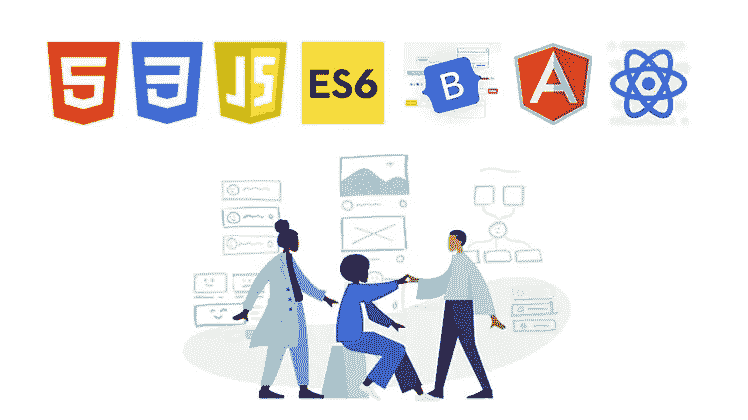
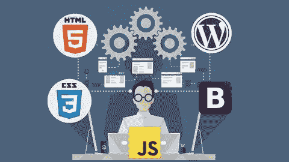
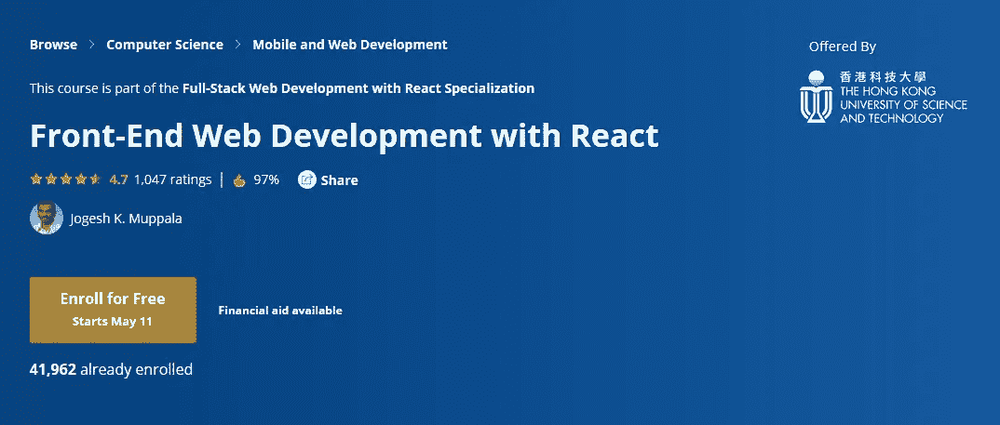

# 2023 年初学者学习的 6 门最佳前端开发课程

> 原文：<https://medium.com/javarevisited/6-best-frontend-development-courses-for-beginners-to-learn-in-2021-f2772157864?source=collection_archive---------0----------------------->

## 这些是 Udemy、Pluralsight、Educative 和 Coursera 提供的 2023 年学习前端开发的最佳在线课程，适合初学者。

image_credit — Udemy

大家好，如果你想在 2023 年成为一名前端开发者，并寻找最好的在线课程，那么你来对地方了。前面我已经分享过 [**我最喜欢的 web 开发课程**](/better-programming/my-5-favorite-courses-to-learn-web-development-in-2019-a5e74167f8b2) ，今天我要分享的是 2023 年初学加入的*最佳前端开发课程。*

前端开发是 web 开发人员的关键技能之一，因为对具有优秀前端开发技能的程序员有很多需求。

如果你从未经历过客户端 web 开发，学习过多的前端技术可能会很困难，但是通过适当的指导和选择正确的课程，你可以实现你的目标。

我想告诉你的一件事是，对于任何前端开发人员来说，很好地掌握 [HTML](http://www.java67.com/2018/02/5-free-html-and-css-courses-to-learn-web-development.html) 、 [CSS](https://hackernoon.com/top-5-free-online-courses-to-learn-html-css-web-development-in-2020-ae8e7466dfa7) 和 [JavaScript](https://hackernoon.com/10-websites-to-learn-javascript-for-beginners-31e13bbdbb5c) 是必须的。尽管我们生活在框架和库的时代，但是这些基础技术的知识不能被破坏。

我知道许多 web 开发人员直接从前端框架开始，如 [Angular](https://hackernoon.com/top-10-angular-courses-tutorials-and-books-for-web-developers-e8a8e2c490c2) 、 [Bootstrap](https://www.java67.com/2019/01/5-free-bootstrap-course-to-learn-online.html) 、 [React](https://hackernoon.com/the-2018-react-js-roadmap-4d0a43814c02) 和 [Vue](https://javarevisited.blogspot.com/2019/08/top-5-online-courses-to-learn-vue.js-best.html) ，而没有花太多时间学习底层的支柱，如 HTML、CSS 和 JavaScript，这意味着他们很难调试他们的应用程序，并且每当他们的应用程序运行缓慢、UI 冻结或元素不按他们想要的方式出现时就会卡住。

在创建这个前端开发在线课程列表时，我必须记住，我包含的课程不仅教你最新和最重要的前端框架，还教你基本技术，如 [HTML 5](https://javarevisited.blogspot.com/2019/05/top-5-html-5-and-css-3-courses-for-web-developers.html) 和 [CSS 3](https://www.java67.com/2019/01/5-free-bootstrap-course-to-learn-online.html) 。

这个列表中的大部分课程会带你了解客户端 web 开发的基本知识，向你展示如何用 [HTML](https://www.java67.com/2020/08/5-best-online-courses-to-learn-html-5.html) 、[级联样式表](https://javarevisited.blogspot.com/2020/09/top-5-css-cascading-style-sheet-courses-for-beginners.html)、 [JavaScript](https://www.java67.com/2019/01/best-websites-to-learn-javascript-online.html) 和 [jQuery](https://hackernoon.com/top-5-free-jquery-courses-for-web-developers-best-of-lot-9f65a1ff25b6) 构建网页，然后向你展示你可以用 React、Angular 或 Vue.js 做什么 JS 课程和[初学者最佳全栈开发课程](/better-programming/my-5-favorite-courses-to-learn-web-development-in-2019-a5e74167f8b2)。

 [## 2023 年成为全栈 Java 程序员的 10 门最佳在线课程

### 以上是 Udemy 学习全栈 web 最好的 Java+Spring Boot+Angular+react js+Kubernetes 课程…

medium.com](/javarevisited/10-best-java-full-stack-web-development-courses-to-join-in-2020-6cd6cd2e5868) 

# 2023 年学习前端开发的 6 大在线课程

这里是我列出的一些最好的在线培训课程和认证，供初学者学习前端 web 开发。

它包括来自 [Udemy](http://javarevisited.blogspot.sg/2018/01/top-10-udemy-courses-for-java-and-web-developers.html) 、 [Coursera](https://dev.to/javinpaul/10-of-the-best-tensorflow-courses-to-learn-machine-learning-from-coursera-and-udemy-37bf) 和 [Pluralsight](https://javarevisited.blogspot.com/2017/12/top-10-pluralsight-courses-java-and-web-developers.html) 的课程和认证，其中包含来自世界各地知名大学的序列和在构建专业网站和任务关键型 web 应用程序方面具有实际经验的专家培训师。

在不浪费你更多时间的情况下，这里列出了 2023 年适合初学者参加的最佳前端开发课程:

## 1.[完整的前端 Web 开发课程！](https://click.linksynergy.com/deeplink?id=JVFxdTr9V80&mid=39197&murl=https%3A%2F%2Fwww.udemy.com%2Ffront-end-web-development%2F) (Udemy)

这是学习前端 web 开发的最佳课程之一，因为它涵盖了作为前端 web 开发人员所需的一些最有用的编程语言和技术，如 HTML、CSS、JavaScript、jQuery 和 Bootstrap！

由 Joseph Delgadillo 和 Nick Germaine 创建本课程也非常注重动手操作，你将从使用 HTML 创建一个简单的网页开始，使用 JavaScript 编写一个 chrome 扩展。

谈到社交证明，已经有超过 119，530 名学生从这门课程中受益，而且近 3，468 名参与者对这门课程的平均评分为 4.3，这是一个惊人的成绩。

**这里是加入这个前端课程**——[完整的前端 Web 开发课程的链接！](https://click.linksynergy.com/deeplink?id=JVFxdTr9V80&mid=39197&murl=https%3A%2F%2Fwww.udemy.com%2Ffront-end-web-development%2F)

## 2.【JavaScript、HTML 和 CSS 编程基础 (Coursera)

这是 Coursera 的一门优秀的免费课程，不仅学习前端开发，还学习使用 JavaScript、HTML 和 CSS 的编程基础。

杜克大学提供本免费课程将教你如何使用函数、for 循环、条件语句编写 JavaScript 程序；如何使用 [HTML](/javarevisited/5-free-html-and-css-courses-to-learn-front-end-web-development-online-8b04517c6ecb) 构建一个包含段落、div、图片、链接、列表的网页；用 CSS Ids 和类向网页添加样式；制作一个与 JavaScript 命令交互的网页，比如 alert、onClick、onChange

像许多其他 [Coursera 课程](https://javarevisited.blogspot.com/2020/02/10-best-coursera-courses--for-python.html)一样，这个课程也是免费审核的，但是如果你需要一个证书和访问所有测验和编程作业的权限，你就需要付费，如果你喜欢 Coursera 并重视[证书](https://javarevisited.blogspot.com/2019/10/top-5-coursera-professional-certificates-for-programmers-IT-professionals.html)的话，无论如何你都应该这样做。

本课程结束时，您还将创建一个网页，其他人可以在其中上传他们的图像，并应用您创建的图像过滤器。我强烈推荐这个前端课程给初学者和没有编码/编程经验的人。

**这是加入本课程的链接**—[JavaScript、HTML 和 CSS 编程基础](https://coursera.pxf.io/c/3294490/1164545/14726?u=https%3A%2F%2Fwww.coursera.org%2Flearn%2Fduke-programming-web)

而且，如果你觉得 Coursera 课程和专业很有用，那么你也应该加入 Coursera Plus[**Coursera Plus**](https://coursera.pxf.io/c/3294490/1164545/14726?u=https%3A%2F%2Fwww.coursera.org%2Fcourseraplus)，这是 Coursera 的一个订阅计划，为你提供**无限制访问**他们最受欢迎的课程、专业、专业证书和指导项目。它每年花费大约 399 美元，但是它完全物有所值，因为你可以获得无限制的证书

 [## Coursera Plus |无限制访问 7，000 多门在线课程

### 用 Coursera Plus 投资你的职业目标。无限制访问 90%以上的课程、项目…

coursera.pxf.io](https://coursera.pxf.io/c/3294490/1164545/14726?u=https%3A%2F%2Fwww.coursera.org%2Fcourseraplus) 

## 3.[网络开发者训练营 2023 (Udemy)](https://click.linksynergy.com/deeplink?id=JVFxdTr9V80&mid=39197&murl=https%3A%2F%2Fwww.udemy.com%2Fthe-web-developer-bootcamp%2F)

这是我学习 Web 开发最喜欢的课程之一，我强烈推荐给前端开发人员。是你学习 web 开发唯一需要的课程——[HTML](/javarevisited/5-free-html-and-css-courses-to-learn-front-end-web-development-online-8b04517c6ecb)、 [CSS](/javarevisited/top-10-free-courses-to-learn-html-5-css-3-and-web-development-872d62d97a97) 、 [JavaScript](/javarevisited/my-favorite-free-tutorials-and-courses-to-learn-javascript-8f4d0a71faf2) 、 [Node](https://www.java67.com/2019/07/top-5-free-nodejs-courses-for-web-development.html) 等等。它不仅关注前端开发，还关注后端和 web 开发的其他方面。

谈到社交证明，434，580 名学生已经从这门课程中受益，126，888 名参与者对这门课程的平均评分为 4.6，这是一个惊人的数字。

我也是 Colt_Steele 导师的超级粉丝，他的 bootcamp 式教学确实让学习变得更轻松。作为一名训练营的老师，他真的知道他在教什么，而且他不会毫无意义地去做。

如果可以只买一门课学习前端开发，但是这一门。

**这是加入这一最佳课程的链接**—[2023 年网络开发者训练营](https://click.linksynergy.com/deeplink?id=JVFxdTr9V80&mid=39197&murl=https%3A%2F%2Fwww.udemy.com%2Fthe-web-developer-bootcamp%2F)

## 4.[前端 Web 开发:Joe Eames 入门](http://pluralsight.pxf.io/c/1193463/424552/7490?u=https%3A%2F%2Fwww.pluralsight.com%2Fcourses%2Ffront-end-web-app-html5-javascript-css)

前端开发的一个关键挑战是它涉及许多技术，并且它们也在不断变化，这就是为什么底层技术的强大基础是必须的。对于初学者来说，开始学习前端开发可能会令人望而生畏，这正是本课程的帮助所在。它将教你前端网站开发各个方面的基础知识，以及如何磨练和保持你的技能与时俱进。

讲师也非常详细，一步一步的向你展示如何使用客户端的 web 开发技术来创建沉浸式网站。

**这里是加入本课程的链接** e — [前端 Web 开发:入门](http://pluralsight.pxf.io/c/1193463/424552/7490?u=https%3A%2F%2Fwww.pluralsight.com%2Fcourses%2Ffront-end-web-app-html5-javascript-css)

顺便说一下，你需要一个 Pluralsight 会员才能参加这个课程，费用大约是每月 29 美元或每年 299 美元(14%的折扣)。我向所有程序员强烈推荐这个订阅，因为它提供了超过 7000 个在线课程的即时访问，以学习任何技术技能。或者，你也可以使用他们的 [**10 天免费通行证**](https://pluralsight.pxf.io/c/1193463/424552/7490?u=https%3A%2F%2Fwww.pluralsight.com%2Flearn) 免费观看这个课程。

 [## 个人技术技能|多视角

### 借助 Pluralsight，在开发运维、机器学习、云、安全基础设施等领域构建所需的技能…

pluralsight.pxf.io](https://pluralsight.pxf.io/c/1193463/424552/7490?u=https%3A%2F%2Fwww.pluralsight.com%2Flearn) 

## 5.使用 React 进行前端 Web 开发 (Coursera)

这是另一个学习 web 开发的很棒的课程，尤其是 Coursera 上的前端 Web 开发。与之前侧重于 HTML、CSS 和 Javascript 的课程不同，本课程侧重于 React library，这是一个用于前端应用程序开发的[流行 JavaScript 库](https://www.java67.com/2019/01/top-10-javascript-frameworks-and-libraries-for-web-developers.html)，对于现代 web 开发人员来说至关重要

本课程还使用 [JavaScript ES6](/javarevisited/12-free-courses-to-learn-javascript-and-es6-for-beginners-and-experienced-developers-aa35874c9a32) 来开发 React 应用程序，这将帮助您了解 ES6 中 JavaScript 的新特性。

本课程还涉及 Redux 的各个方面，并使用它来开发 [React-Redux](https://dev.to/javinpaul/my-favorite-courses-to-learn-react-and-redux-in-2019-c6c) 驱动的应用程序。然后，您还将学习如何使用 Fetch 进行客户端-服务器通信，以及如何在服务器端使用 [REST API](https://javarevisited.blogspot.com/2018/02/top-5-restful-web-services-with-spring-courses-for-experienced-java-programmers.html) 。

本课程还提供了 React 动画支持和测试回合的快速浏览。本课程由香港科技大学提供，由计算机科学与工程系副教授 Jogesh K. Muppala 讲授。

**这是加入本开发课程的链接**——[使用 React 进行前端 Web 开发](https://coursera.pxf.io/c/3294490/1164545/14726?u=https%3A%2F%2Fwww.coursera.org%2Flearn%2Ffront-end-react)

像其他 Coursera 课程一样，这也是免费学习的，但如果你需要证书和访问各种作业和测验，则需要付费。

顺便说一句，如果你没有联系到导师，需要一个选择，你也可以在 Udemy 上查看 Max 的[**React——完整指南**](https://click.linksynergy.com/deeplink?id=JVFxdTr9V80&mid=39197&murl=https%3A%2F%2Fwww.udemy.com%2Freact-the-complete-guide-incl-redux%2F) 课程，我个人的最爱。它涵盖了 Hooks 和 Redux，以及 React 路由器。

 [## React 16:完整课程(包括 React 路由器 4 和 Redux)

### 投入其中，从头开始学习 React.js！学习 Reactjs、Hooks、Redux、React Routing、Animations、Next.js 等等！

udemy.com](https://click.linksynergy.com/deeplink?id=JVFxdTr9V80&mid=39197&murl=https%3A%2F%2Fwww.udemy.com%2Freact-the-complete-guide-incl-redux%2F) 

## 6.[成为前端开发人员(教育性)](https://www.educative.io/track/beginning-front-end-developer?affiliate_id=5073518643380224)

如果你不知道， [Educative](https://www.educative.io?affiliate_id=5073518643380224) 是一个新的在线学习门户，提供基于文本的交互式学习材料。你可以在你的浏览器上学习从编码到前端开发的任何东西。您可以在浏览器上执行代码、构建项目，而无需安装任何东西。

他们有很多课程和轨道，一个结构化的学习路径，其中一个是成为前端开发人员，这对于开始你的前端开发人员之旅非常棒。

不需要任何先验知识，您将掌握 HTML、CSS 和 JavaScript，允许您使用 ReactJS 框架自己构建美观、实用的网站和 web 应用程序。

**这里是加入这个班级的链接**——[成为前端开发者](https://www.educative.io/track/beginning-front-end-developer?affiliate_id=5073518643380224)

顺便说一下，Educative 让您可以选择购买单独的课程，但如果您加入了像这样包含多个课程的课程，最好购买 **Educative 订阅**，每月只需 18 美元就可以访问他们的 100 多个课程，这是物有所值的。

 [## 介绍:教育性订阅。获得无限制的访问权限！

### 我们使用 cookies 来确保您在我们的网站上获得最佳体验。请查看我们的隐私政策以了解更多信息…

www.educative.io](https://www.educative.io/subscription?affiliate_id=5073518643380224) 

他们的编码面试课程，如[探索系统设计面试](https://www.educative.io/collection/5668639101419520/5649050225344512?affiliate_id=5073518643380224)和[探索编码模式](https://www.educative.io/collection/5668639101419520/5671464854355968?affiliate_id=5073518643380224)也很棒，这种订阅也将允许访问他们和任何未来的课程。

 [## 探索系统设计面试——互动学习

### 系统设计问题已经成为软件工程面试过程的标准部分。在这些方面的表现…

www.educative.io](https://www.educative.io/collection/5668639101419520/5649050225344512?affiliate_id=5073518643380224) 

以上就是成为前端开发人员的**最佳在线培训课程和认证**的全部内容。如果你有什么其他学习前端 web 开发的优秀课程，那就随便分享吧。

正如我所说的，学习像 [Angular](/javarevisited/10-courses-to-learn-angular-for-web-development-6da1bd2856dc) 、 [React](/javarevisited/top-10-free-courses-to-learn-react-js-c14edbd3b35f) 、 [Vue](/javarevisited/top-5-online-courses-to-learn-vue-js-in-2021-249e66b60646) 和 [Bootstrap](/javarevisited/7-free-courses-to-learn-bootstrap-for-web-designers-and-developers-5135215648f1) 这样的框架很重要，但是学习像 HTML、CSS 和 JavaScript 这样的基础知识更重要，你应该在开始学习框架之前优先考虑这些。

从长远来看，这也将有助于调试、故障排除和处理现实世界 web 应用程序的性能问题。

其他 **Web 开发文章**您可能喜欢探索

*   [完整的网络开发者路线图](https://javarevisited.blogspot.com/2019/02/the-2019-web-developer-roadmap.html)
*   [面向 Java 开发者的 5 门免费 Spring 框架课程](http://www.java67.com/2017/11/top-5-free-core-spring-mvc-courses-learn-online.html)
*   [2023 年学习 JavaScript 的 10 门课程](https://javarevisited.blogspot.com/2018/06/top-10-courses-to-learn-javascript-in.html)
*   [2023 年学习 HTML 和 CSS 的前 5 门课程](https://javarevisited.blogspot.com/2019/05/top-5-html-5-and-css-3-courses-for-web-developers.html)
*   [学习 Python 和 Web 开发的十大课程](/@javinpaul/top-10-courses-to-learn-python-for-web-development-in-2020-best-of-lot-efe11fb6d212)
*   [面向 Web 开发人员的 7 门免费 Node.js 课程](/javarevisited/7-free-courses-to-learn-node-js-in-2020-2f1dd6722b49)
*   [2023 年我最喜欢学的 Web 开发课程](/better-programming/my-5-favorite-courses-to-learn-web-development-in-2019-a5e74167f8b2)
*   [2023 年 5 门免费学习自举的课程](https://www.java67.com/2019/01/5-free-bootstrap-course-to-learn-online.html)
*   [为什么学习 Web 开发永远不晚](https://javarevisited.blogspot.com/2019/06/its-never-too-late-to-learn-web-development.html)
*   [学习棱角](/javarevisited/top-10-angular-books-and-courses-for-beginners-and-experienced-web-developers-best-of-lot-9a2dae87f04c)的 10 本书和课程
*   [2023 年学习 React 和 Redux 的 5 大课程](https://javarevisited.blogspot.com/2018/08/top-5-react-js-and-redux-courses-to-learn-online.html)
*   [2023 年学习 Angular 的前 5 门课程](https://javarevisited.blogspot.com/2018/06/5-best-courses-to-learn-angular.html)
*   [2023 年学习 Node.js 最佳课程之五](https://javarevisited.blogspot.com/2018/01/top-5-nodejs-and-express-js-online-courses-for-web-developers.html#axzz5VllnxgVT)
*   [如何在 2023 年成为一名现代 React JS 开发者](https://javarevisited.blogspot.com/2018/10/the-2018-react-developer-roadmap.html)

感谢您阅读本文。如果你喜欢这些最好的前端开发课程和教程，那么请分享给你的朋友和同事。如果您有任何问题或反馈，请留言。

**p . s .**——如果你不介意从免费在线课程、书籍和教程等免费资源中学习，那么你也可以看看我之前列出的 [**5 种学习 web 开发的免费资源**](http://www.java67.com/2018/03/top-5-free-courses-to-learn-web-development.html) ，其中我分享了一些对 web 开发人员有用的免费资源。

 [## 学习 HTML 5、CSS 3 和 Web 开发的 10 大免费课程

### 大家好，我已经分享了很多关于各种技术和编程语言的免费在线课程和书籍…

medium.com](/javarevisited/top-10-free-courses-to-learn-html-5-css-3-and-web-development-872d62d97a97)