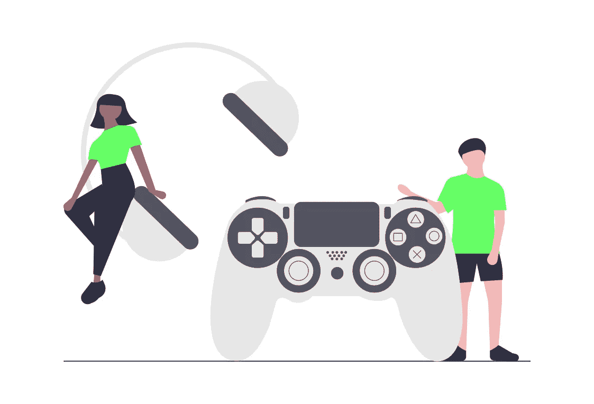
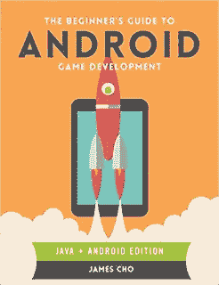
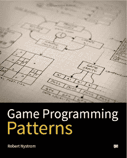
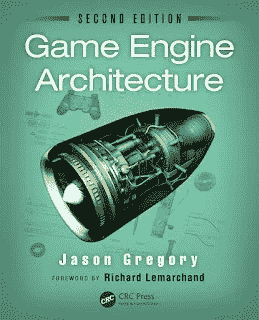
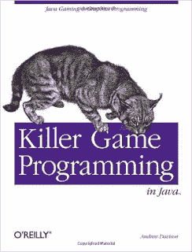

# 2023 年面向 Java 和 Android 开发者的 6 本最佳游戏开发书籍和课程

> 原文：<https://medium.com/javarevisited/6-best-game-development-books-courses-for-java-and-android-developers-3861bdaa4a79?source=collection_archive---------0----------------------->

## 这些是我最喜欢的学习 Java 和 Android 游戏开发的书籍和在线课程。还包括关于*游戏编程模式*和*游戏引擎架构的书籍。*

你好，Java 和 Android 程序员，如果你正在考虑 Android 或核心 Java 上的游戏开发，并寻找最好的资源，如最好的书籍和在线课程，那么你来对地方了。

早些时候，我已经分享了[最佳 Java 课程](/javarevisited/top-5-java-online-courses-for-beginners-best-of-lot-1e1e240a758)和[最佳 Android 培训课程](/javarevisited/top-5-courses-to-learn-android-for-java-programmers-667e03d995b4)，在这篇文章中，我将分享 Java 程序员的最佳游戏开发书籍和课程。

许多程序员和游戏开发者认为 Java 不是游戏设计的最佳语言，但是你不能忽视 Java 在游戏开发中的作用。总有一些流行的平台允许你用 Java 开发和销售游戏，就像过去的 J2ME 和现在的安卓。

自从 Android 使用 Java 作为编程语言以来，Java 的游戏开发获得了新的生命线，并且似乎做得相当好。甚至像《《我的世界》》这样的游戏也在 Java 平台上表现出色。

的确，C++ 仍然是开发游戏的最佳语言，因为它的高性能，许多顶级游戏开发公司，如索尼、任天堂和微软 Xbox，在开发伟大的游戏时，更喜欢 [C++](/javarevisited/6-best-unreal-engine-courses-for-c-game-developers-in-2021-41ca05907ae4?source=grid_home---------0---------------------a6920034_51af_43f7_abbd_38fda3ba6ba5-------12) 而不是 Java。但是随着[安卓](http://javarevisited.blogspot.sg/2013/06/introduction-of-how-android-works-Java-programmers.html)和 [iOS](https://javarevisited.blogspot.com/2019/01/top-5-ios-developer-course-to-learn-ios.html) 的推出已经完全改变了游戏开发行业。如今，游戏开发者可以在谷歌的 PlayStore 和苹果的 AppStore 上推出自己的游戏，梦想一下子变得富有和出名，还记得 Flappy Bird 和 Pokemon Go 吗？

说到性能，我想补充一点，在一个拥有良好的 Just In Time ( [JIT](http://www.java67.com/2013/02/difference-between-jit-and-jvm-in-java.html) )编译器的现代 JVM 上，性能不再是一个问题，因为 JVM 会将频繁调用的代码编译成本机代码，并在这个过程中优化它们。

由于这个原因，Java 在某些情况下可以胜过 [C](https://javarevisited.blogspot.com/2019/11/top-5-courses-to-learn-c-programming-in.html) 和 [C++](/javarevisited/top-10-courses-to-learn-c-for-beginners-best-and-free-4afc262a544e?source=extreme_sidebar---------0-2----------------------) ，尽管不是很大。Java 也有一些不错的 Java 游戏开发库，比如 [LibGDX](https://libgdx.com/) 。他们允许你使用他们的高性能组件来构建游戏界面和游戏引擎。尽管如此，我认为用 Java 编写游戏时最糟糕的性能损失可能是在调用 [LWJGL](http://javarevisited.blogspot.sg/2016/05/minecraft-javalangunsatisfiedlinkerror-lwjgl64dll-access-denied.html#axzz4kKZKCMvQ) 方法时不断的 Java/Native 切换。

顺便说一句，如果你对游戏开发感兴趣，想学习 Java 开发者最大的移动平台 Android 平台，那么我建议你加入 Udemy 上的 [**完整的 Android 开发者课程**](https://click.linksynergy.com/deeplink?id=JVFxdTr9V80&mid=39197&murl=https%3A%2F%2Fwww.udemy.com%2Fcourse%2Fthe-complete-android-oreo-developer-course%2F) 。这是一个基于项目的实践在线培训课程，您将从零开始学习构建 23 个 Android 应用。

<https://click.linksynergy.com/deeplink?id=JVFxdTr9V80&mid=39197&murl=https%3A%2F%2Fwww.udemy.com%2Fcourse%2Fthe-complete-android-oreo-developer-course%2F>  

# 6 本适合初学者的最佳 Android 和 Java 游戏开发书籍

我过去做过一些游戏开发，尤其是在 2000 年初，当时 J2ME 是一个流行的游戏开发平台。信不信由你，但最初的那些年教会我最多的是[编程](/javarevisited/top-10-free-interactive-programming-courses-from-educative-for-beginners-to-learn-in-2021-713cbf96d4eb)、[设计](/javarevisited/10-best-system-design-courses-for-coding-interviews-949fd029ce65)和[编码](/javarevisited/7-best-courses-to-learn-refactoring-and-clean-coding-in-java-47bea3c67006)。在开发游戏时，我学会了如何在编程中使用物理和数学。我学习了 GUI 开发、[游戏循环](http://www.java67.com/2015/06/how-to-pause-thread-in-java-using-sleep.html)、如何渲染视图，以及如何使用像 [2D 数组](http://www.java67.com/2014/10/how-to-create-and-initialize-two-dimensional-array-java-example.html)这样的数据结构来绘制像《超级马里奥兄弟》这样的平台游戏的场景和背景。

这是我强烈建议所有程序员编写一些像俄罗斯方块、井字游戏、数独、超级马里奥兄弟等游戏的一个原因。开发游戏是学习编码和设计的最好方法。虽然有很多书会教你如何用 Java 开发游戏，但以下是我整理的 Java 游戏编程书籍和在线课程列表。它包含了一些你会读到的最好的书籍和课程，关于游戏编码，编写游戏引擎，库，游戏模式，以及为 Android 开发游戏。

我还加入了两本独立于编程语言的通用游戏编程书籍中的一本，比如 Rober Nystrom 的*游戏编程模式*和 Jason Gregory 的*游戏引擎架构*。

## 1.[Android 游戏开发初学者指南](https://www.amazon.com/Beginners-Guide-Android-Game-Development/dp/1908689269?tag=javamysqlanta-20)

如果你真的想用 Java 为 Android 开发游戏，那么这本书很适合你。作者 James CHO 在解释从哪里开始以及开发使用触摸控制的 2D 互动游戏需要什么方面做了令人惊讶的工作。

这也是一本通过开发有趣的游戏来学习 Android 不同 UI 组件的好书。你也可以把这本书和 Udemy 上的 [**完整的 Android N 开发者课程**](https://click.linksynergy.com/fs-bin/click?id=JVFxdTr9V80&subid=0&offerid=323058.1&type=10&tmpid=14538&RD_PARM1=https%3A%2F%2Fwww.udemy.com%2Fcomplete-android-n-developer-course%2F) 结合起来进行一些可视化的学习。我发现书籍和在线课程的结合对于学习新技术非常有效。

## 2.[游戏编程模式](http://www.amazon.com/Game-Programming-Patterns-Robert-Nystrom/dp/0990582906?tag=javamysqlanta-20)

这是学习游戏中使用的编程或设计模式的最佳书籍之一。如果你不是开发游戏，只是想学习 [OOP 设计模式](http://www.java67.com/2014/10/how-to-create-and-initialize-two-dimensional-array-java-example.html)，比如说一个[命令模式](http://javarevisited.blogspot.sg/2016/05/command-design-pattern-in-java-example-code.html)你可以看看这本书。

它的命令模式映射到任天堂或微软 Xbox 等任何游戏控制台遥控器上的按钮的例子是设计模式的一些最佳现实例子。虽然，这本书更适合有一些游戏编程经验但不熟悉游戏编程的 Java 开发人员。对于游戏开发者来说，我建议将本书与 [**完整的 LibGDX 游戏课程结合使用 Java**](https://click.linksynergy.com/fs-bin/click?id=JVFxdTr9V80&subid=0&offerid=323058.1&type=10&tmpid=14538&RD_PARM1=https%3A%2F%2Fwww.udemy.com%2Fthe-complete-libgdx-game-course%2F) 课程，以获得更好的学习体验。

## 3.[用 Java 开发游戏](https://www.amazon.com/Developing-Games-Java-David-Brackeen/dp/1592730051/?tag=javamysqlanta-20)

我本来打算推荐 Java 游戏编程入门，因为这是我的许多同事过去经常学习的内容，但是显然，这本书现在看起来很旧了，考虑到 Java 已经从 1998 年发展到现在。是的，韦恩·霍尔德(Wayne Holder)编写的《Java 游戏编程傻瓜》( Java Game Programming For Dummies)早在 20 年前的 1998 年 3 月就发布了。不过，如果你能找到电子版的话，它绝对值得一看。

David Brackeen、Bret Barker 和 Lawrence Vanhelsuwe 的《Java 开发游戏》是另一本好书，也是一本非常受欢迎的书。它有很多例子，也很实惠。

如果你需要一门 Java 开发课程来配合这本书，那么我强烈推荐你去看看 Udemy 上的[**2023 年完整 Java 游戏开发课程**](https://click.linksynergy.com/deeplink?id=CuIbQrBnhiw&mid=39197&murl=https%3A%2F%2Fwww.udemy.com%2Fcourse%2Fjava-games-development%2F) 课程 Martin Yaney 和 Plamen Yaney。超过 64K 的 Java 开发人员已经加入了这个 8.5 小时的课程，学习用 Java 进行游戏开发。

## 4.[游戏引擎架构](https://www.amazon.com/Engine-Architecture-Second-Jason-Gregory/dp/1466560010?tag=javamysqlanta-20)

游戏引擎架构是为严肃的游戏程序员设计的，他们真的想开发既健壮又有良好性能的专业游戏。

这不是一本 Java 书，例子在 C++ 中，但它仍然是任何游戏程序员的必读之书。它为游戏引擎软件开发的理论和实践提供了完整的指南。

如果你需要一门课程来配合这本分类游戏架构书，我建议你查看 Udemy 上的 [**虚幻引擎 C++开发者:学习 C++并制作视频游戏**](https://click.linksynergy.com/deeplink?id=CuIbQrBnhiw&mid=39197&murl=https%3A%2F%2Fwww.udemy.com%2Fcourse%2Funrealcourse%2F) 课程。本课程将教你如何使用虚幻引擎，一个流行的游戏库以及其他几个关键的游戏开发概念。

## 5.[Java 杀手游戏编程](https://www.amazon.com/Killer-Game-Programming-Andrew-Davison/dp/0596007302/?tag=javamysqlanta-20)

另一本学习 Java 游戏编程的好书是“*Java 游戏编程杀手”*，它绝对不会错。这本书是由奥赖利出版的，考虑到它出版于 2005 年，你们中的一些人可能会认为它也很旧了，但我可以告诉你这本书仍然是相关的。

简而言之，如果你正在用 Java 开发游戏，安德鲁·戴维森(Andrew Davison)的《Java 中的杀手游戏编程》是必读书之一。

如果你需要一门课程，建议你在 Udemy 上加入 [**完整的 LibGDX 游戏课程使用 Java**](https://click.linksynergy.com/deeplink?id=CuIbQrBnhiw&mid=39197&murl=https%3A%2F%2Fwww.udemy.com%2Fcourse%2Fthe-complete-libgdx-game-course%2F) 课程，学习流行的 Java 游戏开发框架之一 LibGdx。这是一个用 Java 创建游戏的非常棒也是最受欢迎的框架。在图形、事件管理和管理用户输入方面，它可以为您做很多繁重的工作。

## 6.[开始 Java 8 游戏开发](https://www.amazon.com/Beginning-Java-8-Games-Development/dp/1484204166/?tag=javamysqlanta-20)

最后，由于我的许多读者特别询问了一本关于 Java 8 游戏编程的书，我假设你已经看过这本书，但是如果你没有看过，我会提到它。

这是我给正在学习 Java 8 并且相对来说是编程新手的同事的书。对于你的水平来说可能有点容易，如果你已经是一个像样的程序员的话。如果你需要更多的 Java 8 书籍，也可以查看这个[列表](http://javarevisited.blogspot.sg/2016/10/best-books-to-learn-java-8.html)。

你也可以把这本书和 Udemy 上的[**2023 年完整 Java 游戏开发课程**](https://click.linksynergy.com/deeplink?id=CuIbQrBnhiw&mid=39197&murl=https%3A%2F%2Fwww.udemy.com%2Fcourse%2Fjava-games-development%2F) 课程 Martin Yaney 和 Plamen Yaney 结合起来，两全其美。

以上是一些最好的 Java 和 Android 游戏开发书籍和在线课程。你可以看这些书，加入那些课程，学习 Java 和 Android 游戏编程。

你可以以开发游戏为生，但如果你没有这样做，你也可以学习一些这样的书来提高你的编程和编码意识。以我的经验，开发游戏是学习编程和编码的最好方法。你们中的一些人可能想知道用 Java 编写的游戏移植到 T2 的 iOS 和 iPad 有多容易。尽管 Java 是独立于平台的，据我所知，iOS 上没有 [JVM](http://javarevisited.blogspot.sg/2011/12/jre-jvm-jdk-jit-in-java-programming.html) 。您需要将 Java 代码转换成 Objective-C，以便将您的 Java 游戏移植到 iOS 上，在 iPhones 和 iPads 上运行。有一些工具可以帮助你做到这一点，但我想这将是相当多的工作，特别是如果你在用 Java 设计游戏时没有记住 iOS 移植，但如果你使用 LibGDX，你不必实际移植它，只需添加后端，如果你想学习使用 LibGDX 开发 Java 游戏，那么使用 Java 的完整 LibGDX 游戏课程是一个很好的开始。

<https://click.linksynergy.com/deeplink?id=CuIbQrBnhiw&mid=39197&murl=https%3A%2F%2Fwww.udemy.com%2Fcourse%2Fjava-games-development%2F>  

其他**书籍和课程推荐**面向程序员的
[完整的 Java 开发者路线图](https://javarevisited.blogspot.com/2019/10/the-java-developer-roadmap.html#123)
[每个程序员都应该读的 10 本书](http://www.java67.com/2015/03/10-books-every-programmer-and-software-engineer-read.html)
[学习 Java 编程的 10 大课程](/javarevisited/top-5-java-online-courses-for-beginners-best-of-lot-1e1e240a758)
[10 本算法书籍一个程序员应该读的 10 大免费课程](http://www.java67.com/2015/09/top-10-algorithm-books-every-programmer-read-learn.html)
[学习数据结构和算法](https://www.java67.com/2019/02/top-10-free-algorithms-and-data.html)
[提高编码技能的 5 本书](http://www.java67.com/2016/02/5-books-to-improve-coding-skills-of.html)
[学习面向对象的 5 大课程 学习和掌握 SQL 的书籍](https://javarevisited.blogspot.com/2018/08/5-object-oriented-programming-and-design-courses-for-Java-programmers.html)
[学习数据库和 SQL 的前 5 门课程](https://javarevisited.blogspot.com/2018/05/top-5-sql-and-database-courses-to-learn-online.html)
[准备编程/编码面试的 10 本书籍](http://www.java67.com/2017/06/10-books-to-prepare-technical-coding-job-interviews.html)
[学习数据结构和算法的 5 本书籍](http://www.java67.com/2016/09/sql-5-best-books-to-learn-and-master.html)

感谢阅读本文，如果你喜欢这些书籍那么请分享给你的朋友和同事。 如果你有任何问题，或者你非常擅长游戏编程，特别是 Java 或 Android，请与我们分享。

**P. S.** —如果你想为大众开发游戏，那么没有比 Android 和 iOS 更好的平台了，如果你正在寻找从 Android 和 iOS 开始的免费课程，我建议你浏览一下这个列表，为初学者提供的 [**免费 Android 课程**](https://www.java67.com/2019/01/top-5-free-android-app-development-courses-for-programmers.html) 和 [**免费 iOS 课程**](https://javarevisited.blogspot.com/2018/11/5-free-ios-app-development-courses-for.html) 。

</javarevisited/5-free-courses-to-become-an-android-developer-d4d207f53675> 