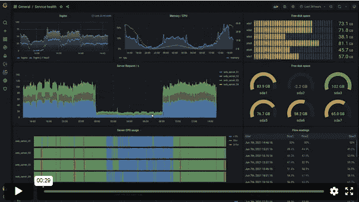
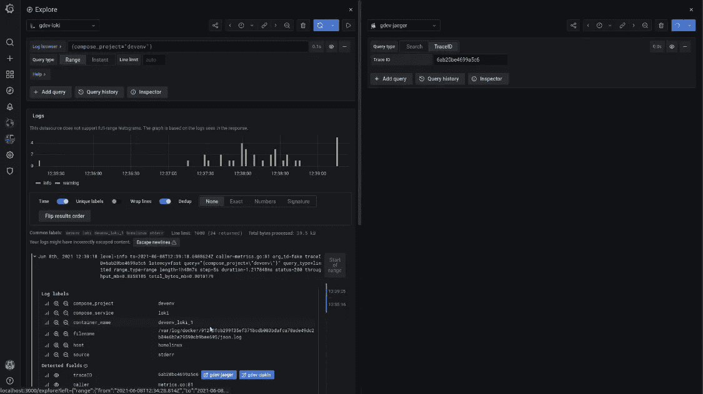
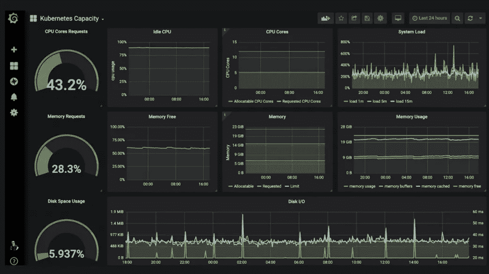
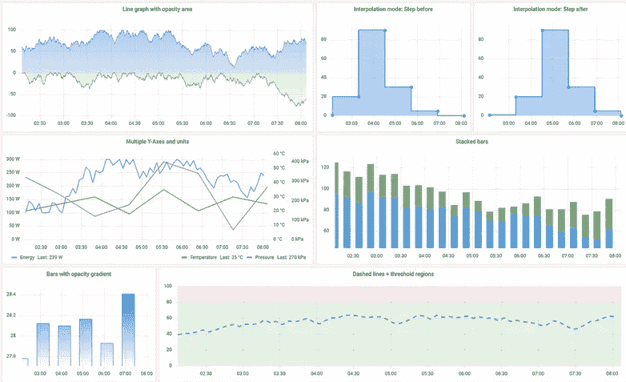
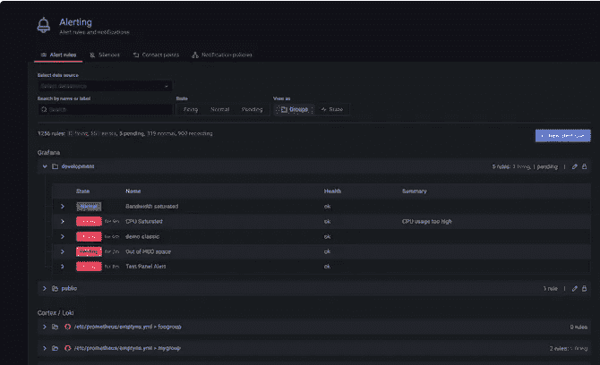

# 针对有经验的开发人员和开发者的 6 个最佳 Grafana 在线课程

> 原文：<https://medium.com/javarevisited/6-best-grafana-online-courses-for-experienced-developers-and-devops-40ccae2fed8d?source=collection_archive---------1----------------------->

## 想学习 2023 年流行的监测和可观测性工具 Grafana？以下是你可以参加的深入学习 Grafana 的最佳在线课程

你好，伙计们，如果你想学习 Grafana，一个最受欢迎的监控仪表板和观察平台，并寻找最好的在线课程，教程和培训课程，那么你来对地方了。

早些时候，我已经分享了 [**最好的基巴纳课程**](https://javarevisited.blogspot.com/2022/01/top-5-courses-to-learn-kibana-for.html) 在这篇文章中，我将分享 20223 年学习 Graphana 的最好的在线课程，但在此之前，我们先了解一下 Graphana 本身。

从最基本的角度来说， [Grafana](https://grafana.com/) 是一个运行分析和监控在线系统的开源工具。通过使用可定制的仪表板，它可用于理解大量数据。

Grafana 的一个重要特点是可以连接大量的数据源。这些数据库包括 Graphite、 [Elasticsearch](https://javarevisited.blogspot.com/2022/02/top-5-courses-to-learn-elasticsearch.html) 、 [MySQL](https://www.java67.com/2021/11/top-5-courses-to-learn-mysql-database.html) 和 [PostgreSQL](https://javarevisited.blogspot.com/2020/02/top-5-courses-to-learn-postgresql-in.html) 等。由于它是开源的，它还允许用户编写插件来与其他数据源集成。Grafana 广泛用于研究和监测长期数据，称为时间序列分析。

它通过提供相关数据来跟踪用户行为、应用程序行为、错误频率以及这些错误的类型。Grafana 随着时间的推移变得非常流行，目前被所有领先的科技公司使用，如 PayPal、易贝和英特尔。

[Grafana](https://grafana.com/) 还为企业提供另外两个功能，分别叫做 Grafana Cloud 和 the Enterprise。除此之外，Grafana 对十几个数据库有本地支持，用户可以通过使用各自的插件添加更多的数据库。它还内置了对 Graphite 和表达式的支持，如 add、filter、avg、min、max 函数等。

# 2023 年学习 Grafana 的 6 门最佳在线课程

在这里，我们整理了一份学习 Grafana 的 5 门最佳课程的清单。你唯一需要做的就是从这个列表中选择一门课程，然后开始学习。别担心，你可以以后再感谢我。

## 1.格拉法纳

在本课程中，您将了解关于 Grafana 的所有必要信息，Grafana 是用于可视化指标、时序数据和应用程序分析的领先开源工具。购买本课程后，您将终身获得超过 6 小时的点播视频讲座。

**课程时长:7 小时**

**课程评分:4.6 星(满分 5 分)**

**课程讲师:肖恩·布拉德利**

**课程价格:56 美元**

通过本课程，您将能够探索不同的功能，如图形、统计、仪表、表格、文本、热图和日志面板。您还将学习如何使用仪表板变量来创建具有自动可视化放置的动态仪表板。整个课程内容分为 54 讲。

**这是加入本课程的链接** — [Grafana](https://click.linksynergy.com/deeplink?id=JVFxdTr9V80&mid=39197&murl=https%3A%2F%2Fwww.udemy.com%2Fcourse%2Fgrafana-tutorial%2F)

## 2. [Graphite 和 Grafana:可视化应用性能](https://linkedin-learning.pxf.io/c/1193463/449670/8005?u=https%3A%2F%2Fwww.linkedin.com%2Flearning%2Fgraphite-and-grafana-visualizing-application-performance)【LinkedIn Learning】

这是 LinkedIn 学习平台上评价最高的高级课程之一。本课程将帮助您更好地了解应用程序的后端性能。

**课程时长:2 小时**

**课程评分:4.5 星(满分 5 分)**

课程导师:劳拉·斯通

**课程价格:年费每月 12 美元**

您将了解到关于 StatsD、Graphite 和 Grafana 的所有知识，它们是用于可视化应用程序指标的三个最流行的开源工具。

本课程将教您如何结合使用这三种工具，以便您可以诊断与数据库和服务器性能相关的问题，并优化用户体验。这门课程的指导老师是劳拉·斯通，她是一名高级软件工程师。

**这是加入本课程** — [石墨和 Grafana:可视化应用性能](https://linkedin-learning.pxf.io/c/1193463/449670/8005?u=https%3A%2F%2Fwww.linkedin.com%2Flearning%2Fgraphite-and-grafana-visualizing-application-performance)的链接

顺便说一下，你需要 LinkedIn Learning 会员才能观看这门课程，每月费用约为 29.99 美元，但你也可以通过参加他们的 [**1 个月免费试用**](http://linkedin-learning.pxf.io/c/1193463/449670/8005?u=https%3A%2F%2Fwww.linkedin.com%2Flearning%2Fsubscription%2Fproducts) 来免费观看这门课程，这是探索他们 17000 多门最新技术在线课程的好方法。

 [## LinkedIn Learning 免费试用和订阅价格

### 从初级到高级的 20，000 多门由专家指导的个性化优质内容课程。基于社区的…

linkedin-learning.pxf.io](http://linkedin-learning.pxf.io/c/1193463/449670/8005?u=https%3A%2F%2Fwww.linkedin.com%2Flearning%2Fsubscription%2Fproducts) 

## 3. [Grafana 初级到高级(第三版)](https://click.linksynergy.com/deeplink?id=CuIbQrBnhiw&mid=39197&murl=https%3A%2F%2Fwww.udemy.com%2Fcourse%2Fgrafana-graphite-and-statsd-visualize-metrics%2F)【Udemy】

顾名思义，该课程涵盖了从基础到与 Grafana 相关的最高级主题的所有内容。课程开始时，您将学习如何在 Windows、 [Mac](https://javarevisited.blogspot.com/2022/02/top-5-macos-courses-for-beginners-in.html) 或 Ubuntu 上安装 Grafana、Graphite 和 StatsD。

**课程时长:6 小时**

**课程评分:4.3 星(满分 5 分)**

**课程讲师:阿列夫·卡利米**

**课程价格:56 美元**

您还将学习如何将 Grafana 与 MySQL、 [Elasticsearch](/javarevisited/5-best-elastic-search-courses-for-beginners-to-learn-kibna-logstash-and-elk-stack-in-2022-eb3e1e0015c4) 和 SQL Server 集成。本课程还将使您能够设置警报和符号。本课程结束时，您将能够使用 C#、Powershell 和 Bash 构建自己的 StatsD 客户端。

**这是加入本课程**的链接— [Grafana 初级到高级(第三版)](https://click.linksynergy.com/deeplink?id=CuIbQrBnhiw&mid=39197&murl=https%3A%2F%2Fwww.udemy.com%2Fcourse%2Fgrafana-graphite-and-statsd-visualize-metrics%2F)

## 4.使用 Grafana【Udemy】可视化数据

本课程将教您如何使用 Grafana 创建、浏览和共享仪表板。您还将能够通过使用查询、可视化和警报来了解您的指标。

课程时长:4 小时

课程评分:4.5 星(满分 5 分)

课程讲师:Muthukumar Subramanian

课程价格:56 美元

首先，您将学习如何将 Grafana 与各种数据源集成，如 Graphite、InfluxDB、MySQL、OpenTSDB、Elasticsearch 和 CloudWatch。您还将学习如何用 Grafana 配置 Graphite 数据源，以及不同的面板和警报。

**这是参加本课程的链接**——[使用 Grafana](https://click.linksynergy.com/deeplink?id=JVFxdTr9V80&mid=39197&murl=https%3A%2F%2Fwww.udemy.com%2Fcourse%2Fvisualize-data-using-grafana%2F) 可视化数据

## 5. [Grafana 初学者到高级速成班](https://click.linksynergy.com/deeplink?id=CuIbQrBnhiw&mid=39197&murl=https%3A%2F%2Fwww.udemy.com%2Fcourse%2Fgrafana-latest%2F)【Udemy】

这是另一门课程，它会教你所有你需要知道的关于 Grafana 的知识，从绝对的基础知识到高级话题，不浪费一分钟。购买本课程后，您将终身获得超过 5 小时的点播视频讲座、2 篇文章和 1 个可下载的教育资源。

**课程时长:5 小时**

**课程评分:4 星(满分 5 分)**

**课程讲师:Vikas Kumar Jha 和 Poonam Jha**

**课程价格:56 美元**

本课程将从温和地向你介绍 Grafana 开始，然后教你如何在 Linux 服务器和 Windows 上安装 Grafana。您还将学习如何创建 Grafana 仪表板以及安装和管理 InfluxDB 服务。

以下是加入本课程的链接— [Grafana 初学者到高级速成班](https://click.linksynergy.com/deeplink?id=CuIbQrBnhiw&mid=39197&murl=https%3A%2F%2Fwww.udemy.com%2Fcourse%2Fgrafana-latest%2F)

## 6.Edureka 的 Grafana 初学者教程[免费 YouTube 课程]

YouTube 上的这个[edu reka](https://click.linksynergy.com/deeplink?id=JVFxdTr9V80&mid=42536&murl=https%3A%2F%2Fwww.edureka.co%2Fdevops-certification-training&LSNSUBSITE=LSNSUBSITE)“Grafana 初学者教程”免费视频课程给你一个什么是 Grafana 以及如何使用它的完整概述。

您还将创建自己的新冠肺炎 Grafana 仪表板，并了解 Grafana 图形用户界面。T

Grafana 教程视频涵盖了以下主题:

1.介绍

2.DevOps 中的连续监控

3.Grafana 简介

4.Grafana 入门

这是一个很好的免费资源来了解 2023 年的 Grafana，你可以在这里或 YouTube 上观看。

他的课程也是 Edureka 最畅销的 DevOps 在线培训 的一部分，是 DevOps 工程师的最佳讲师指导培训之一。如果你想成为 DevOps 工程师，我强烈推荐你。

 [## DevOps 在线认证课程[#1 DevOps 培训]

### 查看课程预览视频免费 Python 脚本、SQL 和 Linux 课程* Edureka 的 DevOps 培训计划将为您提供…

edureka.com](https://click.linksynergy.com/deeplink?id=JVFxdTr9V80&mid=42536&murl=https%3A%2F%2Fwww.edureka.co%2Fdevops-certification-training&LSNSUBSITE=LSNSUBSITE) 

# Graphana 常见问题

以下是一些关于 Graphana、学习 Graphana 以及如何使用它来监控企业应用程序的常见问题

**1。Grafana 是什么？**

Grafana 是一个用于运行分析和监控在线系统的开源工具。通过使用可定制的仪表板，它可用于理解大量数据。Grafana 还广泛用于研究和监测长期数据，称为时间序列分析。它通过提供相关数据来跟踪用户行为、应用程序行为、错误频率以及这些错误的类型。

**2。Grafana 有什么特点？**

Grafana 的一个重要特点是可以连接大量的数据源。其中包括 Graphite、Elasticsearch、 [MySQL](/javarevisited/top-5-courses-to-learn-mysql-in-2020-4ffada70656f) 和 [PostgreSQL](/javarevisited/7-best-free-postgresql-courses-for-beginners-to-learn-in-2021-3bf369d73794) 等数据库。由于它是开源的，它还允许用户编写插件来与其他数据源集成。

**3。谁使用 Grafana？**

Grafana 随着时间的推移变得非常流行，目前被所有领先的科技公司使用，如 PayPal、易贝和英特尔。

## 结论

这就是了。你可以用来进一步了解 Grafana 的 5 门最佳课程。如你所见，我已经兑现了我的承诺。现在，球在你的球场上。你还在等什么？选择一门课程并开始学习。

如果你喜欢这份 2023 年学习 Grafana 的 5 门最佳课程清单，请随意与你的朋友和家人分享。此外，如果您有任何疑问或问题，请留下您的评论，我们将立即回复您。

你可能喜欢的其他**开发运维、云计算和编程课程**

*   [2023 年 DevOps 开发者路线图](/hackernoon/the-2018-devops-roadmap-31588d8670cb)
*   面向 Java 和 DevOps 专业人员的 10 门免费 Docker 课程
*   [学习 Jenkins 自动化和开发运维的 5 大课程](https://javarevisited.blogspot.com/2018/09/top-5-jenkins-courses-for-java-and-DevOps-Programmers.html)
*   [2023 年学习 Kubernetes 的 7 门免费在线课程](/javarevisited/7-free-online-courses-to-learn-kubernetes-in-2020-3b8a68ec7abc)
*   [面向 Java 开发者的 6 门 Maven 课程](http://www.java67.com/2018/02/6-free-maven-and-jenkins-online-courses-for-java-developers.html)
*   [2023 年 Java 开发人员应该学会的 10 件事](http://javarevisited.blogspot.sg/2017/12/10-things-java-programmers-should-learn.html#axzz53ENLS1RB)
*   [学习亚马逊网络服务我最喜欢的课程](https://javarevisited.blogspot.com/2020/05/top-5-amazon-web-services-aws-courses-for-beginners-and-experienced-programmers.html)
*   [5 门免费 Selenium 课程学习自动化测试](https://javarevisited.blogspot.sg/2018/02/top-5-selenium-webdriver-with-java-courses-for-testers.html)
*   [10 面向程序员的 Docker 和 Kubernetes 课程](https://dev.to/javinpaul/top-10-courses-to-learn-docker-and-kubernetes-for-programmers-4lg0)
*   [我最喜欢为有经验的人学习 DevOps 的课程](https://javarevisited.blogspot.com/2018/09/10-devops-courses-for-experienced-java-developers.html)
*   [2023 年 Java 开发人员应该学习的 10 种工具](http://www.java67.com/2018/04/10-tools-java-developers-should-learn.html)
*   [5 免费弹簧框架和 Spring Boot 课程](http://www.java67.com/2017/11/top-5-free-core-spring-mvc-courses-learn-online.html)
*   面向 Java JEE 开发者的 5 大 Hibernate 和 JPA 课程
*   [程序员学习 AWS 和云的 10 门免费课程](/javarevisited/top-10-courses-to-learn-amazon-web-services-aws-cloud-in-2020-best-and-free-317f10d7c21d)
*   [面向开发者的 13 个最佳 DevOps 课程](/javarevisited/13-best-courses-to-learn-devops-for-senior-developers-in-2020-a2997ff7c33c)

感谢阅读到目前为止。如果你喜欢这些*为初学者*和有经验的开发者准备的 Grafana 最佳在线课程，那么请与你的朋友和同事分享。如果您有任何问题或反馈，请留言。

**P. S. —** 如果你想学习 Kubernetes，并在简历中增加一项有用的技能，但又在寻找免费课程，那么你也可以在 Udemy 上查看这个 [**Kubernetes:入门**](https://click.linksynergy.com/deeplink?id=JVFxdTr9V80&mid=39197&murl=https%3A%2F%2Fwww.udemy.com%2Fcourse%2Fkubernetes-getting-started%2F) 免费课程。这是完全免费的，你需要的只是一个免费的 Udemy 帐户来注册这个在线培训课程。

 [## 2023 年学习 Kubernetes 的 5 大在线课程-最佳选择

### 大家好，Kubernetes 已经成为当今容器管理社区中一个非常流行的工具和技能，它…

javarevisited.blogspot.com](https://javarevisited.blogspot.com/2020/06/top-5-courses-to-learn-kubernetes-for-devops-and-certification.html)