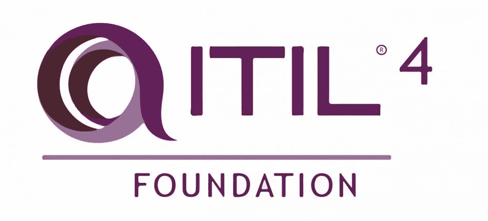
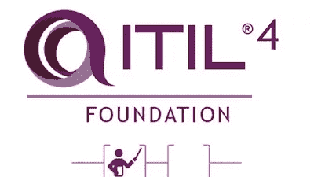
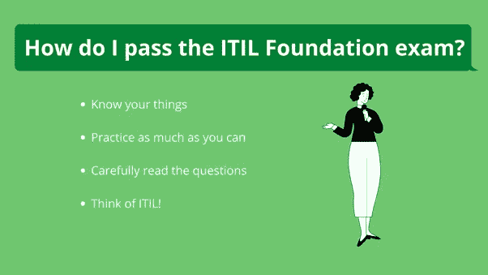
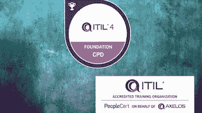

# 6 2023 年最佳 ITIL 4 基础课程和初学者练习测试

> 原文：<https://medium.com/javarevisited/6-best-itil-4-foundation-courses-practice-tests-for-beginners-8875660c79b7?source=collection_archive---------0----------------------->

## 我最喜欢的在线课程和练习测试，为 2023 年的 ITIL 认证考试做准备

大家好，如果你是技术支持或 IT 服务管理专业人士，希望通过 ITIL 4 基础认证来验证你的技能，并寻找最好的在线课程和练习测试来做好准备，那么你来对地方了。

在过去，我已经分享了许多认证资源，如 [**CompTIA Linux+、**](/javarevisited/6-best-comptia-linux-plus-certification-exam-xk0-004-courses-and-practice-tests-in-2021-a244c98eda4d)[**CompTIA Security+**](/javarevisited/7-best-resources-to-crack-comptia-security-certification-sy0-501-courses-and-practice-tests-b9d786ae753e)、 [CompTIA Network+](https://javarevisited.blogspot.com/2020/07/top-5-courses-to-pass-comptia-network-plus-certification-exam.html) ，在这篇文章中，我将分享**最佳在线 ITIL 基础培训课程** s 和**实践测试**，您可以参加这些考试来准备这项久负盛名的 [IT 认证](https://javarevisited.blogspot.com/2019/12/top-10-it-certifications-for-java-programmers.html)。

这些课程和模拟测试也是你第一次尝试通过 ITIL 4 基础认证的最好机会。如果你不太了解 ITIL 基金会证书，那么让我先给你一个简单的概述。

[itIL](https://www.axelos.com/certifications/itil-service-management) 是由 **AXELOS 公司**提供的一项认证，旨在帮助企业以最低成本、最高效的方式交付 IT 服务，因此它的工作方式就像是将 IT 服务与您的业务需求结合起来，以提高公司服务交付的绩效。

考试为**选择题，40 题，60 分钟，及格分数 65%。在一些国家，ITIL 基金会认证持有人的年薪可以达到 9.8 万美元左右，有经验的人有时会更高。

在这篇文章中，你将看到来自像 [Udemy](https://javarevisited.blogspot.com/2020/11/top-10-udemy-courses-you-can-buy-in.html) 这样的网站的最好的在线课程和实践测试，它们将帮助你学习这些提高公司服务的价值创造的技能，以获得更多的线索或客户，如果你有兴趣成为 ITIL 认证者，还将帮助你准备正式考试。**

# 为 2023 年 ITIL 基金会认证做准备的 6 门最佳在线课程

不要浪费你更多的时间，这里有最好的在线课程，你可以参加，为你的 ITIL 基金会认证做准备。这些都是完全在线的，由专业培训师和已经通过 ITIL 认证的人提供。

该列表还包括练习测试，您可以使用这些测试进行最后的准备，以评估您的速度和准确性。他们还会帮助你在真正的考试前发现自己的优势和劣势，这样你就可以提前解决这些问题。

备考最好的方法就是参加一门课程，阅读 ITIL 4 基础教材，解决一些练习题。这个简单的方法帮助我通过了许多 IT 认证，而且效果很好。

## 1.[ITIL 服务管理简介 4](https://click.linksynergy.com/deeplink?id=JVFxdTr9V80&mid=39197&murl=https%3A%2F%2Fwww.udemy.com%2Fcourse%2Fservice-management-itil-4%2F)

该课程是为那些对 IT 行业有所了解的人开设的，他们希望在 ITIL 基金会提高他们的技能，并利用他们的知识来改善他们的业务服务管理，但它不是为了教你整个 ITIL 基金会，而只是该计划的一部分。

在本课程中，您将学到:

*   服务管理导论。
*   一些服务管理概念。
*   准备正式的 ITIL 基础考试。

本课程旨在向您传授 ITIL 基金会的服务管理部分，如服务管理的四个维度、服务价值体系、指导原则、服务价值链，以及您将在本课程中学到的更多想法和概念。

**以下是参加本课程**——[ITIL 服务管理简介 4](https://click.linksynergy.com/deeplink?id=JVFxdTr9V80&mid=39197&murl=https%3A%2F%2Fwww.udemy.com%2Fcourse%2Fservice-management-itil-4%2F) 的链接

## 2.[使用新 ITIL 协议框架创建措施和指标](https://click.linksynergy.com/deeplink?id=JVFxdTr9V80&mid=39197&murl=https%3A%2F%2Fwww.udemy.com%2Fcourse%2Fcreating-measures-and-metrics-using-the-itil-4-framework%2F)

这个小课程是为那些想要学习产品和服务的操作和监督以及项目转换的人设计的，因此它适合于执行官和服务管理从业者。

在本课程中，您将学习许多主题，例如创建适当的目标，以及组织如何确定自己在市场中相对于竞争对手的位置，以及如何发展自己以达到一定的竞争或收入水平。

以下是您将在本课程中学到的内容:

*   五种类型的测量用于进度跟踪。
*   创建适当的目标。
*   五种评估方法。

此外，您还将学习一些用于跟踪进度的测量方法以及更多内容。

**这是参加本课程的链接** — [使用新 ITIL 协议框架创建衡量指标](https://click.linksynergy.com/deeplink?id=JVFxdTr9V80&mid=39197&murl=https%3A%2F%2Fwww.udemy.com%2Fcourse%2Fcreating-measures-and-metrics-using-the-itil-4-framework%2F)

## 3. [ITIL 4 简介](https://click.linksynergy.com/deeplink?id=JVFxdTr9V80&mid=39197&murl=https%3A%2F%2Fwww.udemy.com%2Fcourse%2Fitil-4-introduction%2F)【免费 Udemy 课程】

这个免费的课程将教授 ITIL 基金会的一些基础知识，作为一个想进入这个行业的初学者，学习如何通过公司服务创造价值。

本课程只是介绍什么是 ITIL 认证，它会给你带来什么好处，以及该认证的主要概念和它的历史。

此外，在课程结束时，通过一个小测验总结了一些概念，如服务价值体系和服务管理的四个维度。

在本课程中，您将学到:

*   ITIL 基金会概述。
*   服务价值体系。
*   服务管理四个维度。

顺便说一句，如果你是 IT 支持新手，你也可以在 Coursera 上查看一下 [**谷歌的 IT 支持**](https://click.linksynergy.com/deeplink?id=JVFxdTr9V80&mid=40328&murl=https%3A%2F%2Fwww.coursera.org%2Fspecializations%2Fgoogle-it-support) **培训课程**。学习是免费的，但是如果你需要认证就需要付费。

以下是加入本课程的链接— [ITIL 4 简介](https://click.linksynergy.com/deeplink?id=JVFxdTr9V80&mid=39197&murl=https%3A%2F%2Fwww.udemy.com%2Fcourse%2Fitil-4-introduction%2F)

## 4. [ITIL 四大基础课程&认证考试培训](https://click.linksynergy.com/deeplink?id=JVFxdTr9V80&mid=39197&murl=https%3A%2F%2Fwww.udemy.com%2Fcourse%2Fitil-4-course%2F)【Udemy】

这个关于 Udemy 的最佳 ITIL 课程是关于 Udemy 的最有帮助的课程之一，帮助你获得所需的知识，以提高你的技能，改善你的商业服务的价值创造。

在本课程中，您将学到:

*   ITIL 基金会介绍。
*   这种方法有什么帮助？
*   为你的服务创造价值。

本课程将向您介绍在您的企业中实施 ITIL 基金会的目的是什么，以及您将从这些理念或方法中获得的好处、关键概念、四维如何帮助您通过服务创造价值，以及您将从本课程中受益的更多有趣主题。

**这里是加入本课程的链接** — [ITIL 四大基础课程](https://click.linksynergy.com/deeplink?id=JVFxdTr9V80&mid=39197&murl=https%3A%2F%2Fwww.udemy.com%2Fcourse%2Fitil-4-course%2F)

## 5.[4 小时准备 ITIL 4 基础认证](https://click.linksynergy.com/deeplink?id=CuIbQrBnhiw&mid=39197&murl=https%3A%2F%2Fwww.udemy.com%2Fcourse%2Fprepare-the-itil-4-foundation-certification%2F)【Udemy 课程】

如果你在 IT 行业有一些知识或经验，并且你想通过学习 ITIL 基础课程和准备正式考试来提高你的技能，那么你会觉得这个课程非常有用。

在本课程中，您将学到:

*   准备 ITIL 基础考试。
*   许多 ITIL 基金会的概念。
*   如何将 ITIL 基金会应用到你的业务中？

本课程向您介绍许多概念，如服务管理的关键概念、服务管理的四个维度、服务价值体系、关系管理实践、供应商管理实践、事件管理实践等等。

此外，在整个课程中，每学完一个话题，你都会得到一个小测验。

**以下是参加本课程的链接—** [在 4 个小时内准备 ITIL 4 基础认证](https://click.linksynergy.com/deeplink?id=CuIbQrBnhiw&mid=39197&murl=https%3A%2F%2Fwww.udemy.com%2Fcourse%2Fprepare-the-itil-4-foundation-certification%2F)

## 6. [ITIL 4 基础执业认证考试](https://click.linksynergy.com/deeplink?id=JVFxdTr9V80&mid=39197&murl=https%3A%2F%2Fwww.udemy.com%2Fcourse%2Fitil-4-foundation-practice-certification-exams-6-exams-q%2F) (6 门考试)

这是一门模拟考试课程，你可以在 Udemy 上购买。代替讲座，本课程包含 6 个模拟测试，你可以用来评估你的 ITIL 4 基础准备。这门课程将帮助你在考试前评估你的速度和准确性。

以下是您将在本课程中获得的内容:

1.  6 个模拟测试，每个测试有 40 个模拟问题
2.  240 个独特的问题，精心制作以模拟真实的考试
3.  每个问题的详细解释

如果你已经参加了注册认证培训机构(ATO)的 ITIL 4 基础课程，或者使用 [**ITIL 4 基础教材**](https://www.amazon.com/ITIL-Foundation-4-AXELOS-Limited-ebook/dp/B07NTG9DXX/?tag=javamysqlanta-20) 自学，那么你可以在真正考试之前使用这个模拟测试来评估你的准备情况，并找到你的强项和弱项。

以上是 2023 年通过 ITIL 基金会认证的**最佳在线课程**。技术已经主宰了人类生活的每个方面，从电话和电视到火箭和武器，甚至商业也从这场技术革命中获得了自己的份额，通过社交媒体进行营销或建立网站或组织成员之间的工作，并改善他们的服务，这就是 ITIL 基金会的认证。

其他 **IT 认证文章**您可能喜欢:

*   [准备 CompTIA Server+考试的前 5 门课程](https://javarevisited.blogspot.com/2020/07/top-5-courses-to-pass-compTIA-Server-certifcation-exam.html)
*   [破解 AWS 解决方案架构师专业考试的前 5 门课程](https://javarevisited.blogspot.com/2020/04/top-5-course-to-crack-aws-solution-architect-professional-sap-c01-certification-exam.html)
*   [破解 AWS 解决方案架构师考试最佳课程](/javarevisited/top-5-aws-training-courses-to-crack-amazon-web-service-solutions-architect-associate-certification-3f4affa8f660?source=collection_home---4------0-----------------------)
*   [如何成为 Azure 认证管理员助理？](https://javarevisited.blogspot.com/2020/04/how-to-crack-microsoft-az-103-azure-administrator-associate-exam-certification.html)
*   [破解 Salesforce App Builder 认证的 5 门课程](https://javarevisited.blogspot.com/2020/06/top-5-courses-to-crack-salesforce-platform-app-builder-certification-exam.html)
*   [学习 Docker 和 Kubernetes 的 10 大课程](https://dev.to/javinpaul/top-10-courses-to-learn-docker-and-kubernetes-for-programmers-4lg0)
*   [破解 Azure 云架构师(AZ-300)考试的前 5 门课程](https://javarevisited.blogspot.com/2019/07/top-5-courses-to-crack-azure-architecture-technologies-certification-az-300-exam.html#axzz6E6VuRMsx)
*   [通过谷歌助理云工程师认证的前 5 门课程](https://javarevisited.blogspot.com/2019/07/top-5-google-cloud-platform-gcp-courses-certifications-online.html)
*   [破解 AWS DevOps 工程师考试的前 5 门课程](https://javarevisited.blogspot.com/2020/04/top-5-course-to-crack-aws-certified-devops-engineer-professional-exam-certification.html)
*   [5 次免费的 AWS 解决方案架构师实践测试](https://javarevisited.blogspot.com/2019/08/top-5-free-aws-solution-architect-Associate-certification-dumps-practice-questions.html)
*   [学习 Docker 和 Kubernetes 的十大课程](https://dev.to/javinpaul/top-10-courses-to-learn-docker-and-kubernetes-for-programmers-4lg0)
*   程序员前五名 AZ-900 模拟测试
*   [如何破解 Azure Fundamentals (AZ-900)认证](https://javarevisited.blogspot.com/2020/04/how-to-crack-microsoft-azure-fundamentals-certification-az-900-exam.html)
*   [2023 年成为 Salesforce 认证开发人员的前 5 名课程](https://javarevisited.blogspot.com/2020/06/top-5-salesforce-development-certification-training-courses.html)
*   [如何通过 AZ-300 Azure 解决方案架构师考试？](https://javarevisited.blogspot.com/2020/04/how-to-crack-microsoft-azure-solution-architect-exam-az-300.html)
*   [如何通过 Spring Core Professional 5.0 认证](https://javarevisited.blogspot.com/2018/08/how-to-crack-spring-core-professional-certification-exam-java-latest.html)
*   [成为 GCP 云工程师助理的前 5 名课程](https://javarevisited.blogspot.com/2020/05/top-5-course-to-crack-google-cloud-associate-cloud-engineer-certification-exam.html) r
*   [通过谷歌助理云工程师认证的前 5 门课程](https://javarevisited.blogspot.com/2019/07/top-5-google-cloud-platform-gcp-courses-certifications-online.html)
*   [通过 AWS 云从业者认证的前 5 门课程](https://javarevisited.blogspot.com/2020/02/top-5-courses-to-crack-aws-certified-cloud-practitioner-exam-certification-clf-c01.html)

感谢您阅读本文。如果你喜欢这些*最好的 ITIL 4 基础课程和模拟测试*，那么请与你的朋友和同事分享。这确实有所不同，然后你提前分享。我真的很感激。

**【p . s .】**——如果你真的想在第一次尝试中通过 ITIL 4 基础认证，那么我建议你解决尽可能多的模拟测试。我已经分享了一个但是如果你需要更多，你也可以看看 Subrata Das 的这个 [**ITIL 4 基础练习测试(240 题)**](https://click.linksynergy.com/deeplink?id=JVFxdTr9V80&mid=39197&murl=https%3A%2F%2Fwww.udemy.com%2Fcourse%2Fitil-4-foundation-practice-exams-o%2F) ，里面有 240 个问题，有详细的解释。

<https://javarevisited.blogspot.com/2020/07/top-5-courses-to-crack-itil-foundation-certification.html#axzz6mtjws1ez> 