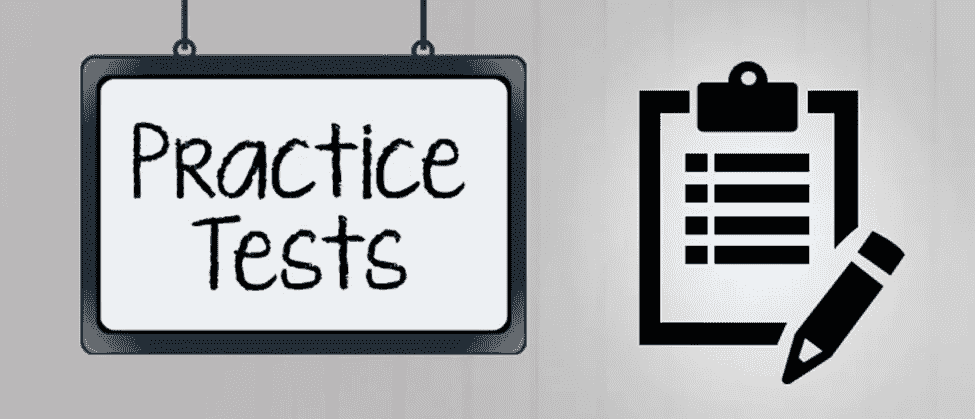
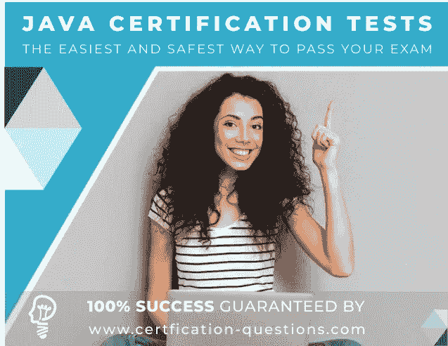
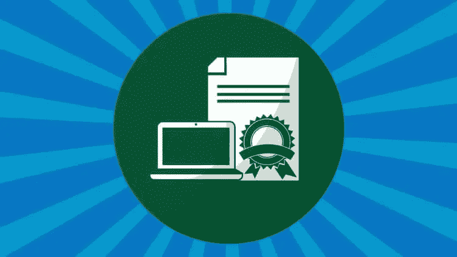
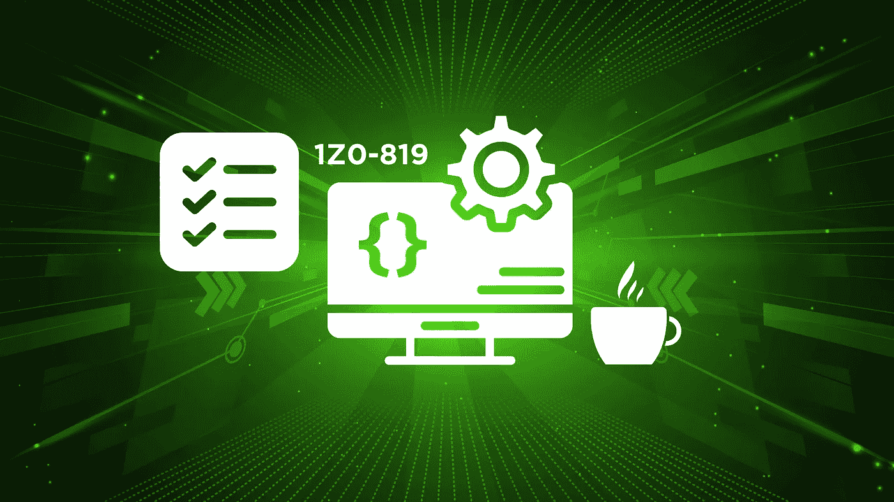

# 2023 年 6 个最佳 Java 8 认证实践测试和考试转储

> 原文：<https://medium.com/javarevisited/6-best-java-8-certification-practice-tests-and-exam-dumps-6a2bdb735d97?source=collection_archive---------0----------------------->

## 以上是我最喜欢的准备 2023 年 Java SE 8 认证考试的资源。这包括练习测试、考试转储和模拟测试，以评估您的准备情况。

image_credit — Whizlabs

大家好，如果你正在准备 Java SE 8 认证，如 OCAJP 8(1z 0–808)和 OCPJP 8(1z 0–809)，并寻找最佳实践测试、考试模拟器和考试转储，那么你来对地方了。

早些时候，我已经分享了 [**最佳 OCAJP 8 门课程**](/javarevisited/7-best-online-courses-to-prepare-for-oracles-java-se-8-certification-ocajp-8-and-ocpjp-8-2fd0d6779a9e) 和 [**书籍**](/javarevisited/my-favorite-books-and-courses-to-pass-java-se-8-certification-ocajp-8-and-ocpjp-8-b657a195aa07?source=---------58-----------------------) ，在本文中，我将分享最佳实践测试，以评估您对 Java SE8 考试的准备。

除了书本，考试模拟器是准备 Java 认证的另一个重要工具。它们不仅允许你测试你的知识主题，还提供了一个有用的解释，以消除你的疑问和误解，这意味着你可以在飞行中学习。

它们对于建立通过挑战性考试所需的速度和准确性也非常重要，如 [Java 认证考试](/javarevisited/5-best-books-courses-and-practice-tests-to-crack-java-se-11-certification-ocajp-11-1z0-815-6c861d6d147f?source=---------30------------------)，如果不小心，你可能会在棘手的问题上浪费很多时间。

他们也帮助你学习微妙的概念，否则你可能会错过。事实上，当我准备 SCJP 考试时，我通过模拟考试和解答练习题学到了许多新概念。

由于大多数 Java 认证的追求者都是有一定经验的 Java 开发人员，我的意思是，他们已经做了大量的编码工作，他们可以很容易地理解代码。尽管如此，他们可能不熟悉考试形式。

这些模拟考试，尤其是来自 [Whizlabs](http://shrsl.com/?~abo4) 、 [Udemy](https://click.linksynergy.com/deeplink?id=CuIbQrBnhiw&mid=39197&murl=https%3A%2F%2Fwww.udemy.com%2F) 和 [Enthuware](http://enthuware.com/) 的模拟考试，有助于在真实的考试中做准备，如具有相似模式和相同数量问题的场景。

通过做一些模拟考试，你可以评估你的速度、准确性和知识。这也有助于你找到自己的强项和弱项。在真正的考试中，我首先从强项领域着手解决问题，然后转向弱项领域。一旦你完成了所有的 Java SE 8 考试并阅读了学习指南，你就可以参加这些模拟考试和实践考试，感受一下你在真实考试中的表现。

这些考试模拟器的成绩也相当接近实际考试。例如，如果你在 [Whizlabs](http://shrsl.com/?~abo4) 或 Enthuware 中获得 70%的分数，那么你很可能在实际考试中获得 70-80%的分数，前提是你在给定的时间内完全诚实地完成了测试，并且没有接受任何帮助。大多数考试模拟器还会记录你从第一次考试到最后一次考试的过程，以便更好地显示你的进步。他们还会突出你的强项和弱项，你可以进一步提高。简而言之，考试模拟器是做好 Java 认证的必要工具。

顺便说一句，考试模拟器和考试转储不一样，考试转储是 [OCAJP](http://javarevisited.blogspot.sg/2013/11/do-you-need-to-pass-ocajp-before-taking-OCPJP-Java-SE-7.html) 或者 [OCPJP](http://javarevisited.blogspot.sg/2014/09/latest-OCPJP-exam-java-8-certification-oracle-java-se-8.html) 考试中以前所问问题的 PDF 我不建议他们完全依赖考试垃圾，因为当你做的时候，你试图记住它们，期待它们会在实际考试中出现，这完全违背了认证的目的，我的意思是，通过学习和经验进行认证。

同时，你可以用它们来寻找模式、难度和重要的主题。它们让你对真实考试中的真实问题有一个有价值的了解。如果你正确地使用它，它们不仅可以增加你的机会，还可以帮助你在实际考试中取得好成绩。

# 6 2023 年 Java 程序员最佳 OCAJP 8 和 OCPJP 8 考试模拟器和练习题

这里列出了一些 Java 8 认证的最佳商业考试模拟器，如 OCAJP8 或 1z 0–808 考试和 OCAJP8 或 1z 0–809 考试。

大多数考试模拟器还提供免费的样题和在线测试，你可以在购买之前进行测试，以判断问题的质量以及你是否物有所值。

## 1.

**Whizlabs 考试模拟器当然是市场上准备 Java 认证的最佳产品。Whizlabs 也是商业 Java 考试模拟器的先驱之一，帮助 Java 开发人员超过 8 到 10 年。**

**我第一次使用 Whizlabs 是在 2007 年和 2008 年，当时我获得了 SCJP 1.4 认证，由于他们问题的质量，我当时获得了 100 分。**

**不止是分数，我学到了很多 Java 编程的微妙概念，这些是我即使用 Java 编程 4 年多也不知道的。从那以后，我用 Whizlab 的实践测试破解了许多 IT 认证。**

**他们的 Oracle Certified Associate Java SE 8 程序员(OCAJP 8)模拟测试包含 7 个全长测试，包含 620 个独特的问题，涵盖所有考试主题和所有重要概念。它们为您的 Java 知识提供了最全面的在线测试。**

**我强烈推荐这个模拟测试给任何想一次高分通过 Oracle Certified Associate，Java SE 8 程序员(OCAJP 8)的人。**

**下面是加入本次 Java 实践考试的链接—[**whiz labs 1z 0–808 考试**](http://shrsl.com/?g0cb)**

****

**Whizlabs 模拟器最棒的部分是一个针对 Java 8 的 [**免费在线模拟测试，你可以在购买模拟器之前参加。免费测试会让你很好地了解你的钱能换来什么。目前，他们有 OCAJP8 考试的特别优惠，你只需花 9.95 美元就可以买到 29.90 美元的模拟器。**](http://shrsl.com/?~abo5)**

**顺便说一句，如果你经常准备 IT 认证，可以考虑参加 [**Whizlabs 订阅**](https://shareasale.com/r.cfm?b=1551042&u=880419&m=43514&urllink=&afftrack=) ，它提供对他们所有在线培训课程的完整访问，以及对不同认证(如 AWS、Java、Cloud、Docker 和 Kubernetes)的实践测试，每年仅需 99 美元(现在有 50%的折扣)。我强烈推荐这个订阅计划，因为 Whizlabs 有最好的材料来准备 IT 认证。**

## **2. [Udemy](https://click.linksynergy.com/deeplink?id=CuIbQrBnhiw&mid=39197&murl=https%3A%2F%2Fwww.udemy.com%2F)**

**很多人不知道，除了视频课程，Udemy 还有练习测试。我已经创建了 [*Java SE 11 练习测试*](https://www.udemy.com/course/java-se-11-certification-exam-1z0-819-practice-tests/?referralCode=6A43D9FD2DD560081062) 并且正在创建 Java SE 8 练习测试。**

**它们提供了一种在真实考试场景中练习问题的定时方法，Udemy 中有许多高质量的 Java SE 8 练习测试，适用于 1z 0–808 和 1z 0–809 考试，但我非常喜欢 [Udyan Khatris 的 Java 练习测试](https://click.linksynergy.com/deeplink?id=CuIbQrBnhiw&mid=39197&murl=https%3A%2F%2Fwww.udemy.com%2Fuser%2Fudayan-khattry%2F)。它们深入浅出，解释清楚，涵盖了关键的考试主题。**

**下面是我推荐的 Udemy 上的 Java SE 8 实践测试**

1.  **[**Java 认证:OCA(1z 0–808)考试模拟【2023】**](https://click.linksynergy.com/deeplink?id=CuIbQrBnhiw&mid=39197&murl=https%3A%2F%2Fwww.udemy.com%2Fcourse%2Fjava-oca%2F)**
2.  **[**Java 认证—OCA(1z 0–808)主题式测试【2023】**](https://click.linksynergy.com/deeplink?id=CuIbQrBnhiw&mid=39197&murl=https%3A%2F%2Fwww.udemy.com%2Fcourse%2Fjava-ocajp%2F)**
3.  **[**Java 认证:OCP(1z 0–809)考试模拟【2023】**](https://click.linksynergy.com/deeplink?id=CuIbQrBnhiw&mid=39197&murl=https%3A%2F%2Fwww.udemy.com%2Fcourse%2Fjava-ocp%2F)**

****

**并且，如果你想支持的话，还可以在 Udemy 上查看我的 Java SE 认证测试，针对 [Java SE 8](https://www.udemy.com/course/java-foundations-exam-1z0-811-practice-tests-new/?referralCode=FE9DD7923503304B7EE3) 、 [Java SE 11](https://www.udemy.com/course/java-se-11-certification-exam-1z0-819-practice-tests/?referralCode=6A43D9FD2DD560081062) 、 [Spring](https://www.udemy.com/course/spring-professional-practice-test-questions-vmware-edu-certification/?referralCode=7419B0A2C8AB79F0520E) 和 Java SE 17 认证。**

## ****3。****

****在我看来，Enthuware 考试模拟器是第二好的。我可以这么说，因为我在准备考试时也用过它。它也比 Whizlabs 便宜得多，大约 9 或 10 美元，非常便宜。****

****我敢肯定这比你一两天喝茶和吃零食的钱要少。所以，即使你买了 Whizlabs 或者 Kaplan Java 8 考试模拟器，你还是可以试一试 Enthuware。****

****它还包含质量很好的问题和非常详细准确的解释，这将有助于您学习微妙的 Java 编程细节。****

## ****4. [**Java 8 考试转储作者大卫·梅尔**](https://www.certification-questions.com/practice-exam/java/1z0-808?affiliateCode=fcff36fd-557a-4713-abf6-973e9924770f&utm_source=Javin&utm_medium=affiliate&utm_campaign=affiliate)****

****这是一种不同类型的 Java 认证考试模拟器，因为它包含*1z 0–808 考试转储*，这些考试转储只是社区和过去参加 Java SE 8 考试的考生提供的以前考试的真题。****

****它在短时间内变得相当受欢迎。它是目前市场上三个最好的 Java 8 考试模拟器之一，因为它提供了对实际考试问题的独特体验。****

****我知道 David Mayer 做得很好，他根据用户的反馈更新考试模拟器，并不时更新新的更具挑战性的问题。****

****所以，如果你在准备 OCAJP8 或者 OCPJP8 的考试，可以考虑买这个考试模拟器。****

******这里是参加这些模拟测试的链接** — [Java 8 考试转储](https://www.certification-questions.com/practice-exam/java/1z0-808?affiliateCode=fcff36fd-557a-4713-abf6-973e9924770f&utm_source=Javin&utm_medium=affiliate&utm_campaign=affiliate)****

********

****这个模拟器专门针对最新的 Java 认证，提供了一些有详细解释的好问题。他们甚至有一个免费的 Java 8 测试，你可以在购买完整的考试模拟器之前输入你的邮箱来参加。****

****免费在线测试包含 10 个问题，让您充分了解 Java 8 考试模拟器的完整版本，其中包含 4 个完整的 Java 1z 0–808 转储和 308 个带解释的独特问题。****

****他们还提供 [**OCPJP8 或 1ZO-809 考试模拟器**](https://www.certification-questions.com/practice-exam/java/1z0-809?affiliateCode=fcff36fd-557a-4713-abf6-973e9924770f&utm_source=Javin&utm_medium=affiliate&utm_campaign=affiliate) 。考试模拟器的价格也定在 39.99 美元，在我看来，考虑到问题的质量，这个价格很便宜。他们还为现有客户提供新认证版本的免费升级。****

## ******5。卡普兰自测******

****Kaplan 自测是 Oracle 的官方合作伙伴，被授权为准备 OCAJP8 考试的 Java 程序员提供练习测试。这意味着你将得到最真实的考试模拟器。****

****他们不仅提供 Java 模拟器，还提供 Oracle 数据库认证模拟器。很好的测试集，但是比其他两个稍微贵一点。

他们还为大多数 Java 认证提供考试模拟器，如 1z 0–803—Java SE 7 程序员 I、1z 0–804—Java SE 7 程序员 II、1z 0–805—升级到 Java SE 7 程序员、1z 0–810—将 Java SE 7 升级到 Java SE 8 OCP、1z 0–813—升级到 Java SE 8 OCP、[1z 0–808—Java SE 8 程序员](http://javarevisited.blogspot.sg/2016/10/best-books-for-ocajp8-exam-1z0-808-java8.html) I 和 1z 0–809—Java SE 8 程序员 II

他们的 OCAJP 8 考试模拟器，和 Java SE 8 程序员 I 考试的 1z 0–808 模拟测试一样，包含****

*   ****模拟供应商测试问题的 180 个问题****
*   ****210 张免费抽认卡****
*   ****对正确/错误答案的详细解释有助于你理解潜在的概念。****
*   ****一份全面的成绩报告有助于你集中精力学习。****

****他们甚至有一个免费的在线测试，你可以在购买考试模拟器之前尝试一下。鉴于他们是 Oracle 提供模拟测试的官方合作伙伴，他们的价格有点偏高，例如，1z 0–809 模拟测试包含 206 个问题，270 个免费抽认卡将花费您 69 美元进行 30 天的在线访问，89 美元进行 180 天的在线访问。****

## ******6。电子实验室******

****虽然不能与 Whizlabs 或 Enthuware 相提并论，但对于真正有动力的 Java 开发人员来说，这是一个很好的资源。他们还为所有核心 Java、Java EE 和 Java ME 认证提供考试模拟器。****

****例如，他们为 1z 0–808—Oracle 认证助理、Java SE 8 程序员、1z 0–809—Oracle 认证专家、Java SE 8 程序员、1z 1–810—Oracle 认证专家、Java SE 8 升级程序员以及其他旧考试提供了模拟器。****

# ****2.书籍和课程****

****除了考试模拟器，你必须有一本好书或学习指南来准备任何像 OCAJP8 或 OCAJP8 这样的 Java 认证。市场上有很多好书，但我最感兴趣的是 Jeanne Boyarsky 和 Scott Selikoff 为 Java 8 编写的[学习指南。](https://www.amazon.com/dp/1118957407?tag=javamysqlanta-20)****

**** [## OCA: Oracle 认证助理 Java SE 8 程序员 I 学习指南:考试 1Z0-808

### OCA:Oracle Certified Associate Java SE 8 程序员 I 学习指南:考试 1z 0-808【Boyarsky，Jeanne，Scott Selikoff】关于…

www.amazon.com](https://www.amazon.com/dp/1118957407?tag=javamysqlanta-20) 

Jeanne 和 Scott 都知道通过 Java 认证需要什么。这本书表明，我强烈推荐这本书给任何准备 2023 年 Java SE 8 认证的 Java 程序员。

同样，当谈到 Java SE 8 认证考试的在线课程时，没有人能与甲骨文 Java 认证的 [**相提并论——通过由 Tim Buchalaka 在 Udemy 上开设的准 1z 0–808 考试**](https://click.linksynergy.com/deeplink?id=CuIbQrBnhiw&mid=39197&murl=https%3A%2F%2Fwww.udemy.com%2Fcourse%2Foracle-java-associate-certification-exam-course-1z0-808%2F) 课程。这 20 个小时的课程是你准备好 OCAJP 8 或 1z 0–808 在线考试所需要的。

我强烈推荐这门课程以及 Scott 的书和 Whizlab 的考试模拟器。

您还可以查看以下文章，了解更多书籍和其他资源:

*   [ocajp 8 考试 1z 0–808 的 5 本最佳书籍](http://javarevisited.blogspot.sg/2016/10/best-books-for-ocajp8-exam-1z0-808-java8.html)
*   [准备 Oracle Java 7 认证考试的 2 本书](http://javarevisited.blogspot.sg/2013/07/2-books-to-prepare-oracle-java-7-certification-OCA-OCP-OCPJP.html)
*   [ocpjp 8 认证的前两本书—Java 8 1z 0–809，810，813 考试](http://javarevisited.blogspot.sg/2016/10/top-2-books-for-ocpjp8-certification-1Z0-809-810-813.html)
*   [如何准备 Java 8 认证？](http://javarevisited.blogspot.sg/2014/09/latest-OCPJP-exam-java-8-certification-oracle-java-se-8.html)
*   [准备 OCAJP 7 (1Z0- 803)考试的 3 本最佳书籍](http://www.java67.com/2016/07/3-best-books-to-prepare-ocajp-7-1z0-803.html)**** 

## ****2023 年 Java SE 11 或者 1z 0–819 考试怎么办？****

****你可能质疑过 2023 年追求 Java SE 8 认证值不值？为什么不去参加 Java SE 11 认证或 1z 0–819 考试，这是最近的考试？****

****如果你能参加那个考试，无论如何，你应该去参加，我总是建议你去参加最新的认证，但同时这是一个很难解决的考试。****

****虽然通过一门考试 1z 0–819 比通过两门考试 1z 0–808 和 1z 0–809 有明显的好处，但他们更容易通过 Java SE 11 开发人员考试。****

****如果你因为任何原因急于获得 Java 认证，那么 OCAJP 8 仍然是最容易通过的考试。****

****而且，如果您正在准备 Java SE 11 认证，那么您也可以查看我的 [***Java SE 11 练习测试***](https://www.udemy.com/course/java-se-11-certification-exam-1z0-819-practice-tests/?referralCode=6A43D9FD2DD560081062) ，它包含 250 多个高质量的问题，可以在第一次尝试中破解这个棘手的考试。****

********

****这些都在这个最佳 Java 8 实践测试、考试模拟器和模拟考试的列表中。在这 5 个中，我个人最喜欢的是 Whizlabs，大多数时候 Java 8 学习指南和 [Whizlabs 模拟器](https://shareasale.com/r.cfm?b=1551042&u=880419&m=43514&urllink=&afftrack=)对于在 Java SE 8 认证考试中取得好成绩来说绰绰有余。****

****但是，如果你在寻找一个真正的高分，在 95 到 100 的 ***范围内，*** 你会想准备得更多，这就是你可以从其他模拟测试如 Udemy 和 Enthuware 中获得帮助的地方。我实际上已经列出了它们的用途；Whizlabs 和 Enthuware 是最好的。****

******附言:**如果您正在寻找为 Java SE 8 认证做准备的课程，那么 [Oracle Java 认证—通过准 1z 0–808 考试！从 Udemy 开始也是一个不错的地方。它解释了 OCAJP 8 考试所需的 Java 8 的新特性。](https://click.linksynergy.com/fs-bin/click?id=JVFxdTr9V80&subid=0&offerid=323058.1&type=10&tmpid=14538&RD_PARM1=https%3A%2F%2Fwww.udemy.com%2Foracle-java-associate-certification-exam-course-1z0-808%2F)****

**** [## Oracle Java 认证(通过助理 1Z0-808 考试)

### 你已经学了一些 Java，但还在努力争取面试机会，更别说找工作了。或者你陷入了低薪…

udemy.com。](https://click.linksynergy.com/fs-bin/click?id=JVFxdTr9V80&subid=0&offerid=323058.1&type=10&tmpid=14538&RD_PARM1=https%3A%2F%2Fwww.udemy.com%2Foracle-java-associate-certification-exam-course-1z0-808%2F)****