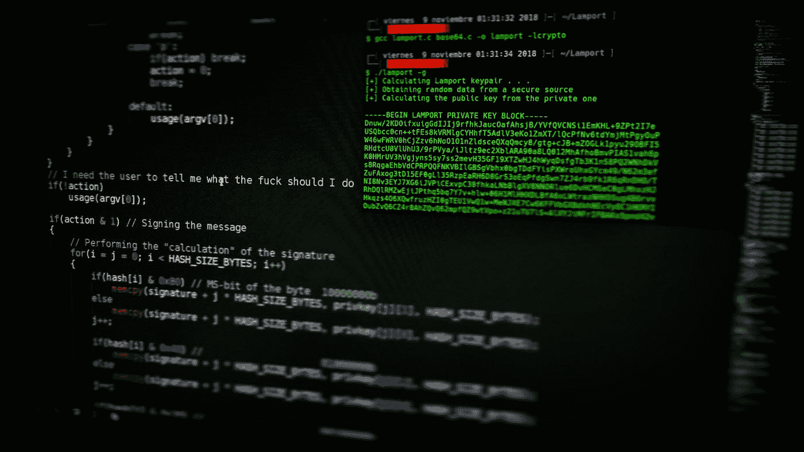
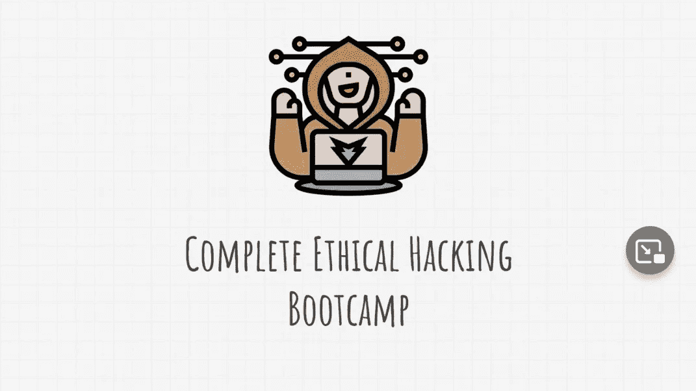
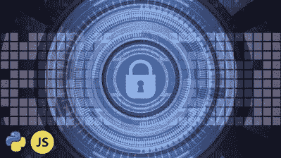
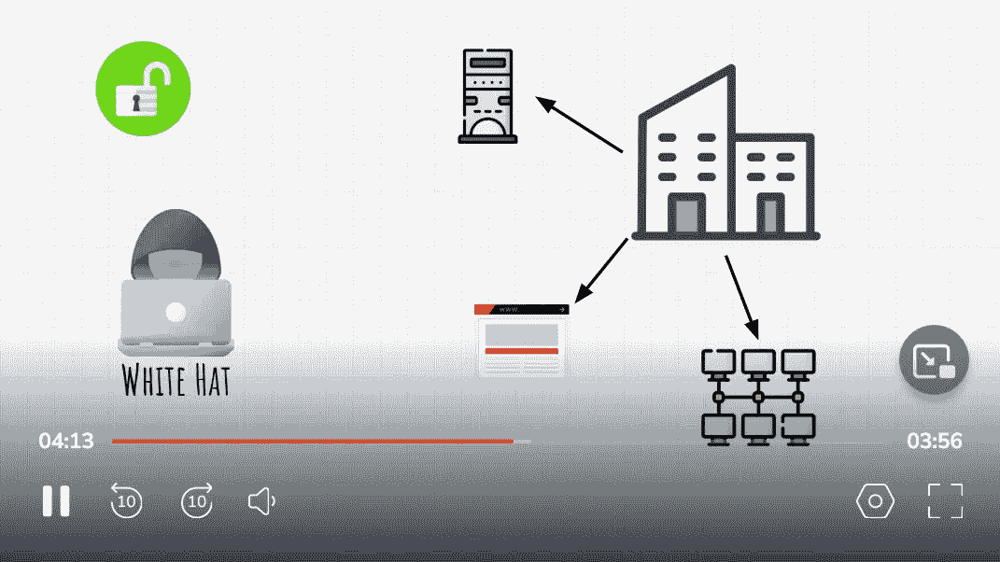

# 2023 年初学的 7 门 Kali Linux 在线课程

> 原文：<https://medium.com/javarevisited/6-best-kali-linux-courses-for-beginners-to-learn-online-da7f7139d8cb?source=collection_archive---------0----------------------->

## 我最喜欢的 2023 年学习 Kali Linux 的在线课程和教程，包括 Udemy，Coursera 和 Pluralsight 的最佳 Kali Linux 课程。

[阿吉特](https://unsplash.com/@arget?utm_source=medium&utm_medium=referral)在 [Unsplash](https://unsplash.com?utm_source=medium&utm_medium=referral) 上拍摄的照片

你好伙计们，如果你想成为网络安全专家，道德黑客，或渗透测试比你可能听说过卡琳 Linux，道德黑客和渗透测试专家的基本工具之一。

如果你不知道， [Kali Linux](https://www.kali.org/) 是进攻安全公司为道德黑客开发的基于 Linux 的开源 Debian 系统。它包含 400 多种分类工具，使安全研究人员可以轻松分析您的网络，测试系统安全性，发现 web 应用程序内部的不同漏洞，隐藏应用程序中的恶意软件，并针对 Android 手机。

如果你想在 2023 年学习 Kali Linux，并寻找最好的在线课程和免费教程来自学 Kali Linux，那么你来对地方了。前面我已经分享过 [**最佳道德黑客课程**](/javarevisited/6-best-ethical-hacking-courses-to-learn-online-fe1fe171d05) 和 [**最佳网络安全课程**](/javarevisited/7-best-cyber-security-courses-for-programmers-and-developers-50afafae050b) ，在他的文章里我准备分享给初学者的最佳 Kali Linux 课程。

这些 Kali Linux 课程是从像 [Udemy](/javarevisited/my-favorite-udemy-online-courses-for-programmers-and-software-engineers-f9d941dd0035) 、 [Coursera](/javarevisited/18-coursera-courses-you-can-join-in-2020-to-learn-from-the-worlds-top-tech-companies-google-74af46967d1e) 和 [Pluralsight](/javarevisited/10-best-react-courses-from-pluralsight-for-beginners-and-experienced-developers-80b7c640cca3) 这样的网站创建的，它们是那里最好的。它们是由专家创建的，受到成千上万想学习 Kali Linux 的人的信任。都是 4 星评级。

他们不仅教你基础知识和基本的 Kali Linux 概念，还教你必要的工具。最好的和最常用的工具之一叫做 **Metasploit** ，它用于利用许多不同的操作系统，如 windows，针对其大多数漏洞，并发现 web 应用程序中的安全弱点。

此外，你可以使用 aircrack-ng 找到网络密码和 sqlmap 来入侵网站的数据库。

该列表不仅包括付费课程，还包括免费教程和从 FreeCodecamp 和 Youtube 等热门网站学习 Kali Linux 的课程，你也可以加入他们，开始你的 Kali Linux 之旅，并在 2023 年成为一名更好的网络安全专业和道德黑客。

顺便说一句，如果你赶时间，那么你可以去查看一下 [**Kali Linux:从 Udemy 上的 Kali**](https://click.linksynergy.com/deeplink?id=JVFxdTr9V80&mid=39197&murl=https%3A%2F%2Fwww.udemy.com%2Fcourse%2Fkali-linux-start-your-ethical-hacking-with-kali-linux%2F) 课程开始你的道德黑客生涯，这是评价最高的最新课程之一，学习这个有用的工具，你现在只需在 Udemy 上花 10 美元就可以得到它，你不会后悔的。以防万一，它还提供 30 天退款保证。

# 2023 年初学者学习的 7 门最佳 Kali Linux 课程

在不浪费你更多时间的情况下，这里列出了 2023 年学习 Kali Linux 的最佳在线课程，供初学者和中级程序员、开发人员、系统管理员和 IT 专业人员使用。

## 1. [Kali Linux 初学者教程](https://click.linksynergy.com/deeplink?id=CuIbQrBnhiw&mid=39197&murl=https%3A%2F%2Fwww.udemy.com%2Fcourse%2Fkali-linux-tutorial-for-beginners%2F)【Udemy】

本课程将面向从未使用过 Kali Linux 的初学者。不过，您应该熟悉网络基础知识和黑客概念，如扫描和端口，并了解漏洞。

您将从在您的操作系统上安装 Kali Linux 以及如何使用预先构建的 Kali Linux 虚拟机开始本课程。

稍后，您将探索它的设计桌面，使用终端及其基本命令，并探索文件系统。

接下来，你将了解如何使用网络，管理用户，用 nano 软件编辑文件。然后你将使用它的黑客工具，执行端口扫描和密码攻击。你将学习如何破解密码和窃取信用卡。

**这里是加入本课程的链接**—[—*Kali Linux 初学者教程*](https://click.linksynergy.com/deeplink?id=CuIbQrBnhiw&mid=39197&murl=https%3A%2F%2Fwww.udemy.com%2Fcourse%2Fkali-linux-tutorial-for-beginners%2F)

## 2.[完成 ZTM 学院举办的 2023 年道德黑客训练营](https://academy.zerotomastery.io/a/aff_wffw8vsz/external?affcode=441520_zytgk2dn)

这是 2023 年学习 Kali Linux 和道德黑客的另一个很棒的资源。该课程由著名 Udemy 教练 Andrei Negaoie 创立的 [*ZTM 学院*](https://academy.zerotomastery.io/a/aff_fvgz1fnn/external?affcode=441520_zytgk2dn) 打造，代表零到精通学院。

这个课程旨在像训练一个道德黑客一样训练你，这样你就可以在 2023 年申请道德黑客和渗透测试员的工作。

完成本课程后，您将学习基本的道德黑客技能，如 Kali Linux，以及工具，如 NMAP。您将逐步学习使用 Kali Linux 和虚拟机设置您的实验室。

您还将学习黑帽黑客使用的真正技术，然后学习如何防御他们。

完成课程后，你将离成为安全专家更近一步，并通过从头开始学习道德黑客和渗透测试而在今年被录用。

**这里是加入本课程的链接**—[2023 年完整的道德黑客训练营](https://academy.zerotomastery.io/a/aff_wffw8vsz/external?affcode=441520_zytgk2dn)

顺便说一句，你需要一个 [**ZTM 会员**](https://academy.zerotomastery.io/a/aff_c0gnlvf7/external?affcode=441520_zytgk2dn) 才能观看这个课程，这个课程每月花费大约 39 美元，但也提供了许多像这样超级吸引人和有用的课程。您还可以使用优惠券代码 **FRIENDS10** 获得本课程或您选择的任何订阅的 10%折扣。

 [## 学习需求技能。被录用。推进你的事业。|零到精通

### 最终你是唯一能控制它的人。呵呵......每个人学习的速度不同，但是学生…

academy.zerotomastery.io](https://academy.zerotomastery.io/a/aff_c0gnlvf7/external?affcode=441520_zytgk2dn) 

## 3.[渗透测试和道德黑客](https://pluralsight.pxf.io/c/1193463/424552/7490?u=https%3A%2F%2Fwww.pluralsight.com%2Fcourses%2Fkali-linux-penetration-testing-ethical-hacking)

这是一门高级课程，包含 6 个小时的视频内容，讲述如何使用 Kali Linux 来利用许多系统，以及 it 专业人员如何使用它来发现漏洞。你会看到每个有道德的黑客进入系统应该遵循的不同阶段。

你从下载并安装 Kali Linux 开始，使用 Tor 匿名，然后使用信息收集工具收集尽可能多的目标信息，比如联系信息。

然后使用不同的网站黑客工具对网站进行入侵，窃取数据库。您还将学习网络黑客和执行嗅探从网络中窃取任何数据和执行社会工程，等等。

**这是参加本课程的链接**——[渗透测试和道德黑客](https://pluralsight.pxf.io/c/1193463/424552/7490?u=https%3A%2F%2Fwww.pluralsight.com%2Fcourses%2Fkali-linux-penetration-testing-ethical-hacking)

顺便说一下，你需要一个 [*Pluralsight 会员*](http://pluralsight.pxf.io/c/1193463/424552/7490?u=https%3A%2F%2Fwww.pluralsight.com%2Flearn) 才能加入这个课程，费用大约是每月 29 美元或每年 299 美元(14%的折扣)。我向所有程序员强烈推荐这个订阅，因为它提供了超过 7000 个在线课程的即时访问，以学习任何技术技能。或者，你也可以使用他们的 [**10 天免费试用**](http://pluralsight.pxf.io/c/1193463/424552/7490?u=https%3A%2F%2Fwww.pluralsight.com%2Flearn) 免费观看本课程。

 [## 为个人培养更好的技术技能| Pluralsight

### 培养从网络安全到软件开发等各方面的技能。然后利用这些技能…

pluralsight.pxf.io](http://pluralsight.pxf.io/c/1193463/424552/7490?u=https%3A%2F%2Fwww.pluralsight.com%2Flearn) 

## 4. [Kali Linux —新手黑客](https://click.linksynergy.com/deeplink?id=CuIbQrBnhiw&mid=39197&murl=https%3A%2F%2Fwww.udemy.com%2Fcourse%2Fkali-linux-hacking-for-beginners%2F)【Udemy 课程】

这是一个微型课程，包含超过 3 个小时的视频内容，面向希望进入网络安全世界的初学者，学习使用不同的工具来利用 web 应用程序中的各种漏洞，控制系统和网络，扫描它们，以及在一个课程中学习更多内容。

您将开始入侵系统，方法是使用 NMAP 扫描网络，找到开放的端口来利用它们，使用 CUPP 生成密码列表，并使用美杜莎进行暴力攻击。

稍后，您将使用 Metasploit 攻击不同的目标，并使用 HASHCAT & JOHN THE RIPPER 等工具破解加密的密码。稍后，您将使用 SQLmap 攻击网站，并学习网络钓鱼。

**这里是加入本课程的链接** — [Kali Linux —初学者黑客](https://click.linksynergy.com/deeplink?id=CuIbQrBnhiw&mid=39197&murl=https%3A%2F%2Fwww.udemy.com%2Fcourse%2Fkali-linux-hacking-for-beginners%2F)

## 5.[使用 Python、JavaScript 和 Kali Linux 进行道德黑客攻击](https://click.linksynergy.com/deeplink?id=CuIbQrBnhiw&mid=39197&murl=https%3A%2F%2Fwww.udemy.com%2Fcourse%2Fethical-hacking-with-python-javascript-and-kali-linux%2F)

本课程比以前的课程更全面，您将执行攻击不同目标的真实场景。您将使用 Python 语言和 JavaScript 创建您的有效负载(病毒)来探索特定的漏洞。

您将学习如何破解网络使用许多不同的工具，并执行各种行动，如 MITM 和窃取网络的数据。

然后你会学习 python 语言，用 python 做一个 mac 地址转换器，用 Tor 保持匿名。稍后，您将使用 [Python](https://javarevisited.blogspot.com/2021/05/python-interview-questions-answers-for-beginners.html) 创建恶意软件，学习 [JavaScript 语言](https://javarevisited.blogspot.com/2018/06/top-10-courses-to-learn-javascript-in.html)利用浏览器，并学习 web 应用渗透工具。

**这里是加入本课程的链接** — [用 Python、JavaScript 和 Kali Linux 进行道德黑客](https://click.linksynergy.com/deeplink?id=CuIbQrBnhiw&mid=39197&murl=https%3A%2F%2Fwww.udemy.com%2Fcourse%2Fethical-hacking-with-python-javascript-and-kali-linux%2F)

## 6.道德黑客的 Kali Linux(Kali Linux 教程)[免费]

如果你正在寻找学习 Kali Linux 的免费课程，那么这个 freeCodecamp 课程是 2023 年学习 Kali Linux 的绝佳资源。

在这个免费的 Kali Linux 课程中，您将学习 Kali Linux 的基础知识。

以下是您将在本课程中学到的内容

1.  如何安装 Kali Linux
2.  如何使用终端/命令行，
3.  bash 脚本
4.  道德黑客的工具和特性，等等。

该课程重点关注 Kali Linux，但大部分内容也适用于其他版本的 Linux，这意味着不仅是网络安全专业人员、Pen 测试人员或道德黑客，程序员和 DevOps 工程师也可以参加该课程来学习关键的 Linux 概念。

你可以在 YouTube、免费代码营 YouTube 频道或这里免费观看本课程

## 7.[完整的道德黑客课程](https://click.linksynergy.com/deeplink?id=CuIbQrBnhiw&mid=39197&murl=https%3A%2F%2Fwww.udemy.com%2Fcourse%2Fpenetration-testing%2F)【Udemy 课程】

另一个使用 Kali Linux 从零开始学习道德黑客的伟大课程，有超过 24 小时的视频内容，这是一个完整的道德黑客课程，只需要互联网连接和学习渗透测试技能的愿望。

你将从建立你的黑客环境开始，学习终端的一些基本命令行，然后你将学习如何通过隐藏你的 IP 和改变你的 mac 地址来匿名上网冲浪。

您将发现人们如何进入您的网络，并克隆您的接入点和 DNS 黑客。接下来，您将了解如何使用 SQL 注入和暴力破解密码来入侵网站。

**这是加入本课程的链接**——[完整的道德黑客课程](https://click.linksynergy.com/deeplink?id=CuIbQrBnhiw&mid=39197&murl=https%3A%2F%2Fwww.udemy.com%2Fcourse%2Fpenetration-testing%2F)

以上就是 2023 年**学习 Kali Linux 的最佳在线课程**。Kali Linux 是任何想成为网络安全专家、道德黑客或渗透测试者的必备技能之一。

好的一面是，你可以在几周内很容易地学会 Kali Linux，方法是加入这些课程中的一门，并进行练习，练习命令，理解 Kali Linux 的概念。

学习安全性将帮助您保护自己免受各种攻击，并防止人们利用您，然后控制整个公司，破坏他们的声誉或泄露您公司的关键数据。

您可能喜欢的其他**安全和渗透测试资源**

*   [2023 年通过 CompTIA Security+考试的 5 门最佳课程](https://javarevisited.blogspot.com/2020/06/top-5-courses-to-crack-comptia-security-certification-exam-sy0-501.html)
*   [7 门最佳 CompTIA PenTest+认证课程](/javarevisited/7-best-comptia-pentest-certification-courses-and-practice-tests-46d827689cdc)
*   [每个软件开发人员都应该学习的 10 件事](https://dev.to/javinpaul/10-things-every-software-developer-should-know-39pe)
*   [学习 Linux 命令行的 5 门免费课程](https://hackernoon.com/top-5-free-linux-courses-for-programmers-4a433b4edade)
*   [如何在 2023 年成为 DevOps 工程师](https://javarevisited.blogspot.com/2018/09/the-2018-devops-roadmap-your-guide-to-become-DevOps-Engineer.html)
*   [现代网络开发者应该学习的 10 件事](/javarevisited/10-things-aspiring-web-developers-should-learn-in-2021-6747bfbfc12e)
*   [十大移动应用开发框架和库](/@javinpaul/10-frameworks-and-libraries-mobile-application-developers-can-learn-in-2020-e0b91391cade)
*   [完整的 Java 开发者路线图](https://javarevisited.blogspot.com/2019/10/the-java-developer-roadmap.html)
*   [经验丰富的 Java 开发人员的五大职业选择](https://javarevisited.blogspot.com/2018/10/top-5-carrer-options-for-experienced-java-programmers.html)
*   [完整的前端和后端开发者路线图](https://javarevisited.blogspot.com/2019/02/the-2019-web-developer-roadmap.html)
*   2023 年 Java 程序员可以学习的 21 项技术技能
*   [破解任何编码面试的 5 个关键技巧](https://javarevisited.blogspot.com/2020/04/5-essential-skills-to-crack-coding-interviews.html)
*   [每个开发人员都应该学习的 10 个 Linux 命令选项](https://javarevisited.blogspot.com/2020/08/10-examples-of-essential-linux-commands.html#axzz6nH4euiJX)
*   [5 个免费学习 Python 编码的网站](https://javarevisited.blogspot.com/2019/09/5-websites-to-learn-python-for-free.html)
*   [面向开发人员和安全工程师的 7 门 Linux 课程](/javarevisited/7-best-linux-courses-for-developers-cloud-engineers-and-devops-in-2021-7415314087e1)

感谢您阅读本文。如果你喜欢这些*最好的 Kali Linux 在线课程和教程供初学者在 2023 年学习，那么*请与你的朋友和同事分享。如果您有任何问题或反馈，请留言。

**p . s .**——如果你渴望学习道德黑客并成为一名安全工程师，但负担不起这些课程或寻找免费的道德黑客和 Pen 测试课程，那么你也可以查看这个 [**Start Kali Linux，道德黑客和渗透测试！【免费】**](https://click.linksynergy.com/deeplink?id=JVFxdTr9V80&mid=39197&murl=https%3A%2F%2Fwww.udemy.com%2Fcourse%2Fethical-hacker%2F)Udemy 上的课程。它是完全免费的，已经有超过 27 万名学生加入了这门课程。

 [## 2023 年为初学者提供 10 门免费的道德黑客和渗透测试课程

### 我最喜欢的免费资源是从 Udemy、edX、Coursera 和……

medium.com](/javarevisited/10-free-courses-to-learn-ethical-hacking-and-penetration-testing-for-beginners-84e40104aa6c)