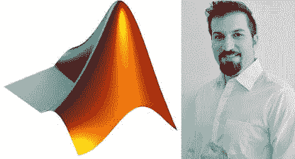
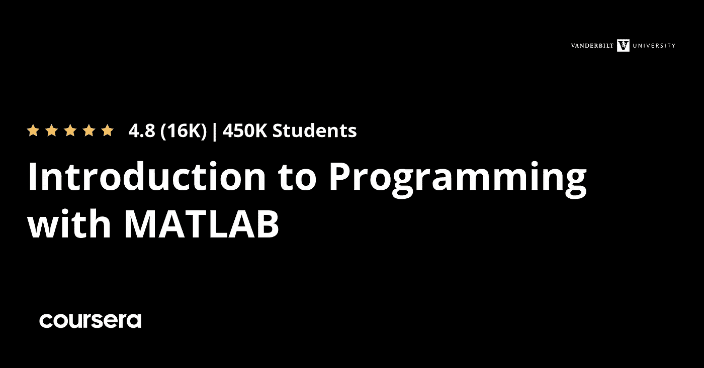
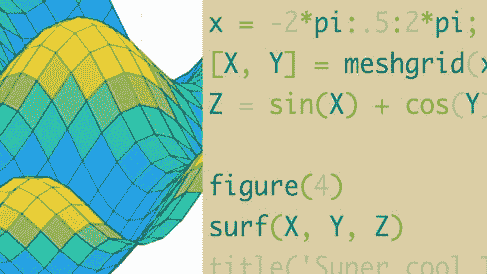
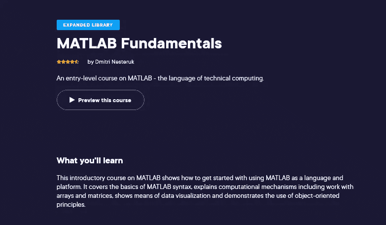

# 初学者在线学习的 6 门最佳 MATLAB 课程

> 原文：<https://medium.com/javarevisited/6-best-matlab-courses-for-beginners-to-learn-online-fc7642d05675?source=collection_archive---------3----------------------->

## 2023 年想学 MATLAB？以下是你可以参加的深入学习 MATLAB 的最佳在线培训课程

你在寻找顶尖的在线 MATLAB 课程吗？如果是这样，我们已经在网上收集了一份最好的云计算课程列表。为了让您有更多选择，我们提供了免费和付费课程。但首先，让我们澄清一个常见的误解:什么是 MATLAB？MATLAB 是一个编程环境，工程师和科学家可以使用它来研究和创建系统和产品。

MATLAB 语言是一种基于矩阵的语言，允许最自然地表示计算机数学，是 MATLAB 的核心。

# 2023 年学习 MATLAB 的 6 门最佳在线课程

IT 专业人员和相关领域的其他人可能会使用 MATLAB 来分析复杂的数据、设计算法、构建模型和应用程序！全世界学术界和工业界有数百万人在使用它。

## 1.[30 天成为一名优秀的 MATLAB 程序员](https://click.linksynergy.com/deeplink?id=CuIbQrBnhiw&mid=39197&murl=https%3A%2F%2Fwww.udemy.com%2Fcourse%2Fmatlab-programming-fundamentals%2F) (Udemy)

这个 Udemy 课程非常畅销，是为学生或刚开始学习 MATLAB 工作的人设计的。您将从头开始学习 MATLAB，对程序、变量、三角函数和矩阵有一个大致的了解。

*   完成时间:14 小时 58 分
*   价格:69.99 美元
*   课程评分:4.3/5(满分 5089 分)

然后你会逐渐进步到更复杂的科目和程序。高级制图技术、数据类型和结构、脚本、函数、M 文件等等都将在本课程的这一部分讲述。

本课程涵盖了全面的 MATLAB 培训，因此无论您的学位或研究领域如何，完成本课程后，您都应该能够完全解决任何工程和技术任务。

**这里是加入本课程的链接**——[成为一名优秀的 MATLAB 程序员 30 天](https://click.linksynergy.com/deeplink?id=CuIbQrBnhiw&mid=39197&murl=https%3A%2F%2Fwww.udemy.com%2Fcourse%2Fmatlab-programming-fundamentals%2F)

## 2.[MATLAB 编程入门](https://coursera.pxf.io/c/1193463/1164545/14726?u=https%3A%2F%2Fwww.coursera.org%2Flearn%2Fmatlab) (Coursera)

本课程旨在教授没有专业知识的计算机程序员如何使用和理解 MATLAB 编程系统。它的目标是向所有初学者展示 MATLAB 是灵活的，简单易学的，最重要的是，很有帮助。

这门课程是工程师和科学家专业 MATLAB 编程的一部分，你将从范德比尔特大学的教授那里学习关于 MATLAB 的一切。对 MATLAB 的快速介绍之后，将检查如何解决可能出现的任何困难，以及如何使用设计语言只用几行代码创建一个强大的程序。

*   完成时间:约 35 小时
*   费用:免费注册
*   课程评分:4.8/5(满分 14，569 分)

作为额外的奖励，您将在课程期间获得免费的 MATLAB 在线许可证，确保您拥有开始从事您的职业所需的一切。

**这里是加入本课程**——[MATLAB 编程入门](https://coursera.pxf.io/c/1193463/1164545/14726?u=https%3A%2F%2Fwww.coursera.org%2Flearn%2Fmatlab)的链接

顺便说一句，如果你计划参加多个 Coursera 课程或专业，那么考虑参加 [**Coursera Plus 订阅**](https://coursera.pxf.io/c/3294490/1164545/14726?u=https%3A%2F%2Fwww.coursera.org%2Fcourseraplus) ，它可以让你无限制地访问他们最受欢迎的课程、专业、专业证书和指导项目。它每年花费大约 399 美元，但很值得，因为你可以访问 7000 多门课程和项目，还可以获得无限的证书。

<https://coursera.pxf.io/c/3294490/1164545/14726?u=https%3A%2F%2Fwww.coursera.org%2Fcourseraplus>  

## 3.[学习 MATLAB](https://linkedin-learning.pxf.io/c/1193463/449670/8005?u=https%3A%2F%2Fwww.linkedin.com%2Flearning%2Flearning-matlab-2) (领英学习)

MATLAB 是一种受工程师和科学家欢迎的编程语言，这门课程的创建者 Steven Moser 想教你如何像专业人士一样使用它。

在本课程中，Steven 将向您展示如何使用 MATLAB 工具开发程序，让您能够对自己的数据和假设进行建模。您将学习如何构建基本变量和单元格数组，以及如何使用 MATLAB 的核心语法。

*   完成时间:1 小时 13 分钟
*   费用:1 个月免费试用
*   课程评级:不适用

接下来，您将学习如何编写脚本和函数，以及带有注释和照片的 2D 和 3D 绘图，以展示任何发现。

在这门广受欢迎的课程结束时，你应该能够在 MATLAB 上有效地处理大量数据。

**这里是加入本课程**——[学习 MATLAB](https://linkedin-learning.pxf.io/c/1193463/449670/8005?u=https%3A%2F%2Fwww.linkedin.com%2Flearning%2Flearning-matlab-2) 的链接

顺便说一下，你需要一个 LinkedIn Learning 会员才能观看这个课程，费用大约为每月*29.99 美元*，但你也可以通过参加他们的 [**1 个月免费试用**](http://linkedin-learning.pxf.io/c/1193463/449670/8005?u=https%3A%2F%2Fwww.linkedin.com%2Flearning%2Fsubscription%2Fproducts) 来免费观看这个课程，这是探索他们 17000 多门最新技术在线课程的一个好方法。

  

## 4. [MATLAB 基础](https://pluralsight.pxf.io/c/1193463/424552/7490?u=https%3A%2F%2Fwww.pluralsight.com%2Fcourses%2Fmatlab-fundamentals)【复数视线】

这门 Pluralsight 课程是为以前没有编程经验并希望从一个完全的新手进步到牢固掌握 MATLAB 原理的学生设计的。数组、矩阵、图形、控制结构、迭代语句、函数和 3D 可视化都将被涵盖。

*   完成时间:2h 5m
*   费用:14 天免费试用
*   课程评分:4.7 分
*   讲师——德米特里·内斯特鲁克

此外，还有各种实践类项目，旨在帮助您解决困难和发展您的独立学习技能。完成这些作业后，你应该可以轻松地使用 MATLAB 来处理数组或项目。

**这里是加入本课程的链接** — [MATLAB 基础](https://pluralsight.pxf.io/c/1193463/424552/7490?u=https%3A%2F%2Fwww.pluralsight.com%2Fcourses%2Fmatlab-fundamentals)

不过，你需要一个 [Pluralsight 会员](https://pluralsight.pxf.io/c/1193463/424552/7490?u=https%3A%2F%2Fwww.pluralsight.com%2Fpricing%2Fskills)才能加入这个课程，费用大约是每月 29 美元或每年 299 美元(14%的折扣)。我向所有程序员强烈推荐这个订阅，因为它提供了超过 7000 个在线课程的即时访问，以学习任何技术技能。或者，你也可以使用他们的 [**10 天免费通行证**](https://pluralsight.pxf.io/c/1193463/424552/7490?u=https%3A%2F%2Fwww.pluralsight.com%2Fpricing%2Ffree-trial) 来免费观看这个课程。

<https://pluralsight.pxf.io/c/1193463/424552/7490?u=https%3A%2F%2Fwww.pluralsight.com%2Fpricing%2Ffree-trial>  

## 5.在一个教程中学习 MATLAB 免费] {YouTUBE]

如果你正在 YouTube 上寻找学习 MATLAB 的教程或课程，那么这也是一个很好的教程，你可以在这里或 YouTube 上观看

## 6.[通过引导式解题掌握 MATLAB](https://click.linksynergy.com/deeplink?id=JVFxdTr9V80&mid=39197&murl=https%3A%2F%2Fwww.udemy.com%2Fcourse%2Fmaster-matlab-through-guided-problem-solving%2F)(Udemy)

本课程是为希望成为 MATLAB 编程和科学计算专家的学生设计的。它将帮助你提升你在工程、物理、生物、信息技术等领域的职业生涯！

顾名思义，本课程将引导您解决问题，帮助您实际掌握 MATLAB。你将学习用 MATLAB 解决难题的能力，而不是记忆语法规则。

*   完成时间:38 小时 1 分钟
*   价格:74.99 美元
*   课程评分:4.6/5(满分 3201 分)

这种动手学习的方法使您能够获得真实世界的应用经验，并以更多研究人员和行业专业人员使用的相同方式利用 MATLAB。

以下是加入本课程的链接— [通过引导式问题解决掌握 MATLAB](https://click.linksynergy.com/deeplink?id=JVFxdTr9V80&mid=39197&murl=https%3A%2F%2Fwww.udemy.com%2Fcourse%2Fmaster-matlab-through-guided-problem-solving%2F)

以上就是 2023 年**学习 Matlab 的最佳在线课程**。这些是最好的 Matlab 在线课程，来自流行的在线学习门户，如 Udemy、Pluralsight、LinkedIn Learning 和 Coursera，你可以加入它们从头开始学习 Matlab。不过，你不需要参加所有这些课程，选择那些你能和老师沟通的课程，并坚持下去。

如果你正在寻找一个划算的选择，那么 Udemy Matlab 课程最适合你，如果你有 Pluralsight 会员资格，那么 Pluralsight 的 Matlab 课程最适合你。