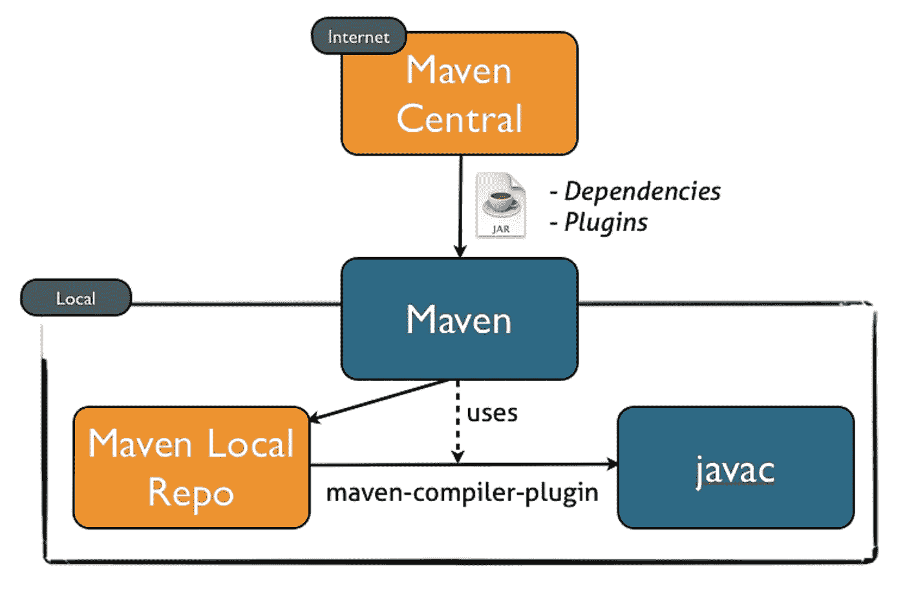
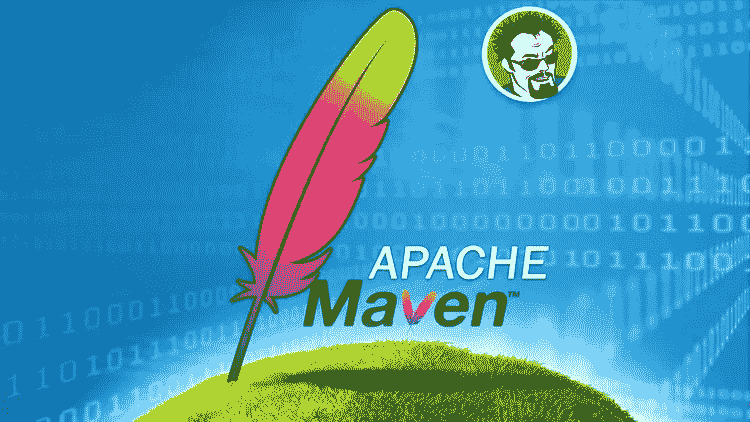
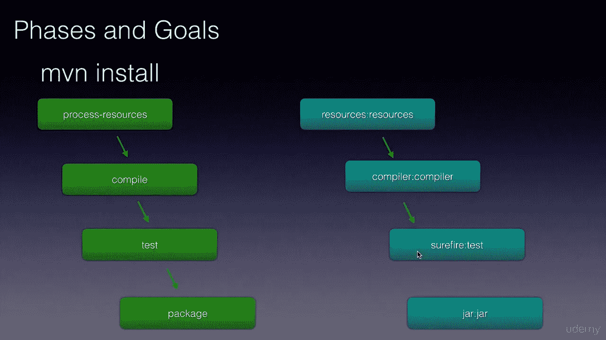
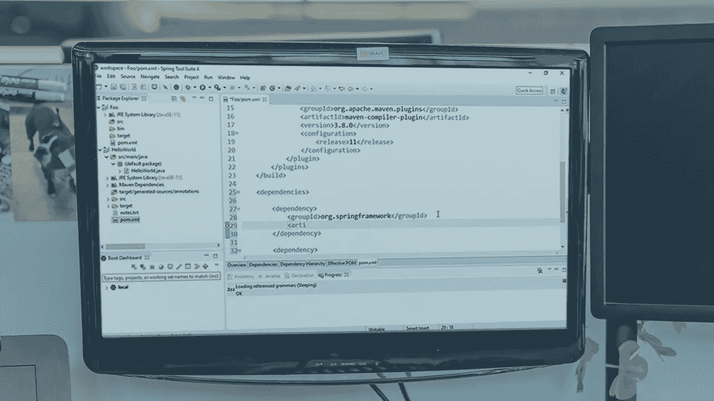
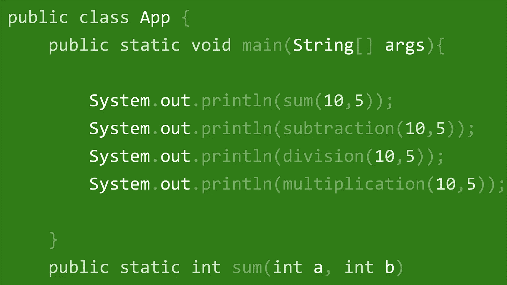

# 2023 年 Java 程序员学习 Maven 的 6 门最佳课程

> 原文：<https://medium.com/javarevisited/6-best-maven-courses-for-beginners-in-2020-23ea3cba89?source=collection_archive---------0----------------------->

## 这些是从 Udemy、Pluralsight 和其他在线学习门户网站为 Java 开发人员学习 Apache Maven 的最佳在线课程。

大家好，如果你想学习 Maven 并寻找最好的 Maven 课程，那么你来对地方了。前面我已经分享过 [**免费 Maven 和 Jenkins 课程**](/javarevisited/top-10-free-courses-to-learn-maven-jenkins-and-docker-for-java-developers-51fa7a1e66f6?source=collection_home---4------3-----------------------) 和 [**最佳 DevOps 课程**](/javarevisited/13-best-courses-to-learn-devops-for-senior-developers-in-2020-a2997ff7c33c) ，在本文中我将分享学习 Maven 这个 Java 开发者必备工具的最佳课程。

*披露—顺便说一句，其中一些链接是附属链接，如果你使用我的链接加入这些课程，我可能会得到报酬。*

Apache Maven 或通常称为“Maven”，是 Java 程序员的一个基本工具。它允许您构建项目、管理依赖项、生成文档，等等。

我可以保证 Maven 的有用性，因为我来自软件开发的 Maven 之前的世界，在那里你需要管理项目所需的所有 JAR 文件。对你来说，下载 JAR 文件似乎很容易，但实际上并不容易。

例如，您在项目中添加了一个新的库，比如说 [Spring framework](https://javarevisited.blogspot.com/2018/02/top-5-restful-web-services-with-spring-courses-for-experienced-java-programmers.html) ，它也需要 log4j，但是您认为 log4j 已经在那里了，所以您没有做任何事情，只是意识到您的应用程序不再启动，并且抛出了又长又复杂的错误。

这可能是因为版本不匹配，比如 Spring 需要比项目中可用的 log4j 版本更高的版本。这只是一个小小的例子，它展示了手动管理依赖关系是如何制造噩梦的。 [Maven](https://maven.apache.org/) 消除了所有这些痛苦，它不仅自动为您下载这些 JAR 文件，而且还创建了一个中心位置，称为 Maven repository，用于存储这些 JAR 文件以进行更好的管理。

顺便说一句，Maven 不仅仅是一个依赖管理工具，事实上它远不止于此。使用 Maven 的最大优势是遵循以下约定，这使得软件开发变得容易。

在一个 [Maven 项目](https://javarevisited.blogspot.com/2016/06/how-to-install-maven-in-on-windows-78-or-10.html#axzz5het8pfqP)中，你知道你的源代码在哪，你的测试代码在哪，你的资源在哪。你不需要花费无数的时间去浏览一个**大的 ANT 构建文件**来弄清楚你的工件到底是如何被创建的。

因为这些有用的品质，Java 生态系统慷慨地采用了 [Maven](https://javarevisited.blogspot.com/2019/03/top-5-course-to-learn-apache-maven-for.html) 。大部分开源项目都是 Maven 项目，让开发者很容易理解它们，更好地做出贡献。

# 面向 Java 开发人员的 5 门最佳 Maven 在线课程

即使 Gradle 正在取得进展，70%的市场仍在使用 Maven，这是学习 Maven 的一个足够大的理由。如果你也这样认为，这里有一些最好的课程可以让你自己在线学习 Apache Maven。

## 1. [Apache Maven:初学者到大师](https://click.linksynergy.com/deeplink?id=JVFxdTr9V80&mid=39197&murl=https%3A%2F%2Fwww.udemy.com%2Fapache-maven-beginner-to-guru%2F) (Udemy 最佳课程)

在本课程中，您将了解 Maven 构建生命周期，如何使用 Maven 构建和打包 Java 项目，了解如何将 Maven 与流行的备选 JVM 语言结合使用，包括 [Groovy](https://javarevisited.blogspot.com/2017/08/top-5-books-to-learn-groovy-for-java.html) 、 [Kotlin](https://javarevisited.blogspot.com/2018/02/5-courses-to-learn-kotlin-programming-java-android.html) 和 [Scala](https://javarevisited.blogspot.com/2019/01/5-free-scala-programming-courses-for-java-programmers-learn-online.html) 等。

我是约翰·汤姆逊的超级粉丝，听过他的春季 5 号课程[春季 5 号:从初学者到大师](https://click.linksynergy.com/fs-bin/click?id=JVFxdTr9V80&subid=0&offerid=323058.1&type=10&tmpid=14538&RD_PARM1=https%3A%2F%2Fwww.udemy.com%2Fspring-framework-5-beginner-to-guru%2F)我已经迷上了他的教学风格和信息传递。

当我发现 John 有一门 Maven 课程的时候，我立刻就买了，尽管我了解 Maven，也参与过几个 Maven 项目，包括一个**多模块 Maven 项目。虽然我并不失望，但这门课程帮助我弥补了学习中的一些不足。如果您没有任何专家经验，这将特别有用，因为从初学者的角度来看，信息密度是完美的。**

**这里是加入本课程的链接**——[Apache Maven:初学者到大师](https://click.linksynergy.com/deeplink?id=JVFxdTr9V80&mid=39197&murl=https%3A%2F%2Fwww.udemy.com%2Fapache-maven-beginner-to-guru%2F)

您还将学习如何配置 Maven 来运行用 JUnit 3、 [JUnit 4](https://javarevisited.blogspot.com/2012/06/junit4-annotations-test-examples-and.html) 、JUnit 5、TestNG 和 [Spock framework](https://javarevisited.blogspot.com/2018/01/10-unit-testing-and-integration-tools-for-java-programmers.html) 编写的单元和集成测试，从 XML 和 JSON 模式生成源代码，并在编译时为 Project Lombok 和 Mapstruct 利用注释处理。

该课程还涵盖了 Apache Maven 插件系统，并教你如何在构建生命周期中使用插件。

最后，您还将学习使用 Apache Maven 构建 [Spring Boot](http://www.java67.com/2018/06/5-best-courses-to-learn-spring-boot-in.html) 应用程序，了解 Spring Boot Maven 插件，将项目工件部署到 Maven 资源库，以及如何开发多模块 Maven 项目。

简而言之，这是掌握 Maven 的完美课程，对于中级和高级 Java 开发人员都是理想的。

## 2. [Maven 速成班](https://click.linksynergy.com/deeplink?id=JVFxdTr9V80&mid=39197&murl=https%3A%2F%2Fwww.udemy.com%2Fmavencrashcourse%2F)(初学者最佳课程)

我个人喜欢速成班，因为我总是很匆忙，没有太多时间投入。速成课程只会教你 20%的东西，但这些东西是你最需要的，而且用了 80%的时间。本课程也不例外，讲师 Bharath Thippireddy 在短短不到 3 个小时的时间里，为我们讲解了 Maven 的核心概念。

在本课程中，您不仅将学习 Maven 的所有[核心概念，还将动手创建一个多模块 Maven Java web 应用项目。如果你很着急，想学 Maven，这是你应该加入的课程。](https://javarevisited.blogspot.com/2017/06/10-maven-tips-java-developer-should-know.html)

该课程也适合初学者，因为它从头开始教 Maven 如何下载和安装 Maven，如何在命令行中使用，以及如何使用 m2eclipse 插件在 Eclipse 中创建 Maven web 应用程序。

以下是加入本课程的链接- [Maven 速成班](https://click.linksynergy.com/deeplink?id=JVFxdTr9V80&mid=39197&murl=https%3A%2F%2Fwww.udemy.com%2Fmavencrashcourse%2F)

## 3. [Maven 101](https://click.linksynergy.com/deeplink?id=JVFxdTr9V80&mid=39197&murl=https%3A%2F%2Fwww.udemy.com%2Fapachemaven%2F) (Udemy 课程)

101 种课程恰恰与速成课程相反，它们深入地覆盖了主题，如果你想深入学习 Maven，这是开始的完美课程。在这门实践课程中，你将学习如何使用 Maven 和其他工具，如 IDEs Eclipse 或 [IntelliJ IDEA](https://itnext.io/top-5-intellijidea-and-android-studio-courses-for-java-and-android-programmers-afcc27309b60) 以及版本控制工具，如 [Git](https://javarevisited.blogspot.com/2018/01/5-free-git-courses-for-programmers-to-learn-online.html) 或 [Github](https://hackernoon.com/top-5-free-courses-to-learn-git-and-github-best-of-lot-2f394c6533b0) 。正如我告诉你的，我知道 maven，并且已经使用 Maven 和 Eclipse 很多年了，但是通过这个课程，我学到了一些以前不知道的关于 Maven 的东西。

我觉得现在我对 maven 的整个生命周期/阶段/目标架构有了更好的理解，并且可以使用 Maven 和 Eclipse WTP 来创建基于 Maven 的 web 应用程序。

**这是加入本课程** — [Maven 101](https://click.linksynergy.com/deeplink?id=JVFxdTr9V80&mid=39197&murl=https%3A%2F%2Fwww.udemy.com%2Fapachemaven%2F) 的链接

## 4.[学习 Apache Maven](https://click.linksynergy.com/deeplink?id=JVFxdTr9V80&mid=39197&murl=https%3A%2F%2Fwww.udemy.com%2Flearning-apache-maven%2F)

这是学习 Maven 的一门极好的课程，有好的教师、清晰的解释，以及中级 Java 开发人员学习 Maven 所需的适当的信息深度。课程从教你如何构建项目开始，然后跳到依赖管理。在那里，凯文向你展示了 Maven 的生命周期、 [maven 命令](https://javarevisited.blogspot.com/2016/10/difference-between-mvn-install-release-and-deploy-in-Maven.html)和插件，包括插件参数和定制插件。

课程还涵盖了目标和插件，包括如何安装和部署一个插件。最后，您将了解原型、附加特性和 [.M2E Eclipse 插件](http://javarevisited.blogspot.sg/2016/08/top-10-maven-plugins-every-java-developer-know.html#axzz5E2uHdG3w)。一旦你完成了这个在线 Maven 课程，你应该能够使用现有的 Maven 项目并配置 Maven 来构建你自己的 Java 项目。

以下是加入 Maven 课程的链接— [学习 Apache Maven](https://click.linksynergy.com/deeplink?id=JVFxdTr9V80&mid=39197&murl=https%3A%2F%2Fwww.udemy.com%2Flearning-apache-maven%2F)

## 5.[布莱恩·汉森的 Maven 基本面](https://pluralsight.pxf.io/c/1193463/424552/7490?u=https%3A%2F%2Fwww.pluralsight.com%2Fcourses%2Fmaven-fundamentals)

在本课程中，Bryan 介绍了您需要了解的所有 Maven 基本概念，如目录结构、依赖项、插件、存储库、IDE 集成以及 Maven 的所有基本命令。

布莱恩·汉森是另一位我个人钦佩和追随的导师。参加过他的春季课程，如 [Spring Fundamentals](https://pluralsight.pxf.io/c/1193463/424552/7490?u=https%3A%2F%2Fwww.pluralsight.com%2Fcourses%2Fspring-framework-spring-fundamentals) 和 [What's New in Spring 5](https://pluralsight.pxf.io/c/1193463/424552/7490?u=https%3A%2F%2Fwww.pluralsight.com%2Fcourses%2Fwhats-new-spring-5) ，我知道他如何让事情变得更简单，这门课程也不例外。

该课程最近也进行了更新，涵盖了 Java SE 11 和 12 中的变化以及其他最新的 Maven 特性，这使得它更加有用。

**这里是加入本 Maven 课程**——[Maven 基础](https://pluralsight.pxf.io/c/1193463/424552/7490?u=https%3A%2F%2Fwww.pluralsight.com%2Fcourses%2Fmaven-fundamentals)的链接

唯一的问题是，你需要一个 Pluralsight 会员资格才能进入这门课程，费用大约是每月 29 美元或每年 299 美元。这一开始看起来可能有点贵，但它完全物有所值，因为你将获得 5000 多门关于最新技术的在线课程。

在学习上的一点点投入，可以获得丰厚的红利；因此，我建议所有程序员加入 Pluralsight。但是，即使你没有会员资格，你仍然可以利用他们的 [**10 天免费通行证**](http://pluralsight.pxf.io/c/1193463/424552/7490?u=https%3A%2F%2Fwww.pluralsight.com%2Flearn) **，**免费参加本课程，该通行证允许 200 分钟的观看时间，足以完成本课程。

 [## 个人技术技能|多视角

### 借助 Pluralsight，在开发运维、机器学习、云、安全基础设施等领域构建所需技能…

pluralsight.pxf.io](http://pluralsight.pxf.io/c/1193463/424552/7490?u=https%3A%2F%2Fwww.pluralsight.com%2Flearn) 

## 6. [Java:用 Maven 构建自动化](http://linkedin-learning.pxf.io/c/1193463/449670/8005?u=https%3A%2F%2Fwww.linkedin.com%2Flearning%2Fjava-build-automation-with-maven)

这是 LinkedIn Learning 为 Java 开发人员开设的中级 Maven 课程。在本课程中，您将学习如何使用 Maven 在 Java 中构建自动化，并回顾考虑添加到开发工作流中的其他特性和功能。

本课程由 Peggy Fisher 创建，将展示如何在 Mac 或 Windows 上安装 Maven，如何使用项目对象模型(POM ),以及如何使用其广泛的插件库进行编译、测试、部署、打包、报告等。

此外，您还将学习如何使用 Maven 和两种不同的 Java ide:NetBeans 和 IntelliJ 创建一个完整的从头至尾的项目。

这里是加入中级 Maven 课程的链接— [Java:用 Maven 构建自动化](http://linkedin-learning.pxf.io/c/1193463/449670/8005?u=https%3A%2F%2Fwww.linkedin.com%2Flearning%2Fjava-build-automation-with-maven)

顺便说一下，你需要 LinkedIn Learning 会员才能观看这门课程，每月费用约为 29.99 美元，但你也可以通过参加他们的 [**1 个月免费试用**](http://linkedin-learning.pxf.io/c/1193463/449670/8005?u=https%3A%2F%2Fwww.linkedin.com%2Flearning%2Fsubscription%2Fproducts) 来免费观看这门课程，这是探索他们 16000 多门最新技术在线课程的好方法。

 [## LinkedIn 学习价格|选择学习计划| LinkedIn

### 为 LinkedIn Learning 选择按月付费或按年付费

linkedin-learning.pxf.io](http://linkedin-learning.pxf.io/c/1193463/449670/8005?u=https%3A%2F%2Fwww.linkedin.com%2Flearning%2Fsubscription%2Fproducts) 

# Java 开发人员应该知道的关于 Maven 的 6 件事

如果您对学习 Maven 仍有疑问，这里有一些关于 Maven 的重要信息，它们将帮助您认识到它是 Java 开发人员最受欢迎的构建工具。Maven 拥有将近 70%的市场份额，20%的 Gradle 和 10%的 ANT。
2
。maven 是像 make 或 [ANT](https://javarevisited.blogspot.com/2015/01/difference-between-maven-ant-jenkins-and-hudson.html) 这样的构建工具，获取你的源代码并生成一个 JAR 文件，一个可分发的库。它还可以在您构建软件时运行测试并生成 Javadoc。它也有助于构建自动化。它允许每个开发人员开始相同的构建，以使相同的可部署性。

3。Maven 也是一个依赖管理工具——我们构建一个需要第三方库的应用程序。Maven 帮助带来这些 JAR 并使它们保持最新。maven 命令行工具——你可以在命令提示符下使用 Maven，但也可以在 IDE 中使用 Maven，就像 [Eclipse](http://www.java67.com/2018/02/5-free-eclipse-and-junit-online-courses-java-developers.html) 或 [IntelliJ IDEA](https://javarevisited.blogspot.com/2018/09/top-5-courses-to-learn-intellij-idea-java-and-android-development.html) 一样。

5。Maven 作为一个项目管理工具——它有助于告诉你在你的项目中使用了什么。它还可以在像 Nexus 这样的存储库中保存一个工件。
⑥
⑥。Maven 提供了一种构建软件的标准化方法，一种一致的方法，如源代码和测试目录，构建工件，因为它提倡**“约定优于配置”**

你可以进一步阅读我的帖子[Java 开发人员应该学习的 10 件 Maven 事情](https://javarevisited.blogspot.com/2017/06/10-maven-tips-java-developer-should-know.html#axzz6RfqBFilB)来了解更多关于 Maven 的信息，这里是 Java 应用程序中常见 Maven 生命周期的快照:

现在，如果你想学习 Maven，并且现在只想做一件事，我建议你加入 Udemy 上的 [**Apache Maven:初学者到大师**](https://click.linksynergy.com/deeplink?id=JVFxdTr9V80&mid=39197&murl=https%3A%2F%2Fwww.udemy.com%2Fapache-maven-beginner-to-guru%2F) 课程，它引人入胜，是最新的，并且足够全面，可以学习用于 Java 开发的 Maven。

以上是关于学习 Apache Maven 的一些**最佳课程。正如我所说的，Maven 是最流行的构建工具，你可以在大多数地方找到它。它提供了一个非常酷的优势，如依赖管理、构建自动化，并且它还与其他标准工具如 ide([Eclipse](https://javarevisited.blogspot.com/2016/09/3-maven-eclipse-tips-for-java-developers.html)、 [NetBeans](http://javarevisited.blogspot.sg/2017/03/10-tools-used-by-java-programming-Developers.html#axzz55lrMRnNC) 或 [IntelliJ IDEA](https://dzone.com/articles/top-5-intellij-idea-and-android-studio-courses-for) )和版本控制工具如 Git 和 Github 集成得很好。

其他**编程资源文章**您可能喜欢探索**

*   [2023 年 Java 开发者路线图](https://javarevisited.blogspot.com/2019/10/the-java-developer-roadmap.html)
*   [2023 年 Java 程序员应该学会的 10 件事](https://javarevisited.blogspot.com/2017/12/10-things-java-programmers-should-learn.html#axzz5atl0BngO)
*   [面向 Java 开发者的 5 门免费 Spring 框架课程](http://www.java67.com/2017/11/top-5-free-core-spring-mvc-courses-learn-online.html)
*   [10 门深入学习数据结构和算法的免费课程](http://www.java67.com/2019/02/top-10-free-algorithms-and-data.html)
*   [面向有经验的 Java 开发人员的 5 大 Java 设计模式课程](http://javarevisited.blogspot.sg/2018/02/top-5-java-design-pattern-courses-for-developers.html)
*   [编程/编码工作面试的 10 门课程](http://javarevisited.blogspot.sg/2018/02/10-courses-to-prepare-for-programming-job-interviews.html)
*   [学习 learn Shell 脚本的 5 门课程](http://javarevisited.blogspot.sg/2018/02/5-courses-to-learn-shell-scripting-in-linux.html)
*   [完整的 DevOps 开发者路线图](https://javarevisited.blogspot.com/2018/09/the-2018-devops-roadmap-your-guide-to-become-DevOps-Engineer.html)
*   [2023 年网络开发者路线图](https://javarevisited.blogspot.com/2019/02/the-2019-web-developer-roadmap.html)
*   [学习 Python 编程的 10 门免费课程](https://javarevisited.blogspot.com/2018/12/10-free-python-courses-for-programmers.html)
*   [如何在 2023 年成为一名 Moder React JS 开发者](https://javarevisited.blogspot.com/2018/10/the-2018-react-developer-roadmap.html)
*   [学习 Java 编程的 10 门免费在线课程](http://www.java67.com/2018/08/top-10-free-java-courses-for-beginners-experienced-developers.html)

非常感谢您阅读这篇文章。如果你喜欢这些 Maven 课程，那么请分享给你的朋友和同事。如果您有任何问题或反馈，请留言。

**P. S. —** 如果你是 Apache Maven 的完全初学者，并且如果你正在寻找一些免费的资料来开始你的 Maven 之旅，那么你也可以查看这个为 Java 程序员提供的 [**免费 Maven 课程**](http://www.java67.com/2018/02/6-free-maven-and-jenkins-online-courses-for-java-developers.html) 列表。

 [## 我最喜欢的 2023 年学 Maven，Jenkins，和 Docker 的免费课程

### Maven 和 Jenkins 是 Java 世界中最流行的两个工具。Maven 帮助组织您的项目并提供…

medium.com](/javarevisited/top-10-free-courses-to-learn-maven-jenkins-and-docker-for-java-developers-51fa7a1e66f6)