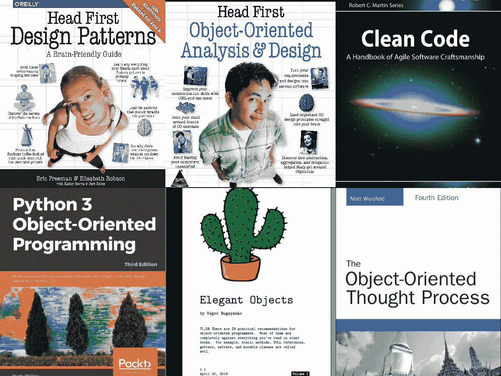
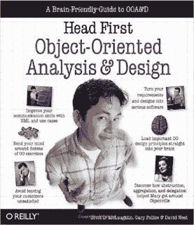
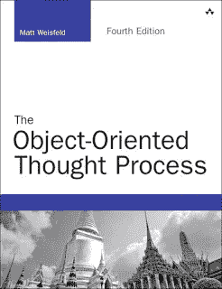
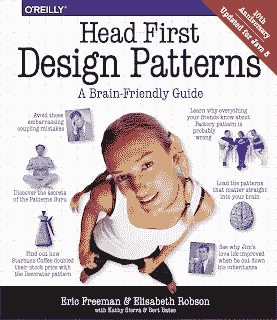
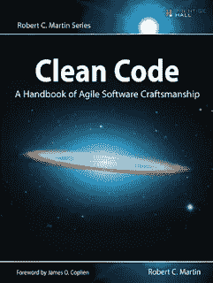
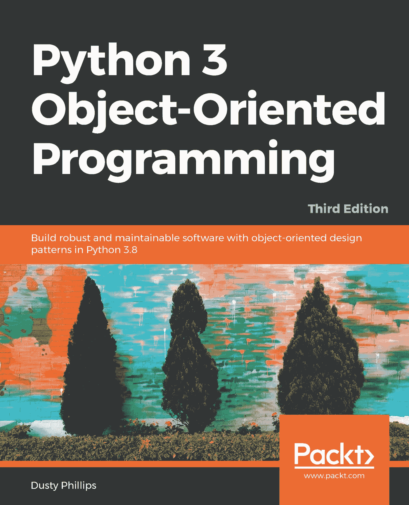

# 2023 年面向初学者的 6 本最佳面向对象编程书籍和课程

> 原文：<https://medium.com/javarevisited/6-best-object-oriented-programming-books-and-courses-for-beginners-d46235cbda49?source=collection_archive---------0----------------------->

## Head First 面向对象的分析和设计，优雅的对象，干净的代码，以及许多在线学习面向对象编程的最佳书籍和课程

大家好，如果你想学习 Java 或任何其他编程语言的面向对象编程，并寻找最好的面向对象编程书籍和课程，那么你来对地方了。

之前，我已经分享了针对有经验的开发人员的[最佳系统设计课程](/javarevisited/10-best-system-design-courses-for-coding-interviews-949fd029ce65) s、[最佳设计模式课程](/javarevisited/7-best-online-courses-to-learn-object-oriented-design-pattern-in-java-749b6399af59)以及 [**免费 OOP 课程**](/swlh/5-free-object-oriented-programming-online-courses-for-programmers-156afd0a3a73) ，在这篇文章中，我将分享 5 本适合初学者和中级程序员的最佳 OOP 书籍

OOP 或面向对象编程是最流行的编程范例之一，它可以帮助您在现实系统中组织代码。这是一个允许你通过思考对象和关系来编写复杂软件的工具。

不像它的前身过程式编程范例，它主要是由 C 实现的，C 通过为计算机编写代码来解决问题和完成任务， [OOP](http://www.java67.com/2015/12/top-30-oops-concept-interview-questions-answers-java.html) 风格的编程允许你根据现实世界中既有状态又有行为的对象来思考。

你可以把任何东西看成一个对象，然后找到它的状态和行为；这将帮助您在代码中模拟该对象。

可惜程序员不学 OOP，或过程化，或函数式编程；他们学习的是一种*编程语言，作为副作用，他们学习这些范例。由于很多开发者学习 [Java](/javarevisited/top-5-java-online-courses-for-beginners-best-of-lot-1e1e240a758) 、 [C++](http://www.java67.com/2018/02/5-free-cpp-courses-to-learn-programming.html) ，或者 [Python](/better-programming/top-5-courses-to-learn-python-in-2018-best-of-lot-26644a99e7ec) ，他们学习的是 OOP，但不是真正意义上的；因此，一个大学毕业生努力在实践中应用常见的 OOP 概念。

这就是为什么一个职业程序员需要读几本关于面向对象分析和设计的书，直到你知道学习 OOP 基础知识没有用，比如[抽象](http://javarevisited.blogspot.sg/2010/10/abstraction-in-java.html#axzz59Lhz7uVu)、[封装](https://javarevisited.blogspot.com/2012/03/what-is-encapsulation-in-java-and-oops.html)、[继承](http://www.java67.com/2016/03/top-21-java-inheritance-interview-Questions-Answer-Programming.html)或者[多态](http://javarevisited.blogspot.sg/2011/08/what-is-polymorphism-in-java-example.html)。重要的是在实践中应用这些原则的过程。

你还需要学会取舍，像*为什么复合比继承好*和*什么时候用抽象类 over 接口？你应该了解内聚性和耦合性，并且在编写软件时学习减少耦合性和内聚性的技巧，因为这些是编写一个经得起时间考验的可维护的应用程序的关键点。这些书为理解那些概念提供了足够的指导。如果你愿意，你也可以把这些书和一门在线课程结合起来，比如[**Java 面向对象编程绝对入门**](https://click.linksynergy.com/fs-bin/click?id=JVFxdTr9V80&subid=0&offerid=323058.1&type=10&tmpid=14538&RD_PARM1=https%3A%2F%2Fwww.udemy.com%2Fabsolute-introduction-to-object-oriented-programming-in-java%2F) 这样可以两全其美。我在 Udemy 上花了 10 美元买了一门很棒的课程来温习我的 OOP 技能。**

* [## Java 面向对象编程绝对入门

### Imtiaz 是一名屡获殊荣的 Udemy 讲师，在大数据技术和企业软件方面经验丰富…

udemy.com。](https://click.linksynergy.com/fs-bin/click?id=JVFxdTr9V80&subid=0&offerid=323058.1&type=10&tmpid=14538&RD_PARM1=https%3A%2F%2Fwww.udemy.com%2Fabsolute-introduction-to-object-oriented-programming-in-java%2F) 

# 用 Java 和 Python 学习面向对象编程、分析和设计的 6 本书

这里是我收集的 5 本学习面向对象编程、分析和设计的书。这个集合包含适合各种程序员的书籍。

它包括像 Head First Oriented Analysis and design 这样的书籍，对于初学者来说是极好的。它还包含像“优雅的对象”这样的书籍，发人深省，是有经验的开发人员的好读物。

列表中还包含了像**[**清洁代码**](https://www.amazon.com/Clean-Code-Handbook-Software-Craftsmanship/dp/0132350882?tag=javamysqlanta-20)**和**[**头先设计模式**](https://www.amazon.com/Head-First-Design-Patterns-Brain-Friendly/dp/0596007124/?tag=javamysqlanta-20) **，**这样的基本书籍，它们将教你如何应用 OOP 和[扎实的设计原则](https://dev.to/javinpaul/top-10-object-oriented-design-principles-for-writing-clean-code-4pe1https://pluralsight.pxf.io/c/1193463/424552/7490?u=https%3A%2F%2Fwww.pluralsight.com%2Fcourses%2Fprinciples-oo-design)写出更好的代码。******

> ****请记住，作为一名程序员，你的最终目标是编写更易于维护和扩展的软件，因为在软件世界中只有一件事是不变的，那就是**“变化”******

## ****1.[头先面向对象的分析与设计](https://www.amazon.com/Head-First-Object-Oriented-Analysis-Design/dp/0596008678/?tag=javamysqlanta-20)****

****这是学习面向对象概念和基础的最佳书籍。你将学习基础知识，如类、对象、封装、多态、[抽象](https://javarevisited.blogspot.com/2010/10/abstraction-in-java.html#axzz6oOeSmpNw)和继承，以及高级概念，如[组合](http://javarevisited.blogspot.sg/2013/06/why-favor-composition-over-inheritance-java-oops-design.html#axzz57Kv4wGXe)、委托、[关联](https://javarevisited.blogspot.com/2014/02/ifference-between-association-vs-composition-vs-aggregation.html#axzz5bnktTXS4)和聚合。这本书将帮助你从解决问题的角度去思考。他们会教你如何将状态和行为与对象联系起来。最重要的是，你会真正欣赏头先做的风格，这比讲故事要多得多。这是我最推荐给想要学习面向对象编程以及如何在现实应用中应用的初学者的书。你也可以将这本书与来自 Pluralsight 的 [**面向对象设计的坚实原则**](https://pluralsight.pxf.io/c/1193463/424552/7490?u=https%3A%2F%2Fwww.pluralsight.com%2Fcourses%2Fprinciples-oo-design) 课程相结合，后者涵盖了本书中更详细解释的 OOP 设计原则。由于这些设计原则对于编写好的面向对象的代码来说是非常关键的，所以在这个课程上花些钱是值得的。****

*********

## *****2.[优雅的物体](https://www.amazon.com/Elegant-Objects-1-Yegor-Bugayenko/dp/1519166915/?tag=javamysqlanta-20)*****

*****最近一段时间没看过比这本书更精彩的了。这本书包含了 23 条面向对象程序员利用面向对象编程技术的实用建议。*****

> *****顺便提一句，这本书非常固执己见。作者认为有些事情是不对的，因此，它没有遵循它。*****

*****按照他的说法，[静态方法](http://javarevisited.blogspot.sg/2013/03/can-we-overload-and-override-static-method-java.html)、[空引用](http://javarevisited.blogspot.sg/2014/12/9-things-about-null-in-java.html) s、[getter](http://javarevisited.blogspot.sg/2012/12/getter-and-setter-method-vs-public-modifier-field-java.html)、setters、[可变类](http://javarevisited.blogspot.sg/2017/04/does-making-all-fields-final-makes-a-class-Immutable-in-Java.html)都是恶，这在我看来是不正确的。没有什么比 100% OOP 应用程序更好的了，将来也不会有。真实的世界是一个深思熟虑的妥协，尽最大努力最有效地完成任务的世界。虽然我真的很喜欢读这本书，但它确实帮助我更好地思考事物。不过，我不会向任何初学者推荐这本书，但它是有经验的 OOP 程序员的必读之作。*****

*****如果你需要一门课程来配合这本书，我建议你去看看关于教育的 [**探索面向对象设计面试**](https://www.educative.io/collection/5668639101419520/5692201761767424?affiliate_id=5073518643380224) 课程。这是一门有趣的、基于文本的、交互式的课程，用来学习 OOP 和 OOAD。*****

**********

## *****3.[面向对象的思维过程](https://www.amazon.com/Object-Oriented-Thought-Process-Developers-Library/dp/0321861272/?tag=javamysqlanta-20)*****

*****顾名思义，这本书将教你如何用物体来思考。这是初学者学习 OOP 概念并将其应用于实际项目的另一本优秀书籍。*****

*****对于来自 C 和其他过程编程语言的程序员来说，这是一个很好的指南，在这里你可以为计算机编写指令来完成任务。这本书将教你如何通过应用基本的面向对象程序设计概念来构建被对象包围的复杂系统。简而言之，Matt Weisfeld 的《面向对象思维过程》是任何想要学习面向对象编程的初学者的必读之作。*****

*****如果你是 Java 程序员，或者想用 Java 学习 OOP，也可以把这本书和 Coursera 的 Java Specialization 中的 [**面向对象编程结合起来。这是学习 Java 面向对象编程最流行的 Coursera 认证之一。超过 70，000 名开发者已经加入其中。**](https://coursera.pxf.io/c/3294490/1164545/14726?u=https%3A%2F%2Fwww.coursera.org%2Fspecializations%2Fobject-oriented-programming)*****

**********

## *****4.[头先设计图案](https://www.amazon.com/Head-First-Design-Patterns-Brain-Friendly/dp/0596007124/?tag=javamysqlanta-20)*****

*****如果非要说一本书对我的编程生涯有最重大的影响，那就是这本书了。我是在 2007 年得到这本书的，当时我还是一名初级开发人员，刚从大学毕业，只有抽象、封装、类、对象或继承的理论知识。

这本书教会了我 [*为什么在很多情况下作文是比继承更好的选择*](http://javarevisited.blogspot.sg/2013/06/why-favor-composition-over-inheritance-java-oops-design.html#axzz57Kv4wGXe) 。这本书教会了我一个[接口](http://javarevisited.blogspot.sg/2014/11/why-use-interface-in-java-or-object-oriented-programming.html)的真正用法，以及如何通过给一个接口起名字比如 Flyable 来思考对象。*****

*****尽管这本书谈到了设计模式，这也是面向对象编程的一个重要部分，但它远不止于此。我强烈建议任何初级和中级程序员多看几遍前两章，以真正理解面向对象编程。*****

*****简而言之，学习面向对象编程和设计模式的最佳书籍之一。如果你愿意，也可以把这本书和 [**Java 设计模式——完整的 Masterclass**](https://click.linksynergy.com/deeplink?id=JVFxdTr9V80&mid=39197&murl=https%3A%2F%2Fwww.udemy.com%2Fcourse%2Fjava-design-patterns-the-complete-masterclass%2F) 结合起来看一些现场代码示例。*****

**********

## *****5.[干净的代码](https://www.amazon.com/Clean-Code-Handbook-Software-Craftsmanship/dp/0132350882?tag=javamysqlanta-20)*****

*****这本书在编码、面向对象编程、写出更好的代码等方面，对我的编程生涯帮助很大。当我已经有几年的经验时，我读了这本书，但是当我读它的时候，我意识到我在不知不觉中犯了很多错误。

这本书教会了我过程式编程和[面向对象编程的真正区别](http://www.java67.com/2015/12/top-30-oops-concept-interview-questions-answers-java.html)。它有优秀的代码示例来展示对象如何修改其状态，以及如何以面向对象的方式编写过程代码，例如使用面向对象技术用多态调用替换大 switch 语句。

这是本书，它也向世界传授了[基于面向对象概念的坚实的设计原则](http://javarevisited.blogspot.sg/2012/03/10-object-oriented-design-principles.html)。如果你真的想学习 OOP 的强大，并希望写出更好的代码，这本书值得一读。*****

*****并且，如果你需要一门课程来学习扎实的设计原则和干净的代码原则，那么 Udemy 的这门 [**软件架构(SOLID)&Java 中的设计模式**](https://click.linksynergy.com/deeplink?id=JVFxdTr9V80&mid=39197&murl=https%3A%2F%2Fwww.udemy.com%2Fcourse%2Fbasics-of-software-architecture-design-in-java%2F) 课程就是一个很好的伴侣。*****

**********

## *****6. [Python 3 面向对象编程](https://www.amazon.com/Python-3-Object-Oriented-Programming/dp/1849511268?tag=javamysqlanta-20)【书】*****

*****到目前为止，你所看到的所有书籍都使用 Java 作为编程语言来解释和教授你面向对象的编程，而概念是一般性的，如果你能从你喜欢的编程语言中找到例子就更好了，这本书对 Python 程序员也是如此。*****

*****这是最受欢迎的 Python 面向对象编程书籍之一，作者是 Dusty Philips，在这本书里，你将学习基本的 Python 数据结构、设计模式和有效的面向对象技术*****

*****本书深入分析了许多更适合 Python 独特风格的常见面向对象设计模式，您还将探索许多抽象设计模式，并在 Python 3.8 中实现它们。*****

*****在这个过程中，您还将学习最新的 Python 语法和库。简而言之，如果你想学习使用 Python 的面向对象编程，这是值得一读的书。如果你需要一门课程来陪伴你，那么 Coursera 上密歇根大学的[**Python 3 编程专门化**](https://coursera.pxf.io/c/3294490/1164545/14726?u=https%3A%2F%2Fwww.coursera.org%2Fspecializations%2Fpython-3-programming) 是一门很好的课程。*****

**********

*****以上是关于学习面向对象编程、分析和设计的一些最好的书。这些书是学习如何思考对象以及如何在复杂的现实世界场景中识别对象之间关系的绝佳资源。*****

*****虽然你要做的不仅仅是看书，但如果你此刻只想做一件事，那就去读读[**干净的代码**](https://www.amazon.com/Clean-Code-Handbook-Software-Craftsmanship/dp/0132350882?tag=javamysqlanta-20) 。

学习 OOP 分析与设计最好的方法是通过写代码和读代码。都是练出来的；你设计的系统越多，在你的问题领域应用 OOP 的概念越多，你学到的就越多。

不过，这些书将帮助你学习概念和 OOP 术语，这将帮助你更好地用 OOP 语言和 UML 图表达你的想法，这是一种广泛用于 [OOP 分析和设计](https://www.java67.com/2016/07/top-5-object-oriented-design-interview-questions.html)的工具。

其他**程序员和软件工程师推荐书籍**。*****

*   *****[学习 SQL 和数据库设计的前 5 本书](http://www.java67.com/2016/09/sql-5-best-books-to-learn-and-master.html)*****
*   *****[学习 Java 设计模式的前 5 门课程](https://javarevisited.blogspot.com/2018/02/top-5-java-design-pattern-courses-for-developers.html)*****
*   *****[学习面向对象分析与设计的前 5 门课程](https://javarevisited.blogspot.com/2018/08/5-object-oriented-programming-and-design-courses-for-Java-programmers.html)*****
*   *****每个程序员都应该读的 10 本书*****
*   *****[学习 Java 8 和函数式编程的前 5 本书](http://www.java67.com/2015/07/5-books-learn-java-8-functional-programming.html)*****
*   *****[给热心程序员的 10 本算法书](http://www.java67.com/2015/09/top-10-algorithm-books-every-programmer-read-learn.html)*****
*   *****[提高编程技能的 5 本必备书籍](http://www.java67.com/2016/02/5-books-to-improve-coding-skills-of.html)*****
*   *****[面向 Java 程序员的五大数据结构和算法书籍](http://javarevisited.blogspot.sg/2015/07/5-data-structure-and-algorithm-books-best-must-read.html)*****
*   *****[学习 OOP 设计模式的前 5 本书](http://www.java67.com/2016/10/top-5-object-oriented-analysis-and-design-patterns-book-java.html)*****
*   *****[程序员最佳核心 Java 书籍](http://javarevisited.blogspot.sg/2017/02/top-5-core-java-books-for-beginners.html)*****
*   *****[20+系统设计面试问题](https://www.java67.com/2018/05/top-20-system-design-interview-questions-answers-programming.html)*****
*   *****[五大面向对象设计面试问题](https://www.java67.com/2016/07/top-5-object-oriented-design-interview-questions.html)*****

*****感谢阅读这篇文章；如果你真的喜欢我的书籍推荐，请分享给你的朋友和同事。如果您有任何建议或反馈，请留言。
**p . s .——**这无疑是一个很难掌握的题目。有时，即使在读完这些书之后，你也需要有人能够真正向你展示如何应用面向对象分析来解决现实世界的问题。如果你有同样的感觉，你应该使用 Udemy 上的 UML 课程检查一下 [**高级面向对象的困难问题分析。这是一门高级课程，但包含了一些实用的技巧和技术。**](https://click.linksynergy.com/deeplink?id=JVFxdTr9V80&mid=39197&murl=https%3A%2F%2Fwww.udemy.com%2Fcourse%2Fadvanced-object-oriented-analysis-of-hard-problems%2F)*****

***** [## 使用 UML 对困难问题进行高级面向对象分析

### 我是 Soundtrap 的联合创始人之一，也是该公司的首席执行官，sound trap 是一项让音乐人在云中制作在线音乐的服务…

udemy.com](https://click.linksynergy.com/deeplink?id=JVFxdTr9V80&mid=39197&murl=https%3A%2F%2Fwww.udemy.com%2Fcourse%2Fadvanced-object-oriented-analysis-of-hard-problems%2F)*****