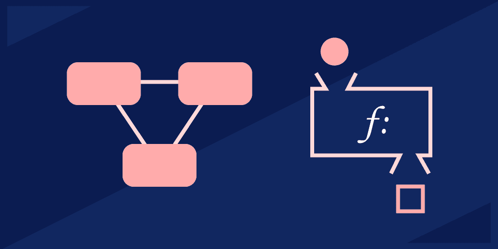
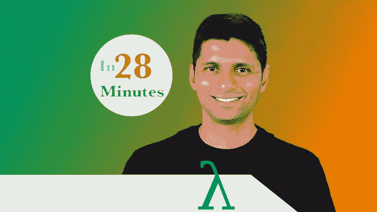
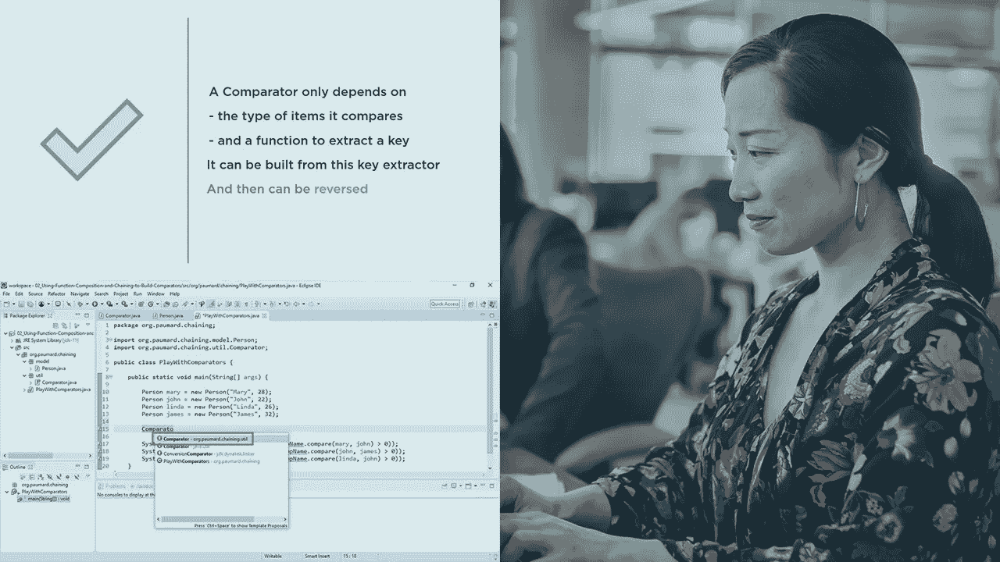
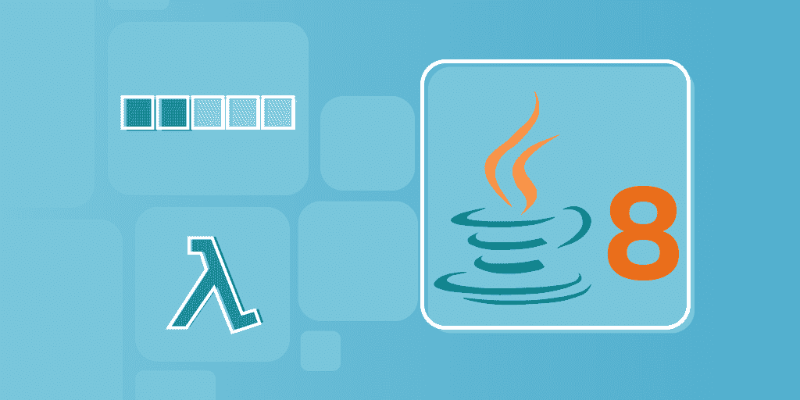
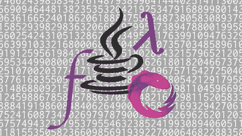

# 2022 年学习函数式编程的 6 门最佳 Java 在线课程

> 原文：<https://medium.com/javarevisited/6-best-online-courses-to-learn-functional-programming-in-java-for-beginners-1dab627b63ca?source=collection_archive---------1----------------------->

## 我最喜欢的来自 Udemy，Coursera，Pluralsight，Educative 的在线 Java 课程，学习用 Lambdas 和 Stream 用 Java 进行函数式编程。

image_credit —教育性

大家好，如果你想在 2022 年学习 Java 函数式编程，并寻找在线课程和书籍等最佳资源，那么你来对地方了。此前，我已经分享了[最佳 Java 在线课程](/javarevisited/10-best-udemy-online-courses-for-java-developers-4c9ab70cd01f)、[书籍](/javarevisited/5-tips-and-4-books-to-learn-java-programming-from-scratch-cbca21befed1)、[学习 Java 的最佳地点](/javarevisited/10-best-places-to-learn-java-online-for-free-ce5e713ab5b2)和 [**最佳 Java 并发课程**](/javarevisited/8-best-multithreading-and-concurrency-courses-for-experienced-java-developers-8acfd3b25094) ，在本文中，我将分享 2022 年加入的最佳 Java 函数式编程课程。

如果你还记得的话，Java 8 通过引入一些函数式编程概念，改变了我们通常用 Java 编码的方式。它带来了像 [lambda 表达式](/javarevisited/7-best-java-tutorials-and-books-to-learn-lambda-expression-and-stream-api-and-other-features-3083e6038e14?source=---------14------------------)和[流](/javarevisited/7-best-java-collections-and-stream-api-courses-for-beginners-in-2020-3ad18d52c38)这样的特性，这些特性催生了新的模式，从而在 Java 中产生干净的代码。

还记得兰姆达斯之前的日子吗？Java 开发人员不得不在 lambdas 中使用匿名样板类，这很快就会变得乏味且难以维护。

现在有了一种更好的、更具声明性的方式来编写 Java。如果你正确地使用它们，那么它们可以更好地表达代码的意图，从而更容易阅读和维护。

还有一点很多人忽略了，那就是函数式编程概念的引入，如[映射](https://www.java67.com/2015/01/java-8-map-function-examples.html)、[归约](https://www.java67.com/2016/09/map-reduce-example-java8.html)、[平面映射](https://javarevisited.blogspot.com/2016/03/difference-between-map-and-flatmap-in-java8.html)和[过滤器](https://www.java67.com/2018/03/java-8-stream-find-first-and-filter-example.html)，这些概念使我们能够用 Java 编写可读性更强、性能更好的代码。

如果你不知道函数式编程，或者想学习 Java 中的函数式编程，并寻找在线培训课程等最佳资源，那么你来对地方了。

在本文中，我将分享一些学习 Java 中函数式编程的优秀课程。这些课程将帮助你掌握函数式编程，并使用[流](https://www.java67.com/2014/04/java-8-stream-examples-and-tutorial.html)、[λ表达式](https://javarevisited.blogspot.com/2014/02/10-example-of-lambda-expressions-in-java8.html)、[函数接口](https://javarevisited.blogspot.com/2018/01/what-is-functional-interface-in-java-8.html#ixzz6YkAnyRbL)和[方法引用](https://javarevisited.blogspot.com/2017/03/what-is-method-references-in-java-8-example.html)编写独特的 Java 代码。

您还将学习和理解 map、reduce、flatmap、filter 等函数式编程模式，以及它们为何被添加到 Stream API 中，以及如何正确使用它们来编写高性能的 Java 应用程序。这些课程是为有经验的 Java 开发人员开设的，他们知道如何编写 Java 程序，并在 Java 上工作过一段时间。

如果你是一个 Java 世界的完全初学者，那么最好从更基础的东西开始，比如 [**《完整的 Java master class》**](https://click.linksynergy.com/fs-bin/click?id=JVFxdTr9V80&subid=0&offerid=323058.1&type=10&tmpid=14538&RD_PARM1=https%3A%2F%2Fwww.udemy.com%2Fjava-the-complete-java-developer-course%2F)，它涵盖了一个 Java 开发人员需要知道的一切，包括一些函数式编程基础知识。

<https://click.linksynergy.com/fs-bin/click?id=JVFxdTr9V80&subid=0&offerid=323058.1&type=10&tmpid=14538&RD_PARM1=https%3A%2F%2Fwww.udemy.com%2Fjava-the-complete-java-developer-course%2F>  

# 2022 年 6 门 Java 函数式编程初学者学习课程

函数式编程是在 Java 8 中引入 Java 的。Java 9 中增加了额外的函数式编程增强，这个列表提供了涵盖所有这些函数式编程特性的课程。不要再浪费你的时间了，下面是学习 Java 函数式编程的最佳课程:

## 1.[用 Lambdas & Streams](https://click.linksynergy.com/deeplink?id=JVFxdTr9V80&mid=39197&murl=https%3A%2F%2Fwww.udemy.com%2Fcourse%2Ffunctional-programming-with-java%2F) 学习 Java 函数式编程

这可能是从 Java 函数式编程开始的最好的 Udemy 课程。在这个动手课程中，我们将学习用函数式编程编写一些优秀的 Java 代码。

由[的 Java 开发者同行 Ranga Rao](https://click.linksynergy.com/deeplink?id=JVFxdTr9V80&mid=39197&murl=https%3A%2F%2Fwww.udemy.com%2Fuser%2Fin28minutes%2F) 打造，Udemy 畅销书导师，这是初学者学习函数式编程的最佳课程。

您不仅将学习 Java 函数式编程的基础知识，如 Lambda 表达式、方法引用、流和函数接口，还将通过解谜、练习和编写程序来实践这些概念。

本课程还使用了 [Eclipse (Java IDE)](/javarevisited/6-free-best-eclipse-ide-courses-for-java-programmers-1229ee9e5d87) ，如果您是 Java 新手，请不要担心；您还将学习如何设置它。如果你是函数式编程的新手，那么这是最好的入门课程。说到社会证明，已经有超过 16K 的学生注册了这门课程。

**这里是加入本课程的链接** — [用 Lambdas & Streams](https://click.linksynergy.com/deeplink?id=JVFxdTr9V80&mid=39197&murl=https%3A%2F%2Fwww.udemy.com%2Fcourse%2Ffunctional-programming-with-java%2F) 学习 Java 函数式编程

## 2.[在 Java 8 中使用 Lambda 表达式从集合到流，作者 Jose Paumard](https://pluralsight.pxf.io/c/1193463/424552/7490?u=https%3A%2F%2Fwww.pluralsight.com%2Fcourses%2Fjava-8-lambda-expressions-collections-streams)

这是学习 Java 函数式编程的又一门漂亮课程。本课程将向您展示 Java 8 中引入的新模式，它使用 lambda 表达式、函数接口、集合框架和流 API 来生成更简洁的 Java 代码。

本课程主要关注 o lambda 表达式，这是 Java 8 中引入的最重要的概念之一。Lambdas 是个好东西，但如果没有新的模式来处理数据，它将毫无用处。

您将了解 map、 [flatMap](https://javarevisited.blogspot.com/2016/03/difference-between-map-and-flatmap-in-java8.html) 、 [reduce](https://javarevisited.blogspot.com/2014/03/2-examples-of-streams-with-Java8-collections.html) 和 [filter](https://javarevisited.blogspot.com/2018/05/java-8-filter-map-collect-stream-example.html) 等内容，这将帮助您在 Java 中更好、更高效地处理批量数据，并创建更好的模式和代码。

**这里是加入本课程的链接** — [使用 Lambda 表达式在 Java 8 中从集合到流](https://pluralsight.pxf.io/c/1193463/424552/7490?u=https%3A%2F%2Fwww.pluralsight.com%2Fcourses%2Fjava-8-lambda-expressions-collections-streams)

## 3.[使用 Java 8 Lambda 实现设计模式](https://pluralsight.pxf.io/c/1193463/424552/7490?u=https%3A%2F%2Fwww.pluralsight.com%2Fcourses%2Fimplementing-design-patterns-java-8-lambda-expression)

如果您一直在使用现代 Java 语法编写代码，那么您可能想知道如何使用现代 Java 特性(如 Lambdas 和 Stream)实现经典设计模式(如 Strategy 和 State)。

本课程将教你如何使用[现代 Java 特性](https://javarevisited.blogspot.com/2018/08/top-5-free-java-8-and-9-courses-for-programmers.html)实现那些设计模式。它会帮助你写出流畅而直接的代码，更容易阅读和维护。

如果你不知道荷西，这门课的讲师是 Java 冠军，被认为是 Java 专家。这门课，以及我在这个列表中列出的另外两门课，给了你一个向专家本人学习的绝佳机会。

**这里是加入本课程的链接** — [使用 Java 8 Lambda 实现设计模式](https://pluralsight.pxf.io/c/1193463/424552/7490?u=https%3A%2F%2Fwww.pluralsight.com%2Fcourses%2Fimplementing-design-patterns-java-8-lambda-expression)

顺便说一下，你需要一个 [Pluralsight 会员](http://pluralsight.pxf.io/c/1193463/424552/7490?u=https%3A%2F%2Fwww.pluralsight.com%2Flearn)才能加入这个课程，费用大约是每月 29 美元或每年 299 美元(14%的折扣)。我向所有程序员强烈推荐这个订阅，因为它提供了超过 7000 个在线课程的即时访问，以学习任何技术技能。或者，你也可以使用他们的 [**10 天免费通行证**](http://pluralsight.pxf.io/c/1193463/424552/7490?u=https%3A%2F%2Fwww.pluralsight.com%2Flearn) 免费观看这个课程。

<http://pluralsight.pxf.io/c/1193463/424552/7490?u=https%3A%2F%2Fwww.pluralsight.com%2Flearn>  

## 4.面向有经验开发者的 Java 8:Lambdas，Stream API & Beyond

这是另一个关于函数式编程和 Java 8 的高级课程，来自教育性的、基于文本的交互式编码网站，在那里你可以在浏览器上运行代码。

本课程将教你使用 lambdas、streams 和函数式编程在 Java 8 中处理批量数据的高级模式。

你将学习如何使用 lambda 表达式和流 API 来编写更好的代码，以及其他几个基于集合和并发 API 的 Java 8 附魔。您还将学习如何在新的流和旧的集合类(如 ArrayList、Iterator 等)之间进行互操作。

您还将了解到 [Optional](https://javarevisited.blogspot.com/2017/04/10-examples-of-optional-in-java-8.html) ，这是 Java 8 中引入的一个新概念，用于处理空流的减少，通常被视为 Nulls 的救星，以及新的并发增强功能，如 [CompletableFuture](https://www.java67.com/2022/02/completablefuture-in-java-with-example.html) 和 StampedLock。

总的来说，这是一门学习使用 Stream、Optional 和 Collectors 在 Java 8 中处理数据的新模式的优秀课程。

**这里是加入本课程的链接** — [面向有经验开发者的 Java 8:Lambdas，Stream API & Beyond](https://www.educative.io/courses/java-8-lambdas-stream-api-beyond?affiliate_id=5073518643380224)

而且，如果你发现教育平台和他们的互动课程很有用，那么你还可以获得 [**教育订阅**](https://www.educative.io/subscription?affiliate_id=5073518643380224) ，它不仅提供这门课程，还提供他们的 210 多门课程，每月仅需 14.9 美元。它非常划算，非常适合准备编码面试

<https://www.educative.io/subscription?affiliate_id=5073518643380224>  

## 5. [Java Streams API 开发者指南](https://click.linksynergy.com/deeplink?id=JVFxdTr9V80&mid=39197&murl=https%3A%2F%2Fwww.udemy.com%2Fcourse%2Fjava-streams%2F)

这是另一个从 Java .util. Stream 包中学习和掌握 Stream 类及其类的动手课程。讲师纳尔逊·德加洛在解释令人困惑的函数式编程概念和方法方面做得非常出色，比如用一些现场代码示例解释了 [map](https://www.java67.com/2015/01/java-8-map-function-examples.html) 、 [reduce](http://www.java67.com/2016/09/map-reduce-example-java8.html) 、 [filter](https://www.java67.com/2016/08/java-8-stream-filter-method-example.html) 和 [flatmap](http://www.java67.com/2016/03/how-to-use-flatmap-in-java-8-stream.html) 。

他会先给你看代码，然后解释代码。同时，他还将向您展示如何更改代码来改变行为，这有助于您更好地学习那些流方法。

在这个过程中，您还将学习一些有用的键盘快捷键和生产率提示，以便使用最流行的 Java 开发 IDE[IntelliJIDEA](https://javarevisited.blogspot.com/2018/09/top-5-courses-to-learn-intellij-idea-java-and-android-development.html)。

**这是参加本课程** — [Java Streams API 开发者指南](https://click.linksynergy.com/deeplink?id=JVFxdTr9V80&mid=39197&murl=https%3A%2F%2Fwww.udemy.com%2Fcourse%2Fjava-streams%2F)的链接

## 6.[Java 中的函数式&反应式编程:现代风格](https://click.linksynergy.com/deeplink?id=CuIbQrBnhiw&mid=39197&murl=https%3A%2F%2Fwww.udemy.com%2Fcourse%2Ffunctional-programming-and-reactive-programming-in-java%2F)

这是 Udemy 的另一个精彩课程，学习 Java 中的函数式和反应式编程。它涵盖了 Lambda、Streams、Collectors、Collections、Optionals & RxJava 等内容

由[基础强](https://click.linksynergy.com/deeplink?id=CuIbQrBnhiw&mid=39197&murl=https%3A%2F%2Fwww.udemy.com%2Fcourse%2Ffunctional-programming-and-reactive-programming-in-java%2F)创建，这个课程对任何想学习函数式编程的人来说都是很棒的。

以下是您将在本课程中学到的内容:

*   Java 函数式编程基础
*   Java 中的反应式编程
*   溪流和平行溪流它们是如何在引擎盖下工作的
*   收藏家和收藏家如何在引擎盖下工作
*   RxJava 3.0
*   功能数据结构
*   功能方式的集合
*   Java 的高级概念，如可选的等等

总的来说，这是一门关于函数式编程主题的非常详细的课程，包含了大量的编程实践。它涵盖了所有的前景，如函数数据结构，函数设计模式，函数编程中的集合。

**这里是加入本课程的链接**——[函数式&Java 反应式编程:现代风格](https://click.linksynergy.com/deeplink?id=CuIbQrBnhiw&mid=39197&murl=https%3A%2F%2Fwww.udemy.com%2Fcourse%2Ffunctional-programming-and-reactive-programming-in-java%2F)

以上就是学习 Java 函数式编程的**最佳在线课程**。这些在线课程将为基本的函数式编程概念提供很好的介绍，如不变性和转换，如 map、flatmap、reduce 等。

即使你不是在寻找函数式编程，你也会学到很多有用的技巧和诀窍来编写更好的 Java 代码。多亏了 Java 8，代码更简洁、可读性更强、速度更快。

无论你在职业生涯的哪个阶段，总有提升的空间，或者找到更适合你目标的新领域。对于想要提高生产力(和职业发展)的 Java 开发人员，我强烈建议加倍学习 Java 8，因为它是专业开发中使用最广泛的。

Java 8 引入了许多新特性和 API，改变了代码的编写方式。简而言之，使用 Java 8 会让你成为一个更全面的开发人员，并且会给你带来很多机会。

其他**你可能喜欢的 Java 编程文章**

*   [2022 年 Java 开发者路线图](https://javarevisited.blogspot.com/2019/10/the-java-developer-roadmap.html)
*   【Java 开发人员必备的 10 个测试工具
*   [面向初学者和有经验程序员的 10 门免费 Java 课程](http://www.java67.com/2018/08/top-10-free-java-courses-for-beginners-experienced-developers.html)
*   [2022 年成为更好的 Java 程序员的 10 个技巧](http://javarevisited.blogspot.sg/2018/05/10-tips-to-become-better-java-developer.html)
*   [深入了解 Spring Boot 的五大课程](https://www.java67.com/2018/06/5-best-courses-to-learn-spring-boot-in.html)
*   [学习 Docker 和 Kubernetes 的 5 大课程](https://javarevisited.blogspot.com/2019/05/top-5-courses-to-learn-docker-and-kubernetes-for-devops.html)
*   [10 门免费数据结构与算法课程](http://www.java67.com/2019/02/top-10-free-algorithms-and-data.html)
*   [学习 Spring 框架的前 5 门课程](https://javarevisited.blogspot.com/2018/06/top-6-spring-framework-online-courses-Java-programmers.html)
*   [2022 年 Java 开发者应该学会的 10 件事？](https://javarevisited.blogspot.sg/2017/12/10-things-java-programmers-should-learn.html#axzz53ENLS1RB)
*   [学习 Java 集合框架的前 5 门课程](https://javarevisited.blogspot.com/2020/04/top-5-courses-to-learn-java-collections-and-streams.html)
*   [深入学习 Java 并发的 5 门课程](https://javarevisited.blogspot.com/2018/06/top-5-java-multithreading-and-concurrency-courses-experienced-programmers.html#axzz5kEPsvqbp)
*   [学习 Java 性能和 JVM 的前 5 门课程](https://javarevisited.blogspot.com/2019/04/top-5-courses-to-learn-jvm-internals.html)

感谢您阅读本文。如果你喜欢这些最好的 *Java 函数式编程课程，*那么请与你的朋友和同事分享。如果您有任何问题或反馈，请留言。

**P. S. —** 如果你是 Java 编程世界的新手，正在寻找一些免费课程来开始你的 Java 编程之旅，那么你也可以看看这个列表[**我最喜欢的面向初学者的免费 Java 课程**](/javarevisited/10-free-courses-to-learn-java-in-2019-22d1f33a3915) **。它包含了 Udemy、Coursera、Pluralsight 和 Educative 为初学者提供的一些最好的免费 Java 课程。**

</javarevisited/10-free-courses-to-learn-java-in-2019-22d1f33a3915> 