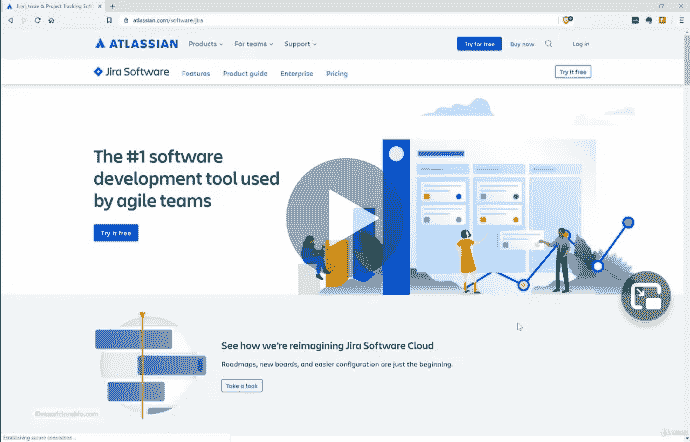
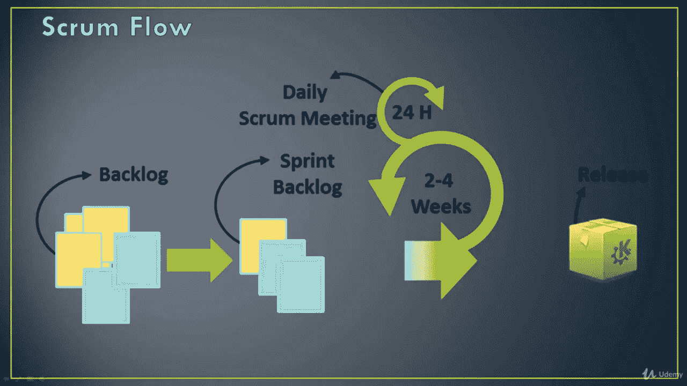
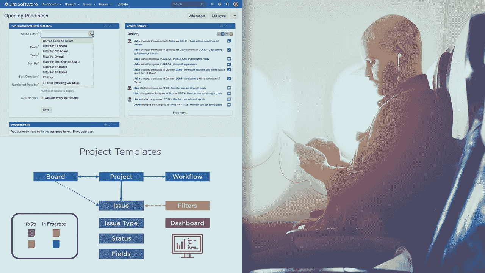
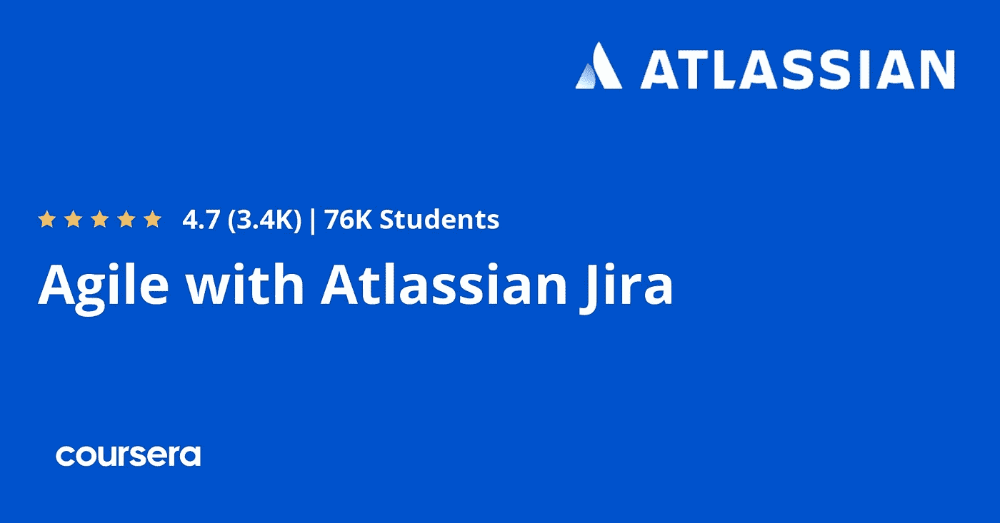

# 2023 年 6 个最佳 JIRA 课程、教程和培训班

> 原文：<https://medium.com/javarevisited/6-best-online-courses-to-learn-jira-for-beginners-and-experienced-it-professionals-4a21fb014520?source=collection_archive---------0----------------------->

## Udemy、Coursera 和 Pluralsight 为初学者和有经验的开发人员和项目经理收集了学习 JIRA 的最佳在线课程。

image _ courses—udemy

如果你在敏捷项目中工作，那么你会遇到 JIRA，它是计划、项目管理和 bug 跟踪最流行的工具之一。几乎所有的软件组织都在他们的软件开发中使用 JIRA，这使得它成为软件开发人员、团队领导、技术领导、T2 scrum master 和项目经理的基本工具。

如果你想在 2023 年学习 JIRA，并寻找最好的在线培训课程，那么你来对地方了。过去，我曾分享过[免费的敏捷课程](https://javarevisited.blogspot.com/2018/01/top-5-free-agile-courses-for-programmers.html#axzz5QneAh3Kg)和[书籍](https://javarevisited.blogspot.com/2017/06/top-5-books-to-learn-agile-and-scrum-methodology.html)，在这篇文章中，我将为初学者和有经验的开发人员分享**在线学习 JIRA 的最佳课程**。

这些是来自 [Udemy](https://click.linksynergy.com/deeplink?id=JVFxdTr9V80&mid=39197&murl=https%3A%2F%2Fwww.udemy.com%2F) 、 [Coursera](https://coursera.pxf.io/c/3294490/1164545/14726?u=https%3A%2F%2Fwww.coursera.org%2F) 和 [Pluralsight](/javarevisited/pluralsight-or-udemy-d9a94d2e8ee) 的顶级在线课程，由专家创建，受到成千上万开发者的信赖。你可以用它们来从头开始学习 JIRA，或者提升你的 JIRA 技能，如果你已经在使用它而不知道正确的话。

JIRA 是 Atlassian 公司提供的一款用于问题和 bug 跟踪的综合软件，但是现在该公司已经将其开发成为一款完整的工具，不仅可以跟踪 bug，而且还是一款强大的管理工具，可以更有效地组织您的团队工作流程。

市场上有许多 JIRA 的替代软件与之竞争，但有一些特殊之处让你选择 JIRA 而不是其他软件，因为它拥有管理你的项目或公司内部团队所需的一切，你还可以根据你的团队工作流程或需求定制它，还有许多其他功能，等等。如果你正在一个团队中创造产品，或者一个企业主想学习如何组织你的团队和工作，你可以看看一些在线课程，教你如何使用 JIRA 来提高工作效率和成果。

# 2023 年初学者学习的 6 门最佳 JIRA 在线课程

这里列出了一些最好的在线培训课程，你可以参加这些课程来从头开始学习 JIRA。这个列表包含动手和参与 JIRA 课程，这些课程是由专家创建的，受到成千上万的开发人员和项目经理的信任，以学习 JIRA。

它们也很实惠，尤其是 Udemy 的 JIRA 课程，你只需花 10 美元就能在定期举行的 Udemy 大减价上买到。

## 1.[吉拉速成班|吉拉敏捷项目基础](https://click.linksynergy.com/deeplink?id=JVFxdTr9V80&mid=39197&murl=https%3A%2F%2Fwww.udemy.com%2Fcourse%2Fjira-online-training-atlassian%2F)

这是在 Udemy 上从零开始学习 JIRA 的最好的在线课程之一。如果你是吉拉的初学者，想学习这个软件的基本原理，或者你是团队工作，想让你的工作流程更有效率，那么考虑在 Udemy 上讲述这个课程。

你将从介绍吉拉和该软件的历史开始，然后继续学习如何使用该软件及其组件和 Jira 的一些真实世界的 scrum 板，以及如何创建报告等等。

你将在本课程中学到:

*   吉拉基础。
*   JIRA 历史。
*   使用 JIRA 的好处。

**这里是加入本课程的链接** — [吉拉速成班|吉拉敏捷项目基础](https://click.linksynergy.com/deeplink?id=JVFxdTr9V80&mid=39197&murl=https%3A%2F%2Fwww.udemy.com%2Fcourse%2Fjira-online-training-atlassian%2F)

## 2.[通过真实世界的例子学习 JIRA(+融合奖金)](https://click.linksynergy.com/deeplink?id=JVFxdTr9V80&mid=39197&murl=https%3A%2F%2Fwww.udemy.com%2Fcourse%2Fthe-complete-guide-to-jira-with-real-world-examples%2F)

这可能是学习 JIRA 和汇流的最好的 Udemy 课程。让我们假设你在软件开发团队工作，你的老板告诉你，你需要学习 JIRA，以便以更有效的方式管理工作流，所以你现在需要学习吉拉，并通过一些实际例子来理解它，这就是本课程的内容。

您将在本课程中学到以下内容:

*   JIRA 基础及其优势。
*   使用 JIRA 作为管理员。
*   使用吉拉领导敏捷团队。

从介绍吉拉以及为什么应该使用它开始，然后继续介绍敏捷团队如何使用这个工具来管理他们的工作，例如创建问题、搜索过滤器和仪表板定制。您还将通过一些真实的例子了解如何领导一个敏捷团队和 JIRA 管理员。

**这是加入本课程的链接** — [通过真实世界的例子了解 JIRA](https://click.linksynergy.com/deeplink?id=JVFxdTr9V80&mid=39197&murl=https%3A%2F%2Fwww.udemy.com%2Fcourse%2Fthe-complete-guide-to-jira-with-real-world-examples%2F)

## 3. [JIRA 基础](https://pluralsight.pxf.io/c/1193463/424552/7490?u=https%3A%2F%2Fwww.pluralsight.com%2Fcourses%2Fjira-fundamentals-update)【复视课程】

如果你的职位是一家从事软件开发的公司，你想学习如何使用 JIRA 管理你的项目，那么这个 Pluralsight JIRA 课程非常适合你。

这是一个小课程，很像 Jira 的速成班，教你吉拉的基本知识，如规划和安装，以及配置 JIRA。

从 JIRA 的一些概念开始，然后转到如何规划您的 JIRA 设置，如服务器和吉拉云，然后您将看到该软件在云上的安装，以及如何设置您的项目创建问题。最后，您将看到如何创建报告仪表板，等等。

在本课程中，您将学到以下内容:

*   JIRA 基础。
*   在云上安装吉拉。
*   使用吉拉创建问题和报告。

**这里是加入本课程的链接** — [JIRA 基础](https://pluralsight.pxf.io/c/1193463/424552/7490?u=https%3A%2F%2Fwww.pluralsight.com%2Fcourses%2Fjira-fundamentals-update)

顺便说一下，你需要一个 [Pluralsight 订阅](https://pluralsight.pxf.io/c/1193463/424552/7490?u=https%3A%2F%2Fwww.pluralsight.com%2Flearn)来观看这个课程，费用大约是每月 29 美元或每年 299 美元(14%的折扣)。如果你还没有 Pluralsight 会员资格，那么我强烈建议你注册一个，因为它可以通过他们庞大的在线课程库极大地促进你的学习。或者，你也可以使用他们的 [**10 天免费试用**](https://pluralsight.pxf.io/c/1193463/424552/7490?u=https%3A%2F%2Fwww.pluralsight.com%2Flearn) **免费观看本课程。**

 [## 个人技术技能|多视角

### 借助 Pluralsight，在开发运维、机器学习、云、安全基础设施等领域构建所需技能…

pluralsight.pxf.io](https://pluralsight.pxf.io/c/1193463/424552/7490?u=https%3A%2F%2Fwww.pluralsight.com%2Flearn) 

## 4.[敏捷与亚特兰蒂斯 JIRA](https://coursera.pxf.io/c/3294490/1164545/14726?u=https%3A%2F%2Fwww.coursera.org%2Flearn%2Fagile-atlassian-jira) 【最佳 Coursera 课程】

如果你正在领导一个软件开发团队，并且你想学习吉拉作为一名管理员来管理你团队的工作流程，那么你可能需要在 Coursera 上看看这个课程。这可能是在 [Coursera](https://coursera.pxf.io/c/3294490/1164545/14726?u=https%3A%2F%2Fwww.coursera.org%2F) 上学习敏捷和 JIRA 的最好课程。

从如何使用吉拉及其基础工具的一些基本概念开始，然后介绍一些 scrum 概念，比如如何创建报告和事件。最后，您将了解如何配置吉拉工具以匹配您团队的工作流。

你将在本课程中学到的东西:

*   JIRA 基础。
*   创建 scrum 报告。
*   配置吉拉工具。

**这是参加本课程的链接**——[与 JIRA 亚特兰蒂斯的敏捷](https://coursera.pxf.io/c/3294490/1164545/14726?u=https%3A%2F%2Fwww.coursera.org%2Flearn%2Fagile-atlassian-jira)

顺便说一句，如果你计划参加多个 Coursera 课程或专业，那么考虑参加 [**Coursera Plus 订阅**](https://click.linksynergy.com/deeplink?id=JVFxdTr9V80&mid=40328&murl=https%3A%2F%2Fwww.coursera.org%2Fcourseraplus) ，它为你提供无限制的访问他们最受欢迎的课程、专业、专业证书和指导项目的机会。它每年花费大约 399 美元，但它完全值得你的钱，因为你可以获得无限的证书。

 [## Coursera Plus |无限制访问 3000 多门在线课程

### 用 Coursera Plus 投资你的职业目标。无限制地访问 90%以上的课程、指导项目…

coursera.com](https://click.linksynergy.com/deeplink?id=JVFxdTr9V80&mid=40328&murl=https%3A%2F%2Fwww.coursera.org%2Fcourseraplus) 

## 5.[完整的 JIRA 敏捷项目管理课程](https://click.linksynergy.com/deeplink?id=JVFxdTr9V80&mid=39197&murl=https%3A%2F%2Fwww.udemy.com%2Fcourse%2Fthe-complete-jira-agile-project-management-course%2F)

本文的最后一个课程是一个简短而完整的课程，讲述了如何将 JIRA 云作为敏捷团队的项目管理工具。这个 Udemy 课程也是我学习 JIRA 最喜欢的课程之一。

本课程从介绍吉拉软件开始，然后创建你的第一个 Jira 项目，探索如何创建不同的吉拉问题，以及创建有效的 [scrum](https://javarevisited.blogspot.com/2017/06/top-5-books-to-learn-agile-and-scrum-methodology.html) 和看板，以及如何定制它等等。

以下是您将在本课程中学到的关键技能:

*   JIRA 软件基础。
*   创建不同的问题类型。
*   定制您的主板。

**这里是加入本课程的链接**——[完整的 JIRA 敏捷项目管理课程](https://click.linksynergy.com/deeplink?id=JVFxdTr9V80&mid=39197&murl=https%3A%2F%2Fwww.udemy.com%2Fcourse%2Fthe-complete-jira-agile-project-management-course%2F)

## 6.[软件测试大师+吉拉+现场应用敏捷——成为团队领导者](https://click.linksynergy.com/deeplink?id=JVFxdTr9V80&mid=39197&murl=https%3A%2F%2Fwww.udemy.com%2Fcourse%2Flearn-software-testing-in-practical-become-a-qa-expert%2F)

这是 Udemy 为测试经理和团队领导提供的另一个很棒的 JIRA 课程。该课程由传奇人物 Rahul Shetty 创建，他是测试专家之一，也是广受欢迎的 Udemy 讲师，该课程将向您传授测试人员应该了解的关于 JIRA 的一切知识。

对于任何想在软件测试领域开始职业生涯的人，以及没有任何软件行业经验，但想通过展示真实经验进入行业的人来说，这是一门极好的课程

**这是参加本课程的链接**——[软件测试大师+吉拉+敏捷 on Live App——成为团队领导者](https://click.linksynergy.com/deeplink?id=JVFxdTr9V80&mid=39197&murl=https%3A%2F%2Fwww.udemy.com%2Fcourse%2Flearn-software-testing-in-practical-become-a-qa-expert%2F)

以上就是关于**初学者和有经验的程序员学习 JIRA 的最佳在线课程**。JIRA 对于初学者和有经验的开发人员来说都是必不可少的工具，但对于高级开发人员、团队领导、业务分析师和项目经理来说更是如此。创建软件跟踪 bug 和组织你的团队有时会很困难，你需要一些工具或服务来使这一切尽可能简单，以便使你公司的工作流程更有效，这就是 JIRA 软件发挥作用的地方。

其他**编程文章**你可能喜欢

*   [完整的 Java 开发者路线图](https://javarevisited.blogspot.com/2019/10/the-java-developer-roadmap.html#axzz6N3akNoox)
*   [面向 Java 和 DevOps 专业人员的 10 门免费 Docker 课程](https://javarevisited.blogspot.sg/2018/02/10-free-docker-container-courses-for-Java-Developers.html)
*   [我最喜欢为有经验的人学习 DevOps 的课程](https://javarevisited.blogspot.com/2018/09/10-devops-courses-for-experienced-java-developers.html)
*   [2023 年 Java 开发人员应该学习的 10 种工具](http://www.java67.com/2018/04/10-tools-java-developers-should-learn.html)
*   [5 免费弹簧框架和 Spring Boot 课程](http://www.java67.com/2017/11/top-5-free-core-spring-mvc-courses-learn-online.html)
*   [学习 Jenkins 自动化和开发运维的五大课程](https://javarevisited.blogspot.com/2018/09/top-5-jenkins-courses-for-java-and-DevOps-Programmers.html)
*   [2023 年学习 Kubernetes 的 7 门免费在线课程](/javarevisited/7-free-online-courses-to-learn-kubernetes-in-2020-3b8a68ec7abc)
*   [完整的 DevOps 开发者路线图](/hackernoon/the-2018-devops-roadmap-31588d8670cb)
*   [学习亚马逊网络服务我最喜欢的课程](https://javarevisited.blogspot.com/2020/05/top-5-amazon-web-services-aws-courses-for-beginners-and-experienced-programmers.html)
*   [学习 Docker、Kubernetes 和 Jenkins 的 10 门免费课程](/javarevisited/top-10-free-courses-to-learn-jenkins-docker-and-kubernetes-for-devops-in-2020-best-of-lot-62a0541ffeb3)
*   [5 门免费 Selenium 课程学习自动化测试](https://javarevisited.blogspot.sg/2018/02/top-5-selenium-webdriver-with-java-courses-for-testers.html)
*   [学习 Azure 云平台的前 5 门课程](https://javarevisited.blogspot.com/2020/09/top-5-courses-to-learn-microsoft-azure.html)
*   [面向程序员的 10 门 Docker 和 Kubernetes 课程](https://dev.to/javinpaul/top-10-courses-to-learn-docker-and-kubernetes-for-programmers-4lg0)
*   [面向 Java 开发人员的 6 门 Maven 课程](http://www.java67.com/2018/02/6-free-maven-and-jenkins-online-courses-for-java-developers.html)
*   [2023 年 Java 开发人员应该学会的 10 件事](http://javarevisited.blogspot.sg/2017/12/10-things-java-programmers-should-learn.html#axzz53ENLS1RB)
*   [面向 Java JEE 开发者的 5 大 Hibernate 和 JPA 课程](http://javarevisited.blogspot.sg/2018/01/top-5-hibernate-and-jpa-courses-for-java-programmers-learn-online.html)
*   [程序员学习 AWS 和云的 10 门免费课程](/javarevisited/top-10-courses-to-learn-amazon-web-services-aws-cloud-in-2020-best-and-free-317f10d7c21d)

感谢阅读到目前为止。如果你喜欢这些在线课程来深入了解 JIRA，那么请与你的朋友和同事分享。如果您有任何问题或反馈，请留言。

**p . s .**——如果你热衷于学习 JIRA，但在寻找免费的在线课程，那么你也可以看看这个 [**适合初学者的 JIRA——在你的 Udemy 项目课程中有效地使用 JIRA**](https://click.linksynergy.com/deeplink?id=JVFxdTr9V80&mid=39197&murl=https%3A%2F%2Fwww.udemy.com%2Fcourse%2Fatlassian-jira-for-beginners%2F)。在这个 2 小时的免费课程中，您将学习如何在任何项目中有效地使用 Atlassian JIRA 工具。这是完全免费的，你只需要一个 Udemy 帐户就可以注册这门课程。

 [## 免费 JIRA 教程- JIRA 初学者-在你的项目中有效地使用 JIRA

### Manish 是一位经验丰富的测试专家，在软件测试和测试自动化方面有 14 年以上的经验。他有…

udemy.com](https://click.linksynergy.com/deeplink?id=JVFxdTr9V80&mid=39197&murl=https%3A%2F%2Fwww.udemy.com%2Fcourse%2Fatlassian-jira-for-beginners%2F)