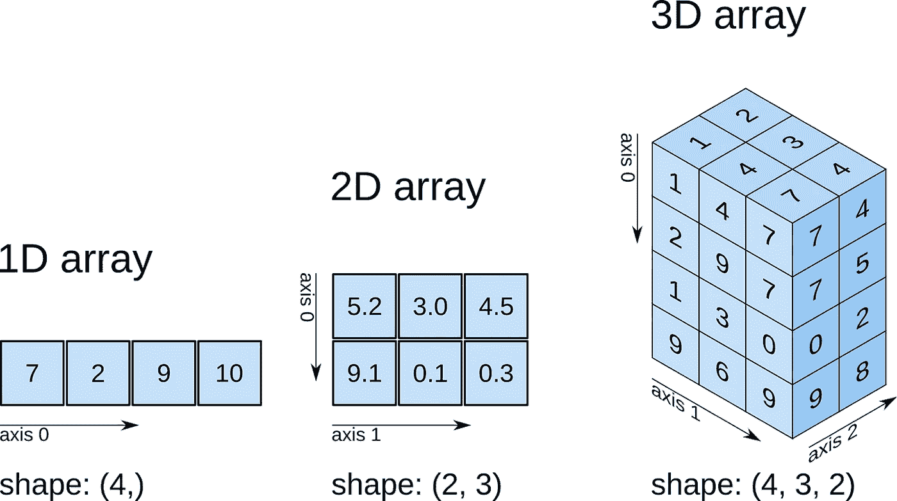
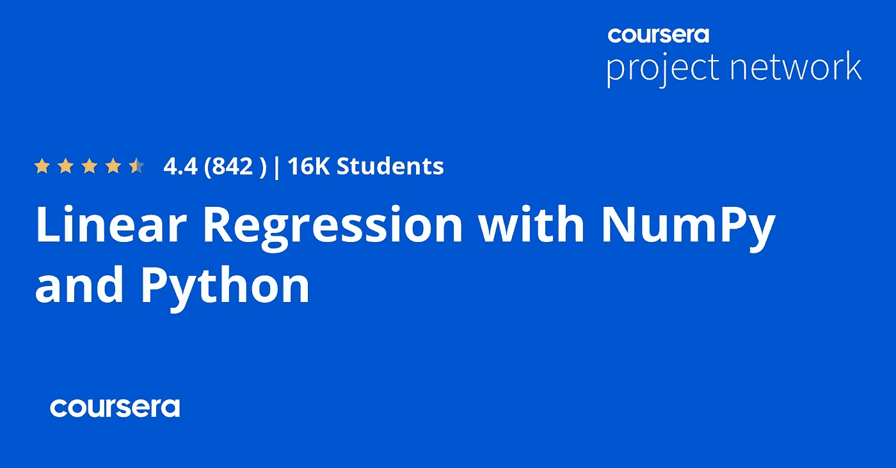
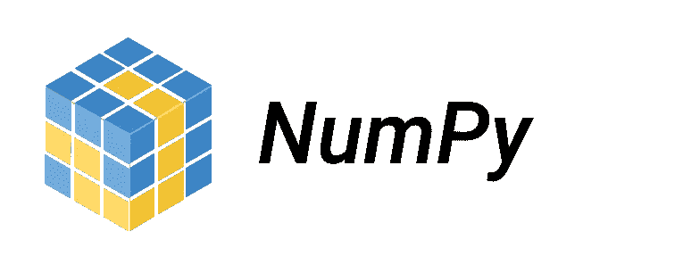
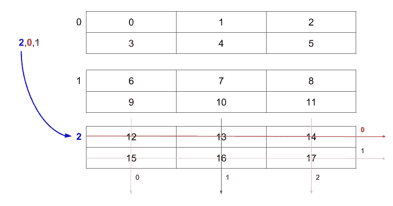

# 2023 年 6 门最佳初学者 NumPy 在线课程

> 原文：<https://medium.com/javarevisited/6-best-online-courses-to-learn-numpy-for-beginners-60120f611e06?source=collection_archive---------1----------------------->

## 我最喜欢学习和掌握的在线课程和教程是 2023 年的 NumPy 库。

大家好，如果你正在学习 Python 或数据科学，并且想学习 NumPy 库并寻找最好的资源，那么你来对地方了。

前面我已经分享了[学习数据科学的最佳 Python 课程](https://javarevisited.blogspot.com/2018/03/top-5-courses-to-learn-python-in-2018.html)和[最佳课程](https://javarevisited.blogspot.com/2018/10/data-science-and-machine-learning-courses-using-python-and-R-programming.html) e，在本文中，我将分享学习 NumPy 库的最佳课程，NumPy 库是最流行的数值计算 Python 库之一。

如果你不知道，Python 几乎是最受欢迎的编程语言，已经主导了从 web 开发到制造人工智能模型和物联网设备的每个商业领域，并被认为是数据科学家和分析师最喜爱的语言。

学习这种语言很简单，但你还需要知道它的软件包，例如，它允许你使用 matplotlib 可视化你的数据，或者使用 [Keras](https://www.java67.com/2020/06/top-5-courses-to-learn-pytorch-and-keras.html) 或 [TensorFlow](https://javarevisited.blogspot.com/2018/08/top-5-tensorflow-and-machine-learning-courses-online-programmers.html) 或 [PyTorch](/javarevisited/5-best-pytorch-and-keras-courses-for-deep-learning-in-2021-c9ba377b1170) 创建深度神经网络，或者使用 [Flask](https://javarevisited.blogspot.com/2020/01/top-5-courses-to-learn-flask-for-web-development-with-python.html) 或 [Django](https://javarevisited.blogspot.com/2020/07/top-5-courses-to-learn-django-in-2020.html) 构建一个 web 应用程序。

大家应该学习的 Python 库之一是 **NumPy** ，用于数值计算和科学计算。NumPy 支持大型多维数组和矩阵，以及对这些数组进行操作的大量高级数学函数。

它比 Python 使用更少的内存来存储数据，如果你打算成为一名数据科学家或机器学习工程师和许多其他领域的人，你会非常需要它，这些在线课程将帮助你从头开始学习和掌握 NumPy。

顺便说一下，如果你是 Python 的新手，那么我强烈推荐你参加一个全面的 Python 课程，比如 Coursera 的[**Python for Everybody Specialization**](https://coursera.pxf.io/c/3294490/1164545/14726?u=https%3A%2F%2Fwww.coursera.org%2Fspecializations%2Fpython)。这将帮助您快速掌握 Python，并帮助您轻松学习其他 Python 库，如 NumPy、SciPy 或 Pandas。

<https://coursera.pxf.io/c/3294490/1164545/14726?u=https%3A%2F%2Fwww.coursera.org%2Fspecializations%2Fpython>  

# 2023 年学习 NumPy 的 6 门最佳课程和教程

为了不浪费你的时间，这里是我为初学者和有经验的 Python 开发者列出的最好的 NumPy 课程。这些 NumPy 课程由 [Udemy](/javarevisited/15-best-udemy-courses-programmers-can-buy-on-black-friday-and-cyber-monday-2020-a803874f41d9) 、 [Pluralsight](/javarevisited/pluralsight-or-udemy-d9a94d2e8ee) 、 [Coursera](/javarevisited/10-best-coursera-certifications-and-courses-for-beginners-b13e930f2830) 、 [edX](/javarevisited/does-coursera-edx-and-udemy-course-certificate-help-in-jobs-and-careers-416cfb422d0f) 和 [Datacamp](https://javinpaul.medium.com/datacamp-vs-udemy-which-is-better-to-learn-data-skills-in-2022-b715f3cfc369) 创建。还包括免费和付费两种方式。

## 1.[数据科学的完整 NumPy 课程](https://click.linksynergy.com/deeplink?id=JVFxdTr9V80&mid=39197&murl=https%3A%2F%2Fwww.udemy.com%2Fcourse%2Fnumpy-course%2F)

本课程包含 3 个小时的视频内容，但足以学习 NumPy 包的基础到中级用户。如果你想成为一名数据科学家或学习处理 N 维数据，那么这个简单的课程是适合你的，唯一需要的是你有 python 语言的基础。

首先创建简单的 NumPy 数组，理解数组属性，并学习 NumPy 索引和切片。稍后，您将执行一些数组操作，如数组广播，这解决了对不同形状的不同数组应用数学的问题。

您将在数组上使用算术运算。最后，了解一键编码转换图像的颜色，并应用图像过滤器。

**这是加入本课程的链接** — [数据科学的完整数字课程](https://click.linksynergy.com/deeplink?id=JVFxdTr9V80&mid=39197&murl=https%3A%2F%2Fwww.udemy.com%2Fcourse%2Fnumpy-course%2F)

## 2.[使用 NumPy 和 Python 的线性回归](https://coursera.pxf.io/c/3294490/1164545/14726?u=https%3A%2F%2Fwww.coursera.org%2Fprojects%2Flinear-regression-numpy-python)【Coursera 项目】

如果你正在寻找一个可以实践 Numpy 的实践课程，那么这是最适合你的课程。这是 Coursera 的一个指导项目，在这里你将学习 Numpy 和 [Python](https://becominghuman.ai/7-best-python-online-courses-for-beginners-to-learn-programming-abe12cecb1ad) 的线性回归。

在这个 1.5 小时的在线项目中，你将完成所有的机器学习，而不使用任何流行的机器学习库，如 [scikit-learn](/javarevisited/5-best-scikit-learn-online-courses-for-machine-learning-and-data-science-6beb02e9cca0) 和 stats models。

这个项目的目的是自己实现各种学习算法的所有机制，包括梯度下降和线性回归，这样你就对基础有了更深入的理解。

这个课程运行在 Coursera 的动手编程和项目平台上，名为 Rhyme。在 Rhyme 上，你可以在浏览器中亲自动手做项目。您将可以即时访问预配置的云桌面，其中包含项目所需的所有软件和数据。

**这里是加入这个 Numpy 项目课程**—[Numpy 和 Python 的线性回归](https://coursera.pxf.io/c/3294490/1164545/14726?u=https%3A%2F%2Fwww.coursera.org%2Fprojects%2Flinear-regression-numpy-python)的链接

Coursera project 最棒的一点是，所有东西都已经直接安装在你的互联网浏览器中，所以你可以专注于学习，你不需要下载或安装任何东西。

在这个项目中，你可以即时访问预装了 Python、Jupyter、NumPy 和 Seaborn 的云桌面。

如果你发现 Coursera 的课程很有用，因为它们是由知名公司如谷歌、IBM、亚马逊和世界上最好的大学创建的，我建议你加入 Coursera Plus 的订阅计划，它可以让你无限制地访问他们最受欢迎的课程、专业、专业证书和指导项目。

<https://coursera.pxf.io/c/3294490/1164545/14726?u=https%3A%2F%2Fwww.coursera.org%2Fcourseraplus>  

## 3.[使用 Python Numpy 做更多事情](https://click.linksynergy.com/deeplink?id=CuIbQrBnhiw&mid=39197&murl=https%3A%2F%2Fwww.udemy.com%2Fcourse%2Fdoing-more-with-python-numpy%2F)【Udemy 课程】

另一个深入学习 NumPy 库的好课程，有超过 4 小时的视频内容。学完本课程后，您将理解为什么我们应该使用 NumPy 而不是常规的 python 代码来进行数组计算，以及 Python 中有关数组的更多概念。它有一些测验来测试你的知识。

您将从数组的基础开始，什么是数组作为数据容器，如何可视化您的数组，以及如何在 2D 和 3D 数组上执行数组索引和切片。

您还将看到在 python 列表上应用相同操作与使用 NumPy 数组相比的性能。稍后，您将看到如何使用许多 NumPy 算法来执行特定的数组，并了解数组广播。

**这里是加入本课程的链接—** [用 Python Numpy 做更多事情](https://click.linksynergy.com/deeplink?id=CuIbQrBnhiw&mid=39197&murl=https%3A%2F%2Fwww.udemy.com%2Fcourse%2Fdoing-more-with-python-numpy%2F)

## 4.[完成 NumPy 课程及应用 2023](https://click.linksynergy.com/deeplink?id=CuIbQrBnhiw&mid=39197&murl=https%3A%2F%2Fwww.udemy.com%2Fcourse%2Fcomplete-numpy-course%2F)【Udemy 课程】

对于那些想用不到两个小时的视频内容概述 NumPy 库的人来说，本课程非常简单。

如果你是一名数据科学家学生，或者有兴趣学习[机器学习](/javarevisited/10-free-machine-learning-courses-for-beginners-181f83b4c816)和[深度学习](/javarevisited/10-free-deep-learning-courses-for-beginners-37b5de61f8dc)，你可以报名参加这门课程，它只需要对 Python 有一个基本的了解。

首先，您将使用 NumPy 创建数组，访问其元素并将它们分割成其他小数组，复制 NumPy 数组，连接两个数组，对形状相同但形式不同的数组应用数学运算。

**以下是加入本课程的链接—** [完成 NumPy 课程及申请](https://click.linksynergy.com/deeplink?id=CuIbQrBnhiw&mid=39197&murl=https%3A%2F%2Fwww.udemy.com%2Fcourse%2Fcomplete-numpy-course%2F)

## 5.[Python 介绍](https://datacamp.pxf.io/c/1193463/1012793/13294?u=https%3A%2F%2Fwww.datacamp.com%2Fcourses%2Fintro-to-python-for-data-science)【最佳免费 DataCamp 课程】

在学习 python 之后，我之前提到过，你可能应该学习 NumPy，因为它会让你更容易理解 Python 编程语言中的任何领域，比如数据分析、数据科学家甚至机器学习。

如果你甚至不知道如何使用 Python，那么你可以参加这个[免费的 Datacamp 课程，在一个地方](/javarevisited/10-best-and-free-datacamp-courses-to-learn-python-and-data-skills-in-2021-39e42682fd76)学习这两者。

然后是[学习 python 列表](https://becominghuman.ai/6-courses-python-programmers-can-join-to-learn-data-structures-and-algorithms-c1a37284938e)，介绍了 python 语言的概念，如变量及其数据结构和数据类型。你应该很理解，因为这样以后对付 NumPy 就容易了。

然后学习一些预构建的 python 函数和方法，然后开始创建数组并应用您将在真实数据集等中学习的内容。

**这里是加入本课程**—[Python 简介](https://datacamp.pxf.io/c/1193463/1012793/13294?u=https%3A%2F%2Fwww.datacamp.com%2Fcourses%2Fintro-to-python-for-data-science)的链接

对了，你需要一个*[*data camp plan*](https://datacamp.pxf.io/c/1193463/1012793/13294?u=https%3A%2F%2Fwww.datacamp.com%2Fpricing)才能进入这个课程。他们有不同的计划，如标准、专业和高级，允许访问所有项目。我推荐标准计划，因为它价格合理，并且您可以获得所有增长数据技能的要素。*

*标准计划为您提供 350 多门课程、14 个职业轨道、50 多个技能轨道、无限实践挑战和现场代码。按年度计划，每月大约花费 25 美元，这是值得的。也可以 [**免费试用 DataCamp 七天**](https://datacamp.pxf.io/c/1193463/1012793/13294?u=https%3A%2F%2Fwww.datacamp.com%2Fpricing) ，值得一试。*

*<https://javarevisited.blogspot.com/2021/09/7-free-datacamp-courses-for-beginners.html> * 

## *6.[使用 NumPy 处理多维数据](https://pluralsight.pxf.io/c/1193463/424552/7490?u=https%3A%2F%2Fwww.pluralsight.com%2Fcourses%2Fnumpy-working-with-multidimensional-data)*

*如果您打算处理复杂数据，学习处理多维数据是一项必备技能。在将它们输入机器学习模型或可视化您的数据之前，您需要获得正确的数字形式。*

*首先，您将了解创建、打印和执行多维数据数学运算的基本概念。您将学习索引您的数组，访问数组中的某些项目，并使用 NumPy 操作图片。*

*稍后，您将对不同形状的数组应用一些操作。*

***以下是加入本课程的链接—** [使用 NumPy 处理多维数据](https://pluralsight.pxf.io/c/1193463/424552/7490?u=https%3A%2F%2Fwww.pluralsight.com%2Fcourses%2Fnumpy-working-with-multidimensional-data)*

**

*顺便说一下，你需要一个 [**Pluralsight 会员**](https://pluralsight.pxf.io/c/1193463/424552/7490?u=https%3A%2F%2Fwww.pluralsight.com%2Fpricing%2Ffree-trial) 才能加入这个课程，费用大约是每月 29 美元或每年 299 美元(14%的折扣)。*

*我向所有程序员强烈推荐这个订阅，因为它提供了超过 7000 个在线课程的即时访问，以学习任何技术技能。或者，你也可以使用他们的 [**10 天免费通行证**](https://pluralsight.pxf.io/c/1193463/424552/7490?u=https%3A%2F%2Fwww.pluralsight.com%2Fpricing%2Ffree-trial) 免费观看这门课程。*

*<https://pluralsight.pxf.io/c/1193463/424552/7490?u=https%3A%2F%2Fwww.pluralsight.com%2Fpricing%2Ffree-trial>  

以上就是 2023 年**初学者学习 NumPy 的最佳在线课程**。这是一个重要的用于数值计算的 Python 库。无论你是创建人工模型的机器学习工程师还是分析数据的数据科学家，Numpy 库都应该一直在你的腰带上。这个库将使你的工作变得容易，并节省你大量的时间和精力。

您可能喜欢的其他**数据科学和机器学习**文章

*   [十大 Coursera 数据科学课程和认证](https://javarevisited.blogspot.com/2020/08/top-10-coursera-certifications-to-learn-Data-Science-Visualization-and-Data-Analysis.html)
*   [你可以在线获得 5 个数据科学学位](https://www.java67.com/2020/06/top-5-data-science-degree-you-can-earn-online-coursera-edx.html)
*   [面向数据科学家的十大 TensorFlow 课程](https://dev.to/javinpaul/10-of-the-best-tensorflow-courses-to-learn-machine-learning-from-coursera-and-udemy-37bf)
*   [2023 年学习电力 BI 的前 5 门课程](https://www.java67.com/2020/06/top-5-courses-to-learn-microsoft-power-BI.html)
*   [学习机器学习的 5 大免费课程](https://www.java67.com/2019/01/5-free-courses-to-learn-machine-and-deep-learning-in-2019.html)
*   [5 门最适合初学者的计算机视觉课程](https://javarevisited.blogspot.com/2020/09/top-5-computer-vision-and-open-cv-courses-projects.html)
*   [学习数据科学 Python 的 5 本书](https://javarevisited.blogspot.com/2019/08/top-5-python-books-for-data-science-and-machine-learning.html)
*   [学习数据科学表格的前 5 门课程](https://javarevisited.blogspot.com/2019/07/top-5-tableau-online-courses-and-certifications-for-data-science-engineers.html)
*   [2023 年学习 Python 的 5 大课程](https://hackernoon.com/top-5-courses-to-learn-python-in-2018-best-of-lot-26644a99e7ec)
*   [2023 年约翰霍普金斯大学学习数据科学的最佳课程](https://javarevisited.blogspot.com/2021/05/best-johns-hopkins-courses-for-data-science-coursera.html)
*   [五大基本机器学习算法](https://www.java67.com/2020/07/top-5-machine-learning-algorithms-for-beginners.html)
*   [学习 QlikView 和 QlikSense 的五大课程](https://javarevisited.blogspot.com/2020/07/top-5-courses-to-learn-qlikview-and-qlik-sense.html)
*   [2023 年学习 Python 的 10 个理由](https://hackernoon.com/10-reasons-to-learn-python-in-2018-f473dc35e2ee)
*   [初学者学习 Python 的 10 门免费课程](https://hackernoon.com/10-free-python-programming-courses-for-beginners-to-learn-online-38312f3b9912)
*   [面向数据科学和机器学习的 8 大 Python 库](https://javarevisited.blogspot.com/2018/10/top-8-python-libraries-for-data-science-machine-learning.html)
*   [学习高级数据科学的前 5 门课程](https://hackernoon.com/top-5-data-science-and-machine-learning-course-for-programmers-e724cfb9940a)
*   [初学者学习 TensorFlow 的 5 大课程](https://hackernoon.com/top-5-tensorflow-and-ml-courses-for-programmers-8b30111cad2c)

感谢您阅读本文。如果你喜欢这些*最佳新手 NumPy 在线培训课程，请*分享给你的朋友和同事。如果您有任何问题或反馈，请留言。

**p . s .**——如果你热衷于学习 Numpy，并在寻找免费的 NumPy 在线课程，你也可以在 Udemy 上查看这个 [**深度学习先决条件:360 careers 的 Python V2**](https://click.linksynergy.com/deeplink?id=CuIbQrBnhiw&mid=39197&murl=https%3A%2F%2Fwww.udemy.com%2Fcourse%2Fnumpy-python%2F) 课程中的 NumPy 堆栈。这个 2 小时长的课程是完全免费的，由 Udemy 上一位著名的讲师创建。我强烈推荐参加这个课程，你所需要的只是一个免费的 Udemy 账户。

<https://javarevisited.blogspot.com/2019/08/top-5-courses-to-learn-deep-learning.html> *