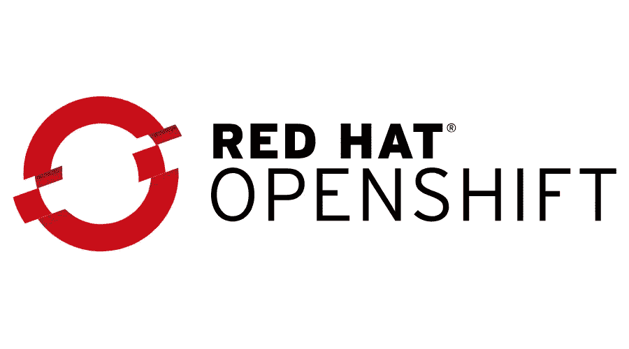
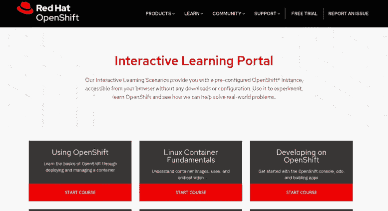
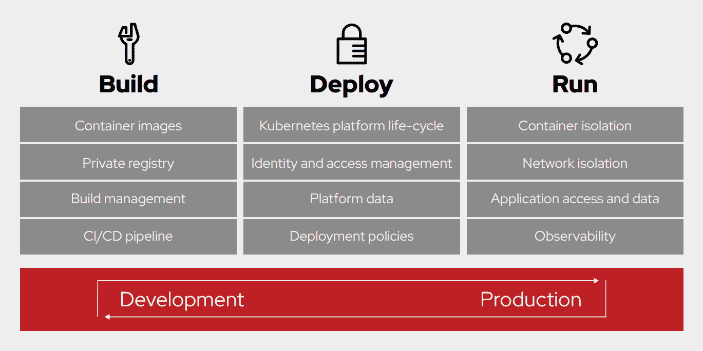
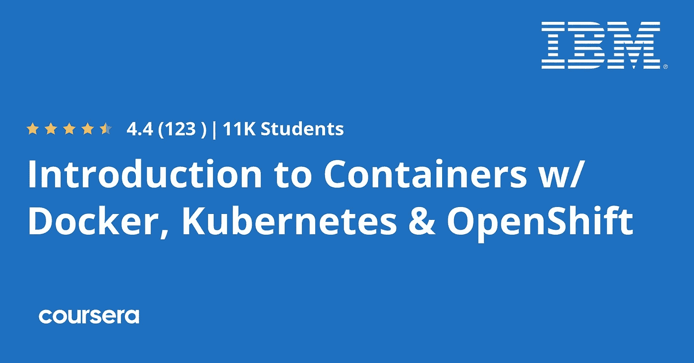

# 2023 年初学者学习 OpenShift 和容器的 6 门最佳课程

> 原文：<https://medium.com/javarevisited/6-best-openshift-courses-for-beginners-and-experienced-developers-d124edd2baff?source=collection_archive---------0----------------------->

## 我最喜欢的 2023 年学习 Redhat 的 Openshift 平台的在线课程，面向 DevOps 和开发者。

大家好，如果你想在 2023 年学习 RedHat Openshift 平台并寻找最好的 Openshift 课程，那么你来对地方了。在过去，我已经分享了 [**最佳 Docker 和 Kubernetes 课程**](/javarevisited/top-15-online-courses-to-learn-docker-kubernetes-and-aws-for-fullstack-developers-and-devops-d8cc4f16e773?source=collection_home---4------1-----------------------) ，在这篇文章中，我将分享 2023 年加入的最佳 Openshift 课程。

如果您在 DevOps 领域，那么您可能听说过 Openshift。我不知道 Openshift，但当我不得不在一个 Spring boot 项目上工作时，我不得不学习，这个项目部署在 OpenShift 平台上。

不要担心，这并不是一件非常复杂的事情，如果你过去使用过 Docker 和 Kubernetes，那么你就会明白 Openshift 带来了什么。

简而言之，OpenShift 是另一个完整的平台，类似于 [Docker](https://javarevisited.blogspot.com/2018/02/10-free-docker-container-courses-for-Java-Developers.html) 和 [Kubernetes](https://javarevisited.blogspot.com/2020/06/top-5-courses-to-learn-kubernetes-for-devops-and-certification.html#axzz6rQaZvLlb) ，有助于在 Java 世界中开发和部署[微服务](https://javarevisited.blogspot.com/2018/02/top-5-spring-microservices-courses-with-spring-boot-and-spring-cloud.html)。您只需指向您的应用程序代码，Openshift 就会构建并部署它，并考虑高可用性、容错、可伸缩性、自我修复和可靠性。

它为您带来所有的魔力，除此之外，Red Hat OpenShift 是领先的混合云、企业 Kubernetes 应用程序平台，受到 1000 多家组织的信任。

OpenShift 的目标是为开发人员和系统管理员开发、部署和运行容器化的应用程序提供良好的体验。开发人员应该喜欢使用 OpenShift，因为它使他们能够利用容器化的应用程序和编排，而不必了解细节。

开发人员应该自由地专注于他们的代码，而不是花时间编写 Docker 文件和运行 Docker build。

[OpenShift](https://www.redhat.com/en/technologies/cloud-computing/openshift) 是一个完整的平台，整合了几个上游项目，同时还提供了额外的特性和功能，使这些上游项目更容易使用。平台的核心是容器和编排。

对于房屋的集装箱侧，平台使用符合**开放集装箱倡议(OCI)** 图像规范的图像。对于编排方面，我们在上游的 Kubernetes 项目中投入了大量工作。

除了这两个上游项目，我们还创建了一组额外的 Kubernetes 对象，如 routes 和 deployment configs，我们将在本课程中学习如何使用它们。开发人员和操作人员都通过以下方法之一与 OpenShift 平台进行通信:

容器正迅速成为采用 [**DevOps 原则和实践**](/hackernoon/the-2018-devops-roadmap-31588d8670cb) 的组织的首选部署技术。将应用程序和服务从传统的部署平台转移到容器部署，使得表单可以部署在单个集群云架构上，而不是许多不同的硬件配置集上。

# 2023 年要学的 6 门最好的 Redhat OpenShift 课程和教程

在不浪费你更多时间的情况下，这里列出了学习 Redhat Openshift 的最佳在线课程。这些在线培训课程将有助于希望将软件应用程序容器化的开发人员、不熟悉容器技术和容器编排的管理员，以及考虑在软件架构中使用容器技术的架构师。

## 1.[绝对初学者的 OpenShift 动手操作](https://click.linksynergy.com/deeplink?id=JVFxdTr9V80&mid=39197&murl=https%3A%2F%2Fwww.udemy.com%2Fcourse%2Flearn-openshift%2F)

在您的浏览器中通过讲座、演示、测验和动手编程练习快速开始使用 OpenShift。

本课程通过浅显易懂的讲座向绝对初学者介绍 OpenShift。讲座之后是演示，展示如何设置和开始使用 OpenShift。本课程附带的编码练习将帮助您在 YAML 练习 OpenShift 配置文件。

您将在浏览器中为不同的用例开发 OpenShift 配置文件。编码练习将验证您的命令和配置文件，并确保您正确编写了它们。最后，它有任务来测试你的技能。您将接受挑战，运用您在本课程中学到的技能解决问题。

对于那些对 Docker 和 Kubernetes 有所了解的人来说，这确实是一门非常好的课程，可以帮助他们开始使用 OpenShift。

**这是加入本课程** — [OpenShift 的链接，完全面向初学者——动手](https://click.linksynergy.com/deeplink?id=JVFxdTr9V80&mid=39197&murl=https%3A%2F%2Fwww.udemy.com%2Fcourse%2Flearn-openshift%2F)

我不确定是谁整理了大部分的讲座(我怀疑是红帽)，但是从他的 [**Kubernetes/Docker 课程**](https://click.linksynergy.com/deeplink?id=JVFxdTr9V80&mid=39197&murl=https%3A%2F%2Fwww.udemy.com%2Fcourse%2Flearn-docker%2F) 中学习 Mumshad 自己的材料是一种可爱的接触。如果你是 OpenShift 的新手，但有一些其他技术的背景，这对你来说是一个极好的入门课程。

<https://click.linksynergy.com/deeplink?id=JVFxdTr9V80&mid=39197&murl=https%3A%2F%2Fwww.udemy.com%2Fcourse%2Flearn-docker%2F>  

## 2.[开发者实用 OpenShift 新课程 2023](https://click.linksynergy.com/deeplink?id=JVFxdTr9V80&mid=39197&murl=https%3A%2F%2Fwww.udemy.com%2Fcourse%2Fopenshift-for-developers%2F)【Udemy】

这是一个新的 Udemy 课程，为开发者学习 OpenShift。在本课程中，您将通过学习如何使用 15 种 OpenShift 资源

来学习和掌握 OpenShift 应用程序的开发和部署。本课程长达 6 个小时，为开发人员提供了一个清晰明了的 OpenShift 介绍。我非常喜欢这门课。讲课可以理解，动手练习也可以理解。

大部分概念都是基于 Docker 容器和 Kubernetes，这里不做解释，所以我发现先学习 [Docker](https://www.java67.com/2019/03/5-free-devops-courses-to-learn-jenkins.html) 和[Kubernetes](/javarevisited/7-free-online-courses-to-learn-kubernetes-in-2020-3b8a68ec7abc)s 非常有帮助。

以下是您将在本课程中学到的重要内容:

*   如何将您现有的应用部署到 Openshift
*   如何配置您的应用程序以遵循 Openshift 最佳实践
*   了解 15 种 Openshift 资源
*   如何开发高级应用程序模板

本课程结束时，您将能够创建自己的 OpenShift 完整堆栈，并在您的开发环境中本地运行。

您还将能够在 OpenShift 上创建、运行和管理应用程序，并能够了解典型的 OpenShift 环境是如何工作的，这将使您能够构建生产就绪的可交付成果。

**这里是加入本课程的链接** — [面向开发者的实用 OpenShift 新课程 2023](https://click.linksynergy.com/deeplink?id=JVFxdTr9V80&mid=39197&murl=https%3A%2F%2Fwww.udemy.com%2Fcourse%2Fopenshift-for-developers%2F)

## 3.[终极 Openshift (2023)训练营](https://click.linksynergy.com/deeplink?id=JVFxdTr9V80&mid=39197&murl=https%3A%2F%2Fwww.udemy.com%2Fcourse%2Fultimate-openshift-bootcamp-by-school-of-devops%2F)【Udemy 课程】

这是从 Udemy 学习 Openshift 的又一个牛逼课程。由 Gourav Shah 和 DevOps 学校创建的这个 7.5 小时长的课程将教你 Openshift 4.6 和 3.10 版本、Kubernetes、Jenkins Pipelines、Prometheus、Istio、[微服务](/javarevisited/7-free-microservices-courses-for-java-programmers-c9b2f3a2ea7d)和 PaaS。

本课程强调了 Openshift 如何通过去除所有的复杂性来简化 Kubernetes 的使用。您将获得构建和管理基础设施的知识，帮助公司完成 [DevOps 之旅](https://javarevisited.blogspot.com/2018/09/10-devops-courses-for-experienced-java-developers.html)的经验，以及 350 多项企业培训。

这是一门经过充分研究的课程，讲师 Gaurav Shah 已经尝试了许多不同的应用程序，使用了不同的流程，接受了反馈，并进行了多次迭代，这意味着您将向深入使用 Openshift 的人学习。

**以下是加入本课程的链接** — [终极 Openshift (2023)训练营](https://click.linksynergy.com/deeplink?id=JVFxdTr9V80&mid=39197&murl=https%3A%2F%2Fwww.udemy.com%2Fcourse%2Fultimate-openshift-bootcamp-by-school-of-devops%2F)

## 4. [OpenShift 互动学习门户](https://learn.openshift.com/%20%20https://www.openshift.com/learn/what-is-openshift?extIdCarryOver=true&sc_cid=701f2000001Css5AAC)【red hat】

和其他平台一样，Openshift 也提供了一些官方教程，学习如何使用 Openshift，高效使用。他们为在线实验室提供交互式学习场景，其中包含预配置的 OpenShift 实例，无需任何下载或配置即可从您的浏览器访问。

您可以使用它来进行实验，学习 OpenShift，并了解我们如何帮助解决现实世界中的问题。在这个自定进度的教程中，您将学习如何使用 OpenShift 容器平台来构建和部署容器化的应用程序。

他们有一系列免费的 Openshift 课程，在这些课程中你可以学到一些关键技能，比如:

*   Openshift 基础
*   如何在 Openshift 上开发应用
*   Linux 容器基础
*   基于 Openshift 的企业 Java 开发
*   如何使用 Kubernetes 原生 Java 栈 Quarkus 构建应用程序
*   事件驱动架构与[阿帕奇卡夫卡](/javarevisited/top-10-apache-kafka-online-training-courses-and-certifications-621f3c13b38c)
*   用 [Eclipse Vert.x](/javarevisited/10-best-free-dropwizard-vert-x-micronaut-and-quarkus-online-courses-for-java-developers-9c2b4161f17) 开发 Java VM 反应工具包
*   在 Openshift 中用[弹簧](/javarevisited/10-best-online-courses-to-learn-spring-framework-in-2020-f7f73599c2fd)和 [Spring Boot](/javarevisited/10-free-spring-boot-tutorials-and-courses-for-java-developers-53dfe084587e?source=collection_home---4------7-----------------------) 展开

这些只是一些有用的免费课程，他们有足够的场地来学习关键技能，如无服务器等。我强烈推荐你去这些互动实验室深入学习开放式轮班，而且它们是完全免费的。

## 5.[容器、Kubernetes 和 Red Hat OpenShift 的基础知识](https://www.awin1.com/cread.php?awinmid=6798&awinaffid=631878&clickref=&p=%5B%5Bhttps%3A%2F%2Fwww.edx.org%2Fcourse%2Ffundamentals-of-containers-kubernetes-and-red-hat)

本课程将向您介绍使用 Docker、Kubernetes 和 Red Hat OpenShift 容器平台的容器和容器编排技术。

您将学习如何封装应用和服务，使用 [Docker](/javarevisited/top-5-free-courses-to-learn-docker-for-beginners-best-of-lot-b2b1ad2b98ad?source=collection_home---4------2-----------------------) 测试它们，并使用 Red Hat OpenShift 在 Kubernetes 集群上部署它们。此外，您将使用 Red Hat OpenShift 的源到映像工具从源代码构建和部署应用程序。

在 [edX](https://javarevisited.blogspot.com/2021/05/top-10-edx-courses-and-certificates-for.html#axzz6v6xLSPvq) 上是免费课程，但如果需要证书，需要支付 99 美元，由同样对 OpenShift 容器平台开放的 Redhat 提供。

**这是加入本课程的链接** — [集装箱、Kubernetes 和 Red Hat OpenShift 的基础知识](https://www.awin1.com/cread.php?awinmid=6798&awinaffid=631878&clickref=&p=%5B%5Bhttps%3A%2F%2Fwww.edx.org%2Fcourse%2Ffundamentals-of-containers-kubernetes-and-red-hat)

## 6.[介绍带有 Docker、Kubernetes & OpenShift](https://coursera.pxf.io/c/3294490/1164545/14726?u=https%3A%2F%2Fwww.coursera.org%2Flearn%2Fibm-containers-docker-kubernetes-openshift) 的集装箱

如果你正在寻找学习容器基础知识、Docker、Kubernetes 和 Openshift 的入门课程，那么这个 Coursera 课程是最适合你的。该课程由 IBM 提供，是 [IBM 全栈云开发人员专业证书](https://click.linksynergy.com/deeplink?id=CuIbQrBnhiw&mid=40328&murl=https%3A%2F%2Fwww.coursera.org%2Fprofessional-certificates%2Fibm-full-stack-cloud-developer)的一部分。

在本课程中，您将了解容器与虚拟机的不同之处。它还涵盖了容器在云计算中的重要性，以及相关技术的新兴生态系统，如 Docker、Kubernetes、Red Hat OpenShift 和 Istio。

在整个课程中，您将通过动手实验应用您所学的知识。从使用 [Docker](/javarevisited/5-best-docker-courses-for-java-and-spring-boot-developers-bbf01c5e6542) 开始，到使用 [Kubernetes](/javarevisited/10-best-kubernetes-courses-for-developers-and-devops-engineers-94c35cd3a2fd) 进行编排和扩展，以及使用 OpenShift 简化部署。

这些实验是在 IBM Cloud 和 Skills Network 实验室环境中使用您的 web 浏览器执行的，这些环境免费提供给您。在项目中，在课程结束时，您将使用 OpenShift 构建一个容器映像，并在云上部署和扩展它。

总的来说，这是一门非常实用的初级课程，可以从头开始学习 Openshift。

**这是加入本课程的链接**——I[带码头工人的集装箱介绍，Kubernetes & OpenShift](https://coursera.pxf.io/c/3294490/1164545/14726?u=https%3A%2F%2Fwww.coursera.org%2Flearn%2Fibm-containers-docker-kubernetes-openshift)

顺便说一句，如果你觉得 Coursera 的课程和认证有用，那么我建议你加入 [**Coursera Plus**](https://coursera.pxf.io/c/3294490/1164545/14726?u=https%3A%2F%2Fwww.coursera.org%2Fcourseraplus) ，它可以让你无限制地访问他们最受欢迎的课程、专业、专业证书和指导项目。

<https://coursera.pxf.io/c/3294490/1164545/14726?u=https%3A%2F%2Fwww.coursera.org%2Fcourseraplus>  

以上就是 2023 年学习 Openshift 容器的**最佳课程。在当今以云为中心的世界中，它是一个必不可少的工具，Java 开发人员应该学习它。OpenShift 是 Kubernetes 的封闭版本，帮助您扩展基于云的服务。**

如果你想在 2023 年学习 OpenShift，那么这些在线课程可以很好地帮助你。它们既适合 DevOps 工程师，也适合 DevOps。我还为想要从头开始学习 Openshift 的初学者和有经验的开发人员提供了一些课程。

你可能喜欢的其他**开发运维、云计算和编程课程**

*   [2023 年 DevOps 开发者路线图](/hackernoon/the-2018-devops-roadmap-31588d8670cb)
*   [面向 DevOps 工程师的 5 门最佳 Kubernetes 课程](https://javarevisited.blogspot.com/2020/06/top-5-courses-to-learn-kubernetes-for-devops-and-certification.html)
*   [面向 Java 和 DevOps 专业人员的 10 门免费 Docker 课程](https://javarevisited.blogspot.sg/2018/02/10-free-docker-container-courses-for-Java-Developers.html)
*   [2023 年将加入的 13 个最佳 DevOps 课程](/javarevisited/13-best-courses-to-learn-devops-for-senior-developers-in-2020-a2997ff7c33c)
*   [学习 Jenkins 自动化和开发运维的五大课程](https://javarevisited.blogspot.com/2018/09/top-5-jenkins-courses-for-java-and-DevOps-Programmers.html)
*   [2023 年学习 Kubernetes 的 7 门免费在线课程](/javarevisited/7-free-online-courses-to-learn-kubernetes-in-2020-3b8a68ec7abc)
*   [学习亚马逊网络服务我最喜欢的课程](https://javarevisited.blogspot.com/2020/05/top-5-amazon-web-services-aws-courses-for-beginners-and-experienced-programmers.html)
*   [2023 年 Java 开发人员应该学习的 10 种工具](http://www.java67.com/2018/04/10-tools-java-developers-should-learn.html)
*   [5 免费 Spring 框架和 Spring Boot 课程](http://www.java67.com/2017/11/top-5-free-core-spring-mvc-courses-learn-online.html)
*   [面向 Java JEE 开发人员的 5 大 Hibernate 和 JPA 课程](http://javarevisited.blogspot.sg/2018/01/top-5-hibernate-and-jpa-courses-for-java-programmers-learn-online.html)
*   [程序员学习 AWS 和云的 10 门免费课程](/javarevisited/top-10-courses-to-learn-amazon-web-services-aws-cloud-in-2020-best-and-free-317f10d7c21d)

感谢您阅读本文。如果你喜欢这些*最好的 OpenShift 课程*，那么请与你的朋友和同事分享。如果您有任何问题或反馈，请留言。

**附言——**如果你正在寻找学习 Openshift 的免费在线课程，那么你也可以在 Udemy 上查看 [**主 open shift——容器编排课程**](https://click.linksynergy.com/deeplink?id=CuIbQrBnhiw&mid=39197&murl=https%3A%2F%2Fwww.udemy.com%2Fcourse%2Flearn-openshift-quickly%2F) 。它是完全免费的，已经有超过 790 名学生加入了这门课程。

<https://click.linksynergy.com/deeplink?id=CuIbQrBnhiw&mid=39197&murl=https%3A%2F%2Fwww.udemy.com%2Fcourse%2Flearn-openshift-quickly%2F> 