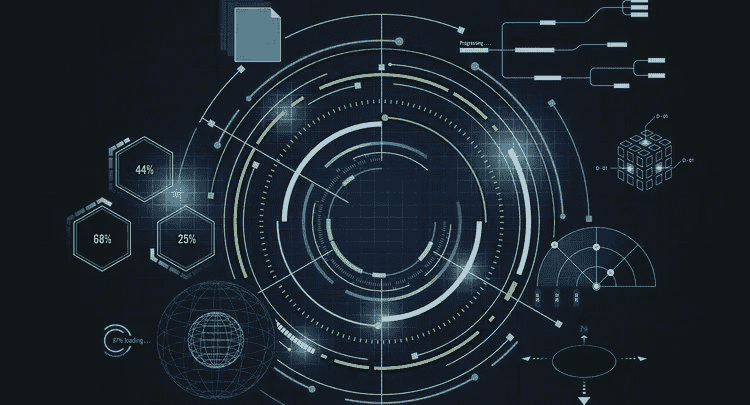
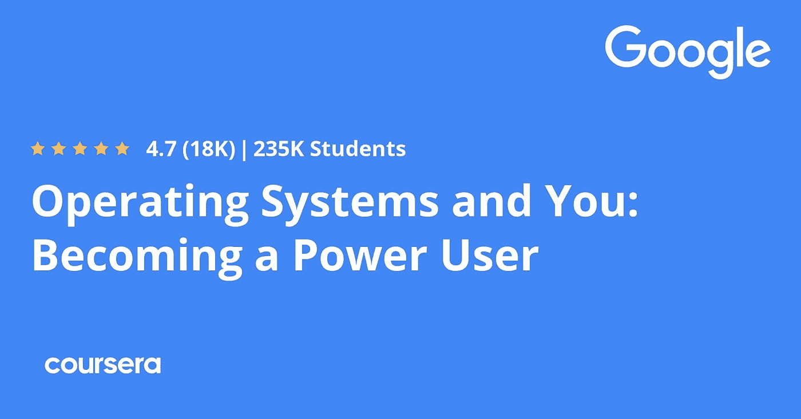
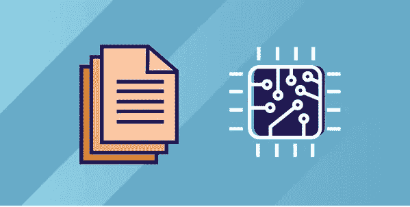
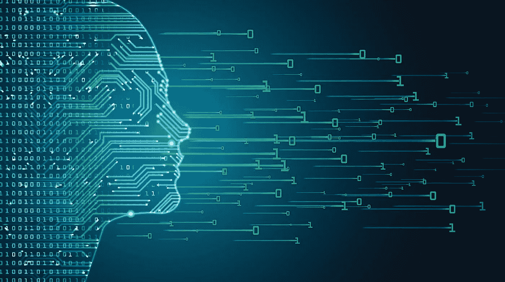
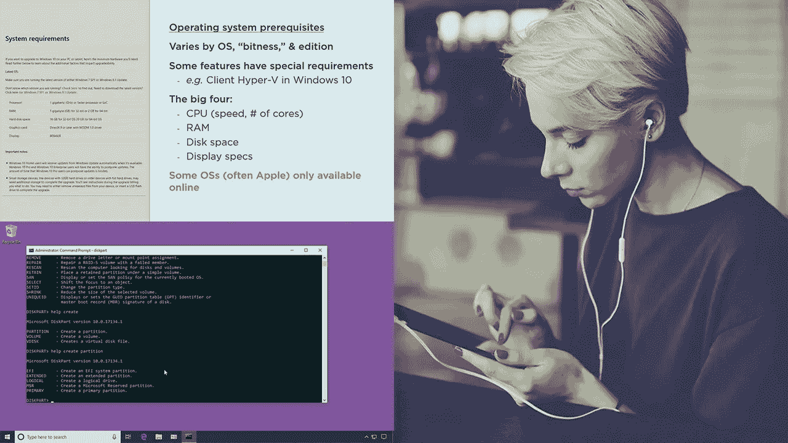

# 2023 年初学者学习的 6 门最佳操作系统课程

> 原文：<https://medium.com/javarevisited/6-best-operating-system-courses-for-beginners-to-learn-7d727882d267?source=collection_archive---------0----------------------->

## 我最喜欢的为计算机科学学生、程序员和来自 Udemy、Coursera、Pluralsight 和 edX 的 IT 专业人员学习操作系统概念的课程

你好，伙计们，如果你是一个计算机科学初学者或自学成才的开发人员，希望学习操作系统的基础知识，那么你来对地方了。我过去一直在分享计算机基础课程像这些 [**数据结构和算法课程**](/javarevisited/top-10-data-structure-and-algorithms-courses-for-java-developers-25161ee2edc0) 和这些 [**最好的计算机科学课程**](/javarevisited/8-best-computer-science-courses-for-beginners-to-learn-online-696379aa4e96) 。

在这篇文章中，我将为初学者分享学习操作系统的最佳在线课程。操作系统是任何笔记本电脑、手机或物联网设备中最重要的部分。

没有这一块，你的设备只是一个垃圾箱；除了一些在主板上什么也做不了的硬件之外，仅此而已。

操作系统也是一个管理许多任务的复杂软件，或者你可以说你的设备的全部任务，比如说一台笔记本电脑，像*安装软件、内存管理、系统安全、错误检测等等*。每个在信息技术、软件开发或计算机科学领域工作的人都需要至少对计算和它们如何操作有一些基本的了解，比如与硬件交互。这也是软件开发人员 的 [**必备技能之一，尤其是没有经过传统 CS 教育的自学成才的开发人员。**](https://dev.to/javinpaul/11-essential-skills-software-developers-should-learn-in-2020-1bio)

对操作系统的良好理解是程序员的关键，因为无论他们写什么代码，最终都会在操作系统上运行。

如果他们不知道操作系统如何管理内存和概念，如*虚拟内存、交换、内存页面和页面错误*，他们将很难排除和修复内存问题并提高应用程序的性能。

同样的还有[并发](https://javarevisited.blogspot.com/2018/06/top-5-java-multithreading-and-concurrency-courses-experienced-programmers.html)，这是 OS 的另一个关键任务。作为一个程序员，你需要学习并发、信号量、临界区，以及 OS 如何让你在不干扰其他程序的情况下运行多个程序。

这就是为什么 OS 类是任何自尊的 CS 程序的一部分，也是为什么每个程序员和开发者都应该学习操作系统的原因。他们都需要对操作系统的使用有基本的了解，这样他才能解决日常问题，如故障排除等。

无论你是打算学习操作系统的基础知识，比如 T2、Linux 和 Windows，还是想提高你在这一领域的技能，参加在线课程可能是学习这些技能的最佳方式，因为这个原因你不需要去上大学。我已经找到了学习操作系统基础知识的 7 个最佳在线课程，所以请继续阅读这篇文章以了解更多信息。

<https://coursera.pxf.io/c/3294490/1164545/14726?u=https%3A%2F%2Fwww.coursera.org%2Flearn%2Fos-power-user>  

# 2023 年程序员学习操作系统基础的 7 门最佳在线课程

以下是我列出的初学者学习操作系统的最佳在线课程。这些在线课程是从 Udemy、Coursera、Pluralsight、edX 等网站上筛选出来的。它们是由专家创建的，受到成千上万想学习操作系统的人的信任。

## 1.[操作系统和你:成为超级用户](https://coursera.pxf.io/c/3294490/1164545/14726?u=https%3A%2F%2Fwww.coursera.org%2Flearn%2Fos-power-user)【Coursera】

这是从 Coursera 学习操作系统最好的课程之一。这门课程是由著名的科技巨头谷歌公司通过 Coursera 平台提供的。本课程介绍如何使用 Linux 和 Windows 两种操作系统，以及如何使用目录和文件。

该课程也是 [**谷歌支持 IT 专业证书专业化**](https://coursera.pxf.io/c/3294490/1164545/14726?u=https%3A%2F%2Fwww.coursera.org%2Fprofessional-certificates%2Fgoogle-it-support) 的一部分，由“与谷歌一起成长”团队创建，帮助世界各地的学生学习各个领域的新技能。

然后学习用户和权限，就像在系统中添加新用户一样。稍后您将看到如何安装软件和使用软件包，以及安装驱动程序。您还将了解文件系统如何在 Windows 和 Linux 上工作，等等。

**这是参加本课程的链接**——[操作系统和你:成为超级用户](https://coursera.pxf.io/c/3294490/1164545/14726?u=https%3A%2F%2Fwww.coursera.org%2Flearn%2Fos-power-user)

您也可以免费旁听本课程或参加专业化认证以获得证书。或者，你也可以加入 [**Coursera Plus**](https://coursera.pxf.io/c/3294490/1164545/14726?u=https%3A%2F%2Fwww.coursera.org%2Fcourseraplus) ，这是 Coursera 的一个订阅计划，允许无限制地访问他们的认证项目和课程，每年仅需 399 美元。

<https://coursera.pxf.io/c/3294490/1164545/14726?u=https%3A%2F%2Fwww.coursera.org%2Fcourseraplus>  

## 2.[操作系统从零开始](https://click.linksynergy.com/deeplink?id=CuIbQrBnhiw&mid=39197&murl=https%3A%2F%2Fwww.udemy.com%2Fcourse%2Foperating-systems-from-scratch-part1%2F)【最佳 Udemy 课程】

我们清单上的第二门课程面向任何想从头开始学习操作系统的人，以及如果你打算从事计算机科学甚至软件工程师的职业。该课程有 8.5 小时的内容，评分为 4.5，表明该课程是 udemy 平台上最好的课程之一。

首先介绍操作系统，如硬件如何与软件配合工作，以及不同类型的操作系统。'

然后转到硬件，特别是 CPU 及其工作原理和不同的算法，如 FCFS、SJF、SRTF。然后你会对二进制系统和内存分配有一个大概的了解。

**这里是加入本课程的链接** — [从零开始操作系统](https://click.linksynergy.com/deeplink?id=CuIbQrBnhiw&mid=39197&murl=https%3A%2F%2Fwww.udemy.com%2Fcourse%2Foperating-systems-from-scratch-part1%2F)

## 3.[操作系统:虚拟化、并发性&持久性](https://www.educative.io/courses/operating-systems-virtualization-concurrency-persistence?affiliate_id=5073518643380224)【educative . io】

这是另一门非常棒的综合性课程，学习操作系统，并建立您对虚拟化、并发性和持久性的概念。这是一门基于文本的交互式课程，来自 Educative，这意味着您也将通过实践来学习。

在学习操作系统概念时，虚拟化、并发性和持久性是三个最重要的概念，本课程将重点介绍这三个概念。一旦你知道了这些概念，你就能理解操作系统是如何工作的，它们是如何管理内存的，以及它们是如何让你运行多个程序的。

以下是您将在本课程中学到的关键概念:

1.虚拟内存

2.CPU 调度

3.并发

4.交换

5.旗语

6.解决死锁等并发错误

您还将有机会通过 I/O 设备和文件系统练习许多与持久性相关的东西。总的来说，这是一个从头开始积累操作系统知识的好课程。我向每一个程序员和软件开发人员强烈推荐这门课程。

**这是加入本课程的链接**——[操作系统:虚拟化、并发性&持久性](https://www.educative.io/courses/operating-systems-virtualization-concurrency-persistence?affiliate_id=5073518643380224)

顺便说一下，你可以单独参加这个课程，也可以参加 [**教育订阅**](https://www.educative.io/subscription?affiliate_id=5073518643380224) ，每月只需 14.9 美元就可以访问他们所有的 250 多门互动课程，这对开发人员来说是一笔不错的交易，我强烈推荐。

<https://www.educative.io/subscription?affiliate_id=5073518643380224>  

## 4.[操作系统基础](https://click.linksynergy.com/deeplink?id=CuIbQrBnhiw&mid=39197&murl=https%3A%2F%2Fwww.udemy.com%2Fcourse%2Fit-operating-systems-comptia-a-plus-900%2F)【Udemy】

我们清单上的第一门课程是为那些将要通过 CompTIA A+考试的人和任何想提高操作系统技能的人准备的，比如使用 Linux 系统及其命令行，或者使用 windows 系统，比如安装和故障排除。

首先介绍 windows 7、8 和 10 等 Windows 操作系统，以及如何使用它们，如管理工具、防火墙、安装系统和使用命令行。

然后开始概述 macOS 和 Linux 系统，比如使用[命令行](https://www.java67.com/2019/04/top-5-free-course-to-learn-bash-shell-scripting-linux.html)。之后，您将了解云计算、虚拟化和威胁管理。

**这是参加本课程** — [操作系统基础](https://click.linksynergy.com/deeplink?id=CuIbQrBnhiw&mid=39197&murl=https%3A%2F%2Fwww.udemy.com%2Fcourse%2Fit-operating-systems-comptia-a-plus-900%2F)的链接

## 5.[计算机硬件和操作系统](https://www.awin1.com/cread.php?awinmid=6798&awinaffid=631878&clickref=&p=%5B%5Bhttps%3A%2F%2Fwww.edx.org%2Fcourse%2Fcomputer-hardware-and-operating-systems)【edX 课程】

纽约大学通过 [edX 平台](https://javarevisited.blogspot.com/2021/05/top-10-edx-courses-and-certificates-for.html)创建的另一个伟大的课程旨在帮助没有操作系统背景的人，一般来说，涵盖操作系统和硬件和软件的基础，以及更多。

完成本课程后，您将能够定义什么是计算机和操作系统，了解任何操作系统的组件，以及线程如何工作、内存、线程并发和死锁等等。

**这是参加本课程** — [计算机硬件和操作系统](https://www.awin1.com/cread.php?awinmid=6798&awinaffid=631878&clickref=&p=%5B%5Bhttps%3A%2F%2Fwww.edx.org%2Fcourse%2Fcomputer-hardware-and-operating-systems)的链接

## 6.[计算机基础:操作系统](https://pluralsight.pxf.io/c/1193463/424552/7490?u=https%3A%2F%2Fwww.pluralsight.com%2Fcourses%2Fcomputer-fundamentals-operating-systems)【plural sight 课程】

我们列表中的最后一个是在 Pluralsight 平台上提供的课程，目标是希望学习操作系统以及软件如何与硬件和软件通信的人。

从操作系统及其架构的定义以及每个 windows 版本的功能开始。然后转到安装和升级方法。

完成所有设置后，您将看到如何使用 Windows 命令行，如 CMD 和 PowerShell，以及如何使用网络配置。最后，移动到使用 macOS 和 [Linux 工具](https://javarevisited.blogspot.com/2018/07/10-tips-on-working-fast-in-unix-or-linux.html)及其命令行使用终端。

**这里是加入本课程的链接** — [计算机基础:操作系统](https://pluralsight.pxf.io/c/1193463/424552/7490?u=https%3A%2F%2Fwww.pluralsight.com%2Fcourses%2Fcomputer-fundamentals-operating-systems)

顺便说一下，你需要一个 Pluralsight 会员才能参加这个课程，费用大约是每月 29 美元或每年 299 美元(14%的折扣)。我向所有程序员强烈推荐这个订阅，因为它提供了超过 7000 个在线课程的即时访问，以学习任何技术技能。或者，你也可以使用他们的 [**10 天免费通行证**](https://pluralsight.pxf.io/c/1193463/424552/7490?u=https%3A%2F%2Fwww.pluralsight.com%2Fpricing%2Ffree-trial) 免费观看这个课程。

<https://pluralsight.pxf.io/c/1193463/424552/7490?u=https%3A%2F%2Fwww.pluralsight.com%2Fpricing%2Ffree-trial>  

以上就是关于**初学者学习操作系统的最佳在线课程**。无论是在 IT 领域工作，还是只是一个普通人，你都要学习系统和硬件是如何工作的。如今，没有人能忽视计算机的力量，参加这些课程之一将确保在这一领域的专业。

你可能喜欢的其他**计算机科学和编程资源**

*   [2023 年如何学习编码与编程](https://javarevisited.blogspot.com/2020/05/how-to-learn-to-code-in-2020-best-books-courses-and-tips.html)
*   [2023 年学习 Web 开发的 5 门课程](http://javarevisited.blogspot.sg/2018/02/top-5-online-courses-to-learn-web-development.html#axzz57wed1PWd)
*   [前 5 名 Selenium 与 Java Web 驱动程序课程](http://javarevisited.blogspot.sg/2018/02/top-5-selenium-webdriver-with-java-courses-for-testers.html)
*   [学习 learn Shell 脚本的 5 门课程](http://javarevisited.blogspot.sg/2018/02/5-courses-to-learn-shell-scripting-in-linux.html)
*   [来自谷歌和微软的 10 个免费 Python 教程](/javarevisited/10-free-python-tutorials-and-courses-from-google-microsoft-and-coursera-for-beginners-96b9ad20b4e6)
*   [2023 年学习 React Native 的 5 门课程](http://javarevisited.blogspot.sg/2018/02/5-react-native-courses-to-learn-mobile-development-using-JavaScript.html)
*   Python 开发者十大 Coursera 认证
*   [5 门免费学习核心 Java 的在线课程](http://javarevisited.blogspot.sg/2017/11/top-5-free-java-courses-for-beginners.html#axzz4zuIICRs9)
*   [学习 Python 的 10 大 Coursera 专业](https://javarevisited.blogspot.com/2020/02/10-best-coursera-courses--for-python.html)
*   [面向有经验的 Java 开发人员的 5 大 Java 设计模式课程](http://javarevisited.blogspot.sg/2018/02/top-5-java-design-pattern-courses-for-developers.html)
*   [编程/编码工作面试 10 门课程](http://javarevisited.blogspot.sg/2018/02/10-courses-to-prepare-for-programming-job-interviews.html)
*   [IT 专业人士学习写邮件的 5 门课程](http://javarevisited.blogspot.sg/2018/02/top-5-professional-email-writing-courses-for-programmers.html)
*   【Udemy 的 10 大 Python 和编码课程

感谢您阅读本文。如果你觉得这些*最佳操作系统初学者课程*有用，那么请分享给你的朋友和同事。如果您有任何问题或反馈，请留言。

**附言——**如果您热衷于学习操作系统概念并寻找免费的在线课程，请查看 Udemy 上的 [**操作系统:理解核心**](https://click.linksynergy.com/deeplink?id=CuIbQrBnhiw&mid=39197&murl=https%3A%2F%2Fwww.udemy.com%2Fcourse%2Foperating-system-understanding-the-core%2F) 课程。它是免费的。

<https://coursera.pxf.io/c/3294490/1164545/14726?u=https%3A%2F%2Fwww.coursera.org%2Flearn%2Fos-power-user> 