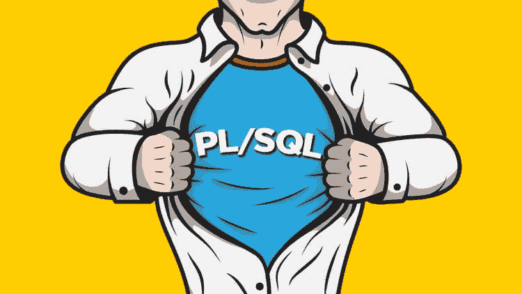
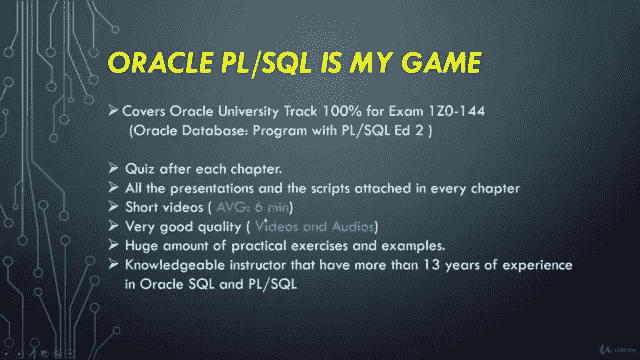

# 2023 年初学者在线学习的 6 门最佳 PL/SQL 和 Oracle 课程

> 原文：<https://medium.com/javarevisited/6-best-pl-sql-and-oracle-courses-for-beginners-to-learn-online-effd07d5fd2?source=collection_archive---------0----------------------->

## 这些是从 Udemy 和 Pluralsight 学习 Oracle 数据库和 PL/SQL 的最佳在线课程。适合初学者和中级开发人员。

大家好，如果你想在 2023 年学习 Oracle 和 PL/SQL，并寻找最好的在线资源，如书籍、课程和教程，那么你来对地方了。

之前，我已经分享了学习 Oracle 数据库 的 [**免费课程，在本文中，我将分享学习 Oracle 数据库和 PL/SQL 的 5 个最佳在线培训课程。**](/javarevisited/8-free-oracle-database-and-sql-courses-for-beginners-f4e9b25b33c4)

这些课程是从流行的在线学习门户网站(如 Udemy 和 Pluralsight)中筛选出来的，由对 Oracle 和 PL/SQL 都有深入了解的专家培训师创建，您可以使用它们从头开始学习 Oracle 或提高您的 Oracle 和 PL/SQL 技能。

这些在线课程也非常实惠，受到全球成千上万开发者的信赖。你只需花 10 美元就可以在 T4 的 Udemy 课程上买到这些课程，这些课程时不时会进行快闪拍卖。同样，Pluralsight Oracle 课程也不是很贵，可以按月或按年订阅观看。

毫无疑问，Oracle 是最受欢迎的数据库之一，对懂 Oracle 数据库和 PL/SQL 的程序员和数据库管理员的需求很大。

Oracle 在可伸缩性、弹性、复制等方面有许多优势，但它也提供了强大的编程语言 PL/SQL，使您能够编写强大的 SQL 脚本、存储过程和其他 SQL 工件来解决现实世界中的问题。

# 2023 年学习 Oracle 和 PL/SQL 的 6 门最佳在线课程

为了不浪费您的时间，这里列出了学习 Oracle 和 PL/SQL 的最佳在线课程。没有必要参加所有这些课程，相反，你应该参加一个或两个可以与讲师联系的课程，因为这是任何课程最重要的一点。

为此，我建议你观看这些课程的预览，如果你能观看这些预览和样本讲座而不跳过，那么这是一个很好的机会，你正在与讲师联系，这门课程值得你花时间。

## 1. [Oracle PL/SQL 基础第一卷&第二卷](https://click.linksynergy.com/deeplink?id=CuIbQrBnhiw&mid=39197&murl=https%3A%2F%2Fwww.udemy.com%2Fcourse%2Foracle-plsql-fundamentals-vol-i-ii%2F)

这是学习 Oracle 数据库的 PL/SQL 数据库编程语言最全面的课程之一。如果你不熟悉数据库和编程基础，想学习 PL/SQL，那么这是一门非常适合你的课程。

本课程是专门为应用程序开发人员、数据库管理员、业务用户以及 QA 和业务分析师等非技术人员设计的。

以下是您将在本课程中学到的主要内容:

*   如何设置您的环境
*   学习数据库程序单元
*   如何创建和维护包
*   如何使用系统提供的软件包
*   如何使用数据库触发器
*   如何实现系统事件触发器
*   使用 Oracle 数据库工具
*   理解和使用语言功能
*   使用 DECLARE、BEGIN 和 EXCEPTION 子句
*   理解和使用嵌套块
*   学习显式光标

谈到社交证明，这是最受初学者欢迎的学习 Oracle PL/SQL 的课程之一，已有超过 2 万名学生参加了该课程，近 4200 名参与者对该课程的平均评分为 4.5 分。总的来说，如果您是从零开始，这是一个很好的 Oracle 课程。

**以下是参加本 PL/SQL 课程的链接** — [Oracle PL/SQL 基础第一卷&第二卷](https://click.linksynergy.com/deeplink?id=CuIbQrBnhiw&mid=39197&murl=https%3A%2F%2Fwww.udemy.com%2Fcourse%2Foracle-plsql-fundamentals-vol-i-ii%2F)

## 2.[完整的 PL/SQL 训练营:“初级到高级 PL/SQL”](https://click.linksynergy.com/deeplink?id=CuIbQrBnhiw&mid=39197&murl=https%3A%2F%2Fwww.udemy.com%2Fcourse%2Fplsql-beginner-to-advanced-become-a-perfect-plsql-developer%2F)

这是在 Udemy 上学习 PL/SQL 的又一个牛逼课程。如果您正在准备 Oracle 的 PL/SQL 考试，如 Oracle 1z 0–144 和 1z 0–148，它也很有用。这门课程有超过 20.5 小时的内容，72 篇文章和 6 个可下载的资源。

以下是您将在本课程中学到的重要内容

*   PL/SQL 基本和高级概念
*   高级 SQL 技术
*   为 PL/SQL 高效使用 SQL Developer
*   提高代码的性能和安全性
*   PL/SQL 架构
*   创建动态查询
*   如何像面向对象编程一样使用 PL/SQL？
*   PL/SQL 优化

谈到社会证明，这是 Udemy 上最畅销的 PL/SQL 课程之一，受到超过 14K 名学生的信任。它还拥有来自近 2736 名参与者的平均 4.4 分的评分，令人印象深刻。

总的来说，这是一个学习 PL/SQL 并通过 Oracle 1z 0–144(1z 0–144 Oracle 数据库 11g/12c:PL/SQL 程序)和 1z 0–148(1z 0–148 Oracle 数据库:高级 PL/SQL)认证的绝佳在线课程。

当您完成课程和作业时，它还会提供一份结业证书。

**以下是参加本课程的链接** — [完整的 PL/SQL 训练营:“PL/SQL 初级到高级”](https://click.linksynergy.com/deeplink?id=CuIbQrBnhiw&mid=39197&murl=https%3A%2F%2Fwww.udemy.com%2Fcourse%2Fplsql-beginner-to-advanced-become-a-perfect-plsql-developer%2F)

## 3. [Oracle DBA 11g/12c —初级数据库管理员数据库管理](https://click.linksynergy.com/deeplink?id=CuIbQrBnhiw&mid=39197&murl=https%3A%2F%2Fwww.udemy.com%2Fcourse%2Foracledbatraining%2F)

如果您正在寻找成为 Oracle 数据库管理员(DBA)的最佳在线课程，那么这是最适合您的课程。在本课程中，您将在 6 周内学会成为 Oracle 数据库管理员所需的一切，并为初级数据库管理员做好工作准备。

该课程由 Amarnath Reddy 创建，他是 Udemy 上我最喜欢的 SQL 讲师之一。这也是评分最高的课程之一，4500 名参与者的平均评分为 4.3，超过 18000 名学生已经从该课程中受益。

不过，在你参加本课程之前，你应该掌握一些基本的 SQL 和 UNIX/Linux 知识。

以下是您将在本课程中学到的重要内容:

*   Oracle 数据库架构
*   如何安装必要的 Oracle 软件/数据库
*   如何管理数据库中的用户帐户
*   如何管理表空间来为数据提供所需的空间
*   如何执行 Oracle 数据库备份和恢复？
*   如何诊断问题并与 Oracle 技术支持合作
*   如何为用户通信配置监听器

本课程还介绍了 Oracle Database 11g 和 Oracle Database 12c，以便您了解两者的区别，并能够在仍处于 11g 的组织中工作。

**以下是参加本课程的链接** — [Oracle DBA 11g/12c —初级 DBA 数据库管理](https://click.linksynergy.com/deeplink?id=CuIbQrBnhiw&mid=39197&murl=https%3A%2F%2Fwww.udemy.com%2Fcourse%2Foracledbatraining%2F)

## 4. [Oracle PL/SQL 基础知识—第 1 部分和第 2 部分](https://pluralsight.pxf.io/c/1193463/424552/7490?u=https%3A%2F%2Fwww.pluralsight.com%2Fcourses%2Foracle-plsql-fundamentals)【plural sight】

如果您拥有 Pluralsight 会员资格，并且正在寻找一门 Oracle PL/SQL 课程来开始学习这一有用的技能，那么您应该参加这门课程。

在本 Oracle PL/SQL 培训课程中，您将了解 Oracle PL/SQL 编程语言的基础知识。这是两部分课程的第一部分，详细介绍了 PL/SQL。

在第一部分中，您将了解 PL/SQL 数据类型和编程结构，如循环、条件执行、游标和异常处理，这将使您能够进行有效的调试。

在第二部分中，您将学习如何创建、编译和执行过程、函数和包，它们是预先编译并存储在数据库中的命名程序单元。

您还将了解如何将参数传递给子程序、参数模式，以及如何通过引用和值传递参数。我们将讨论在编译和执行子程序以及 authid 子句时，角色和特权是如何发挥作用的

**这是参加本课程的链接** — [Oracle PL/SQL 基础](https://pluralsight.pxf.io/c/1193463/424552/7490?u=https%3A%2F%2Fwww.pluralsight.com%2Fcourses%2Foracle-plsql-fundamentals)

顺便说一下，你需要一个 Pluralsight 会员才能参加这个课程，费用大约是每月 29 美元或每年 299 美元(14%的折扣)。我向所有程序员强烈推荐这个订阅，因为它提供了超过 7000 个在线课程的即时访问，以学习任何技术技能。或者，你也可以使用他们的 [**10 天免费试用**](https://pluralsight.pxf.io/c/1193463/424552/7490?u=https%3A%2F%2Fwww.pluralsight.com%2Fpricing%2Ffree-trial) 免费观看这门课程。

<https://pluralsight.pxf.io/c/1193463/424552/7490?u=https%3A%2F%2Fwww.pluralsight.com%2Fpricing%2Ffree-trial>  

## 5. [PL/SQL 示例—初级到高级 PL/SQL](https://click.linksynergy.com/deeplink?id=CuIbQrBnhiw&mid=39197&murl=https%3A%2F%2Fwww.udemy.com%2Fcourse%2Fplsql-by-example%2F)【Udemy】

这是另一个在 Udemy 上在线学习 PL/SQL 的实践课程，由 Udemy 上最好的 SQL 讲师之一 Amarnath Reddy 创建。本课程是从头开始学习 PL/SQL 的最佳资源之一。

这意味着，如果您从未使用过 PL/SQL，那么您也可以参加本课程，学习这项宝贵的技能。

以下是您将在本课程中学到的关键内容:

*   如何声明 PL/SQL 变量
*   如何有条件地控制代码流(循环、控制结构)
*   了解如何使用 Oracle 提供的 PL/SQL 包来生成屏幕输出
*   如何创建匿名 PL/SQL 块、函数和过程
*   如何使用 PL/SQL 程序包对相关结构进行分组和包含
*   如何调试、捕捉错误并编写更好的代码
*   如何使用记录和游标执行数据处理
*   如何使用集合管理数据
*   如何创建解决业务挑战的触发器
*   如何使用动态 SQL 执行 SQL
*   如何使用大型对象(LOB)

谈到社交证明，这门课程受到了超过 1.3 万名学生的信任，在近 2700 名参与者中，它的平均评分为 4.3，令人印象深刻。总的来说，这是一个很好的学习 PL/SQL 的课程，有示例，有指导。

**以下是参加本课程的链接** — [PL/SQL 示例—初级到高级 PL/SQL](https://click.linksynergy.com/deeplink?id=CuIbQrBnhiw&mid=39197&murl=https%3A%2F%2Fwww.udemy.com%2Fcourse%2Fplsql-by-example%2F)

## 6. [Oracle PL/SQL 是我的游戏:考试 1z 0–149](https://click.linksynergy.com/deeplink?id=JVFxdTr9V80&mid=39197&murl=https%3A%2F%2Fwww.udemy.com%2Fcourse%2Foracle-plsql-is-my-game-exam-1z0-144%2F)【Udemy】

这是从 Udemy 学习 PL/SQL 的另一个最好的课程。本次培训的重点是准备 Oracle 的 1z 0–149 考试，即具有 PL/SQL 的 Oracle 数据库计划，这是成为 Oracle PL/SQL 开发人员最受认可的认证之一。

这是一门非常全面的课程，涵盖了认证所需的细节。因此，通过本课程还有一个额外的好处，您不仅可以为认证做准备，还可以在此过程中深入学习 PL/SQL。

本课程从下载和安装 oracle database 12c 开始，详细介绍了 PL/SQL、声明 PL/SQL 变量、如何编写可执行语句、与 Oracle DB Server 交互、编写控制结构、使用复合数据类型等。

您还将学习如何使用显式游标、处理异常、创建过程、函数、包，以及在应用程序开发中使用 oracle 提供的包

无论您是准备参加 Oracle 数据库开发人员考试或 1z 0–149，还是只想掌握 PL/SQL，本课程对两者都是最佳选择。您还会发现每一章都附有所有的演示文稿和所有的 SQL 脚本，因此没有必要浪费时间重复任何示例。

**以下是参加本课程的链接** — [Oracle PL/SQL 是我的游戏:考试 1z 0–149](https://click.linksynergy.com/deeplink?id=JVFxdTr9V80&mid=39197&murl=https%3A%2F%2Fwww.udemy.com%2Fcourse%2Foracle-plsql-is-my-game-exam-1z0-144%2F)

以上是学习 Oracle 数据库和 PL/SQL 编程的一些**最佳课程。**正如我说过的，如果你是一名程序员，学习 Oracle 是值得的，DBA 也是如此。

但是，您需要学习的东西比普通程序员或数据库管理员所知道的要多得多。这些来自 Udemy 和 Pluralsight 的最佳在线课程是从零开始学习 Oracle 或在 2023 年提升您的 Oracle 和 PL/SQL 技能的绝佳资源。

您可能喜欢的其他**有用的 SQL 和数据库资源**:

*   [学习 SQL 和数据库基础知识的五大课程](https://javarevisited.blogspot.com/2018/05/top-5-sql-and-database-courses-to-learn-online.html)
*   [50 强 SQL Server 电话面试问题解答](https://www.java67.com/2019/08/microsoft-sql-server-phone-interview-questions-answers.html)
*   [学习 Oracle 和 PL/SQL 的前四本书](https://javarevisited.blogspot.com/2017/09/top-4-books-to-learn-oracle-plsql-best-must-read.html)
*   [面向程序员的五大高级 SQL 书籍](https://javarevisited.blogspot.com/2018/07/top-5-advanced-sql-books-for.html)
*   [面向程序员和数据库管理员的 5 门免费 T-SQL 和 SQL Server 课程](https://javarevisited.blogspot.com/2018/12/top-5-free-microsoft-sql-server-and-transact-sql-online-courses.html)
*   [学习 MySQL 数据库的前 5 门课程](https://javarevisited.blogspot.com/2018/05/top-5-mysql-courses-to-learn-online.html)
*   [50+ SQL 和数据库电话面试问题](https://javarevisited.blogspot.com/2021/05/sql-and-database-phone-interview-questions.html#axzz6vIXZv0pN)
*   [数据库设计和建模的前五本书](https://javarevisited.blogspot.com/2017/11/top-5-books-to-learn-database-design.html)
*   [面试中的 10 大 SQL 查询问题](https://www.java67.com/2013/04/10-frequently-asked-sql-query-interview-questions-answers-database.html)
*   学习 SQL 和数据库的 7 门免费课程
*   [2023 年学习 PostgreSQL 的 5 大课程](https://javarevisited.blogspot.com/2020/02/top-5-courses-to-learn-postgresql-in.html)
*   [学习 Oracle 和 MSSQL 的 10 门免费课程](/javarevisited/top-10-free-courses-to-learn-microsoft-sql-server-and-oracle-database-in-2020-6708afcf4ad7)
*   [我最喜欢的深入学习 SQL Server 的课程](https://javarevisited.blogspot.com/2020/02/top-5-courses-to-learn-microsoft-sql-server-mssql.html#axzz6vIXZv0pN)

感谢您阅读本文。如果您认为这些*最佳 Oracle 和 PL/SQL 在线培训课程*有用，请与您的朋友和同事分享。如果您有任何问题或反馈，请留言。

**附言——**如果您是 Oracle 和 PL/SQL 编程的新手，并且正在寻找免费的在线培训课程来学习 Oracle 数据库基础知识，那么您也可以在 Udemy 上查看这个 [**Oracle SQL —完整介绍**](http://bit.ly/2xaoka3) 课程。这是完全免费的，你只需要一个免费的 Udemy 帐户就可以参加这个课程。

<http://bit.ly/2xaoka3> 