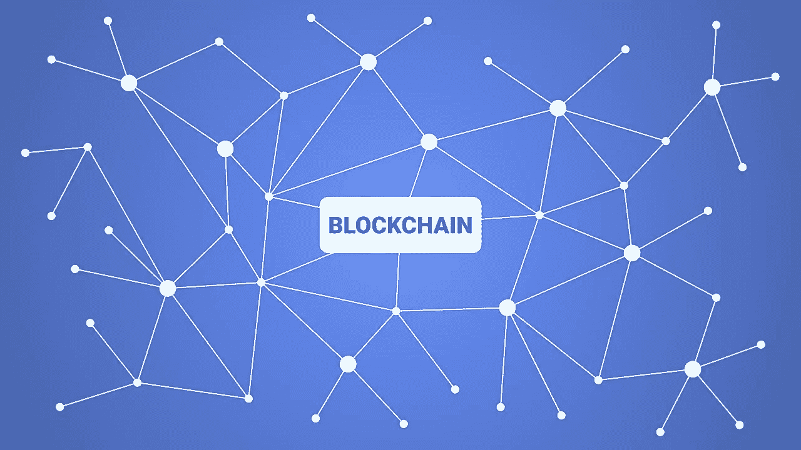
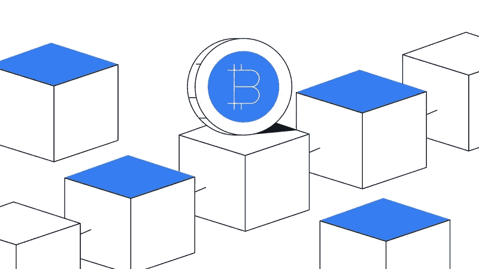
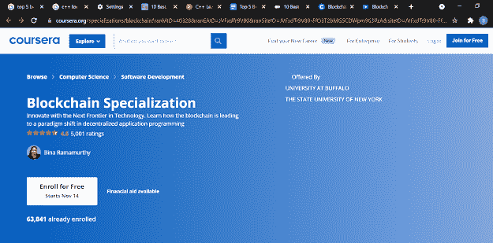
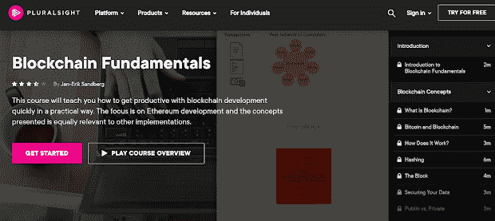

# 2022 年免费学习区块链的 6 个最佳地点

> 原文：<https://medium.com/javarevisited/6-best-places-to-learn-blockchain-for-free-dcb20bd92c8f?source=collection_archive---------2----------------------->

## 这些是 2022 年免费学习区块链的最佳网站和在线平台，包括，Udemy，Coursera 和 101 Blockchains.com

你好伙计们，如果你想在 2022 年学习区块链，并寻找免费学习区块链的最佳网站，那么你来对地方了。以前我分享过 [**最佳区块链书籍**](https://javarevisited.blogspot.com/2022/06/top-5-books-to-learn-blockchain-for.html) 、 [**最佳区块链课程**](https://javarevisited.blogspot.com/2020/07/top-5-online-courses-to-learn-blockchain.html) 、 [**最佳区块链认证**](https://javarevisited.blogspot.com/2022/01/5-best-blockchain-certifications-and.html) ，在这篇文章里，我准备免费分享学习区块链的最佳地点。区块链是一种新兴技术，在市场上越来越受欢迎。

如果你想在这个领域发展，你必须首先对区块链技术有一个全面的了解。在线认证课程可以让你在学术和实践方面都有所了解，因为它是一项复杂且相对较新的技术。

在这个列表中，我包括了最好的网站，像 Udemy 和 Coursera 这样的在线学习平台以及像 101 Blockchain 这样的学习区块链的专用社区。如果你有任何其他学习区块链的好地方，请在评论中免费分享。

# 2022 年 6 个网站和在线平台免费学习区块链

不浪费你的时间，这里有最好的网站，提供学习区块链的在线课程，也是免费学习区块链技术的最好地方。

## 1.乌德米

Udemy 关于区块链技术和区块链生态系统的广泛在线课程迎合了所有级别的专业知识。它的一些课程可能会教任何没有区块链知识的人如何使用这项技术，它是如何工作的，以及它周围有什么。

Udemy 的课程由业内专业人士教授，他们能够涵盖广泛的主题，包括安全性和基础知识。区块链技术、开发、密码学、建议、工具都可能在这里找到。

## 为什么是 Udemy？

Udemy 是最古老、最著名的在线学习平台之一，它包含了大量的在线课程。它提供多样化的课程选择，从基本技能到创造性艺术，甚至专业主题。该网站上有近 45，000 门课程，这反映了该平台在学生中的受欢迎程度。

由于其独特的开放式方法，Udemy 提供了大量的课程——根据其网站，超过 65，000 门单独的课程——并拥有大量的学生。这些课程涵盖了各种各样的领域，如编程和开发以及商业和设计等。

这里有几个 Udemy 上的免费区块链课程，你可以在 2022 年学习区块链

*   [区块链理论 101](https://click.linksynergy.com/fs-bin/click?id=JVFxdTr9V80&subid=0&offerid=323058.1&type=10&tmpid=14538&RD_PARM1=https%3A%2F%2Fwww.udemy.com%2Fblockchain-theory-101%2F)
*   [区块链初学 Python](https://click.linksynergy.com/deeplink?id=JVFxdTr9V80&mid=39197&murl=https%3A%2F%2Fwww.udemy.com%2Fcourse%2Fblockchain-for-beginners-with-python%2F)
*   [加密货币和区块链介绍](https://click.linksynergy.com/fs-bin/click?id=JVFxdTr9V80&subid=0&offerid=323058.1&type=10&tmpid=14538&RD_PARM1=https%3A%2F%2Fwww.udemy.com%2Fintroduction-to-cryptocurrencies%2F)

而且，如果你能花几块钱学习区块链，那么 [**区块链 A-Z:学习如何建立你的第一个区块链**](https://click.linksynergy.com/deeplink?id=JVFxdTr9V80&mid=39197&murl=https%3A%2F%2Fwww.udemy.com%2Fcourse%2Fbuild-your-blockchain-az%2F) 也是一个很棒的课程。是一次彻底的、动手的区块链教育。随着建立安全的区块链技术，它也将告诉你在这个问题上的哲学。

## 2.101 区块链

这是 2022 年又一个学习区块链的伟大网站。101 区块链学院是由 Aviv Lichtigstein 创立的，它是专门从事实用区块链专业培训和认证项目的最佳平台之一。

101 区块链有免费和付费的区块链课程，以及像[认证企业区块链专业人员](https://www.shareasale.com/r.cfm?b=1713885&u=880419&m=105464&urllink=&afftrack=)和[认证企业区块链架构师](https://www.shareasale.com/r.cfm?b=1713895&u=880419&m=105464&urllink=&afftrack=)这样的行业认可的区块链认证，这两者也是深入学习区块链的绝佳资源。

101 区块链是你提升区块链专业知识和职业信誉的一站式平台，也是最大的区块链从业者和学习者社区，拥有超过 3 万名区块链专业人士。

我说过，他们也有免费的区块链课程， [**企业区块链基础知识**](http://shrsl.com/34mvm) 你可以用它免费学习区块链概念。这个关于企业区块链的免费课程让您有机会探索该平台及其提供的内容，并在此过程中学习区块链的关键概念。如果你刚开始接触区块链，我强烈推荐这门课程给你。

你还可以 [**成为 101 区块链的成员，每月只需 25 美元**](https://shareasale.com/r.cfm?b=1696402&u=880419&m=105464&urllink=https%3A%2F%2F101blockchains%2Ecom%2Fmembership%2F&afftrack=) 就可以享受他们的年度计划，并获得他们所有的优质区块链学习材料和认证。我强烈推荐任何想在区块链上开始职业生涯的人。

## 3.Coursera

Coursera 是一个为任何想在线学习的人提供多种语言字幕的在线课程的平台。几乎所有在该平台上可访问的区块链课程都有各种流行语言的字幕，包括法语、西班牙语、阿拉伯语、德语、意大利语、俄语和简体中文等。

## 为什么是 Coursera？

Coursera 是一个经过精心挑选的在线学习平台。学生可以通过他们的在线学习平台从一些世界上最著名的学校和学术机构学习课程并获得学位，包括斯坦福大学、密歇根大学、宾夕法尼亚大学等。这所大学的每门课程都是由该机构的一名资深教员教授的。

这取决于你选择的课程类型和你愿意做出的承诺程度。Coursera 的课程提供一系列奖项，从结业证书到各个领域的完整学位。

每门课程持续 4 到 6 周，包括积极参与和分级作业。作业可以通过自动评分或同行评议来评估。最棒的是你可以免费审计它们。

这里有几门来自 Coursera 的区块链课程，你可以免费旁听

*   [区块链基础知识](https://coursera.pxf.io/c/3294490/1164545/14726?u=https%3A%2F%2Fwww.coursera.org%2Flearn%2Fblockchain-basics)
*   [智能合约](https://coursera.pxf.io/c/3294490/1164545/14726?u=https%3A%2F%2Fwww.coursera.org%2Flearn%2Fsmarter-contracts)
*   [分散应用(Dapps)](https://coursera.pxf.io/c/3294490/1164545/14726?u=https%3A%2F%2Fwww.coursera.org%2Flearn%2Fdecentralized-apps-on-blockchain)

如果你需要认证，那么你也可以参加布法罗大学和纽约州立大学的这个 [**区块链专业**](https://coursera.pxf.io/c/3294490/1164545/14726?u=https%3A%2F%2Fwww.coursera.org%2Fspecializations%2Fblockchain) ，这是一个完整的课程，适合那些有或没有软件开发经验的人。

完成这门初级课程总共需要大约 10 个小时。它不仅向您介绍了基础技术，还讨论了支持去中心化的意识形态。

顺便说一句，如果你喜欢 Coursera 课程和认证，那么你也可以参加[**Coursera Plus**](https://coursera.pxf.io/c/3294490/1164545/14726?u=https%3A%2F%2Fwww.coursera.org%2Fcourseraplus)**，这是一个**订阅计划，提供超过 7000 门课程、专业认证和知名大学公司的专业认证。它每年花费大约 399 美元，绝对是你自我升级的最佳投资。

 [## Coursera Plus |无限制访问 7，000 多门在线课程

### 用 Coursera Plus 投资你的职业目标。无限制访问 90%以上的课程、项目…

coursera.pxf.io](https://coursera.pxf.io/c/3294490/1164545/14726?u=https%3A%2F%2Fwww.coursera.org%2Fcourseraplus) 

## 4.LinkedIn 学习

[LinkedIn Learning](http://linkedin-learning.pxf.io/c/1193463/449670/8005) 提供各种区块链课程，帮助你了解更多技术。LinkedIn 已经不仅仅是一个商业软件；它也发展成为最受欢迎的教育平台之一。

## 为什么选择 LinkedIn

LinkedIn Learning 是一个类似于 Udemy 的平台，它允许教师提交他们的课程进行审批，然后学生才能通过该网站访问这些课程。该平台曾被称为 Lynda.com，但微软收购了它，并在收购 LinkedIn 平台时将其与 LinkedIn 平台合并。

因为只有在他们教授和交付给学生的主题方面具有先验知识的个人才被允许在 LinkedIn 学习平台上创建和发布课程，所以任何人都可以不受限制地在该网站上创建和发布课程。

职业社交网站 LinkedIn 也提供了一个极具竞争力的计划，让程序员和开发人员以每月 19.99 美元的价格访问超过 16，000 门课程，他们还提供一个月的免费试用**，这对不断学习新技能的程序员和开发人员来说是理想的。**

## **LinkedIn 课程**

**[区块链:基础知识](http://linkedin-learning.pxf.io/c/1193463/449670/8005?u=https%3A%2F%2Fwww.linkedin.com%2Flearning%2Fblockchain-basics)**

**如果你已经对该技术有了基本的了解，可以考虑报读中级课程《区块链:基础》。课程总共将持续 90 分钟。它介绍了区块链技术，并解释了去中心化的加密数据对商业和整个社会意味着什么。你可以使用他们的 [*1 个月免费试用*](http://linkedin-learning.pxf.io/c/1193463/449670/8005?u=https%3A%2F%2Fwww.linkedin.com%2Flearning%2Fsubscription%2Fproducts) 免费加入这个课程。**

****

## **5.EatTheBlocks**

**EatTheBlocks 是一个平台，提供关于区块链发展和相关技术以及其他相关主题的各种课程。这些课程不仅是自定进度的，而且一旦注册，您还将终身获得培训材料。**

## **为什么要吃巧克力？**

**Eattheblocks 是一个特别为所有技术学习开放的平台。他们为所有的技术课程提供免费和付费的课程。他们的课程是由他们在 IT 领域受过高等教育的专业团队制作的。**

## **EatTheBlocks 课程**

**学习区块链开发**

**它的 6 位数区块链开发者课程将帮助你彻底理解区块链技术、比特币和以太坊的基本思想。您还将了解分散式应用程序、区块链开发工具、智能合同、solidity 开发，以及如何获得一份区块链开发人员的工作。您还将了解分散式应用程序和区块链开发工具。**

****

## **6.多元视觉**

**Pluralsight 也提供区块链课程，这是一家提供在线区块链课程的知名公司。这个平台为专业人士和普通人提供了各种各样的区块链课程。**

**虽然 plur sight 并不完全免费，但它经常在周末运行 Pluralsight free，他们在周末开放平台，你可以免费查看他们的课程。**

**他们有许多很棒的区块链课程，如[区块链基础知识](https://pluralsight.pxf.io/c/1193463/424552/7490?u=https%3A%2F%2Fwww.pluralsight.com%2Fcourses%2Fblockchain-fundamentals)和[区块链——原理和实践](https://pluralsight.pxf.io/c/1193463/424552/7490?u=https%3A%2F%2Fwww.pluralsight.com%2Fcourses%2Fblockchain-principles-practices)，学习区块链技术的原理、关键商业区块链术语、智能合同基础知识和区块链变换是该平台涵盖的一些主题。**

****

## **为什么是复数视线？**

**在撰写本文时，Pluralsight 的网站上有大约 5000 多门在线课程。事实上，这些课程都是经过精心挑选的，并且是由经过认证的人员讲授的，这使其在竞争中脱颖而出。**

**在这里还可以找到更多的好东西，比如众多的学习路线、技能评估和其他有用的功能。这些课程是完全自定进度的，这使得无论你投入学习的时间有多少，学习起来都很简单。**

**在撰写本文时，Pluralsight 提供了近 5000 门在线课程。事实上，这些课程都是经过精心挑选的，并由有执照的讲师授课，这使它们在竞争中脱颖而出。**

**附加功能包括各种学习途径、技能评估和各种其他选项。这些课程完全是自定进度的，无论你想在白天还是晚上的什么时间学习都很容易。**

## **特色 Pluralsight 课程学习区块链**

**[**区块链基础**](https://pluralsight.pxf.io/c/1193463/424552/7490?u=https%3A%2F%2Fwww.pluralsight.com%2Fcourses%2Fblockchain-fundamentals)**

**如果你是新手，区块链基础课程可能对你有用。它将教你以太坊编程以及其他关键主题，你将需要在未来与区块链技术的生产力。**

**课程将持续大约两个半小时。还介绍了构建私有区块链、智能合约、DAPP 开发和其他类似活动的方法。**

****

**你也可以使用他们的 [**10 天免费试用**](https://pluralsight.pxf.io/c/1193463/424552/7490?u=https%3A%2F%2Fwww.pluralsight.com%2Fpricing%2Ffree-trial) 免费查看这些区块链课程中的任何一门。**

** [## Pluralsight |个人免费试用

### 立即开始免费试用 Pluralsight！查看我们为个人和团队提供的服务，如果您不确定…

pluralsight.pxf.io](https://pluralsight.pxf.io/c/1193463/424552/7490?u=https%3A%2F%2Fwww.pluralsight.com%2Fpricing%2Ffree-trial) 

这就是 2022 年初学者学习区块链的最佳地点。榜单包括 2022 年最佳网站、在线平台和免费学习区块链的地方。它总结了我们对学习区块链的最佳区块链课程和认证的详细讨论。

区块链的用途不仅仅是交付安全的货币；它还可以用于监控供应链，或用于希望管理其数字身份的个人，使他们能够在全球不发达地区获得金融服务。

你可能喜欢的其他**区块链和科技文章**

*   [我最喜欢的学习以太坊的在线课程](https://javarevisited.blogspot.com/2021/11/top-5-courses-to-learn-ethereum-for.html)
*   [开发者的 10 门最佳区块链课程](/javarevisited/best-blockchain-courses-and-certification-in-2020-63729f8f04d0)
*   [初学者学习数据科学的 10 门课程](https://hackernoon.com/10-machine-learning-data-science-and-deep-learning-courses-for-programmers-7edc56078cde)
*   [2022 年学习 Python 的 5 大课程](https://hackernoon.com/top-5-courses-to-learn-python-in-2018-best-of-lot-26644a99e7ec)
*   [学习 Solidity 编程语言的 5 门最佳课程](https://javarevisited.blogspot.com/2022/01/top-5-courses-to-learn-solidity-for.html)
*   [面向程序员的 10 门机器学习和深度学习课程](https://hackernoon.com/top-5-courses-to-learn-python-in-2018-best-of-lot-26644a99e7ec)
*   [2022 年学习 Python 的 10 个理由](https://hackernoon.com/10-reasons-to-learn-python-in-2018-f473dc35e2ee)
*   [初学者学习 Python 的 10 门免费课程](https://hackernoon.com/10-free-python-programming-courses-for-beginners-to-learn-online-38312f3b9912)
*   [学习数据科学 Python 的 5 本书](https://javarevisited.blogspot.com/2019/08/top-5-python-books-for-data-science-and-machine-learning.html)
*   [学习数据科学 Tableau 的前 5 门课程](https://javarevisited.blogspot.com/2019/07/top-5-tableau-online-courses-and-certifications-for-data-science-engineers.html)
*   [面向数据科学和机器学习的 8 大 Python 库](https://javarevisited.blogspot.com/2018/10/top-8-python-libraries-for-data-science-machine-learning.html)
*   [学习机器学习的 5 大免费课程](https://www.java67.com/2019/01/5-free-courses-to-learn-machine-and-deep-learning-in-2019.html)
*   [学习高级数据科学的前 5 门课程](https://hackernoon.com/top-5-data-science-and-machine-learning-course-for-programmers-e724cfb9940a)
*   [初学者学习 TensorFlow 的 5 大课程](https://hackernoon.com/top-5-tensorflow-and-ml-courses-for-programmers-8b30111cad2c)
*   [2022 年学习区块链的 7 门免费课程](/javarevisited/7-free-courses-to-learn-blockchain-in-2020-764e66b47ebe)

感谢您阅读本文。如果你喜欢这些 2022 年免费学习区块链的最佳地点，那么请与你的朋友和同事分享，如果你觉得它们有用的话。如果您有任何问题或反馈，请留言。

**P. S.** —如果你认真学习区块链技术并寻找最好的区块链认证，那么 Coursera 上的这个 [**区块链认证**](https://coursera.pxf.io/c/3294490/1164545/14726?u=https%3A%2F%2Fwww.coursera.org%2Fspecializations%2Fblockchain) 是最好的资源。我的许多学生和读者都选了这门课，反馈非常好。

 [## 区块链

### 利用下一个前沿技术进行创新。了解区块链如何引领去中心化的范式转变…

coursera.pxf.io](https://coursera.pxf.io/c/3294490/1164545/14726?u=https%3A%2F%2Fwww.coursera.org%2Fspecializations%2Fblockchain)**