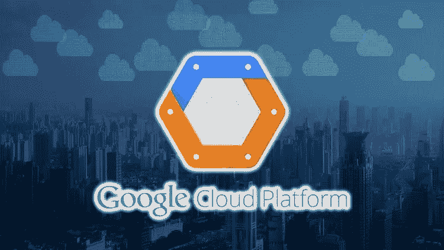
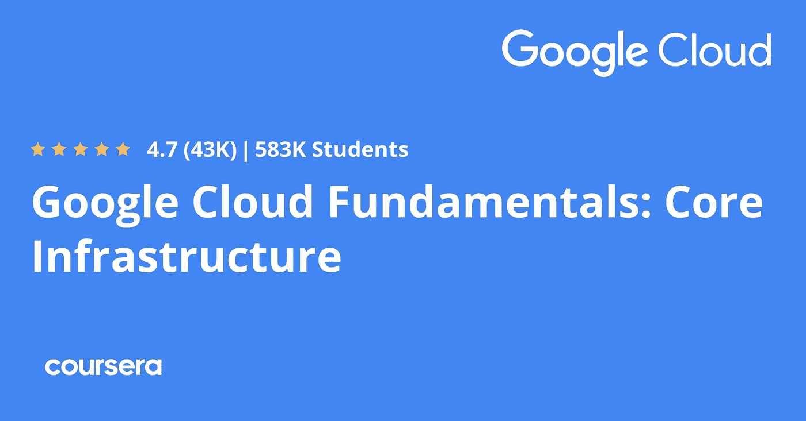
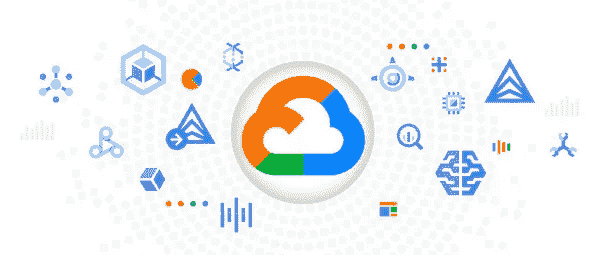
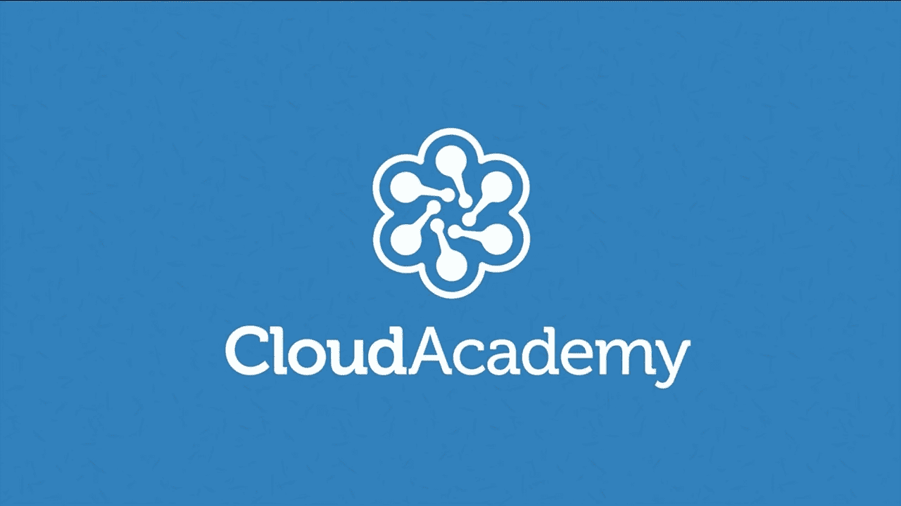
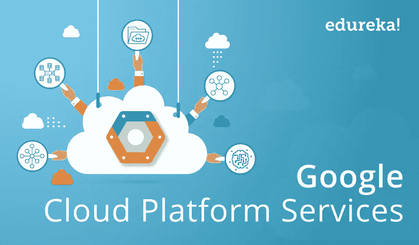
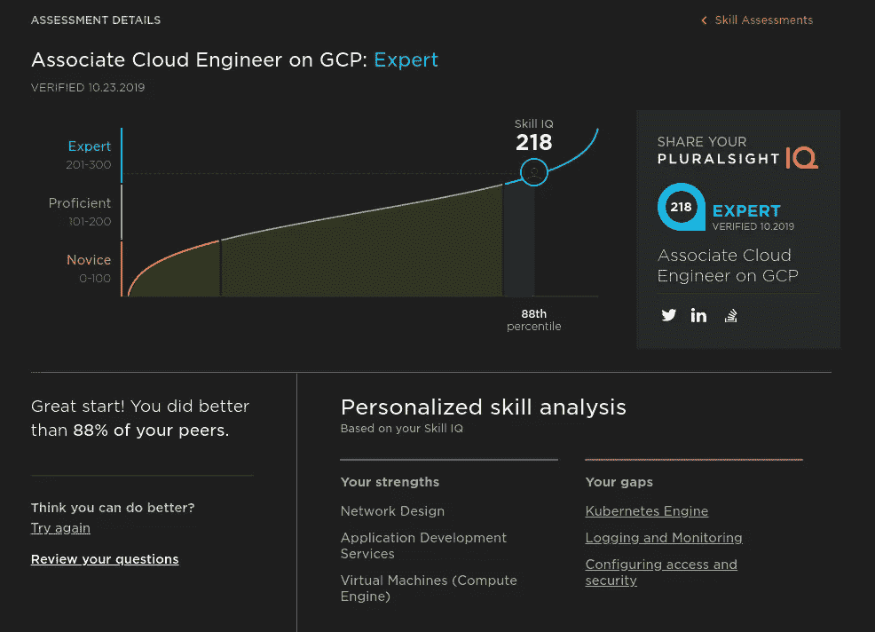

# 2022 年免费在线学习谷歌云平台(GCP)的 6 个地方

> 原文：<https://medium.com/javarevisited/6-best-places-to-learn-google-cloud-platform-gcp-online-for-free-e2559732e96?source=collection_archive---------3----------------------->

## 这些是最好的网站，在线平台和免费在线学习谷歌云平台的地方。

大家好，如果你想了解谷歌云平台、产品和服务，并寻找书籍、在线课程、教程、项目和案例研究等最佳资源，那么你来对地方了。

早些时候，我已经分享了学习谷歌云平台的[最佳课程](https://www.java67.com/2020/09/5-free-courses-to-pass-google-cloud-developer-certification.html)以及免费的[谷歌云课程](https://www.java67.com/2020/07/5-free-courses-to-learn-google-cloud-platform-and-concepts.html)，在这篇文章中，我将分享学习谷歌云平台的最佳网站。这些都是很好的资源，包括可以免费学习和实践谷歌云的网站。

我已经包括了两个官方课程，在那里你可以获得学习谷歌云的最新材料，做样本项目，以及像 Udemy 和 Coursera 这样的在线学习网站，在那里你可以获得最好的免费资源来学习基本的谷歌云概念。

GCP 或谷歌云平台是一种服务，你可以托管你的应用程序或网络应用程序，并在云中运行，这样世界上任何地方的人都可以使用它，或者你可以托管一个常规网站，它在许多国家都有数据中心，让你可以扩展你的业务和基础设施，你可以在同样的谷歌公司及其服务，如 Gmail 等。

谷歌云平台提供了许多产品和工具来帮助您的业务，如计算，您可以在其中部署和运行您的应用程序。另一个产品是数据库，你可以在其中存储用户证书等信息，还有另一个用于机器学习和人工智能的产品，你可以在其中托管你的人工智能应用程序或利用预先训练的 API，如视觉。

本文将向您介绍一些网站，这些网站将帮助您深入了解谷歌云平台，尤其是如果您是一名想要将自己的应用程序部署到云的 web 开发人员。

# 2022 年免费在线学习谷歌云平台的 6 个最佳平台

这里列出了一些最好的网站，你可以在那里免费学习谷歌云平台。这些网站是著名的在线网站，也包含免费和付费资源。我提到了免费和付费课程，这样你可以根据你的经验水平选择最好的学习材料。

## 1. [Udemy](https://click.linksynergy.com/deeplink?id=CuIbQrBnhiw&mid=39197&murl=https%3A%2F%2Fwww.udemy.com%2Fcourses%2Fsearch%2F%3Fprice%3Dprice-free%26q%3Dgoogle%2Bcloud%2Bplatform%26sort%3Drelevance%26src%3Dsac)

如果你问我学习任何东西的最佳资源不仅仅是谷歌云平台，我会建议 Udemy 作为最好的平台之一，并且是世界各地成千上万名教师用不同语言提供的课程数量的第一名。

有许多课程可以教您如何使用 GCP 服务提供的不同产品，以及如何部署您的应用程序。你可以在 Udemy 上加入免费课程[**谷歌云平台概念**](https://click.linksynergy.com/deeplink?id=JVFxdTr9V80&mid=39197&murl=https%3A%2F%2Fwww.udemy.com%2Fcourse%2Fgcp-google-cloud-platform-concepts%2F) 学习基本的谷歌云服务。

而且，如果你需要免费资源，你也可以在 Udemy 上加入免费课程[**谷歌云平台概念**](https://click.linksynergy.com/deeplink?id=JVFxdTr9V80&mid=39197&murl=https%3A%2F%2Fwww.udemy.com%2Fcourse%2Fgcp-google-cloud-platform-concepts%2F) 在线学习基本的谷歌云服务。

 [## 2022 年面向初学者的 5 大免费谷歌云平台课程——最好的

### 伙计们，如果你们也想在 2022 年学习谷歌云平台，并且正在寻找一些免费的在线谷歌云…

www.java67.com](https://www.java67.com/2020/07/5-free-courses-to-learn-google-cloud-platform-and-concepts.html) 

## 2. [Coursera](https://coursera.pxf.io/c/3294490/1164545/14726?u=https%3A%2F%2Fwww.coursera.org%2F)

本文的第三个建议是一个与众不同的平台，因为它的课程不是由普通人创建的，而是由世界顶级大学提供的，其中一些课程会让你深入了解更多的概念，即所谓的专业化。

当你在 Coursera 上搜索 GCP 课程时，你会发现许多教授你谷歌云的云架构的课程，例如这门课程 [**带谷歌云专业证书的云架构**](https://coursera.pxf.io/c/3294490/1164545/14726?u=https%3A%2F%2Fwww.coursera.org%2Fprofessional-certificates%2Fgcp-cloud-architect) ，这是最值得推荐的准备谷歌云专业架构师考试的课程之一，也是学习谷歌云的重要资源。

Coursera 最好的一点是，他们所有的谷歌云课程都是由谷歌云培训本身创建的，这意味着你将从源头上学习。

对于初学者来说，还有一个课程可以教你谷歌云的不同产品，所以如果你是初学者，你可以通过这个名为 [**谷歌云产品基础**](https://coursera.pxf.io/c/3294490/1164545/14726?u=https%3A%2F%2Fwww.coursera.org%2Flearn%2Fgoogle-cloud-product-fundamentals) 的课程开始探索这项服务。

Coursera 的另一个优点是，大多数课程都是免费审核的，这意味着你可以免费加入，但你不能访问实验室和评估，因为你需要购买 Coursera Plus，一个会员计划，或者你需要加入专业化，每月花费约 59 美元。如果你想在 Coursera 上获得认证，我推荐你加入 [**Coursera Plus**](https://coursera.pxf.io/c/3294490/1164545/14726?u=https%3A%2F%2Fwww.coursera.org%2Fcourseraplus) ，每月只需 59 美元就可以无限制地获得证书和项目。

 [## Coursera Plus |无限制访问 7，000 多门在线课程

### 用 Coursera Plus 投资你的职业目标。无限制访问 90%以上的课程、项目…

coursera.pxf.io](https://coursera.pxf.io/c/3294490/1164545/14726?u=https%3A%2F%2Fwww.coursera.org%2Fcourseraplus) 

## 3.[cloud.google.com](https://cloud.google.com/gcp/getting-started)

这是谷歌云的官方网站，它有大量最新的资源来学习谷歌云的概念。你可以浏览这个网站，了解基本的谷歌云服务和平台本身。

它有大大小小的教程、案例研究以及详细的文档，可以了解你想要的特定谷歌云服务或平台的一切。我特别喜欢他们的入门部分和最佳实践部分，其中强调了获得大部分谷歌云平台的最佳实践。

他们既有基于文本的教程，也有视频教程，还有示例项目，您可以从中获得一些实践经验。例如，书架应用程序是一个示例 web 应用程序，它向您展示了如何使用各种 Google 云产品和服务，如应用程序引擎、云 SQL、数据存储、云存储、计算引擎等等

你也可以在你选择的任何编程语言上启动这些资源，比如 [Java](https://www.youtube.com/watch?v=g4rPdPxNb5w) 、 [Python](https://www.java67.com/2020/05/top-5-courses-to-learn-python-in-depth.html) 、 [JavaScript](https://www.java67.com/2020/08/top-10-pluralsight-courses-to-learn-JavaScript.html) 。NET、 [Golang](/javarevisited/7-online-courses-to-learn-golang-or-go-programming-languages-in-2020-f599a25cf14a) 、 [Ruby](/javarevisited/10-best-ruby-on-rails-courses-for-beginners-dca4d66e9f7b) 和 [PHP](/javarevisited/10-best-php-courses-for-beginners-and-experienced-developers-db18057a814f)

也有准备各种谷歌云认证的资源，如云工程师、数据工程师、安全工程师、DevOps 工程师等等。如果你想深入学习谷歌云，你应该把这个网站加入书签。

## 4.[云学院](https://cloudacademy.com/library/google/)

本文中的最后一个建议是一个很棒的网站，可能是在不同技术主题和编程语言中制作新课程的增长最快的网站。

许多针对谷歌云平台的课程，如[谷歌云平台基础](https://cloudacademy.com/learning-paths/google-cloud-platform-fundamentals-54/)向您展示如何在 GCP 云中部署您的应用，以及如何在云中利用数据库服务和网络等等。

## 5.[爱德华卡](https://click.linksynergy.com/deeplink?id=JVFxdTr9V80&mid=42536&murl=https%3A%2F%2Fwww.edureka.co%2F&LSNSUBSITE=LSNSUBSITE)

Edureka 是一个小型在线电子学习平台，它教授您不同的技术主题，如机器学习、数据科学、web 开发和许多编程语言，如 python 和 PHP 等。

这个网站上没有太多关于 GCP 的课程，但我发现了一个看起来很有趣的课程，叫做[谷歌云认证培训](https://click.linksynergy.com/deeplink?id=JVFxdTr9V80&mid=42536&murl=https%3A%2F%2Fwww.edureka.co%2Fgoogle-cloud-architect-certification-training&LSNSUBSITE=LSNSUBSITE)，它会让你深入了解这项服务是什么，以及那里有哪些不同的产品。

## 6.多重视野[免费试用]

学习 GCP 的另一个很好的平台是 Pluralsight，其中有数十门课程可以掌握这些技能，并学习如何在云上部署您的项目，在本文中，我将推荐该平台上的一些最佳课程。

[谷歌云平台基础知识](https://pluralsight.pxf.io/c/1193463/424552/7490?u=https%3A%2F%2Fwww.pluralsight.com%2Fcourses%2Fgoogle-cloud-platform-fundamentals)是最简单的课程之一，旨在为希望了解 GCP 及其与其他云提供商之间的差异以及其常见应用程序的架构模式的初学者提供帮助。

另一个是 [**谷歌云平台基础——核心基础设施**](https://pluralsight.pxf.io/c/1193463/424552/7490?u=https%3A%2F%2Fwww.pluralsight.com%2Fcourses%2Fgoogle-cloud-platform-fundamentals-core-infrastructure) 教你这个平台上可用的不同产品，以及如何整合基于云的解决方案。

顺便说一下，Pluralsight 也与 Google Cloud 有合作关系，但他们的课程并不完全免费，你需要获得 Pluralsight 会员资格才能访问这些课程，这些课程每年花费约 299 美元，但他们也提供 10 天的免费试用**，你可以使用它免费访问他们的课程。**

** [## Pluralsight |个人免费试用

### 了解有关 Pluralsight 免费试用版的更多信息。

pluralsight.pxf.io](https://pluralsight.pxf.io/c/1193463/424552/7490?u=https%3A%2F%2Fwww.pluralsight.com%2Fpricing%2Ffree-trial) 

以上就是 2022 年免费学习谷歌云平台的**最佳地点。现在每个企业都应该有一个网站，这样他们就可以通过分享文章和技巧或订阅模式与人们联系来赚钱，对于这种网站，他们应该有一个特殊的托管提供商，而不是我们所知道的常规提供商，因此谷歌推出了一项名为谷歌云平台或 GCP 的服务。**

您可能喜欢的其他**编程文章和教程**

*   [免费学习 Linux 的五大网站](https://javarevisited.blogspot.com/2021/06/5-websites-to-learn-linux-command-line.html)
*   [免费学习 Java 编码的五大去处](https://javarevisited.blogspot.com/2018/07/top-5-websites-to-learn-coding-in-java.html)
*   [5 个免费学习 Python 的网站](https://javarevisited.blogspot.com/2019/09/5-websites-to-learn-python-for-free.html)
*   [2022 年你能学会的 10 种编程语言](http://www.java67.com/2017/12/10-programming-languages-to-learn-in.html)
*   [每个 Java 开发者都应该知道的 10 个工具](http://www.java67.com/2018/04/10-tools-java-developers-should-learn.html)
*   【Java 和 Web 开发者应该学习的 10 个框架
*   [5 个免费在线学习 SQL 的网站](https://javarevisited.blogspot.com/2015/06/5-websites-to-learn-sql-online-for-free.html)
*   [完整的 Java 开发者路线图](https://javarevisited.blogspot.com/2019/10/the-java-developer-roadmap.html)
*   [2022 年 Java 程序员应该学会的 10 件事](https://javarevisited.blogspot.com/2017/12/10-things-java-programmers-should-learn.html#axzz5atl0BngO)
*   [21 个免费在线学习编码的网站](https://www.java67.com/2018/06/21-websites-to-learn-how-to-code-for.html)
*   [10 个免费学习 Git 和 Github 的网站](https://javarevisited.blogspot.com/2019/05/10-free-websites-to-learn-git-online.html)
*   [完整的 DevOps 工程师路线图](/hackernoon/the-2018-devops-roadmap-31588d8670cb)
*   [程序员 50+数据结构面试问题](/hackernoon/50-data-structure-and-algorithms-interview-questions-for-programmers-b4b1ac61f5b0)
*   5 个免费学习数据结构和算法的网站

感谢您阅读本文。如果你喜欢这个在线学习谷歌云平台和服务的最佳网站和平台列表，那么请与你的朋友和同事分享。如果您有任何问题或反馈，请留言。

如果你不介意花几块钱学习像谷歌云平台这样有价值且受欢迎的技能，它将长期为你服务，那么我强烈推荐你去看看 Janakiram 的 Udemy 上的 [**谷歌云平台(GCP)初学者基础**](https://click.linksynergy.com/deeplink?id=CuIbQrBnhiw&mid=39197&murl=https%3A%2F%2Fwww.udemy.com%2Fcourse%2Fgoogle-cloud-platform-gcp-fundamentals-for-beginners%2F) 课程，这是最好的初学者谷歌云课程之一。

 [## 2022 年学习 AWS、Google Cloud、Azure 和云计算的 10 大 Coursera 课程-最佳…

### 大家好，云计算是程序员、软件开发人员和任何 IT 专业人士都需要的技能…

javarevisited.blogspot.com](https://javarevisited.blogspot.com/2020/08/top-10-coursera-certifications-to-learn-cloud-computing-aws.html)**