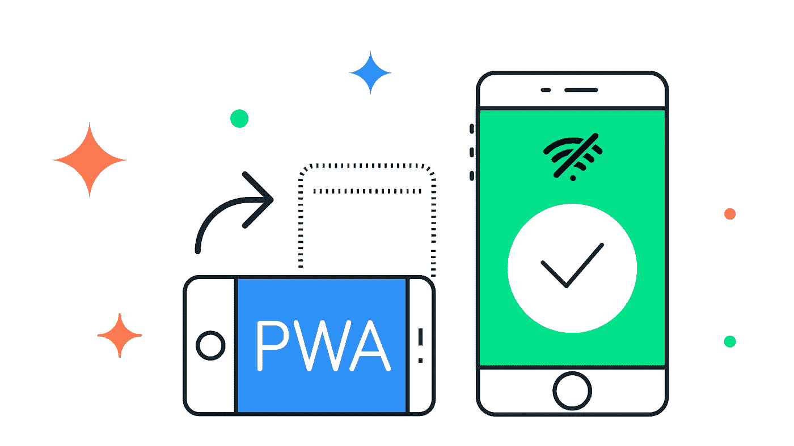

# 2023 年初学者学习的 6 门最佳渐进式 Web 应用开发(PWA)课程

> 原文：<https://medium.com/javarevisited/6-best-progressive-web-application-development-pwa-courses-for-beginners-860e67bee024?source=collection_archive---------2----------------------->

## 我最喜欢的在线课程，学习 Udemy、Pluralsight 和 Educative 的渐进式 Web 应用程序开发，面向 2023 年的初学者

image_credit — udemy

如果你想学习渐进式 Web 应用程序开发并寻找最好的在线课程，那么你来对地方了。以前我分享过 [**最佳网页开发课程**](/better-programming/my-5-favorite-courses-to-learn-web-development-in-2019-a5e74167f8b2) 和 [**UX/UI 设计课程**](https://javarevisited.blogspot.com/2020/06/top-5-courses-to-learn-ux-design-in.html) ，今天我要分享的是 2023 年你可以加入的最佳渐进式网页开发课程。

这些是学习这种热门技术的最佳课程，由专家创建，从 [Udemy](https://javarevisited.blogspot.com/2020/05/top-10-udemy-courses-to-learn-python-programming.html) 、 [Pluralsight](/javarevisited/top-10-pluralsight-courses-to-learn-programming-and-software-development-during-covid-19-stay-at-30b7d8a4f88f) 和 [Educative](https://javarevisited.blogspot.com/2020/05/top-10-educative-courses-for-programmers.html) 等网站中挑选。你很有可能没有听说过 progressive web app，这是一种创建和分发应用程序的现代风格，但是不要担心。

在这篇文章中，你不仅会学到什么是渐进式网络应用，还会看到**最佳在线课程，以了解渐进式网络应用**以及如何构建它们。

progressive web 应用程序就像使用任何 web 技术 [HTML/CSS](https://javarevisited.blogspot.com/2019/05/top-5-html-5-and-css-3-courses-for-web-developers.html) 、 [JavaScript](https://javarevisited.blogspot.com/2018/06/top-10-courses-to-learn-javascript-in.html) 、 [PHP](/javarevisited/top-10-free-courses-to-learn-php-and-mysql-for-web-development-e96e69982675) 、 [Python](https://javarevisited.blogspot.com/2020/06/top-5-courses-to-learn-python-full-stack-web-development.html) 和任何其他技术构建的任何常规 web 应用程序一样，但不同的是，它也可以下载到你的手机上，甚至在没有连接的情况下离线工作，因此它取代了去 Google Play 或 App Store 下载应用程序并将其安装到你的手机上的努力和时间。

这项技术对当地企业也很有用，因为雇佣一名网络开发人员和一名移动应用程序开发人员可能会很昂贵，所以[网络开发人员](/javarevisited/10-things-aspiring-web-developers-should-learn-in-2021-6747bfbfc12e)将集成这项技术，使这个网站可以在手机上下载，并像任何本地应用程序一样运行。

关于这项技术已经说得够多了，让我们来看看一些在线课程，它们将帮助你了解更多关于渐进式网络应用程序的知识，并将它们整合到你的网站上，如果你已经是一名[网络开发人员](/javarevisited/the-2019-web-developer-roadmap-ab89ac3c380e)，这将非常容易做到。

虽然你不需要参加所有这些课程，但你应该选择一门你与导师有联系的课程，并在继续下一门课程之前坚持下去。你如何找到适合你的渐进式网络应用课程？

嗯，我已经为不同类型的学习者分享了不同的选择，如基于项目的课程、互动课程和带有理论和练习的传统在线课程。你可以选择其中任何一个。

我也建议你先看预告片，去上样课，看看自己喜不喜欢。你喜欢这门课程的一个很好的标志是你是否没有跳过所有的预演。这是一个试金石，表明你喜欢老师的教学风格和内容。

# 2023 年面向初学者的 6 门最佳渐进式网络应用在线课程

在不浪费更多时间的情况下，这里列出了 2023 年你可以参加的学习渐进式 Web 应用程序开发的最佳在线培训课程和教程。这些课程由专家创建，受到许多开发者的信任，无论是初学者还是有经验的。它们也很实惠，尤其是每周都有的 Udemy 特卖，你只需花 10 美元就能买到。

## 1.[渐进式网络应用(PWA)——完整指南](https://click.linksynergy.com/deeplink?id=JVFxdTr9V80&mid=39197&murl=https%3A%2F%2Fwww.udemy.com%2Fcourse%2Fprogressive-web-app-pwa-the-complete-guide%2F)

对于那些熟悉 HTML/CSS JavaScript 并希望深入了解渐进式 web 应用程序的 web 开发人员来说，让他们的网站可以在移动设备上下载和安装，那么您可以在 Udemy 上观看本课程。

关于渐进式 web 应用程序的介绍，然后继续讨论如何使用应用程序清单使您的应用程序可安装在移动设备上，然后添加每个移动应用程序都应具备的一些重要功能，如推送通知和更多概念，这些将在本拥抱课程中讨论。

在本课程中，您将学到以下内容:

*   渐进式网络应用简介。
*   创建一个真正进步的 web 应用程序。
*   向您的 PWA 添加有用的功能。

**这里是加入本课程的链接最佳 PWA 课程** — [渐进式网络应用(PWA)](https://click.linksynergy.com/deeplink?id=JVFxdTr9V80&mid=39197&murl=https%3A%2F%2Fwww.udemy.com%2Fcourse%2Fprogressive-web-app-pwa-the-complete-guide%2F)

## 2.[Ionic——使用 Ionic & Angular](https://click.linksynergy.com/deeplink?id=JVFxdTr9V80&mid=39197&murl=https%3A%2F%2Fwww.udemy.com%2Fcourse%2Fionic-2-the-practical-guide-to-building-ios-android-apps%2F) 构建 iOS、Android &网络应用

对于 Angular.js 开发者来说，本课程就像是送给你的礼物，因为你将看到如何将这种渐进式 web 应用技术应用到你的网站上，以及学习 ionic 编程语言和构建 android 和 iOS 移动应用。

您将使用 ionic 和 angular.js 作为前端构建一个跨平台的应用程序，因此您将从介绍这两种编程语言以及如何使用它们进行编程开始。然后你将进入构建一个项目，用一个代码在 [Web](/better-programming/my-5-favorite-courses-to-learn-web-development-in-2019-a5e74167f8b2) 、 [Android](/javarevisited/5-free-courses-to-become-an-android-developer-d4d207f53675) 和 [iOS](/javarevisited/top-5-online-courses-to-learn-ios-12-swift-in-2019-a35ae1be7b2b?source=---------22------------------) 上运行。

您将在本课程中学到以下内容:

*   了解如何使用离子和角度编码。
*   构建跨平台项目。
*   向您的应用程序添加一些功能。

**这是加入本课程的链接**——[用 Ionic & Angular](https://click.linksynergy.com/deeplink?id=JVFxdTr9V80&mid=39197&murl=https%3A%2F%2Fwww.udemy.com%2Fcourse%2Fionic-2-the-practical-guide-to-building-ios-android-apps%2F) 构建 iOS、Android &网络应用

## 3.[渐进式网络应用基础](https://pluralsight.pxf.io/c/1193463/424552/7490?u=https%3A%2F%2Fwww.pluralsight.com%2Fcourses%2Fprogressive-web-app-fundamentals/)【plural sight】

对于那些想要快速了解如何使用渐进式网络应用程序并将其集成到他们的网站上，使其像一个本地应用程序一样并可安装在任何移动设备上的网络开发人员来说，您可以在 Pluralsight 上观看本课程。

一如既往地介绍渐进式 web 应用程序，以及如何使用应用程序清单功能将其添加到主屏幕，并添加一些有用的东西，如应用程序的推送通知和后台同步，以及您将在本课程中探索的更多有趣的主题。

你将在本课程中学到:

*   添加主屏幕。
*   创建可安装的 web 应用程序。
*   添加推送通知和后台同步。

这是参加本课程的链接。[渐进式网络应用基础](https://pluralsight.pxf.io/c/1193463/424552/7490?u=https%3A%2F%2Fwww.pluralsight.com%2Fcourses%2Fprogressive-web-app-fundamentals/)

顺便说一句，你需要一个 [Pluralsight 会员](https://pluralsight.pxf.io/c/1193463/424552/7490?u=https%3A%2F%2Fwww.pluralsight.com%2Flearn)才能加入这个课程。订阅费用约为每月 29 美元，或每年 299 美元(14%的折扣)，我强烈推荐它，因为它不仅可以让您访问本课程，还可以访问 7000 多种其他高质量的在线课程，以学习最新的技能和技术。或者，你也可以使用他们的 [**10 天免费通行证**](https://pluralsight.pxf.io/c/1193463/424552/7490?u=https%3A%2F%2Fwww.pluralsight.com%2Flearn) 免费观看这些渐进式网络应用基础课程。

 [## 对个人来说

### 无论你想进入一个新的领域，改善你的角色，还是把你的伟大想法变成现实，Pluralsight…

pluralsight.pxf.io](https://pluralsight.pxf.io/c/1193463/424552/7490?u=https%3A%2F%2Fwww.pluralsight.com%2Flearn) 

## 4.[渐进式网络应用从零到英雄](https://www.educative.io/courses/zero-to-hero-with-progressive-web-apps?affiliate_id=5073518643380224)

这是从 Educative 学习 JavaScript 的另一个很棒的互动课程，Educative 是我最喜欢的互动学习网站之一。

对于那些想要将渐进式 web 应用集成到他们的项目中的 JavaScript 开发人员来说，这是一门理想的课程，他们可能需要看看这门课程。

以介绍这项技术及其优势开始课程，然后继续介绍在这个[渐进式网络应用](https://javarevisited.blogspot.com/2020/08/top-5-courses-to-learn-progressive-web-app-development.html#axzz6pGGJia96)中使用的工具和框架，并开始将这项技术集成到您的网站中，并为其添加功能，如 UI 监听器。

在本课程中，您将学到:

*   构建渐进式 web 应用程序。
*   了解这项技术中使用的工具。
*   正在添加 UI 侦听器。

**这是加入本互动课程** — [从零到英雄，使用渐进式网络应用](https://www.educative.io/courses/zero-to-hero-with-progressive-web-apps?affiliate_id=5073518643380224)的链接

除了这门课程，Educative 还有大量有用的内容，如[探索系统设计面试课程](https://www.java67.com/2019/09/top-5-courses-to-learn-system-design.html)，以及其他从探索开始的课程。你可以购买这门课程，也可以订阅**教育课程，每月花费约 14.9 美元，但也可以访问他们的所有课程。我个人发现，订阅更方便学习。**

** [## 探索系统设计面试——互动学习

### 系统设计问题已经成为软件工程面试过程的标准部分。在这些方面的表现…

www.educative.io](https://www.educative.io/collection/5668639101419520/5649050225344512?affiliate_id=5073518643380224)** 

## **5.[渐进式网络应用(PWA):简明 PWA 大师班](https://click.linksynergy.com/deeplink?id=JVFxdTr9V80&mid=39197&murl=https%3A%2F%2Fwww.udemy.com%2Fcourse%2Fprogressive-web-apps%2F)**

**最后一个建议是在 udemy 上开设一门课程，面向使用 HTML/CSS JavaScript 技术并对 git 源代码控制有所了解的 web 开发人员。

你将在本课程中学到以下内容:**

*   **服务人员。**
*   **给你的 PWA 增加一些功能。**
*   **服务人员工具。**

****这里是加入这个 Udemy 课程的链接**——[简明 PWA 大师班](https://click.linksynergy.com/deeplink?id=JVFxdTr9V80&mid=39197&murl=https%3A%2F%2Fwww.udemy.com%2Fcourse%2Fprogressive-web-apps%2F)**

****

## **6.[渐进式网络应用——从初学者到专家——2023 年](https://click.linksynergy.com/deeplink?id=JVFxdTr9V80&mid=39197&murl=https%3A%2F%2Fwww.udemy.com%2Fcourse%2Fprogressive-web-apps-beginners-to-advanced%2F)**

**这是 Udemy 上一个相对较新的学习渐进式网络应用的课程，但课程内容非常棒，而且是最新的。本课程包含超过 15.5 小时的高质量培训材料，用于学习 2023 年的渐进式 web 应用。**

**在本课程中，您将学习如何为新的和现有的 web 应用程序实现渐进式 Web 应用程序功能。在此过程中，您将学习如何测量和调试 PWA，以便不会遗漏任何 PWA 核心功能/**

**您还将学习构建渐进式 Web 应用程序的核心概念、Rest API 端点、 [cloud Firebase](/javarevisited/5-best-firebase-and-firestore-courses-for-frontend-developers-88052b0d3e74?source=---------10----------------------------) 、Index DB、应用程序审计和浏览器调试、Javascript Arrow 函数、关于服务工作者的核心概念、Node JS 等等！**

****这是参加课程** — [渐进式网络应用—初学者到专家— 2023](https://click.linksynergy.com/deeplink?id=JVFxdTr9V80&mid=39197&murl=https%3A%2F%2Fwww.udemy.com%2Fcourse%2Fprogressive-web-apps-beginners-to-advanced%2F) 的链接**

****

**以上是关于 2023 年学习渐进式 web 应用程序开发的最佳在线课程**网络正在赋予世界力量，每个组织或公司都应该有一个网站来推广他们的业务，并且应该给用户一个良好的体验，使其引人入胜，特别是当他们在打电话时，这就是渐进式 web 应用技术。

其他 **Web 开发文章**你可能喜欢****

*   **[完整的 Web 开发者路线图](https://javarevisited.blogspot.com/2019/02/the-2019-web-developer-roadmap.html)**
*   **[成为全栈式网络开发者的 10 门在线课程](/javarevisited/top-10-online-courses-to-become-a-fullstack-web-developer-in-2020-d608a6b63232)**
*   **[5 为网络开发人员提供的免费 HTML 和 CSS 课程](http://www.java67.com/2018/02/5-free-html-and-css-courses-to-learn-web-development.html)**
*   **每个软件开发人员都应该学习的 11 项基本技能**
*   **[初学者学习自举的 5 大课程](https://javarevisited.blogspot.com/2020/07/top-5-courses-to-learn-bootstrap-in.html)**
*   **[面向程序员的 10 门 Java 和 Web 开发课程](https://javarevisited.blogspot.com/2018/01/top-10-udemy-courses-for-java-and-web-developers.html)**
*   **[网络开发者路线图(前端+后端)](https://dev.to/javinpaul/the-2019-web-development-frontend-backend-roadmap-4le2)**
*   **[完整的 React 开发者路线图](https://javarevisited.blogspot.com/2018/10/the-2018-react-developer-roadmap.html)**
*   **[每个软件工程师都应该学习的 10 件事](/swlh/10-things-every-programmer-should-know-26ba37cfcaf4)**
*   **[成为全栈 Java 开发人员的前 5 门课程](https://javarevisited.blogspot.com/2020/06/top-5-courses-to-learn-python-full-stack-web-development.html)**
*   **[2023 年 Java 和 Web 开发者可以学习的 10 个框架](https://dev.to/javinpaul/10-frameworks-java-and-web-developers-can-learn-in-2019-17ke)**
*   **[每个网络开发者都应该学会的 10 件事](https://javarevisited.blogspot.com/2020/01/10-things-web-developers-should-learn.html)**
*   **[初学者学习 JavaScript 的 10 门在线课程](/javarevisited/10-best-online-courses-to-learn-javascript-in-2020-af5ed0801645)**
*   **[我最喜欢的免费课程学习打字稿](/javarevisited/top-10-free-typescript-courses-to-learn-online-best-of-lot-44bce9da41d1)**
*   **[学习 Web 开发 Python 的 10 门最佳课程](/@javinpaul/top-10-courses-to-learn-python-for-web-development-in-2020-best-of-lot-efe11fb6d212)**

**感谢您阅读本文。如果你发现这些*最佳渐进式网络应用在线课程*对学习渐进式网络开发有用，那么请与你的朋友和同事分享。如果您有任何问题或反馈，请留言。**

**如果你是网页设计和网页开发的新手，并且正在寻找免费的在线课程，那么你也可以看看这个由最好的 Udemy 讲师之一 Jonas Schmedtmann 教授的 [**网页设计速成班**](https://click.linksynergy.com/deeplink?id=JVFxdTr9V80&mid=39197&murl=https%3A%2F%2Fwww.udemy.com%2Fcourse%2Fweb-design-secrets%2F) 。这个课程也是完全免费的，你只需要一个 Udemy 账号就可以加入这个课程。**

** [## 免费网页设计教程-网页开发人员的网页设计:建立美丽的网站！

### 重要提示:这门课的内容也包含在我的另一门关于网页设计和开发的课程中

udemy.com](https://click.linksynergy.com/deeplink?id=JVFxdTr9V80&mid=39197&murl=https%3A%2F%2Fwww.udemy.com%2Fcourse%2Fweb-design-secrets%2F)**