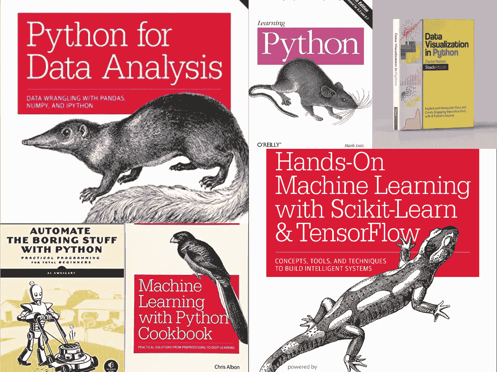
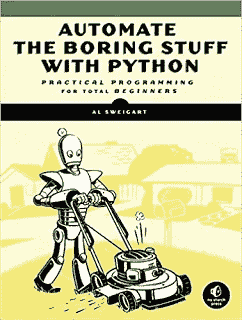
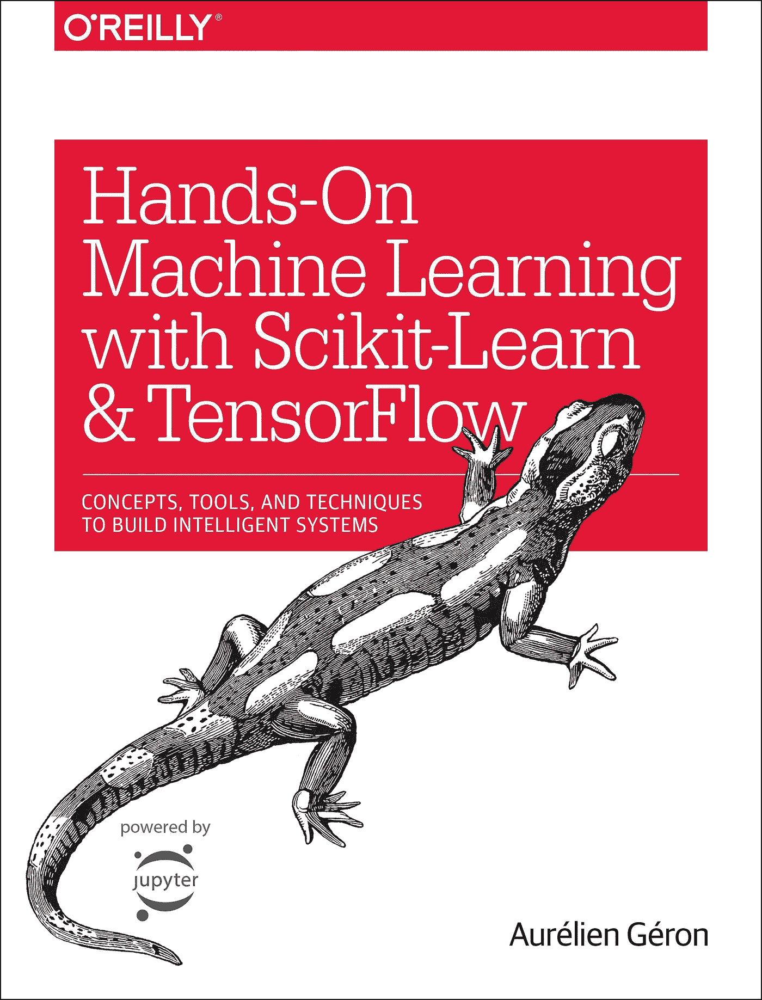

# 2023 年数据科学和机器学习的 6 本最佳 Python 书籍

> 原文：<https://medium.com/javarevisited/6-best-python-books-for-data-science-and-machine-learning-in-2021-2f41d9fbf8be?source=collection_archive---------0----------------------->

学习数据科学和机器学习的最佳 Python 书籍

你好，伙计们，如果你想学习数据科学和 Python 机器学习，并寻找数据科学和 ML 的最佳 Python 书籍，那么你来对地方了。

过去，我已经分享了数据科学的最佳 Python 课程 [**和 ML**](/javarevisited/my-favorite-data-science-and-machine-learning-courses-from-coursera-udemy-and-pluralsight-eafc73acc73f) ，今天，我将分享学习数据科学和用 Python 学习机器的最佳书籍。

Python 是数据工程师和数据科学家都使用的通用语言，可能也是最流行的编程语言。

我交谈过的所有数据科学家，以及我朋友圈中的许多人都非常喜欢 [Python](https://javarevisited.blogspot.com/2018/12/10-free-python-courses-for-programmers.html) ，主要是因为它可以自动化数据工程师需要做的所有繁琐的操作工作。

为了让这笔交易更加甜蜜，Python 还拥有算法、分析和像 Matplotlib 这样的[数据可视化库](https://www.java67.com/2020/07/top-5-data-visualization-tools-every.html)，Matplotlib 是一个重要的数据科学家。

在这两种角色中，管理、自动化和分析数据的需求通过几行代码变得更加容易。这是数据科学家日常工作中必不可少的一部分，几乎所有与我交谈过的人都推荐了《用 Python 自动化枯燥的东西》******这本书。

过去我曾分享过一些学习 Python 的好书，但都是针对一般编程的。我还没有分享过一本从数据科学家的角度教授 Python 的书，这正是我在本文中要做的。

尽管我之前的[Python 书籍列表中的几本书](https://javarevisited.blogspot.com/2019/07/top-5-books-to-learn-python-in-2019.html)对于数据科学家来说仍然是学习 Python 的好书，因为基本原理保持不变，这就是为什么它们也在这个列表中的原因，但是像 [**用于数据分析的 Python**](https://www.amazon.com/gp/product/1491957662?tag=javamysqlanta-20)这样的书籍确实是任何使用 Python 的数据科学家的瑰宝和必读之作。你们中的一些人可能认为六本书的列表太小了，许多伟大的 Python 书籍没有被包括在这个列表中，但是我有目的地这样做。我喜欢分享一个简短但实用的清单，因为有时候太多的建议会让人困惑。

说了这么多，*如果你知道一本数据科学家应该读的 Python 书，那么欢迎在评论中与我们分享。许多有经验的开发人员和数据科学家喜欢从许多来源学习，这些建议可能是有益的。*******

# ****数据科学和机器学习的 6 大 Python 书籍****

****虽然有许多用于学习机器学习和数据科学的在线课程，但书籍仍然是深入学习和显著提高知识的最佳方式。****

****为了不浪费你更多的时间，这里是我的 Python 书籍列表[，我相信每个数据科学家都应该阅读。该列表还强调了数据科学家应该学习 Python 的关键原因](https://javarevisited.blogspot.com/2019/08/top-5-python-books-for-data-science-and-machine-learning.html)[？](https://javarevisited.blogspot.com/2020/05/why-python-is-best-programming-language.html)****

****不仅仅是库，Python 提供的繁琐任务和数据操作的自动化对任何处理真实世界数据的数据科学家都非常有帮助。****

## ****1.[用于数据分析的 Python](https://www.amazon.com/gp/product/1491957662?tag=javamysqlanta-20)****

****这是第一本关于数据分析和数据科学的专门 Python 书籍。这本书将涵盖数据科学家或数据工程师应该知道的所有基础知识，如数据聚合和时间序列。

同时，它还通过基本的 python 练习，教你如何将[熊猫](https://pandas.pydata.org/)应用到实际问题中。这是我在书籍和在线课程中经常看到的内容之一，因为我们学到了更多解决实际问题和运用我们技能的方法。

这可能是用 Python 操作、处理、清理、捣鼓数据，以及学习熊猫进行实际工作的最佳书籍。****

****你也可以将这本书与 Udemy 上的在线课程结合起来，如 [**学习 Python 进行数据分析和可视化**](https://click.linksynergy.com/deeplink?id=JVFxdTr9V80&mid=39197&murl=https%3A%2F%2Fwww.udemy.com%2Flearning-python-for-data-analysis-and-visualization%2F) ，它不仅会给你大量的代码来分析、可视化和呈现数据，还会告诉你如何正确地做。****

********

## ****2.[用 Python 自动化枯燥的东西](https://www.amazon.com/Automate-Boring-Stuff-Python-Programming/dp/1593275994?tag=javamysqlanta-20)****

****这是我读过的第一本关于 Python 的书，我已经向无数的开发者推荐了这本书，最棒的是，他们没有一个人说过这本书没有帮助。****

****以我学习 Python 的所有经验，对于脚本和数据科学来说，这是学习 Python 的最佳书籍，每个数据科学家都应该从这本书里学习 Python。****

****这本书不仅涵盖了 python 基础知识，还提供了简单的自动化技巧，将有助于您的日常工作。这对于参与数据分析并处理大量数据的[数据科学家](https://dev.to/javinpaul/10-data-science-and-machine-learning-courses-for-programmers-looking-to-switch-career-57kd)和业务分析师来说尤其有利。****

****如果你愿意，你可以结合 Udemy 上何塞·波尔蒂利亚的一个类似于 [**Python 用于数据科学和机器学习 Bootcamp**](https://click.linksynergy.com/deeplink?id=JVFxdTr9V80&mid=39197&murl=https%3A%2F%2Fwww.udemy.com%2Fpython-for-data-science-and-machine-learning-bootcamp%2F) 的在线课程，该课程也用现实世界的问题来教授 Python，以达到两全其美。****

********

## ****3.[用 Python 学习机器食谱](https://www.amazon.com/gp/product/1491989386?tag=javamysqlanta-20)****

****这是另一本专注于数据科学、机器学习和深度学习的 Python 书籍。它从一些常见的话题开始，如[线性回归和 KNN](https://www.java67.com/2020/07/top-5-machine-learning-algorithms-for-beginners.html) ，然后进入更深入的学习概念，如神经网络。

还有，和很多其他的 O'Reilly 编程书一样，它有很多很棒的实践例子，讲解的很好，帮助你巩固学习。

如果你愿意，可以结合 Udemy 上何塞·波尔蒂利亚的*[***Python for Data Science and Machine Learning boot camp***](https://click.linksynergy.com/deeplink?id=JVFxdTr9V80&mid=39197&murl=https%3A%2F%2Fwww.udemy.com%2Fpython-for-data-science-and-machine-learning-bootcamp%2F)这样的在线课程，也是用现实世界的问题教 Python，达到两全其美。*****

**********

## *****4.Python 食谱*****

*****这是另一本通用 Python 书籍。科学家可以利用数据来学习 [Python](https://www.python.org/) 。这本书涵盖了文件/IO、数据结构、网络、算法等基本主题。所有这些主题都是任何技术驱动型职业的优秀基础，包括[数据科学和机器学习](https://becominghuman.ai/9-data-science-and-machine-learning-courses-by-harvard-ibm-udemy-and-others-12a0c7c23ec1)。

这是一本综合性的书，不仅教你可以用 python 做什么，还教你通用的编程原则，比如对象、类、[数据结构](https://hackernoon.com/10-data-structure-algorithms-and-programming-courses-to-crack-any-coding-interview-e1c50b30b927)和[算法](http://www.java67.com/2015/09/top-10-algorithm-books-every-programmer-read-learn.html)，这些都是基于任何程序的。

如果你喜欢这本书，那么你可以技能 Python 自动化这本书。这将涵盖除 excel 以外的大部分主题。*****

*******这里是查看这本书**——[Python 食谱](https://www.amazon.com/gp/product/1449340377?tag=javamysqlanta-20)的链接*****

**********

## *****5.[使用 Scikit-Learn 和 TensorFlow 进行机器实践学习](https://www.amazon.com/gp/product/1491962291?tag=javamysqlanta-20)*****

*****如果你更喜欢学习 Tensorflow，那么这是目前市场上最好的 Python 书籍之一。

尽管它在机器学习上稍微轻了些，但这本书的后半部分完全致力于神经网络。它还涵盖了卷积神经网络、自动编码器、辍学等主题，以及使用 [Tensorflow](https://hackernoon.com/top-5-tensorflow-and-ml-courses-for-programmers-8b30111cad2c) 的[深度学习](https://www.java67.com/2019/01/5-free-courses-to-learn-machine-and-deep-learning-in-2019.html)的其他重要问题。

另一个图书馆，我推荐的，叫熊猫。这是一个非常强大的工具，如果你在处理数据，你会需要它。我强烈建议每一位数据科学家和机器学习程序员在将数据应用到他们的模型之前，先学习熊猫来净化数据。*****

*****如果你需要一门课程来学习，那么你应该看看 Udemy 的 [**数据分析和 Python**](https://click.linksynergy.com/deeplink?id=JVFxdTr9V80&mid=39197&murl=https%3A%2F%2Fwww.udemy.com%2Fdata-analysis-with-pandas%2F) 课程来学习 Pandas，这是另一个重要的数据分析 Python 库。*****

**********

## *****6.[Python 中的数据可视化](https://gumroad.com/a/502068339)*****

*****数据科学家需要掌握的关键技能之一是数据可视化技能，值得庆幸的是 Python 有如此多强大的库，如 Pandas、MatPlotLib 和 Seaborn，您可以使用它们来满足不同的数据可视化需求。*****

*****这本书将教你如何使用 [Pandas](https://becominghuman.ai/5-best-courses-to-learn-pythons-pandas-libary-for-data-analysis-and-data-science-34b62abb0e96) 进行数据操作，以及如何使用 MatPlotLib 和 Seaborn 等核心绘图 python 库，还将向你展示如何利用 Altair 等声明性和实验性库。*****

*****这是一本罕见的 Python 书籍，涵盖了 9 个基本的 Python 库，如 Pandas、MatplotLib、Seaborn、Bokeh、Altair、GGPlot、GeoPandas 和 VisPy。总的来说，这是一本非常棒的 Python 书籍，适合初学者和中级 Python 开发人员学习数据可视化。*****

*******这里是查阅这本书的链接**—[Python 中的数据可视化](https://gumroad.com/a/502068339)*****

**********

*****以上是关于学习数据科学和机器学习的一些**最佳 Python 书籍**。我知道课程更积极，更有吸引力，我不建议从在线课程中学习，但书籍也有它们的位置。它们是最权威和最完整的来源，或者学习任何技术，将一本好书与一门优秀的在线课程结合起来，确实可以帮助你将技能提升到一个新的水平。如果你真的想深入学习 Python，这里有更多免费和付费的资源供你进一步学习*****

*   *****[2023 年学习 Python 的 10 个理由](https://javarevisited.blogspot.com/2018/05/10-reasons-to-learn-python-programming.html)*****
*   *****[5 Python 中的数据科学和机器学习课程](https://javarevisited.blogspot.com/2018/03/top-5-data-science-and-machine-learning-online-courses-to-learn-online.html)*****
*   *****[初学者学习 Python 的 5 大课程](https://hackernoon.com/top-5-courses-to-learn-python-in-2018-best-of-lot-26644a99e7ec)*****
*   *****[学习数据科学和数据可视化的 10 门 Coursera 课程](https://javarevisited.blogspot.com/2020/08/top-10-coursera-certifications-to-learn-Data-Science-Visualization-and-Data-Analysis.html)*****
*   *****[Python 开发者的 5 大 Web 开发框架](https://javarevisited.blogspot.com/2019/04/top-5-python-web-development-frameworks.html)*****
*   *****[面向程序员的五大数据可视化工具](https://www.java67.com/2020/07/top-5-data-visualization-tools-every.html)*****
*   *****[Python 和 JavaScript——从哪个开始比较好？](https://javarevisited.blogspot.com/2019/05/python-vs-javascript-which-programming-language-beginners-should-learn.html)*****
*   *****[Python vs . Java——初学者应该学习哪种编程语言？](https://javarevisited.blogspot.com/2018/06/java-vs-python-which-programming-language-to-learn-first.html)*****
*   *****[面向程序员的 10 本免费 Python 编程书籍](http://www.java67.com/2017/05/top-7-free-python-programming-books-pdf-online-download.html)*****
*   *****[数据分析师学习 Tableau 的 5 门最佳课程](https://becominghuman.ai/my-favorite-courses-to-learn-tableau-for-data-science-and-visualization-46623ba5b424)*****
*   *****[深入学习 Python 的 10 门免费课程](https://hackernoon.com/10-free-python-programming-courses-for-beginners-to-learn-online-38312f3b9912)*****
*   *****[初学者学习 Python 的 10 个 Coursera 认证](https://javarevisited.blogspot.com/2020/02/10-best-coursera-courses--for-python.html)*****

*****感谢您阅读本文。如果你喜欢这些*最好的 Python 数据科学和机器学习书籍*，那么请分享给你的朋友和同事。如果您有任何问题或反馈，请留言。

**【p . s .】**—如果你更喜欢主动学习，并在寻找学习数据科学和机器学习的最佳 Python 课程，那么你也可以在 Udemy 上查看乔希·波尔蒂利亚的这个[**Python for Data Science and Machine Learning boot camp**](https://click.linksynergy.com/deeplink?id=JVFxdTr9V80&mid=39197&murl=https%3A%2F%2Fwww.udemy.com%2Fcourse%2Fpython-for-data-science-and-machine-learning-bootcamp%2F)课程。绝对是 2023 年及以后用 Python 学习数据科学和机器学习的最佳课程。*****

***** [## 学习 Python 进行数据科学，结构，算法，面试

### 您准备好开始成为数据科学家的道路了吗！这门综合课程将成为你学习的指南…

udemy.com](https://click.linksynergy.com/deeplink?id=JVFxdTr9V80&mid=39197&murl=https%3A%2F%2Fwww.udemy.com%2Fcourse%2Fpython-for-data-science-and-machine-learning-bootcamp%2F)*****