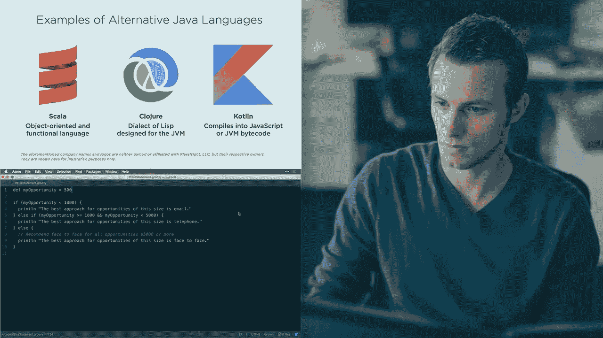
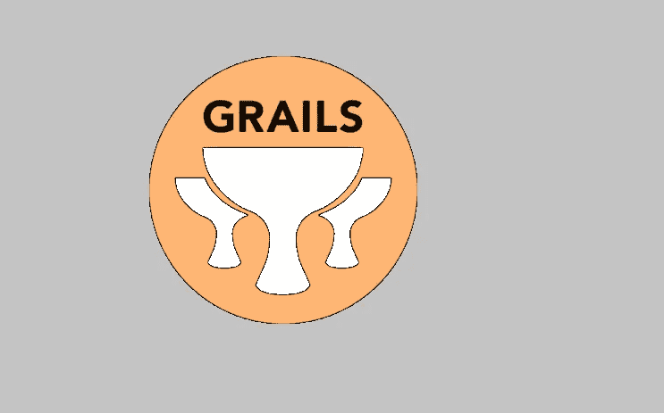
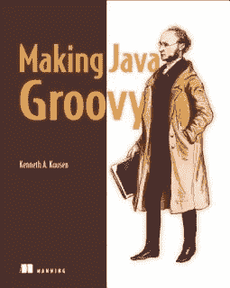

# 2023 年面向 Java 程序员的 6 门最佳 Groovy 和 Grails 在线课程

> 原文：<https://medium.com/javarevisited/6-best-resources-to-learn-groovy-and-grails-for-java-developers-18c04e88fa8a?source=collection_archive---------1----------------------->

## 我最喜欢的 2023 年 Java 开发者学习 Groovy 的 Groovy 和 Grails 在线培训课程

大家好，如果你想在 2023 年学习 Groovy 和 Grails，并寻找最好的资源，如书籍、课程和教程，那么你来对地方了。过去，我已经分享了 [**最佳毕业生课程** s](/javarevisited/5-best-gradle-courses-and-books-to-learn-in-2021-93f49ce8ff8e) 和[最佳 Groovy 书籍](https://javarevisited.blogspot.com/2017/08/top-5-books-to-learn-groovy-for-java.html#axzz5dPh77Fzl) **，**，今天，我将分享一些学习 Groovy 编程语言和 Grails 框架的最佳在线课程。

如果你是一名 Java 开发人员，那么你可能听说过 Groovy，如果你没有听说过 Grails、Spock 或 Gradle，Java 开发人员的五大 Groovy 框架[。](https://javarevisited.blogspot.com/2020/09/top-10-scala-and-groovy-frameworks-java.html)

Groovy 最好的一点是，它不与 Java 竞争，而是专注于与 Java 共存，并在 Java 的传统薄弱领域(如脚本编写)增强 Java 开发人员的能力。

用 Java 编写实用程序脚本并不容易，但用 Groovy 编写却非常容易。这使得 Groovy 成为 Java 开发人员的强大工具，尤其是那些在团队、项目和组织中推动事情的有经验的 Java 开发人员。

通过学习 Groovy 和 Grails，您可以增强您的 Java 项目，并轻松地完成一些在 Java 中很难完成或需要花费更多时间的任务。

如果你已经确信 Groovy 是 Java 开发人员的一个很棒的工具，并且正在寻找 2023 年学习 Groovy 的在线课程，那么你来对地方了。在本文中，我将为 Java 开发人员和任何想学习 Groovy 和 Grails 的人分享最好的 Groovy 课程。

如果你不知道 [Groovy](https://groovy-lang.org/) 是另一种 [JVM 编程语言](https://javarevisited.blogspot.com/2018/02/top-3-jvm-languages-java-programmer-learn.html)，它允许你用 Java 创建函数式和面向对象的代码。它是由 Apache 软件基金会创建的。

Groovy 是一种强大的、可选类型的动态语言，具有 Java 平台的静态类型和静态编译能力，旨在通过简洁、熟悉且易于学习的语法来提高开发人员的工作效率。Groovy 的另一个优点**是，它可以与任何 Java 程序顺利集成**，并立即为您的应用程序提供强大的功能，包括脚本功能、特定领域语言创作、运行时和编译时元编程，以及[函数式编程](/javarevisited/10-best-scala-and-functional-programming-online-courses-for-beginners-b6461b27bf)。Grails 是一个使用 Groovy 编程语言创建 web 应用程序的框架。Groovy 在 REST API 的自动化测试中也被大量使用，这也是为什么许多测试人员在 2023 年学习 Groovy 来使用像 SoapUI 和 Selenium 这样的工具。

# 2023 年新手学习的 6 门最佳 Groovy 和 Grails 在线课程

这里列出了学习 Groovy 和 Grails 的最佳课程，不要再浪费您的时间。尽管 Groovy 已经出现了很长时间，但是学习 Groovy 和 Grails 的课程并不多。

我在免费的在线门户网站上搜索优质的 Groovy 课程，比如 [**Coursera**](https://click.linksynergy.com/deeplink?id=CuIbQrBnhiw&mid=40328&murl=https%3A%2F%2Fwww.coursera.org%2F) 和 [**edX**](https://www.awin1.com/cread.php?awinmid=6798&awinaffid=631878&clickref=&p=) ，但是我什么也没找到。我在这篇文章中分享的只有我在 [**Udemy**](https://click.linksynergy.com/deeplink?id=CuIbQrBnhiw&mid=39197&murl=https%3A%2F%2Fwww.udemy.com%2F) 和 [**Pluralsight**](https://pluralsight.pxf.io/c/1193463/424552/7490?u=https%3A%2F%2Fwww.pluralsight.com%2Flearn) 上找到的好的 Groovy 课程。

这些也是现代 Java 开发人员学习 Groovy 和 Grails 的最佳课程。在这些课程中，您将学习这种语言在您自己的工具箱中的位置，以及如何开始使用 Groovy 构建令人兴奋的新应用程序。

## 1.[完整的 Apache Groovy 开发者课程](https://click.linksynergy.com/deeplink?id=CuIbQrBnhiw&mid=39197&murl=https%3A%2F%2Fwww.udemy.com%2Fcourse%2Fapache-groovy%2F)【Udemy】

这可能是 Java 开发人员学习 Groovy 的最佳课程。由 [**丹·维加、**](https://click.linksynergy.com/deeplink?id=CuIbQrBnhiw&mid=39197&murl=https%3A%2F%2Fwww.udemy.com%2Fuser%2Fdanvega%2F) 创建，他是我最喜欢的 Udemy 导师之一，也是 Udemy 上一些最好的春季课程的作者，比如这个[免费的 Spring Boot 基础课程](https://click.linksynergy.com/deeplink?id=CuIbQrBnhiw&mid=39197&murl=https%3A%2F%2Fwww.udemy.com%2Fcourse%2Fspring-boot-getting-started%2F)，它将教你如何使用 Groovy 来提高你作为 Java 开发人员的生产力。

在本课程中，您将学到开始使用 Groovy 编程语言所需的一切知识。这门课程实际上是为两种不同类型的程序员设计的，一种是懂 Java 的，另一种是来自不同编程语言背景的。

如果你是一名初学程序员，对另一种语言有一些经验，比如 [**Python**](https://click.linksynergy.com/deeplink?id=CuIbQrBnhiw&mid=39197&murl=https%3A%2F%2Fwww.udemy.com%2Fcourse%2Fcomplete-python-bootcamp%2F) 或 [**Ruby**](https://click.linksynergy.com/deeplink?id=CuIbQrBnhiw&mid=39197&murl=https%3A%2F%2Fwww.udemy.com%2Fcourse%2Flearn-to-code-with-ruby-lang%2F) ，那么这门课程就是让你从头开始学习 Groovy 的。动态语言通常被认为对于初学者来说更容易学习，因为它们灵活而有趣，这门课也是如此。

如果你是现有的 [Java 开发人员](/javarevisited/10-advanced-spring-boot-courses-for-experienced-java-developers-5e57606816bd?source=collection_home---4------0-----------------------)(初学者或有经验者)，这个课程也适合你。您将了解 Groovy 如何补充 Java 语言，并使 Java 中的一些复杂任务变得简洁和容易。

**这里是加入本课程的链接**——[完整的 Apache Groovy 开发者课程](https://click.linksynergy.com/deeplink?id=CuIbQrBnhiw&mid=39197&murl=https%3A%2F%2Fwww.udemy.com%2Fcourse%2Fapache-groovy%2F)

简而言之，对于 Java 开发人员和没有 Java 经验但想学习 Groovy 的人来说，这是一门学习 Groovy 的好课程。

## 2.[掌握 Grails。全面的 Grails 课程](https://click.linksynergy.com/deeplink?id=JVFxdTr9V80&mid=39197&murl=https%3A%2F%2Fwww.udemy.com%2Fcourse%2Fmastering-grails%2F)。

老实说，在线学习 Grails 的课程并不多。我从博客、教程和 Grails 文档中学到了大部分东西。

虽然 Udemy 和 Pluralsight 都有一些 Grails 课程，但都不是很好。这个课程是我发现的对初学者和中级 Java 开发人员学习 Grails 最好的课程。本课程将通过一些动手练习，以简单有趣的方式教您 Grails。您还将学习如何在您的机器上安装 Grails，以及如何设置一个[基础项目](/javarevisited/8-projects-you-can-buil-to-learn-python-in-2020-251dd5350d56)，这是大多数人都会遇到的问题。

之后，您将学习如何创建一个基本的应用程序堆栈，包括创建控制器、视图和模型。Mike 将向您展示如何设计数据层，教您动态和静态搭建、引导数据以及各种约束。

这里是加入本课程的链接— [掌握 Grails。全面的 Grails 课程](https://click.linksynergy.com/deeplink?id=JVFxdTr9V80&mid=39197&murl=https%3A%2F%2Fwww.udemy.com%2Fcourse%2Fmastering-grails%2F)。

总的来说，这是 Java 和 Groovy 开发人员学习 Grails 的绝佳课程。谈到社会证明，538 名学员对本课程的平均评分为 4.2，超过 2，313 名学生信任本课程。

## 4.杰瑞米·贾雷尔撰写的《Groovy:入门》

这是 Pluralsight 的另一个很好的 Groovy 课程，比之前的课程更深入。对于一个有经验的 Java 程序员来说更好，他已经知道如何用 Java 做事情，但是想要学习 Groovy 如何帮助更容易更好地做同样的事情。

这个[在线 Groovy 课程](https://javarevisited.blogspot.com/2020/06/top-5-courses-to-learn-groovy-and-grails.html)将教你如何将这种激动人心的强大语言融入你现有的 Java 工具箱。首先，您将发现动态语言可以给现有的 Java 生态系统带来的价值。之后，您将探索 Groovy 语言的基本特性，如变量、算术运算符和控制结构。

最后，您将学习如何使用 Groovy 的[面向对象设计](/javarevisited/my-favorite-courses-to-learn-object-oriented-programming-and-design-in-2019-197bab351733)功能创建可维护的模块化应用程序，并有机会了解这种已经非常强大的语言的未来。

完成本课程后，您将拥有 Groovy 编程语言的基础知识，这将帮助您成为一名更全面、更有能力的 Java 平台软件开发人员。

**这是加入本课程的链接** — [Groovy:入门](https://pluralsight.pxf.io/c/1193463/424552/7490?u=https%3A%2F%2Fwww.pluralsight.com%2Fcourses%2Fgroovy-getting-started)

顺便说一句，正如我所说的，你需要一个 [**Pluralsight 会员**](https://pluralsight.pxf.io/c/1193463/424552/7490?u=https%3A%2F%2Fwww.pluralsight.com%2Flearn) 才能进入这个课程。如果你没有 Pluralsight 会员资格，那么你可以购买它，它的价格大约是每月 29 美元或每年 299 美元(14%的折扣)，对于需要不断学习新技术和技能以保持自己最新的程序员来说，这是完全值得的。

或者，你也可以通过使用他们的 [**10 天免费试用期**](https://pluralsight.pxf.io/c/1193463/424552/7490?u=https%3A%2F%2Fwww.pluralsight.com%2Flearn) 免费获得这门课程，该试用期提供 200 分钟免费访问他们所有 7000 多门在线课程的机会。

 [## 对个人来说

### Pluralsight 的使命一直是公平的技术竞争环境。不管你想学什么，或者…

pluralsight.pxf.io](https://pluralsight.pxf.io/c/1193463/424552/7490?u=https%3A%2F%2Fwww.pluralsight.com%2Flearn) 

## 3.杰里米·贾雷尔的《绝妙的基础》

如果你有 Pluralsight 会员资格，并且正在寻找学习 Groovy 的好课程，那么 Jereme Jarrel 的《Groovy 基础》是最好的入门课程。

本课程很好地介绍了 Groovy 编程语言以及 Groovy 平台的最佳特性。它不仅会教你 Groovy 编程语言，还会教你底层的 Groovy 平台。

这也是一门实践课程，在这门课程中，您将开发一个 Groovy 应用程序，它可以从 XML 文件中解析 GPS 数据，将其插入到数据库中，甚至将这些数据与从 [REST API](https://javarevisited.blogspot.com/2018/02/top-5-restful-web-services-with-spring-courses-for-experienced-java-programmers.html#axzz61O27yGjY) 中检索到的预测数据相关联。

完成本课程后，你不仅将掌握 Groovy 语言的工作知识，还将能够在日常工作中使用 Groovy。它会简化你的任务，提高你的工作效率。

这里是加入这个 Groovy 课程的链接— [Groovy 基础知识](https://pluralsight.pxf.io/c/1193463/424552/7490?u=https%3A%2F%2Fwww.pluralsight.com%2Fcourses%2Fgroovy-fundamentals)

## 5.[Dan Bunker 的 Grails 简介](https://pluralsight.pxf.io/c/1193463/424552/7490?u=https%3A%2F%2Fwww.pluralsight.com%2Fcourses%2Fgrails-introduction)

到目前为止，我们已经看到了 3 个 Groovy 课程和 1 个面向 Java 开发人员的 Grails 课程，这是另一个从 Pluralsight 学习 Grails 的课程。如果您已经了解 Groovy，或者在参加了之前的任何 Groovy 入门课程之后，您可以参加本课程。

本课程由 Dan Bunker Dan 创建，他是软件技术组的脚本实践经理。Dan 还与 Java 实践团队合作，专门研究 [Spring](https://www.java67.com/2017/11/top-5-free-core-spring-mvc-courses-learn-online.html) 、 [Ruby](/@javinpaul/top-5-free-courses-to-learn-ruby-and-rails-for-beginners-best-of-lot-e149fe03c964) 、 [Python](/swlh/5-free-python-courses-for-beginners-to-learn-online-e1ca90687caf) 、 [JavaScript](/javarevisited/12-free-courses-to-learn-javascript-and-es6-for-beginners-and-experienced-developers-aa35874c9a32) 和 [PHP](/javarevisited/top-10-free-courses-to-learn-php-and-mysql-for-web-development-e96e69982675) 。本课程将介绍 Grails web 应用框架。Grails 是一个类似 rails(记住 Ruby on Rails)的框架，构建在 Spring 和 Hibernate Java 技术之上。Grails 利用了 Groovy 编程语言。学完本课程后，您应该能够理解 Grails 在体系结构上的工作方式，确定 Grails 的优缺点，并成功地使用 Grails 编写了一个完整的示例应用程序。

**这里是加入本课程的链接** — [丹·邦克](https://pluralsight.pxf.io/c/1193463/424552/7490?u=https%3A%2F%2Fwww.pluralsight.com%2Fcourses%2Fgrails-introduction)的 Grails 简介

## 6.肯·寇森的《制作 Java Groovy》

如果你喜欢读书，并且需要一本书来从头开始学习 Groovy，那么我会推荐这本书。这是我最喜欢的关于 Groovy 的书，也是 Java 开发人员学习 Groovy 的最佳书籍。

这本书是专门为向 Java 开发人员展示如何通过添加 Groovy 使他们的生活变得更容易而设计的，例如，如何在不使用 JDBC 的情况下读取文件或向数据库中插入行。

当我第一次开始使用 Groovy 来理解一个用 Groovy 编写的定制构建环境时，我需要一本书，它可以比较 [Java](http://www.java67.com/2018/08/top-10-free-java-courses-for-beginners-experienced-developers.html) 和 [Groovy](https://javarevisited.blogspot.com/2018/02/top-3-jvm-languages-java-programmer-learn.html) ，并通过利用我的 Java 知识来教授 Groovy，这就是我发现使用 Java Groovy 是一个很好的选择的地方。

如果你需要一个在线课程来配合这本书，我建议你也去看看 Udemy 上的**[**完整的 Apache Groovy 开发者课程**](https://click.linksynergy.com/deeplink?id=CuIbQrBnhiw&mid=39197&murl=https%3A%2F%2Fwww.udemy.com%2Fcourse%2Fapache-groovy%2F) 。你可以在 Udemy 上花 9.9 美元买到这本书。**

****

**这本书不仅充满了有用的信息，而且更容易阅读，我也喜欢肯的风格，把幽默留给脚注。

简而言之，如果你是一名 [Java 开发人员](https://javarevisited.blogspot.com/2018/05/10-tips-to-become-better-java-developer.html)并且想在短时间内学会 Groovy，也许是为了用它来进行单元测试或构建自动化，我建议你先读一下肯·寇森的《制作 Java Groovy》。**

**以上是 2023 年学习 Groovy 和 Grails 的一些最佳在线课程。正如我说过的，Groovy 是一种强大的编程语言，它使 Java 编写脚本变得非常容易。使用像 Spock、 [Grails](https://grails.org/) 和 [Gradle](https://javarevisited.blogspot.com/2020/06/maven-vs-gradle-beginners-introduction.html#axzz6dHZ7oEpK) 这样的工具，Groovy 允许你构建 web 应用程序并测试它们。Groovy 也是 Java 平台上最强大和轻量级的语言之一，它真正增强了 Java 和 Java 开发人员有效完成日常软件开发和支持任务的能力。

其他**你可能喜欢阅读的 Java 和编程文章****

*   **[与 Spring Boot 一起学习微服务的 5 大课程](https://javarevisited.blogspot.com/2018/02/top-5-spring-microservices-courses-with-spring-boot-and-spring-cloud.html#axzz6JJFPbsyP)**
*   **[学习 Java 微服务的 7 大课程](/javarevisited/top-5-courses-to-learn-microservices-in-java-and-spring-framework-e9fed1ba804d)**
*   **[学习 Spring Security 和 OAuth2 的 10 门课程](/javarevisited/top-10-courses-to-learn-spring-security-and-oauth2-with-spring-boot-for-java-developers-8f0222d6066d)**
*   **[面向 Java 开发者的 10 门高级 Spring Boot 课程](/javarevisited/10-advanced-spring-boot-courses-for-experienced-java-developers-5e57606816bd)**
*   **[初学者学习 Spring Cloud 的 5 大课程](https://javarevisited.blogspot.com/2018/04/top-5-spring-cloud-courses-for-java.html)**
*   **[编程/编码工作面试的 10 门课程](http://javarevisited.blogspot.sg/2018/02/10-courses-to-prepare-for-programming-job-interviews.html)**
*   **[学习 learn RESTful Web 服务的 10 门课程](/javarevisited/top-5-books-and-courses-to-learn-restful-web-services-in-java-using-spring-mvc-and-spring-boot-79ec4b351d12)**
*   **[深入学习 Spring 的五大课程](https://javarevisited.blogspot.com/2018/06/top-6-spring-framework-online-courses-Java-programmers.html)**
*   **[5 门免费学习核心 Java 的在线课程](http://javarevisited.blogspot.sg/2017/11/top-5-free-java-courses-for-beginners.html#axzz4zuIICRs9)**
*   **[面向有经验的 Java 开发人员的 5 大 Java 设计模式课程](http://javarevisited.blogspot.sg/2018/02/top-5-java-design-pattern-courses-for-developers.html)**
*   **[10 个面向 Java 开发人员的免费 Spring Boot 教程和课程](/javarevisited/10-free-spring-boot-tutorials-and-courses-for-java-developers-53dfe084587e)**

**感谢您阅读本文。如果你发现**这些 Groovy 和 Grails 课程很有用**，那么请与你的朋友和同事分享。正如我所说的，当有新的和免费的 Groovy 课程时，我会继续更新这篇文章。如果你遇到一个不在这里但应该在这个列表中的 Groovy 课程，请留言。**

****p . s .**——如果你真的想学习 Groovy 编程语言，但正在寻找免费的在线培训课程来开始你的旅程，那么你也可以看看 Udemy 上 Raghav Pal 的这个[**Groovy——初学者一步一步**](https://click.linksynergy.com/deeplink?id=JVFxdTr9V80&mid=39197&murl=https%3A%2F%2Fwww.udemy.com%2Fcourse%2Fgroovy-step-by-step-for-beginners%2F) 课程。这是免费的，你只需要一个 Udemy 帐户就可以参加这个课程。**

** [## 免费的 Apache Groovy 教程- Groovy |初学者循序渐进

### 在我们学会走路和跑步之前，我们经常需要有人牵着我们的手，帮助我们迈出最初的几步。这是…

udemy.com](https://click.linksynergy.com/deeplink?id=JVFxdTr9V80&mid=39197&murl=https%3A%2F%2Fwww.udemy.com%2Fcourse%2Fgroovy-step-by-step-for-beginners%2F)**