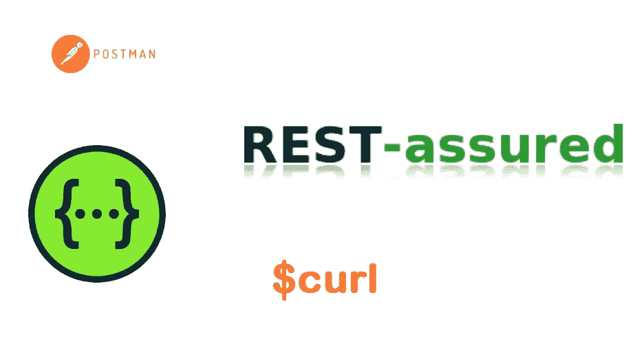
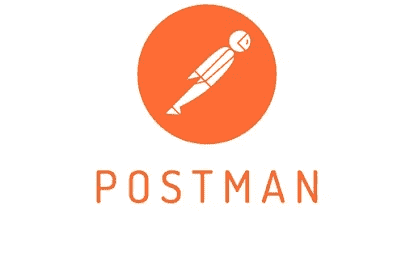
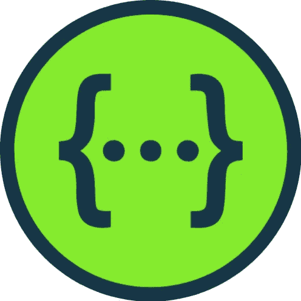
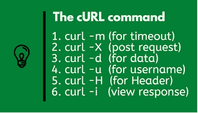
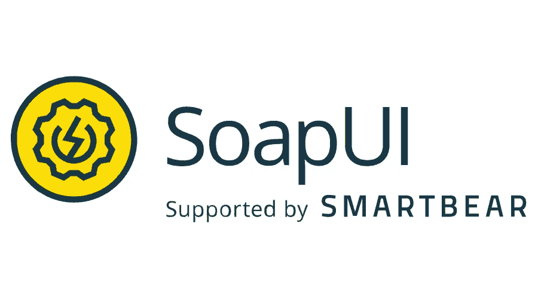

# 6 个用于测试、设计和开发的最佳 REST API 工具

> 原文：<https://medium.com/javarevisited/6-best-rest-api-tools-for-testing-design-and-development-1c5f69ed1f22?source=collection_archive---------0----------------------->

## 我最喜欢的构建和测试 REST APIs 和 web 服务的工具包括 Postman for automation testing、curl a Linux command、Swagger 等等。

大家好，如果您是从事 REST API 和 RESTful web 服务的 Java 或 web 开发人员，并且正在寻找一些测试工具来测试您的 API 和 web 服务，或者寻找开源工具来记录您的 REST API，那么您来对地方了。

早些时候，我已经分享了 RESTful web 服务 的[**最佳书籍**](/javarevisited/top-5-books-and-courses-to-learn-restful-web-services-in-java-using-spring-mvc-and-spring-boot-79ec4b351d12) 和 [**课程，在这篇文章中，我将分享五个很棒但容易使用的免费工具来测试你的 REST APIs。**](/javarevisited/10-best-java-web-services-rest-soap-and-api-courses-for-beginners-724a8f51298d)

这些 REST API 测试和开发工具将帮助您在构建时测试您的 API，从单元测试到集成测试，然后完全自动化您的 REST 以创建一个回归包。

您还可以在开发阶段使用这些工具与 REST API 进行交互，以便进行快速测试。你们中的一些人可能已经熟悉这些工具、命令和库，在这种情况下，请加入并分享你的经验，这样我们就可以互相学习。

如果你问我，我通常使用 curl 命令进行简单的测试，比如查看特定的 REST 端点返回什么数据，但是对于更复杂的测试，我通常使用像 [Postman](/javarevisited/7-best-courses-to-learn-postman-tool-for-web-service-and-api-testing-f225c138fa5a) 、[restassed](https://javarevisited.blogspot.com/2021/04/top-5-tools-to-test-rest-apis-in-java.html)或 SOAPUI 这样的工具。

总之，不多说了，这里有一些工具你可以用来测试你的 REST APIs 或者 [RESTful web 服务](https://www.java67.com/2018/02/3-books-and-courses-to-learn-restful-web-services-with-spring.html)，我们 Java 开发者这样称呼它们。我还会添加更多的工具和它们的例子，但是现在我已经分享了进一步学习它们的工具和资源。

# REST API 设计人员、开发人员和测试人员的 6 个最佳工具

为了不浪费您的时间，这里是我为 Java 开发人员列出的 REST API 测试的最佳工具列表。您可以使用这些工具与 RESTful web 服务进行交互，比如发送 HTTP GET 和 POST 请求、监控响应代码、检查头和 cookies 以及检查数据。

## 1.[邮递员](https://www.postman.com/)【最佳 API 测试工具】

如果你不太喜欢命令行工具，而是喜欢用 GUI 客户端来测试 REST API，那么 Postman 是你的最佳选择。它是一个 chrome 扩展，你可以把它安装在你的 Chrome 浏览器上。

它可能是测试你的 REST API 最流行的工具。如果你看看他们的网站，你会发现 [Postman](/javarevisited/7-best-courses-to-learn-postman-tool-for-web-service-and-api-testing-f225c138fa5a) 被 500 万开发者和超过 10 万家公司使用，每月访问 1.3 亿个 API。它还具有丰富的特性，支持 REST API 生命周期的每个阶段。通过设计、测试和全面生产，Postman 可以更快、更容易地开发 API 没有混乱。

不管你是在 Windows，Mac OS，还是 [Linux](/javarevisited/7-best-linux-courses-for-developers-cloud-engineers-and-devops-in-2021-7415314087e1) 下工作，你都可以下载 Postman app 在任何地方测试你的 REST APIs。

如果你想了解更多关于用于 REST API 测试的 Postman 工具，我强烈推荐你参加 Udemy 上 Valentine Despa 的[**Postman:The Complete Guide—REST API Testing**](https://click.linksynergy.com/deeplink?id=JVFxdTr9V80&mid=39197&murl=https%3A%2F%2Fwww.udemy.com%2Fcourse%2Fpostman-the-complete-guide%2F)课程。有效使用 Postman 工具是一个很好的资源。

## 2.[重新发布](https://rest-assured.io/)【自动化测试的最佳工具】

作为一名 Java 开发人员，这是我自动测试 REST APIs 的首选方式。如果我没有使用 curl 或 Postman 进行任何手工测试，那么我会放心地使用 Java 为我们的 REST APIs 编写测试。它类似于 REST APIs 的 [JUnit](/javarevisited/5-courses-to-learn-junit-and-mockito-in-2019-best-of-lot-f217d8b93688?source=---------20------------------) ,但要好得多。

如果你使用过动态语言，比如 [Ruby](/javarevisited/10-best-ruby-on-rails-courses-for-beginners-dca4d66e9f7b) 、 [PHP](/javarevisited/10-best-php-courses-for-beginners-and-experienced-developers-db18057a814f) 和 [Python](/javarevisited/10-free-python-tutorials-and-courses-from-google-microsoft-and-coursera-for-beginners-96b9ad20b4e6) ，那么你就会知道用 Java 写东西涉及到很多礼仪，但是 *RESTAssured* 会为你处理这些，它允许你用一种清晰的描述性语言来写测试，比如当你调用这个 rest 服务时，你会期待这个响应代码、这个数据等等。

我强烈建议 Java 开发人员和自动化测试人员学习 RESTAssured for Automation Testing，如果您需要资源，那么 [**Rest API 测试(自动化)从零开始 Rahul Shetty 在 Udemy 上开设的 RestAssured Java**](https://click.linksynergy.com/deeplink?id=JVFxdTr9V80&mid=39197&murl=https%3A%2F%2Fwww.udemy.com%2Fcourse%2Frest-api-automation-testing-rest-assured%2F) 课程是一个不错的起点。

## 3. [Swagger](https://swagger.io/) 【设计和记录 REST APIs 的最佳工具】

Swagger 是另一个很好的 REST API 开发工具，您可以使用它来记录和共享您的 REST API 规范。Swagger 提供了描述**REST API 的标准格式。**

通过遵循这些规则，您可以创建 REST API 文档，在产品经理、测试人员和开发人员之间共享，但是也可以被各种工具用来自动化与 API 相关的过程

它也被称为开放 API 规范，是目前创建 RESTful APIs 定义的最流行的方式。有了这些定义，您可以创建复杂的、自动生成的文档，用几种语言生成 SDK，并进行自动化测试

如果你想了解更多关于 Swagger 的知识，以及如何在现实世界的项目中使用它，那么我强烈推荐你查看 Udemy 网站上 Peter Gruenbaum 的 [**Learn Swagger 和开放 API 规范**](https://click.linksynergy.com/deeplink?id=JVFxdTr9V80&mid=39197&murl=https%3A%2F%2Fwww.udemy.com%2Fcourse%2Flearn-swagger-and-the-open-api-specification%2F) 课程。这是 2023 年学习 Swagger 的绝佳资源。

## 4.焦躁

这是另一个测试 REST APIs 的命令行工具。它只是一个围绕 curl 的小脚本包装器，主要用于测试 REST APIs。只要安装这个小的[工具](https://github.com/micha/resty)和源代码，你就可以从命令行开始测试你的 REST APIs 了。

它在你的 shell 中被实现为函数，这意味着你可以将 Resty 与其他强大的 shell 工具相结合，比如 [Perl](https://javarevisited.blogspot.com/2021/11/top-5-courses-to-learn-perl-programming.html) ，awk， [grep](https://javarevisited.blogspot.com/2011/06/10-examples-of-grep-command-in-unix-and.html) ， [sed](https://javarevisited.blogspot.com/2013/05/sed-command-examples-in-unix-and-linux.html) 等。

您可以在管道中使用 resty 来处理来自 REST 服务的数据，[将](https://javarevisited.blogspot.com/2016/10/difference-between-put-and-post-in-restful-web-service.html)、补丁或 [POST](https://www.java67.com/2016/09/when-to-use-put-or-post-in-restful-web-services.html) 数据放回。您甚至可以通过管道输入数据，然后在 PUT、PATCH 或 POST 之前，在您的文本编辑器中进行交互式编辑。

## 5.HTTPie

Httpie 是另一个可以用来测试 REST APIs 的命令行工具。它只不过是一个 HTTP 客户端，具有直观的 UI、JSON 支持、语法高亮、类似 wget 的下载、插件，这使得测试 REST APIs 更加容易和有趣。

httpie 由一个 HTTP 命令组成，设计用于与 HTTP 服务器、[RESTful API](/javarevisited/top-5-books-to-learn-web-services-in-java-soap-rest-22d92adbefc1)和 web 服务进行无痛调试和交互，内置的 JSON 支持使得在测试 REST APIs 时发送 JSON 请求(如 POST 和 PUT 命令)更加容易。

## 6.卷曲

这是我最喜欢的工具，我几乎 50%的时间都在使用它。主要原因是因为我喜欢 Linux 命令。curl 或 curl 命令允许您发送不同类型的 HTTP 请求，如 GET、POST、PUT 和 DELETE，您可以使用这些请求来测试 REST API 的基本功能，正如我在以前的一篇关于在 Linux 中使用 cURL 命令测试 REST API 的文章中所示。

它还允许你设置 HTTP 头，这意味着你可以设置 Content-Type 或 Accept 头来测试内容协商，就像我经常设置*Content-Type = " application/json "*来从 REST API 获得 JSON 响应一样。如果你还没有 curl，那么你就错过了大好时机，不仅仅是 REST APIs，这个工具允许你发送任何依赖于 HTTP 的应用程序。我过去曾使用 curl 编写过运行状况检查脚本，这些脚本会 pings 我们的 web 服务，等待一段时间，如果没有收到任何响应，就会进行报告。总的来说，了解 Linux 命令很有帮助，如果你想学习它们，那么 Udemy 上波格丹一世·斯塔舒克的 [**Linux 初学者课程**](https://click.linksynergy.com/deeplink?id=JVFxdTr9V80&mid=39197&murl=https%3A%2F%2Fwww.udemy.com%2Fcourse%2Flinux-complete%2F) 是个不错的起点。

## 7.[肥皂泡](https://www.soapui.org/)

*SoapUI* 是世界上最广泛使用的 SOAP 和 REST APIs 自动化测试工具。您可以使用 SoapUI 在项目中轻松地编写、运行、集成和自动化高级 API 测试。

许多开发人员使用 SoapUI 来测试 API，无论是在设计和开发期间，还是在部署支持之后。

关于 SoapUI 最好的事情是你可以使用这个工具来测试 OAP Web 服务以及 RESTful Web 服务或者基于 HTTP 的服务。

SoapUI 还支持所有的标准协议和技术，这意味着你可以用它来测试各种 API。它的设计和界面也非常简单，使技术和非技术用户能够无缝地使用它们。

如果你想学习如何使用 SoapUI 测试现实世界的项目，那么我强烈推荐你参加 Rahul Shetty 在 Udemy 上的 [**WebServices/Rest API 测试与 soap ui+实时项目**](https://click.linksynergy.com/deeplink?id=CuIbQrBnhiw&mid=39197&murl=https%3A%2F%2Fwww.udemy.com%2Fcourse%2Fwebservices-testing-with-soap-ui%2F) 课程。

超过 60，000 名 API 开发者和测试者已经加入了这个课程，而且它非常实用。在这个过程中，您将看到并学习如何使用 SoapUI 测试现实世界中的 REST APIs。

以上是测试 REST APIs 和 RESTful Web 服务的一些最好的工具。作为一名 Java 开发人员，我建议你使用[restassed](https://javarevisited.blogspot.com/2021/12/top-5-courses-to-learn-rest-assured-for.html)用代码编写测试，但是如果你想要交互式测试，curl 是你最好的朋友，特别是如果你使用的是 [Linux](/javarevisited/6-best-websites-to-learn-linux-4861ac21bfdf) 。如果你是基于 Windows 的 GUI 爱好者开发者，那么 [Postman](/javarevisited/7-best-courses-to-learn-postman-tool-for-web-service-and-api-testing-f225c138fa5a) 是你最好的朋友。

您可能喜欢的其他**编程和开发文章**

*   [2023 年 Java 开发者路线图](https://javarevisited.blogspot.com/2019/10/the-java-developer-roadmap.html)
*   [15 春季数据 JPA 面向开发者的面试问题](https://www.java67.com/2021/01/spring-data-jpa-interview-questions-answers-java.html)
*   [20+春假面试问题](https://javarevisited.blogspot.com/2018/02/top-20-spring-rest-interview-questions-answers-java.html)
*   [2023 年 Java 和 Web 开发人员的 10 个框架](http://javarevisited.blogspot.sg/2018/01/10-frameworks-java-and-web-developers-should-learn.html)
*   [Java 开发人员应该知道的 20 个库](http://javarevisited.blogspot.sg/2018/01/top-20-libraries-and-apis-for-java-programmers.html)
*   [我最喜欢的深入学习 Java 的免费课程](/javarevisited/10-free-courses-to-learn-java-in-2019-22d1f33a3915)
*   [2023 年每个 Java 开发人员都要学习的 10 种工具](https://www.java67.com/2018/04/10-tools-java-developers-should-learn.html)
*   [2023 年 Java 开发人员可以学习的 21 项技术技能](https://javarevisited.blogspot.com/2020/03/top-20-skills-java-developers-can-learn.html#axzz6k4XBgTw4)
*   [2023 年学习 Spring Boot 的 5 大课程](https://www.java67.com/2018/06/5-best-courses-to-learn-spring-boot-in.html)
*   [2023 年要学的 10 种编程语言](http://www.java67.com/2017/12/10-programming-languages-to-learn-in.html)
*   [深入学习 Spring 框架的前 5 门课程](https://javarevisited.blogspot.com/2018/06/top-6-spring-framework-online-courses-Java-programmers.html)
*   [学习 Maven、Jenkins 和 Docker 的 10 门免费课程](/javarevisited/top-10-free-courses-to-learn-maven-jenkins-and-docker-for-java-developers-51fa7a1e66f6)
*   [十大 RESTful Web 服务面试问题](https://www.java67.com/2015/09/top-10-restful-web-service-interview-questions-answers.html)
*   [成为更好的 Java 开发人员的 10 个技巧](https://javarevisited.blogspot.com/2018/05/10-tips-to-become-better-java-developer.html)
*   [2023 年 Aim 的 10 项 AWS 和云认证](https://www.java67.com/2020/09/top-10-cloud-certification-you-can-aim.html)
*   [Java 程序员 25+春季安全面试问题](https://javarevisited.blogspot.com/2021/02/spring-security-interview-questions-answers-java.html)

感谢您阅读本文。如果你找到了这些*面向 Java 开发人员的 REST API 测试工具*，那么请与你的朋友和同事分享它们。如果您有任何问题或反馈，请留言。

**p . s .**——如果你是一名初学者，想学习 RESTful web 服务的 Java 语言，并寻求一些建议，那么我强烈推荐你参加由 Ranga Karnam 在 Udemy 举办的 28 分钟的 [**掌握 Java Web 服务和 RESTful API 与 Spring Boot**](https://click.linksynergy.com/deeplink?id=JVFxdTr9V80&mid=39197&murl=https%3A%2F%2Fwww.udemy.com%2Fcourse%2Fspring-web-services-tutorial%2F) 课程。这是 Java 开发者学习 REST APIs 的最佳课程。

 [## 2023 年初学者在线学习的 10 门最佳 Java Web 服务[REST + SOAP]课程

### 我最喜欢的在线课程，学习如何使用 Spring、JAX RS 和其他

medium.com](/javarevisited/10-best-java-web-services-rest-soap-and-api-courses-for-beginners-724a8f51298d)