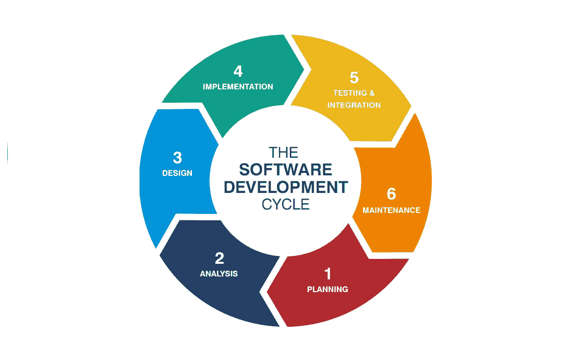
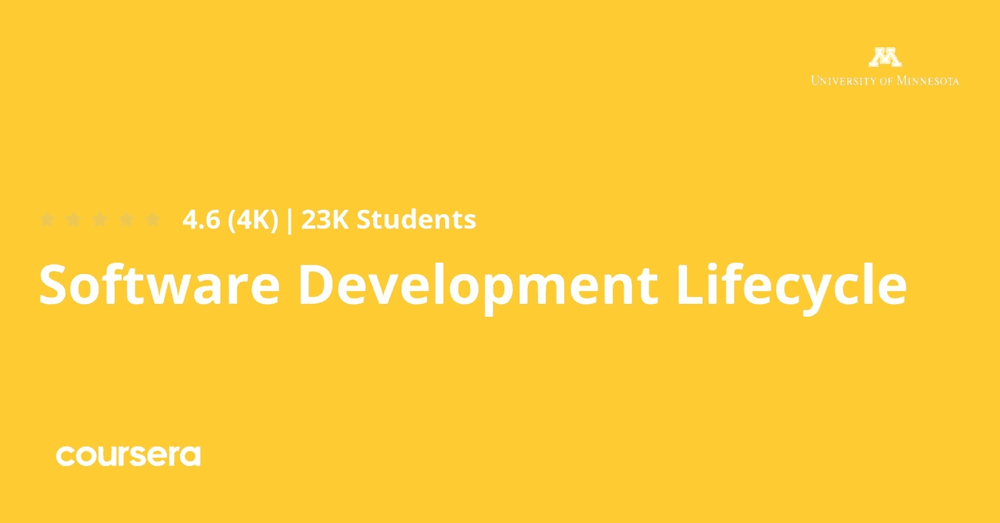
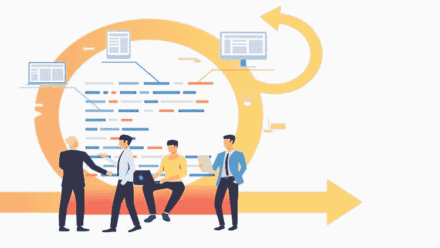
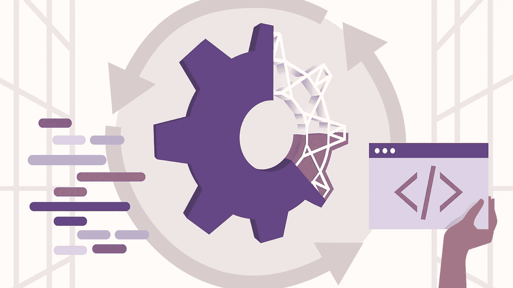

# 2023 年初学者和有经验者学习软件开发的 6 门最佳 SDLC 课程

> 原文：<https://medium.com/javarevisited/6-best-sdlc-courses-for-beginners-and-experienced-programmers-devops-and-project-managers-b8242c04d761?source=collection_archive---------0----------------------->

## 我最喜欢的从零开始学习软件开发生命周期(SDLC)的在线课程。

SDLC 或软件开发生命周期是任何程序员、开发人员、 [DevOps](/javarevisited/13-best-courses-to-learn-devops-for-senior-developers-in-2020-a2997ff7c33c) 、项目经理、技术负责人、团队负责人或 scrum 大师的基本技能。从 Scrum 到六适马，有大量的选择来设计一个组织的工作流程，但是没有一个放之四海而皆准的软件开发方法。

*披露——顺便说一句，其中一些链接是附属链接，如果你使用我的链接加入这些课程，我可能会得到报酬。*

这就是为什么对于软件项目经理、架构师和团队领导来说，在做出影响软件交付的预算、人员配备和管理的决策之前，掌握不同的选择是很重要的。

如果您想深入学习 SDLC 并寻找最好的在线课程，那么您来对地方了。在过去，我已经分享了学习 [OOP 设计模式](/javarevisited/7-best-online-courses-to-learn-object-oriented-design-pattern-in-java-749b6399af59) s 和[软件架构](/javarevisited/top-5-courses-to-learn-software-architecture-in-2020-best-of-lot-5d34ebc52e9)的最佳课程，在这篇文章中，我将分享学习软件开发过程的**最佳在线培训课程。**

任何开发团队都需要遵循一些被称为软件开发生命周期的预定义角色，以便创建从独立软件或 web 应用程序到客户设定的需求的任何产品，并且需要由开发团队遵循。

这些步骤是可行性研究，如果开发团队能够按照客户需求生产软件，其次是需求分析，如业务角色安全问题，第三是设计，开发团队设计软件。

之后是[编码](https://javarevisited.blogspot.com/2019/09/5-websites-to-learn-python-for-free.html)开发者创建实际的软件，五是测试软件是否正常工作，六是将代码部署到托管提供商，如[亚马逊 AWS](https://javarevisited.blogspot.com/2020/05/top-5-amazon-web-services-aws-courses-for-beginners-and-experienced-programmers.html) ，最后一个是维护软件，如客户帮助。

这是关于 SDLC 的简短介绍，如果您想更深入地了解每个步骤是如何工作的，那么您应该继续阅读这篇文章，参加一些在线课程，让您完全理解这个术语。

# 2023 年面向软件开发人员的 6 门最佳软件开发生命周期(SDLC)课程

为了不浪费你的时间，这里列出了一些最受欢迎和推荐的学习软件开发过程的课程。

这些课程是由专家和数千名[开发人员](/javarevisited/top-10-online-courses-to-become-a-fullstack-web-developer-in-2020-d608a6b63232)、[项目经理](https://javarevisited.blogspot.com/2020/08/top-5-courses-to-learn-jira-for.html)、 [scrum masters](https://www.java67.com/2020/11/top-5-courses-for-scrum-master-certification.html) 和[程序员](/hackernoon/10-useful-tools-and-libraries-for-programmer-and-it-professionals-914e64e0eabc?source=---------135------------------)创建的，他们都加入了这个课程来学习 SDLC 基础知识。它们也很实惠，尤其是 Udemy 课程，你只需花 9.9 美元就能在不时举办的 Udemy 特卖上买到。

## 1.[软件开发生命周期](https://click.linksynergy.com/deeplink?id=JVFxdTr9V80&mid=39197&murl=https%3A%2F%2Fwww.udemy.com%2Fcourse%2Fsoftware-development-lifecycle-methodologies%2F)

如果您是公司开发团队中的程序员或自由职业者，并且需要以软件开发人员的身份组织您的工作，您可以报名参加本课程，了解 SDLC 如何工作以及术语背后的方法。

您将从介绍 SDLC 及其工作方式和阶段开始，然后探索开始 SDLC 的方法，如瀑布和敏捷。之后，您将深入探究敏捷价值观原则以及 scrum 角色事件和工件。最后，关于 [DevOps](/javarevisited/13-best-courses-to-learn-devops-for-senior-developers-in-2020-a2997ff7c33c) 的一些概念。

你将在本课程中学到:

*   SDLC 简介。
*   敏捷概念。
*   [DevOps](/hackernoon/the-2018-devops-roadmap-31588d8670cb)

谈到社会证明，超过 5000 人加入了这个课程，它是 Udemy 上最畅销的课程之一，平均评分为 4.7，从 5.0 分，这是惊人的。

**以下是参加本 SDLC 课程** - [软件开发生命周期](https://click.linksynergy.com/deeplink?id=JVFxdTr9V80&mid=39197&murl=https%3A%2F%2Fwww.udemy.com%2Fcourse%2Fsoftware-development-lifecycle-methodologies%2F)的链接

## 2.[优化软件开发生命周期](https://click.linksynergy.com/deeplink?id=JVFxdTr9V80&mid=39197&murl=https%3A%2F%2Fwww.udemy.com%2Fcourse%2Foptimizing-the-software-development-lifecycle%2F)

如果您是软件开发人员或开发团队的负责人或系统管理员，您应该参加本课程，因为它将向您展示一些绝对有助于您在 SDLC 阶段组织工作的工具。

。在本课程中，您将学到:

*   集成工具。
*   [Github](/@javinpaul/top-10-free-courses-to-learn-git-and-github-best-of-lot-967aa314ea) 和 [Git](/javarevisited/7-best-courses-to-master-git-and-github-for-programmers-d671859a68b2) 。
*   [JIRA](https://javarevisited.blogspot.com/2020/08/top-5-courses-to-learn-jira-for.html) 和[詹金斯](/javarevisited/7-best-courses-to-learn-jenkins-and-ci-cd-for-devops-engineers-and-software-developers-df2de8fe38f3)工具。

你将从学习什么是 Github 和 Git 开始，然后学习持续集成，如何将 Jenkins 软件与 Github 以及 [JIRA](https://javarevisited.blogspot.com/2020/08/top-5-courses-to-learn-jira-for.html) 和 [Github](https://www.java67.com/2019/04/top-5-courses-to-learn-git-and-github.html) 集成，以及关于 Git LFS 的一些概念，比如我们为什么需要它们，它们是如何工作的等等

**这是加入本课程** — [优化软件开发生命周期](https://click.linksynergy.com/deeplink?id=JVFxdTr9V80&mid=39197&murl=https%3A%2F%2Fwww.udemy.com%2Fcourse%2Foptimizing-the-software-development-lifecycle%2F)的链接

## 3.[软件过程管理](https://pluralsight.pxf.io/c/1193463/424552/7490?u=https%3A%2F%2Fwww.pluralsight.com%2Fcourses%2Fsoftware-process-management)【多视课程】

如果您是一名开发人员或软件工程师，想要深入了解更多关于 SDLC 及其运行方式以及质量管理和软件配置管理的想法，您可以参加本中级 Pluralsight 课程。

首先介绍与 SDLC 及其阶段和软件开发生命周期之间的区别。然后你会看到瀑布模型图和它的优点，以及 V 模型和更多的主题。

在本课程中，您将学到:

*   SDLC 及其优势。
*   理性统一的过程。
*   敏捷流程。

以下是加入本课程的链接- [软件过程管理](https://pluralsight.pxf.io/c/1193463/424552/7490?u=https%3A%2F%2Fwww.pluralsight.com%2Fcourses%2Fsoftware-process-management)

顺便说一下，你需要一个 [Pluralsight 会员](https://pluralsight.pxf.io/c/1193463/424552/7490?u=https%3A%2F%2Fwww.pluralsight.com%2Flearn)才能加入这个课程，费用大约是每月 29 美元或每年 299 美元(14%的折扣)。他们现在也有 33%的折扣，这意味着你只需 199 美元就可以获得这份订阅，而不是通常的 299 美元。我向所有程序员强烈推荐这个订阅，因为它提供了超过 7000 个在线课程的即时访问来学习任何技术技能。或者，你也可以使用他们的 [**10 天免费通行证**](https://pluralsight.pxf.io/c/1193463/424552/7490?u=https%3A%2F%2Fwww.pluralsight.com%2Flearn) 免费观看本课程。

 [## 个人技术技能|多视角

### 借助 Pluralsight，在开发运维、机器学习、云、安全基础设施等领域构建所需技能…

pluralsight.pxf.io](https://pluralsight.pxf.io/c/1193463/424552/7490?u=https%3A%2F%2Fwww.pluralsight.com%2Flearn) 

## 4.[软件开发生命周期专业化— Coursera](https://coursera.pxf.io/c/3294490/1164545/14726?u=https%3A%2F%2Fwww.coursera.org%2Fspecializations%2Fsoftware-development-lifecycle)

Coursera 上的这个专业可能是任何想要掌握软件开发生命周期技能或考虑开始软件开发和敏捷软件管理职业生涯的人可以在线获得的最大课程。

你将从开发团队通常如何工作和他们使用的过程的概述开始，然后转移到敏捷是什么以及为什么它更适合这种情况。之后，你会看到一些精益创业和设计思维的技巧。最后，您将看到敏捷团队使用的工程实践。

你将在本课程中学到:

*   SDLC 的过程和方法。
*   敏捷团队工作流程。
*   敏捷团队流程。

**这是参加 SDLC 课程的链接** - [软件开发生命周期专业化](https://coursera.pxf.io/c/3294490/1164545/14726?u=https%3A%2F%2Fwww.coursera.org%2Fspecializations%2Fsoftware-development-lifecycle)

像其他 Coursera 课程一样，这个课程也是免费审核的，这意味着你可以免费加入。

顺便说一下，如果你觉得 Coursera 的课程有用，那么我建议你加入 Coursera Plus[**Coursera Plus**](https://coursera.pxf.io/c/3294490/1164545/14726?u=https%3A%2F%2Fwww.coursera.org%2Fcourseraplus)，这是 Coursera 的一个订阅计划，让你可以无限制地访问他们最受欢迎的课程、专业、专业证书和指导项目。它每年花费大约 399 美元，但它完全值得你的钱，因为你可以获得无限的证书。

 [## Coursera Plus |无限制访问 7，000 多门在线课程

### 用 Coursera Plus 投资你的职业目标。无限制访问 90%以上的课程、项目…

coursera.pxf.io](https://coursera.pxf.io/c/3294490/1164545/14726?u=https%3A%2F%2Fwww.coursera.org%2Fcourseraplus) 

## 5.[软件开发过程(SDLC 模型)](https://click.linksynergy.com/deeplink?id=JVFxdTr9V80&mid=39197&murl=https%3A%2F%2Fwww.udemy.com%2Fcourse%2Fsoftware-development-processes%2F)【Udemy】

最后一个课程建议是针对任何想要理解软件开发生命周期如何与一些高级概念一起工作的 IT 专业人员或程序员的。

首先介绍 SDLC，然后介绍瀑布方法及其优缺点，以及 V 模型、需求和迭代模型、螺旋模型、敏捷基础知识和更多主题。

在本课程中，您将学到:

*   SDLC 简介。
*   SDLC 的不同方法。
*   敏捷基础知识。

如果您完全是 SDLC 的初学者，那么您可以参加这个课程，学习开发和交付真正的 wold 软件的重要步骤。

**这里是加入这个 Udemy 课程的链接**——[软件开发过程(SDLC 模型)](https://click.linksynergy.com/deeplink?id=JVFxdTr9V80&mid=39197&murl=https%3A%2F%2Fwww.udemy.com%2Fcourse%2Fsoftware-development-processes%2F) [

## 6.[软件开发生命周期(SDLC)](http://linkedin-learning.pxf.io/c/1193463/449670/8005?u=https%3A%2F%2Fwww.linkedin.com%2Flearning%2Fsoftware-development-life-cycle-sdlc) 【领英学习】

因为软件开发没有放之四海而皆准的方法，所以对于软件项目经理、架构师和团队领导来说，在做出影响软件交付的预算、人员配备和管理的决策之前，掌握他们可以使用的不同选项是很重要的。

LinkedIn Learning[的 SDLC 课程](http://linkedin-learning.pxf.io/c/1193463/449670/8005?u=https%3A%2F%2Fwww.linkedin.com%2Flearning%2Fsubscription%2Fproducts)主要关注软件开发领域，从高层次上审视各种软件开发生命周期(SDLC)方法——从传统方法到更现代的流程。

讲师 Shashi Shekhar 是一名企业架构师，他提供了每种方法的简要概述，强调了每种方法的独特性以及在今天的适用性。了解精益、看板、开发运维等。

**这里是加入这个令人敬畏的课程** — [软件开发生命周期(SDLC)](http://linkedin-learning.pxf.io/c/1193463/449670/8005?u=https%3A%2F%2Fwww.linkedin.com%2Flearning%2Fsoftware-development-life-cycle-sdlc) 的链接

顺便说一下，你需要一个 [LinkedIn Learning](http://linkedin-learning.pxf.io/c/1193463/449670/8005?u=https%3A%2F%2Fwww.linkedin.com%2Flearning%2Fsubscription%2Fproducts) 会员才能观看这个课程，这个课程每月花费大约 29.99 美元，但是你也可以通过参加他们的 [**1 个月免费试用**](http://linkedin-learning.pxf.io/c/1193463/449670/8005?u=https%3A%2F%2Fwww.linkedin.com%2Flearning%2Fsubscription%2Fproducts) 来免费观看这个课程，这是一个探索他们 16000 多门最新技术在线课程的好方法。

 [## LinkedIn 学习价格|选择学习计划| LinkedIn

### 为 LinkedIn Learning 选择按月付费或按年付费

linkedin-learning.pxf.io](http://linkedin-learning.pxf.io/c/1193463/449670/8005?u=https%3A%2F%2Fwww.linkedin.com%2Flearning%2Fsubscription%2Fproducts) 

以上是关于学习软件开发过程或 SDLC 的**最佳在线课程。这对任何级别的软件开发人员都非常重要，甚至团队领导、Scrum Master 和项目经理都应该了解 SDLC，以便更好地评估世界，并以一致和可预测的方式交付版本。**

SDLC 对于任何将要构建软件的公司来说都是一个必不可少的角色，因为它帮助开发团队组织他们的活动，并且他们必须按照客户的要求在固定的时间、质量和价格上完成开发。

你可能喜欢的其他**文章**探索

*   [成为解决方案架构师的前 5 本书](https://javarevisited.blogspot.com/2018/02/5-must-read-books-to-become-software-architect-solution.html)
*   [2023 年 Java 和 Web 开发人员应该学习的 10 件事](http://javarevisited.blogspot.sg/2017/12/10-things-java-programmers-should-learn.html#axzz53ENLS1RB)
*   [Udemy vs CodeCademy vs one month](https://javarevisited.blogspot.com/2019/09/codecademy-vs-udemy-vs-onemonth-which-is-better-for-learning-code.html)
*   [我最喜欢的学习软件架构的课程](/javarevisited/top-5-courses-to-learn-software-architecture-in-2020-best-of-lot-5d34ebc52e9)
*   [2023 年的 10 种编程语言](http://www.java67.com/2017/12/10-programming-languages-to-learn-in.html)
*   [Java 开发人员应该知道的 10 个测试工具](http://javarevisited.blogspot.sg/2018/01/10-unit-testing-and-integration-tools-for-java-programmers.html)
*   [我最喜欢的学习软件架构的课程](/javarevisited/top-5-courses-to-learn-software-architecture-in-2020-best-of-lot-5d34ebc52e9)
*   [2023 年学习 Python 的 5 大课程](/better-programming/top-5-courses-to-learn-python-in-2018-best-of-lot-26644a99e7ec)
*   [面向有经验的 Java 开发人员的 10 门 Spring Boot 课程](/javarevisited/10-advanced-spring-boot-courses-for-experienced-java-developers-5e57606816bd)
*   每个 Java 开发人员都应该知道的 10 个工具
*   [学习 Java 大数据和 Apache Spark 的 5 门课程](http://javarevisited.blogspot.sg/2017/12/top-5-courses-to-learn-big-data-and.html)
*   [2023 年每个 Java 程序员都应该读的 10 本书](http://www.java67.com/2018/02/10-books-java-developers-should-read-in.html)
*   【Java 开发人员在日常工作中使用的 10 个工具
*   [成为更好的 Java 程序员的 10 个技巧](https://javarevisited.blogspot.com/2018/05/10-tips-to-become-better-java-developer.html)

感谢您阅读本文。如果你喜欢这些*最好的软件开发生命周期课程*，那么请分享给你的朋友和同事，他们会很感激的。如果您有任何问题或反馈，请留言。

**p . s .**——如果你正在寻找学习软件开发生命周期，但是正在寻找一个免费的培训课程开始，那么你也可以看看这个 [**SLDC 模型:初学者基础**](https://click.linksynergy.com/deeplink?id=JVFxdTr9V80&mid=39197&murl=https%3A%2F%2Fwww.udemy.com%2Fcourse%2Fsdlc-models%2F) 来建立你的基础和填补你理解中的空白。

 [## 免费 SDLC 教程- SDLC 模型:初学者基础

### 我是一个有 PHP，MYSQL，HTML，CSS，AJAX，JAVASCRIPT 开发应用程序经验的新手，同时也是…

udemy.com](https://click.linksynergy.com/deeplink?id=JVFxdTr9V80&mid=39197&murl=https%3A%2F%2Fwww.udemy.com%2Fcourse%2Fsdlc-models%2F)