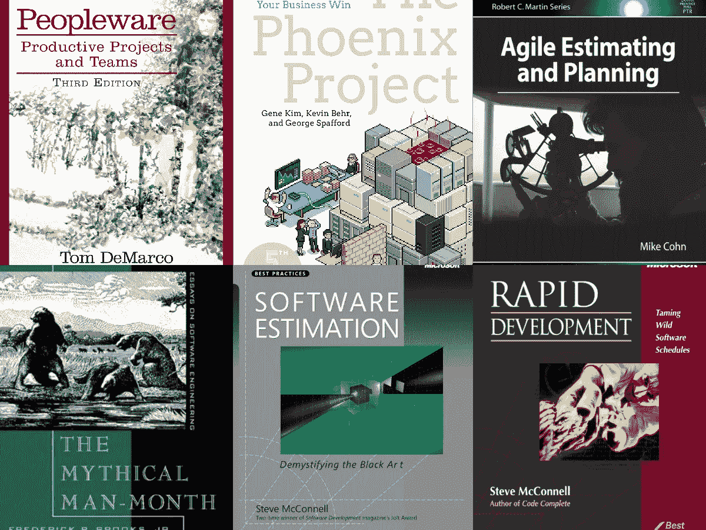
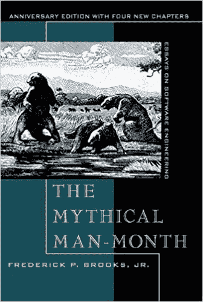
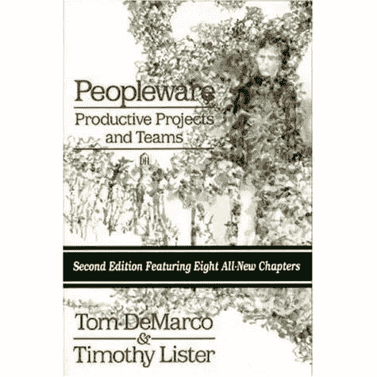
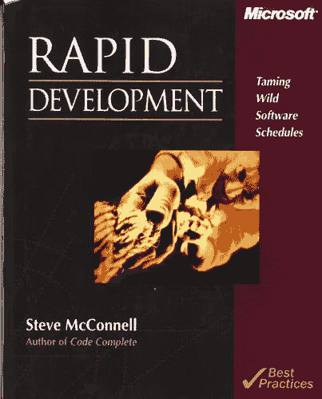
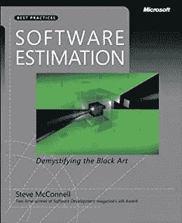
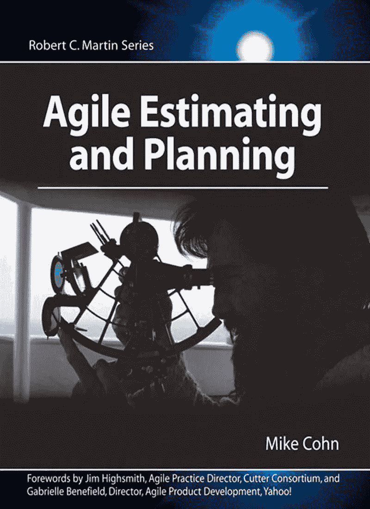
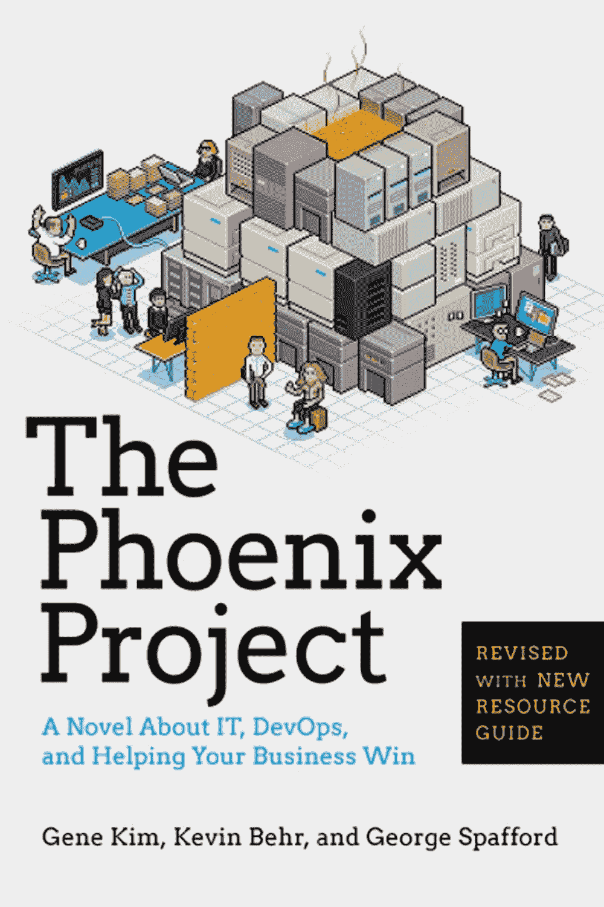

# 2023 年技术领导和项目经理的 6 本最佳软件开发和项目管理书籍

> 原文：<https://medium.com/javarevisited/6-best-software-development-and-project-management-books-for-tech-leads-and-project-managers-5a82a6fbed6b?source=collection_archive---------0----------------------->

## 2023 年我最喜欢的学习软件开发和项目管理的书籍，面向技术领导和项目经理。

嘿，伙计们，如果你最近被提升为项目经理，或者加入了一家新公司担任技术主管，或者渴望在今年成为这些人，并且正在寻找资源来提高你的软件项目管理技能，那么你来对地方了。

之前，我已经分享了一本关于[编码](/javarevisited/6-coding-books-every-programmers-and-software-developers-should-read-620124886c8f)、[设计](/javarevisited/7-best-books-to-learn-design-patterns-for-java-programmers-5627b93eefdb?source=---------15------------------)、[工作面试](/javarevisited/5-coding-interview-books-to-prepare-for-programming-job-interviews-d8f63348afaf)的书，今天，我将分享关于*软件开发过程和项目管理*的书，这对技术领导、团队领导和技术项目经理非常有用。

你们有些人可能会问，为什么软件开发项目经理要读书？难道他们没有足够的经验成为项目经理，处理软件开发和管理程序员吗？

> 这是一个真实的问题，但是软件管理比其他任何管理都难，纯粹是因为每个软件或项目都不同于前一个。

在软件的帮助下，许多其他的工程流，如土木或机械，在评估和管理方面变得更好，但是软件开发仍然依靠经验。

没有一种简单、万无一失的方法可以按时交付高质量的软件。虽然你有[敏捷](https://javarevisited.blogspot.com/2018/01/top-5-free-agile-courses-for-programmers.html#axzz5QneAh3Kg)帮助你，但它不是[软件开发](/javarevisited/15-best-udemy-courses-programmers-can-buy-on-black-friday-and-cyber-monday-2020-a803874f41d9)的灵丹妙药。如果项目经理没有任何软件开发经验，软件管理会变得更加棘手，这听起来可能很荒谬，但确实如此。

我曾经和一些没有软件开发[、](/javarevisited/10-best-software-development-courses-certifications-from-coursera-4ccc59aae201)[编码](/javarevisited/7-best-coding-course-to-learn-programming-with-zero-experience-in-2020-52f7d0d9cb80)或支持经验的项目经理一起工作过几次。然而，他们中的一些人做得很好，但他们中的大多数人都喜欢为什么一个特定的功能不能在一天内完成？

向他们解释你没有合适的工具和库来开发这个特性是很有挑战性的，并且交付这个特性需要额外的时间。

> 很多时候，我觉得项目经理认为软件程序员在欺骗他，当他使出浑身解数强行通过时，就会产生质量差的软件，有很多错误和脆弱的结构。

在这篇文章中，我将分享一些最好的项目管理和评估书籍，它们将帮助项目经理、团队领导和软件架构师的工作。

它们还涵盖了像敏捷和 Scrum 这样的东西，Scrum 是软件开发和管理的现代方式，每个项目经理都应该知道它们。

# 2023 年学习软件和项目管理的 6 本最佳书籍

这里有一些关于软件开发和项目管理的优秀书籍。这些书包含了做过软件开发和项目管理的人的真实经历，有成功的也有失败的。

> 有人说，为了成功，仅仅做成功人士做的事情还不够，还要避免，这导致了失败。

这些书将帮助你学习那些有价值的课程，而不需要花费他们学习的时间。这种学习将帮助您减少风险，并使专业软件开发不那么痛苦。

## 1.[神话中的人月](http://www.amazon.com/The-Mythical-Man-Month-Engineering-Anniversary/dp/0201835959?tag=javamysqlanta-20)

这是 Fred Brooks 写的关于软件工程和项目管理的永恒书籍之一。这本书的中心主题是“给一个后期的软件项目增加人力会使它变得更晚。”

> 你可能听说过一个著名的笑话**“一个项目经理是一个认为 9 个母亲可以在一个月内接生一个婴儿的人”**。

这本书包含了基于作者本人经历的文章，作者曾在 IBM 工作并管理 OS/360 的开发。这本书有几个有用的建议和经验，你不用自己管理项目也能学到。如果你和我一样喜欢阅读关于个人成功和失败的故事，并从中学习，这是你能读到的关于项目管理的最好的书。我还建议你将这本书与 [**项目管理入门:项目管理一级**](https://click.linksynergy.com/fs-bin/click?id=JVFxdTr9V80&subid=0&offerid=323058.1&type=10&tmpid=14538&RD_PARM1=https%3A%2F%2Fwww.udemy.com%2Fbeginning-project-management-project-management-level-one%2F) 课程结合起来，后者更为现代，给你机会学习如何在现实世界中应用项目管理的经典原则。

## 2. [Peopleware:生产项目和团队](https://www.amazon.com/Peopleware-Productive-Projects-Teams-3rd/dp/0321934113?tag=javamysqlanta-20)

Peopleware 是另一个关于项目管理的永恒经典。如果你猜对了，就像硬件和软件是计算机技术的两大支柱一样，Peopleware 也是其中之一。

你不一定要同意它，但你可能应该阅读它，如果只是为了基线你做的决定。

例如,“意大利面晚餐”一章描述了一个虚构的案例，一位经理邀请一个新团队来吃晚餐，然后让他们一起购买和准备这顿饭，以便让一个团队取得成功。其他章节使用现实生活中的故事或引用各种研究来说明所提出的原则。并且，如果你需要一门初学项目管理的课程来结合这本书， [**项目管理入门**](https://pluralsight.pxf.io/c/1193463/424552/7490?u=https%3A%2F%2Fwww.pluralsight.com%2Fcourses%2Fproject-management-beginners-guide) 是一个很好的入门。

## 3.[快速开发:驯服野生软件时间表](https://www.amazon.com/Rapid-Development-Taming-Software-Schedules/dp/1556159005?tag=javamysqlanta-20)

这是 Steve C. McConnel 写的，他是我最喜欢的作家之一，在编程界非常受尊敬。史蒂夫·麦康奈尔(Steve McConnell)抓住了微软在大规模开发软件的第一个十年左右发现的许多开发管理思想。

这本书给了你一个软件工程的不同视角，权衡取舍，我猜想这是你将学到的最实用的东西。以低成本和短时间创建高质量、功能丰富、无所不能的软件是不可能的。

你需要做出权衡，是想要功能更少但健壮的软件在短时间内完成，还是想要功能更丰富但被推迟的项目。史蒂夫·麦康奈尔在解释软件开发和项目管理的实用性方面做得非常出色。

顺便说一句，如果你完全是管理新手，那么 [**管理技能:新经理必备**](https://click.linksynergy.com/fs-bin/click?id=JVFxdTr9V80&subid=0&offerid=323058.1&type=10&tmpid=14538&RD_PARM1=https%3A%2F%2Fwww.udemy.com%2Fthe-new-manager-managing-people-teams-processes%2F) 课程是我通常向我的朋友和同事推荐的另一个好资源，他们想成为项目经理和团队领导。

## 4.[软件评估:揭开黑色艺术的神秘面纱](https://www.amazon.com/Software-Estimation-Demystifying-Developer-Practices/dp/0735605351/?tag=javamysqlanta-20)

这是 Steve McConnell 关于软件评估和项目管理的另一本优秀的书。这个过程被恰当地称为黑艺术变得复杂和不确定。

即使经过了几十年的发展，也没有任何工具或过程可以给你多少时间来开发一个确定的软件。

这很大程度上取决于一些因素，比如你的团队，你是否有合适的人来做这项工作，工具，给出需求的用户，以及接受需求的人。

这本书旨在教你如何准确估计软件开发时间框架，这是任何技术主管或技术项目经理的关键技能。

## 5.[敏捷评估和规划第一版](https://www.amazon.com/Agile-Estimating-Planning-first-Text/dp/B005GP91NG?tag=javamysqlanta-20)

这是关于软件规划和敏捷方法驱动的评估的最好的书之一。作者 Mike Cohn 是敏捷世界中受人尊敬的名字之一，他写了几本关于敏捷不同领域的书，比如 scrum，user stories 等等。本书旨在为当今动态和不断变化的项目中的软件评估和规划提供确定性的方法。即使你没有实践敏捷，这也是一本学习现代软件评估过程的极好的书。

你也可以把这本书和 [**敏捷速成班结合起来:敏捷项目管理；Udemy 上的敏捷交付**](https://click.linksynergy.com/fs-bin/click?id=JVFxdTr9V80&subid=0&offerid=323058.1&type=10&tmpid=14538&RD_PARM1=https%3A%2F%2Fwww.udemy.com%2Fagile-crash-course%2F) 课程，获得一些真实世界的经验。

我通常这样做，因为有时我在看书时感到无聊，然后转向一门课程，给我一个看待事物的新视角。这门课程也非常实用，是对本书的有效补充。

## 6..[凤凰计划](https://www.amazon.com/Phoenix-Project-DevOps-Helping-Business/dp/0988262592?tag=javamysqlanta-20)

学习书籍很有趣，尤其是那些有一长串“该做什么”和“不该做什么”以及“为什么”和过程的书。不幸的是，如果你不喜欢这么长的类比，或者在第一章就睡着了，那么这本书非常适合你。凤凰计划是一部描述使用 DevOps 技术解决 IT 和软件危机的小说。在这里，你将完全被比尔的世界所吸引，他是 Parts Unlimited 的 IT 经理。

[**凤凰计划:一本关于 IT 的小说，DevOps，并帮助您的企业赢得**](https://www.amazon.com/Phoenix-Project-DevOps-Helping-Business/dp/0988262592?tag=javamysqlanta-20) 这本书已经被许多开发人员多次称为惊险和诡秘，有那么多人向我推荐它，我记不清了。

以上是项目经理为了减少软件开发的痛苦而应该阅读的一些最好的书籍。如果你是一个管理本地和远程开发团队的程序员，这些书将帮助你确定决策的基准。不要认为它们过时了，这些书中给出的内容是永恒的，仍然适用于我们所做的许多软件开发。

其他**你可能喜欢读的编程书籍**。

*   [严肃程序员的 10 本算法书](http://www.java67.com/2015/09/top-10-algorithm-books-every-programmer-read-learn.html)
*   [每个程序员都应该读的 5 本书](http://www.java67.com/2016/02/5-books-to-improve-coding-skills-of.html)
*   [每个程序员都应该阅读的 5 本 SQL 书籍](http://www.java67.com/2016/09/sql-5-best-books-to-learn-and-master.html)
*   [5 本书更好地学习 TDD 和单元测试](http://javarevisited.blogspot.com/2014/08/top-5-books-to-learn-unit-testing-junit-tdd-Java-programmers.html)
*   [编程/编码面试的前 5 本书](http://javarevisited.blogspot.sg/2016/06/top-5-books-for-programming-coding-interviews-best.html)
*   每个软件工程师都应该阅读的 10 本书
*   [Java 程序员必读书籍](https://medium.freecodecamp.org/must-read-books-to-learn-java-programming-327a3768ea2f#f2fc)
*   [初学者学习 Python 编程的前 5 本书](https://dev.to/javinpaul/top-5-books-to-learn-python-for-beginners-best-of-lot-4f1n)
*   [面向有经验的 Java 开发人员的 5 本 Spring 框架书](https://javarevisited.blogspot.com/2018/04/5-spring-framework-books-experienced-Java-developers-2018.html)
*   [学习 Python 编程的前 5 门课程](https://javarevisited.blogspot.com/2018/03/top-5-courses-to-learn-python-in-2018.html)

谢谢你阅读了这么多，如果你发现这些关于软件开发、项目管理、开发运维、敏捷和工程师的书籍和建议很有用，请与你的朋友和同事分享，这确实会带来很大的不同。

**附言——**如果你正在准备项目管理专业认证(PMP)，并且需要一些资源来准备和深入学习项目管理，那么我强烈推荐你去看看 Udemy 上的 [**实用项目管理课程**](https://click.linksynergy.com/deeplink?id=JVFxdTr9V80&mid=39197&murl=https%3A%2F%2Fwww.udemy.com%2Fcourse%2Fdeeply-practical-project-management%2F) 。对于新晋升的项目经理和管理数十个项目的经验丰富的项目经理来说，这都是一门很棒的课程。

<https://click.linksynergy.com/deeplink?id=JVFxdTr9V80&mid=39197&murl=https%3A%2F%2Fwww.udemy.com%2Fcourse%2Fdeeply-practical-project-management%2F> 