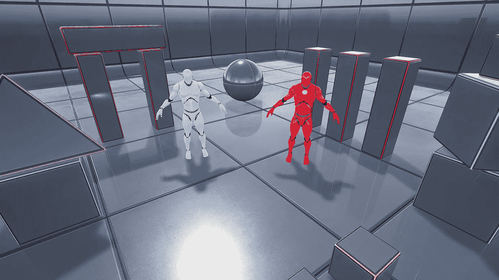
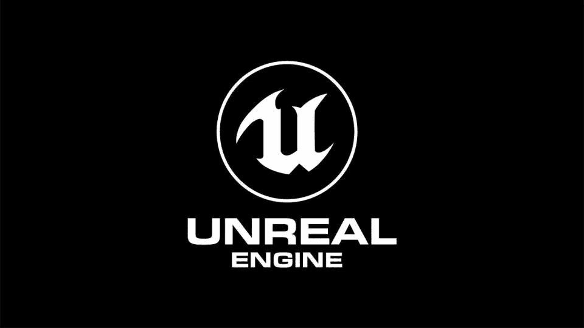

# 2023 年 C++游戏开发者 6 门最佳虚幻引擎课程

> 原文：<https://medium.com/javarevisited/6-best-unreal-engine-courses-for-c-game-developers-in-2021-41ca05907ae4?source=collection_archive---------0----------------------->

## 我最喜欢的 2023 年 Udemy 和 Pluralsight 为初学者和有经验的 C++游戏开发者学习虚幻引擎 4 的在线课程。

如果你对游戏开发感兴趣，那么你可能听说过虚幻引擎，这是一个用 C++编程语言制作游戏的流行引擎。

虚幻引擎是一种开源软件，允许开发人员制作视频游戏，甚至不需要擅长编程，甚至不需要程序员使用一些预先制作的游戏，如第一人称射击游戏，您可以编辑它，而不是从头开始。

如果你想学习虚幻引擎并寻找最好的在线课程和教程，那么你来对地方了。在过去，我已经分享了[游戏开发的最佳 Unity 课程](/@javinpaul/7-best-courses-to-learn-unity-for-game-development-in-2020-99f870d88e5e)，在这篇文章中，我将分享*面向 C++开发人员和一般游戏开发人员的最佳虚幻引擎在线课程*。

这些课程由 C++专家和游戏开发者打造，强烈推荐在线学习虚幻引擎。它们也受到成千上万开发人员的信任，并可在流行的在线学习平台上获得，如 [Udemy](/javarevisited/15-best-udemy-courses-programmers-can-buy-on-black-friday-and-cyber-monday-2020-a803874f41d9) 和 [Pluralsight](/javarevisited/top-10-pluralsight-courses-to-learn-programming-and-software-development-during-covid-19-stay-at-30b7d8a4f88f) 。

回到虚幻引擎以及为什么要学习它。使用虚幻引擎有很多好处，例如不需要程序员使用 C++编程语言来创建视频游戏，你可以使用虚幻引擎中的蓝图选项，关于如何使用这个软件的教程到处都是，你也可以只用一个代码为多个平台创建视频游戏。

谈够了虚幻引擎，我将推荐*学习虚幻引擎 4 的最佳在线课程，这是一个*神话般的工具，无需专业制作视频游戏即可创建自己的视频游戏。

# 6 门最佳虚幻引擎在线课程，深入学习

这里列出了一些高质量的在线培训课程，你可以加入这些课程来深入了解虚幻引擎。这些培训课程由专家打造，受到全球成千上万开发者和游戏程序员的信赖。它们也很实惠，尤其是 Udemy 的虚幻引擎课程，你只需花 10 美元就能在定期举行的 Udemy 快闪拍卖上买到。

## 1.[虚幻引擎 C++开发者:学 C++做电子游戏](https://click.linksynergy.com/deeplink?id=JVFxdTr9V80&mid=39197&murl=https%3A%2F%2Fwww.udemy.com%2Fcourse%2Funrealcourse%2F)

C++开发人员或任何想使用 blueprint 选项和代码来制作一个全面的高质量视频游戏的人都可以立即注册这个 udemy 课程。

从在不同操作系统上设置虚幻引擎环境以及 visual studio 代码开始。之后，开始学习如何使用 [C++编程语言](https://hackernoon.com/top-5-free-c-courses-to-learn-programming-in-2019-d27352277da0)比如 variables functions 和 son one 进行编码。然后，您将创建一些视频游戏，如公牛和母牛游戏，以及更多您将在本课程中探索的游戏和选项。

以下是您将在本课程中学到的内容:

*   如何设置虚幻引擎环境？
*   学习 C++编程语言。
*   如何创造不同的游戏？

**以下是加入本实践课程的链接** - [虚幻引擎 C++开发人员](https://click.linksynergy.com/deeplink?id=JVFxdTr9V80&mid=39197&murl=https%3A%2F%2Fwww.udemy.com%2Fcourse%2Funrealcourse%2F)

## 2.[虚幻引擎 4:如何开发你的前两款游戏](https://click.linksynergy.com/deeplink?id=JVFxdTr9V80&mid=39197&murl=https%3A%2F%2Fwww.udemy.com%2Fcourse%2Funreale4%2F)

这是 2023 年学习虚幻引擎最好的课程之一。对于制作视频游戏的新手来说，如果他们不想在项目中使用代码，而只是使用图形界面，他们可能应该看看 Udemy 上的这门课程。

以下是您将在本课程中学到的关键技能:

*   探索虚幻引擎界面。
*   如何创建弹球游戏？
*   如何创建生存游戏？

你将首先看到虚幻引擎上的各种选项，然后创建两个游戏，其中一个是弹球游戏，它有一个完整的部分，有六个多小时，向你详细解释如何创建这个游戏，另一个部分讲述如何在六个多小时的视频内容中创建生存游戏。

**这里是加入本课程的链接**——[虚幻引擎 4:如何开发你的前两个游戏](https://click.linksynergy.com/deeplink?id=JVFxdTr9V80&mid=39197&murl=https%3A%2F%2Fwww.udemy.com%2Fcourse%2Funreale4%2F)

## 3.[虚幻引擎 4 简介](https://pluralsight.pxf.io/c/1193463/424552/7490?u=https%3A%2F%2Fwww.pluralsight.com%2Fcourses%2Fintroduction-unreal-engine-4-1609)【复数视线】

另一个很棒的课程，教你如何使用虚幻引擎界面，如何在这个软件的不同选项中导航，以及如何改变演员等等。

以下是您将在本课程中学到的内容:

*   探索界面。
*   创建您的第一个项目。
*   玩弄环境。

你将从探索这个复杂软件的界面开始，而不是创建你的第一个项目定制界面放置演员等等。

然后你会看到几何如何工作，游戏的水平如何工作，以及放置游戏的墙壁，灯光创造景观和许多其他主题。

**这里是加入本课程** — [虚幻引擎简介 4](https://pluralsight.pxf.io/c/1193463/424552/7490?u=https%3A%2F%2Fwww.pluralsight.com%2Fcourses%2Fintroduction-unreal-engine-4-1609) 的链接

顺便说一下，你需要一个 [Pluralsight 会员](https://pluralsight.pxf.io/c/1193463/424552/7490?u=https%3A%2F%2Fwww.pluralsight.com%2Flearn)才能加入这个课程，费用大约是每月 29 美元或每年 299 美元(14%的折扣)。我向所有程序员强烈推荐这一订阅，因为它提供了超过 7000+在线课程的即时访问，以学习任何技术技能，包括许多其他虚幻引擎 4 课程。

或者，你也可以使用他们的 [**10 天免费通行证**](https://pluralsight.pxf.io/c/1193463/424552/7490?u=https%3A%2F%2Fwww.pluralsight.com%2Flearn) 免费观看这门课程。

<https://pluralsight.pxf.io/c/1193463/424552/7490?u=https%3A%2F%2Fwww.pluralsight.com%2Flearn>  

## 4.[游戏开发要领](https://click.linksynergy.com/deeplink?id=JVFxdTr9V80&mid=39197&murl=https%3A%2F%2Fwww.udemy.com%2Fcourse%2Fgde-unreal-engine-4%2F)

另一门课程是为那些不愿意学习如何编程或在游戏中加入代码而仅仅使用界面来制作高质量 3D 视频游戏的人开设的，这门课程可以在 [udemy](/javarevisited/my-favorite-udemy-online-courses-for-programmers-and-software-engineers-f9d941dd0035) 上进行。

从软件的介绍开始，然后他将带你了解如何设计 3D 游戏，探索制作这款游戏的不同选择，以及如何改变环境，改变游戏地点和玩法，这样你就可以在完成本课程后制作自己的游戏。

在本课程中，您将学到:

*   使用界面导航。
*   设计 3D 游戏。
*   玩转游戏环境。

**这里是加入本课程**——[游戏开发要领](https://click.linksynergy.com/deeplink?id=JVFxdTr9V80&mid=39197&murl=https%3A%2F%2Fwww.udemy.com%2Fcourse%2Fgde-unreal-engine-4%2F)的链接

## 5.[虚幻引擎 4 快速入门](http://linkedin-learning.pxf.io/c/1193463/449670/8005?u=https%3A%2F%2Fwww.linkedin.com%2Flearning%2Funreal-engine-4-realtime-motion-graphics)【LinkedIn 学习】

这是为有经验的开发者开设的中级虚幻引擎课程。本课程为 mograph 设计者提供了一个在虚幻引擎 4 (UE4)中实时运动图形的快速入门指南。

虚幻引擎弥合了 3D 运动图形和实时游戏引擎的处理能力之间的差距。您可以在熟悉的工具(4D 影院和 Maya)中创建内容，并使用 Unreal 来动画和渲染这些资源。

此工作流程允许创建华丽的图像，同时绕过传统 3D 工具耗时的渲染过程。

Scott Pagano 向您展示了如何使用日场编辑器准备和导入静态和动画几何体以及动画对象和摄像机，以及如何使用 Unreal 的照明和阴影工具充实场景，并导出视频文件和图像序列以在软件(如 [After Effects](https://www.java67.com/2020/10/top-5-courses-to-learn-video-editing-in.html) )中进一步细化。

您还将参与三个展示工作流威力的真实项目。

**这里是加入本课程的链接**——[虚幻引擎 4 快速入门](http://linkedin-learning.pxf.io/c/1193463/449670/8005?u=https%3A%2F%2Fwww.linkedin.com%2Flearning%2Funreal-engine-4-realtime-motion-graphics)

顺便说一下，你需要一个 [LinkedIn Learning 会员](http://linkedin-learning.pxf.io/c/1193463/449670/8005?u=https%3A%2F%2Fwww.linkedin.com%2Flearning%2Fsubscription%2Fproducts)才能观看这个每月花费 29.99 美元的课程，但你也可以访问许多其他虚幻引擎课程进行深入学习。

您也可以通过参加他们的 [**1 个月免费试用**](http://linkedin-learning.pxf.io/c/1193463/449670/8005?u=https%3A%2F%2Fwww.linkedin.com%2Flearning%2Fsubscription%2Fproducts) 来免费观看本课程，这是探索他们 16000 多门最新技术在线课程的好方法。

## 6.[虚幻引擎 4:完全初学者教程](https://click.linksynergy.com/deeplink?id=JVFxdTr9V80&mid=39197&murl=https%3A%2F%2Fwww.udemy.com%2Fcourse%2Funreal-engine-4-the-complete-beginners-course%2F)

本文的最后一门课程是为那些不使用代码编辑器或者不学习如何编码的初学者设计的。

你将从在电脑上安装虚幻引擎开始，然后了解如何在该软件中导航，并开始创建演员、播放器和输入，创建碰撞和用户界面以及许多其他主题，这只是其中的一部分。

在本课程中，您将学到:

*   安装软件。
*   学习如何导航。
*   创建游戏和用户界面。

**这里是加入本课程的链接**——[虚幻引擎 4:完全初学者课程](https://click.linksynergy.com/deeplink?id=JVFxdTr9V80&mid=39197&murl=https%3A%2F%2Fwww.udemy.com%2Fcourse%2Funreal-engine-4-the-complete-beginners-course%2F)

以上就是关于使用 C++编程语言学习游戏开发虚幻引擎的**最佳课程。视频游戏正在主宰从 [Android](/hackernoon/top-5-courses-to-learn-android-for-java-programmers-667e03d995b4) 和 [iOS](/javarevisited/top-5-online-courses-to-learn-ios-12-swift-in-2019-a35ae1be7b2b) 到电脑的每一个平台，这个行业的市场价值已经达到了**109 亿美元**在过去的几年里，公司使用不同的视频游戏引擎来创建这些应用程序，现在虚幻引擎开始发挥作用了。**

你可能喜欢的其他**编程和游戏开发课程**

*   [5 个最适合初学者的 Unity 3D 课程](https://www.java67.com/2020/07/top-5-courses-to-learn-unity-3d-in-2020.html)
*   [学习游戏开发的 5 门免费课程](/javarevisited/my-favorite-free-courses-to-learn-game-development-for-beginners-f7615e26f675)
*   [程序员为什么要学习游戏开发](/javarevisited/why-programmers-should-learn-game-development-2d9a2b3f1c85)
*   [5 大 Java 和 Android 游戏编程书籍](https://javarevisited.blogspot.com/2017/06/top-5-java-and-android-game-programming-books.html)
*   [Java 和 Web 开发人员应该学习的 10 个框架](https://javarevisited.blogspot.com/2018/01/10-frameworks-java-and-web-developers-should-learn.html)
*   [2023 年学习 Scala 的 5 门免费课程](https://javarevisited.blogspot.com/2019/01/5-free-scala-programming-courses-for-java-programmers-learn-online.html)
*   [2023 年 React JS 开发者路线图](https://javarevisited.blogspot.com/2018/10/the-2018-react-developer-roadmap.html)
*   [为有经验的开发者提供的 10 门免费 Java 课程](http://www.java67.com/2018/08/top-10-free-java-courses-for-beginners-experienced-developers.html)
*   [10 门免费数据结构与算法课程](http://www.java67.com/2019/02/top-10-free-algorithms-and-data.html)
*   [2023 年网络开发者路线图](https://javarevisited.blogspot.com/2019/02/the-2019-web-developer-roadmap.html#axzz5gY01iIcw)
*   [学习 Unity 3D 游戏开发的 7 门最佳课程](/javarevisited/7-best-courses-to-learn-unity-for-game-development-in-2020-99f870d88e5e)
*   [面向程序员的 2023 年 DevOps 路线图](https://javarevisited.blogspot.com/2018/09/the-2018-devops-roadmap-your-guide-to-become-DevOps-Engineer.html)
*   [5 门免费课程学习芯泉和 Spring Boot](http://www.java67.com/2017/11/top-5-free-core-spring-mvc-courses-learn-online.html)
*   [2023 年学习 Docker 的 10 门免费课程](http://www.java67.com/2018/02/5-free-docker-courses-for-java-and-DevOps-engineers.html)
*   [面向 DevOps 工程师的五大免费 Kubernetes 课程](https://javarevisited.blogspot.com/2019/01/top-5-free-kubernetes-courses-for-DevOps-Engineer.html#axzz5d2bEyYmv)
*   [2023 年学习 Maven 和 Jenkins 的 5 门免费课程](http://www.java67.com/2018/02/6-free-maven-and-jenkins-online-courses-for-java-developers.html)

感谢您阅读本文。如果你喜欢这些最好的虚幻引擎在线课程，那么请分享给你的朋友和同事。如果您有任何问题或反馈，请留言。

**附言——**如果你热衷于学习虚幻引擎并使用 C++创建游戏，但正在寻找免费的在线培训课程，那么你也可以在 Udemy 上查看这个 [**虚幻引擎 4 FPS 教程**](https://click.linksynergy.com/deeplink?id=JVFxdTr9V80&mid=39197&murl=https%3A%2F%2Fwww.udemy.com%2Fcourse%2Funreal-engine-4-fps-tutorial%2F) 。这个课程是完全免费的，你只需要一个 Udemy 帐户就可以加入这个课程。它将教你如何在虚幻引擎 4 中从头开始制作一个基本的 FPS 游戏。

<https://click.linksynergy.com/deeplink?id=JVFxdTr9V80&mid=39197&murl=https%3A%2F%2Fwww.udemy.com%2Fcourse%2Funreal-engine-4-fps-tutorial%2F> 