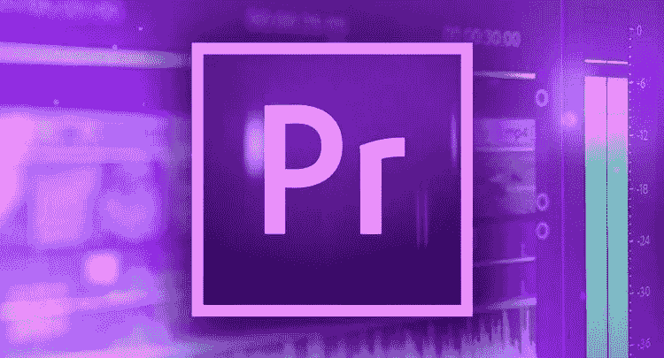
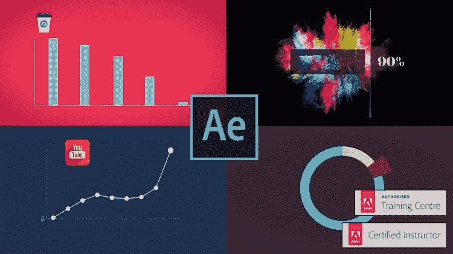
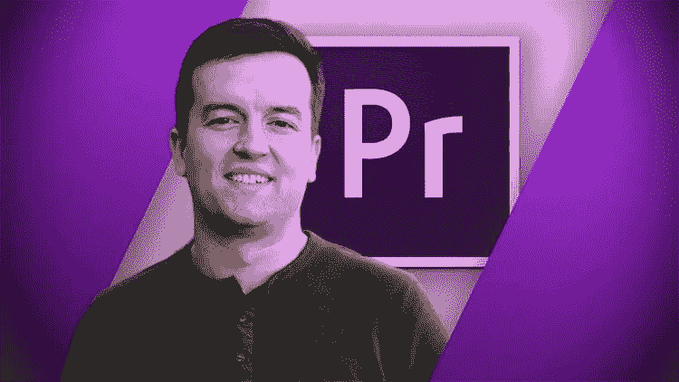
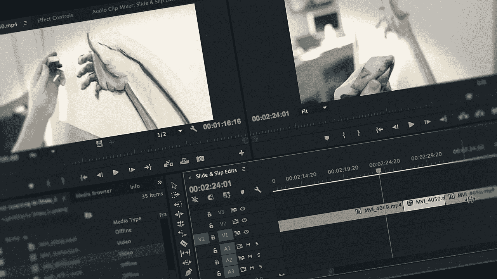
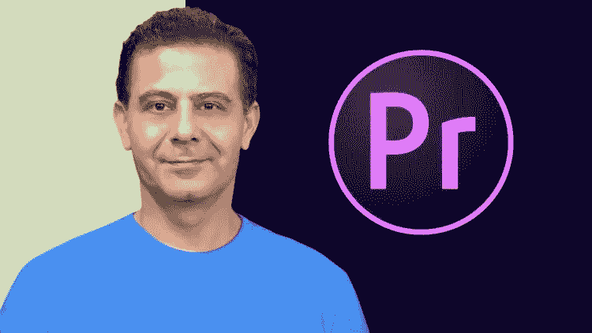

# 2023 年学习视频编辑的 6 门最佳 Adobe Premiere Pro 和 After Effects 课程

> 原文：<https://medium.com/javarevisited/6-best-video-editing-course-with-adobe-premiere-pro-and-after-effects-for-beginners-6f9899be5e77?source=collection_archive---------0----------------------->

## 我最喜欢的学习 Adobe Premiere Pro 视频编辑的在线课程，以及 Udemy、Pluralsight 和其他网站的 After Effects。

image_credit — udemy

你好伙计们，如果你想在 2023 年用 Adobe Premiere 和 After skills 学习视频编辑，这两个最受欢迎的工具是数字营销最受欢迎和必要的技能之一，并且正在寻找最好的视频编辑课程，那么你来对地方了。

早些时候，我已经分享了免费的 Adobe Photoshop 课程 ，在这篇文章中，我将分享在 2023 年使用像 *Adobe Premiere Pro* CC 和 *After Effect* s 这样的工具学习视频编辑的最佳在线课程

这些在线课程由专业图形设计师和对 Adobe Premiere Pro 和 After effects 有很强掌握的人教授，受到了成千上万想在 2023 年学习视频编辑并为你的简历添加有用技能的人的信任。

如今，视频剪辑是一种趋势。从社交媒体到 YouTube，从电影到音乐视频，视频编辑无处不在。没人想要无聊、平淡的视频。

通过编辑视频，我们不仅提高了它的质量，而且可以根据我们的意愿操纵它的进程。如果我们具备所需的技能，即使是最无聊的视频也能被编辑得精彩纷呈。

视频剪辑是一门技能。然而，由于众多视频编辑工具和软件的出现，现在任何人都可以编辑视频。但是顶级的视频剪辑需要一些真正的技巧。有像 [Adobe Premiere Pro](https://www.adobe.com/sea/products/premiere.html) 和 [After Effects](https://www.adobe.com/sea/products/aftereffects.html) 这样的顶级视频编辑软件和优秀视频编辑工具。

虽然这样的编辑器对于专业图形设计人员和视频编辑人员来说是绝对必要的，但是它们有几个复杂的特性，你需要适当的指导和培训来掌握它们。

这就是这篇文章将帮助你的地方。在这篇文章中，我分享了 2023 年学习 Adobe Premiere Pro 和 After Effects 的五大视频编辑课程，有助于您学习和理解视频编辑。

# 2023 年面向初学者的 6 门最佳 Adobe Premiere Pro 和 After Effects 在线课程

在不浪费你更多时间的情况下，这里有最好的在线课程来学习使用 After Effects 和 Premiere pro 等工具进行视频编辑。如果你是内容创建者、课程创建者、Youtuber 用户，或者只是一个自由职业者，你可以学习视频编辑，让你的精彩视频变得更好。我向所有人强烈推荐这些技巧。

## 1.[后效—运动图形&数据可视化](https://click.linksynergy.com/deeplink?id=JVFxdTr9V80&mid=39197&murl=https%3A%2F%2Fwww.udemy.com%2Fcourse%2Fanimated-infographic-video-data-visualisation%2F)

这是 Udemy 最好的视频剪辑课程之一。在本课程中，使用了另一种流行的视频编辑软件 Adobe After Effects。本课程的讲师是 Adobe 认证讲师(ACI)。

在本课程中，讲师将从 adobe 视觉效果的基础知识开始，逐步向高级概念过渡。本课程涵盖了各种有趣的主题和真实的项目。

要求

*   Adobe after effects 和 Adobe Photoshop CC 2017 或以上版本。
*   不需要事先了解动画、adobe after effects 或 photoshop。

本课程视频内容总计近六个小时，为初级课程。我强烈推荐这门课程给任何想在 2023 年掌握 After Effects 的人。

**这里是加入本课程**——[后效——运动图形&数据可视化](https://click.linksynergy.com/deeplink?id=JVFxdTr9V80&mid=39197&murl=https%3A%2F%2Fwww.udemy.com%2Fcourse%2Fanimated-infographic-video-data-visualisation%2F)的链接

## 2. [Premiere Pro CC 初学者:Premiere 中的视频编辑](https://click.linksynergy.com/deeplink?id=JVFxdTr9V80&mid=39197&murl=https%3A%2F%2Fwww.udemy.com%2Fcourse%2Fadobe-premiere-pro-video-editing%2F)

这是另一个在 Udemy 上学习视频编辑的很棒的课程，但是用的是 Premiere Pro CC。有超过 381，000 名学生注册，这个课程，毫无疑问是最新更新的高质量课程。

在本课程中，讲师将使用最流行的视频编辑软件之一— Adobe Premiere Pro。讲师深入探讨视频编辑，解释如何导出和保存回放高清视频，修复颜色问题，应用视频效果，以及许多其他技术。

这是一个很长的课程，总共有 12 个小时的视频内容。这是一个初级课程，你只需要在你的机器或 Macbook 上安装 Adobe Premiere Pro。

**这里是加入本课程的链接**——[Premiere Pro CC for 初学者](https://click.linksynergy.com/deeplink?id=JVFxdTr9V80&mid=39197&murl=https%3A%2F%2Fwww.udemy.com%2Fcourse%2Fadobe-premiere-pro-video-editing%2F)

## 3. [Adobe Premiere Pro CC 2023:面向初学者的视频编辑](https://click.linksynergy.com/deeplink?id=JVFxdTr9V80&mid=39197&murl=https%3A%2F%2Fwww.udemy.com%2Fcourse%2Fpremiere-pro-with-brad-newton%2F)

这是另一个在 Udemy 学习 Adobe Premiere Pro CC221 的很好的课程，它是为那些没有视频编辑经验的人准备的。在本课程中，讲师将解释使用 Adobe Premiere Pro 进行视频编辑的基础知识，以及它的各种功能和技术。

这门课程的创始人不是别人，正是 Phil Ebiner 和视频学校最受欢迎的 Udemy 讲师之一。我真的很喜欢他所有课程的视频和音频质量，这次也不例外。

这是一门绝对的初级课程，总视频内容为九个小时，您将学习如何在 Adobe Premiere Pro 中通过简单易懂的教程和编辑视频来编辑视频。如果你渴望将你的视频编辑技能提升到一个新的水平，那么我强烈推荐你参加这个 Udemy 课程。

要求
*安装 Adobe Premiere Pro CC。*

**以下是参加本课程的链接**—[Adobe Premiere Pro CC 2023](https://click.linksynergy.com/deeplink?id=JVFxdTr9V80&mid=39197&murl=https%3A%2F%2Fwww.udemy.com%2Fcourse%2Fpremiere-pro-with-brad-newton%2F)

## 4. [Premiere Pro CC 必备显卡](https://pluralsight.pxf.io/c/1193463/424552/7490?u=https%3A%2F%2Fwww.pluralsight.com%2Fcourses%2Fpremiere-pro-cc-essential-graphics)【plural sight】

这是 Pluralsight 上一门很受欢迎的视频编辑课程，其中的讲师使用 Adobe Premiere Pro。它是专门为那些想学习和理解如何在 Adobe Premiere Pro 中创建动画图形的人设计的。

要求

*   Adobe Premiere Pro CC 已安装。
*   Adobe Premiere Pro 的基本知识。

讲师详细解释了图形面板、响应式设计、动画图形和动态图形技术的要点。是中级课程，总视频内容近一个半小时。

**以下是加入本课程的链接** — [Premiere Pro CC 基本图形](https://pluralsight.pxf.io/c/1193463/424552/7490?u=https%3A%2F%2Fwww.pluralsight.com%2Fcourses%2Fpremiere-pro-cc-essential-graphics)

## 5. [Premiere Pro CC 基础](https://pluralsight.pxf.io/c/1193463/424552/7490?u=https%3A%2F%2Fwww.pluralsight.com%2Fcourses%2Fpremierepro-cc-fundamentals)【plural sight】

这是 Pluralsight 最畅销的视频编辑课程。它是为那些想了解使用 Adobe Premiere Pro 进行视频编辑的基础知识的人准备的。在本课程中，讲师将介绍如何在 Adobe Premiere Pro 中创建新项目、导入媒体和构建序列。

要求
安装 Adobe Premiere Pro。

教师还涵盖了其他重要的概念，如编辑技术，掌握时间线，与静止的工作，和过渡。这是一个简短的课程，总视频内容不到四个小时。这是一门初级课程。

**这里是加入本课程的链接**——[Premiere Pro CC 基础](https://pluralsight.pxf.io/c/1193463/424552/7490?u=https%3A%2F%2Fwww.pluralsight.com%2Fcourses%2Fpremierepro-cc-fundamentals)

顺便说一下，你需要一个 [**Pluralsight 会员**](https://pluralsight.pxf.io/c/1193463/424552/7490?u=https%3A%2F%2Fwww.pluralsight.com%2Flearn) 才能加入这最后两个视频编辑课程，费用大约为每月 29 美元或每年 299 美元(14%的折扣)。

我向所有程序员强烈推荐这个订阅，因为它提供了超过 7000 个在线课程的即时访问，以学习任何技术技能。或者，你也可以使用他们的 [**10 天免费通行证**](https://pluralsight.pxf.io/c/1193463/424552/7490?u=https%3A%2F%2Fwww.pluralsight.com%2Flearn) 免费观看这门课程。

 [## Premiere Pro CC 基本显卡

### 课程概述大家好。我的名字是凯尔西·布兰南，欢迎来到我的课程，Premiere Pro CC 基本图形…

pluralsight.pxf.io](https://pluralsight.pxf.io/c/1193463/424552/7490?u=https%3A%2F%2Fwww.pluralsight.com%2Fcourses%2Fpremiere-pro-cc-essential-graphics) 

## 6.[Adobe Premiere Pro CC:Adobe Premiere Pro 中的视频编辑](https://click.linksynergy.com/deeplink?id=CuIbQrBnhiw&mid=39197&murl=https%3A%2F%2Fwww.udemy.com%2Fcourse%2Fadobe-premiere-pro-cc-2017-video-editing%2F)【Udemy】

这是使用 Adobe Premiere Pro CC 学习视频编辑的另一个令人惊叹的在线课程。在本课程中，您将学习在 Adobe Premiere Pro 中使用色彩校正和色彩分级进行视频编辑，以及专业的视频编辑实践

由 Louay Zambarakji 创建的这个 10 小时的在线课程将以一种有趣而简单的方式教你视频编辑。您将学习视频编辑和 Premiere Pro CC 从基础到高级技术。你将学会如何在正确的时间和地点用正确的技术使用正确的工具

本课程包括以下内容:

1.  如何高效使用 Premiere Pro CC 中的所有编辑工具
2.  完整专业色彩校正流程
3.  如何使用 Premiere Pro CC 中的最新图形来创建标题、下三分图等…
4.  整个视频编辑过程，而您创建您的演示卷与专业关闭镜头提供给您。

总的来说，这是一个学习视频编辑的很好的课程，在课程结束时，你将创建自己的演示卷，时长从 1 分钟到 4/5 分钟不等，具体取决于你的志向。

以下是参加本课程的链接—[Adobe Premiere Pro 中的视频编辑](https://click.linksynergy.com/deeplink?id=CuIbQrBnhiw&mid=39197&murl=https%3A%2F%2Fwww.udemy.com%2Fcourse%2Fadobe-premiere-pro-cc-2017-video-editing%2F)

以上就是 2023 年**学习 Adobe Premiere Pro 和 After Effects 的最佳视频编辑课程**。这些是我们能在网上找到的顶级视频编辑课程。这些课程大多使用 Adobe Premiere Pro，因为它是最受欢迎的视频编辑软件之一。

这些在线课程既精彩又有趣。全部选自 Udemy、Pluralsight 等顶级教育网站。

其他**网页设计和网页开发文章**你可能想探索

*   学习响应式网页设计的 5 门最佳课程
*   [在线学习 React.js 的 5 大课程](https://javarevisited.blogspot.com/2018/08/top-5-react-js-and-redux-courses-to-learn-online.html)
*   [学习 Web 开发 TypeScript 的 10 门免费课程](/javarevisited/top-10-free-typescript-courses-to-learn-online-best-of-lot-44bce9da41d1)
*   [Web 开发的五大 Python 框架](https://javarevisited.blogspot.com/2019/04/top-5-python-web-development-frameworks.html)
*   [成为全栈式 Web 开发人员的 10 大在线课程](/@javinpaul/top-10-online-courses-to-become-a-fullstack-web-developer-in-2020-d608a6b63232)
*   [2023 年学习渐进式网络应用的 5 门课程](https://javarevisited.blogspot.com/2020/08/top-5-courses-to-learn-progressive-web-app-development.html)
*   [Web 开发人员学习 Angular 的 10 门免费课程](https://javarevisited.blogspot.com/2019/04/10-free-angular-and-react-courses-for.html)
*   [学习使用 Python 进行全栈 web 开发的 5 门课程](https://javarevisited.blogspot.com/2020/06/top-5-courses-to-learn-python-full-stack-web-development.html)
*   [2023 年学习 Web 开发的十大课程](https://dev.to/javinpaul/top-6-courses-to-learn-web-development-best-of-lot-2fae)
*   [2023 年学习 JavaScript 的 12 门免费课程](/javarevisited/12-free-courses-to-learn-javascript-and-es6-for-beginners-and-experienced-developers-aa35874c9a32)
*   [学习 Node.js 和 Express.js 框架的前 5 门课程](http://javarevisited.blogspot.sg/2018/01/top-5-nodejs-and-express-js-online-courses-for-web-developers.html)
*   [成为全栈 Java 开发者的 10 门免费课程](/javarevisited/10-free-full-stack-java-development-courses-for-beginners-and-experienced-programmers-8473390bec03)

感谢您阅读本文。如果你喜欢 Adobe Premiere CC 和 Adobe After Effects 的这些最佳视频编辑工具在线课程，请与你的朋友和同事分享。如果您有任何问题或反馈，请留言。

如果你正在寻找一些免费的视频编辑课程，那么你也可以看看这个 [**如何编辑你的视频**](https://click.linksynergy.com/deeplink?id=JVFxdTr9V80&mid=39197&murl=https%3A%2F%2Fwww.udemy.com%2Fcourse%2Fudemy-insights-editing-your-videos%2F) ，这是一个免费的官方 Udemy 课程，对于学习视频编辑课程来说很棒。超过 1000，000 名学生从这门免费课程中受益，您必须了解视频编辑的基本知识。

 [## 免费在线课程创建教程-如何编辑你的视频:官方 Udemy 课程

### 你想学习一些简单而有效的方法来让你的 Udemy 课程吸引学生吗？你知道吗…

udemy.com](https://click.linksynergy.com/deeplink?id=JVFxdTr9V80&mid=39197&murl=https%3A%2F%2Fwww.udemy.com%2Fcourse%2Fudemy-insights-editing-your-videos%2F)