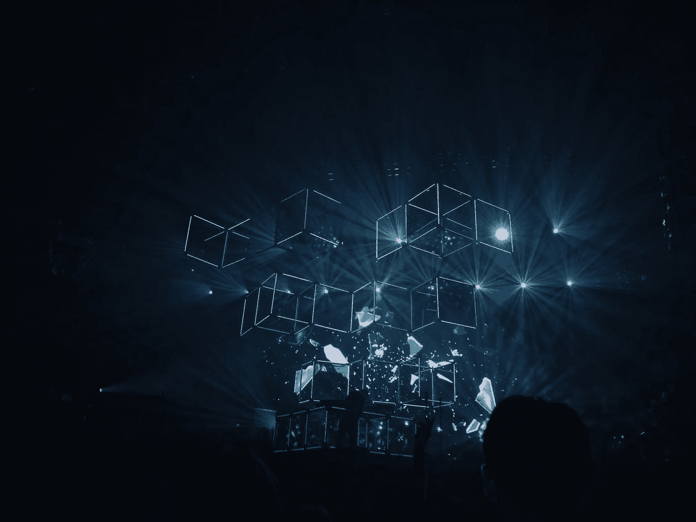
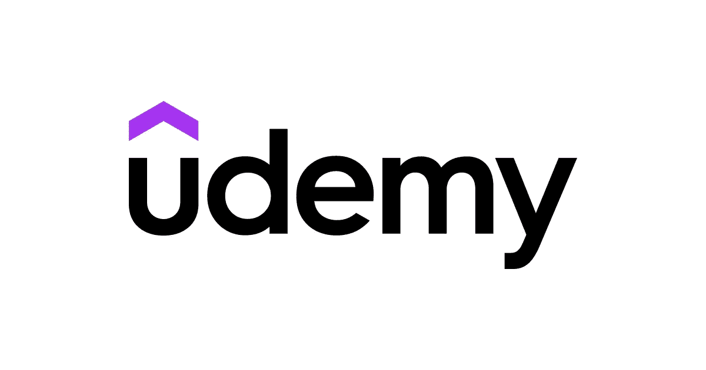
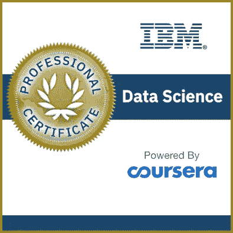
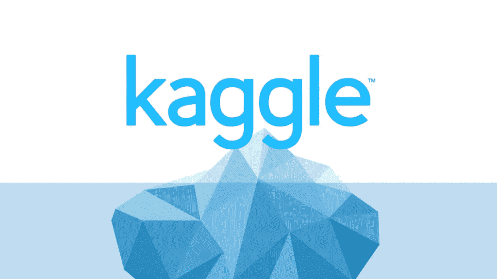

# 2023 年学习数据科学和机器学习的 6 个最佳地点

> 原文：<https://medium.com/javarevisited/6-best-websites-to-learn-data-science-and-machine-learning-36f014af63fb?source=collection_archive---------0----------------------->

## 我最喜欢的学习数据科学和机器学习的网站包括资源、社区和 2023 年数据科学的在线学习平台

照片由[法比奥](https://unsplash.com/@fabioha?utm_source=medium&utm_medium=referral)在 [Unsplash](https://unsplash.com?utm_source=medium&utm_medium=referral) 上拍摄

大家好，如果你想在 2023 年学习数据科学，并寻找书籍、教程、在线课程和网站等最佳资源，那么你来对地方了。

之前，我已经分享了 [**最佳数据科学课程**](https://javarevisited.blogspot.com/2020/08/top-10-coursera-certifications-to-learn-Data-Science-Visualization-and-Data-Analysis.html) 和[书籍](/javarevisited/6-best-python-books-for-data-science-and-machine-learning-in-2021-2f41d9fbf8be)，在本文中，我将分享 2023 年在线学习数据科学的*最佳网站。*

数据科学是一种从许多来源和渠道(如数据库)收集数据的方法，它可以分析数据并将其转换为可视化和图形，从而提高数据的可读性和可理解性，以确保组织内部做出更好的决策，并为其业务增加价值。

数据科学家应该拥有许多行业的经验，如计算机科学、Python 和 R 等编程语言以及统计学、数学和一些技能，如分析可视化数据，不仅仅是将数据转换成图表，而是从数据中提取洞察力，从而为任何业务或世界增加价值。

对于任何刚从大学计算机科学专业毕业的人或 IT 行业的专业人士来说，如果他们想学习如何成为一名平均年薪为 11.3 万美元的成功的数据科学家，可以在一些有助于实现这一目标的网站上阅读这篇文章。

# 2023 年学习数据科学和机器学习的 6 个最佳平台

在不浪费你更多时间的情况下，这里列出了免费在线学习数据科学的最佳网站。你可以在家里或办公室使用这些免费资源学习 2023 年的数据科学。

## 1. [Udemy](https://click.linksynergy.com/deeplink?id=JVFxdTr9V80&mid=39197&murl=https%3A%2F%2Fwww.udemy.com%2Fcourse%2Fthe-data-science-course-complete-data-science-bootcamp%2F)

这个受欢迎的在线平台正在向全球超过 5000 万人教授技能，并让您通过数十万门课程发现自己的才华，这些课程涉及许多主题，如编程、商业、网络开发、营销等，其中一门课程是学习数据科学。

去 Udemy 搜索数据科学课程，你肯定会找到大约 10000 门用多种语言讲述数据科学的课程，以及教你如何用 tableau 做数据科学或用 [Python](/javarevisited/10-best-and-free-datacamp-courses-to-learn-python-and-data-skills-in-2021-39e42682fd76) 做数据科学的不同级别。

如果你擅长编程以及在数据科学中实现机器和深度学习，如果你想深入学习这个行业，那么 Udemy 是一个在线学习的好地方。你不仅有机会向行业专家学习，而且价格也很实惠。

我从未见过一门高质量的数据科学课程售价仅为 9.9 美元，这对世界各地的许多人来说只是一杯咖啡，与数据科学家的工资相比不值一提，即使是这些领域的初学者也获得了丰厚的报酬。

以下是我推荐的 2023 年学习数据科学的 Udemy 课程，它包括免费和付费课程:

*   [**数据科学课程 2023:完整数据科学训练营**](https://click.linksynergy.com/deeplink?id=JVFxdTr9V80&mid=39197&murl=https%3A%2F%2Fwww.udemy.com%2Fcourse%2Fthe-data-science-course-complete-data-science-bootcamp%2F)【4.6 星，45 万报名人数】
*   [**数据科学 A-Z:真实数据科学练习包括**](https://click.linksynergy.com/deeplink?id=CuIbQrBnhiw&mid=39197&murl=https%3A%2F%2Fwww.udemy.com%2Fcourse%2Fdatascience%2F)【4.6 星 19.4 万学生】
*   [**使用 Python 的数据科学入门**](https://click.linksynergy.com/deeplink?id=CuIbQrBnhiw&mid=39197&murl=https%3A%2F%2Fwww.udemy.com%2Fcourse%2Fintroduction-to-data-science-using-python%2F) **【免费】**【4.5 星，125K 学生
*   [**机器学习 A-Z:数据科学中的动手 Python&R**](https://click.linksynergy.com/fs-bin/click?id=JVFxdTr9V80&subid=0&offerid=323058.1&type=10&tmpid=14538&RD_PARM1=https%3A%2F%2Fwww.udemy.com%2Fmachinelearning%2F)
*   [**深度学习 A-Z:动手人工神经网络**](https://click.linksynergy.com/fs-bin/click?id=JVFxdTr9V80&subid=0&offerid=323058.1&type=10&tmpid=14538&RD_PARM1=https%3A%2F%2Fwww.udemy.com%2Fdeeplearning%2F)

除此之外，Udemy 上还有更多课程可以学习数据科学的各个方面。你可以找到免费的课程来学习基本的数据分析工具和库，如 [NumPy](/javarevisited/6-best-online-courses-to-learn-numpy-for-beginners-60120f611e06) 、 [Pandas](/javarevisited/5-best-free-pandas-courses-for-beginners-in-2022-d7dbe017b90c) 、 [Scikit-Learn](/javarevisited/5-best-scikit-learn-online-courses-for-machine-learning-and-data-science-6beb02e9cca0) 、 [TensorFlow](/javarevisited/is-courseras-tensorflow-advanced-techniques-specialization-worth-it-review-de51ba2ee385) 等等。

这些是 2023 年你可以加入学习数据科学的最好的数据科学和机器学习课程。它们也是最全面、最新和最实用的课程，课程的评分和注册学生人数证明了这一点。你也可以在 Udemy 上阅读人们的评论来获得一些反馈。

我还建议你观看这些课程的预览，如果你能观看它们而不转发或感到厌烦，那么这是你从课程中学习的一个好机会，这是我在加入任何课程之前所做的，它真的很好。

## 2. [Coursera](https://coursera.pxf.io/c/3294490/1164545/14726?u=https%3A%2F%2Fwww.coursera.org%2F)

Coursera 也是一个在线课程平台，就像以前的 Udemy 一样，但不同之处在于 Coursera 的课程是由顶尖的领先大学和组织如 IBM 和 Google 提供的。

不像 Udemy，任何人都可以上传他的课程，即使他不是那么专业，这就是为什么 Coursera 被认为是世界上最专业的讲师之一。

如果你问我 [*Coursera*](https://coursera.pxf.io/c/3294490/1164545/14726?u=https%3A%2F%2Fwww.coursera.org%2F) 上的哪些课程是学习数据科学的最佳课程，我会建议你参加专业化课程，这些课程是包含许多小课程的大认证，教你成为成功的数据科学家所需的所有技能。

你可以从 [**谷歌的数据分析专业证书**](https://coursera.pxf.io/c/3294490/1164545/14726?u=https%3A%2F%2Fwww.coursera.org%2Fprofessional-certificates%2Fgoogle-data-analytics) 开始，这是 Coursera 上最受欢迎的专业证书之一，也是学习数据分析的最结构化和最全面的资源之一，它构成了数据科学的基础。

 [## 谷歌数据分析

### 这是你通往数据分析职业的道路。在这个项目中，你将学到一些受欢迎的技能，让你…

coursera.pxf.io](https://coursera.pxf.io/c/3294490/1164545/14726?u=https%3A%2F%2Fwww.coursera.org%2Fprofessional-certificates%2Fgoogle-data-analytics) 

而且，如果你直接想从数据科学开始，那么 [**IBM 数据科学**](https://coursera.pxf.io/c/3294490/1164545/14726?u=https%3A%2F%2Fwww.coursera.org%2Fprofessional-certificates%2Fibm-data-science) 是这个行业职业生涯的最佳计划，它会让你深入机器学习、python SQL 可视化等等。

另一门你可以看一下的课程是 [**应用数据科学与 Python**](https://coursera.pxf.io/c/3294490/1164545/14726?u=https%3A%2F%2Fwww.coursera.org%2Fspecializations%2Fdata-science-python) 它会用实际例子深入教你。

 [## 使用 Python 的应用数据科学

### 获得对数据的新见解。学习应用数据科学方法和技术，并获得分析技能。的…

coursera.pxf.io](https://coursera.pxf.io/c/3294490/1164545/14726?u=https%3A%2F%2Fwww.coursera.org%2Fspecializations%2Fdata-science-python) 

顺便说一下，除了单独加入这些课程和专业，你还可以加入 [**Coursera Plus**](https://coursera.pxf.io/c/3294490/1164545/14726?u=https%3A%2F%2Fwww.coursera.org%2Fcourseraplus) ，这是 Coursera 的一个订阅计划，让你可以无限制地访问他们最受欢迎的课程、专业、专业证书和指导项目。

 [## Coursera Plus |无限制访问 7，000 多门在线课程

### 用 Coursera Plus 投资你的职业目标。无限制访问 90%以上的课程、项目…

coursera.pxf.io](https://coursera.pxf.io/c/3294490/1164545/14726?u=https%3A%2F%2Fwww.coursera.org%2Fcourseraplus) 

## 3.多元视觉

Pluralsight 是一个在线电子学习平台，成立于 2004 年，目标人群是希望学习信息技术(IT)或任何技能或通过数百名讲师多年来创建的数千门课程来升级知识的人。

最热门的课程之一是数据科学和如何通过许多课程成为一名成功的数据科学家，如[**数据科学:管理层简报**](https://pluralsight.pxf.io/c/1193463/424552/7490?u=https%3A%2F%2Fwww.pluralsight.com%2Fcourses%2Fdata-science-executive-briefing) 了解数据科学的重要性。

 [## 数据科学:管理层简报

### 在本次管理层简报中，您将了解什么是数据科学，为什么它对您和您的企业如此重要，以及如何…

pluralsight.com](https://pluralsight.pxf.io/c/1193463/424552/7490?u=https%3A%2F%2Fwww.pluralsight.com%2Fcourses%2Fdata-science-executive-briefing) 

除此之外，还有另一门名为 [**用 python 做数据科学**](https://pluralsight.pxf.io/c/1193463/424552/7490?u=https%3A%2F%2Fwww.pluralsight.com%2Fcourses%2Fpython-data-science) 的课程，学习如何成为一名拥有 Python 技能的数据科学家，了解真实项目和各种 Python 库，如 NumPy 和 matplotlib，在这门六小时的课程中，您将学到更多内容。

 [## 用 Python 做数据科学

### 本课程将向您展示如何进行端到端的数据科学项目，包括处理数据、构建和分析

pluralsight.comcom](https://pluralsight.pxf.io/c/1193463/424552/7490?u=https%3A%2F%2Fwww.pluralsight.com%2Fcourses%2Fpython-data-science) 

如果你不知道，Pluralsight 还提供了 [**10 天的免费试用期**](https://pluralsight.pxf.io/c/1193463/424552/7490?u=https%3A%2F%2Fwww.pluralsight.com%2Fpricing%2Ffree-trial) ，你可以用它来加入并完成这些课程中的任何一门。他们还提供免费的周末和免费的月份，你可以在一个月内免费学习所有的 Pluralsight 课程。

## 4.[卡格尔](https://www.kaggle.com/)

Kaggle 是最著名的学习数据科学和机器学习的网站之一。它为 2023 年学习数据科学提供了资源和社区，所有级别的数据科学家都可以从 **Kaggle** 中受益。

无论您是初学者、希望学习新技能并为项目做出贡献的人、希望参加竞赛的高级数据科学家，还是介于两者之间的人，Kaggle 都是最好的起点之一。

Kaggle 最大的优势是社区，因为当你遇到困难时，你可以提出问题，消除疑虑并获得指导，因此 Kaggle 绝对是一个学习数据科学的好网站。

## 5.自由代码营

本文的最后一个建议是一个名为 freecodecamp 的非营利组织，它在许多 it 相关的课程中指定，如 web 开发数据科学机器学习人工智能等等。

我会推荐一些我觉得非常有趣的数据科学课程，比如 YouTube 上的这个课程，它包含六个小时，名为[学习数据科学教程](https://www.youtube.com/watch?v=ua-CiDNNj30)

或者你可能想学习另一门课程 [Python for Data Science](https://www.youtube.com/watch?v=LHBE6Q9XlzI) 包含 12 个小时的视频内容和更多课程，你可以在他们的 YouTube 频道上找到。

## 6.哈佛大学

另一个类似 Coursera 的有趣平台是 edx，只有大学和顶级机构才能制作课程和专业证书，然后上传到这个专业网站上，并与世界上的任何人分享知识。

这个平台上学习数据科学的一些最棒的课程是哈佛大学的 [**数据科学专业证书**](https://www.awin1.com/cread.php?awinmid=6798&awinaffid=631878&platform=dl&ued=https%3A%2F%2Fwww.edx.org%2Fprofessional-certificate%2Fharvardx-data-science) ，这类似于 Coursera specializations，其中一个大课程包括几个小课程，当你完成所有课程时，你也将获得认证。

 [## HarvardX 数据科学专业证书

### 基础 R 编程技能的专业证书统计概念，如概率，推理，和…

edx.com](https://www.awin1.com/cread.php?awinmid=6798&awinaffid=631878&platform=dl&ued=https%3A%2F%2Fwww.edx.org%2Fprofessional-certificate%2Fharvardx-data-science) 

另一个值得加入的课程是 [**统计与数据科学**](https://www.awin1.com/cread.php?awinmid=6798&awinaffid=631878&platform=dl&ued=https%3A%2F%2Fwww.edx.org%2Fmicromasters%2Fmitx-statistics-and-data-science) 微硕士项目会教你统计与机器学习。

 [## 统计和数据科学微型硕士项目

### 统计和数据科学的微观硕士课程掌握数据科学，统计和机器的基础…

edx.com](https://www.awin1.com/cread.php?awinmid=6798&awinaffid=631878&platform=dl&ued=https%3A%2F%2Fwww.edx.org%2Fmicromasters%2Fmitx-statistics-and-data-science) 

所有这些课程都是完全在线的，但在此之前，我们先来看看数据科学专业人士的收入。您可以看到，即使是新手也能赚到可观的$95K，这太棒了。

与 Coursera 类似，你可以免费参加大多数 edX 课程，如果你想获得证书，只需要付费。

以上就是 2023 年**最好的免费学习数据科学的网站**。随着技术和大数据的传播，组织需要利用其数据的力量，通过分析数据并提取洞察力，为世界提供更强大的产品用户体验或技术，从而在开发中做出更好的决策，这也是我们谈到数据科学的原因。

您可能喜欢的其他**数据科学和机器学习资源**

*   [2023 年学习 Python 的 5 大课程](https://hackernoon.com/top-5-courses-to-learn-python-in-2018-best-of-lot-26644a99e7ec)
*   [5 个最适合初学者的免费熊猫课程](https://javarevisited.blogspot.com/2021/11/top-5-free-pandas-courses-for-beginners.html)
*   [2023 年约翰·霍普金斯大学学习数据科学的最佳课程](https://javarevisited.blogspot.com/2021/05/best-johns-hopkins-courses-for-data-science-coursera.html)
*   [5 个最适合初学者的数字课程](https://javarevisited.blogspot.com/2021/10/top-5-courses-to-learn-numpy-for-python.html)
*   [学习高级数据科学的前 5 门课程](https://hackernoon.com/top-5-data-science-and-machine-learning-course-for-programmers-e724cfb9940a)
*   [十大 Coursera 数据科学课程和认证](https://javarevisited.blogspot.com/2020/08/top-10-coursera-certifications-to-learn-Data-Science-Visualization-and-Data-Analysis.html)
*   [2023 年学习 Python 的 10 个理由](https://hackernoon.com/10-reasons-to-learn-python-in-2018-f473dc35e2ee)
*   [初学者学习 Python 的 10 门免费课程](https://hackernoon.com/10-free-python-programming-courses-for-beginners-to-learn-online-38312f3b9912)
*   [2023 年学习电力 BI 的前 5 门课程](https://www.java67.com/2020/06/top-5-courses-to-learn-microsoft-power-BI.html)
*   [学习数据科学 Python 的 5 本书](https://javarevisited.blogspot.com/2019/08/top-5-python-books-for-data-science-and-machine-learning.html)
*   [你可以在线获得 5 个数据科学学位](https://www.java67.com/2020/06/top-5-data-science-degree-you-can-earn-online-coursera-edx.html)
*   [面向数据科学家的十大 TensorFlow 课程](https://dev.to/javinpaul/10-of-the-best-tensorflow-courses-to-learn-machine-learning-from-coursera-and-udemy-37bf)
*   [学习 QlikView 和 QlikSense 的五大课程](https://javarevisited.blogspot.com/2020/07/top-5-courses-to-learn-qlikview-and-qlik-sense.html)
*   [学习数据科学 Tableau 的前 5 门课程](https://javarevisited.blogspot.com/2019/07/top-5-tableau-online-courses-and-certifications-for-data-science-engineers.html)
*   [面向数据科学和机器学习的 8 大 Python 库](https://javarevisited.blogspot.com/2018/10/top-8-python-libraries-for-data-science-machine-learning.html)

感谢您阅读本文。如果你喜欢这些网站，请分享给你的朋友和同事。如果您有任何问题或反馈，请留言。

万事如意。

**P. S.** —如果你此刻只想做一件事来启动你的 React.js 之旅，就去参加 Udemy 上的 [**数据科学课程 2023:360 Careers 完成数据科学训练营**](https://click.linksynergy.com/deeplink?id=CuIbQrBnhiw&mid=39197&murl=https%3A%2F%2Fwww.udemy.com%2Fcourse%2Fthe-data-science-course-complete-data-science-bootcamp%2F) 课程。您将快速学习数据科学，并以有指导和结构化的方式学习，并且永远不会后悔您的决定。

 [## 2023 年初学者在线学习的 10 门最佳数据科学课程和认证

### 你们好，这个时候你们过得怎么样？我希望你会做得很好，并保持安全。你可能听说过…

medium.com](/javarevisited/my-favorite-data-science-and-machine-learning-courses-from-coursera-udemy-and-pluralsight-eafc73acc73f)