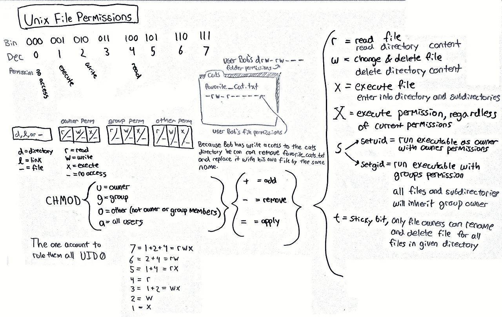
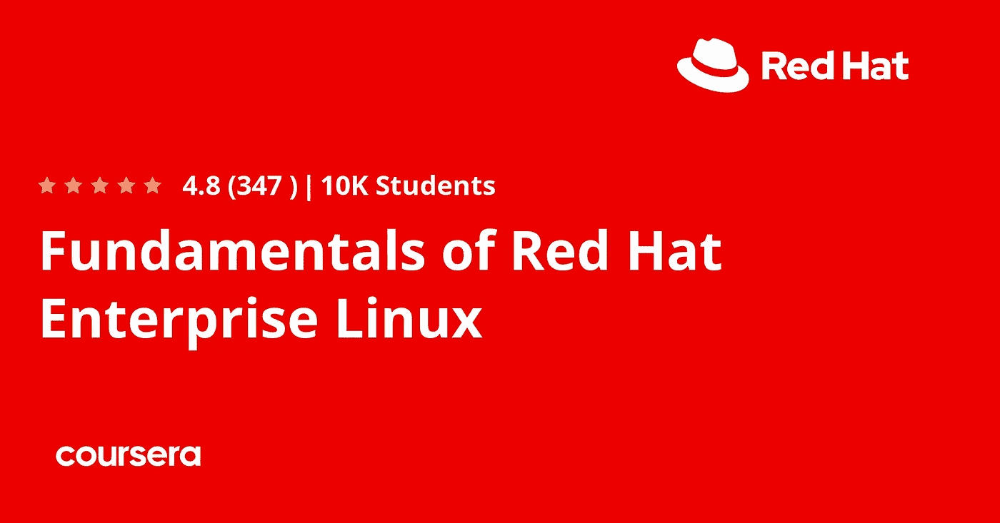
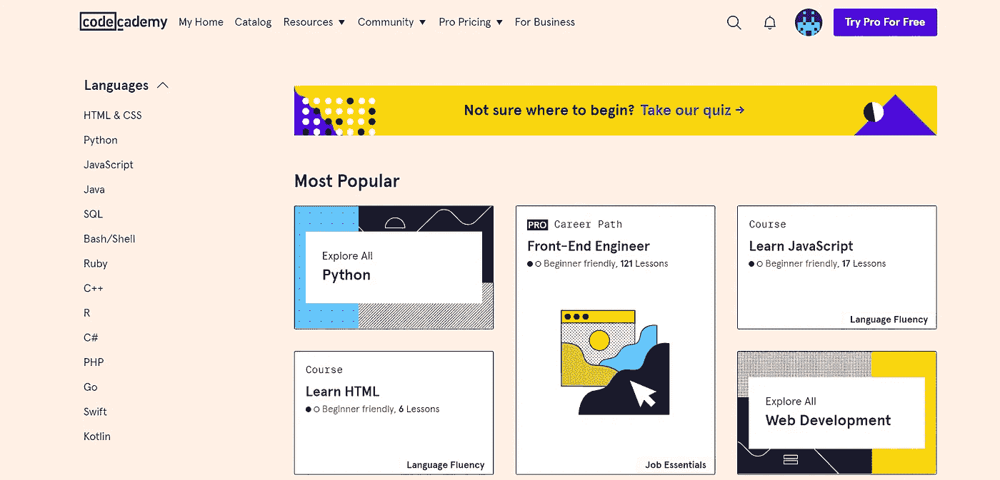
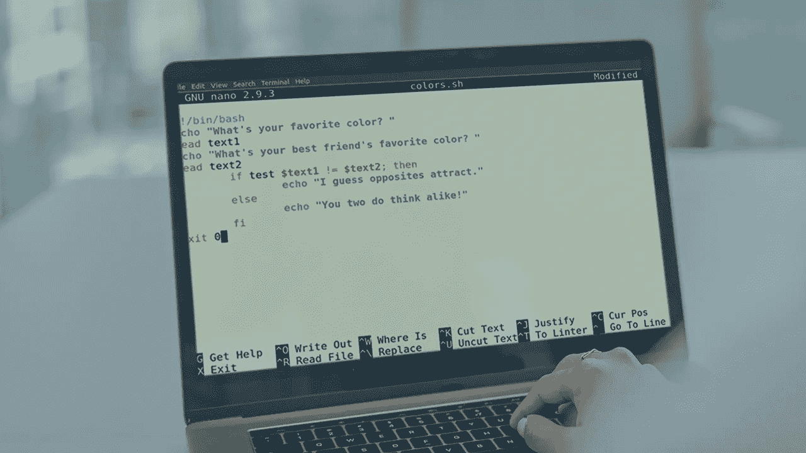

# 2023 年在线学习 Linux 的 6 个最佳地点

> 原文：<https://medium.com/javarevisited/6-best-websites-to-learn-linux-4861ac21bfdf?source=collection_archive---------1----------------------->

## 我最喜欢的免费学习 Linux 概念和命令行的地方和在线平台

大家好，如果你想在网上学习 Linux，并寻找免费的资源来学习 Linux 命令和概念，那么你来对地方了。早些时候，我已经分享了 [**Linux 和 shell 脚本课程**](https://javarevisited.blogspot.com/2018/02/5-courses-to-learn-shell-scripting-in-linux.html) 、 [Linux 书籍](/javarevisited/10-best-linux-unix-and-system-programming-books-for-beginners-2fe750951c9f)和[教程](https://javarevisited.blogspot.com/2011/04/unix-commands-tutorial-and-tips-for.html)，在本文中，您将找到在线学习 Linux 的*最佳地点。*

Linux 是程序员和开发人员最有用的技能之一，互联网上有很多有用的资源可以用来学习 Linux 和掌握 Linux 命令行或 bash shells。在这篇文章中，我将分享一些你可以免费学习 Linux 的网站，以及一些免费试用的案例。

我尝试了各种各样的网站，比如用于在线课程的[*【Udemy】*](/javarevisited/15-best-udemy-courses-programmers-can-buy-on-black-friday-and-cyber-monday-2020-a803874f41d9?source=extreme_sidebar----d3a191ac6ed-----0-1----------------------)和 [*Coursera*](/javarevisited/is-coursera-plus-worth-it-review-7df4915cd326) ，用于在线互动学习的 [*CodeCademy*](https://javarevisited.blogspot.com/2019/10/pluralsight-vs-codecademy-which-is-best-online-learning-platform.html) 和 [*Educative*](https://javarevisited.blogspot.com/2020/05/top-10-educative-courses-for-programmers.html) ，以及作为会员制网站的 Pluralsight。

如果您已经在使用 Linux，但是对 Linux 的概念和命令不太了解，那么您可以使用这些网站从头开始学习 Linux，或者提高您的 Linux 技能。

如果你认为**学习 Linux 值得你花时间**或者不值得，那么让我告诉你，Linux 是核心技术之一，它的寿命可能比任何新的、闪亮的编程语言、库或框架都要长。

Linux 已经生存了 50 多年，我看不到有人在未来几年挑战 Linux 的地位。

大多数商业软件和应用程序都运行在 Linux 上。即使在云上，Linux 也是最受欢迎的操作系统，这就是为什么学习 Linux 命令和概念会对你的职业生涯产生影响。

# 免费学习 Linux 命令的 6 个最佳网站和在线平台

在不浪费你更多时间的情况下，这里有一个免费在线学习 Linux 的最佳网站列表。正如我所说，这个列表包括像 Udemy，Pluralsight，Coursera，Educative，CodeCademy 等网站，以提供完整的学习体验，如在线课程和互动练习。

## 1. [Udemy](https://click.linksynergy.com/deeplink?id=CuIbQrBnhiw&mid=39197&murl=https%3A%2F%2Fwww.udemy.com%2Fcourse%2Flinux-mastery%2F)

Udemy 是我学习任何东西的必去之地，包括 Linux。它收集了最大的 Linux 教程和课程，有免费的也有付费的。这就像一个更好的 YouTube 版本，以更结构化的方式学习 Linux。

虽然有许多免费和付费的 Linux 资源，但并不是所有的都值得你花费时间，而且课程跳跃只会让你学得更慢。

为了帮助你，这里列出了一些最好的免费 Linux 课程，你可以在 Udemy 上查看，开始学习 Linux。

*   [红帽企业 Linux 技术概述【免费】](http://bit.ly/2hj3IYt)
*   [Linux 教程和项目【免费】](http://bit.ly/2ybWmZX)
*   [Linux Shell 脚本简介【免费课程】](http://bit.ly/2l44sP7)

这是一些非常棒的免费 Linux 课程，你可以免费加入学习 Linux 命令、shell 脚本和 Linux 概念。

顺便说一句，如果你需要一个综合课程，那么 [**Linux Mastery:在 11.5 小时内掌握 Linux 命令行**](https://click.linksynergy.com/deeplink?id=CuIbQrBnhiw&mid=39197&murl=https%3A%2F%2Fwww.udemy.com%2Fcourse%2Flinux-mastery%2F) 由 Ziyad Yehia 在 Udemy 上开设的课程是另一个很棒的课程。它不是免费的，但是考虑到 Linux 的重要性和你将要学习的技能，10 美元几乎是免费的。

## 2. [Coursera](https://coursera.pxf.io/c/3294490/1164545/14726?u=https%3A%2F%2Fwww.coursera.org%2F) 【大学和公司的免费 Linux 课程】

有用的在线资源并不缺乏，Coursera 就是其中之一。Coursera 汇集了顶尖大学、公司和其他教学机构提供的在线课程和项目。Coursera 上的大多数课程都是免费的，有几门课程你可以用来学习 Linux。

以下是你可以在 Coursera 上参加的一些很棒的免费课程:

*   [红帽企业版 Linux 基础](https://coursera.pxf.io/c/3294490/1164545/14726?u=https%3A%2F%2Fwww.coursera.org%2Flearn%2Ffundamentals-of-red-hat-enterprise-linux)
*   [面向开发者的 Linux】](https://coursera.pxf.io/c/3294490/1164545/14726?u=https%3A%2F%2Fwww.coursera.org%2Flearn%2Flinux-for-developers)
*   [Linux 服务器管理和安全](https://www.coursera.org/learn/linux-server-management-security)
*   [面向开发者的 Linux 工具](https://coursera.pxf.io/c/3294490/1164545/14726?u=https%3A%2F%2Fwww.coursera.org%2Flearn%2Flinux-tools-for-developers)

这些课程由著名的组织和大学提供，如 RedHat 本身、Linux 基金会和科罗拉多大学。

正如我所说的，你可以免费参加 Coursera 的课程学习，但是如果你需要一个证书或者当你加入一个专业或专业学位时，你需要付费。

他们还有一个名为[**Coursera Plus**](https://coursera.pxf.io/c/3294490/1164545/14726?u=https%3A%2F%2Fwww.coursera.org%2Fcourseraplus)**的会员资格，可以让你从超过 7000 门顶级 Coursera 课程中学习尽可能多的课程、证书和专业知识。**

** [## Coursera Plus |无限制访问 7，000 多门在线课程

### 用 Coursera Plus 投资你的职业目标。无限制访问 90%以上的课程、项目…

coursera.pxf.io](https://coursera.pxf.io/c/3294490/1164545/14726?u=https%3A%2F%2Fwww.coursera.org%2Fcourseraplus)** 

## **3.[教育性](https://www.educative.io/trial?affiliate_id=5073518643380224)【基于文本，在线练习，免费试用】**

**这是另一个学习在线学习 Linux 的好地方。这个基于文本的交互式网站允许您在浏览器中键入 Linux 命令，并从交互式反馈中学习。**

**如果你在 Windows 机器上工作，不知道如何在虚拟机器上安装 Linux，这显然不是那么容易，那么你会喜欢这个网站，因为你不需要安装任何东西来练习 Linux 命令。你可以在浏览器上完成。**

**[教育性](https://www.educative.io?affiliate_id=5073518643380224)类似于[code academy](/javarevisited/codecademy-or-pluralsight-which-is-a-better-platform-to-learn-coding-skills-59251a080642)，通过简单的理论和简单的练习来学习新事物。它提供基于文本的课程，包括测验、评估和图表，以获得更有吸引力的学习体验。**

**不幸的是，他们没有任何完整的免费课程来学习 Linux 命令或 bash 脚本，但他们有一门课程，如面向程序员的[**Bash**](https://www.educative.io/courses/bash-for-programmers?affiliate_id=5073518643380224)**，你可以通过使用他们的 **7 天免费试用**免费观看。****

********

****如果你对互动学习感兴趣，我强烈推荐你试试这个平台。他们的摸索课程像 [*摸索系统设计面试*](https://www.educative.io/collection/5668639101419520/5649050225344512?affiliate_id=5073518643380224) 和[摸索机器学习面试](https://www.educative.io/courses/grokking-the-machine-learning-interview?affiliate_id=5073518643380224)对于通过编码面试真的很有用。****

****他们也有许多免费资源来学习编程技能，如 Java、Python、JavaScript、PHP、Ruby 等，并且 [***教育订阅***](https://www.educative.io/subscription?affiliate_id=5073518643380224) 也非常实惠，只需 14.9 美元就可以获得他们所有的高质量课程。****

**** [## 教育无限:保持领先

### 我们听到了您的反馈。你现在只需支付一次费用，就可以获得 Educative 上的所有课程。

www.educative.io](https://www.educative.io/subscription?affiliate_id=5073518643380224)**** 

## ****4.[学习 Linux @ Codecademy](https://bit.ly/codecademyhome)****

****你可能知道 Codecademy 有一个学习 Linux 命令的在线互动课程，在这个课程中，你有一个学习 Linux 命令的简单任务。这也是一个免费的课程，这意味着你不需要支付任何费用就可以加入，你只需要创建一个 CodeCademy 帐户就可以加入这个课程。****

****虽然[**学习命令行**](https://www.pjtra.com/t/TUJGR0lLR0JHRklJSkhCR0ZISk1N?url=https%3A%2F%2Fwww.codecademy.com%2Flearn%2Flearn-the-command-line) 不是一门非常全面的课程，但它确实提供了一个很好的基本 Linux 命令介绍，每个程序员都应该知道这些命令，如`ls`、`mkdir`、`cd`、`ps`、`less`、`cat`、`more`等。****

****另一个值得注意的事情是，它提供了一个交互式终端，这意味着你不需要设置任何东西，这对于许多在 Windows 环境下工作的初学者来说是非常重要的。****

****如果你以前有过 Linux 的经验，并且想从头开始学习 Linux 命令，我强烈推荐这个网站****

********

****他们也有一个 [**Codecademy PRO**](https://bit.ly/codecademypro) 计划，在年度计划中每月只需 15.9 美元就可以访问他们所有的互动课程。如果你喜欢互动学习，那么你可以通过订阅来学习所需的技术技能。他们现在还提供 *40%的折扣*，使用 code GETHIRED，所以这是加入 Codecademy 的好时机。****

**** [## 学习编码最简单的方法:Pro

### 这不仅仅是一种教育，更是一种体验访问我们旨在实现在线学习的完整课程…

codecademy.com。](https://bit.ly/codecademypro)**** 

## ****5.[网络终端](https://www.webminal.org/)****

****这是另一个在线学习 Linux 的好网站。这提供了免费的 GNU/Linux 在线终端和编程 IDE，您可以在其中键入 Linux 命令并查看输出。****

****使用 webminal，你可以练习 Linux 命令，编写 bash 脚本，创建和访问 MySQL 表，[学习 Python](/javarevisited/10-free-python-tutorials-and-courses-from-google-microsoft-and-coursera-for-beginners-96b9ad20b4e6) ， [C](/javarevisited/10-best-c-programming-courses-for-beginners-2c2c1f6bcb12) ， [Ruby](/javarevisited/10-best-ruby-on-rails-courses-for-beginners-dca4d66e9f7b) ， [Jav](/javarevisited/the-java-programmer-roadmap-f9db163ef2c2?source=post_recirc---------0----------------------------) a， [Rust 编程](/javarevisited/7-best-rust-programming-courses-and-books-for-beginners-in-2021-2ed2311af46c)并使用虚拟平台执行基本的 root 用户任务。****

****借助*“网络游戏”*功能，您可以观看视频(而不是阅读文档)并进行练习。****

****根据他们的网站，来自 128 个不同国家的 142000 多名用户练习了超过 1094 万条命令，准确地说是执行了 10940282 条命令！！！****

****总的来说，这是一个独特的免费在线学习平台，在这里你可以学习 Linux，练习，玩 Linux，并与其他 Linux 用户互动。****

********

## ****6.复数视野【免费试用】****

****这是另一个你可以用来学习包括 Linux 在内的任何技能的在线门户或网站。与 Udemy 不同，Pluralsight 是一个基于订阅的网站，Udemy 是一个可以找到免费和付费在线课程的市场。****

****你需要一个 Pluralsight 会员来观看他们的课程，这不是免费的，但是他们确实提供了一个 [**10 天的免费试用**](https://pluralsight.pxf.io/c/1193463/424552/7490?u=https%3A%2F%2Fwww.pluralsight.com%2Fpricing%2Ffree-trial) ，你可以用它来免费观看任何 Linux 课程。Pluralsight 拥有 7000 多门在线课程，可以学习任何技术和编程技能****

****对于经常需要学习新的编程语言、库和框架的程序员来说，这非常有用。****

****如果你拥有 Pluralsight 会员资格，并且想学习 Linux，我强烈推荐你观看[**Linux 命令行入门**](https://pluralsight.pxf.io/c/1193463/424552/7490?u=https%3A%2F%2Fwww.pluralsight.com%2Fcourses%2Fgetting-started-linux-command-line) 在线课程。****

********

****这是在线学习 Linux 的一个很棒的课程。如果您没有 Pluralsight 会员资格，请使用他们的 [***10 天免费试用***](https://pluralsight.pxf.io/c/1193463/424552/7490?u=https%3A%2F%2Fwww.pluralsight.com%2Fpricing%2Ffree-trial) 免费观看本课程。****

**** [## Pluralsight |个人免费试用

### 了解有关 Pluralsight 免费试用版的更多信息。

pluralsight.pxf.io](https://pluralsight.pxf.io/c/1193463/424552/7490?u=https%3A%2F%2Fwww.pluralsight.com%2Fpricing%2Ffree-trial) 

以上是关于在线学习 Linux 的一些最好的网站。我已经尝试包括不同种类的资源，如在线课程和网站，你可以在那里练习 Linux 命令，但这个列表绝不是完整的，如果你遇到其他学习 Linux 命令的好网站，请分享。

总结一下，我建议你参加 Udemy 上的一个好课程，学习理论和例子，然后在 CodeCademy 上练习 Linux 命令。

如果你在 Windows 上工作，你也可以使用 [Docker](/javarevisited/top-5-free-courses-to-learn-docker-for-beginners-best-of-lot-b2b1ad2b98ad?source=collection_home---4------2-----------------------) 、CygWin，甚至 Git 命令行工具和客户端，比如 Git bash，在你的 Windows 机器上练习一些 Linux 命令。

您可能喜欢的其他**编程文章和教程**

*   [免费学习 Java 编码的前 5 名](https://javarevisited.blogspot.com/2018/07/top-5-websites-to-learn-coding-in-java.html)
*   [5 个免费学习 Python 的网站](https://javarevisited.blogspot.com/2019/09/5-websites-to-learn-python-for-free.html)
*   [2023 年你能学会的 10 种编程语言](http://www.java67.com/2017/12/10-programming-languages-to-learn-in.html)
*   [每个 Java 开发者都应该知道的 10 个工具](http://www.java67.com/2018/04/10-tools-java-developers-should-learn.html)
*   [10 个免费学习 Git 和 Github 的网站](https://javarevisited.blogspot.com/2019/05/10-free-websites-to-learn-git-online.html)
*   [完整的 DevOps 工程师路线图](/hackernoon/the-2018-devops-roadmap-31588d8670cb)
*   [程序员 50+数据结构面试问题](/hackernoon/50-data-structure-and-algorithms-interview-questions-for-programmers-b4b1ac61f5b0)
*   [5 个免费学习数据结构和算法的网站](https://javarevisited.blogspot.com/2017/02/5-websites-for-practicing-data-structure-algorithms-for-coding-interviews.html)
*   [Java 和 Web 开发人员应该学习的 10 个框架](http://javarevisited.blogspot.sg/2018/01/10-frameworks-java-and-web-developers-should-learn.html)
*   [5 个免费在线学习 SQL 的网站](https://javarevisited.blogspot.com/2015/06/5-websites-to-learn-sql-online-for-free.html)
*   [完整的 Java 开发者路线图](https://javarevisited.blogspot.com/2019/10/the-java-developer-roadmap.html)
*   Java 程序员应该在 2023 年学会的 10 件事
*   [21 个免费在线学习编码的网站](https://www.java67.com/2018/06/21-websites-to-learn-how-to-code-for.html)

感谢您阅读本文。如果你喜欢这个*在线学习 Linux 的最佳网站列表*，那么请与你的朋友和同事分享。如果您有任何问题或反馈，请留言。

如果你不介意花几块钱去学习像 Linux 这样有价值且受欢迎的技能，它将会为你服务很长一段时间，那么我强烈推荐你去看看 Medium 上的 [**初学者最佳 Linux 课程**](/javarevisited/7-best-linux-courses-for-developers-cloud-engineers-and-devops-in-2021-7415314087e1) 列表，它包含了程序员、开发人员和 DevOps 工程师的最佳 Linux 课程。

 [## 2023 年 Udemy、Coursera 和 Pluralsight 为初学者提供的前 5 名 Linux 课程[更新] -最佳…

### 你好伙计们，如果你想学习 Linux 操作系统和命令行，并寻找最好的 Linux 课程，你…

www.java67.com](https://www.java67.com/2020/07/top-5-courses-to-learn-linux-in-depth.html)****