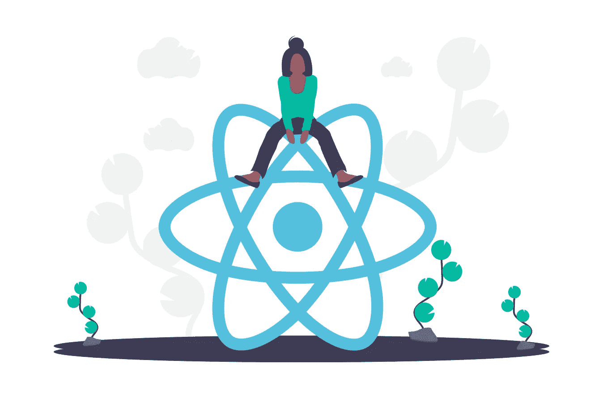
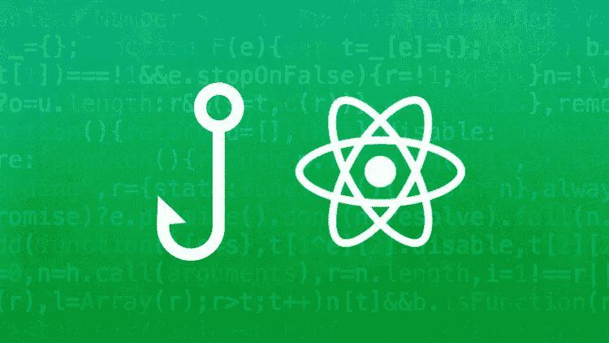
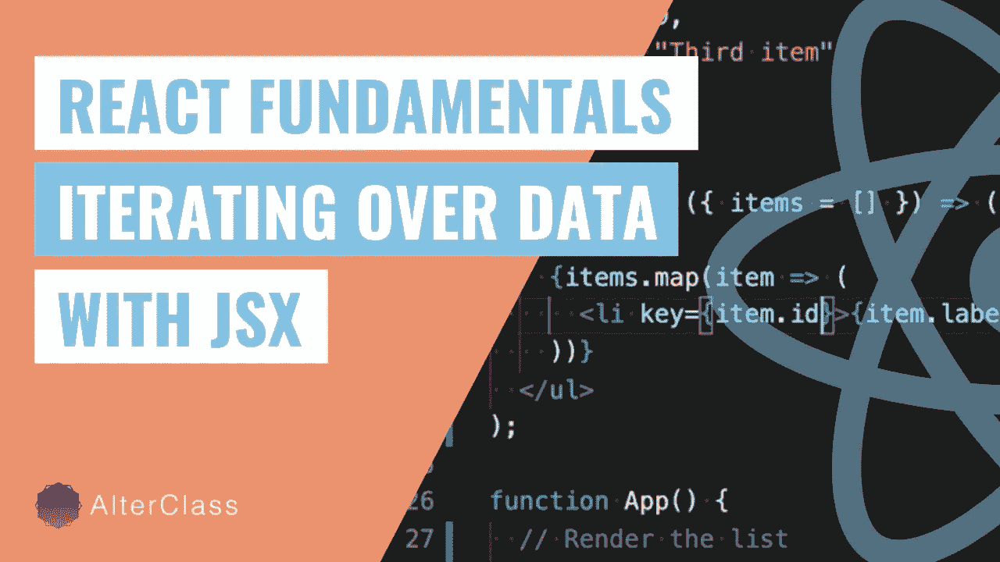

# 2023 年免费学习 React.js 编码的 6 个最佳地点

> 原文：<https://medium.com/javarevisited/6-best-websites-to-learn-react-js-coding-for-free-ba7ec5c43433?source=collection_archive---------0----------------------->

## 免费学习 React.js 的网站、地点、平台和在线门户列表

image _ credit-un draw

如果你想学习 Reactjs 并寻找学习 React 的最佳地点，那么你来对地方了。此前，我已经分享了 [**2023 React.js 开发者路线图**](/javarevisited/the-2019-react-js-developer-roadmap-9a8e290b8a56) 、[最佳 React.js 课程](/@javinpaul/top-5-courses-to-learn-react-js-in-2019-best-of-lot-fa02cd96cdf0)和[书籍](/javarevisited/5-best-react-js-books-for-beginners-and-experienced-web-developers-e7b90b1ab9d2)，今天，我将分享免费在线学习 React 的最佳地点。

如果你不知道，React.js 是一个由脸书开发团队创建的 [Javascript 库](/javarevisited/10-of-the-most-popular-javascript-frameworks-libraries-for-web-development-in-2019-a2c8cea68094)和开源库，用于构建前端网站的 UI 或用户界面。

它使与你的网站的交互变得如此简单，比如一个单页应用程序，一个移动应用程序，像搜索栏这样的动态组件就是一个组件。

大多数前端页面实际上包含许多文件，如 [HTML](https://javarevisited.blogspot.com/2019/05/top-5-html-5-and-css-3-courses-for-web-developers.html) 、 [CSS](https://javarevisited.blogspot.com/2020/09/top-5-css-cascading-style-sheet-courses-for-beginners.html) 和 [JavaScript](https://javarevisited.blogspot.com/2018/06/top-10-courses-to-learn-javascript-in.html) ，可能还不止这些，但使用 React，您可以将所有工作合并到一个文件中，使网站加载速度更快。

此外，当你点击某个组件时，并不是渲染整个页面，你实际上只是渲染了那个组件，这使得它在视觉和速度上更强大。

鉴于 React.js 的强大功能及其受欢迎程度，大多数公司都使用 React.js 来构建他们的前端或 GUI。学习 [React.js](/javarevisited/10-free-angular-and-react-js-courses-from-udemy-and-coursera-best-of-lot-e67f7d811e6b) 对于想要成为全栈开发人员的初学者和有经验的 Java 开发人员都很有意义，在这些网站上你可以免费学习 React.js。

# 2023 年免费在线学习 React.js 的 6 个平台

这里列出了免费在线学习 React.js 的最佳地点，这些资源是我与 React 和 JavaScript 专家一起精心挑选的。

我有目的地选择尽可能少的资源，但仍然有一些选择。如果你有任何其他有用的免费教 React 开发的 React 网站，请随意提出建议。

## 1. [Udemy](https://click.linksynergy.com/deeplink?id=JVFxdTr9V80&mid=39197&murl=https%3A%2F%2Fwww.udemy.com%2Fcourses%2Fsearch%2F%3Fq%3Dreact%26src%3Dsac%26kw%3DReact)

这是在线学习编程和开发技能的最佳平台之一。Udemy 有数以千计的免费在线课程，涉及从市场营销到商业和技术的不同行业，各种编程语言 React 就是其中之一，仅这个主题就有三千多门课程。

当你搜索 Udemy 时，你会发现很多免费的 React js 课程，但并不是所有的课程都很好，有些很短，有些不是最新的，但仍然有很多**免费的 React 课程**值得加入，比如[**React JS Frontend Web Development for 初学者**](https://click.linksynergy.com/deeplink?id=JVFxdTr9V80&mid=39197&murl=https%3A%2F%2Fwww.udemy.com%2Fcourse%2Freact-tutorial%2F) ，这是一门最新的 React 课程，旨在教你钩子的基础知识以及使用 API 和其他一些小功能。

以下是 Udemy 上一些我最喜欢的免费 React.js 课程列表:

1.  [**反应过来基本只需 1 个小时**](https://click.linksynergy.com/deeplink?id=JVFxdTr9V80&mid=39197&murl=https%3A%2F%2Fwww.udemy.com%2Fcourse%2Freact-basic-in-just-1-hour%2F)
2.  [**反应基础**](https://click.linksynergy.com/deeplink?id=JVFxdTr9V80&mid=39197&murl=https%3A%2F%2Fwww.udemy.com%2Fcourse%2Freact-fundamentals%2F)
3.  [**React 与 Redux、React-Router、Hooks、Auth0**](https://click.linksynergy.com/deeplink?id=JVFxdTr9V80&mid=39197&murl=https%3A%2F%2Fwww.udemy.com%2Fcourse%2Fmodern-react%2F)
4.  [**构建你的第一个 React JS 应用**](https://click.linksynergy.com/deeplink?id=JVFxdTr9V80&mid=39197&murl=https%3A%2F%2Fwww.udemy.com%2Fcourse%2Fbuild-your-first-react-js-application%2F)
5.  [**用钩子对初学者做出反应— 2023**](https://click.linksynergy.com/deeplink?id=JVFxdTr9V80&mid=39197&murl=https%3A%2F%2Fwww.udemy.com%2Fcourse%2Freact-for-beginners-with-hooks-2021%2F)

这只是几个例子，我从 Udemy 上收集了一个免费的 React 课程列表，如果你需要更多的例子，你可以查看一下。Udemy 的另一个好处是，他们经常举办快闪销售，提供 200 美元的 React 课程，只需 9 美元，这几乎是免费的。

如果你能花几块钱学习像 React.js 这样有价值的东西，那么我也推荐你看看 Udemy 上 Maximillian Scwarzmuller 的[**React——完全指南**](https://click.linksynergy.com/deeplink?id=JVFxdTr9V80&mid=39197&murl=https%3A%2F%2Fwww.udemy.com%2Fcourse%2Freact-the-complete-guide-incl-redux%2F) 。

这不是免费的，而是最大的课程之一，旨在帮助您构建一个令人惊叹的有用的 React 应用程序，如单页应用程序，并学习高级 Redux routing 部署应用程序等。

<https://click.linksynergy.com/deeplink?id=JVFxdTr9V80&mid=39197&murl=https%3A%2F%2Fwww.udemy.com%2Fcourse%2Freact-the-complete-guide-incl-redux%2F>  

## 2. [Coursera](https://coursera.pxf.io/c/3294490/1164545/14726?u=https%3A%2F%2Fwww.coursera.org%2F)

Coursera 是另一个伟大的平台，它提供由世界各地的顶尖大学以及不同行业的组织(如数据科学和编程)创建的专业课程，React 是其中的一个教程。

从名为 [**的 React 最佳课程开始，使用 React**](https://coursera.pxf.io/c/3294490/1164545/14726?u=https%3A%2F%2Fwww.coursera.org%2Flearn%2Ffront-end-react) 进行前端 Web 开发，并将教您其组件和 JSX，然后学习一些高级概念，如 React 路由和设计单页面应用程序、流架构和 Redux 创建客户端-服务器通信，以及如何使用 REST API 等。

本课程也是香港大学 React.js 全栈 Web 开发的一部分。Coursera 上最受欢迎的 React 专业之一。

顺便说一下，当谈到加入这个课程时，你有两个选择，你可以单独加入这个课程，每个月花费大约 39 美元进行专业化，你也可以加入 [**Coursera Plus**](https://coursera.pxf.io/c/3294490/1164545/14726?u=https%3A%2F%2Fwww.coursera.org%2Fcourseraplus) 每个月花费 399 美元，这是 Coursera 的一个订阅计划，让你无限制地访问他们最受欢迎的课程、专业化、专业证书和指导项目。

<https://coursera.pxf.io/c/3294490/1164545/14726?u=https%3A%2F%2Fwww.coursera.org%2Fcourseraplus>  

## 3.【Reactjs.org T4(官网)

总是从官方文档中学习任何类型的编程语言或框架是一个好主意，因为它是由创建或开发该技术的专业人员编写的，所以它涵盖了每个方面，并且在他们的教程中几乎没有错误。

从安装环境开始，如将 react 添加到您的网站，并开始您的第一个 *Hello World 示例*，然后渲染元素和组件以及更多高级技术，如优化性能、构建您自己的钩子以及您将在文档中探索的更多内容。

## 4. [freeCodeCamp](https://www.freecodecamp.org/news/search/?query=react)

freeCodeCamp 是一个非营利组织，在他们的网站和 YouTube 频道上有超过六千个关于技术和编程的教程，他们的毕业生在毕业并参加了他们提供的课程后找到了一份好工作。

freeCodeCamp 和[Build a Online Store 上有许多很好的资源可以学习 React . js](https://www.youtube.com/watch?v=JgwI22y_eFA)是你可以看到的最好的项目之一，可以学习如何使用 React 和其他技术将它们结合起来创建一个有用的项目，并将其部署在 amazon web service AWS 中，并添加一些功能，如 strip payment，以便在一个视频中从头创建一个完整的商店。

你可以在这里观看免费的 React.js 课程:

## 5.[复数视线](https://pluralsight.pxf.io/c/1193463/424552/7490?u=https%3A%2F%2Fwww.pluralsight.com%2Flearn)

Pluralsight 是另一个电子学习网站或平台，有数千个由专业讲师创建的课程，因为这个网站限制任何人教学，如果他没有向人们提供的技能，其中一门课程是 React。

当谈到学习在 Pluralsight 上进行 React 时， [**使用 React 和 Redux**](https://pluralsight.pxf.io/c/1193463/424552/7490?u=https%3A%2F%2Fwww.pluralsight.com%2Fcourses%2Freact-redux-react-router-es6) 构建应用程序是针对对 javascript 和 React 有一些基本了解的中级人员的最佳课程，以便使用现代技术构建 React 应用程序。

如果你不是中级的，你想学习基础知识，那么你应该看看这个 React:大图课程针对的是刚刚开始 React 职业生涯的初学者。

顺便说一下，你需要一个 [Pluralsight 会员](https://pluralsight.pxf.io/c/1193463/424552/7490?u=https%3A%2F%2Fwww.pluralsight.com%2Flearn)才能加入这个 React 课程，费用大约是每月 29 美元或每年 299 美元(14%的折扣)。我向所有程序员强烈推荐这个订阅，因为它提供了超过 7000 个在线课程的即时访问，以学习任何技术技能。或者，你也可以使用他们的 [10 天免费试用](https://pluralsight.pxf.io/c/1193463/424552/7490?u=https%3A%2F%2Fwww.pluralsight.com%2Flearn)来免费观看这个 React 课程。

<https://pluralsight.pxf.io/c/1193463/424552/7490?u=https%3A%2F%2Fwww.pluralsight.com%2Flearn>  

## 6. [AlterClass](https://www.alterclass.io/courses/react?ref=5ef9b5f324fba57c45713ca0)

这是另一个在线了解 Reactjs 的好网站。它有一个收费最高的在线 React 课程，涵盖了成为 React 专家所需了解的一切，但你可能不知道它还有一个免费模块，你可以免费学习 React 基础知识。

Alterclass 上的 [**React 基础课程**](https://www.alterclass.io/courses/react?ref=5ef9b5f324fba57c45713ca0) 是完全免费的，足以学习 Rect js 框架的基础知识，如道具、状态管理和 JSX。

该课程由 Greg D'Angelo 教授，他是一名高级软件工程师和导师，专门教授 React、 [JavaScript](/javarevisited/10-best-online-courses-to-learn-javascript-in-2020-af5ed0801645) 等内容。在过去的几年里，他一直与 [React](/javarevisited/10-free-angular-and-react-js-courses-from-udemy-and-coursera-best-of-lot-e67f7d811e6b) 、 [Node](/javarevisited/top-10-online-courses-to-learn-node-js-in-depth-8ef0e31ca139) 和 [MongoDB](/javarevisited/5-best-mongodb-courses-to-learn-nosql-for-beginners-in-2020-42df5af5496c) 合作，在广泛的行业中构建大规模的生产应用程序

以上是 2023 年免费学习 React 的前 6 名。你可以加入这些网站中的任何一个，从 2023 年开始学习 Reactjs。每个人都希望为他们的网站或移动应用程序创建一个良好的用户界面，因为这给了他们竞争优势，使用户的数字交互更加容易和简单，这将为他们赢得更多的客户和利润，这可以通过名为 React 的 Javascript 库来实现。

在学习 React.js 之后，你还可以探索 React Native，为移动应用开发高质量的前端。React Native 最棒的一点是，您可以利用 JavaScript 和 React.js 知识来构建跨平台的应用程序。

您可能喜欢的其他 **React.js 和 Web 开发文章**

*   [来自 Pluralsight 的十大 React 课程](https://javarevisited.blogspot.com/2020/08/top-10-pluralsight-courses-to-learn-React.js.html)
*   [10 门免费 React.js 课程学习钩子和上下文 API](/javarevisited/top-10-free-courses-to-learn-react-js-c14edbd3b35f?source=extreme_main_feed----d3a191ac6ed-----5-1--------------------561c2dc6_a2b4_41e0_b7be_1d97edbf631c--8)
*   [React 开发人员的 5 大 Gatsby 课程](https://javarevisited.blogspot.com/2020/09/top-5-online-courses-to-learn-gatsby-in.html)
*   [为开发者提供 10 门免费的 Angular 和 React 课程](https://javarevisited.blogspot.com/2019/04/10-free-angular-and-react-courses-for.html)
*   [2023 年学习 Web 开发的五大课程](https://javarevisited.blogspot.com/2018/02/top-5-online-courses-to-learn-web-development.html)
*   [学习大数据和 Apache Spark 的 5 门课程](http://javarevisited.blogspot.com/2017/12/top-5-courses-to-learn-big-data-and.html)
*   [为网络开发者提供 12 门免费的 JavaScript 课程](/javarevisited/12-free-courses-to-learn-javascript-and-es6-for-beginners-and-experienced-developers-aa35874c9a32)
*   [2023 年网络开发者路线图](https://javarevisited.blogspot.com/2019/02/the-2019-web-developer-roadmap.html)
*   [面向 Java 开发者的 5 门免费 Spring 框架课程](http://www.java67.com/2017/11/top-5-free-core-spring-mvc-courses-learn-online.html)
*   [2023 年学习 React Native 的 5 门课程](http://javarevisited.blogspot.sg/2018/02/5-react-native-courses-to-learn-mobile-development-using-JavaScript.html)
*   [我最喜欢的学习网页开发的课程](/better-programming/my-5-favorite-courses-to-learn-web-development-in-2019-a5e74167f8b2)
*   [面向 Web 开发人员的十大 JavaScript 教程和课程](https://javarevisited.blogspot.com/2018/06/top-10-courses-to-learn-javascript-in.html)
*   [3 门最适合初学者的 Svelete.js 课程](https://javarevisited.blogspot.com/2020/05/top-3-courses-to-learn-sveltejs-in-2020.html)
*   [10 个免费的初学者角度课程](/javarevisited/top-10-free-courses-to-learn-angular-framework-in-2020-bb62148c73d3)
*   [2023 年学习 Python 的 5 大课程](http://www.java67.com/2018/02/5-free-python-online-courses-for-beginners.html)
*   开发人员应该知道的 10 个 JavaScript 框架 full stack
*   [学习 Web 开发 Python 的十大课程](/javarevisited/top-10-courses-to-learn-python-for-web-development-in-2020-best-of-lot-efe11fb6d212)
*   [深入学习 JavaScript 的 10 门最佳课程](/javarevisited/10-best-online-courses-to-learn-javascript-in-2020-af5ed0801645)
*   初学者学习打字稿的 7 门最佳课程

感谢您阅读本文。如果你喜欢这些*免费的 React.js 网站*，请分享给你的朋友和同事。如果您有任何问题或反馈，请留言。

万事如意。

**P. S.** —如果你此刻只想做一件事来启动你的 React.js 之旅，就去参加 Udemy 上 Stephen Grider 的[**The Modern React with Redux【2023 Update】**](https://click.linksynergy.com/deeplink?id=JVFxdTr9V80&mid=39197&murl=https%3A%2F%2Fwww.udemy.com%2Fcourse%2Freact-redux%2F)课程吧。你会很快学会 React.js，永远不会后悔你的决定。

<https://click.linksynergy.com/deeplink?id=JVFxdTr9V80&mid=39197&murl=https%3A%2F%2Fwww.udemy.com%2Fcourse%2Freact-redux%2F> 